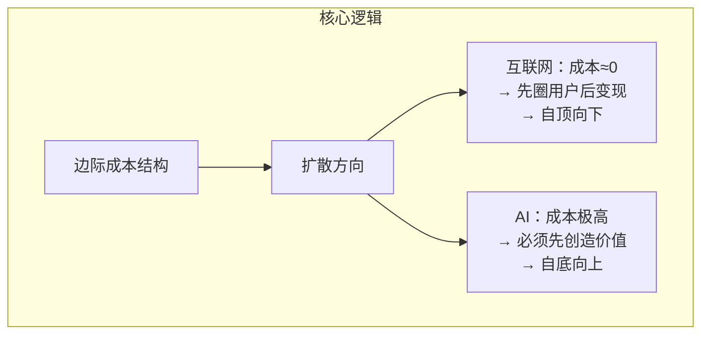
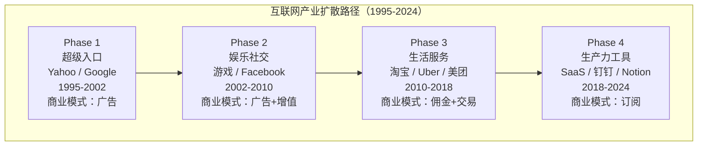
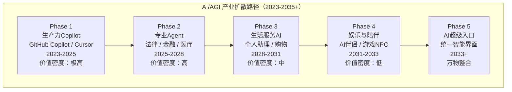
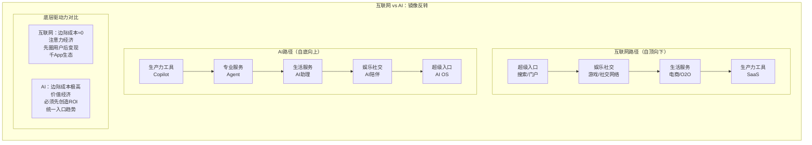
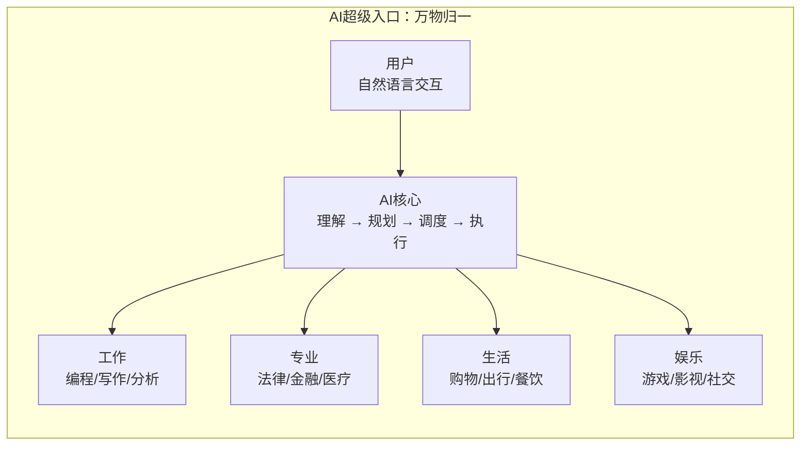
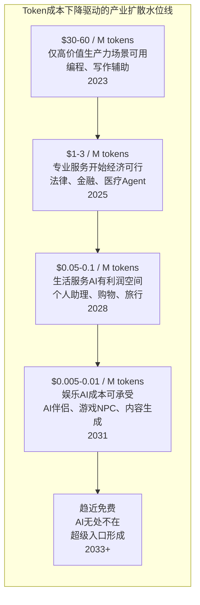
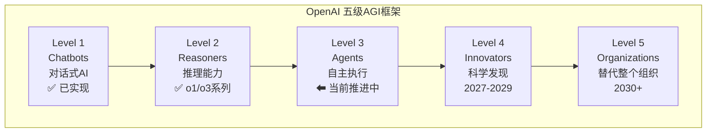
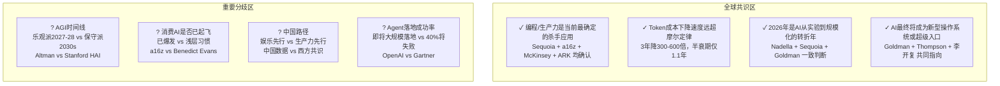
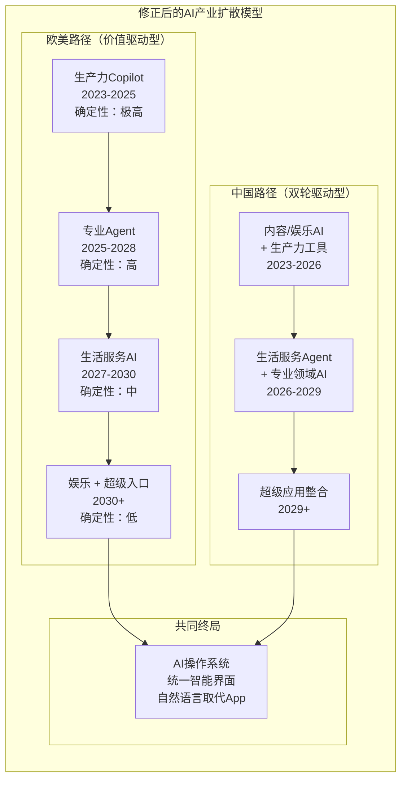
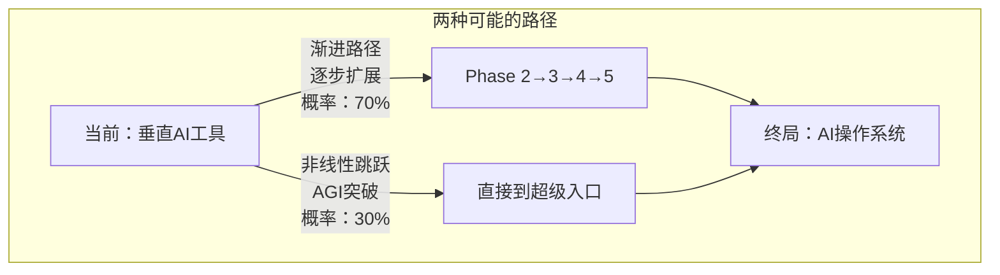

# AGI 发展路径推演：与互联网的镜像反转

> 一份基于成本结构、价值密度与全球12个顶级信源调研的产业扩散路径分析
>
> 2026年4月

---

## 目录

- [一、核心命题：为什么AI和互联网走了相反的路](#一核心命题为什么ai和互联网走了相反的路)
- [二、互联网30年：一部"自顶向下"的扩散史](#二互联网30年一部自顶向下的扩散史)
- [三、AI/AGI路径推演：一部"自底向上"的价值攀升史](#三aiagi路径推演一部自底向上的价值攀升史)
- [四、镜像反转：两条路径的结构性对比](#四镜像反转两条路径的结构性对比)
- [五、五阶段详细推演](#五五阶段详细推演)
- [六、Token成本：驱动一切的隐藏变量](#六token成本驱动一切的隐藏变量)
- [七、全球知名博主与机构的类似推演](#七全球知名博主与机构的类似推演)
- [八、修正后的综合推演模型](#八修正后的综合推演模型)
- [九、非线性跳跃：iPhone式的范式突变](#九非线性跳跃iphone式的范式突变)
- [十、对从业者的启示](#十对从业者的启示)
- [附录：参考来源](#附录参考来源)

---

## 一、核心命题：为什么AI和互联网走了相反的路

如果你问一个2010年的互联网创业者"新技术怎么落地"，他会脱口而出：**先做用户量，再想怎么赚钱**。Facebook如此，Twitter如此，中国的微博、微信也如此。整个互联网时代的底层逻辑是——边际成本趋近于零，所以先烧钱圈用户，后寻找商业模式。

但AI时代的逻辑完全反过来了。

每一次用户对话、每一次模型推理，都消耗真金白银的算力。GPT-4刚发布时，每百万Token成本高达$60；即便到了2026年，前沿推理模型的成本虽然大幅下降，但依然远非"免费"。这意味着AI产品无法像互联网产品那样"先免费获客、后广告变现"——它必须从第一天起就创造足够的价值来覆盖成本。

这个看似简单的成本结构差异，导致了两条截然不同的产业扩散路径：

| 维度 | 互联网 | AI |
|------|--------|-----|
| **边际成本** | 趋近于零 | 极高（Token/算力） |
| **首要目标** | 获取用户（眼球经济） | 创造价值（效率经济） |
| **扩散方向** | 自顶向下：入口→娱乐→服务→生产力 | 自底向上：生产力→专业→服务→娱乐→入口 |
| **商业模式** | 先免费后变现（广告→电商→SaaS） | 从第一天起就必须有ROI |
| **终局形态** | 千App生态（垂直UI各不同） | 统一入口（自然语言是万能界面） |

这不是猜测，而是由**经济学第一性原理**驱动的必然结果。

---

## 二、互联网30年：一部"自顶向下"的扩散史

在推演AI的未来之前，我们先回顾互联网走过的路。只有理解了互联网"为什么那样走"，才能理解AI"为什么不会那样走"。

### Phase 1：超级入口（1995-2002）

互联网的第一波落地不是电商、不是社交，而是**信息入口**。Yahoo、AOL、Google——它们做的事情本质上是"帮你找到网页"。原因很简单：当一种新媒介出现时，人们首先需要的是**导航**。报纸时代有目录，电视时代有频道，互联网时代有搜索引擎和门户。

这个阶段的商业模式是**广告**——流量即金钱，用户注意力直接变现。

### Phase 2：娱乐与社交（2002-2010）

导航问题解决之后，人们开始在互联网上**消磨时间**。网络游戏（魔兽世界、盛大）、社交网络（Facebook、人人网）、视频（YouTube、优酷）相继爆发。

为什么娱乐和社交排在第二？因为互联网的边际成本极低——一段视频上传后，无论被1人看还是1亿人看，服务器成本几乎不变（相对于收入而言）。这使得**低ARPU、高用户量**的消费级应用成为可能。

### Phase 3：生活服务（2010-2018）

移动互联网的普及（iPhone 2007年发布）解锁了**基于位置的服务**。淘宝/天猫、Uber、美团、Airbnb——互联网开始从"信息层"渗透到"交易层"，从线上延伸到线下。

这个阶段需要更重的运营（物流、配送、线下团队），所以排在娱乐之后。

### Phase 4：生产力工具（2018-2024）

最后，互联网才深入到**工作场景**。Slack、Notion、钉钉、飞书、Figma——企业级SaaS的爆发是互联网时代的"最后一公里"。

为什么生产力排在最后？因为改变工作习惯的阻力远大于改变娱乐习惯。企业采购决策慢、安全合规要求高、迁移成本大。

**总结**：互联网的扩散遵循"**低阻力→高阻力**"的逻辑——先进入改变成本最低的领域（看网页、刷视频），最后才进入改变成本最高的领域（企业工作流程）。驱动力是**免费获客+广告变现**的飞轮。

---

## 三、AI/AGI路径推演：一部"自底向上"的价值攀升史

AI的扩散逻辑恰好相反。不是"先低阻力后高阻力"，而是"**先高价值后低价值**"。

原因很直接：Token贵，所以必须先在那些"贵也值得"的场景落地。一个程序员月薪$15,000，一个AI编程助手月费$200——只要能提升10%的效率，就是赚到了。但如果是帮你点一份$10的外卖，花$0.50的Token成本来完成——利润空间就很薄了。

这就是为什么AI会沿着"**价值密度从高到低**"的顺序扩散：

每一个阶段的开启，都依赖于Token成本下降到一个新的阈值。成本每下降一个数量级，就解锁一批新的应用场景——这就是AI产业扩散的"水位线"模型。

---

## 四、镜像反转：两条路径的结构性对比

把互联网和AI的扩散路径放在一起看，你会发现一个完美的**镜像关系**：

这种镜像关系不是巧合，而是由**三个结构性差异**决定的：

### 差异一：成本结构

互联网的边际成本趋近于零（一个用户看网页和一亿用户看网页，服务器成本差异不大），所以可以先"撒网"再"收网"。AI的边际成本与使用量正相关（每次推理都消耗算力），所以必须确保每次使用都创造足够的价值。

### 差异二：价值创造方式

互联网主要通过**连接**创造价值——连接人与信息（搜索）、人与人（社交）、人与商品（电商）。连接的价值随网络效应指数增长，所以先做规模。AI主要通过**替代或增强人类劳动**创造价值——替代编程、替代审计、替代客服。替代的价值直接可量化（省了多少人力），所以先做ROI最高的场景。

### 差异三：终局形态

互联网形成了"**千App**"格局——每个垂直场景都需要独立的UI和交互设计（外卖App、打车App、社交App各不相同）。AI可能形成"**一个入口**"格局——因为自然语言是万能界面，你不需要为"点外卖"和"打车"设计两个不同的App，只需要对AI说一句话。

---

## 五、五阶段详细推演

### Phase 1：生产力Copilot（2023-2025）—— 当前阶段

**为什么先落地在这里？**

这是一道简单的数学题。一个硅谷软件工程师的年薪是$200,000+，折合时薪约$100。GitHub Copilot每月$19，Cursor每月$20-40，Claude Code订阅$200/月。如果这些工具能节省一个工程师哪怕10%的时间——每月省下约$1,700的人力成本——ROI就是极其清晰的。

这也是为什么**编程**成为了AI的第一个杀手应用，而不是写作、翻译或其他看起来更"大众"的场景。编程的时薪足够高，高到可以轻松覆盖Token成本。

| 维度 | 分析 |
|------|------|
| **核心逻辑** | ROI最清晰——程序员时薪高、效率提升可量化、企业付费意愿强 |
| **代表产品** | GitHub Copilot、Cursor、Claude Code、ChatGPT Plus、通义灵码 |
| **商业模式** | 订阅制（$20-200/月），企业席位采购 |
| **Token成本承受力** | 极高。$200/月的工具若能省20%工时，ROI > 10x |
| **关键特征** | 人机协作模式——AI辅助，人类决策 |
| **当前数据** | Sequoia称编程和ChatGPT是两大杀手应用，预计逼近百亿美元营收 |

**类比互联网**：相当于互联网时代的"企业上网"——虽然不是最性感的故事，但是最扎实的商业模式。

### Phase 2：专业Agent（2025-2028）

**为什么是第二步？**

专业服务的**单次决策价值**极高。一份法律意见书$500-5,000，一次金融尽调数万美元，一个医疗诊断无价。这些场景的Token成本占比极低（可能只有价值的1-5%），所以即使推理成本仍然较高，也完全经济可行。

更关键的是，专业服务的"供给侧"存在严重瓶颈——全球优秀律师、医生、金融分析师的数量是有限的。AI Agent不是要"取代"他们（至少初期不是），而是要**把稀缺的专业能力规模化**。

| 维度 | 分析 |
|------|------|
| **核心逻辑** | 单次决策价值极高，Token成本占比低，经济模型天然成立 |
| **典型场景** | AI律师助手、金融分析Agent、医疗辅助诊断、税务规划、合规审计 |
| **商业模式** | 按结果收费 / 按项目收费 / Agent-as-a-Service（高盛预测的模式） |
| **关键突破点** | 模型能力突破"专家级"门槛、行业合规认证、责任归属法律框架 |
| **关键特征** | 从Copilot到Agent的跃迁——AI从"辅助"走向"自主执行" |
| **关键风险** | Gartner预测40%+的Agent项目将在2027年前取消（成本和ROI不清晰） |

**这个阶段的里程碑事件**：当第一个AI Agent通过某个专业资格认证（比如律师资格、CFA），将标志着Phase 2的正式开启。

### Phase 3：生活服务AI（2028-2031）

**为什么排第三？**

生活服务的客单价低，利润率薄。点一份外卖$15，平台抽佣15%，利润$2.25。如果AI完成这次订单的推理成本是$0.50，那就吃掉了22%的利润——这在当前成本水平下是不可接受的。

但当Token成本再下降10-100倍（基于当前"超级摩尔定律"的下降速度，这可能在2028年前后实现），AI完成一次订单的成本降到$0.005时，生活服务AI就变得经济可行了。

| 维度 | 分析 |
|------|------|
| **核心逻辑** | 客单价低，需要Token成本降至极低才有利润空间 |
| **前置条件** | Token成本下降10-100倍、多模态成熟、实时交互延迟<1秒 |
| **典型场景** | AI管家（统一订餐/订票/购物）、健康顾问、教育辅导、旅行规划 |
| **商业模式** | 佣金制 / 统一订阅制 / 替代传统App |
| **关键特征** | AI开始整合碎片化服务，成为"服务聚合层"——一个AI替代20个App |
| **高盛预测** | 个人AI Agent将自动化当前手动完成的任务（航班取消→自动改签→调整会议→订餐） |

**类比互联网**：相当于互联网时代从PC端到移动端的跃迁——从"你去找服务"变成"服务来找你"。AI时代则更进一步——"AI替你完成一切"。

### Phase 4：娱乐与陪伴（2031-2033）

**为什么排第四？**

娱乐的经济模型和生产力完全不同。娱乐的ARPU（每用户平均收入）低，但**使用时长极高**。一个用户可能每天花2小时和AI聊天、玩AI游戏、看AI生成的内容——这意味着**每分钟的Token成本必须极低**。

以当前价格估算，一个用户每天和AI对话2小时，大约消耗50万Token，成本约$0.08（使用经济型模型）。如果要做到更丰富的交互（多模态、实时语音、个性化内容生成），成本可能是这个数字的10-50倍。只有当成本降到现在的1/100甚至1/1000时，大规模的AI娱乐才能实现正向经济循环。

此外，娱乐AI还需要技术上的额外突破——**情感计算、长期记忆、人格一致性**。你可以接受一个编程助手偶尔"失忆"，但不能接受一个AI伴侣明天就忘了今天聊过的内容。

| 维度 | 分析 |
|------|------|
| **核心逻辑** | ARPU低但时长高，每分钟成本必须极低，且需要情感能力突破 |
| **前置条件** | Token成本降至当前的1/1000+、情感计算成熟、长期记忆与人格一致性 |
| **典型场景** | AI游戏NPC（无限剧情）、个性化影视生成、虚拟偶像、情感陪伴、AI社交 |
| **关键特征** | AI从**工具属性**转向**情感属性**——开始产生真正的"用户粘性" |
| **中国特例** | AI短剧、AI漫画在中国已经起量（短视频平台AI内容占比超30%），中国可能提前进入这个阶段 |

### Phase 5：AI超级入口（2033+）

**为什么是终局？**

当AI同时具备了生产力、专业服务、生活服务和娱乐四种能力时，一个自然的推论是：**你不再需要打开不同的App来完成不同的事情**。

今天你需要：打开Cursor写代码、打开美团点外卖、打开微信聊天、打开Netflix看剧。未来你只需要一个AI界面——用自然语言说出你想做的事，AI自动调度后端服务完成。

这就是高盛CIO所说的"**AI即操作系统**"，也是Ben Thompson的"**创意价值链最后瓶颈被移除**"后的必然结果。

| 维度 | 分析 |
|------|------|
| **核心逻辑** | 当AI全能力成熟时，自然语言成为万能界面，AI成为唯一入口 |
| **形态** | 统一的AI界面取代所有App、操作系统级别的智能体 |
| **关键特征** | 类似"AI版微信"——工作/生活/娱乐/社交一体化 |
| **高盛预测** | 2026年AI已开始作为"操作系统"运行——比本推演激进得多 |
| **Thompson框架** | AI移除了"创造"这个最后瓶颈后，App生态将被根本性重新定义 |

---

## 六、Token成本：驱动一切的隐藏变量

如果整篇文章只能记住一个观点，那就是这个：**Token成本曲线决定了AI产业扩散的节奏**。成本每下降一个数量级，就解锁一批新的应用场景。

### 6.1 实际数据：超级摩尔定律

根据ARK Invest、TokenCost以及最新学术研究（arxiv 2603.28576）的数据，AI推理成本的下降速度远超摩尔定律：

| 时间点 | 代表模型 | 成本（$/百万Token） | 相对GPT-4发布价 |
|--------|----------|--------------------:|:---------------:|
| 2023.03 | GPT-4 | $60.00 | 1x |
| 2024.01 | GPT-4 Turbo | $10.00 | 6x降幅 |
| 2024.07 | GPT-4o mini | $0.15 | **400x降幅** |
| 2025.01 | DeepSeek V3 | $0.07 | 857x降幅 |
| 2026.Q1 | 经济型模型均价 | ~$0.05 | **1200x降幅** |

**关键发现**：

- **经济型模型价格半衰期仅1.1年**（摩尔定律是2年，AI成本下降速度几乎是摩尔定律的2倍）
- **前沿推理模型存在31.5倍溢价**——推理能力强的模型降价慢，但绝对价格也在快速下降
- **驱动力是软件，不是硬件**——学术研究显示，软件/架构创新贡献了103.7%的成本下降，GPU硬件几乎没有贡献（-0.9%）
- **2024年5月是结构性拐点**——从"技术驱动降价"转向"竞争驱动降价"（DeepSeek引发全球价格战）

### 6.2 Token成本与产业扩散的对应关系

### 6.3 三个成本加速器

为什么Token成本能以如此惊人的速度下降？三个互相叠加的因素：

1. **架构创新**（主因）：模型蒸馏（小模型学大模型）、量化（降低计算精度）、MoE（混合专家架构，只激活部分参数）、推测解码等技术不断压缩单次推理的计算量。

2. **规模效应**：全球数据中心投资从2025年的$5000亿扩展至2030年的$1.4万亿（ARK数据），规模化部署摊薄了固定成本。

3. **市场竞争**：OpenAI、Anthropic、Google、DeepSeek、阿里等玩家的价格战。特别是2024年5月DeepSeek以低于西方对手90%的价格入场，引发了全行业的结构性降价。

---

## 七、全球知名博主与机构的类似推演

为验证上述"镜像反转"推演的合理性，我们对全球12个顶级信源进行了深度调研。整体发现：**多数头部机构和博主认同"AI先生产力、后消费"的大方向**，但在具体节奏和路径上各有侧重，且存在有价值的分歧。

### 7.1 Sam Altman / OpenAI：五级AGI路线图

OpenAI内部使用一个五级发展框架，是目前业界最广为引用的AGI阶段划分：

**与本文推演的关系**：OpenAI的框架侧重**能力维度**（AI能做什么），本文侧重**产业维度**（AI先在哪落地）。两者互补——Level 3 Agent对应本文Phase 2专业Agent，Level 5 Organization对应Phase 5超级入口。Altman预测AGI（Level 4-5）2027-2028实现，比本文推演更激进。

Altman定义AGI为"一个高度自主的系统，在大多数有经济价值的工作上超越人类"。值得注意的是，他区分了AGI和"超级智能"——后者的时间线更远。

> **来源**：[OpenAI内部五级框架](https://raiabot.com/blog/Understanding_OpenAIs_FiveLevel_System_on_the_Path_to_AGI.html)；[Sam Altman 2026访谈](https://neuraplus-ai.github.io/blog/sam-altman-interview-2026.html)

### 7.2 Dario Amodei / Anthropic：五领域影响框架

Anthropic CEO Dario Amodei在其14,000字长文 *Machines of Loving Grace* 中，从**影响领域**而非时间线来推演AI的渗透顺序：

1. **生物医学与健康** — AI加速药物研发和诊断，最先受益
2. **神经科学与心理健康** — 紧随其后
3. **经济发展与脱贫** — AI作为生产力倍增器
4. **和平与治理** — AI辅助决策
5. **工作与意义** — 最后才是对人类工作本身的根本性重塑

Amodei的排序逻辑和本文高度一致——**价值密度最高的专业领域率先受益**（医学、科学研发），而对"工作本质"的改变排在最后。他认为，部分正面影响可能在2026年就开始显现。

Amodei此前一直以强调AI风险著称，他解释说之所以写这篇"乐观长文"，是因为"仅仅讨论风险是不够的——我们需要知道我们在为什么而战"。

> **来源**：[Machines of Loving Grace](https://darioamodei.com/essay/machines-of-loving-grace)

### 7.3 Satya Nadella / Microsoft：三阶段企业AI采纳模型

Microsoft CEO Satya Nadella将2026年定义为AI从"发现到扩散"（discovery to diffusion）的转折年，并提出企业AI的三阶段模型：

- **Phase 1: Human with Assistant** — 每个员工配备AI助手（当前阶段）
- **Phase 2: Human-Agent Teams** — AI作为"数字同事"加入团队，承担具体任务
- **Phase 3: Human-Led, Agent-Operated** — 人类设定方向，Agent执行完整业务流程

Nadella用Microsoft自身验证了这一路径：**收入扩展至$900亿、利润翻倍，而员工数保持平稳**。他的框架聚焦于企业内部的AI渗透深度，是本文Phase 1到Phase 2的微观展开。

他特别强调，真正的影响需要**多模型、多Agent的协同编排**，而非依赖单一模型——当前存在"模型过剩"（model overhang），即模型能力增长速度超过了企业实际采纳速度。

> **来源**：[Microsoft 2026 AI转型](https://m.economictimes.com/tech/artificial-intelligence/2026-will-be-pivotal-to-ais-transition-from-discovery-to-diffusion-microsoft-ceo-satya-nadella/articleshow/126246925.cms)

### 7.4 Benedict Evans：消费AI的"浅层习惯"警告

Benedict Evans是硅谷最受尊重的独立科技分析师之一，他提出了一个重要的**反面观点**，值得任何推演框架认真对待：

- ChatGPT虽然2个月破亿用户（人类历史最快），但**大多数用户试用后没有形成持续使用习惯**
- 消费者AI采纳呈现"**宽漏斗窄底部**"——好奇尝试的人多，真正日常使用的人少
- AI是**技术赋能层**（technology enabler）而非成品，需要被"拆分"（unbundling）为具体有用的应用
- 与互联网对比：互联网花了**20年**才把20%的零售搬到线上，AI改变用户习惯同样需要漫长时间
- 与以往所有平台转移不同，AI的关键不确定性在于：**我们不知道它还能变多好**

Evans的观察精准解释了为什么AI不能复制互联网"先消费者后企业"的路径——消费者端缺乏强刚需和使用习惯，而企业端有明确的效率提升需求和付费意愿。

> **来源**：[The AI Summer](https://www.ben-evans.com/benedictevans/2024/7/9/the-ai-summer)；[AI Metrics](https://www.ben-evans.com/benedictevans/2025/6/9/generative-ais-metrics-question)

### 7.5 Ben Thompson / Stratechery："桥梁理论"与"创意价值链"

Ben Thompson提出了两个极具洞察力的框架：

**桥梁理论**：每次计算范式转移中，上一代的应用层是下一代的桥梁。大型机→PC→移动→穿戴设备，每次都通过应用层完成过渡。生成式AI是从当前触屏交互到下一代语音/手势/脑机接口的桥梁。

**创意价值链**：人类历史上的技术革命，本质上是在逐步移除"创意传播链"中的瓶颈：
- 印刷术移除了**复制**瓶颈
- 互联网移除了**分发**瓶颈
- AI正在移除最后一个瓶颈——**创造本身**

当"创造"不再是瓶颈时，自然语言成为通用界面，App生态将被根本性重新定义——这直接支持了本文"AI超级入口"作为终局的判断。

> **来源**：[The Gen AI Bridge to the Future](https://stratechery.com/2024/the-gen-ai-bridge-to-the-future/)；[The AI Unbundling](https://stratechery.com/2022/the-ai-unbundling/)

### 7.6 Sequoia Capital："双面AI"与杀手应用

红杉资本在 *AI in 2026: A Tale of Two AIs* 中指出一个关键悖论：

- **供给侧延迟**：数据中心建设受限于TSMC产能、变压器/冷却组件供应链瓶颈。尽管TSMC自2022年以来收入增长50%，但资本开支仅增长10%——产能扩张远跟不上需求。
- **需求侧加速**：AI应用采纳急剧加速，2025年出现了"从0到1亿美元"俱乐部，2026年将出现"从0到10亿美元"俱乐部。
- **两大杀手应用**：**编程（Coding）和ChatGPT**，预计均将逼近或超过百亿美元年营收。
- **企业困境**：大企业内部实施AI困难重重，导致"AI疲劳"和失望——这反而创造了专业方案提供商的机会。

Sequoia的观察直接支持本文核心论点——**编程/生产力是第一个确定性杀手应用**，而不是消费端的娱乐或社交。

> **来源**：[AI in 2026: A Tale of Two AIs](https://www.sequoiacap.com/article/ai-in-2026-the-tale-of-two-ais/)

### 7.7 a16z（Andreessen Horowitz）：企业+消费双轨数据

a16z提供了最翔实的第一手数据，揭示了一个需要对本文"严格线性"推演进行修正的现象：

**企业端**：
- Fortune 500中**29%**已成为AI创业公司的付费客户
- Global 2000中**19%**已在使用AI初创产品
- 企业AI采纳速度超过了以往任何技术周期

**消费端**：
- AI消费公司收入留存超过**100%**（"大扩张"效应）——用户随时间花费更多而非更少
- 消费AI公司正以史上最快速度达到$100M+ ARR
- ChatGPT周活达到**9亿用户**，是Gemini的2.7倍

**关键修正**：a16z的数据显示企业和消费AI**实际上在同步发展**，但企业端的价值更清晰、留存更稳定。现实不是严格的"先A后B"，而是"**A先确定，B也在发展但不确定性更高**"。

> **来源**：[企业AI采纳](https://a16z.com/where-enterprises-are-actually-adopting-ai/)；[消费AI Top 100](https://a16z.com/100-gen-ai-apps-6)；[大扩张](https://a16z.com/the-great-expansion-a-new-era-of-consumer-software/)

### 7.8 Goldman Sachs："AI即操作系统"

高盛CIO Marco Argenti发布了2026年AI七大预测，其中最核心的观点是：

- AI模型将作为**新型操作系统**运行——独立访问工具、浏览网页、操作文件、执行多步骤任务
- **个人AI Agent**将自动化当前通过App手动完成的所有事务（示例：航班取消→自动改签→调整日程→预订餐厅）
- **Agent-as-a-Service**经济出现——企业部署多Agent团队，按**Token消耗计费**而非人头计费
- AI增长的真正瓶颈不是资金（华尔街预期2026年科技巨头资本开支超$5000亿），而是**电力**

高盛的"AI即操作系统"直接映射到本文Phase 5的"AI超级入口"概念。值得注意的是，他们预测这一转变**2026年就开始**——比本文推演的2033+激进得多。

> **来源**：[Goldman Sachs 2026 AI预测](https://www.goldmansachs.com/insights/articles/what-to-expect-from-ai-in-2026-personal-agents-mega-alliances)

### 7.9 McKinsey：行业渗透优先级

McKinsey的研究提供了最具体的行业渗透数据，堪称"价值密度驱动落地顺序"的实证：

- 生成式AI可为全球经济新增**$2.6-4.4万亿/年**
- **75%的价值集中在四个领域**：客户运营、营销销售、软件工程、研发
- 按行业分：银行业$2000-3400亿/年，零售/消费品$4000-6600亿/年
- 50%的现有工作活动可在**2030-2060年间**自动化（中位数2045年）
- 截至2025年，88%的组织在至少一个业务功能中使用AI，但仅1/3开始规模化部署

McKinsey的数据完美印证了本文的核心框架：软件工程和研发（生产力）排在价值前列，消费娱乐不在第一梯队。

> **来源**：[McKinsey生成式AI经济潜力报告](https://www.mckinsey.com/capabilities/mckinsey-digital/our-insights/the-economic-potential-of-generative-AI-the-next-productivity-frontier)

### 7.10 ARK Invest：Token成本的"大崩溃"

ARK Invest（Cathie Wood）提供了最乐观也最详尽的Token成本预测，是本文"成本驱动扩散"框架的最强数据支撑：

- AI推理成本**1年内下降99%**
- AI训练成本**年降75%**
- 代码生成成本**8个月内**从$3.50降至$0.32/百万Token（降幅91%）
- AI Agent能处理的任务时长从**6分钟扩展至31分钟**（5倍提升）
- 到2030年，AI Agent可编排**超过$8万亿**的在线购买，占全球电商的25%
- 预计全球生产力增长加速至**4-6%**

ARK的数据意味着：成本每下降一个数量级就解锁一批新应用场景——这正是本文推演的底层逻辑。

> **来源**：[ARK Big Ideas 2026](https://quasa.io/media/ark-s-big-ideas-2026-cathie-wood-s-vision-of-an-ai-powered-future)

### 7.11 李开复 / 01.AI："第三次IT革命"

01.AI创始人、前Google大中华区总裁李开复提出了几个独特视角：

- AI是继PC、移动互联网后的**第三次IT革命**——但这次革命改变的不是连接方式，而是每个应用本身
- 当前AI生态**倒挂**——芯片公司（NVIDIA）赚最多钱，应用层反而亏损。预计2年内回归正常（应用层最赚钱→平台层→芯片层）
- 2025年是"AI大规模应用元年"，采纳周期将快于云计算
- 大多数传统企业**没有准备好**AI转型——百分之一的公司才具备深度AI转型的条件，需要CEO亲自领导并设立Chief AI Officer

李开复特别指出了**中国市场的独特性**：中国消费互联网更发达，AI在娱乐/内容生成方面的落地速度可能快于欧美。

> **来源**：[Kai-Fu Lee AI预测](https://www.aibase.com/news/15785)；[AI's next frontier](https://kr-asia.com/kai-fu-lee-on-ais-next-frontier-from-scaling-law-to-application-first-strategies)

### 7.12 中国市场特殊路径

中文世界的调研（腾讯新闻、与非网等）揭示了一个值得单独讨论的现象：

- **中国AI先在内容/娱乐领域起量**：AI短剧、AI视频已成为商业化最成熟场景，短视频平台AI内容占比**超30%**
- **原因**：中国消费互联网基础设施极其完善（抖音/快手/B站的内容分发效率全球领先），消费者对AI生成内容的接受度高，付费习惯已养成
- AI编程在初创公司已达**99%+使用率**，但传统大企业渗透率仍然很低
- 2026年关键转折：从"单点AI能力"向"模块化AI协同"演进

**对本文推演的重要修正**："镜像反转"（先生产力后消费）更适用于**欧美市场**（企业付费意愿强、知识工作者薪资高），而中国可能走出"**娱乐+生产力并行发展**"的第三条路径。

> **来源**：[腾讯新闻AI产业2026](https://news.qq.com/rain/a/20260131A06IF900)；[与非网AI行业深度分析](https://www.eefocus.com/article/1982556.html)

### 全球观点汇总：共识与分歧

---

## 八、修正后的综合推演模型

结合全球12个信源的调研，对原始推演进行三处关键修正：

### 修正一：不是严格线性，而是"波浪式渗透"

a16z的数据清楚表明，企业AI和消费AI实际上在**同步发展**，只是成熟度和确定性不同。更准确的模型不是"先A后B"，而是"**A先确定，B也在发展但风险更高**"——各阶段之间有显著重叠。

### 修正二：中美路径分化

中国因为消费互联网基础设施更完善（抖音、快手、B站的内容分发体系全球领先），AI在内容/娱乐领域的落地速度可能快于欧美。中国可能走出"**娱乐+生产力双轮驱动**"的独特路径。

### 修正三：超级入口可能提前到来

高盛预测2026年AI就开始作为"操作系统"运行。Token成本3年降300-600倍的速度意味着，本文原始推演中各阶段的时间窗口可能需要**整体前移3-5年**。

---

## 九、非线性跳跃：iPhone式的范式突变

上述推演都是**线性**的——假设AI产业像水一样，从高价值场景逐渐"流"向低价值场景。但历史告诉我们，重大技术变革往往不是线性发生的。

2007年iPhone的发布没有遵循"功能手机逐步进化"的路径——它直接跳到了触屏智能机，一夜之间重新定义了移动计算。同样，如果某家公司率先实现了真正的AGI（通用人工智能），它可能直接跳到"超级入口"阶段，跳过中间的逐步渗透。

支持"非线性跳跃"可能性的信号：
- Sam Altman声称"我们已经知道如何构建AGI"
- OpenAI的o系列推理模型在数学、编程等维度已接近人类专家水平
- 斯坦福研究人员认为AGI可能只有3年之遥
- 但Stanford HAI同时指出"2026年不会有AGI"——学术界总体比产业界更保守

**对从业者的含义**：即使押注渐进路径（概率更高），也要对"iPhone时刻"保持警惕。如果突然出现了一个能做所有事情的AGI，你的垂直AI工具的护城河可能一夜之间消失。

---

## 十、对从业者的启示

### 短期（2024-2026）：押注确定性

- **最确定的赛道**：生产力工具和企业AI（编程、写作、数据分析）
- **理由**：所有顶级机构一致认同，Sequoia称之为"杀手应用"
- **策略**：做高价值场景的AI，不要做"AI替你点外卖"——现在还不是时候

### 中期（2026-2030）：深入垂直领域

- **最大的机会窗口**：专业领域垂直Agent（法律、金融、医疗、教育）
- **护城河**：行业知识、数据壁垒、合规资质——纯技术不构成壁垒
- **风险**：Gartner警告40%+的Agent项目将失败——选对场景比技术实现更重要

### 远期（2030+）：准备范式转换

- **关键信号**：当Token成本降至当前的1/1000时，消费级AI和AI超级入口将爆发
- **所需能力**：极致的用户体验设计、情感计算、长期记忆技术
- **可能的"iPhone时刻"**：如果某家公司突然推出真正的AGI，整个产业格局可能在12个月内重塑

### 关键观察指标

1. **Token成本曲线**：它是所有阶段转换的"发令枪"。关注ARK和TokenCost的追踪数据。
2. **Agent成功率**：如果2027年前Agent项目的成功率超过60%（高于Gartner的悲观预期），Phase 2将加速到来。
3. **消费AI留存率**：Benedict Evans说"浅层习惯"，a16z说"收入留存>100%"——谁对了，决定了消费AI何时爆发。
4. **地域差异**：在中国市场，不要忽视内容/娱乐AI的先发机会；在欧美市场，企业生产力仍是主赛道。

---

## 结语：从"注意力经济"到"价值经济"

如果用一句话总结本文的核心论点：

> **互联网时代是"注意力经济"——谁抓住了眼球谁就赢了。AI时代是"价值经济"——谁创造了最高的ROI谁就先活下来。**

这个底层逻辑的转变，决定了AI不会重走互联网的路——它会走一条镜像反转的路径，从生产力出发，逐步渗透到专业服务、生活服务、娱乐，最终汇聚成一个统一的AI超级入口。

但路径的终点是一样的：**技术最终服务于人的全部需求**。互联网花了30年到达了"千App"的格局，AI可能只需要10年就到达"一个入口"的终局——因为自然语言是最简单、最直觉的界面，不需要为每个场景设计独立的交互。

在这条路上，Token成本是那条看不见的"水位线"——它每下降一个数量级，就淹没一批旧的商业模式，同时托起一批新的可能性。

关注那条线。它决定了一切。

---

## 附录：参考来源

| 编号 | 来源 | 核心观点 | 链接 |
|:----:|------|----------|------|
| 1 | OpenAI / Sam Altman | 五级AGI框架，预测2027-2028实现AGI | [链接](https://raiabot.com/blog/Understanding_OpenAIs_FiveLevel_System_on_the_Path_to_AGI.html) |
| 2 | Anthropic / Dario Amodei | 五领域影响框架，高价值专业领域率先受益 | [链接](https://darioamodei.com/essay/machines-of-loving-grace) |
| 3 | Microsoft / Satya Nadella | 企业AI三阶段模型，2026年为转折年 | [链接](https://m.economictimes.com/tech/artificial-intelligence/2026-will-be-pivotal-to-ais-transition-from-discovery-to-diffusion-microsoft-ceo-satya-nadella/articleshow/126246925.cms) |
| 4 | Benedict Evans | 消费AI"浅层习惯"，AI是技术赋能层而非成品 | [链接](https://www.ben-evans.com/benedictevans/2024/7/9/the-ai-summer) |
| 5 | Stratechery / Ben Thompson | AI是"创意价值链"最后瓶颈的移除者 | [链接](https://stratechery.com/2024/the-gen-ai-bridge-to-the-future/) |
| 6 | Sequoia Capital | 编程和ChatGPT是两大杀手应用，预计逼近百亿营收 | [链接](https://www.sequoiacap.com/article/ai-in-2026-the-tale-of-two-ais/) |
| 7 | a16z | 企业和消费AI同步增长，Fortune 500中29%已付费 | [链接](https://a16z.com/where-enterprises-are-actually-adopting-ai/) |
| 8 | Goldman Sachs | AI将作为新型操作系统运行，Agent-as-a-Service经济 | [链接](https://www.goldmansachs.com/insights/articles/what-to-expect-from-ai-in-2026-personal-agents-mega-alliances) |
| 9 | McKinsey | 生成式AI新增$2.6-4.4万亿/年，75%价值集中在四领域 | [链接](https://www.mckinsey.com/capabilities/mckinsey-digital/our-insights/the-economic-potential-of-generative-AI-the-next-productivity-frontier) |
| 10 | ARK Invest | Token成本1年降99%，生产力增长加速至4-6% | [链接](https://quasa.io/media/ark-s-big-ideas-2026-cathie-wood-s-vision-of-an-ai-powered-future) |
| 11 | 学术研究 (arxiv) | Token价格3年降300-600倍，软件创新贡献>100% | [链接](https://tokencost.app/blog/ai-price-index) |
| 12 | 李开复 / 01.AI | AI是第三次IT革命，中国市场可能走出独特路径 | [链接](https://www.aibase.com/news/15785) |
| 13 | 腾讯新闻 / 与非网 | 中国AI在内容/娱乐领域先行起量 | [链接](https://news.qq.com/rain/a/20260131A06IF900) |
