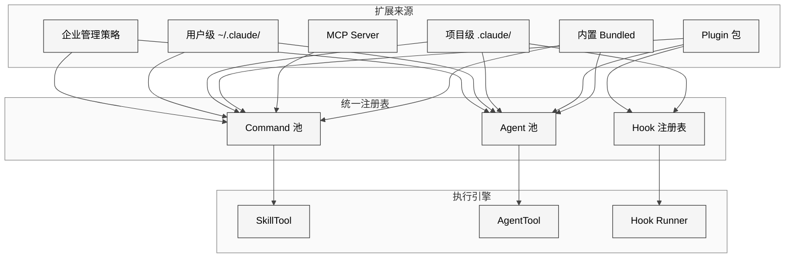
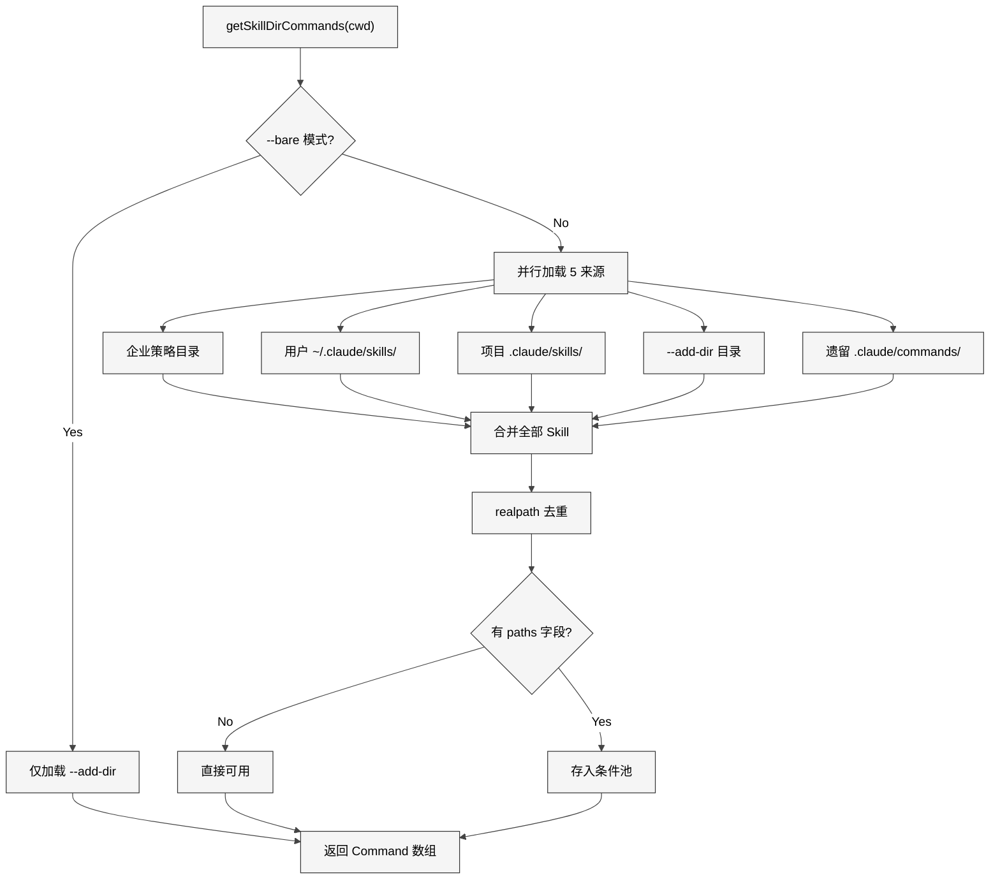
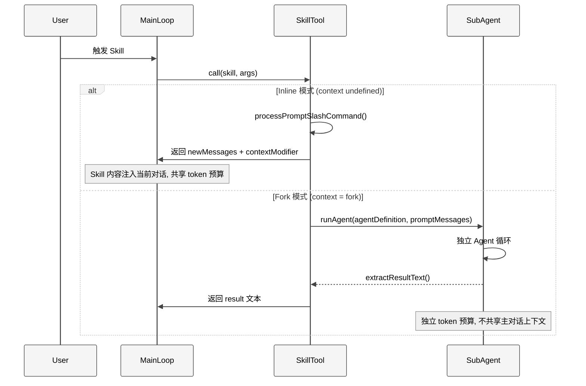
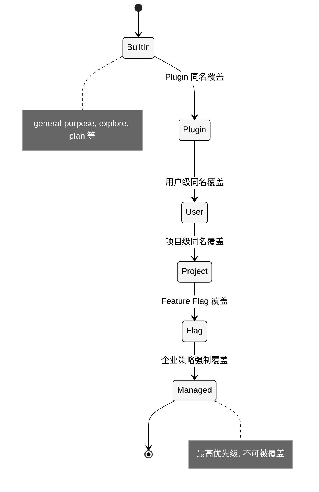
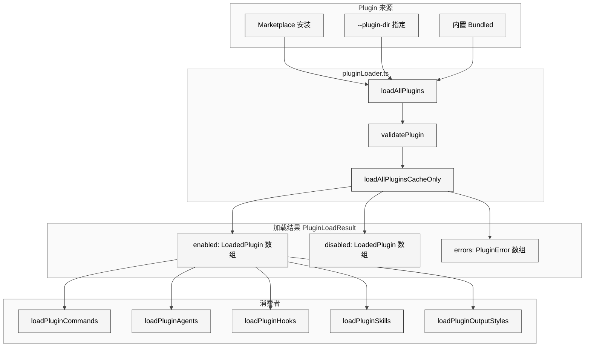

# 附录A Skill 与 Plugin

> 核心提要：扩展点与打包路径

## A.1 定位

### A.1.1 为什么需要扩展机制

Claude Code 的核心是一个 AI Agent 运行时（详见第 1 章）。但不同团队、不同项目的需求千差万别——有人需要自动化代码审查流程，有人需要集成内部工具链，有人需要约束 Agent 只做特定任务。硬编码无法覆盖这些场景，因此 Claude Code 提供了四个维度的扩展机制：

| 维度 | 载体 | 核心功能 | 源码入口 |
|------|------|---------|---------|
| **Hook** | Shell 脚本 / HTTP / Prompt | 在生命周期事件处拦截和干预 | `utils/hooks/` |
| **Skill** | Markdown + frontmatter | 定义可复用的 prompt 模板 | `skills/loadSkillsDir.ts` |
| **Agent** | Markdown + frontmatter | 定义独立 AI 角色（有自己的 prompt、工具集、模型） | `tools/AgentTool/loadAgentsDir.ts` |
| **Plugin** | 目录包（plugin.json + 子目录） | 打包分发 Skill + Agent + Hook + MCP 服务器 | `utils/plugins/pluginLoader.ts` |

这四个维度的代码规模差异巨大：Plugin 相关代码分布在 `utils/plugins/`（43 文件）、`services/plugins/`（3 文件）、`plugins/`（2 文件）共 48 个 TypeScript 文件，是整个扩展体系中最重的模块；`skills/` 包含 20 个 TypeScript 文件（含 bundled skills）；`tools/AgentTool/` 包含 18 个文件；`tools/SkillTool/` 仅 3 个文件。这一分布反映了一个关键事实：**扩展机制的核心复杂度在分发和管理（Plugin），而非执行（Skill/Agent）**。

### A.1.2 架构全景

<div style="background: #ffffff; padding: 16px; border-radius: 8px; margin: 16px 0;">



</div>

### A.1.3 社区常见误解澄清

**误解一：Skill 和 Agent 是递进关系。** 实际上，Skill 是一段 prompt 模板（在当前对话中展开或在子 Agent 中执行），Agent 是一个独立角色定义。二者维度不同：一个 Skill 可以指定 `agent: general-purpose` 让某个 Agent 来执行它，一个 Agent 的 `skills` 字段可以预加载多个 Skill。

**误解二：Plugin 就是 Skill 的打包格式。** Plugin 的功能远超打包——它支持 Marketplace 分发、版本管理、依赖解析、用户配置（含 Keychain 安全存储）、MCP/LSP 服务器声明、输出样式自定义等。Plugin 是一个完整的"软件包"概念。

**误解三：自定义 Skill 必须用 `context: fork`。** 实际上，大部分 Skill 使用默认的 inline 模式（在当前对话上下文中展开）更合适。`fork` 模式适合独立的、不需要与主对话交互的任务。源码中 `SkillTool.call()` 在 L622 明确检查 `command.context === 'fork'` 来决定执行路径。

---

## A.2 Skill 系统深度剖析

### A.2.1 发现机制：五来源并行加载

Skill 的发现是一个精心设计的多来源、去重、条件激活系统。核心函数 `getSkillDirCommands()` 位于 `skills/loadSkillsDir.ts` L638-804，使用 `memoize` 确保全局只加载一次。

五个来源按优先级从低到高并行加载：

```typescript
// skills/loadSkillsDir.ts L679-714
const [
  managedSkills,      // 1. 企业管理策略目录
  userSkills,         // 2. 用户级 ~/.claude/skills/
  projectSkillsNested,// 3. 项目级 .claude/skills/（向上遍历到 HOME）
  additionalSkillsNested, // 4. --add-dir 指定的额外目录
  legacyCommands,     // 5. 遗留 .claude/commands/（兼容旧格式）
] = await Promise.all([...])
```

这里有一个重要的工程决策：**所有来源并行加载**。`Promise.all` 保证 5 个 I/O 密集的目录扫描同时进行，避免串行等待。加载后再同步去重。

<div style="background: #ffffff; padding: 16px; border-radius: 8px; margin: 16px 0;">



</div>

### A.2.2 去重机制：realpath 解决符号链接

一个容易被忽视的精妙设计是去重机制。在 monorepo 中，同一个 `.claude/skills/` 目录可能通过不同的父目录路径被重复发现。Claude Code 使用 `realpath` 将所有路径解析为物理路径，然后用 `Map` 做 first-wins 去重：

```typescript
// skills/loadSkillsDir.ts L728-763
const fileIds = await Promise.all(
  allSkillsWithPaths.map(({ skill, filePath }) =>
    skill.type === 'prompt'
      ? getFileIdentity(filePath) // 调用 realpath
      : Promise.resolve(null),
  ),
)

const seenFileIds = new Map<string, SettingSource | 'builtin' | 'mcp' | 'plugin' | 'bundled'>()
for (let i = 0; i < allSkillsWithPaths.length; i++) {
  const fileId = fileIds[i]
  const existingSource = seenFileIds.get(fileId)
  if (existingSource !== undefined) {
    // 跳过重复
    continue
  }
  seenFileIds.set(fileId, skill.source)
  deduplicatedSkills.push(skill)
}
```

这里有一个有趣的注释（L107-124）揭示了设计背景：早期版本曾尝试使用 inode 去重，但发现在 NFS、ExFAT、容器虚拟文件系统中 inode 值不可靠（可能为 0 或精度丢失），最终改为更稳健的 `realpath` 方案。这个决策源自实际用户 Bug 报告（GitHub Issue #13893）。

### A.2.3 Frontmatter 字段全解

`parseSkillFrontmatterFields()` 位于 `skills/loadSkillsDir.ts` L185-265，是 Skill 配置解析的核心。每个字段都有明确的类型约束和默认值处理：

| 字段 | 类型 | 默认值 | 源码行号 | 设计意图 |
|------|------|--------|---------|---------|
| `name` | string | undefined | L238-239 | 显示名，不影响 Skill 标识（标识由目录名决定） |
| `description` | string | 从正文首行提取 | L208-214 | 模型用于决定是否调用 |
| `allowed-tools` | string/string[] | `[]` | L242-244 | 白名单工具权限 |
| `when_to_use` | string | undefined | L252 | 告诉模型何时主动调用 |
| `model` | string | 继承父级 | L221-226 | `'inherit'` 显式映射为 undefined |
| `effort` | string/int | undefined | L228-235 | 控制推理深度 |
| `context` | `'fork'` | inline（undefined） | L260 | 执行隔离模式 |
| `agent` | string | undefined | L261 | 指定执行此 Skill 的 Agent |
| `user-invocable` | boolean | `true` | L216-219 | false 时对用户隐藏 |
| `disable-model-invocation` | boolean | `false` | L255-257 | true 时模型不能自主调用 |
| `paths` | string/string[] | undefined | L159-178 | gitignore 风格路径过滤 |
| `hooks` | HooksSettings | undefined | L259 | 注册 Skill 专属 Hook |
| `shell` | `'bash'`/`'powershell'` | bash | L263 | Shell 命令嵌入的解释器 |

特别值得注意的字段组合：

- `user-invocable: false` + `disable-model-invocation: false`：Skill 对用户隐藏（不出现在 `/` 补全），但模型可以根据 `when_to_use` 自主调用。这是"被动触发"模式的实现方式。
- `context: fork` + `agent: general-purpose`：Skill 在独立的 general-purpose 子 Agent 中运行，拥有独立 token 预算。

### A.2.4 两种执行模式深度对比

Skill 执行的分岔点在 `SkillTool.call()` L622：

```typescript
// tools/SkillTool/SkillTool.ts L620-632
if (command?.type === 'prompt' && command.context === 'fork') {
  return executeForkedSkill(
    command, commandName, args, context,
    canUseTool, parentMessage, onProgress,
  )
}
// 否则走 inline 模式
const { processPromptSlashCommand } = await import(...)
const processedCommand = await processPromptSlashCommand(...)
```

**Inline 模式**的核心行为是将 Skill 的 Markdown 内容展开为 `newMessages`，注入到当前对话上下文中。关键代码在 L734-755：消息被标记为 `sourceToolUseID`，确保在 Skill 对应的 tool_use 解决前保持"临时"状态。同时通过 `contextModifier`（L775-839）修改后续的 `ToolUseContext`：注入 `allowedTools` 到权限白名单、覆盖 `mainLoopModel`、覆盖 `effortValue`。

**Fork 模式**的核心行为在 `executeForkedSkill()` L122-289，它启动一个完整的子 Agent 循环：

```typescript
// tools/SkillTool/SkillTool.ts L222-237
for await (const message of runAgent({
  agentDefinition,
  promptMessages,
  toolUseContext: { ...context, getAppState: modifiedGetAppState },
  canUseTool,
  isAsync: false,
  querySource: 'agent:custom',
  model: command.model as ModelAlias | undefined,
  availableTools: context.options.tools,
  override: { agentId },
})) {
  agentMessages.push(message)
}
```

Fork 模式的关键优势是**独立 token 预算**：子 Agent 有自己的上下文窗口，不会挤占主对话空间。但代价是无法与主对话共享上下文——子 Agent 看不到主对话的历史消息。

<div style="background: #ffffff; padding: 16px; border-radius: 8px; margin: 16px 0;">



</div>

### A.2.5 条件 Skill：路径激活机制

`paths` 字段实现了一种"惰性激活"模式：Skill 在启动时不加载到 prompt 中（节省 token），只有当模型操作了匹配路径的文件时才激活。实现在 `activateConditionalSkillsForPaths()` L997-1058：

```typescript
// skills/loadSkillsDir.ts L1012-1038
const skillIgnore = ignore().add(skill.paths)
for (const filePath of filePaths) {
  const relativePath = isAbsolute(filePath)
    ? relative(cwd, filePath)
    : filePath
  if (skillIgnore.ignores(relativePath)) {
    dynamicSkills.set(name, skill)
    conditionalSkills.delete(name)
    activatedConditionalSkillNames.add(name)
    activated.push(name)
    break
  }
}
```

这里使用了 `ignore` 库（gitignore 风格匹配），与 CLAUDE.md 的条件规则保持一致的语法。激活后，Skill 从 `conditionalSkills` 池移入 `dynamicSkills` 池，并通过 `skillsLoaded.emit()` 信号通知其他模块清除缓存。

防御性编程值得注意（L1021-1027）：路径为空、以 `..` 开头（逃逸基目录）、或为绝对路径（Windows 跨驱动器 `relative()` 返回绝对路径）的情况全部跳过，避免 `ignore()` 库抛出异常。

### A.2.6 动态 Skill 发现

除了启动时加载，Claude Code 在文件操作过程中还会动态发现嵌套目录中的 Skill。`discoverSkillDirsForPaths()` L861-915 从文件路径向上遍历，查找 `.claude/skills/` 目录：

```typescript
// skills/loadSkillsDir.ts L876-908
while (currentDir.startsWith(resolvedCwd + pathSep)) {
  const skillDir = join(currentDir, '.claude', 'skills')
  if (!dynamicSkillDirs.has(skillDir)) {
    dynamicSkillDirs.add(skillDir)
    try {
      await fs.stat(skillDir)
      if (await isPathGitignored(currentDir, resolvedCwd)) {
        continue // 跳过 gitignored 目录
      }
      newDirs.push(skillDir)
    } catch { /* 目录不存在 */ }
  }
  const parent = dirname(currentDir)
  if (parent === currentDir) break
  currentDir = parent
}
```

关键安全设计：`isPathGitignored()` 检查阻止了从 `node_modules` 等 gitignored 目录加载 Skill——这是防止供应链攻击的重要屏障。攻击者可以在 npm 包中植入 `.claude/skills/` 目录，如果没有 gitignore 检查，这些恶意 Skill 会被自动发现并注册。

### A.2.7 变量替换与 Shell 嵌入

Skill 内容在执行时经过多层变量替换，核心在 `createSkillCommand().getPromptForCommand()` L344-398：

| 变量 | 替换时机 | 安全限制 |
|------|---------|---------|
| `$1`, `$2`, `${named_arg}` | 每次调用 | 无 |
| `${CLAUDE_SKILL_DIR}` | 每次调用 | Windows 路径自动转 `/` |
| `${CLAUDE_SESSION_ID}` | 每次调用 | 无 |
| `` !`command` `` | 每次调用 | **MCP 来源的 Skill 禁止执行** |

Shell 命令嵌入的安全边界在 L374：

```typescript
if (loadedFrom !== 'mcp') {
  finalContent = await executeShellCommandsInPrompt(...)
}
```

这是一个关键的信任边界决策：本地 Skill（用户编写的）可以在 prompt 中嵌入 Shell 命令（如获取 git 状态、读取配置文件），但 MCP 来源的 Skill 不行——因为 MCP Server 是远程的、不可信的。

### A.2.8 Bundled Skills：内置 Skill 的注册

Claude Code 内置了 16+ 个 Skill，通过 `initBundledSkills()` 在启动时注册（`skills/bundled/index.ts`）。核心 Skill 无条件注册，实验性 Skill 通过 `feature()` 门控：

| Skill | 功能 | 门控条件 |
|-------|------|---------|
| `updateConfig` | 修改配置 | 无 |
| `keybindings` | 快捷键帮助 | 无 |
| `verify` | 验证工作结果 | 无 |
| `debug` | 调试辅助 | 无 |
| `skillify` | 将会话转化为 Skill | `USER_TYPE === 'ant'` |
| `remember` | 记忆管理 | 无 |
| `batch` | 批量执行 | 无 |
| `stuck` | 脱困辅助 | 无 |
| `dream` | 跨会话巩固记忆 | `KAIROS` 或 `KAIROS_DREAM` |
| `loop` | 循环执行 | `AGENT_TRIGGERS` |

`/skillify` 是一个特别值得注意的 Skill——它通过分析当前会话的操作历史（session memory + user messages），自动生成一个 SKILL.md 文件。其实现在 `skills/bundled/skillify.ts`，包含一个按需多轮提问的面试流程，引导用户定义 Skill 的名称、步骤、成功标准和触发条件。这是"用 AI 构建 AI 工具"的典型范例。

---

## A.3 Agent 系统深度剖析

### A.3.1 Agent 定义的类型体系

Agent 系统在类型设计上有一个精巧的三层继承结构（`tools/AgentTool/loadAgentsDir.ts` L106-165）：

```typescript
type BaseAgentDefinition = {
  agentType: string
  whenToUse: string
  tools?: string[]
  disallowedTools?: string[]
  skills?: string[]
  mcpServers?: AgentMcpServerSpec[]
  hooks?: HooksSettings
  color?: AgentColorName
  model?: string
  effort?: EffortValue
  permissionMode?: PermissionMode
  maxTurns?: number
  background?: boolean
  memory?: AgentMemoryScope
  isolation?: 'worktree' | 'remote'
  // ...更多字段
}

type BuiltInAgentDefinition = BaseAgentDefinition & {
  source: 'built-in'
  getSystemPrompt: (params: { toolUseContext }) => string
}

type CustomAgentDefinition = BaseAgentDefinition & {
  getSystemPrompt: () => string
  source: SettingSource
}

type PluginAgentDefinition = BaseAgentDefinition & {
  getSystemPrompt: () => string
  source: 'plugin'
  plugin: string
}
```

**设计决策分析**：`getSystemPrompt` 被设计为闭包函数而非静态字符串。对于 BuiltIn Agent，它接受 `toolUseContext` 参数以动态生成 prompt（如根据上下文窗口大小调整指令）。对于 Custom 和 Plugin Agent，prompt 在解析时通过闭包捕获，实现了"按需生成 + 记忆注入"：

```typescript
// tools/AgentTool/loadAgentsDir.ts L726-732
getSystemPrompt: () => {
  if (isAutoMemoryEnabled() && memory) {
    const memoryPrompt = loadAgentMemoryPrompt(agentType, memory)
    return systemPrompt + '\n\n' + memoryPrompt
  }
  return systemPrompt
},
```

每次获取 System Prompt 时，都会重新读取最新的记忆内容，确保 Agent 总能看到最新记忆。

### A.3.2 六级覆盖优先级

当多个来源定义了同名 Agent 时，`getActiveAgentsFromList()` L193-221 按以下顺序去重（后者覆盖前者）：

```typescript
const agentGroups = [
  builtInAgents,    // 1. 内置（最低）
  pluginAgents,     // 2. Plugin
  userAgents,       // 3. 用户级
  projectAgents,    // 4. 项目级
  flagAgents,       // 5. Feature Flag
  managedAgents,    // 6. 企业策略（最高）
]
```

<div style="background: #ffffff; padding: 16px; border-radius: 8px; margin: 16px 0;">



</div>

这个设计意味着：企业管理员可以通过策略目录强制替换任何内置 Agent 的行为（如将 `general-purpose` 替换为一个受限版本），而项目级配置可以覆盖用户个人偏好。

### A.3.3 内置 Agent 清单

`getBuiltInAgents()` 在 `tools/AgentTool/builtInAgents.ts` L22-72 注册内置 Agent：

| Agent | 源文件 | 条件 | 职能 |
|-------|--------|------|------|
| `general-purpose` | `built-in/generalPurposeAgent.ts` | 始终 | 通用子 Agent（tools: `['*']`） |
| `statusline-setup` | `built-in/statuslineSetup.ts` | 始终 | 状态栏配置 |
| `explore` | `built-in/exploreAgent.ts` | `BUILTIN_EXPLORE_PLAN_AGENTS` flag | 只读探索 |
| `plan` | `built-in/planAgent.ts` | 同上 | 规划方案（不写代码） |
| `claude-code-guide` | `built-in/claudeCodeGuideAgent.ts` | 非 SDK 入口 | 帮助指南 |
| `verification` | `built-in/verificationAgent.ts` | `VERIFICATION_AGENT` flag + A/B 测试 | 结果验证 |

值得注意的是 `explore` 和 `plan` Agent 的 `omitClaudeMd` 字段（L129-132）：这两个只读 Agent 不需要 CLAUDE.md 中的提交/PR/lint 指南，省略后"每周可节省 5-15 Gtok（34M+ Explore 调用量）"。这是一个典型的"大规模下的微优化"案例。

### A.3.4 Agent 记忆系统

当 Agent 设置了 `memory` 字段，它获得持久化记忆能力。记忆存储在文件系统中，三种 scope 对应不同目录：

| Scope | 目录 | 共享范围 | 典型场景 |
|-------|------|---------|---------|
| `user` | `<memoryBase>/agent-memory/<name>/` | 跨所有项目 | 个人编码习惯 |
| `project` | `<cwd>/.claude/agent-memory/<name>/` | 团队共享（VCS） | 项目特定知识 |
| `local` | `<cwd>/.claude/agent-memory-local/<name>/` | 本机专用 | 本地环境配置 |

源码在 `tools/AgentTool/agentMemory.ts` L52-65 实现目录解析。当 `memory` 启用时，`FileWrite`、`FileEdit`、`FileRead` 三个工具会被自动注入（`loadAgentsDir.ts` L662-674），即使 `tools` 白名单中没有列出：

```typescript
if (isAutoMemoryEnabled() && memory && tools !== undefined) {
  const toolSet = new Set(tools)
  for (const tool of [FILE_WRITE_TOOL_NAME, FILE_EDIT_TOOL_NAME, FILE_READ_TOOL_NAME]) {
    if (!toolSet.has(tool)) {
      tools = [...tools, tool]
    }
  }
}
```

这个隐式注入是一个设计权衡：它确保了记忆功能的可用性（否则 Agent 无法读写记忆文件），但可能让开发者困惑——"为什么我的工具白名单多了三个工具？"

### A.3.5 Plugin Agent 的安全限制

Plugin Agent 与 Custom Agent 有一个关键区别（`utils/plugins/loadPluginAgents.ts` L153-168）：

```typescript
// permissionMode, hooks, mcpServers 对 Plugin Agent 故意不解析
for (const field of ['permissionMode', 'hooks', 'mcpServers'] as const) {
  if (frontmatter[field] !== undefined) {
    logForDebugging(
      `Plugin agent file ${filePath} sets ${field}, which is ignored for plugin agents.`,
      { level: 'warn' },
    )
  }
}
```

**设计意图**：Plugin 来自第三方 Marketplace，其 Agent 定义文件中如果允许设置 `permissionMode`（可能绕过权限检查）或 `hooks`（可能拦截敏感操作）或 `mcpServers`（可能连接恶意服务器），就等于允许单个 Agent 文件"静默升级"Plugin 的权限范围。源码注释引用了 PR #22558 的 review 讨论。

正确的做法是在 `plugin.json` manifest 级别声明 hooks 和 MCP 服务器，让用户在安装时明确审批。

### A.3.6 MCP 服务器集成

Agent 可以通过 `mcpServers` 字段声明专属 MCP 服务器，支持两种格式：

```yaml
# 按名称引用已配置的 MCP 服务器
mcpServers:
  - slack
  - github

# 内联定义新的 MCP 服务器
mcpServers:
  - my-server:
      type: stdio
      command: node
      args: ["./my-mcp-server.js"]
```

解析使用 Zod union schema（`loadAgentsDir.ts` L63-68），运行时在 `runAgent.ts` 的 `initializeAgentMcpServers()` 中连接这些服务器，并在 Agent 结束时清理。

---

## A.4 Plugin 系统深度剖析

### A.4.1 Plugin Manifest（plugin.json）

Plugin manifest 的 Zod schema 定义在 `utils/plugins/schemas.ts`，是整个扩展系统中最复杂的数据结构。`PluginManifestSchema` 通过组合 10 个子 schema 构成：

```typescript
// utils/plugins/schemas.ts L884-898
export const PluginManifestSchema = lazySchema(() =>
  z.object({
    ...PluginManifestMetadataSchema().shape,      // name, version, author 等
    ...PluginManifestHooksSchema().partial().shape, // hooks
    ...PluginManifestCommandsSchema().partial().shape, // commands
    ...PluginManifestAgentsSchema().partial().shape,   // agents
    ...PluginManifestSkillsSchema().partial().shape,   // skills
    ...PluginManifestOutputStylesSchema().partial().shape, // outputStyles
    ...PluginManifestChannelsSchema().partial().shape,     // channels
    ...PluginManifestMcpServerSchema().partial().shape,    // mcpServers
    ...PluginManifestLspServerSchema().partial().shape,    // lspServers
    ...PluginManifestSettingsSchema().partial().shape,     // settings
    ...PluginManifestUserConfigSchema().partial().shape,   // userConfig
  }),
)
```

所有子 schema 都通过 `.partial()` 合并，由此可见 Plugin 可以只声明需要的能力——一个最小的 Plugin 只需要 `name` 字段。

**关键设计决策**（L876-883 注释）：顶层字段使用 zod 默认的 strip 行为（静默忽略未知字段），但嵌套对象如 `userConfig` 的选项使用 `.strict()` 模式（L620）。原因是：顶层的未知字段可能是插件作者的自定义扩展或未来版本的新字段，忽略它们保证了向前兼容；但嵌套配置中的错字（如 `tpye` 而非 `type`）更可能是 Bug，应该报错。

### A.4.2 User Config：安全存储设计

Plugin 的 `userConfig` 字段声明了用户需要配置的值。`PluginUserConfigOptionSchema`（L587-621）强制要求 `type`、`title`、`description` 三个字段，因为配置对话框会渲染它们。

`sensitive: true` 的配置项有特殊处理：

1. **存储**：存入 Keychain（macOS）或 `.credentials.json`（Linux/Windows），而非 settings.json
2. **Skill 中的替换**：`${user_config.X}` 对敏感字段解析为描述性占位符，不是实际值（因为 Skill 内容会进入模型 prompt）
3. **Hook 中的替换**：通过环境变量 `CLAUDE_PLUGIN_OPTION_<KEY>` 传递**真实值**（因为 Hook 是本地执行，不经过模型）

这一区分在 `utils/plugins/loadPluginCommands.ts` L348-353 和 `utils/plugins/pluginOptionsStorage.ts` 中实现。

### A.4.3 命令命名规范

Plugin 中的命令自动带有 Plugin 名称前缀。命名逻辑在 `loadPluginCommands.ts` L60-97：

```typescript
function getCommandNameFromFile(filePath, baseDir, pluginName) {
  const isSkill = isSkillFile(filePath)
  if (isSkill) {
    // SKILL.md: 使用父目录名
    // 例：my-plugin:review
    const commandBaseName = basename(dirname(filePath))
    return namespace
      ? `${pluginName}:${namespace}:${commandBaseName}`
      : `${pluginName}:${commandBaseName}`
  } else {
    // 普通 .md: 使用文件名
    // 例：my-plugin:build
    const commandBaseName = basename(filePath).replace(/\.md$/, '')
    return namespace
      ? `${pluginName}:${namespace}:${commandBaseName}`
      : `${pluginName}:${commandBaseName}`
  }
}
```

这个命名空间隔离保证了不同 Plugin 的命令不会冲突。

### A.4.4 Plugin 加载架构

<div style="background: #ffffff; padding: 16px; border-radius: 8px; margin: 16px 0;">



</div>

Plugin 加载使用了两层缓存策略：`loadAllPlugins()` 负责完整加载（含网络请求检查更新），`loadAllPluginsCacheOnly()` 仅从磁盘缓存加载（无网络请求），用于快速启动路径。启动路径消费者优先调用后者，以避免启动时阻塞于网络；显式刷新路径仍会调用 `loadAllPlugins()`。

### A.4.5 Marketplace 安全防护

`schemas.ts` 中有大量针对 Marketplace 的安全验证：

1. **官方名称保护**（L19-28）：`ALLOWED_OFFICIAL_MARKETPLACE_NAMES` 集合定义了保留名称（如 `claude-code-marketplace`、`anthropic-plugins`），只有来自 `anthropics` GitHub org 的仓库才能使用
2. **名称冒充检测**（L71-72）：`BLOCKED_OFFICIAL_NAME_PATTERN` 正则表达式拦截 `official-claude-plugins` 等变体
3. **Unicode 同形攻击防护**（L79）：`NON_ASCII_PATTERN` 阻止使用 Cyrillic 'а' 冒充 Latin 'a' 等同形字符
4. **路径遍历防护**：`NpmPackageNameSchema`（L837-850）拒绝包含 `..` 或 `//` 的包名

---

## A.5 Hook 系统与扩展生命周期

### A.5.1 28 种 Hook 事件

从 `loadPluginHooks.ts` L31-59 可以看到完整的 Hook 事件列表：

| 类别 | 事件 | 触发时机 |
|------|------|---------|
| 工具生命周期 | `PreToolUse`, `PostToolUse`, `PostToolUseFailure` | 工具调用前后 |
| 会话生命周期 | `SessionStart`, `SessionEnd` | 会话开始/结束 |
| Agent 生命周期 | `SubagentStart`, `SubagentStop`, `Stop`, `StopFailure` | Agent 启动/停止 |
| 权限 | `PermissionRequest`, `PermissionDenied` | 权限请求/拒绝 |
| 压缩 | `PreCompact`, `PostCompact` | 上下文压缩前后 |
| 用户交互 | `UserPromptSubmit`, `Notification`, `Elicitation`, `ElicitationResult` | 用户输入/通知 |
| 配置 | `Setup`, `ConfigChange`, `InstructionsLoaded` | 配置变更 |
| 环境 | `CwdChanged`, `FileChanged` | 工作目录/文件变更 |
| Worktree | `WorktreeCreate`, `WorktreeRemove` | Git Worktree 生命周期 |
| 任务 | `TaskCreated`, `TaskCompleted`, `TeammateIdle` | 任务管理 |

### A.5.2 Hook 热加载

Plugin Hook 支持热加载，在 `loadPluginHooks.ts` L255-287 实现：

```typescript
settingsChangeDetector.subscribe(source => {
  if (source === 'policySettings') {
    const newSnapshot = getPluginAffectingSettingsSnapshot()
    if (newSnapshot === lastPluginSettingsSnapshot) {
      return // 无变化，跳过
    }
    lastPluginSettingsSnapshot = newSnapshot
    clearPluginCache('loadPluginHooks: plugin-affecting settings changed')
    clearPluginHookCache()
    void loadPluginHooks() // fire-and-forget 重载
  }
})
```

这里有一个来自 gh-29767 的 Bug 修复经验：清除和注册必须是原子操作。旧版本中 `clearRegisteredPluginHooks()` 放在 `clearPluginHookCache()` 中，导致任何 `clearAllCaches()` 调用都会清空 Hook 注册表，而 `Stop` 事件的 Hook 在此后永远不会触发（因为没有地方重新调用 `loadPluginHooks()`）。修复后，清除操作移到 `loadPluginHooks()` 内部，与注册形成原子对（L147-148）。

---

## A.6 权限与安全模型

### A.6.1 Skill 权限检查流程

`SkillTool.checkPermissions()` L432-578 实现了一个精细的权限管线：

1. **Deny Rules 检查**（L470-486）：如果存在匹配的 deny 规则，立即拒绝
2. **Remote Canonical Skills**（L492-504）：远程规范 Skill 自动允许（在 deny 之后检查，确保 deny 优先）
3. **Allow Rules 检查**（L507-523）：如果存在匹配的 allow 规则，允许执行
4. **Safe Properties 自动允许**（L529-538）：如果 Skill 只使用"安全属性"，无需询问用户

Safe Properties 的白名单在 L875-908 定义：

```typescript
const SAFE_SKILL_PROPERTIES = new Set([
  'type', 'progressMessage', 'contentLength', 'argNames', 'model',
  'effort', 'source', 'pluginInfo', 'disableNonInteractive', 'skillRoot',
  'context', 'agent', 'getPromptForCommand', 'frontmatterKeys',
  'name', 'description', 'hasUserSpecifiedDescription', 'isEnabled',
  'isHidden', 'aliases', 'isMcp', 'argumentHint', 'whenToUse',
  'paths', 'version', 'disableModelInvocation', 'userInvocable',
  'loadedFrom', 'immediate', 'userFacingName',
])
```

**设计哲学**：新增的属性默认需要权限，只有显式添加到白名单的属性才被视为安全。这是"默认安全"（secure by default）原则的体现。

### A.6.2 Skill Prompt 预算管理

SkillTool 的 prompt 中需要列出所有可用 Skill 供模型选择。但 Skill 数量增长会消耗宝贵的上下文窗口。`tools/SkillTool/prompt.ts` 实现了预算控制：

```typescript
// tools/SkillTool/prompt.ts L21-23
export const SKILL_BUDGET_CONTEXT_PERCENT = 0.01 // 上下文窗口的 1%
export const CHARS_PER_TOKEN = 4
export const DEFAULT_CHAR_BUDGET = 8_000 // 200K window 的 1%
export const MAX_LISTING_DESC_CHARS = 250 // 每条描述最大字符数
```

当总描述超过预算时，`formatCommandsWithinBudget()` L70-171 采用分级截断策略：

1. 首先尝试完整描述
2. 超预算时，**Bundled Skills 描述永不截断**，只截断第三方 Skill
3. 极端情况下（截断后仍超），非 Bundled Skill 只显示名称

---

## A.7 比较

### A.7.1 与 Cursor Rules 的对比

| 维度 | Claude Code Skill/Agent | Cursor Rules |
|------|------------------------|-------------|
| 格式 | Markdown + YAML frontmatter | Markdown（.cursorrules / .cursor/rules/） |
| 执行模式 | inline / fork（子 Agent） | 仅 inline（注入 system prompt） |
| 工具约束 | `allowed-tools` 白名单 | 无工具控制 |
| 条件激活 | `paths` gitignore 匹配 | `globs` 文件匹配 |
| 模型覆盖 | `model: opus` / `effort: high` | 无 |
| 分发机制 | Plugin Marketplace + Marketplace | 手动复制文件 |
| 动态发现 | 向上遍历发现嵌套目录 | 仅固定目录 |

Claude Code 的 Skill 系统在**可编程性**方面远超 Cursor Rules：允许 Shell 命令嵌入、变量替换、条件激活、Fork 隔离执行、工具白名单等，本质上是一个可编程的 prompt 模板引擎。Cursor Rules 更接近静态配置文件。

### A.7.2 与 Aider 的 Conventions 对比

Aider 的 `.aider.conf.yml` 和 conventions 文件是单层配置，没有"扩展"概念。Claude Code 的四层架构（Hook → Skill → Agent → Plugin）提供了从简单到复杂的渐进式扩展路径。

### A.7.3 Claude Code 方案的局限

1. **没有类型安全的 Skill SDK**：Skill 完全通过 Markdown + frontmatter 定义，没有代码级的类型检查。一个 typo 在 frontmatter 字段名中（如 `allowed-tool` 而非 `allowed-tools`）只会被静默忽略
2. **Inline Skill 的 token 消耗不可预测**：Skill 内容展开后混入主对话上下文，用户无法精确控制消耗
3. **Plugin Marketplace 生态不成熟**：从 `schemas.ts` 中大量的 `// TODO (future work)` 注释可以看出，gist 源、单文件 Plugin、glob 模式匹配等功能仍在规划中

---

## A.8 展望

### A.8.1 源码中的 TODO

| 位置 | 内容 | 含义 |
|------|------|------|
| `schemas.ts` L432 | `// TODO (future work): allow globs?` | commands 路径尚不支持 glob |
| `schemas.ts` L1158-1159 | `// TODO (future work) gist / single file?` | Plugin 源不支持 Gist 和单文件 |
| `pluginLoader.ts` L3242 | `// TODO: Clear installed plugins cache` | 安装管理器的缓存清理未完成 |
| `marketplaceManager.ts` L1619 | `// TODO: Implement npm package support` | npm 包作为 Marketplace 源未实现 |
| `scheduleRemoteAgents.ts` L31 | `TODO(public-ship)` | 远程 Agent 调度的 MCP 端点未公开 |

### A.8.2 潜在瓶颈

1. **memoize 缓存策略**：`getSkillDirCommands` 和 `getAgentDefinitionsWithOverrides` 都使用全局 memoize。在长会话中，如果用户在会话期间添加了新的 Skill 文件，除非触发了动态发现路径（文件操作），否则不会被看到。手动 `clearSkillCaches()` 需要通过 `/reload-plugins` UI

2. **Plugin Hook 的 28 事件类型**：每个 enabled Plugin 的 Hook 配置都需要遍历 28 种事件类型。在大量 Plugin 场景下，`convertPluginHooksToMatchers()` 的循环开销可能显著

3. **Skill 数量膨胀**：当 Plugin Marketplace 成熟后，大量 Skill 的 `whenToUse` 描述需要全部放入 prompt。虽然有 1% 预算控制，但百级 Skill 仍可能导致每条描述被截断到不可读

### A.8.3 改进建议

如果设计下一版扩展系统，以下几点值得考虑：

1. **Skill 的语义索引**：当前 Skill 列表是全量注入 prompt，可以引入向量嵌入做语义检索——只在 prompt 中注入与当前任务最相关的 Skill。这与 Anthropic 工程博客中"Context Engineering"的理念一致

2. **Plugin 的沙箱隔离**：当前 Plugin 的 Hook 脚本以用户权限运行，没有沙箱限制。可以借鉴 Claude Code 对 BashTool 的 Seatbelt/bubblewrap 沙箱机制

3. **Skill 的版本化**：当前 Skill 的 `version` 字段只是元数据，没有参与任何版本解析或兼容性检查。Plugin 系统有版本管理基础设施，但 Skill 层没有

4. **声明式 Hook 替代 Shell 脚本**：当前 Hook 主要通过 Shell 脚本实现，可以增加更多声明式配置（如 `"action": "block"` 直接阻止，不需要退出码 2 的约定）

---

## A.9 开发者实践指南

### A.9.1 创建你的第一个 Skill

```
.claude/skills/
└── security-review/
    └── SKILL.md
```

```markdown
---
name: Security Review
description: "Review code changes for security vulnerabilities"
allowed-tools: Bash(git diff:*), Bash(git log:*), FileRead
argument-hint: "<branch-name>"
arguments: branch
when_to_use: "When the user asks for a security review of code changes"
context: fork
effort: high
---

# Security Review

Review the code changes on branch `$branch` for security vulnerabilities.

## Steps

1. Get the diff: `git diff main...$branch`
2. For each changed file, check for:
   - SQL injection vulnerabilities
   - XSS attack vectors
   - Hardcoded credentials
   - Insecure deserialization
3. Produce a structured report with severity ratings
```

### A.9.2 创建自定义 Agent

```
.claude/agents/
└── test-runner.md
```

```markdown
---
name: test-runner
description: "Run tests and fix failures iteratively until all tests pass"
tools: Bash, FileRead, FileEdit, FileWrite
model: sonnet
maxTurns: 20
memory: project
color: green
---

You are a test runner agent. Your job is to:

1. Run the test suite
2. Analyze any failures
3. Fix the failing code
4. Re-run tests until all pass

Never modify test files unless explicitly asked.
Always explain what you changed and why.
```

### A.9.3 使用 /skillify 从会话生成 Skill

Claude Code 内置的 `/skillify` 命令（仅限 Anthropic 内部用户，`USER_TYPE === 'ant'`）可以从当前会话历史自动生成 SKILL.md。其工作流程：

1. 分析 session memory 和用户消息历史
2. 通过按需多轮 AskUserQuestion 收集需求
3. 生成完整的 SKILL.md 文件（含 frontmatter + 步骤 + 成功标准）

这是将"隐性知识显性化"的最佳实践——将反复执行的操作流程固化为可复用的 Skill。

### A.9.4 Plugin 开发最佳实践

1. **最小权限原则**：只在 manifest 中声明真正需要的 hooks 和 mcpServers
2. **userConfig 的 sensitive 标记**：API Key 等敏感值必须标记 `sensitive: true`
3. **命名规范**：使用 kebab-case，避免空格、路径分隔符、保留名称
4. **向前兼容**：不要依赖顶层 manifest 字段的 strict 验证——zod 会静默忽略未知字段

---

## A.10 小结

1. **四层扩展是维度而非递进**：Hook 管事件拦截、Skill 管 prompt 模板、Agent 管独立角色、Plugin 管分发打包。理解维度差异是正确设计的前提

2. **Skill 的 Inline/Fork 二择是关键决策**：Inline 共享上下文但消耗主对话 token，Fork 独立 token 预算但失去上下文。选择标准是"是否需要与主对话交互"

3. **安全是分层设计**：MCP Skill 禁止 Shell 嵌入、Plugin Agent 禁止 permissionMode/hooks/mcpServers、gitignored 目录禁止 Skill 发现、sensitive 配置用 Keychain 而非 settings.json。每一层都有明确的信任边界

4. **Plugin 生态尚在早期**：schemas.ts 中 8 个 TODO 标记、Marketplace npm 支持未完成、gist/单文件源待实现。但基础架构（Zod 验证 + 版本管理 + 依赖解析 + 安全防护）已经完备

5. **扩展系统的复杂度分布极不均匀**：Plugin 子系统 48 个文件，是 SkillTool（3 个文件）的 16 倍。分发管理比执行引擎复杂一个数量级——这是所有平台生态系统的普遍规律
