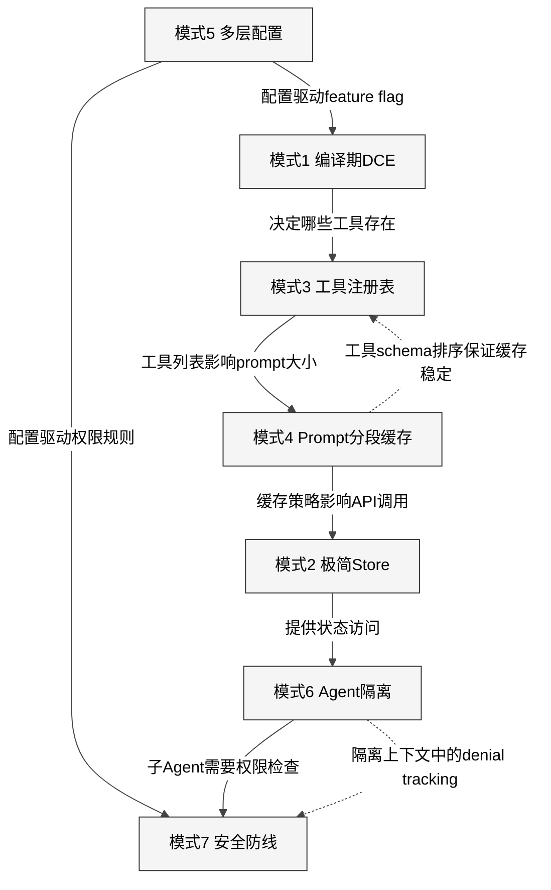
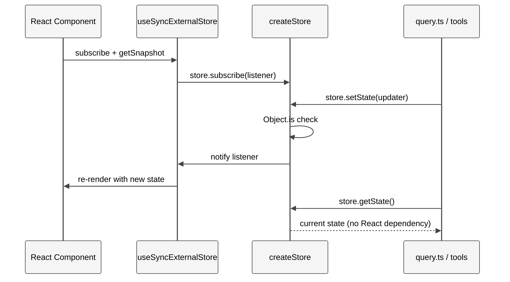
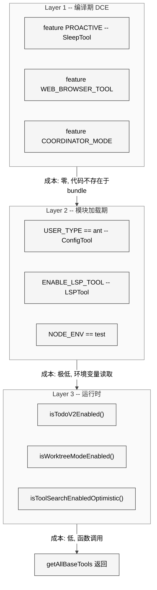
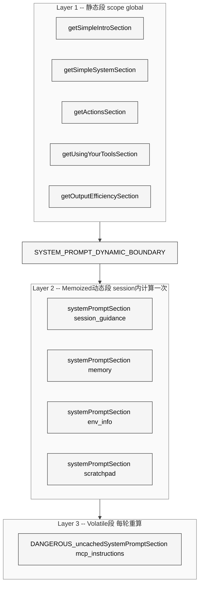
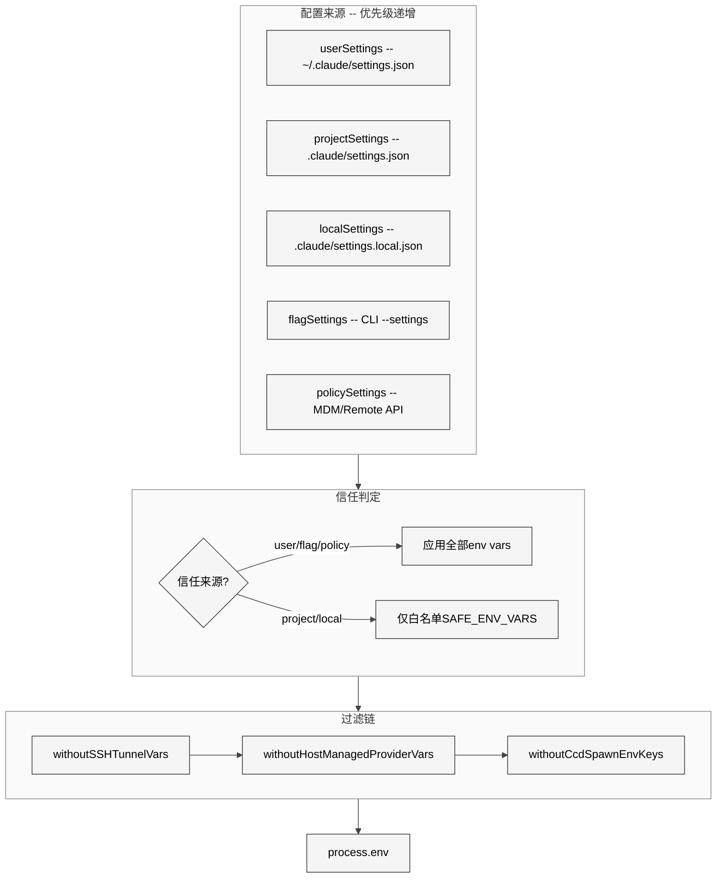
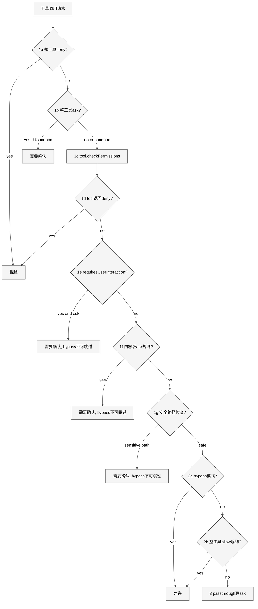

# 附录B 架构模式

> 核心提要：可迁移的设计抽象

---

## B.1 定位

### 为什么需要架构模式总结

在前文对 Claude Code 各子系统的逐一拆解之后，工程师面临的终极问题是：**哪些设计可以搬到自己的项目里？**

本附录从 v2.1.88 源码（1,884 文件，513,216 行 TypeScript）中，萃取出 7 个被生产验证的架构模式。每个模式附带真实代码引用、适用场景判断与迁移要点。我们不追求学术式的完备性，而是聚焦于"一个正在建设 AI Agent 产品的团队，下周一就可以用上"的实操价值。

### 七大模式一览

| # | 模式名称 | 解决的核心问题 | 关键文件 |
|---|---------|-------------|---------|
| 1 | 编译期 DCE | 同一代码库构建多版本 | `src/tools.ts` |
| 2 | 极简 Store | React 与非 React 代码共享状态 | `src/state/store.ts` |
| 3 | 工具注册表 | 40+ 可插拔模块的注册与过滤 | `src/tools.ts`, `src/Tool.ts` |
| 4 | Prompt 分段缓存 | LLM API 成本控制 | `src/constants/systemPromptSections.ts` |
| 5 | 多层配置合并 | 企业级多源配置的优先级与安全 | `src/utils/settings/constants.ts` |
| 6 | Agent 隔离 | 多 Agent 状态隔离与基础设施共享 | `src/utils/forkedAgent.ts` |
| 7 | 安全防线 | AI Agent 权限管控 | `src/utils/permissions/permissions.ts` |

### 模式间协作关系

<div style="background: #ffffff; padding: 16px; border-radius: 8px; margin: 16px 0;">



</div>

这 7 个模式构成一个闭合网络：编译期 DCE 决定工具注册表的内容，注册表的排序服务于 Prompt 缓存的稳定性，多层配置驱动权限规则和 feature flag，Agent 隔离依赖 Store 做状态克隆，隔离上下文中的 denial tracking 又反馈给安全防线。**理解它们的协作关系，比孤立地学习某个模式更有价值。**

---

## B.2 模式 1：编译期 DCE — 同一份代码构建多版本

### 本质问题

当产品需要从同一代码库构建出内部版/外部版、免费版/付费版等多个变体时，传统做法面临两难：维护多分支导致合并噩梦，运行时 `if/else` 又让所有版本都包含全部代码。

### Claude Code 的解法

Claude Code 使用 Bun bundler 的 `feature()` 函数实现编译期 Dead Code Elimination。核心技巧是将 `feature()` 与 `require()` 配合——而非静态 `import`：

```1:53:restored-src/src/tools.ts
// biome-ignore-all assist/source/organizeImports: ANT-ONLY import markers must not be reordered
// ...
const SleepTool =
  feature('PROACTIVE') || feature('KAIROS')
    ? require('./tools/SleepTool/SleepTool.js').SleepTool
    : null
// ...
```

编译时 `feature('PROACTIVE')` 被替换为 `true` 或 `false`。当为 `false` 时，bundler 直接删除整个 `require()` 分支及其依赖的模块树。仅 `tools.ts` 一个文件就包含 **17 处** `feature()` 调用，整个 `src/` 目录下有超过 **120 个文件、857 个调用站点**使用 `feature()` 门控。

第二维度是 `process.env.USER_TYPE`，通过 `--define` 在构建时替换为字符串常量：

```16:19:restored-src/src/tools.ts
const REPLTool =
  process.env.USER_TYPE === 'ant'
    ? require('./tools/REPLTool/REPLTool.js').REPLTool
    : null
```

### 关键约束：为什么不能用 import

这个模式有一个容易被忽略的约束——**必须使用 `require()` 而非顶层 `import`**。静态 `import` 会被模块系统无条件加载，DCE 无法生效。同时为保留类型安全，使用 `as typeof import(...)` 模式：

```63:65:restored-src/src/tools.ts
const getTeamCreateTool = () =>
  require('./tools/TeamCreateTool/TeamCreateTool.js')
    .TeamCreateTool as typeof import('./tools/TeamCreateTool/TeamCreateTool.js').TeamCreateTool
```

另一个关键约束来自 `QueryConfig`（`src/query/config.ts`）——它**刻意排除** `feature()` gate，注释直接说明了原因：

```8:14:restored-src/src/query/config.ts
// Immutable values snapshotted once at query() entry. Separating these from
// the per-iteration State struct and the mutable ToolUseContext makes future
// step() extraction tractable — a pure reducer can take (state, event, config)
// where config is plain data.
//
// Intentionally excludes feature() gates — those are tree-shaking boundaries
// and must stay inline at the guarded blocks for dead-code elimination.
export type QueryConfig = {
```

如果把 `feature()` 的值抽取到配置对象中，bundler 就无法在调用位点进行常量折叠，DCE 彻底失效。这是一个**源码中明确记录的架构约束**，不是偶然的编码习惯。

### 工程复杂度评估

| 维度 | 评估 |
|------|------|
| 实现难度 | 低（bundler 原生支持） |
| 维护成本 | 中（feature flag 间交互组合爆炸，理论测试矩阵 2^90） |
| 迁移门槛 | 低（esbuild `--define`、webpack `DefinePlugin` 均可替代） |

### 迁移要点

- **适用场景**：SaaS 多租户、内部/外部版、平台差异化
- **核心原则**：Flag 必须在调用位点内联，不能提升为变量
- **风险提示**：90 个 feature flag 的交互行为需要良好的测试基础设施覆盖

---

## B.3 模式 2：极简 Store — 35 行代码桥接 React 与非 React

### 本质问题

在混合架构应用中（UI 层用 React，核心逻辑不依赖 React），状态管理是典型痛点。Redux/Zustand 太重，React Context 把非 React 代码绑死在框架上。

### Claude Code 的解法：35 行自研 Store

整个状态管理的核心只有 35 行代码，零依赖：

```1:34:restored-src/src/state/store.ts
type Listener = () => void
type OnChange<T> = (args: { newState: T; oldState: T }) => void

export type Store<T> = {
  getState: () => T
  setState: (updater: (prev: T) => T) => void
  subscribe: (listener: Listener) => () => void
}

export function createStore<T>(
  initialState: T,
  onChange?: OnChange<T>,
): Store<T> {
  let state = initialState
  const listeners = new Set<Listener>()

  return {
    getState: () => state,

    setState: (updater: (prev: T) => T) => {
      const prev = state
      const next = updater(prev)
      if (Object.is(next, prev)) return
      state = next
      onChange?.({ newState: next, oldState: prev })
      for (const listener of listeners) listener()
    },

    subscribe: (listener: Listener) => {
      listeners.add(listener)
      return () => listeners.delete(listener)
    },
  }
}
```

这段代码中有四个精妙的设计决策：

1. **`Object.is` 相等性检查**（第 23 行）：与 React 的行为完全一致，避免无效渲染。
2. **`onChange` 回调**：集中式副作用处理——权限同步、模型持久化、缓存清理等。
3. **`subscribe` 返回取消函数**：与 React 18 的 `useSyncExternalStore` 接口契约完美匹配。
4. **闭包封装**：`state` 变量只能通过 `getState()`/`setState()` 访问，任何外部代码无法绕过变更检测。

桥接到 React 的方式同样极简——通过 `AppStoreContext` 和 `useSyncExternalStore`：

```27:27:restored-src/src/state/AppState.tsx
export const AppStoreContext = React.createContext<AppStateStore | null>(null);
```

<div style="background: #ffffff; padding: 16px; border-radius: 8px; margin: 16px 0;">



</div>

React 组件通过 Context 拿到 Store 实例，用 `useSyncExternalStore` 订阅。非 React 代码（如 `query.ts`、工具执行逻辑）直接调用 `store.getState()`/`store.setState()`。**两个世界共享同一个状态源，但互不耦合。**

### 为什么不用 Zustand

源码中的 `AppStateStore` 类型使用 `DeepImmutable` 包装（`src/state/AppStateStore.ts` L24），提供编译时不可变性保证。Zustand 虽然也轻量，但 35 行自研代码意味着零外部依赖、完全可控的变更语义、与 React 18 `useSyncExternalStore` 的天然兼容。对于一个 CLI 工具而言，减少一个依赖比减少 35 行代码更有价值。

### 迁移要点

- **适用场景**：CLI + React TUI、Electron 应用、任何 React + 非 React 混合架构
- **核心技巧**：Store 接口 `getState` + `subscribe` 就是 React 18 要求的外部 Store 协议
- **扩展方向**：通过 `onChange` 回调实现中间件模式（日志、持久化、同步）

---

## B.4 模式 3：工具注册表 — 单一来源 + 三层条件注册

### 本质问题

当系统需要管理 40+ 个可插拔功能模块时，如何确保注册逻辑集中可控，同时支持编译期、加载期、运行时三个层面的条件过滤？

### 单一注册入口

所有工具在 `getAllBaseTools()` 中注册——源码注释明确声明这是"the source of truth for ALL tools"：

```190:251:restored-src/src/tools.ts
// ...
export function getAllBaseTools(): Tools {
  return [
    AgentTool,
    TaskOutputTool,
    BashTool,
    // ...
    ...(hasEmbeddedSearchTools() ? [] : [GlobTool, GrepTool]),
    // ...
    ...(process.env.USER_TYPE === 'ant' ? [ConfigTool] : []),
    // ...
    ...(SleepTool ? [SleepTool] : []),
    // ...
  ]
}
```

三层漏斗的成本递增关系清晰可见：

<div style="background: #ffffff; padding: 16px; border-radius: 8px; margin: 16px 0;">



</div>

### Builder 模式：安全默认值

每个工具通过 `buildTool()` 构建，它在并发、读写、破坏性标注维度上提供保守的安全默认值：

```757:791:restored-src/src/Tool.ts
const TOOL_DEFAULTS = {
  isEnabled: () => true,
  isConcurrencySafe: (_input?: unknown) => false,
  isReadOnly: (_input?: unknown) => false,
  isDestructive: (_input?: unknown) => false,
  checkPermissions: (
    input: { [key: string]: unknown },
    _ctx?: ToolUseContext,
  ): Promise<PermissionResult> =>
    Promise.resolve({ behavior: 'allow', updatedInput: input }),
  toAutoClassifierInput: (_input?: unknown) => '',
  userFacingName: (_input?: unknown) => '',
}
// ...
export function buildTool<D extends AnyToolDef>(def: D): BuiltTool<D> {
  return {
    ...TOOL_DEFAULTS,
    userFacingName: () => def.name,
    ...def,
  } as BuiltTool<D>
}
```

注意"保守"是分层的：`isConcurrencySafe` 默认 `false` 意味着新工具默认串行执行——并发需要显式 opt-in；但 `checkPermissions` 默认 `allow`，因为工具级权限判定只是外层 7 步管线（模式 7）的一个环节。

### assembleToolPool：缓存感知的合并

`assembleToolPool()` 将内置工具与 MCP 工具合并时，特意**保持内置工具为连续前缀**，避免 MCP 工具穿插导致 prompt cache 失效：

```345:367:restored-src/src/tools.ts
export function assembleToolPool(
  permissionContext: ToolPermissionContext,
  mcpTools: Tools,
): Tools {
  const builtInTools = getTools(permissionContext)
  const allowedMcpTools = filterToolsByDenyRules(mcpTools, permissionContext)
  // Sort each partition for prompt-cache stability, keeping built-ins as a
  // contiguous prefix.
  const byName = (a: Tool, b: Tool) => a.name.localeCompare(b.name)
  return uniqBy(
    [...builtInTools].sort(byName).concat(allowedMcpTools.sort(byName)),
    'name',
  )
}
```

源码注释清楚地解释了设计意图："a flat sort would interleave MCP tools into built-ins and invalidate all downstream cache keys whenever an MCP tool sorts between existing built-ins"。内置工具同名优先（`uniqBy` 保持插入顺序）。

### 迁移要点

- **适用场景**：任何需要管理多个可插拔模块的系统
- **核心原则**：一个 `getAll*()` 函数作为唯一注册入口，所有过滤逻辑在此之上叠加
- **缓存意识**：工具排序不仅关乎可读性，还直接影响 LLM API 的缓存命中率

---

## B.5 模式 4：Prompt 分段缓存 — 三层而非二分

### 本质问题

LLM API 的 System Prompt 每次请求都会被发送。对于包含大量工具描述的复杂 prompt，cache hit 成本 $0.003 vs cache miss $0.60（200K tokens 场景），200 倍成本差距直接决定产品的商业可行性。

### 三层结构

System Prompt 的缓存设计实际上是**三层结构**，边界由 `SYSTEM_PROMPT_DYNAMIC_BOUNDARY` 标记：

```106:115:restored-src/src/constants/prompts.ts
// ...
// WARNING: Do not remove or reorder this marker without updating cache logic in:
// - src/utils/api.ts (splitSysPromptPrefix)
// - src/services/api/claude.ts (buildSystemPromptBlocks)
export const SYSTEM_PROMPT_DYNAMIC_BOUNDARY =
  '__SYSTEM_PROMPT_DYNAMIC_BOUNDARY__'
```

<div style="background: #ffffff; padding: 16px; border-radius: 8px; margin: 16px 0;">



</div>

### 注册 API：命名即文档

实现的核心是 `systemPromptSections.ts` 中的一对注册函数：

```20:38:restored-src/src/constants/systemPromptSections.ts
export function systemPromptSection(
  name: string,
  compute: ComputeFn,
): SystemPromptSection {
  return { name, compute, cacheBreak: false }
}

export function DANGEROUS_uncachedSystemPromptSection(
  name: string,
  compute: ComputeFn,
  _reason: string,
): SystemPromptSection {
  return { name, compute, cacheBreak: true }
}
```

`DANGEROUS_uncached` 这个命名本身就是设计文档——开发者在写代码时就意识到"**我正在做一个会破坏缓存的决定**"。`_reason` 参数虽然不被运行时使用，但强制开发者记录理由。源码中唯一使用 `DANGEROUS_uncachedSystemPromptSection` 的地方是 MCP 指令注入，理由清晰地记录在第三个参数中：`'MCP servers connect/disconnect between turns'`。

### 解析逻辑：缓存命中判断

```43:58:restored-src/src/constants/systemPromptSections.ts
export async function resolveSystemPromptSections(
  sections: SystemPromptSection[],
): Promise<(string | null)[]> {
  const cache = getSystemPromptSectionCache()
  return Promise.all(
    sections.map(async s => {
      if (!s.cacheBreak && cache.has(s.name)) {
        return cache.get(s.name) ?? null
      }
      const value = await s.compute()
      setSystemPromptSectionCacheEntry(s.name, value)
      return value
    }),
  )
}
```

### 延迟构造：lazySchema

同样的"延迟付出成本"理念体现在工具 schema 的构造上——仅 8 行代码：

```1:8:restored-src/src/utils/lazySchema.ts
/**
 * Returns a memoized factory function that constructs the value on first call.
 * Used to defer Zod schema construction from module init time to first access.
 */
export function lazySchema<T>(factory: () => T): () => T {
  let cached: T | undefined
  return () => (cached ??= factory())
}
```

### 被社区忽视的关键细节

大量社区文章将 Prompt 缓存简单描述为"static/dynamic 二分"。实际上是三层：boundary 之前的全局可缓存段、boundary 之后 session 内只计算一次的 memoized 段、以及极少数每轮重算的 volatile 段。源码中 `getSystemPrompt()` 函数清晰展示了这个分层：

```560:576:restored-src/src/constants/prompts.ts
  return [
    // --- Static content (cacheable) ---
    getSimpleIntroSection(outputStyleConfig),
    getSimpleSystemSection(),
    // ...
    // === BOUNDARY MARKER - DO NOT MOVE OR REMOVE ===
    ...(shouldUseGlobalCacheScope() ? [SYSTEM_PROMPT_DYNAMIC_BOUNDARY] : []),
    // --- Dynamic content (registry-managed) ---
    ...resolvedDynamicSections,
  ].filter(s => s !== null)
```

另一个被忽视的细节：`getSessionSpecificGuidanceSection()` 上方有一段详细注释（`src/constants/prompts.ts` L343-351），解释了为什么某些看似静态的内容必须放在 boundary 之后——它们依赖运行时布尔值，如果放在静态段会导致 Blake2b 哈希变体呈 2^N 增长。

### 迁移要点

- **适用场景**：任何涉及 LLM API 调用的应用
- **核心技巧**：将 prompt 分为 global cache、session-memoized、per-turn volatile 三层
- **API 设计**：用 `DANGEROUS_*` 命名约定在代码层面标记高风险操作

---

## B.6 模式 5：多层配置合并 — 5+1 层 Settings 的优先级链

### 本质问题

企业级应用需要支持多个配置来源：个人偏好、项目配置、CLI 参数、企业策略。如何设计一个清晰、可预测、可调试的配置合并系统？

### 5+1 层架构

配置系统采用 5 层有序数组定义优先级——后覆盖前：

```7:22:restored-src/src/utils/settings/constants.ts
export const SETTING_SOURCES = [
  // User settings (global)
  'userSettings',
  // Project settings (shared per-directory)
  'projectSettings',
  // Local settings (gitignored)
  'localSettings',
  // Flag settings (from --settings flag)
  'flagSettings',
  // Policy settings (managed-settings.json or remote settings from API)
  'policySettings',
] as const
```

加上 Plugin 基底层（非 `SettingSource`），共 6 层。`policySettings` 拥有最高优先级，确保企业管理策略不可被覆盖。

### 安全边界：信任与不信任

配置系统最关键的设计决策是**信任边界**。对于高风险操作（如环境变量注入），项目级配置**不被信任**：

```94:109:restored-src/src/utils/managedEnv.ts
/**
 * Trusted setting sources whose env vars can be applied before the trust dialog.
 *
 * Project-scoped sources (projectSettings, localSettings) are excluded because they live
 * inside the project directory and could be committed by a malicious actor to redirect
 * traffic (e.g., ANTHROPIC_BASE_URL) to an attacker-controlled server.
 */
const TRUSTED_SETTING_SOURCES = [
  'userSettings',
  'flagSettings',
  'policySettings',
] as const
```

这段注释直接揭示了威胁模型：`projectSettings` 和 `localSettings` 位于项目目录内，任何有仓库写权限的人都可修改。如果允许它们在信任对话框之前设置 `ANTHROPIC_BASE_URL`，就等于打开了将 API 请求重定向到攻击者服务器的攻击面。

对于项目级来源，只有 `SAFE_ENV_VARS` 白名单中的变量才会被应用：

```172:177:restored-src/src/utils/managedEnv.ts
  const settingsEnv = filterSettingsEnv(getSettings_DEPRECATED()?.env)
  for (const [key, value] of Object.entries(settingsEnv)) {
    if (SAFE_ENV_VARS.has(key.toUpperCase())) {
      process.env[key] = value
    }
  }
```

### 多层过滤链

`managedEnv.ts` 中的 `filterSettingsEnv` 函数组合了三道过滤器，每道针对不同的威胁场景：

```85:91:restored-src/src/utils/managedEnv.ts
function filterSettingsEnv(
  env: Record<string, string> | undefined,
): Record<string, string> {
  return withoutCcdSpawnEnvKeys(
    withoutHostManagedProviderVars(withoutSSHTunnelVars(env)),
  )
}
```

| 过滤器 | 防护场景 |
|--------|---------|
| `withoutSSHTunnelVars` | SSH 远程场景下保护认证通道变量 |
| `withoutHostManagedProviderVars` | 宿主管理 provider 路由时防止 settings 覆盖 |
| `withoutCcdSpawnEnvKeys` | Claude Desktop 模式下保护启动环境变量 |

<div style="background: #ffffff; padding: 16px; border-radius: 8px; margin: 16px 0;">



</div>

### 迁移要点

- **适用场景**：VS Code 扩展、DevOps 工具链、企业 SaaS
- **核心原则**：配置源用有序数组定义优先级；信任边界用独立的 `TRUSTED_SETTING_SOURCES` 常量声明
- **安全考量**：项目目录内的配置来源对高风险操作不可信——这是对抗供应链攻击的关键防线

---

## B.7 模式 6：Agent 隔离 — 默认隔离 + 显式共享

### 本质问题

在多 Agent 系统中，子 Agent 需要与父 Agent **隔离状态**（避免互相干扰），但又需要**共享基础设施**（避免僵尸进程、避免重复创建资源）。

### createSubagentContext：隔离与共享的精确边界

`createSubagentContext()` 函数（`src/utils/forkedAgent.ts` L345-462）实现了"默认全隔离 + 显式 opt-in 共享"的模式。函数签名上方的 JSDoc 注释清晰声明了设计意图：

```307:344:restored-src/src/utils/forkedAgent.ts
// ...
/**
 * Creates an isolated ToolUseContext for subagents.
 *
 * By default, ALL mutable state is isolated to prevent interference:
 * - readFileState: cloned from parent
 * - abortController: new controller linked to parent (parent abort propagates)
 * - getAppState: wrapped to set shouldAvoidPermissionPrompts
 * - All mutation callbacks (setAppState, etc.): no-op
 *
 * Callers can:
 * - Override specific fields via the overrides parameter
 * - Explicitly opt-in to sharing specific callbacks (shareSetAppState, etc.)
 */
export function createSubagentContext(
  parentContext: ToolUseContext,
  overrides?: SubagentContextOverrides,
): ToolUseContext {
```

### 五类决策分析

源码中的隔离/共享决策可分为五类：

**第 1 类：可变状态——克隆隔离**

```376:387:restored-src/src/utils/forkedAgent.ts
    readFileState: cloneFileStateCache(
      overrides?.readFileState ?? parentContext.readFileState,
    ),
    nestedMemoryAttachmentTriggers: new Set<string>(),
    // ...
    toolDecisions: undefined,
```

**第 2 类：AbortController——链接而非共享**

```350:354:restored-src/src/utils/forkedAgent.ts
  const abortController =
    overrides?.abortController ??
    (overrides?.shareAbortController
      ? parentContext.abortController
      : createChildAbortController(parentContext.abortController))
```

父 Agent abort 会传播到子 Agent，但子 Agent abort 不影响父 Agent。

**第 3 类：状态写入——默认 no-op，opt-in 共享**

```410:412:restored-src/src/utils/forkedAgent.ts
    setAppState: overrides?.shareSetAppState
      ? parentContext.setAppState
      : () => {},
```

**第 4 类：基础设施——始终穿透**

```413:417:restored-src/src/utils/forkedAgent.ts
    // Task registration/kill must always reach the root store, even when
    // setAppState is a no-op — otherwise async agents' background bash tasks
    // are never registered and never killed (PPID=1 zombie).
    setAppStateForTasks:
      parentContext.setAppStateForTasks ?? parentContext.setAppState,
```

这是最重要的设计决策之一——注释直接说明了后果：如果任务注册不穿透到根 Store，异步 Agent 的后台 bash 任务就会变成 PPID=1 的僵尸进程。

**第 5 类：UI 回调——完全隔离**

```437:441:restored-src/src/utils/forkedAgent.ts
    addNotification: undefined,
    setToolJSX: undefined,
    setStreamMode: undefined,
    setSDKStatus: undefined,
```

### 为什么 contentReplacementState 默认克隆而非新建

源码中有一段精确的注释解释了这个看似细微的决策：

```389:398:restored-src/src/utils/forkedAgent.ts
    // Clone by default (not fresh): cache-sharing forks process parent
    // messages containing parent tool_use_ids. A fresh state would see
    // them as unseen and make divergent replacement decisions -> wire
    // prefix differs -> cache miss. A clone makes identical decisions ->
    // cache hit. For non-forking subagents the parent UUIDs never match
    // — clone is a harmless no-op.
```

缓存共享的 fork 会处理父线程的消息。如果用全新的 state，子 Agent 对父线程的 `tool_use_id` 做出不同的替换决策，导致序列化字节不同，prompt cache 就失效了。

### 为什么 localDenialTracking 需要本地实例

```418:422:restored-src/src/utils/forkedAgent.ts
    // Async subagents whose setAppState is a no-op need local denial tracking
    // so the denial counter actually accumulates across retries.
    localDenialTracking: overrides?.shareSetAppState
      ? parentContext.localDenialTracking
      : createDenialTrackingState(),
```

异步子 Agent 的 `setAppState` 是 no-op，denial 计数无法写入全局状态。没有本地跟踪，denial 熔断器（3 次连续拒绝或 20 次总拒绝即回退）永远不会触发，子 Agent 会无限重试被拒绝的操作。

### 迁移要点

- **适用场景**：任何多 Agent/多线程/多租户系统
- **核心原则**：默认隔离，共享需要显式声明——与安全领域的最小权限原则一脉相承
- **基础设施穿透**：进程/资源管理类操作必须始终到达根级别

---

## B.8 模式 7：安全防线 — 多步决策管线

### 本质问题

AI Agent 能执行任意代码，如何设计一个既不会被绕过、又不会让用户体验崩溃的权限系统？

### 决策管线：10 步分层判定

`hasPermissionsToUseToolInner()` 函数（`src/utils/permissions/permissions.ts` L1158-1319）定义了完整的决策管线：

```1158:1319:restored-src/src/utils/permissions/permissions.ts
async function hasPermissionsToUseToolInner(
  tool: Tool,
  input: { [key: string]: unknown },
  context: ToolUseContext,
): Promise<PermissionDecision> {
  // 1a. Entire tool is denied (highest priority)
  // 1b. Entire tool should always ask
  // 1c. Tool implementation's own checkPermissions
  // 1d. Tool implementation denied
  // 1e. Tool requires user interaction even in bypass
  // 1f. Content-specific ask rules (bypass-immune)
  // 1g. Safety checks for sensitive paths (bypass-immune)
  // 2a. Bypass mode evaluation
  // 2b. Entire tool is allowed
  // 3.  Passthrough -> ask conversion
  // ...
}
```

<div style="background: #ffffff; padding: 16px; border-radius: 8px; margin: 16px 0;">



</div>

### 核心设计哲学：bypass 不是万能的

步骤 1e-1g 定义了三类 **bypass-immune** 决策。以步骤 1f 为例：

```1238:1250:restored-src/src/utils/permissions/permissions.ts
  // 1f. Content-specific ask rules from tool.checkPermissions take precedence
  // over bypassPermissions mode. When a user explicitly configures a
  // content-specific ask rule (e.g. Bash(npm publish:*)), the tool's
  // checkPermissions returns {behavior:'ask', decisionReason:{type:'rule',
  // rule:{ruleBehavior:'ask'}}}. This must be respected even in bypass mode,
  // just as deny rules are respected at step 1d.
  if (
    toolPermissionResult?.behavior === 'ask' &&
    toolPermissionResult.decisionReason?.type === 'rule' &&
    toolPermissionResult.decisionReason.rule.ruleBehavior === 'ask'
  ) {
    return toolPermissionResult
  }
```

由此可见：用户显式配置的 `Bash(npm publish:*)` ask 规则，即使在最宽松的 `bypassPermissions` 模式下也必须弹出确认。bypass 只跳过"没有明确规则命中"的默认 ask，不能覆盖显式的安全约束。

### 熔断器：防止无限重试

系统实现了 denial tracking 熔断机制：

```12:15:restored-src/src/utils/permissions/denialTracking.ts
export const DENIAL_LIMITS = {
  maxConsecutive: 3,
  maxTotal: 20,
} as const
```

```40:45:restored-src/src/utils/permissions/denialTracking.ts
export function shouldFallbackToPrompting(state: DenialTrackingState): boolean {
  return (
    state.consecutiveDenials >= DENIAL_LIMITS.maxConsecutive ||
    state.totalDenials >= DENIAL_LIMITS.maxTotal
  )
}
```

连续 3 次拒绝或总计 20 次拒绝后，系统回退到用户确认模式（CLI）或直接 abort（headless）。这在子 Agent 隔离上下文中尤为重要——正如模式 6 所述，异步子 Agent 需要 `localDenialTracking` 才能让熔断器正常工作。

### 多源规则系统

权限规则来自 8 种来源，遍历顺序定义在 `PERMISSION_RULE_SOURCES` 中：

```109:114:restored-src/src/utils/permissions/permissions.ts
const PERMISSION_RULE_SOURCES = [
  ...SETTING_SOURCES,
  'cliArg',
  'command',
  'session',
] as const
```

### 迁移要点

- **适用场景**：API 网关、CI/CD pipeline、任何 AI Agent 的权限系统
- **核心原则**：deny 优先 + bypass-immune 层——安全策略永远不会被"更宽松"的模式覆盖
- **熔断保护**：对自动化系统尤为重要，防止 Agent 在死循环中消耗资源

---

## B.9 比较

### 各竞品在模式采用上的对比

| 模式 | Claude Code | Cursor | Codex CLI | Gemini CLI | Cline | Aider |
|------|-------------|--------|-----------|------------|-------|-------|
| 编译期 DCE | 90 feature flags | 无（Electron fork） | Cargo features（crate 级） | 无 | 无 | 无 |
| 极简 Store | 35 行自研 | VS Code 状态管理 | Rust 自定义 | 标准 Node.js | VS Code API | 无（Python） |
| 工具注册表 | 40+ 工具，三层漏斗 | 未公开 | 3 核心工具 | 12-13 工具 | 12-13 工具 | 无离散工具 |
| Prompt 缓存 | 三层分段 | 未公开 | 未公开 | 未公开 | 取决于模型 | 无 |
| 多层配置 | 5+1 层 | Rules + Settings | Config + MEMORY.md | GEMINI.md | 无内置 | .aider.conf.yml |
| Agent 隔离 | 显式 opt-in 共享 | 并行 Background Agent | git worktree 隔离 | 实验性 | 实验性 | 无 |
| 安全防线 | 10 步管线 + 熔断器 | 未公开 | sandbox 隔离 | YOLO 模式 | Auto-Approve | 无 |

### Claude Code 的独特优势

**深度自研带来的一致性**：这 7 个模式不是独立拼装的零件，而是一个协同演化的系统。编译期 DCE 的 `feature()` 标志与工具注册表的条件加载无缝衔接；Store 的 `Object.is` 语义在 Agent 隔离的克隆逻辑中被精确利用；Prompt 缓存的排序策略与工具注册表的 `assembleToolPool()` 联动。这种级别的架构一致性在竞品中难以找到。

**对比 Codex CLI**：Codex CLI 使用 Rust 多 crate 架构（60-69 个 crate）和 Cargo feature flags 实现类似的条件编译，但粒度是 crate 级别而非函数级别。其 Agent 隔离采用 git worktree 的文件系统级隔离，更重量级但也更彻底。

**对比 Cursor**：Cursor 基于 VS Code 分支，直接继承了 Electron 的渲染栈和扩展机制，无需自研终端渲染。但这也意味着它不能像 Claude Code 那样在 CI/CD 流水线中以 headless 模式运行——这是 CLI 阵营在自动化集成场景中的天然优势。

### Claude Code 的局限

**测试矩阵复杂度**：90 个 feature flag 的理论组合是 2^90，远超任何测试基础设施的覆盖能力。源码中大量 `@[MODEL LAUNCH]` 注释标记表明，模型更新时需要手动检查多处代码。

**单体架构的代价**：512K 行代码在同一个 TypeScript 单体中，编译时间和 IDE 响应速度都是潜在瓶颈。Codex CLI 的多 crate 架构在增量编译和模块化测试方面有结构性优势。

---

## B.10 辨误

### 争议一：终端 vs IDE 路线之争

社区对 Claude Code 选择 CLI 而非 IDE 形态存在持续争论。**源码实证支持的判断**：CLI 形态是一个深思熟虑的架构决策，而非"来不及做 IDE"的权宜之计。

证据链：
1. `src/bridge/` 目录包含 31 个文件、12,613 行代码，实现了 3 代 Bridge 协议用于跨进程/跨机器 Agent 控制——这是 IDE 形态不需要的投入
2. 源码中可以确认存在 headless / SDK 代码路径，但未检出 `feature('SDK_MODE')` 这个特定 flag 名称
3. `assembleToolPool()` 中对工具排序的缓存优化只有在 API 调用为主的 CLI 场景中才有意义——IDE 场景中 prompt 构造通常由 LSP 插件承担

**裁决**：CLI 和 IDE 不是二选一，而是面向不同场景的最优解。Claude Code 选择 CLI 是因为 Anthropic 的核心价值主张是模型能力，CLI 让模型能力无中间层地暴露给用户。但 npm 月下载量 4,400 万（含大量 CI/CD 流水线自动化下载）vs Cursor 约 100 万 DAU 的对比说明：CLI 赢在自动化场景的渗透力，IDE 赢在开发者的即时体验。

### 争议二：必要复杂度 vs 过度工程

512K 行代码做一个"编程助手"是否过度工程？

**源码实证的回答**：这 512K 行中，与"编程辅助"直接相关的不到 20%。其余是 Agent 操作系统级基础设施——进程管理、内存管理、安全内核、IPC 通信、终端渲染。社区中"用 200 行代码复刻 Claude Code 核心循环"的项目（如 shareAI-lab 的 "Bash is all you need"）恰好证明了这一点：核心循环确实简单，但生产级可靠性需要这 51 万行。

具体量化本附录 7 个模式的复杂度：

| 模式 | 核心代码量 | 复杂度等级 | 是否必要 |
|------|-----------|-----------|---------|
| 编译期 DCE | ~50 行模式代码 | 低 | 必要——支撑多形态产品线 |
| 极简 Store | 35 行 | 极低 | 必要——桥接 React 与非 React |
| 工具注册表 | ~200 行 | 低 | 必要——40+ 工具的管理基础 |
| Prompt 分段缓存 | ~70 行 | 低 | 必要——200 倍成本差距 |
| 多层配置合并 | ~200 行 | 中 | 必要——企业级安全要求 |
| Agent 隔离 | ~120 行 | 中 | 必要——多 Agent 正确性 |
| 安全防线 | ~160 行 | 中 | 必要——AI 安全底线 |

**这 7 个模式的核心代码总量约 835 行**，占 512K 行代码库的 0.16%。但它们定义了整个系统的架构骨架。真正的复杂度不在于这些模式本身，而在于它们所支撑的 40+ 工具实现、389 个终端组件、90 个 feature flag 的交叉组合——这些是产品复杂度，不是架构过度工程。

**裁决**：这不是过度工程，而是"Agent OS"级别产品的必要复杂度。就像 Linux 内核不能用"一个 `while(true)` 循环做调度"来批评其 2800 万行代码是过度工程。

---

## B.11 展望

### 源码中的已知技术债

1. **`@[MODEL LAUNCH]` 注释**：`src/constants/prompts.ts` 中至少有 4 处 `@[MODEL LAUNCH]` 标记（如 L117、L204、L402、L712），表明每次模型更新都需要手动遍历修改。这是一个脆弱的流程。

2. **`getSettings_DEPRECATED` 函数**：`src/utils/managedEnv.ts` L172 和 L190 仍在调用 `getSettings_DEPRECATED()`，暗示配置系统正在经历重构，但旧 API 尚未完全淘汰。

3. **`TREE_SITTER_BASH` feature flag**：`src/utils/bash/parser.ts` 中存在此标志，表明自研 Bash 解析器（24,399 行）正在与 tree-sitter 方案并行开发，尚未确定最终技术路线。

4. **`DANGEROUS_uncachedSystemPromptSection` 的 MCP 特例**：当前唯一使用此 API 的地方是 MCP 指令注入，但源码注释表明正在通过 `mcp_instructions_delta` 附件机制逐步迁移（L509-511），以消除这个缓存击穿点。

### 潜在瓶颈

**Feature Flag 组合爆炸**：90 个 flag 意味着理论上 2^90 种配置组合。当前没有看到源码中有自动化的 flag 交互检测机制。随着产品线扩展，flag 间的意外交互将成为越来越大的风险。

**单体仓库的可扩展性**：512K 行 TypeScript 在单一仓库中，如果团队规模从当前的"每人日均 5 次发布"模式大幅扩张，代码所有权和合并冲突将成为瓶颈。Codex CLI 的多 crate 架构在这方面有结构性优势。

### 如果我来设计下一版

1. **引入 Feature Flag 交互矩阵**：为 90 个 flag 建立自动化的兼容性声明（类似 Cargo 的 feature resolver v2），让 bundler 在构建时检测已知的 flag 冲突。

2. **将 `DANGEROUS_uncached` 改为 delta 推送模式**：源码中已经在向 `mcp_instructions_delta` 附件机制演进。下一步应将所有动态 section 统一为 delta 推送，让 system prompt 在整个 session 内保持完全静态。

3. **Agent 隔离类型安全**：当前的 `SubagentContextOverrides` 使用布尔标志（`shareSetAppState`、`shareAbortController`）来声明共享意图，但没有在类型层面防止"声明了不共享 setAppState 但忘记创建 localDenialTracking"这类关联遗漏。可以使用 TypeScript 条件类型让共享决策之间的关联成为编译期约束。

4. **配置合并的可审计性**：当前 5 层配置合并后，很难追溯某个最终生效的值来自哪个来源。可以添加一个 `getSettingProvenance(key)` 函数，返回每个键值的来源链和覆盖历史——这在企业客户的合规审计中尤其重要。

---

## B.12 小结

### 七个模式的核心 Takeaway

1. **编译期 DCE 的纪律**：`feature()` 标志必须在调用位点内联，不能提升为变量——这个约束被明确记录在 `QueryConfig` 的注释中，违反就意味着 DCE 失效。

2. **35 行代码的威力**：`createStore` 证明了在 React 18 时代，自研一个与 `useSyncExternalStore` 完美兼容的外部 Store 只需要 35 行代码。不要因为"轮子已经被造过"就放弃理解轮子的本质。

3. **三层 Prompt 缓存而非二分**：社区普遍将 prompt 缓存简化为"static/dynamic"二分，但 Claude Code 的实践证明三层分段（global cache、session memoized、per-turn volatile）才是成本最优解。200 倍的缓存命中成本差距让这个分层不是优化，而是产品商业可行性的前提。

4. **配置合并必须有信任边界**：`TRUSTED_SETTING_SOURCES` 的存在提醒我们：在多来源配置系统中，并非所有来源都应被平等信任。项目目录内的配置可能被恶意提交者利用。

5. **Agent 隔离的"默认隔离 + 显式共享"**：这是多 Agent 系统中最重要的架构原则。注意 `setAppStateForTasks` 的基础设施穿透——忘记这一点就会产生僵尸进程。

6. **安全防线中 bypass 不是万能的**：三类 bypass-immune 决策（用户交互要求、内容级 ask 规则、安全路径检查）确保了即使在最宽松的模式下，显式的安全约束仍被尊重。

7. **这些模式的协同比单独采用更有价值**：编译期 DCE 的 flag 驱动工具注册，工具注册的排序服务 prompt 缓存，配置合并驱动权限规则，Agent 隔离依赖 Store 做状态克隆——理解这个协作网络，比孤立学习某个模式更重要。

### 对 Agent 开发者的实践建议

如果你正在建设一个 AI Agent 产品，以下是基于这 7 个模式的优先级排序建议：

| 优先级 | 模式 | 适用条件 | 投入产出比 |
|--------|------|---------|-----------|
| P0 | Prompt 分段缓存 | 任何调用 LLM API 的应用 | 极高（200 倍成本差距） |
| P0 | 安全防线 | 任何让 AI 执行操作的应用 | 极高（安全底线） |
| P1 | 工具注册表 | 工具数超过 10 个 | 高 |
| P1 | 多层配置 | 面向企业客户 | 高 |
| P2 | Agent 隔离 | 多 Agent 编排 | 中高 |
| P2 | 极简 Store | 混合架构（React + 非 React） | 中 |
| P3 | 编译期 DCE | 多版本产品线 | 中（取决于产品线复杂度） |

> **最后一句话**：好的架构不是追求"正确"的抽象，而是在矛盾的约束之间找到务实的平衡点。这 7 个模式的每一个都是一个权衡决策的产物——编译期 DCE 在可维护性与 bundle 体积间平衡，Agent 隔离在安全性与基础设施共享间平衡，安全防线在用户体验与操作安全间平衡。带着这种权衡思维去设计你自己的系统，比照搬任何模式都更有价值。
