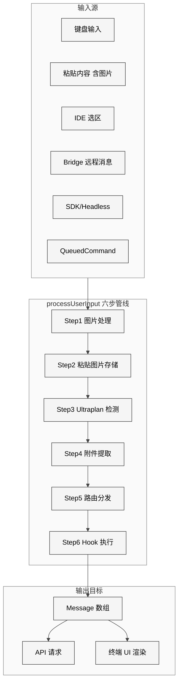
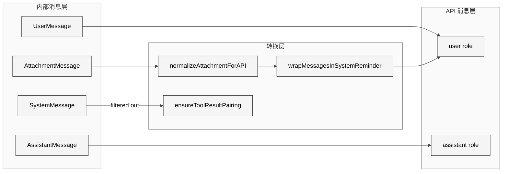
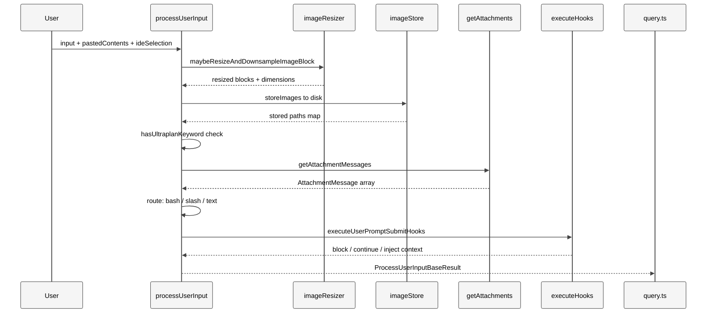
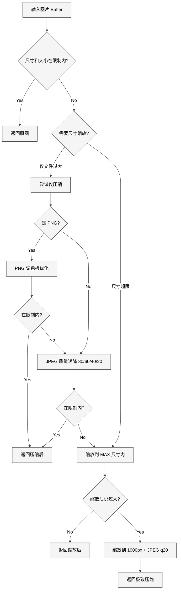
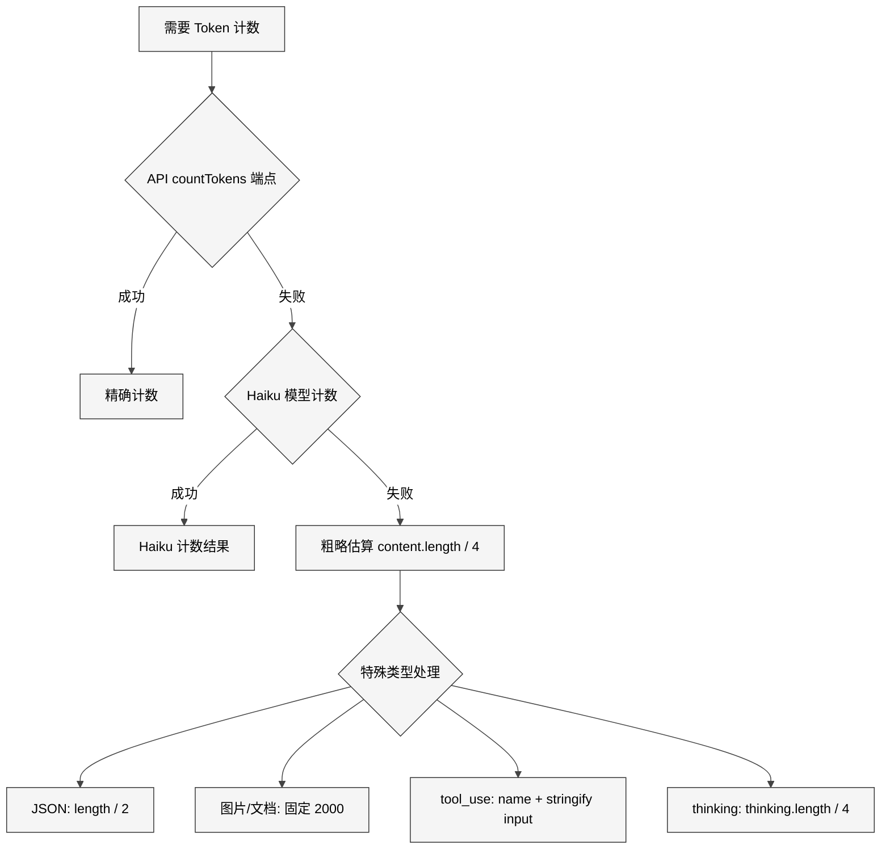
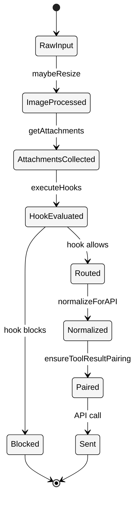

# 附录C 消息与附件

> 核心提要：消息管线与附件处理

---

## C.1 定位

在 Claude Code 的 513,216 行 TypeScript 代码（v2.1.88，1,884 文件）中，消息管线与附件处理系统是连接用户输入与 API 调用之间的**关键中间层**。它不属于 Agent 循环的核心逻辑（`query.ts`），也不属于工具执行层（`tools/`），而是夹在两者之间、负责**将人类世界的杂乱信号转化为模型可消费的结构化上下文**的子系统。

**本章涉及的核心文件**：

| 文件 | 行数 | 核心职责 |
|------|------|---------|
| `src/utils/messages.ts` | 5,512 | 消息创建、规范化、API 转换 |
| `src/utils/attachments.ts` | 3,997 | 附件类型定义、附件收集引擎 |
| `src/utils/processUserInput/processUserInput.ts` | 605 | 用户输入统一入口 |
| `src/utils/imageResizer.ts` | 880 | 图片缩放与压缩管线 |
| `src/utils/imageStore.ts` | 167 | 图片持久化与缓存 |
| `src/utils/tokens.ts` | 261 | Token 计数与上下文估算 |
| `src/services/tokenEstimation.ts` | 495 | Token 精确计数与降级 |
| `src/components/messages/` | 41 文件 | 消息渲染组件 |

总计约 **11,917 行核心代码 + 41 个渲染组件**，构成了整个管线的骨架。

**本章结构**：先从架构设计出发，理解管线的整体流转；再深入实现细节，剖析附件类型系统、图片处理、token 估算三大子系统；然后分析工程细节与防御编程模式；最后进行竞品对比与未来展望。

---

## C.2 架构

### C.2.1 管线总体架构

消息管线的本质是一个**多源汇聚、六步处理、双向转换**的数据流系统。它需要处理的"输入"不仅仅是用户打的字——还包括粘贴的图片、IDE 选区、文件引用、Hook 响应、团队消息、计划文件、MCP 资源等数十种异构信号。

<div style="background: #ffffff; padding: 16px; border-radius: 8px; margin: 16px 0;">



</div>

### C.2.2 三层消息模型

Claude Code 的消息系统有三层抽象，每层服务于不同目的：

1. **内部消息（`Message` 联合类型）**：包含 `UserMessage`、`AssistantMessage`、`AttachmentMessage`、`SystemMessage`、`ProgressMessage` 五种类型，携带 `uuid`、`timestamp`、`isMeta` 等元数据。这是管线内部流转的载体。

2. **附件消息（`AttachmentMessage`）**：一种特殊的消息类型，携带 `Attachment` 联合类型（50+ 变体），在发送给 API 前通过 `normalizeAttachmentForAPI()` 转换为标准 `UserMessage[]`。

3. **API 消息（`MessageParam`）**：Anthropic SDK 的标准格式，只有 `user` 和 `assistant` 两种角色。所有内部消息最终都要被 "拍扁" 到这一层。

<div style="background: #ffffff; padding: 16px; border-radius: 8px; margin: 16px 0;">



</div>

**关键设计决策**：为什么需要 `AttachmentMessage` 这个中间层？

答案在于**解耦信号收集与 API 序列化**。附件在用户输入阶段被收集（`getAttachments()`），但如何序列化为 API 消息是另一个问题。例如，一个文件附件可能被序列化为 `FileReadTool` 的工具调用 + 工具结果对；一个 IDE 选区可能被包裹在 `<system-reminder>` 标签中；一个 Hook 结果可能被截断到 10,000 字符。这些复杂的序列化逻辑由 `normalizeAttachmentForAPI()` 统一处理，避免了将 30+ 种序列化策略散落在管线各处。

---

## C.3 实现

### C.3.1 processUserInput：六步管线

`processUserInput()`（`src/utils/processUserInput/processUserInput.ts` L85）是所有用户输入的**唯一入口**。无论输入来自键盘、粘贴、IDE 选区还是 Bridge 远程消息，都经过这个函数。它接受 18 个参数（L85-L140），反映了管线需要处理的上下文之丰富。

<div style="background: #ffffff; padding: 16px; border-radius: 8px; margin: 16px 0;">



</div>

**六步详解**：

**Step 1：图片块规范化**（L316-L345）。对输入中的 `image` 类型内容块调用 `maybeResizeAndDownsampleImageBlock()`，确保图片尺寸在 API 限制内。同时收集图片元数据（原始尺寸、显示尺寸、缩放因子），后续作为 `isMeta: true` 的隐藏消息注入，让模型知道坐标映射关系。

这一步还处理了 iOS Bridge 的**命名规范不一致问题**：iOS 发送 `mediaType`（驼峰），API 期望 `media_type`（下划线）。代码注释在 L311 明确标注了这个跨平台兼容性修复。

**Step 2：粘贴图片存储**（L353-L420）。`storeImages()` 将图片写入磁盘（`~/.claude/image-cache/{sessionId}/`），使模型可以通过文件路径引用图片——例如在 PR 中上传截图。`Promise.all()` 并行处理所有图片，每张图片独立缩放。

**Step 3：Ultraplan 关键词检测**（L467-L493）。在**扩展前的原始输入**（`preExpansionInput`）中检测 ultraplan 关键词，而非扩展后的输入。这是一个精妙的安全设计——如果用户粘贴的文本恰好包含触发词，不应意外触发 Ultraplan 路由。

**Step 4：附件提取**（L499-L514）。调用 `getAttachmentMessages()`，这是整个管线中最复杂的函数，后文详细分析。

**Step 5：路由分发**（L517-L588）。三路分发：
- `mode === 'bash'` → `processBashCommand()`（动态导入）
- 输入以 `/` 开头 → `processSlashCommand()`（动态导入）
- 其他 → `processTextPrompt()`

注意 `processBashCommand` 和 `processSlashCommand` 都使用**动态 `import()`**，这是启动性能优化——避免在非相关路径加载不必要的模块。

**Step 6：Hook 执行**（L178-L264）。`executeUserPromptSubmitHooks()` 是一个异步生成器，Hook 可以：
- **阻止查询**：返回 `blockingError`，原始输入被替换为系统警告消息
- **阻止继续**：设置 `preventContinuation`，保留原始输入但不发给模型
- **注入上下文**：通过 `additionalContexts` 向消息数组追加附件

Hook 输出截断上限为 **10,000 字符**（L272），防止恶意或失控的 Hook 注入过多内容。

### C.3.2 附件类型系统：50+ 变体的联合类型

`attachments.ts` L440-L717 定义的 `Attachment` 联合类型是整个系统中最庞大的类型定义之一，包含 **50+ 个变体**。以下是按功能域分类的核心类型：

| 功能域 | 附件类型 | 说明 |
|--------|---------|------|
| **文件系统** | `file`, `already_read_file`, `compact_file_reference`, `pdf_reference`, `directory`, `edited_text_file`, `edited_image_file` | 文件读取、PDF 引用、目录列表、文件变更通知 |
| **IDE 集成** | `selected_lines_in_ide`, `opened_file_in_ide` | VS Code 等 IDE 的选区和打开文件 |
| **Agent 系统** | `agent_mention`, `agent_listing_delta`, `task_status`, `teammate_mailbox`, `team_context` | 子 Agent 引用、团队邮箱、任务状态 |
| **Hook 系统** | `hook_success`, `hook_blocking_error`, `hook_non_blocking_error`, `hook_cancelled`, `hook_stopped_continuation`, `hook_permission_decision`, `hook_additional_context`, `hook_system_message`, `hook_error_during_execution`, `async_hook_response` | 10 种 Hook 结果子类型 |
| **记忆系统** | `nested_memory`, `relevant_memories`, `current_session_memory` | CLAUDE.md、自动记忆、会话记忆 |
| **Skill 系统** | `dynamic_skill`, `skill_listing`, `skill_discovery`, `invoked_skills` | 技能加载、列表、发现、恢复 |
| **计划模式** | `plan_mode`, `plan_mode_exit`, `plan_mode_reentry`, `plan_file_reference`, `verify_plan_reminder` | 计划模式全生命周期 |
| **资源监控** | `token_usage`, `budget_usd`, `output_token_usage` | Token 使用量、预算 |
| **上下文管理** | `queued_command`, `deferred_tools_delta`, `mcp_instructions_delta`, `compaction_reminder`, `context_efficiency`, `date_change` | 排队命令、工具增量、压缩提醒 |

**设计亮点**：这个联合类型使用了 TypeScript 的**判别联合（Discriminated Union）**模式，以 `type` 字段区分。编译器可以在 `switch` 语句中检查穷尽性。`AttachmentMessage.tsx` 的 `default` 分支（L354）使用 `satisfies NullRenderingAttachmentType` 做编译时穷尽性断言——如果新增附件类型而忘记处理，TypeScript 会报错。

### C.3.3 附件收集引擎：getAttachments()

`getAttachments()`（`attachments.ts` L743）是附件系统的核心函数，负责在每次用户输入时收集 **25+ 种附件**。它使用了一种巧妙的 **`maybe()` 包装器 + `Promise.all()` 并行收集**模式：

```typescript
// attachments.ts L773-L815（简化）
const userInputAttachments = input
  ? [
      maybe('at_mentioned_files', () => processAtMentionedFiles(input, context)),
      maybe('mcp_resources', () => processMcpResourceAttachments(input, context)),
      maybe('agent_mentions', () => processAgentMentions(input, ...)),
    ]
  : []

const userAttachmentResults = await Promise.all(userInputAttachments)
```

`maybe()` 包装器为每个附件提供**错误隔离**——单个附件收集失败不会导致整个管线崩溃。同时它为每个附件操作设置了 **1 秒超时**（L767），防止缓慢的文件系统操作阻塞提交。

附件收集分三层执行：

1. **用户输入附件**（`userInputAttachments`）：依赖用户输入内容，如 `@` 文件引用、MCP 资源、Agent 提及
2. **全线程附件**（`allThreadAttachments`）：所有线程（主线程 + 子 Agent）共享的附件，如排队命令、日期变更、工具增量
3. **主线程附件**（`mainThreadAttachments`）：仅在主会话线程中执行的附件，如 IDE 选区、诊断信息、Token 使用量

这种分层确保子 Agent 不会收到不属于它的附件（如 IDE 选区），同时共享必要信息（如排队命令）。

### C.3.4 normalizeAttachmentForAPI：从附件到 API 消息

`normalizeAttachmentForAPI()`（`messages.ts` L3453）是一个 800+ 行的巨型 switch 语句，将每种附件类型转换为标准的 `UserMessage[]`。几个值得注意的转换策略：

**文件附件 → 工具调用对**：文件附件被转换为 `FileReadTool` 的工具调用 + 工具结果消息对（L3546-L3554），让模型认为自己"调用了文件读取工具"。这是一种**虚拟工具调用**模式，让附件内容以模型最熟悉的方式呈现。

**系统级附件 → `<system-reminder>` 包装**：大多数附件被 `wrapMessagesInSystemReminder()` 包装后注入。这些消息设置 `isMeta: true`，意味着它们**对模型可见但对用户隐藏**。

**旧版附件兼容**：L4268-L4277 维护了一个 `LEGACY_ATTACHMENT_TYPES` 数组，处理已废弃但可能出现在 `--resume` 恢复会话中的旧附件类型。

### C.3.5 图片处理子系统

图片处理是管线中最复杂的 I/O 密集操作。`imageResizer.ts`（880 行）实现了一个**多策略渐进降级**的压缩管线：

<div style="background: #ffffff; padding: 16px; border-radius: 8px; margin: 16px 0;">



</div>

**关键实现细节**：

1. **每次操作创建新 sharp 实例**（L288-L291 注释）：native `image-processor-napi` 模块在复用 sharp 实例后调用 `toBuffer()` 时不会正确应用格式转换。这是一个在实际生产中发现的 bug，导致所有压缩尝试返回相同大小。

2. **Magic bytes 格式检测**（L769-L812）：不信任文件扩展名或 MIME 类型，而是通过字节头检测实际格式（PNG: `89 50 4E 47`，JPEG: `FF D8 FF`，GIF: `47 49 46`，WebP: `52 49 46 46...57 45 42 50`）。

3. **PNG 维度额外检查**（L404-L411）：即使 base64 大小在 5MB 以内，如果 PNG IHDR 表明尺寸超过 `IMAGE_MAX_WIDTH x IMAGE_MAX_HEIGHT`，也会拒绝——因为尺寸限制和大小限制是两个独立的 API 约束。

4. **坐标映射元数据**（`createImageMetadataText` L835-L880）：当图片被缩放时，生成类似 `[Image: original 3000x2000, displayed at 1500x1000. Multiply coordinates by 2.00 to map to original image.]` 的元数据文本，作为 `isMeta: true` 消息注入。这让模型在分析截图时能正确映射 UI 元素坐标。

### C.3.6 imageStore：会话级图片缓存

`imageStore.ts`（167 行）实现了一个精简的**会话级图片持久化**系统：

- **存储路径**：`~/.claude/image-cache/{sessionId}/{imageId}.{ext}`
- **内存缓存**：`Map<number, string>` 存储 imageId → 文件路径映射
- **容量上限**：`MAX_STORED_IMAGE_PATHS = 200`，采用 FIFO 驱逐策略（L115-L123）
- **文件权限**：`0o600`（L64），仅属主可读写
- **跨会话清理**：`cleanupOldImageCaches()` 删除非当前会话的缓存目录

**设计意图**：图片写入磁盘不仅仅是为了减少内存占用。更重要的是让模型可以通过 `BashTool` 或 `FileReadTool` 引用图片路径——例如在创建 PR 时上传截图，或者用 ImageMagick 处理图片。

### C.3.7 Token 计数：三级降级策略

Token 计数是上下文管理的核心基础设施。Claude Code 实现了**精确 + 粗略**双层计数和**三级降级**策略：

<div style="background: #ffffff; padding: 16px; border-radius: 8px; margin: 16px 0;">



</div>

**`tokenCountWithEstimation()`**（`tokens.ts` L226-L261）是上下文大小测量的**规范函数**。它的实现有一个精妙细节：**并行工具调用的 split assistant records 处理**。

当模型发起多个并行工具调用时，流式处理代码为每个内容块创建独立的 AssistantMessage 记录，它们共享同一个 `message.id` 和 `usage`。消息数组看起来像：

```
[..., assistant(id=A), user(result), assistant(id=A), user(result), ...]
```

如果只从最后一个 assistant 记录开始估算，会遗漏中间的 tool_result 消息。因此代码（L235-L252）在找到带 usage 的记录后，**向前回溯**到具有相同 `message.id` 的第一个记录，确保所有交错的 tool_result 都被纳入估算。

**粗略估算的文件类型适配**：`bytesPerTokenForFileType()`（`tokenEstimation.ts` L215-L224）对 JSON 文件使用 `length / 2` 而非默认的 `length / 4`，因为 JSON 中大量的单字符 token（`{`, `}`, `:`, `,`, `"`）使得实际 token 密度更高。这个看似微小的调整，防止了 Bedrock 降级场景下大型 JSON 工具结果被低估 token 数而溢出上下文窗口。

---

## C.4 细节

### C.4.0 消息生命周期状态

一条消息从创建到最终发送给 API，经历多个状态转换：

<div style="background: #ffffff; padding: 16px; border-radius: 8px; margin: 16px 0;">



</div>

Hook 评估是管线中唯一可以**中断**消息流转的环节。`blockingError` 导致消息被替换为系统警告；`preventContinuation` 导致消息被保留但不触发查询。这种设计给了 Hook 系统对消息管线的**否决权**。

### C.4.1 防御性编程模式

**1. Hook 输出截断**（`processUserInput.ts` L272-L279）：

```typescript
const MAX_HOOK_OUTPUT_LENGTH = 10000

function applyTruncation(content: string): string {
  if (content.length > MAX_HOOK_OUTPUT_LENGTH) {
    return `${content.substring(0, MAX_HOOK_OUTPUT_LENGTH)}… [output truncated - exceeded ${MAX_HOOK_OUTPUT_LENGTH} characters]`
  }
  return content
}
```

这是对 Hook 系统的**信任边界**。用户自定义 Hook 可能输出任意长度的内容，不截断会导致上下文窗口溢出。10,000 字符的阈值在 "够用" 和 "不浪费" 之间取得平衡。

**2. 附件收集超时**（`attachments.ts` L767）：

```typescript
const abortController = createAbortController()
const timeoutId = setTimeout(ac => ac.abort(), 1000, abortController)
```

1 秒超时防止缓慢的文件系统操作（如 NFS 挂载、网络磁盘）阻塞用户输入提交。这是**体验优先**的设计——宁可丢失某个附件，也不让用户等待。

**3. Null 渲染附件过滤**（`nullRenderingAttachments.ts` L14-L49）：

定义了 28 种对用户不可见的附件类型。`Messages.tsx` 在渲染前过滤这些附件，避免它们消耗 200 条消息的渲染预算（CC-724 bug fix）。TypeScript 的 `satisfies` 操作符确保新增附件类型不会被遗漏。

**4. 合成消息过滤**（`tokens.ts` L7-L20）：

```typescript
export function getTokenUsage(message: Message): Usage | undefined {
  if (
    message?.type === 'assistant' &&
    'usage' in message.message &&
    !(
      message.message.content[0]?.type === 'text' &&
      SYNTHETIC_MESSAGES.has(message.message.content[0].text)
    ) &&
    message.message.model !== SYNTHETIC_MODEL
  ) {
    return message.message.usage
  }
  return undefined
}
```

`SYNTHETIC_MODEL` 标记为 `'<synthetic>'`，`SYNTHETIC_MESSAGES` 包含中断、取消、拒绝等系统生成的消息。Token 计数函数必须排除这些消息——它们有 usage 字段但值为 0，如果被选为 "最近的 API 响应"，会导致上下文大小被错误地估为 0。

**5. 旧版附件兼容**（`messages.ts` L4268-L4277）：

```typescript
const LEGACY_ATTACHMENT_TYPES = [
  'autocheckpointing',
  'background_task_status',
  // ...
]
```

`--resume` 恢复的旧会话可能包含已废弃的附件类型。不做兼容处理会导致 `normalizeAttachmentForAPI` 进入 `default` 分支并输出错误日志。

### C.4.2 性能优化策略

**1. 图片并行处理**：`processUserInput.ts` L366-L388 使用 `Promise.all()` 并行缩放所有粘贴图片，而非串行处理。

**2. 动态导入减少启动开销**：`processBashCommand` 和 `processSlashCommand` 使用 `await import()`（L518, L538），仅在实际需要时加载模块。

**3. 查询性能追踪**：`queryCheckpoint()` 调用散布在管线各步骤之间（L149, L172, L179, L264, L317, L335, L365, L420, L501, L514），为性能分析提供精确的时间戳。

**4. 惰性 AWS SDK 导入**：`tokenEstimation.ts` L3 的注释明确说明 `@aws-sdk/client-bedrock-runtime` 是动态导入的，"to defer ~279KB of AWS SDK code until a Bedrock call is actually made"。

### C.4.3 代码中的 TODO 与技术债务

源码中有若干标记了技术债务的 TODO：

1. **`processUserInput.ts` L200**：`// TODO: Make this an attachment message` — Hook 阻止错误目前使用 `createSystemMessage()`，理想情况应该是 `AttachmentMessage` 以获得更好的渲染控制。

2. **`processUserInput.ts` L242**：`// TODO: Clean this up` — Hook 结果处理的分支逻辑需要重构。

3. **`attachments.ts` L741**：`// TODO: Generate attachments when we create messages` — 附件生成时机太晚（提交时而非输入时），理想情况应该在用户输入时预计算。

4. **`attachments.ts` L764**：`// TODO: Compute attachments as the user types, not here` — 同上，进一步确认附件预计算是已知的改进方向。

5. **`messages.ts` L2674**：`// TODO: This needs patching as recursive fields can still be stringified` — 工具输入规范化有已知的递归字段 bug。

---

## C.5 比较

### C.5.1 附件系统丰富度对比

| 特性 | Claude Code | Cursor | Copilot Chat | Aider | Cline |
|------|-------------|--------|--------------|-------|-------|
| 文件附件 | 50+ 变体 | 约 5 种 | 约 3 种 | 约 2 种 | 约 4 种 |
| 图片处理 | 多策略渐进压缩 | 基础缩放 | 不支持 | 不支持 | 基础支持 |
| IDE 选区注入 | 原生支持 | 原生支持 | 原生支持 | N/A | 原生支持 |
| Hook 系统集成 | 10 种 Hook 附件 | 不支持 | 不支持 | 不支持 | 不支持 |
| Agent 间通信 | teammate_mailbox | 不支持 | 不支持 | 不支持 | 不支持 |
| 记忆注入 | 4 层 + Auto Memory | Project Rules | Copilot Instructions | `.aider.conf` | Custom Instructions |
| Token 计数 | 三级降级 | 不公开 | 不公开 | tiktoken 本地 | 不公开 |
| 多源输入统一 | Bridge + SDK + CLI + IDE | IDE 内嵌 | IDE 内嵌 | CLI 只 | IDE 内嵌 |

**Claude Code 的优势**：

1. **附件类型系统的丰富度遥遥领先**。50+ 变体覆盖了从文件系统到 Agent 通信的全光谱，而竞品大多只处理文件和选区。

2. **图片处理管线的鲁棒性**。多策略渐进降级 + magic bytes 格式检测 + 坐标映射元数据注入，这是一个考虑周全的工程实现。Aider 和 Copilot Chat 甚至不支持图片。

3. **Hook 系统的深度集成**。10 种 Hook 附件类型意味着 Hook 不仅能控制行为，还能向对话注入结构化上下文。竞品的 Hook/Plugin 系统远没有这么深入。

**Claude Code 的局限**：

1. **附件收集是同步阻塞的**。尽管有 1 秒超时，`getAttachments()` 仍然在每次提交时阻塞。TODO 注释明确指出应该在用户输入时预计算。

2. **缺少增量附件更新**。每次提交都重新收集所有附件，而非仅收集变化的部分。这在长对话中产生不必要的开销。

3. **`normalizeAttachmentForAPI` 的巨型 switch**。800+ 行的 switch 语句是维护负担，新增附件类型需要在 3 个地方同步修改（类型定义、收集逻辑、序列化逻辑、渲染组件）。

### C.5.2 消息模型对比

**Aider** 的消息模型相对简单：`user`/`assistant`/`system` 三种角色，文件内容直接作为 system prompt 的一部分注入。没有中间的 `Attachment` 抽象层。

**Cursor** 使用专有协议与其云端模型通信，消息模型不公开。但从行为观察，它对上下文注入（代码库索引、文件引用）做了深度优化。

**Claude Code 的独特之处**在于 `AttachmentMessage` 中间层的引入。这层抽象看似增加了复杂性，但带来了关键好处：**附件的收集时机和序列化策略可以独立演进**。例如，未来可以在不改变收集逻辑的情况下，为不同模型实现不同的序列化策略。

---

## C.6 辨误

### 误解 1："消息管线就是简单的请求转发"

**事实**：管线在每一轮执行 25+ 种附件收集、图片缩放、Hook 评估、路由分发等操作。"简单转发" 的说法忽视了近 12,000 行核心代码的复杂性。Anthropic 官方的 Context Engineering 文章强调，管线的设计质量直接决定了模型行为的质量。

### 误解 2："附件就是文件内容"

**事实**：附件是一个拥有 50+ 变体的联合类型，文件内容只是其中一小部分。Hook 结果、Agent 通信、计划提醒、Token 预算、上下文压缩提示等都通过附件系统注入。附件是 Claude Code **上下文工程**的核心载体。

### 误解 3："Token 计数只需要 `content.length / 4`"

**事实**：粗略估算只是最后的降级手段。Claude Code 优先使用 API 精确计数，降级到 Haiku 模型计数，最后才使用字符估算。而且字符估算也针对不同内容类型做了适配——JSON 用 `length / 2`，图片/文档固定 2,000 tokens，tool_use 需要 stringify input。忽视这些细节会导致上下文窗口溢出或提前触发压缩。

### 误解 4："isMeta 消息不重要"

**事实**：`isMeta: true` 消息是 Claude Code 上下文工程的核心武器。它们对模型可见、对用户隐藏，承载了坐标映射元数据、记忆注入、计划提醒、系统指令等关键信号。删除 isMeta 消息会导致模型失去大量上下文信息。

---

## C.7 展望

### C.7.1 已知缺陷

1. **附件收集的时序耦合**：`getAttachments()` 注释明确指出（L764），附件应该在用户输入时预计算而非提交时收集。当前设计在每次提交时引入 100-1000ms 的延迟。

2. **normalizeAttachmentForAPI 的维护成本**：800+ 行的 switch 语句，新增附件类型需要同步修改 4 个位置（类型定义、收集函数、序列化函数、渲染组件），违反了开闭原则。

3. **图片处理的 sharp 实例 bug**（`imageResizer.ts` L288-L291）：必须为每次操作创建新 sharp 实例，因为 native napi 模块的格式转换状态不正确。这增加了内存分配开销。

4. **Token 估算的精度差距**：粗略估算（`length / 4`）与实际 token 数之间可能有 30-50% 的偏差，尤其是对混合中英文内容。

### C.7.2 改进建议

**如果重新设计下一版**：

1. **引入附件注册表模式**：用注册表替代硬编码的 switch，每种附件类型注册自己的收集器、序列化器和渲染器。新增附件只需一处注册。

2. **附件预计算 + 差量更新**：在用户输入时后台预计算附件，提交时只同步差量。这可以将感知延迟降低到接近零。

3. **流式附件收集**：将 `getAttachments()` 改为 AsyncGenerator，已收集的附件可以立即开始序列化，而非等待所有附件收集完毕。

4. **图片处理 Worker 化**：将 sharp 调用移到 Worker Thread，避免阻塞主线程。对于大型截图（如 4K 屏幕），单次处理可能耗时数百毫秒。

5. **Token 计数的本地 tokenizer**：集成类似 tiktoken 的本地 tokenizer，在不调用 API 的情况下获得更精确的估算，减少对 Haiku fallback 的依赖。

### C.7.3 对 Agent 开发者的启示

1. **消息管线是 Agent 工程的隐藏核心**。不要只关注 Agent 循环和工具调用，管线的设计质量决定了模型看到什么上下文、做出什么决策。

2. **附件系统是可扩展的上下文注入框架**。如果你的 Agent 需要注入特定领域的上下文（如数据库 schema、API 文档、团队规范），参考 Claude Code 的附件模式——定义类型、实现收集器、编写序列化器。

3. **Token 估算不能马虎**。不同内容类型的 token 密度差异显著，一刀切的 `length / 4` 会导致严重的上下文管理问题。至少为 JSON、图片、工具调用做专门处理。

4. **图片处理需要渐进降级**。不要假设 sharp/Pillow 总是可用的。Claude Code 的多策略降级（尝试压缩 → 尝试缩放 → 极致压缩 → 原图透传）确保了各种环境下的可用性。

5. **isMeta 消息模式值得借鉴**。在用户不可见的 "影子通道" 中向模型注入元数据（坐标映射、文件变更通知、预算提醒），是一种极其有效的上下文工程技巧。

---

## C.8 小结

1. **消息管线是上下文工程的运行时**。`processUserInput()` 的六步管线将 6 种输入源转化为结构化的 Message 数组，在每一轮对话中动态组装数十种异构信号。

2. **50+ 变体的附件联合类型是系统可扩展性的基础**。通过 TypeScript 判别联合 + `satisfies` 穷尽性检查，在编译时保证每种附件类型都被正确处理——这是 TypeScript 类型系统在大型系统工程中的教科书级应用。

3. **图片处理管线展现了工程鲁棒性**。多策略渐进降级、magic bytes 格式检测、坐标映射元数据注入、会话级磁盘缓存——这些细节共同构成了一个在各种边界条件下都能正确工作的子系统。

4. **Token 计数的三级降级策略平衡了精度与可用性**。API 精确计数 → Haiku 模型计数 → 内容类型感知的粗略估算，加上并行工具调用的 split record 回溯处理，确保上下文大小估算在各种场景下都足够准确。

5. **已知的技术债务指向了明确的改进方向**。附件预计算、注册表模式、流式收集、Worker 化图片处理——这些都是下一代 Agent 消息管线的演进路径。
