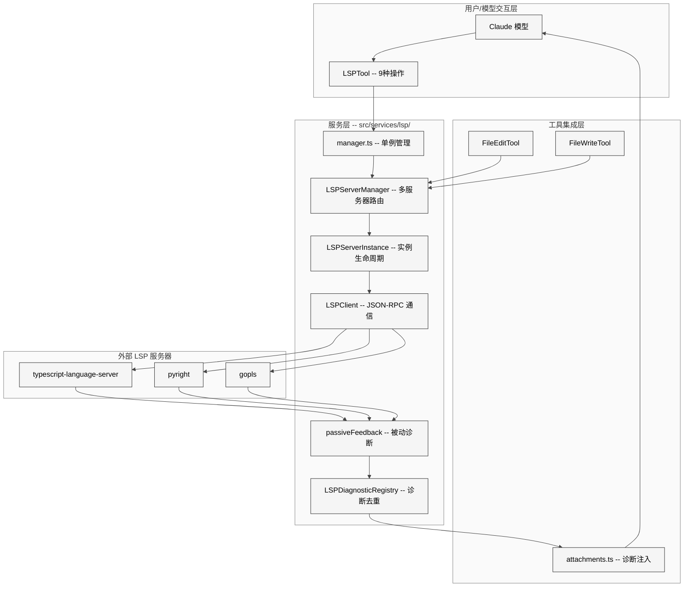
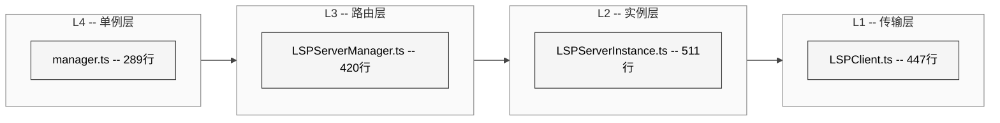
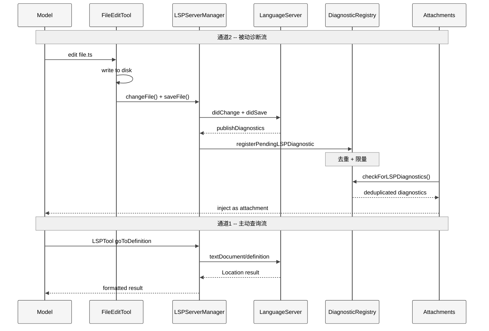
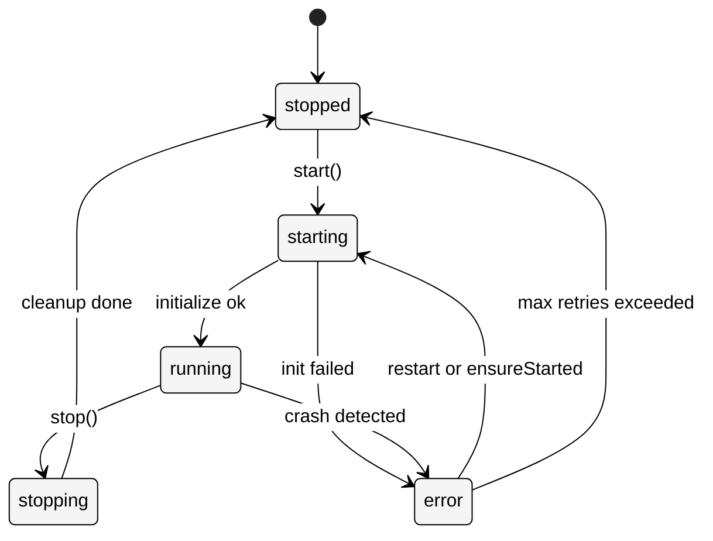
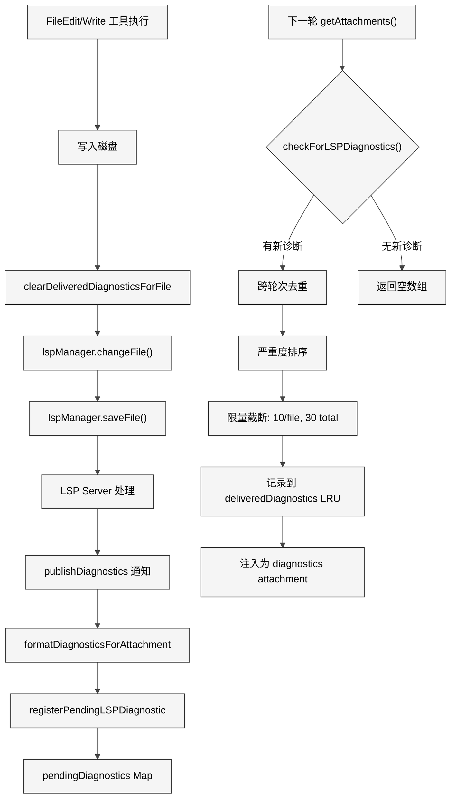

# 附录D LSP 集成

> 核心提要：代码智能的协议接口

---

## D.1 定位

Claude Code 的 LSP（Language Server Protocol）子系统是整个 513,216 行代码库中一个规模精巧但设计精密的模块。以约 5,000 行 TypeScript（跨 14 个文件）的体量，它完成了一件在传统 IDE 中需要数万行代码才能实现的工作：让一个 AI Agent 拥有编译器级的代码感知能力。

**本章分析范围**：

| 模块 | 文件数 | 行数 | 职责 |
|------|--------|------|------|
| `src/services/lsp/` | 7 | 2,460 | 核心服务层：客户端、服务实例、管理器、诊断注册表 |
| `src/tools/LSPTool/` | 5 | 1,778 | 工具层：9 种 LSP 操作暴露给模型 |
| `src/utils/plugins/lsp*.ts` | 2 | 761 | 插件集成层：配置加载、推荐系统 |

**在 Claude Code 架构中的位置**：LSP 子系统横跨三个架构层级——它是 `services/` 中的基础设施服务、`tools/` 中的模型可调用工具、以及 `attachments` 系统中的被动诊断源。这种三层角色使得它既是模型的"眼睛"（通过 LSPTool 主动查询），又是模型的"耳朵"（通过被动诊断自动注入上下文）。

<div style="background: #ffffff; padding: 16px; border-radius: 8px; margin: 16px 0;">



</div>

---

## D.2 架构

### D.2.1 核心设计决策：客户端而非服务器

Claude Code 的 LSP 集成有一个根本性的架构决策：**它是 LSP 客户端，不是 LSP 服务器**。

在传统的 IDE 架构中（如 VS Code），编辑器既是 LSP 客户端（连接语言服务器获取诊断）也是文本编辑器。Claude Code 选择只做客户端，复用用户系统上已安装的语言服务器生态。这个决策带来三个关键优势：

1. **零安装负担**：不需要为每种语言打包语言服务器，只需检测已安装的即可
2. **生态复用**：TypeScript、Python、Go、Rust 等语言的语言服务器已经非常成熟
3. **配置外包**：LSP 服务器的配置完全委托给插件系统，核心代码保持简洁

从 `config.ts` 可以验证这一设计：

```typescript
// src/services/lsp/config.ts L11-L16
export async function getAllLspServers(): Promise<{
  servers: Record<string, ScopedLspServerConfig>
}> {
  const allServers: Record<string, ScopedLspServerConfig> = {}
  // ...
  const { enabled: plugins } = await loadAllPluginsCacheOnly()
```

LSP 服务器配置**完全来自插件**，不存在任何硬编码的服务器列表。由此可见 Claude Code 核心不需要知道任何特定语言服务器的实现细节。

### D.2.2 四层架构分层

LSP 子系统采用了清晰的四层架构，每层职责单一：

<div style="background: #ffffff; padding: 16px; border-radius: 8px; margin: 16px 0;">



</div>

**L1 传输层 — `LSPClient.ts`（447 行）**：纯粹的 JSON-RPC over stdio 封装，基于 `vscode-jsonrpc`。负责进程 spawn、消息收发、错误传播。不包含任何 LSP 协议语义。

**L2 实例层 — `LSPServerInstance.ts`（511 行）**：单个 LSP 服务器的完整生命周期管理。包含状态机（stopped→starting→running→stopping→error）、初始化参数组装、重试逻辑、健康检查。

**L3 路由层 — `LSPServerManager.ts`（420 行）**：多服务器路由。根据文件扩展名映射到对应的 LSP 服务器实例，管理文件打开/关闭状态，协调 didOpen/didChange/didSave 通知。

**L4 单例层 — `manager.ts`（289 行）**：全局单例管理。处理初始化状态机（not-started→pending→success/failed）、异步初始化、重初始化（插件刷新时）、优雅关闭。

### D.2.3 闭包工厂模式：刻意回避 class

LSP 子系统有一个鲜明的编码风格特征：**完全使用闭包工厂函数而不是 class**。`createLSPClient()`、`createLSPServerInstance()`、`createLSPServerManager()` 三个核心工厂函数都遵循同一模式：

```typescript
// src/services/lsp/LSPServerManager.ts L59
export function createLSPServerManager(): LSPServerManager {
  // Private state managed via closures
  const servers: Map<string, LSPServerInstance> = new Map()
  const extensionMap: Map<string, string[]> = new Map()
  const openedFiles: Map<string, string> = new Map()
  // ... return public interface
  return { initialize, shutdown, getServerForFile, /* ... */ }
}
```

这不是偶然的风格偏好。`LSPServerManager.ts` 的注释明确说明了这一设计意图："Uses factory function pattern with closures for state encapsulation (avoiding classes)."这与 Claude Code 整体代码库的风格一致——偏好函数式组合，通过闭包实现真正的私有状态，而非 TypeScript class 中名义上的 `private`。

### D.2.4 双通道架构：主动查询 + 被动诊断

LSP 子系统关键的架构决策是**双通道设计**：

**通道 1：主动查询**——模型通过 `LSPTool` 主动发起 9 种 LSP 操作（goToDefinition、findReferences、hover 等），获得结构化的代码智能响应。

**通道 2：被动诊断**——当 `FileEditTool` 或 `FileWriteTool` 修改文件时，自动通知 LSP 服务器，服务器推送 `textDocument/publishDiagnostics`，经过去重和限量后作为 attachment 自动注入到下一轮对话上下文中。

<div style="background: #ffffff; padding: 16px; border-radius: 8px; margin: 16px 0;">



</div>

被动诊断通道是自修复循环的核心引擎。当模型编辑代码引入类型错误时，LSP 诊断会自动出现在下一轮上下文中，模型"看到"错误后自然会发起修复——整个过程无需用户干预。

---

## D.3 实现

### D.3.1 LSPClient：传输层的防御性工程

`LSPClient.ts`（447 行）是与外部 LSP 服务器进程交互的唯一边界。它的代码注释密度极高，几乎每段逻辑都附带了"为什么"的解释。这些注释揭示了该模块暴露出较强的生产问题防御性设计痕迹。

**关键实现 1：异步 spawn 竞态防护**

```typescript
// src/services/lsp/LSPClient.ts L110-L131
// 1.5. Wait for process to successfully spawn before using streams
// This is CRITICAL: spawn() returns immediately, but the 'error' event
// (e.g., ENOENT for command not found) fires asynchronously.
// If we use the streams before confirming spawn succeeded, we get
// unhandled promise rejections when writes fail on invalid streams.
const spawnedProcess = process
await new Promise<void>((resolve, reject) => {
  const onSpawn = (): void => { cleanup(); resolve() }
  const onError = (error: Error): void => { cleanup(); reject(error) }
  const cleanup = (): void => {
    spawnedProcess.removeListener('spawn', onSpawn)
    spawnedProcess.removeListener('error', onError)
  }
  spawnedProcess.once('spawn', onSpawn)
  spawnedProcess.once('error', onError)
})
```

这段代码解决了 Node.js `child_process.spawn()` 的一个经典陷阱：spawn 返回时进程可能尚未真正启动。注释中"This is CRITICAL"的措辞暗示这是在修复一个生产环境 bug 后添加的。

**关键实现 2：Pending Handler 队列**

```typescript
// src/services/lsp/LSPClient.ts L64-L71
const pendingHandlers: Array<{
  method: string
  handler: (params: unknown) => void
}> = []
const pendingRequestHandlers: Array<{
  method: string
  handler: (params: unknown) => unknown | Promise<unknown>
}> = []
```

这个设计支持"先注册 handler、后建立连接"的懒初始化模式。`passiveFeedback.ts` 中的诊断处理器可以在 LSP 服务器实际启动之前就注册，连接就绪后自动应用。

**关键实现 3：isStopping 标志防止虚假错误**

```typescript
// src/services/lsp/LSPClient.ts L62
let isStopping = false // Track intentional shutdown to avoid spurious error logging
```

整个文件中 `isStopping` 出现了 7 次，用于区分"服务器崩溃"和"我们主动关闭"两种场景。这是一个在长时间运行系统中常见的防御模式——关闭过程中连接断开是预期行为，不应该触发错误日志。

### D.3.2 LSPServerInstance：状态机与重试策略

`LSPServerInstance.ts`（511 行）管理单个 LSP 服务器的完整生命周期，包含一个五状态的状态机：

<div style="background: #ffffff; padding: 16px; border-radius: 8px; margin: 16px 0;">



</div>

**瞬态错误重试（ContentModified -32801）**

```typescript
// src/services/lsp/LSPServerInstance.ts L17-L28
const LSP_ERROR_CONTENT_MODIFIED = -32801
const MAX_RETRIES_FOR_TRANSIENT_ERRORS = 3
const RETRY_BASE_DELAY_MS = 500
```

LSP 规范定义了 `-32801` 错误码表示"内容已修改"，常见于 rust-analyzer 等服务器在索引过程中。实例层实现了指数退避重试（500ms → 1000ms → 2000ms），并且明确使用 duck typing 检测错误码而非 `instanceof`，注释解释了原因："there may be multiple versions of vscode-jsonrpc in the dependency tree (8.2.0 vs 8.2.1)"。这是深度依赖管理经验的体现。

**崩溃恢复限制**

```typescript
// src/services/lsp/LSPServerInstance.ts L140-L149
const maxRestarts = config.maxRestarts ?? 3
if (state === 'error' && crashRecoveryCount > maxRestarts) {
  const error = new Error(
    `LSP server '${name}' exceeded max crash recovery attempts (${maxRestarts})`,
  )
  lastError = error
  logError(error)
  throw error
}
```

崩溃恢复使用独立的 `crashRecoveryCount`（由 `onCrash` 回调递增），与手动 `restartCount` 分离。默认最多 3 次自动恢复，防止"持续崩溃的服务器不断 spawn 子进程"的资源泄漏。

**懒加载 vscode-jsonrpc**

```typescript
// src/services/lsp/LSPServerInstance.ts L106-L112
// Lazy-require LSPClient so vscode-jsonrpc (~129KB) only loads when
// an LSP server is actually instantiated, not when the static import
// chain reaches this module.
const { createLSPClient } = require('./LSPClient.js') as {
  createLSPClient: typeof createLSPClientType
}
```

使用 `require()` 而非 `import` 实现按需加载。vscode-jsonrpc 库约 129KB，如果用户没有配置任何 LSP 插件，这个库永远不会被加载。这种"为不用的功能零付费"的设计哲学在 Claude Code 中反复出现。

### D.3.3 LSPServerManager：多服务器路由

`LSPServerManager.ts`（420 行）是路由层的核心。它维护三个关键的 Map 数据结构：

| Map | 键 | 值 | 用途 |
|-----|----|----|------|
| `servers` | 服务器名 | LSPServerInstance | 所有已创建的实例 |
| `extensionMap` | 文件扩展名（小写） | 服务器名数组 | 扩展名到服务器的映射 |
| `openedFiles` | 文件 URI | 服务器名 | 跟踪已打开的文件 |

**文件同步协议**

Manager 实现了完整的 LSP 文档同步协议：

```typescript
// src/services/lsp/LSPServerManager.ts L312-L343
async function changeFile(filePath: string, content: string): Promise<void> {
  const server = getServerForFile(filePath)
  if (!server || server.state !== 'running') {
    return openFile(filePath, content)  // 降级为 open
  }
  const fileUri = pathToFileURL(path.resolve(filePath)).href
  // If file hasn't been opened on this server yet, open it first
  // LSP servers require didOpen before didChange
  if (openedFiles.get(fileUri) !== server.name) {
    return openFile(filePath, content)
  }
  await server.sendNotification('textDocument/didChange', {
    textDocument: { uri: fileUri, version: 1 },
    contentChanges: [{ text: content }],
  })
}
```

这里有一个关键设计选择：`version` 始终为 1，使用全量内容替换（`contentChanges: [{ text: content }]`）而非增量 diff。这牺牲了网络效率换取了实现简单性——对于 stdio 通信的本地进程来说，这个权衡是合理的。

**workspace/configuration 兼容性处理**

```typescript
// src/services/lsp/LSPServerManager.ts L123-L135
// Register handler for workspace/configuration requests from the server
// Some servers (like TypeScript) send these even when we say we don't support them
instance.onRequest(
  'workspace/configuration',
  (params: { items: Array<{ section?: string }> }) => {
    return params.items.map(() => null)
  },
)
```

这是一个务实的兼容性处理：虽然客户端在 capabilities 中声明了 `configuration: false`，但某些服务器（如 TypeScript 语言服务器）仍然会发送配置请求。返回 null 数组满足协议要求而不引入实际配置。

### D.3.4 诊断注册表：上下文保护的精密设计

`LSPDiagnosticRegistry.ts`（386 行）是被动诊断通道的核心，它解决的根本问题是：**如何在不淹没上下文窗口的前提下，将编译器错误传递给模型？**

**三层保护机制**

```typescript
// src/services/lsp/LSPDiagnosticRegistry.ts L42-L46
const MAX_DIAGNOSTICS_PER_FILE = 10
const MAX_TOTAL_DIAGNOSTICS = 30
const MAX_DELIVERED_FILES = 500
```

| 保护层 | 常量 | 作用 |
|--------|------|------|
| 单文件限量 | 10 条/文件 | 防止一个有数百个错误的文件独占上下文 |
| 全局限量 | 30 条总计 | 硬性上限，确保诊断不超过约 3K tokens |
| 内存保护 | 500 文件 LRU | 防止长会话中去重缓存无限增长 |

**跨轮次去重**

```typescript
// src/services/lsp/LSPDiagnosticRegistry.ts L54-L56
const deliveredDiagnostics = new LRUCache<string, Set<string>>({
  max: MAX_DELIVERED_FILES,
})
```

使用 LRU 缓存跟踪已发送的诊断，基于 `(message, severity, range, source, code)` 五元组生成唯一键。这确保同一个错误不会在连续的对话轮次中重复出现——一个被修复又重新引入的相同错误会被正确地再次报告，因为 `clearDeliveredDiagnosticsForFile()` 在文件编辑时会清除对应文件的去重记录。

**严重度优先排序**

```typescript
// src/services/lsp/LSPDiagnosticRegistry.ts L261-L263
// Sort by severity (Error=1 < Warning=2 < Info=3 < Hint=4)
file.diagnostics.sort(
  (a, b) => severityToNumber(a.severity) - severityToNumber(b.severity),
)
```

在限量截断之前先按严重度排序，确保 Error 级别的诊断优先于 Warning、Info 和 Hint。在 30 条的硬限制下，这确保模型首先看到最严重的问题。

### D.3.5 被动诊断注入流程

<div style="background: #ffffff; padding: 16px; border-radius: 8px; margin: 16px 0;">



</div>

从 `FileWriteTool.ts` 可以看到完整的集成路径：

```typescript
// src/tools/FileWriteTool/FileWriteTool.ts L307-L323
const lspManager = getLspServerManager()
if (lspManager) {
  clearDeliveredDiagnosticsForFile(`file://${fullFilePath}`)
  lspManager.changeFile(fullFilePath, content).catch((err: Error) => {
    logForDebugging(`LSP: Failed to notify server of file change...`)
    logError(err)
  })
  lspManager.saveFile(fullFilePath).catch((err: Error) => {
    logForDebugging(`LSP: Failed to notify server of file save...`)
  })
}
```

注意两个关键细节：
1. **fire-and-forget**：LSP 通知使用 `.catch()` 静默处理错误，不阻塞文件写入操作
2. **先 clear 后 change**：在通知 LSP 服务器之前先清除去重缓存，确保新诊断不会被错误过滤

在 `attachments.ts` 中，诊断通过 `getLSPDiagnosticAttachments()` 作为普通 attachment 注入：

```typescript
// src/utils/attachments.ts L2886-L2891
// LSP diagnostics are only useful if the agent has the Bash tool to act on them
if (
  !toolUseContext.options.tools.some(t => toolMatchesName(t, BASH_TOOL_NAME))
) {
  return []
}
```

这里有一个精妙的门控条件：LSP 诊断只在模型拥有 Bash 工具时才注入——如果模型没有执行命令的能力，诊断信息对它来说是无法操作的噪音。

### D.3.6 LSPTool：9 种操作的统一抽象

`LSPTool.ts`（860 行）将 LSP 协议的 9 种操作统一暴露为单个 Claude 工具。

**支持的操作**

| 操作 | LSP 方法 | 用途 |
|------|---------|------|
| goToDefinition | textDocument/definition | 跳转到定义 |
| findReferences | textDocument/references | 查找所有引用 |
| hover | textDocument/hover | 获取类型/文档信息 |
| documentSymbol | textDocument/documentSymbol | 文件内所有符号 |
| workspaceSymbol | workspace/symbol | 工作区符号搜索 |
| goToImplementation | textDocument/implementation | 接口实现定位 |
| prepareCallHierarchy | textDocument/prepareCallHierarchy | 调用层次准备 |
| incomingCalls | callHierarchy/incomingCalls | 谁调用了我 |
| outgoingCalls | callHierarchy/outgoingCalls | 我调用了谁 |

**Call Hierarchy 的两步协议**

```typescript
// src/tools/LSPTool/LSPTool.ts L299-L334
if (input.operation === 'incomingCalls' || input.operation === 'outgoingCalls') {
  const callItems = result as CallHierarchyItem[]
  if (!callItems || callItems.length === 0) {
    // ...
  }
  const callMethod = input.operation === 'incomingCalls'
    ? 'callHierarchy/incomingCalls'
    : 'callHierarchy/outgoingCalls'
  result = await manager.sendRequest(absolutePath, callMethod, {
    item: callItems[0],
  })
}
```

Call Hierarchy 是 LSP 中一个需要两步请求的操作：先 `prepareCallHierarchy` 获取位置处的符号信息，再用返回的 `CallHierarchyItem` 查询实际的调用关系。LSPTool 对模型隐藏了这个两步细节，统一为单次工具调用。

**gitignore 过滤**

```typescript
// src/tools/LSPTool/LSPTool.ts L556-L611
async function filterGitIgnoredLocations<T extends Location>(
  locations: T[], cwd: string,
): Promise<T[]> {
  // Batch check paths with git check-ignore
  const BATCH_SIZE = 50
  for (let i = 0; i < uniquePaths.length; i += BATCH_SIZE) {
    const batch = uniquePaths.slice(i, i + BATCH_SIZE)
    const result = await execFileNoThrowWithCwd(
      'git', ['check-ignore', ...batch], { cwd, timeout: 5_000 }
    )
    // ...
  }
}
```

LSP 服务器返回的引用和定义可能包含 `node_modules` 或其他 gitignored 路径中的结果。LSPTool 批量调用 `git check-ignore`（每批 50 个路径，5 秒超时）过滤掉这些结果，确保模型只看到项目内的有意义的代码位置。

**10MB 文件大小限制**

```typescript
// src/tools/LSPTool/LSPTool.ts L53
const MAX_LSP_FILE_SIZE_BYTES = 10_000_000
```

在打开文件前检查大小，防止将巨大文件发送给 LSP 服务器导致内存膨胀。

### D.3.7 初始化时序：安全优先

从 `main.tsx` 中可以看到 LSP 初始化的精确时序：

```typescript
// src/main.tsx L2317-L2321
// Initialize LSP manager AFTER trust is established (or in non-interactive mode
// where trust is implicit). This prevents plugin LSP servers from executing
// code in untrusted directories before user consent.
// Must be after inline plugins are set (if any) so --plugin-dir LSP servers are included.
initializeLspServerManager();
```

LSP 初始化被刻意放在**信任建立之后**。由于 LSP 服务器本质上是任意可执行程序（由插件配置指定），在不受信任的目录中启动它们可能导致安全问题。同时，初始化是异步的（不阻塞启动）：

```typescript
// src/services/lsp/manager.ts L178-L207
initializationPromise = lspManagerInstance
  .initialize()
  .then(() => {
    if (currentGeneration === initializationGeneration) {
      initializationState = 'success'
      registerLSPNotificationHandlers(lspManagerInstance)
    }
  })
  .catch((error: unknown) => {
    if (currentGeneration === initializationGeneration) {
      initializationState = 'failed'
      lspManagerInstance = undefined
    }
  })
```

**generation counter** 是防止竞态条件的关键机制：如果插件刷新触发了重初始化，旧的初始化 Promise 完成时会检查 generation 是否过期，过期则直接丢弃结果。

---

## D.4 细节

### D.4.1 防御模式清单

LSP 子系统是 Claude Code 中防御性编程最密集的区域之一。以下是系统性的防御模式：

| 防御模式 | 位置 | 防护对象 |
|---------|------|---------|
| spawn 竞态等待 | LSPClient L110-131 | ENOENT 进程不存在 |
| isStopping 标志 | LSPClient L62 | 关闭期间的虚假错误 |
| stdin 错误静默处理 | LSPClient L171-178 | 进程退出后的写入失败 |
| Pending handler 队列 | LSPClient L64-71 | 连接就绪前的注册 |
| crashRecoveryCount 限制 | LSPServerInstance L140 | 无限重启循环 |
| generation counter | manager.ts L35 | 重初始化竞态 |
| LRU 缓存限制 | DiagnosticRegistry L54 | 长会话内存泄漏 |
| 文件大小检查 | LSPTool L53 | 内存溢出 |
| gitignore 过滤 | LSPTool L556 | 噪音结果 |
| UNC 路径跳过 | LSPTool L171 | NTLM 凭据泄漏 |
| URI 解码 fallback | formatters.ts L46-54 | 畸形 URI |
| 诊断处理错误隔离 | passiveFeedback L167 | 单服务器失败不影响其他 |

**特别值得注意的安全防御**：UNC 路径检查。

```typescript
// src/tools/LSPTool/LSPTool.ts L170-172
// SECURITY: Skip filesystem operations for UNC paths to prevent NTLM credential leaks.
if (absolutePath.startsWith('\\\\') || absolutePath.startsWith('//')) {
  return { result: true }
}
```

在 Windows 上，UNC 路径（如 `\\attacker-server\share`）会触发 NTLM 认证握手，可能泄漏用户凭据。Claude Code 在 LSP 工具的输入验证阶段就阻断了这个攻击向量。

### D.4.2 错误传播策略

LSP 子系统对错误有非常明确的分层处理策略：

**传输层（LSPClient）**：通知类操作静默失败（"Don't re-throw for notifications - they're fire-and-forget"），请求类操作向上传播。

**实例层（LSPServerInstance）**：请求失败向上抛出，但 shutdown 失败只记录日志。

**路由层（LSPServerManager）**：单个服务器初始化失败不影响其他服务器（"Continue with other servers - don't fail entire initialization"）。

**单例层（manager.ts）**：初始化失败不阻塞应用启动，shutdown 失败不阻塞应用退出。

这种"越靠近边界越宽容"的错误处理策略，确保了 LSP 作为可选功能不会影响 Claude Code 的核心功能。

### D.4.3 性能优化策略

**1. 懒启动服务器**

```typescript
// src/services/lsp/LSPServerManager.ts L215-L236
async function ensureServerStarted(filePath: string): Promise<LSPServerInstance | undefined> {
  const server = getServerForFile(filePath)
  if (!server) return undefined
  if (server.state === 'stopped' || server.state === 'error') {
    await server.start()
  }
  return server
}
```

服务器在首次使用对应文件类型时才启动，而非初始化时全部启动。如果用户从不编辑 Python 文件，Pyright 永远不会被 spawn。

**2. 文件打开状态跟踪**

```typescript
// src/tools/LSPTool/LSPTool.ts L261
if (!manager.isFileOpen(absolutePath)) {
  // read file and open
}
```

避免对已打开的文件重复发送 `didOpen` 和读取文件内容，减少不必要的 I/O。

**3. 诊断批量处理**

注册和检查分离（write-side `registerPendingLSPDiagnostic` 和 read-side `checkForLSPDiagnostics`），允许多个诊断通知在单次查询中批量处理和去重。

### D.4.4 已知 TODO 与未完成工作

源码中只有一处显式的 TODO 标记，但它揭示了一个重要的架构缺口：

```typescript
// src/services/lsp/LSPServerManager.ts L374-L375
// NOTE: Currently available but not yet integrated with compact flow.
// TODO: Integrate with compact - call closeFile() when compact removes files from context
```

`closeFile()` 方法已经完整实现，但从未被 compact（上下文压缩）流程调用。当 compact 移除文件出上下文时，LSP 服务器不会收到 `didClose` 通知。由此可见：
- LSP 服务器可能持有不再需要的文件的内存
- 长会话中 LSP 服务器的内存占用会单调递增
- 对于 rust-analyzer 等重量级服务器，这可能导致显著的资源浪费

此外，`LSPServerInstance.ts` 中验证了两个配置字段尚未实现：

```typescript
// src/services/lsp/LSPServerInstance.ts L95-L104
if (config.restartOnCrash !== undefined) {
  throw new Error(`LSP server '${name}': restartOnCrash is not yet implemented.`)
}
if (config.shutdownTimeout !== undefined) {
  throw new Error(`LSP server '${name}': shutdownTimeout is not yet implemented.`)
}
```

`restartOnCrash` 的缺失意味着自动崩溃恢复目前只是"标记 error 状态、下次使用时重启"，而非真正的自动重启。`shutdownTimeout` 的缺失意味着关闭操作可能无限期等待。

---

## D.5 比较

### D.5.1 LSP 集成方案对比

| 特性 | Claude Code | Cursor | GitHub Copilot | Aider | Cline |
|------|-----------|--------|---------------|-------|-------|
| **LSP 角色** | 客户端（连接外部服务器） | 内嵌（基于 VS Code） | 内嵌（基于 VS Code） | 无 LSP 集成 | 依赖 VS Code 扩展 |
| **诊断获取** | 双通道（主动+被动） | VS Code 原生 | VS Code 原生 | 手动运行编译器 | VS Code API |
| **自修复循环** | 自动（诊断注入上下文） | 自动（IDE 内联） | 有限 | 手动 | 有限 |
| **多语言支持** | 插件化配置 | VS Code 扩展市场 | VS Code 扩展市场 | N/A | VS Code 扩展市场 |
| **独立运行** | 是（终端环境） | 否（需要 IDE） | 否（需要 IDE） | 是 | 否（需要 IDE） |
| **操作丰富度** | 9 种 LSP 操作 | 完整 LSP | 有限 | 无 | 有限 |

### D.5.2 Claude Code 的独特优势

**1. 终端环境下的 LSP 集成**

Claude Code 是唯一在纯终端环境中实现完整 LSP 集成的 AI 编码代理。Cursor、Copilot、Cline 都依赖 VS Code 作为 LSP 宿主。由此可见 Claude Code 在 SSH 远程开发、Docker 容器内、CI/CD 管线中都能获得代码智能。

**2. 被动诊断的上下文感知注入**

大多数 IDE 集成方案只是在 UI 中显示诊断信息，需要模型"看到"编辑器界面。Claude Code 将诊断直接注入到模型的文本上下文中，并且带有精密的去重和限量机制，确保不会浪费宝贵的上下文窗口。

**3. 插件化的语言服务器管理**

通过将 LSP 配置委托给插件系统，Claude Code 实现了"零配置起步、按需扩展"——用户只需安装对应语言的 LSP 插件，语言服务器的二进制文件由插件系统管理。

### D.5.3 局限性

**1. 没有增量文档同步**

如 D.3.3 所述，`changeFile` 始终发送全量内容。对于大文件的频繁编辑，这会产生不必要的数据传输。VS Code 实现了 `TextDocumentSyncKind.Incremental`，只发送变更部分。

**2. 版本号固定为 1**

LSP 协议要求每次文件变更递增版本号，Claude Code 始终发送 `version: 1`。大多数服务器不依赖严格递增的版本号，但这在技术上违反了 LSP 规范，可能在某些服务器上引起问题。

**3. 单服务器/扩展名映射**

```typescript
// src/services/lsp/LSPServerManager.ts L200-L201
// Use first server (can add priority later)
const serverName = serverNames[0]
```

当多个插件为同一扩展名提供 LSP 服务器时，简单地使用第一个注册的服务器，没有优先级机制。

---

## D.6 辨误

### D.6.1 误解：Claude Code 依赖 LSP 来理解代码

**事实**：LSP 在 Claude Code 中是一个**可选的增强层**，不是代码理解的基础。模型的代码理解主要来自：
1. 直接读取源代码文件（FileReadTool）
2. grep/ripgrep 搜索（GrepTool）
3. 训练数据中的语言知识

LSP 提供的是编译器级的精确信息（如精确的类型定义位置、所有引用点），但 Claude Code 在没有 LSP 的情况下仍然能够正常工作。从 `isEnabled()` 的实现可以看到，LSPTool 只在有服务器连接时才可用：

```typescript
// src/tools/LSPTool/LSPTool.ts L137-L139
isEnabled() {
  return isLspConnected()
},
```

而 `isBareMode()` 时 LSP 完全不初始化，说明 Claude Code 的脚本模式（`-p` 参数）压根不需要 LSP。

### D.6.2 误解：LSP 诊断需要手动配置才能工作

**事实**：被动诊断是完全自动的。一旦 LSP 插件安装并启动，所有通过 FileEdit/FileWrite 的文件修改都会自动触发诊断，诊断会自动注入上下文。用户不需要做任何配置。

### D.6.3 被忽视的设计亮点

社区分析文章很少深入 LSP 子系统（在总纲中被归类为"外设驱动"的一部分），但它有几个设计亮点值得特别关注：

**推荐系统的设计巧思**：`lspRecommendation.ts`（374 行）实现了一个完整的推荐引擎——检测用户编辑的文件类型，在 marketplace 中搜索匹配的 LSP 插件，验证 LSP 二进制已安装，然后通过 UI 组件（`LspRecommendationMenu.tsx`）提示用户安装。推荐有防疲劳机制：每 session 最多一次，忽略 5 次后自动停用。

```typescript
// src/utils/plugins/lspRecommendation.ts L41
const MAX_IGNORED_COUNT = 5
```

这种"不打扰但有发现价值"的推荐策略，体现了产品团队对用户体验的细腻思考。

---

## D.7 展望

### D.7.1 已知缺陷

**1. closeFile 未集成 compact 流程**（已有 TODO）

如 D.4.4 所述，这是最明显的架构缺口。在长会话中，LSP 服务器会积累越来越多的打开文件，导致内存单调增长。

**2. types.ts 文件缺失**

`LSPServerInstance.ts` 导入了 `./types.js` 中的 `LspServerState` 和 `ScopedLspServerConfig` 类型，但该文件在 restored-src 中不存在（可能是 source map 恢复时未包含纯类型文件）。由此可见我们无法看到完整的类型定义，但从使用点可以推断出 `LspServerState` 是一个字符串联合类型（`'stopped' | 'starting' | 'running' | 'stopping' | 'error'`）。

**3. 全量内容同步的效率问题**

对于大型文件的频繁小编辑（如 AI Agent 的典型模式），每次都发送全量内容是浪费的。实现增量同步需要维护一个 diff 算法，复杂度不高但会显著提升效率。

### D.7.2 潜在瓶颈

**1. 同步 extensionMap 查找**

当前的文件→服务器映射基于纯扩展名，不支持更复杂的匹配（如 `.vue` 文件同时需要 Vue LSP 和 TypeScript LSP）。随着多语言框架的流行，这可能成为限制。

**2. 缺乏诊断上下文（源码行）**

当前的诊断 attachment 只包含错误消息和位置，不包含源码行内容。模型需要通过另一次文件读取才能理解诊断上下文。在诊断中内联相关源码行可以减少一个工具调用往返。

**3. 无诊断历史对比**

当前的去重机制只防止重复发送，不跟踪诊断的消长趋势。一个"修复前 5 个错误、修复后 3 个错误"的变化量信息可能比原始诊断列表更有价值。

### D.7.3 改进建议

如果我来设计下一版 LSP 子系统，会优先考虑以下改进：

**1. 完成 closeFile 集成**：监听 compact 事件，当文件被移出上下文时通知 LSP 服务器关闭对应文档。实现难度低，收益高。

**2. 诊断差分报告**：不只是发送新增诊断，而是报告"本次编辑引入了 N 个新错误，修复了 M 个旧错误"。这对模型的决策更有价值。

**3. 增量文档同步**：使用简单的全量→增量策略——文件小于 100KB 时发送全量（当前行为），大于 100KB 时计算和发送 diff。

**4. 多服务器优先级**：支持为同一文件类型配置多个 LSP 服务器（如 TypeScript + ESLint），并定义优先级和能力互补规则。

**5. 诊断内联源码**：在诊断 attachment 中嵌入出错行及其前后各 2 行的上下文，减少模型的额外文件读取。

### D.7.4 对 Agent 开发者的启示

**启示 1：被动反馈优于主动查询**

Claude Code 的被动诊断通道（自动注入上下文）比主动查询通道（LSPTool）对代码质量的贡献更大。对 Agent 开发者来说，将编译器/linter 输出自动注入上下文，比让模型主动调用"检查代码"工具更有效率。

**启示 2：限量比全量更重要**

`MAX_DIAGNOSTICS_PER_FILE = 10` 和 `MAX_TOTAL_DIAGNOSTICS = 30` 的硬限制表明：在有限的上下文窗口中，信息密度比信息总量更重要。100 条错误中的前 10 条最严重的错误，比 100 条全部错误更有价值。

**启示 3：可选功能的错误容忍度要高**

LSP 子系统从初始化到 shutdown 的每个环节都有"即使失败也不影响核心功能"的保护。这是可选增强功能的正确设计姿态。

**启示 4：懒加载是对用户的尊重**

从 `require()` 延迟加载 vscode-jsonrpc 到 `ensureServerStarted()` 按需启动服务器，LSP 子系统遵循"不用就不付费"的原则。在一个可能运行在低配开发机或 CI 容器上的工具中，这种克制尤为重要。

---

## D.8 小结

1. **架构本质**：Claude Code 的 LSP 集成是"被动感知层"——不是模型理解代码的基础，而是编辑后的自动反馈信号，驱动"编辑→诊断→自修复"闭环。

2. **双通道设计**：主动查询（LSPTool 的 9 种操作）和被动诊断（publishDiagnostics 自动注入）构成了完整的代码智能体系。被动通道的价值大于主动通道。

3. **精密的上下文保护**：三层限量（10/文件、30 总计、500 文件 LRU）+ 跨轮次去重 + 严重度排序，确保诊断信息不会浪费宝贵的上下文窗口。

4. **插件化外包**：LSP 服务器配置完全委托给插件系统，核心代码不包含任何特定语言服务器的知识。这种解耦使得 ~2,500 行代码就支持了所有 LSP 兼容的语言服务器。

5. **工程成熟度**：尽管 LSP 子系统仍带有未完成的 TODO 和保留字段，但从防御性编程密度与注释风格来看，它已经呈现出较强的生产问题防御性设计特征。更稳妥的说法是：该子系统具备明显的生产化倾向，而不宜把这种倾向直接等同为已被大量生产事故反复锤炼。
