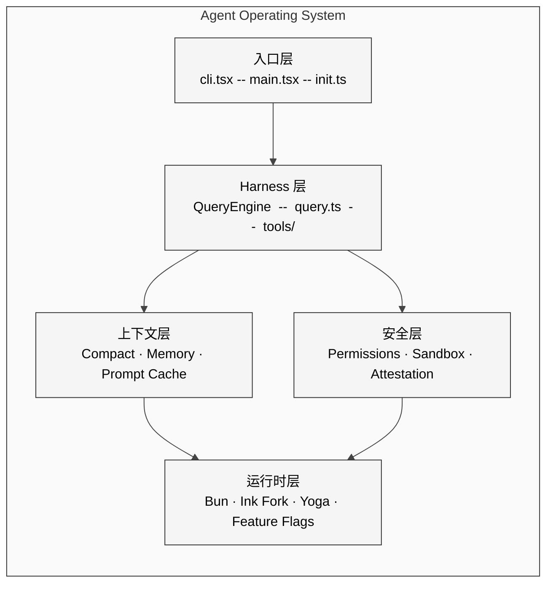
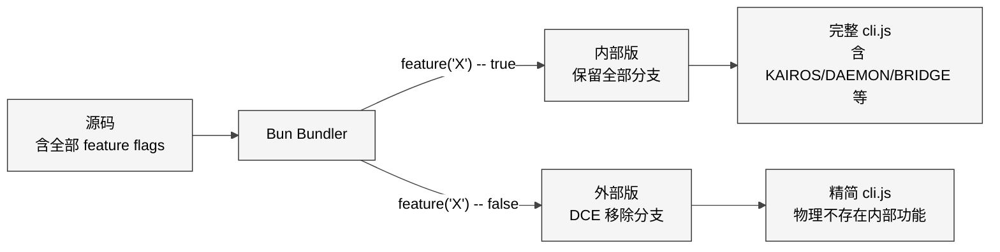
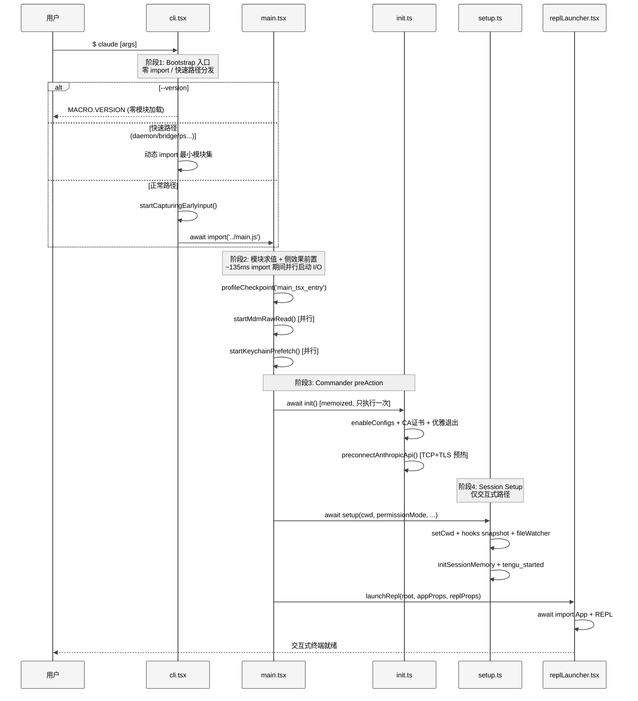
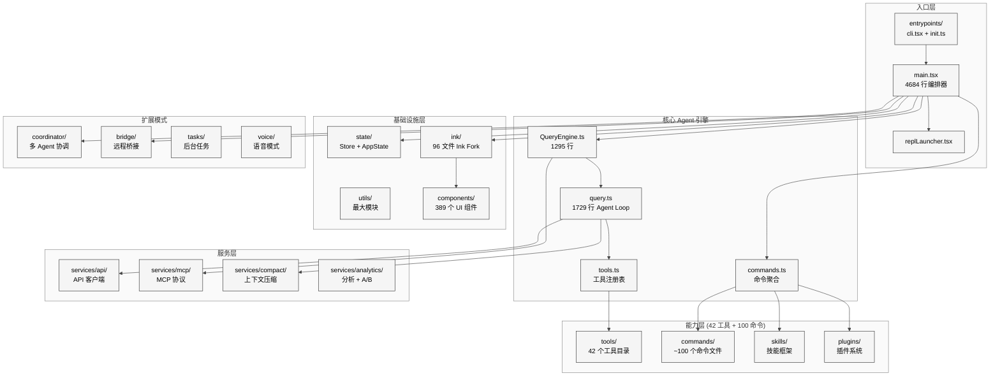
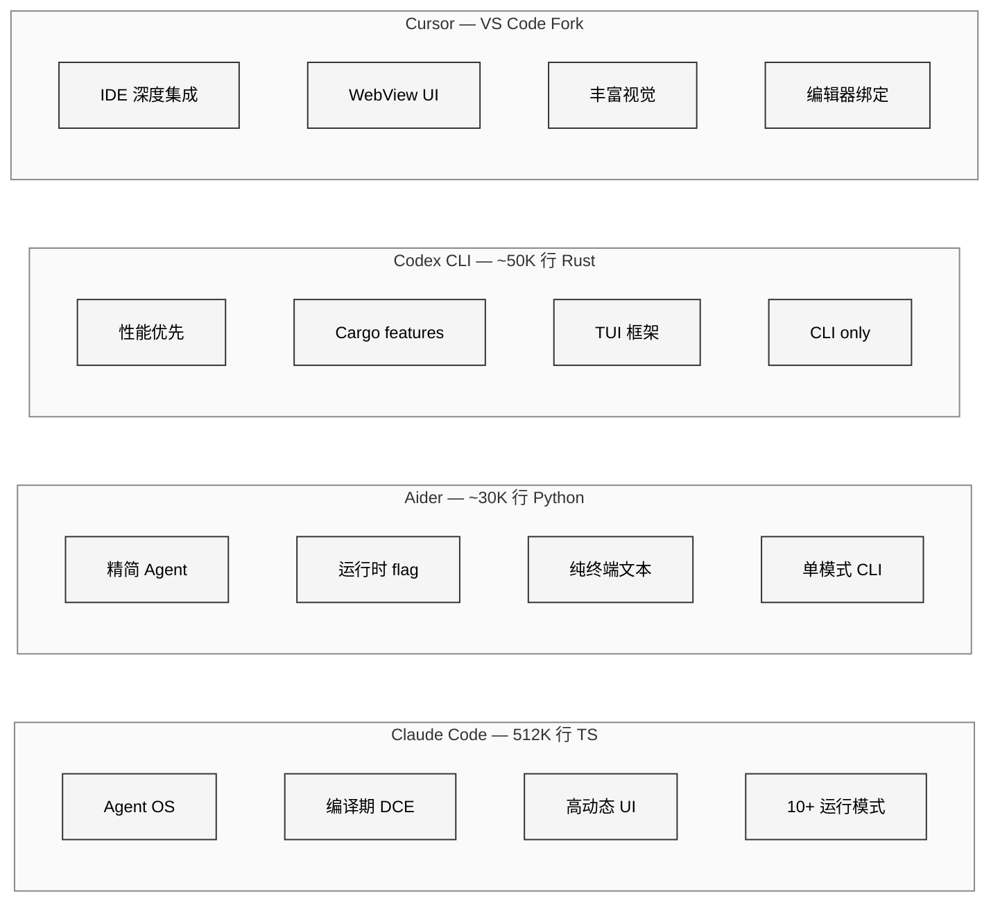

# 第 1 章 项目全景

> 核心提要：从入口到模块划分的整体轮廓

## 1.1 定位

当你面对 1,884 个 TypeScript 源文件、513,216 行代码、35 个顶层目录、300 个递归子目录时，最大的挑战不是读懂某个函数，而是**不知道从哪里开始读**。

Claude Code 是 Anthropic 开发的终端原生 AI Agent 助手。Anthropic 官方在 [How Claude Code Works](https://code.claude.com/docs/en/how-claude-code-works) 中给出了精确定位：

> "Claude Code serves as the agentic harness around Claude: it provides the tools, context management, and execution environment that turn a language model into a capable coding agent."

它不只是一个 prompt wrapper，更接近一套完整的 **Agent Operating System 式运行时**。它包含从终端 UI 渲染、多 Agent 编排、工具系统、权限安全、记忆持久化到 Prompt Cache 经济学的全技术栈。理解它的全貌，等于理解了一个生产级 AI 产品的完整架构。

本章将回答四个核心问题：

1. **这是什么？** — 一个 Agent Operating System 式运行时的架构本质与模块全景
2. **为什么选择这些技术？** — Bun + TypeScript + Ink + Commander.js 的选型逻辑
3. **程序是怎么启动的？** — 从 `cli.tsx` 到 REPL 的四阶段启动链路
4. **代码如何组织？** — 35 个顶层模块的职责边界与数据流

<div style="background: #ffffff; padding: 16px; border-radius: 8px; margin: 16px 0;">



</div>

## 1.2 架构

### 1.2.1 技术栈选型：每个选择都有工程理由

| 层级 | 技术选择 | 选择理由 | 源码实证 |
|------|---------|---------|---------|
| 运行时 | Bun（主要） | 快速启动 + 编译期 DCE + TS 原生支持 | `cli.tsx:1` — `import { feature } from 'bun:bundle'` |
| 语言 | TypeScript + Zod | 编译期类型安全 + AI 返回值运行时验证 | 全局 1,884 个 `.ts/.tsx` 文件 |
| 终端 UI | Ink (fork) + Yoga | React 声明式 UI + Flexbox 布局 | `src/ink/` — 96 个文件的深度定制 |
| CLI 解析 | Commander.js | 成熟的参数解析 + 类型增强 | `main.tsx:22` — `@commander-js/extra-typings` |
| 状态管理 | 自研 Store (35 行) | 极简响应式，避免框架依赖 | `src/state/store.ts` — 完整实现仅 35 行 |

**运行时：深度依赖 Bun，但兼容 Node.js**

Bun 的选择不是追新，而是有三个硬性工程需求：

1. **启动速度**：CLI 工具的体验取决于用户输入 `claude` 到看到界面的时间。Bun 的冷启动远快于 Node.js。
2. **编译期 Feature Flag（DCE）**：`feature()` 函数在编译时被替换为 `true/false` 常量，Bun bundler 的 Dead Code Elimination 可以**物理移除**不需要的代码分支。这让同一份源码构建出内部版和外部版两个不同产品。
3. **Native Client Attestation**：Bun 的 Zig 实现的 HTTP 栈可以在请求序列化阶段注入密码学签名（`src/constants/system.ts:64-72`），这是纯 JS 运行时做不到的。

```typescript
// src/constants/system.ts:73-95 — Native Client Attestation
export function getAttributionHeader(fingerprint: string): string {
  const version = `${MACRO.VERSION}.${fingerprint}`
  const entrypoint = process.env.CLAUDE_CODE_ENTRYPOINT ?? 'unknown'
  // cch=00000 placeholder is overwritten by Bun's HTTP stack with attestation token
  const cch = feature('NATIVE_CLIENT_ATTESTATION') ? ' cch=00000;' : ''
  const workload = getWorkload()
  const workloadPair = workload ? ` cc_workload=${workload};` : ''
  return `x-anthropic-billing-header: cc_version=${version}; cc_entrypoint=${entrypoint};${cch}${workloadPair}`
}
```

这段代码揭示了一个精妙的安全机制：JS 层写入 `cch=00000` 占位符，Bun 的 Zig HTTP 栈在请求发出前将这 5 个零**同长度替换**为计算出的哈希值。同长度替换避免了 Content-Length 变化和 buffer 重分配。服务端验证此哈希以确认请求来自真正的 Claude Code 二进制文件——这是 Anthropic 对非官方客户端的技术执法手段。

**终端 UI：为什么用 React 做命令行**

Claude Code 的终端界面不是 `console.log` 拼接的。`src/components/` 目录包含 **389 个文件**，`src/ink/` 包含 **96 个文件**的 Ink 框架深度定制。选择 React 做终端 UI 因为界面是高度动态的：流式输出、多工具并行进度条、权限确认对话框、主题切换、Vim 模式——这些用命令式代码管理会变成噩梦，用 React 的声明式模型则很自然。

**状态管理：35 行的极简 Store**

```typescript
// src/state/store.ts — 完整核心实现
export function createStore<T>(initialState: T, onChange?: OnChange<T>): Store<T> {
  let state = initialState
  const listeners = new Set<Listener>()
  return {
    getState: () => state,
    setState: (updater: (prev: T) => T) => {
      const prev = state
      const next = updater(prev)
      if (Object.is(next, prev)) return   // 引用相等跳过
      state = next
      onChange?.({ newState: next, oldState: prev })
      for (const listener of listeners) listener()
    },
    subscribe: (listener: Listener) => {
      listeners.add(listener)
      return () => listeners.delete(listener)
    },
  }
}
```

没有 Redux，没有 Zustand，没有 MobX——35 行自研 Store 搞定全局状态管理。核心设计决策是 `onChange` 回调在 `setState` 时同步触发，用于驱动副作用（CCR 同步、权限模式通知），而不是通过中间件层。`Object.is` 比较确保引用不变时跳过更新。这是"够用就好"的极致体现。

### 1.2.2 核心设计决策：编译期 Feature Flag

项目中散布着大量 `feature()` 调用。经统计，`feature()` 在源码中出现在 **160+ 个文件**中。以下是出现频率最高的 Feature Flag：

| Feature Flag | 代表功能 | 典型位置 |
|-------------|---------|---------|
| `KAIROS` | Assistant/后台任务模式 | `main.tsx`, `query.ts`, `tools.ts` |
| `COORDINATOR_MODE` | 多 Agent 协调 | `tools.ts:120`, `main.tsx:76` |
| `BRIDGE_MODE` | 远程控制桥接 | `cli.tsx:112`, `commands.ts:73` |
| `DAEMON` | 守护进程模式 | `cli.tsx:100`, `cli.tsx:165` |
| `BG_SESSIONS` | 后台会话管理 | `cli.tsx:185` |
| `CONTEXT_COLLAPSE` | 上下文折叠 | `query.ts:19`, `setup.ts:295` |
| `NATIVE_CLIENT_ATTESTATION` | 原生客户端认证 | `system.ts:82` |
| `UDS_INBOX` | Unix Domain Socket 消息 | `setup.ts:95`, `tools.ts:126` |

<div style="background: #ffffff; padding: 16px; border-radius: 8px; margin: 16px 0;">



</div>

`feature()` 配合条件 `require()` 是刻意设计。为什么不用 `import`？因为 ES 模块的 `import` 是静态声明，即使在 `if (false)` 分支里也会被模块系统打包。而 `require()` 是运行时调用，配合编译期常量折叠，bundler 可以在构建时直接删除整个 `require()` 调用及其依赖树：

```typescript
// src/tools.ts:25-28 — 条件 require 配合 feature flag
const SleepTool =
  feature('PROACTIVE') || feature('KAIROS')
    ? require('./tools/SleepTool/SleepTool.js').SleepTool
    : null
```

源码注释（`cli.tsx:16-19`）明确解释了为何某些 feature gate 必须内联在入口文件：

> "Harness-science L0 ablation baseline. Inlined here (not init.ts) because BashTool/AgentTool/PowerShellTool capture DISABLE_BACKGROUND_TASKS into module-level consts at import time — init() runs too late."

这说明团队对模块求值时序有精确的理解和控制。

## 1.3 实现深度剖析：四阶段启动链路

当用户在终端输入 `claude` 并回车时，程序经过四个清晰的阶段到达交互式 REPL。每个阶段有明确的职责分工和性能预算。

<div style="background: #ffffff; padding: 16px; border-radius: 8px; margin: 16px 0;">



</div>

### 1.3.1 阶段一：cli.tsx — Bootstrap 入口（303 行）

`src/entrypoints/cli.tsx` 是程序的真正入口。核心设计原则是：**尽可能少加载模块，尽可能快返回**。

源码第一行就揭示了它的特殊性——除了 `bun:bundle` 这个编译时宏外，**没有任何静态 import**。所有模块加载都是 `await import(...)` 动态形式。

`--version` 路径实现了**零 import 返回**（`cli.tsx:37-42`）：除了 `cli.tsx` 本身，不加载任何其他模块。`MACRO.VERSION` 是编译时内联的常量。

整个文件定义了 **12 条快速路径**，每条路径只动态 import 必需的模块：

| 快速路径 | 触发条件 | Feature Gate | 加载规模 |
|----------|---------|-------------|---------|
| `--version` | 单参数 `-v/-V/--version` | 无 | 零 import |
| `--dump-system-prompt` | 首参数匹配 | `DUMP_SYSTEM_PROMPT` | config + model + prompts |
| `--daemon-worker` | 首参数匹配 | `DAEMON` | workerRegistry（精简） |
| `remote-control/rc` | 首参数匹配 | `BRIDGE_MODE` | config + auth + bridge |
| `daemon` | 首参数匹配 | `DAEMON` | config + sinks + daemon/main |
| `ps/logs/attach/kill` | 首参数匹配 | `BG_SESSIONS` | config + cli/bg |
| `new/list/reply` | 首参数匹配 | `TEMPLATES` | cli/handlers/templateJobs |
| `environment-runner` | 首参数匹配 | `BYOC_ENVIRONMENT_RUNNER` | environment-runner/main |
| `self-hosted-runner` | 首参数匹配 | `SELF_HOSTED_RUNNER` | self-hosted-runner/main |
| `--worktree --tmux` | flag 组合 | 无 | config + worktree |
| `--chrome-native-host` | 首参数匹配 | 无 | claudeInChrome |
| `--computer-use-mcp` | 首参数匹配 | `CHICAGO_MCP` | computerUse/mcpServer |

一个容易被忽略但极其重要的细节在 `cli.tsx:16-26`——**ablation baseline**。这段代码在 `feature('ABLATION_BASELINE')` 门控下，在进程最早期设置一系列 `DISABLE_*` 环境变量。注释解释了为什么不能放在 `init.ts` 中：

> "BashTool/AgentTool/PowerShellTool capture DISABLE_BACKGROUND_TASKS into module-level consts at import time — init() runs too late."

由此可见团队有专门的 **Harness Science** 实验框架，用于在 A/B 测试中关闭特定 harness 功能来测量其对 Agent 性能的贡献。L0 ablation baseline 是"关闭一切增强，只保留裸循环"的基线配置。

### 1.3.2 阶段二：main.tsx — 侧效果前置的编排器（4,683 行）

`src/main.tsx` 是整个项目**最大的单文件**。它不是没有拆分的意愿——而是因为它是一个"策略汇聚层"：CLI option parsing、feature gate 分支、auth/provider 策略选择、interactive/non-interactive 分流、resume/remote/assistant 等模式编排……这些逻辑紧密耦合，拆分只会把编排逻辑分散到多个文件，并不减少复杂度。

main.tsx 的前 20 行展示了一个精妙的启动优化——**侧效果前置**（`main.tsx:1-20`）：

```typescript
// src/main.tsx:1-20 — 侧效果前置：利用 import 阻塞期并行执行 I/O
import { profileCheckpoint, profileReport } from './utils/startupProfiler.js';
profileCheckpoint('main_tsx_entry');  // 立即打点

import { startMdmRawRead } from './utils/settings/mdm/rawRead.js';
startMdmRawRead();  // 立即启动 MDM 子进程（plutil/reg query）

import { ensureKeychainPrefetchCompleted, startKeychainPrefetch }
  from './utils/secureStorage/keychainPrefetch.js';
startKeychainPrefetch();  // 立即启动 macOS 钥匙串预取
```

这些 `import` 语句之间穿插着函数调用。注释（`main.tsx:2-8`）精确解释了原因：

> "startMdmRawRead fires MDM subprocesses (plutil/reg query) so they run in parallel with the remaining ~135ms of imports below"
> "startKeychainPrefetch fires both macOS keychain reads (OAuth + legacy API key) in parallel — isRemoteManagedSettingsEligible() otherwise reads them sequentially via sync spawn inside applySafeConfigEnvironmentVariables() (~65ms on every macOS startup)"

**在后续 ~135ms 的 import 求值期间**，MDM 子进程和 Keychain 读取已经在并行执行。这是一个利用 JavaScript 模块求值的阻塞时间来并行执行 I/O 的技巧——节省了 ~65ms 的 macOS 启动时间。

### 1.3.3 阶段三：init() — 进程级一次性初始化

`src/entrypoints/init.ts`（340 行）定义了 `init()` 函数，通过 `main.tsx` 的 Commander `preAction` hook 调用（`main.tsx:907-916`）。用 lodash `memoize` 包装，确保无论被调用多少次都只执行一次。

`init()` 的执行时序受 Commander.js 控制——只有用户执行真正命令时才触发，`--help` 不执行。更重要的是，`preAction` 中额外补了 `initSinks()`（`main.tsx:926-934`），注释解释了为什么：

> "setup() attaches sinks for the default command, but subcommands (doctor, mcp, plugin, auth) never call setup() and would silently drop events on process.exit()."

这揭示了一个关键的架构约束：**`setup()` 不是所有命令共用的统一启动层**，只在交互式 REPL 路径上被调用。

`init()` 区分了"安全环境变量"和"完整环境变量"（`init.ts:71-74`）：

```typescript
// src/entrypoints/init.ts:71-74 — 安全性分层
// Apply only safe environment variables before trust dialog
// Full environment variables are applied after trust is established
applySafeConfigEnvironmentVariables()
```

在用户接受信任对话框之前，只应用安全的环境变量。这是安全性考虑——未确认信任的项目不应通过 `.claude/settings.json` 修改 `PATH`、`LD_PRELOAD` 等关键环境变量。

`init()` 中还有一个被注释详细标注的性能技巧——**API 预连接**（`init.ts:153-159`）：

> "Preconnect to the Anthropic API — overlap TCP+TLS handshake (~100-200ms) with the ~100ms of action-handler work before the API request."

### 1.3.4 阶段四：setup() — 交互式会话 Session Setup

`src/setup.ts`（477 行）处理进入交互式 REPL 前的 session 级初始化。它**只在交互式会话路径被调用**。

setup() 的真正调用点在 `main.tsx:1903-1934`，源码注释揭示了一个精心设计的并行化：

```typescript
// src/main.tsx:1913-1934 — setup 与 commands/agents 加载并行化
// Parallelize setup() with commands+agents loading. setup()'s ~28ms is
// mostly startUdsMessaging (socket bind, ~20ms) — not disk-bound, so it
// doesn't contend with getCommands' file reads.
const setupPromise = setup(preSetupCwd, permissionMode, ...);
const commandsPromise = worktreeEnabled ? null : getCommands(preSetupCwd);
const agentDefsPromise = worktreeEnabled ? null : getAgentDefinitionsWithOverrides(preSetupCwd);
commandsPromise?.catch(() => {});  // Suppress transient unhandledRejection
agentDefsPromise?.catch(() => {});
await setupPromise;
```

注意 `.catch(() => {})` 的使用——在 `Promise.all` 之前创建的 promise 如果在等待 setup 期间 reject，会触发 `unhandledRejection`。空 catch 抑制了这个瞬态错误，实际错误处理在后续 `Promise.all` 中完成。这是并行化 Promise 的工程最佳实践。

最终的 REPL 启动（`src/replLauncher.tsx`，22 行）异常简洁——它只做一件事：将 `<App>` 和 `<REPL>` 组件渲染到 Ink 的 React 树中。`App` 和 `REPL` 都是动态 `import` 的，延迟到最后一刻才加载这些重量级 UI 模块。

## 1.4 模块全景：35 个顶层目录的职责边界

### 1.4.1 关键文件规模

| 文件 | 行数 | 核心职责 |
|------|------|---------|
| `main.tsx` | 4,683 | 主编排器：Commander CLI + 全部启动流程 |
| `query.ts` | 1,729 | Agent 循环：API 调用 + 工具执行的 while(true) |
| `QueryEngine.ts` | 1,295 | SDK 统一入口：submitMessage() async generator |
| `Tool.ts` | 792 | 工具接口定义 + buildTool() + ToolPermissionContext |
| `commands.ts` | 754 | 命令聚合：内建 + 技能 + 插件 + workflow |
| `setup.ts` | 477 | 交互式会话初始化 |
| `tools.ts` | 389 | 工具注册表：getAllBaseTools() + assembleToolPool() |
| `init.ts` | 340 | 进程级一次性初始化 |
| `cli.tsx` | 303 | Bootstrap 入口 + 12 条快速路径 |
| `replLauncher.tsx` | 22 | 薄层：动态加载 App + REPL 并渲染 |

### 1.4.2 目录结构与职责全景

<div style="background: #ffffff; padding: 16px; border-radius: 8px; margin: 16px 0;">



</div>

35 个顶层目录按职责可分为六层：

**入口层**：`entrypoints/` + `main.tsx` + `replLauncher.tsx` — 启动序列

**核心引擎**：`QueryEngine.ts` + `query.ts` — Agent 循环的心脏。`query.ts` 是一个 `while(true)` 循环，每次迭代 = 一次 API 调用 + 工具执行。`QueryEngine.ts` 在其上封装了系统提示组装、用户输入处理、USD 预算检查、transcript 持久化。

**能力层**：`tools/`（42 个工具目录）+ `commands/`（~100 个命令文件）+ `skills/` + `plugins/` — 这是用户直接感知的功能

**服务层**：`services/`（含 api、mcp、compact、analytics 等 38 个子模块）— 外部服务集成

**基础设施层**：`state/`、`utils/`（最大模块）、`ink/`、`components/`、`constants/`、`types/` — 无 React 依赖的底层库

**扩展模式**：`coordinator/`、`bridge/`、`tasks/`、`voice/`、`assistant/`、`buddy/`、`remote/`、`server/` — 10+ 种运行模式的实现

### 1.4.3 核心数据流

整个应用的核心数据流可以概括为一条主线：

```
用户输入 → QueryEngine.submitMessage() → query.ts 组装消息
→ Anthropic API (stream) → 模型返回 tool_use
→ 查找并执行 Tool → 结果回传 API → 模型继续/结束
```

`query.ts` 中的 `State` 类型（`query.ts:204-217`）精确定义了循环的可变状态：

```typescript
// src/query.ts:204-217 — Agent 循环的可变状态
type State = {
  messages: Message[]
  toolUseContext: ToolUseContext
  autoCompactTracking: AutoCompactTrackingState | undefined
  maxOutputTokensRecoveryCount: number
  hasAttemptedReactiveCompact: boolean
  maxOutputTokensOverride: number | undefined
  pendingToolUseSummary: Promise<ToolUseSummaryMessage | null> | undefined
  stopHookActive: boolean | undefined
  turnCount: number
  transition: Continue | undefined  // 上一次迭代为什么继续
}
```

注意 `transition` 字段——它记录了"上一次迭代为什么继续"。注释写到 "Lets tests assert recovery paths fired without inspecting message contents"。这是可测试性设计：测试可以断言恢复路径是否触发，而不需要检查消息内容。

## 1.5 细节

### 1.5.1 动态 import 的三种用途

项目中有三种不同的模块加载模式，每种服务于不同目的：

**用途一：延迟加载（性能）**
```typescript
// src/replLauncher.tsx:13-18 — UI 模块延迟到最后一刻
const { App } = await import('./components/App.js');
const { REPL } = await import('./screens/REPL.js');
```

**用途二：打破循环依赖**
```typescript
// src/tools.ts:62-66 — 显式注释标注原因
// Lazy require to break circular dependency: tools.ts -> TeamCreateTool -> ... -> tools.ts
const getTeamCreateTool = () =>
  require('./tools/TeamCreateTool/TeamCreateTool.js')
    .TeamCreateTool as typeof import('./tools/TeamCreateTool/TeamCreateTool.js').TeamCreateTool
```

注意 `as typeof import(...)` —— 在运行时用 `require()` 打破循环依赖，同时用类型断言保留完整的类型信息。

**用途三：配合 feature() 实现 DCE**
```typescript
// src/tools.ts:29-35 — feature gate + require = 编译期物理移除
const cronTools = feature('AGENT_TRIGGERS')
  ? [
      require('./tools/ScheduleCronTool/CronCreateTool.js').CronCreateTool,
      require('./tools/ScheduleCronTool/CronDeleteTool.js').CronDeleteTool,
      require('./tools/ScheduleCronTool/CronListTool.js').CronListTool,
    ]
  : []
```

### 1.5.2 防御性编程模式

**模式一：fail-open 设计**

`setup.ts` 中的技能加载（`commands.ts:360-397`）展示了系统性的 fail-open：

```typescript
// src/commands.ts:360-371 — 技能加载失败不会崩溃
const [skillDirCommands, pluginSkills] = await Promise.all([
  getSkillDirCommands(cwd).catch(err => {
    logError(toError(err))
    logForDebugging('Skill directory commands failed to load, continuing without them')
    return []
  }),
  getPluginSkills().catch(err => {
    logError(toError(err))
    return []
  }),
])
```

每个异步操作独立 catch，失败时返回空数组而非抛出。这确保了任何单个扩展的加载失败不会拖垮整个系统。

**模式二：eslint 规则强制架构约束**

源码中大量出现 `eslint-disable-next-line custom-rules/no-top-level-side-effects` 和 `custom-rules/no-process-env-top-level` 注释。这说明团队用自定义 eslint 规则**强制禁止**模块顶层的副作用和环境变量读取。每次违反都需要显式注释说明原因——这把架构约束编码成了自动化检查。

**模式三：安全性分层（bypass 限制）**

`setup.ts:396-441` 中，`--dangerously-skip-permissions` 模式有三层安全检查：

1. 禁止 root/sudo 权限下使用（除非在沙箱中）
2. 内部用户（ant）必须在 Docker/Bubblewrap 沙箱中且无互联网访问
3. Desktop/local-agent 入口有显式豁免（有前置 PR 的 precedent 引用）

```typescript
// src/setup.ts:427-440 — 内部用户的 bypass 限制
const [isDocker, hasInternet] = await Promise.all([
  envDynamic.getIsDocker(),
  env.hasInternetAccess(),
])
const isBubblewrap = envDynamic.getIsBubblewrapSandbox()
const isSandbox = process.env.IS_SANDBOX === '1'
const isSandboxed = isDocker || isBubblewrap || isSandbox
if (!isSandboxed || hasInternet) {
  console.error(`--dangerously-skip-permissions can only be used in Docker/sandbox...`)
  process.exit(1)
}
```

### 1.5.3 性能热点与优化策略

| 热点 | 耗时估算 | 优化策略 | 源码位置 |
|------|---------|---------|---------|
| main.tsx import 求值 | ~135ms | 侧效果前置并行化 | `main.tsx:1-20` |
| macOS Keychain 读取 | ~65ms | startKeychainPrefetch 预取 | `main.tsx:17-20` |
| TCP+TLS 握手 | 100-200ms | preconnectAnthropicApi 预热 | `init.ts:153-159` |
| UDS 消息服务器绑定 | ~20ms | 与 getCommands 并行 | `main.tsx:1913-1917` |
| setup() 总计 | ~28ms | 与 commands/agents 并行 | `main.tsx:1927-1934` |

团队在所有关键路径都插入了 `profileCheckpoint()` 打点——`cli_entry`、`main_tsx_entry`、`preAction_start`、`preAction_after_mdm`、`preAction_after_init`、`action_before_setup`、`action_after_setup`——构成了完整的启动性能追踪链。

## 1.6 比较

### 1.6.1 架构维度对比

<div style="background: #ffffff; padding: 16px; border-radius: 8px; margin: 16px 0;">



</div>

| 维度 | Claude Code | Aider | Codex CLI | Cursor |
|------|-------------|-------|-----------|--------|
| 核心循环 | async generator + while(true) | 简单 while loop | Rust event loop | VS Code 扩展 API |
| 代码规模 | 512K 行 TS | ~30K 行 Python | ~50K 行 Rust | N/A (闭源) |
| 特性隔离 | 90+ 编译时 flag, DCE | 无 | Cargo features | N/A |
| 终端 UI | React/Ink fork + Yoga | console.log | Ratatui TUI | WebView |
| 运行模式 | 10+ (CLI/SDK/MCP/Bridge/Daemon...) | 单模式 | CLI only | IDE only |
| 状态管理 | 35 行自研 Store | Python dict | Rust struct | VS Code state |
| 记忆系统 | 4 层 CLAUDE.md + AutoMemory | .aider 配置 | 无 | .cursorrules |
| 安全模型 | 4 层纵深防御 + 原生认证 | 基础确认 | 沙箱 | IDE 沙箱 |

### 1.6.2 Claude Code 的优势与局限

**优势**：
- **全模式覆盖**：同一个 Agent 内核支持终端交互、无头 SDK、远程控制、后台任务、MCP 服务器等 10+ 种运行模式。竞品通常只支持 1-2 种。
- **企业级安全**：4 层权限管线 + 沙箱隔离 + 原生客户端认证 + 企业 MDM 配置层级，这些在 Aider/Codex 中完全缺失。
- **启动优化深度**：从编译期 DCE 到运行时侧效果前置，每个环节都有针对性优化。

**局限**：
- **Bun 绑定风险**：深度依赖 `bun:bundle` 和 Bun 的 Zig HTTP 栈（Native Client Attestation），无法轻松迁移到其他运行时。
- **视觉表达力**：终端 UI 再精致也比不上 Cursor 的 WebView 渲染。对需要可视化反馈的场景（UI 开发、图表）天然受限。
- **入门门槛**：512K 行代码对贡献者不友好（虽然这不完全是缺点——参见下节争议讨论）。

## 1.7 辨误

### 1.7.1 争议一：51 万行单体是否过度工程？

**社区观点分布**：

| 立场 | 代表 | 论据 |
|------|------|------|
| "过度工程" | V2EX 部分讨论 | 自研 Ink 框架、数百个工具文件、MCP 模块上万行 |
| "必要复杂度" | Tony Bai、WaveSpeed AI | 终端渲染需要高动态性能、安全需要多层检查、企业场景需要权限精控 |

**源码实证裁决**：

首先，**51 万行不全是核心逻辑**。源码包含：
- `src/ink/`（96 文件）— Ink 框架的完整 fork，包含布局引擎和渲染优化器
- `src/components/`（389 文件）— 完整的组件化终端 UI 体系
- `src/utils/`（最大模块）— 横切关注点的基础设施

以 `tools/` 目录为例，42 个工具目录中，与"编程辅助"直接相关的（BashTool、FileEditTool、FileReadTool、FileWriteTool、GlobTool、GrepTool）仅 6 个。其余 36 个工具涵盖 Agent 编排、任务管理、MCP 资源、通知推送、定时任务等——这些是 **Agent OS 的系统调用**，不是编程功能。

其次，复杂度有**明确的商业驱动**。`setup.ts` 中的 bypass 权限检查（`setup.ts:396-441`）看起来"多余"，但它保护的是企业客户在生产环境中使用 Agent 时的安全边界。`commands.ts` 中 637 行的远程安全过滤（`REMOTE_SAFE_COMMANDS`、`BRIDGE_SAFE_COMMANDS`）看起来"过度"，但它支持的是从手机控制本地 Agent 的跨设备场景。

**裁决**：核心 Agent 循环确实简洁（`query.ts` 1,729 行），复杂度主要分布在企业级功能与系统基础设施。是否“过度”取决于目标受众；更稳妥的说法是，Claude Code 呈现出明显的 Agent Operating System 式运行时特征，而不是传统单功能 CLI 的复杂度分布。

### 1.7.2 争议二：更好的模型 + 更傻的架构？

Tony Bai 提出的这个观点只对了一半。

Agent 核心循环（`query.ts`）确实简洁——本质上是：

```
while (has_tool_calls) {
  response = call_model(messages)
  tool_results = execute_tools(response.tool_calls)
  messages.push(response, tool_results)
}
```

shareAI-lab 的"Bash is all you need"复刻项目验证了这一点：核心循环 200 行就能跑起来。

但这个"傻循环"运行在一个**极其精密的操作系统**之上。Anthropic 官方在 "Harness Design for Long-Running Apps" 中给出了公式：**Agent = Model + Harness**。LangChain 的实验数据显示，仅改变 Harness（不换模型）就能将编码 Agent 准确率从 52.8% 提升到 66.5%。

`query.ts` 的循环之所以看起来"傻"，是因为复杂度被正确地分配到了 Harness 的各个子系统：上下文压缩（`services/compact/`）、权限管线（`utils/permissions/`）、记忆系统（`memdir/`）、Prompt Cache 管理（`services/api/promptCacheBreakDetection.ts`）。循环本身的简洁恰恰是良好架构的标志——不是因为问题简单，而是因为关注点分离做得好。

### 1.7.3 误解纠正：51 万行全是核心代码

**更准确地说**：513,216 行包含了：

| 类别 | 估算占比 | 典型内容 |
|------|---------|---------|
| Ink/Yoga fork + 组件 UI | ~25% | 终端渲染引擎、389 个 UI 组件、布局系统 |
| 基础设施（utils/services） | ~30% | 配置层级、认证、代理、遥测、分析 |
| 工具 + 命令实现 | ~20% | 42 个工具、~100 个命令 |
| Agent 核心引擎 | ~10% | query.ts、QueryEngine.ts、compact/ |
| 扩展模式 | ~10% | coordinator、bridge、tasks、voice、assistant |
| 其他（types/schemas/migrations） | ~5% | 类型定义、JSON schema、配置迁移 |

与"编程辅助"直接相关的代码（BashTool、FileEdit/Read/Write、Glob/Grep 及其 prompt）确实不到 20%。Claude Code 的本质是一个完整的 Agent 运行时——编程能力只是其中一个应用层。

## 1.8 展望

### 1.8.1 已知缺陷与技术债

从源码中的 TODO/FIXME 标记和代码注释中可以发现以下问题：

1. **main.tsx 的 4,683 行巨文件**：虽然有合理的架构理由（策略汇聚层），但实际阅读和维护成本高昂。可能的改进方向是按运行模式拆分 action handler。

2. **Feature Flag 组合爆炸**：90+ 个编译时标志散布在 160+ 个文件中。`cli.tsx:16-26` 的 ablation baseline 暗示团队在做 Harness Science 实验，但如此多的 flag 组合使测试矩阵极其复杂。

3. **循环依赖**：`tools.ts:61-72` 的三处 lazy require 注释明确标注了循环依赖路径（`tools.ts → TeamCreateTool → ... → tools.ts`）。这是单体架构中模块边界模糊的信号。

4. **Bun 单点绑定**：`feature()` 来自 `bun:bundle`，Native Client Attestation 依赖 Bun 的 Zig HTTP 栈。如果 Bun 发展方向与需求偏离，迁移成本极高。

### 1.8.2 如果我来设计下一版

1. **模块联邦化**：将 `tools/`、`commands/`、`services/` 拆分为独立的 npm 包，通过清晰的接口协议交互。核心 Agent 循环保持精简，功能通过包管理器组合。

2. **运行时抽象层**：在 `bun:bundle` 之上建立抽象，使 feature flag 和 DCE 不直接耦合 Bun API。为将来可能的运行时迁移预留空间。

3. **配置即代码**：将 `main.tsx` 中的 4,683 行编排逻辑转化为声明式配置（运行模式定义、认证策略、Provider 映射），由通用引擎解释执行。

### 1.8.3 对 Agent 开发者的实践启示

**启示 1：分层启动是 CLI 产品的命脉**。Claude Code 的 12 条快速路径确保简单命令不加载整个应用。任何 CLI 工具都应该在入口层实现快速返回路径。

**启示 2：侧效果前置是被忽视的优化技巧**。利用 JS 模块求值的阻塞时间并行启动 I/O（Keychain 读取、子进程、API 预连接），无需任何框架支持，纯粹利用 JS 执行模型的特性。

**启示 3：编译期 Feature Flag > 运行时 Feature Flag**。运行时 flag 无法 DCE，意味着外部用户的二进制中仍然包含（虽不执行）所有内部功能代码。编译期 flag 物理移除代码，既减小产物体积，又消除逆向工程风险。

**启示 4：Agent 循环的简洁是设计目标，不是出发点**。`query.ts` 的"傻循环"之所以能保持简洁，是因为复杂度被正确分配到了 Harness 的子系统中。先设计好 Harness 的分层，再追求循环的简洁。

**启示 5：35 行 Store > 任何状态管理框架**。对于 Agent 产品，全局状态的复杂度在业务层（AppState 类型），不在状态管理机制层。一个 `setState` + `subscribe` + `Object.is` 比较就够了。

## 1.9 小结

1. **将 Claude Code 视为 Agent OS 式运行时，比单纯视为“编程工具”更能解释其结构**。513,216 行代码中，35 个顶层目录里只有 `tools/` 下的少数目录直接面向编程交互，其余大量代码承担进程管理、内存管理、安全、文件系统、IPC 等基础设施职责。

2. **四阶段启动链路是精密的性能工程**。从 cli.tsx 的零 import 快速路径，到 main.tsx 的侧效果前置（~135ms import 期间并行启动 I/O），到 init.ts 的 API 预连接（~100-200ms TCP+TLS 重叠），每个阶段都有明确的性能预算和优化策略。

3. **编译期 Feature Flag 是多版本发布的核心机制**。90+ 个 `feature()` 标志配合 Bun bundler 的 DCE，让同一份源码在编译期分叉为内部版（含 KAIROS/DAEMON/BRIDGE 等）和外部版（物理移除内部功能），实现零运行时成本的功能隔离。

4. **Harness 设计比模型选择更影响 Agent 性能**。核心循环（`query.ts`）的简洁是正确分层的结果——复杂度被分配到上下文压缩、权限管线、记忆系统、Prompt Cache 管理等 Harness 子系统中。

5. **51 万行的复杂度更接近系统型 Agent 运行时，而非单功能 CLI 工具**。更稳妥的问题不是“为什么一个 CLI 需要 51 万行”，而是：一个支持 10+ 运行模式、42 个工具、分层安全防御、企业级权限配置的 Agent 运行时，其复杂度如何被组织和约束。

---

*下一章预告：[第 2 章 启动优化 — 毫秒级 CLI 启动的工程艺术](./02-启动优化.md)。我们将深入 `profileCheckpoint()` 追踪链，量化分析每个启动阶段的时间开销，揭示 Claude Code 如何在 51 万行代码的基础上实现亚秒级启动。*
