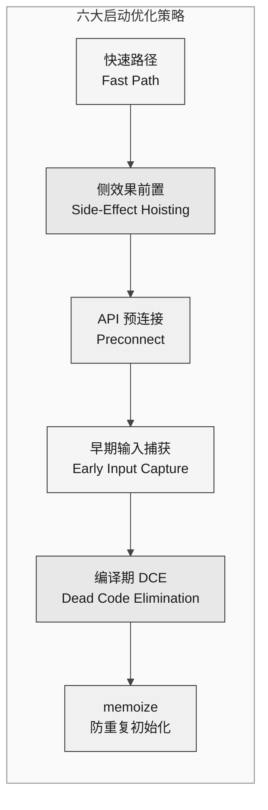
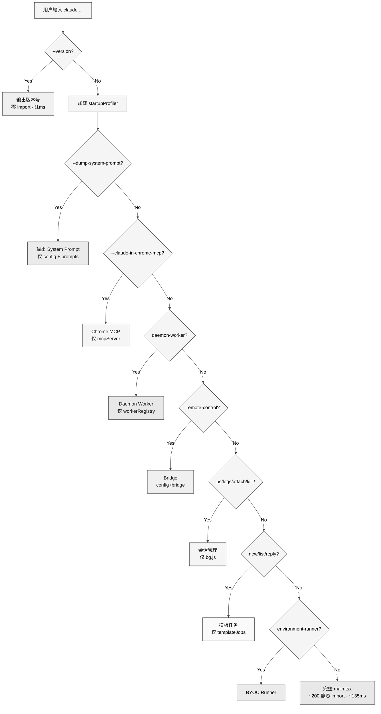
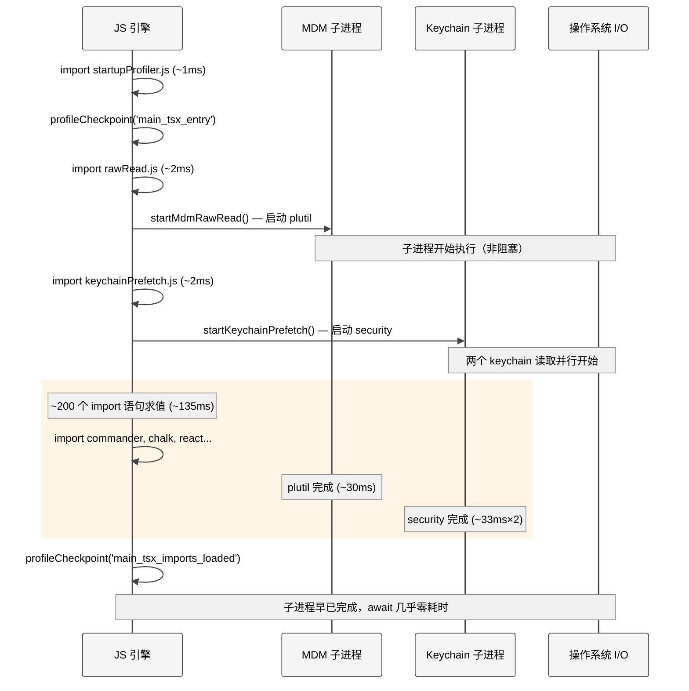
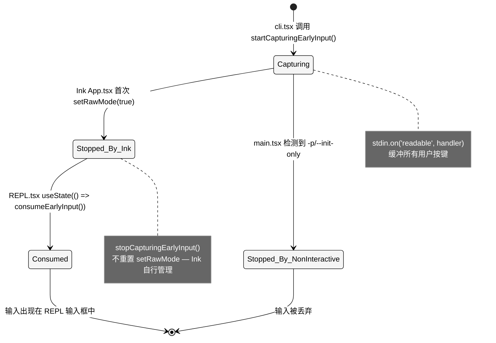
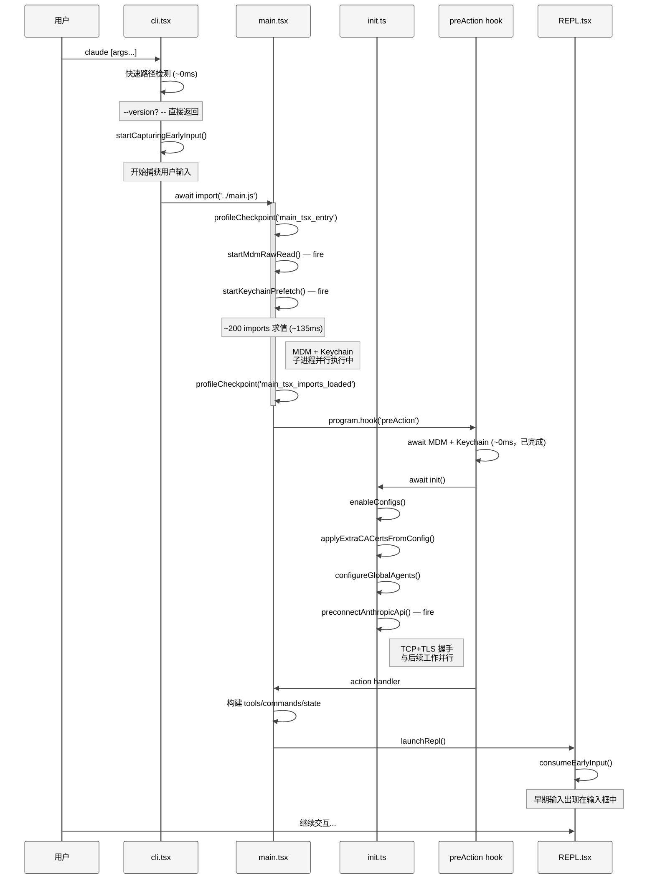

# 第 2 章 启动优化

> 核心提要：一条为冷启动让路的执行链

## 2.1 定位

CLI 工具的第一印象是**启动速度**。用户在终端输入 `claude` 并回车的那一刻，心理预期是"即时响应"——如同 `git status` 或 `ls` 一样快。但 Claude Code 不是一个简单的命令行工具：它是一个包含 1,884 个 TypeScript 文件、依赖 React/Ink/Yoga 渲染引擎、需要连接 MCP 服务器和 Anthropic API 的重量级 Agent 运行时。将这样一个系统的冷启动优化到毫秒级，需要系统性的工程设计。

启动优化在 Claude Code 整体架构中并非"锦上添花"，而是**架构级约束**。Anthropic 工程博客 "Harness Design for Long-Running Apps" 指出，Harness 的设计质量直接决定 Agent 的实际可用性——一个需要 3 秒启动的 CLI 工具，即便 Agent 循环再智能，也无法融入开发者的日常工作流。

本章将从源码层面剖析 Claude Code 的 **六大启动优化策略**，揭示一个顶级工程团队如何在不牺牲功能的前提下，将启动延迟压缩到极限。

<div style="background: #ffffff; padding: 16px; border-radius: 8px; margin: 16px 0;">



</div>

## 2.2 架构设计：瀑布式快速路径

### 2.2.1 核心设计哲学

`cli.tsx` 的设计遵循一个核心原则：**尽可能少加载模块，尽可能快返回**。整个文件 302 行，只有一个静态 import——`bun:bundle`（编译时原语，零运行时成本）。其余所有业务模块均使用 `await import()` 动态加载。

这不是偶然的编码风格，而是刻意的架构决策。文件顶部的 JSDoc 明确声明：

> "Bootstrap entrypoint - checks for special flags before loading the full CLI. All imports are dynamic to minimize module evaluation for fast paths. Fast-path for --version has zero imports beyond this file."
> — `src/entrypoints/cli.tsx:28-31`

### 2.2.2 瀑布式分流架构

`cli.tsx` 的 `main()` 函数实现了一个**瀑布式的快速路径链**。每条路径只动态加载它真正需要的模块，最重的完整路径（加载 `main.tsx`）放在最后：

<div style="background: #ffffff; padding: 16px; border-radius: 8px; margin: 16px 0;">



</div>

源码中共有 **13 条快速路径**（含 `--version`、`--dump-system-prompt`、`--claude-in-chrome-mcp`、`--chrome-native-host`、`--computer-use-mcp`、`--daemon-worker`、`daemon`、`remote-control`、`ps/logs/attach/kill`、`new/list/reply`、`environment-runner`、`self-hosted-runner`、`--worktree --tmux`），每条路径从分流到退出只加载自身需要的模块子集。

### 2.2.3 三类侧效果的精确编排

`cli.tsx` 并非完全无副作用。在 `main()` 函数之前，它执行了三项环境修正：

```typescript
// src/entrypoints/cli.tsx:3-26
// 1. 修复 corepack auto-pinning
process.env.COREPACK_ENABLE_AUTO_PIN = '0';

// 2. CCR 容器环境堆大小限制
if (process.env.CLAUDE_CODE_REMOTE === 'true') {
  process.env.NODE_OPTIONS = existing
    ? `${existing} --max-old-space-size=8192`
    : '--max-old-space-size=8192';
}

// 3. Ablation Baseline 环境变量（编译期门控）
if (feature('ABLATION_BASELINE') && process.env.CLAUDE_CODE_ABLATION_BASELINE) {
  for (const k of ['CLAUDE_CODE_SIMPLE', ...]) {
    process.env[k] ??= '1';
  }
}
```

这三项副作用的共同特征：**不 import 任何业务模块**，仅操作 `process.env`，耗时可忽略不计。

第三项尤其有趣——Ablation Baseline 的注释解释了为什么它必须在 `cli.tsx` 而不是 `init.ts`：

> "BashTool/AgentTool/PowerShellTool capture DISABLE_BACKGROUND_TASKS into module-level consts at import time — init() runs too late."
> — `src/entrypoints/cli.tsx:16-19`

某些工具模块在 import 时就将环境变量缓存为模块级常量。如果在 `init()` 中设置，模块已求值完毕，读到的是旧值。这是一个典型的**模块求值时序**陷阱。

## 2.3 实现

### 2.3.1 策略一：快速路径的零代价返回

`--version` 路径是极致优化的典范：

```typescript
// src/entrypoints/cli.tsx:36-42
if (args.length === 1 && (args[0] === '--version' || args[0] === '-v' || args[0] === '-V')) {
  console.log(`${MACRO.VERSION} (Claude Code)`);
  return;
}
```

`MACRO.VERSION` 是 Bun Bundler 在编译时内联的字符串常量。整条路径不加载 startupProfiler、不加载 config、不加载任何业务逻辑——用户按下回车后几乎瞬间看到输出。

注意检查条件的设计：`args.length === 1` 确保只有纯 `--version` 命中快速路径。如果用户输入 `claude --version --debug`，它不会命中此路径，而是走完整启动流程。这是一个微妙但重要的正确性保护。

对于非 `--version` 的快速路径，`cli.tsx` 使用 `feature()` 编译期门控来控制可见性：

```typescript
// src/entrypoints/cli.tsx:100-106 — Daemon Worker 快速路径
if (feature('DAEMON') && args[0] === '--daemon-worker') {
  const { runDaemonWorker } = await import('../daemon/workerRegistry.js');
  await runDaemonWorker(args[1]);
  return;
}
```

`feature('DAEMON')` 在外部版构建中被替换为 `false`，整个分支（包括 `import('../daemon/workerRegistry.js')`）被 DCE 删除。外部用户的构建产物中**物理上不存在**这些路径。

但并非所有快速路径都有 `feature()` 门控。Chrome MCP 路径（`cli.tsx:72-85`）没有 `feature()` 包裹，说明它在所有构建版本中都可用。`feature()` 门控只用于**明确限定于特定构建版本的功能**。

### 2.3.2 策略二：侧效果前置——利用模块求值的"空闲时间"

当所有快速路径都未匹配时，`cli.tsx` 加载完整的 `main.tsx`。而 `main.tsx` 的前 20 行是整个代码库中关键的启动优化。

```typescript
// src/main.tsx:1-20
// These side-effects must run before all other imports:
// 1. profileCheckpoint marks entry before heavy module evaluation begins
// 2. startMdmRawRead fires MDM subprocesses (plutil/reg query) so they run in
//    parallel with the remaining ~135ms of imports below
// 3. startKeychainPrefetch fires both macOS keychain reads (OAuth + legacy API
//    key) in parallel — isRemoteManagedSettingsEligible() otherwise reads them
//    sequentially via sync spawn inside applySafeConfigEnvironmentVariables()
//    (~65ms on every macOS startup)
import { profileCheckpoint, profileReport } from './utils/startupProfiler.js';
profileCheckpoint('main_tsx_entry');

import { startMdmRawRead } from './utils/settings/mdm/rawRead.js';
startMdmRawRead();

import { ensureKeychainPrefetchCompleted, startKeychainPrefetch }
  from './utils/secureStorage/keychainPrefetch.js';
startKeychainPrefetch();

import { feature } from 'bun:bundle';
// ... ~200 个 import 语句，源码注释称耗时 ~135ms
```

注意 import 语句和函数调用的**交错排列**。JavaScript 的模块求值是同步顺序执行的，所以执行流如下：

<div style="background: #ffffff; padding: 16px; border-radius: 8px; margin: 16px 0;">



</div>

这个设计的核心洞察是：**JavaScript 引擎忙于求值模块时，操作系统的 I/O 子系统是空闲的**。MDM 子进程和 Keychain 子进程各需要 ~30ms，但 import 求值需要 ~135ms。让 I/O 与模块求值并行，将额外等待时间从 ~95ms 降至 ~0ms。

**MDM 子进程预取的实现细节**

`rawRead.ts` 的实现展示了对性能的极致追求（`src/utils/settings/mdm/rawRead.ts:55-88`）：

```typescript
// macOS 路径 — 并行读取多个 plist，首个成功者胜出
const allResults = await Promise.all(
  plistPaths.map(async ({ path, label }) => {
    // 同步 existsSync 跳过不存在的文件，避免启动 plutil 子进程 (~5ms/个)
    if (!existsSync(path)) {
      return { stdout: '', label, ok: false };
    }
    const { stdout, code } = await execFilePromise(PLUTIL_PATH, [...PLUTIL_ARGS_PREFIX, path]);
    return { stdout, label, ok: code === 0 && !!stdout };
  }),
);
const winner = allResults.find(r => r.ok);
```

两个值得注意的优化：

1. **`existsSync()` 前置检查**：非 MDM 管理的机器（绝大多数开发者）上 plist 文件不存在。同步检查跳过子进程启动，每个节省 ~5ms。源码注释解释了为什么用同步而非异步：`execFilePromise must be the first await so plutil spawns before the event loop polls`——保证子进程在事件循环 polling 之前就已启动。
2. **`Promise.all` 并行 + 优先级排序**：多个 plist 路径并行检查，但数组顺序即优先级——"first source wins"。

**Keychain 预取的实现细节**

Keychain 预取更加精彩（`src/utils/secureStorage/keychainPrefetch.ts:69-89`）：

```typescript
export function startKeychainPrefetch(): void {
  if (process.platform !== 'darwin' || prefetchPromise || isBareMode()) return;

  const oauthSpawn = spawnSecurity(
    getMacOsKeychainStorageServiceName(CREDENTIALS_SERVICE_SUFFIX),
  );
  const legacySpawn = spawnSecurity(getMacOsKeychainStorageServiceName());

  prefetchPromise = Promise.all([oauthSpawn, legacySpawn]).then(
    ([oauth, legacy]) => {
      if (!oauth.timedOut) primeKeychainCacheFromPrefetch(oauth.stdout);
      if (!legacy.timedOut) legacyApiKeyPrefetch = { stdout: legacy.stdout };
    },
  );
}
```

关键设计决策：

- **超时不填充缓存**：如果预取超时（`timedOut`），不写入缓存。原因在注释中写得很清楚：`timeout (err.killed) means the keychain MAY have a key we couldn't fetch — don't prime, let sync spawn retry`。宁可后续同步重试，也不用一个可能不完整的结果——这是防御性编程的典范。
- **`isBareMode()` 跳过**：`--bare` 模式仅使用环境变量认证，不需要 Keychain。
- **最小化 import 链**：注释明确指出为什么导入 `macOsKeychainHelpers.ts` 而不是 `macOsKeychainStorage.ts`——后者会拉入 `execa → human-signals → cross-spawn`，增加 ~58ms 的同步模块初始化。

**等待预取完成的时机**

在 `main.tsx` 的 Commander `preAction` hook 中（`src/main.tsx:907-916`），预取结果被统一等待：

```typescript
program.hook('preAction', async thisCommand => {
  profileCheckpoint('preAction_start');
  // Nearly free — subprocesses complete during the ~135ms of imports above.
  await Promise.all([ensureMdmSettingsLoaded(), ensureKeychainPrefetchCompleted()]);
  profileCheckpoint('preAction_after_mdm');
  await init();
  // ...
});
```

注释总结了效果："Nearly free — subprocesses complete during the ~135ms of imports above"。

**定量效果**：macOS 上 OAuth 读取 ~32ms + Legacy API key ~33ms = ~65ms 串行阻塞，优化为 ~0ms 额外等待。

### 2.3.3 策略三：API 预连接——在用户打字时完成握手

每次 HTTPS 请求的首步是 TCP 连接 + TLS 握手，通常需要 100-200ms。Claude Code 在 `init()` 阶段就向 Anthropic API 发送一个 `HEAD` 请求，提前完成握手（`src/utils/apiPreconnect.ts:31-71`）：

```typescript
export function preconnectAnthropicApi(): void {
  if (fired) return;
  fired = true;

  // Skip if using a cloud provider — different endpoint + auth
  if (isEnvTruthy(process.env.CLAUDE_CODE_USE_BEDROCK) || ...) return;
  // Skip if proxy/mTLS/unix — SDK's custom dispatcher won't reuse this pool
  if (process.env.HTTPS_PROXY || process.env.http_proxy || ...) return;

  const baseUrl = process.env.ANTHROPIC_BASE_URL || getOauthConfig().BASE_API_URL;

  // HEAD = no response body, connection eligible for keep-alive pool reuse
  void fetch(baseUrl, {
    method: 'HEAD',
    signal: AbortSignal.timeout(10_000),
  }).catch(() => {});
}
```

**为什么这行得通？**

1. Bun 的 `fetch` 使用全局 keep-alive 连接池
2. `HEAD` 请求无 response body，连接在 headers 返回后立即可被复用
3. 后续 Anthropic SDK 的 API 请求复用暖连接，跳过握手

**调用时序至关重要**。预连接在 `init()` 内部调用，位于 `applyExtraCACertsFromConfig()` 和 `configureGlobalAgents()` **之后**（`src/entrypoints/init.ts:79-159`）。顺序反了会导致两个严重问题：

1. 预连接使用错误的 TLS 证书，握手失败
2. Bun 的 BoringSSL 在首次 TLS 握手时**锁定证书存储**，导致后续配置的自定义 CA 证书不生效

源码注释详细解释了这个时序约束：

> "Called from init.ts AFTER applyExtraCACertsFromConfig() + configureGlobalAgents() so settings.json env vars are applied and the TLS cert store is finalized. The early cli.tsx call site was removed — it ran before settings.json loaded, so ANTHROPIC_BASE_URL/proxy/mTLS in settings would be invisible and preconnect would warm the wrong pool (or worse, lock BoringSSL's cert store before NODE_EXTRA_CA_CERTS was applied)."
> — `src/utils/apiPreconnect.ts:13-18`

这段注释揭示了一个重要的历史教训——预连接最初在 `cli.tsx` 中调用（更早），但因为 TLS 证书锁定问题被移到了 `init.ts`。这是一个"优化过头"的经典案例：追求更早的预连接时机，反而引入了正确性问题。

**智能跳过逻辑**同样值得分析：

| 条件 | 跳过原因 |
|------|---------|
| `CLAUDE_CODE_USE_BEDROCK/VERTEX/FOUNDRY` | 不同的 API 端点，预连接 Anthropic API 无意义 |
| `HTTPS_PROXY/http_proxy` | SDK 使用自定义 dispatcher，不复用全局连接池 |
| `ANTHROPIC_UNIX_SOCKET` | Unix Socket 传输，TCP 握手无意义 |
| `CLAUDE_CODE_CLIENT_CERT/CLIENT_KEY` | mTLS 配置，预连接不携带客户端证书 |

### 2.3.4 策略四：早期输入捕获——启动时不丢失用户按键

用户习惯输入 `claude` 回车后**立刻开始打问题**，不等 REPL 渲染完成。但在 REPL 初始化完成前，stdin 处于"无人接管"状态——按键会丢失。

解决方案在 `cli.tsx` 中尽早接管 stdin（`src/entrypoints/cli.tsx:288-291`）：

```typescript
const { startCapturingEarlyInput } = await import('../utils/earlyInput.js');
startCapturingEarlyInput();
profileCheckpoint('cli_before_main_import');
const { main: cliMain } = await import('../main.js');
```

注意时序：`startCapturingEarlyInput()` 在 `import('../main.js')` **之前**——在 main.tsx 的 ~135ms 模块加载期间，用户输入已被缓冲。

**实现的精妙之处**在于 `processChunk()`（`src/utils/earlyInput.ts:72-136`）：

- **Ctrl+C (code 3)**：`process.exit(130)`——注释解释不调用 `gracefulShutdown` 因为此时"shutdown machinery isn't initialized yet"
- **Backspace (code 127/8)**：删除最后一个 **grapheme cluster**（不是简单的删除最后一个 char），正确处理 Unicode 组合字符（如 emoji）
- **ESC 序列**：解析并跳过完整的转义序列，不让箭头键、功能键的字节进入缓冲区
- **CR → LF 转换**：raw mode 下回车产生的是 `\r`（code 13），转换为 `\n`

**三方交接协议**是这个模块最重要的设计。生命周期涉及三个参与者：

<div style="background: #ffffff; padding: 16px; border-radius: 8px; margin: 16px 0;">



</div>

三个关键调用点：

1. **Ink 接管**（`src/ink/components/App.tsx:224-228`）：`App` 组件首次启用 raw mode 时必须先停止捕获，因为两者都使用 `stdin.on('readable') + read()` 模式。源码注释直言："our handler would drain stdin before Ink's can see it"。

2. **消费缓冲区**（`src/screens/REPL.tsx:1331`）：`const [inputValue, setInputValueRaw] = useState(() => consumeEarlyInput())` — `useState` 的 lazy initializer 只在首次挂载时执行，精确对应 REPL 就绪时刻。

3. **不重置 stdin 状态**：`stopCapturingEarlyInput()` 不调用 `setRawMode(false)`。注释解释："the REPL's Ink App will manage stdin state. If we call setRawMode(false) here, it can interfere with the REPL's own stdin setup which happens around the same time."

### 2.3.5 策略五：编译期 Dead Code Elimination

`feature()` 函数从 `bun:bundle` 导入，在构建时被替换为 `true` 或 `false` 字面量。配合 JavaScript 的常量折叠，整个代码分支在编译期被物理删除。

**cli.tsx 中的路径裁剪**

`cli.tsx` 的 14 处 `feature()` 调用中，大部分用于门控快速路径。源码中可以统计到 `feature()` 在整个代码库中出现了约 **972 处**（遍布约 160 个文件），构成了一个庞大的编译时配置矩阵。

**tools.ts 中的模块裁剪**

`feature()` + `require()` 的组合在 `tools.ts` 中展现了另一个重要用途——**构建产物的依赖图裁剪**（`src/tools.ts:16-53`）：

```typescript
const SleepTool =
  feature('PROACTIVE') || feature('KAIROS')
    ? require('./tools/SleepTool/SleepTool.js').SleepTool
    : null;

const cronTools = feature('AGENT_TRIGGERS')
  ? [ require('./tools/ScheduleCronTool/CronCreateTool.js').CronCreateTool, ... ]
  : [];

const MonitorTool = feature('MONITOR_TOOL')
  ? require('./tools/MonitorTool/MonitorTool.js').MonitorTool
  : null;
```

**为什么用 `require()` 而非 `import`？** 这是一个关键的工程决策：

- 静态 `import` 无论条件如何都被 bundler 纳入依赖图
- `require()` 是运行时调用，当 `feature()` 为 `false` 时，`require()` 所在分支被 DCE 删除，连带其模块引用一并消失
- 效果：外部版构建产物中，SleepTool、CronTool、MonitorTool、PushNotificationTool 等模块**及其整个依赖子树**物理不存在

类似地，`main.tsx` 中的条件 `require()` 用于隔离 Coordinator Mode 和 KAIROS Assistant（`src/main.tsx:76-81`）：

```typescript
const coordinatorModeModule = feature('COORDINATOR_MODE')
  ? require('./coordinator/coordinatorMode.js') : null;
const assistantModule = feature('KAIROS')
  ? require('./assistant/index.js') : null;
```

### 2.3.6 策略六：memoize 防重复初始化

`init()` 函数包含大量昂贵的初始化逻辑，被 lodash 的 `memoize` 包装（`src/entrypoints/init.ts:57`）：

```typescript
export const init = memoize(async (): Promise<void> => {
  const initStartTime = Date.now();
  logForDiagnosticsNoPII('info', 'init_started');
  profileCheckpoint('init_function_start');

  enableConfigs();
  applySafeConfigEnvironmentVariables();
  applyExtraCACertsFromConfig();
  setupGracefulShutdown();
  // ... 大量初始化逻辑
  preconnectAnthropicApi();
  profileCheckpoint('init_function_end');
});
```

`memoize` 确保无论 `init()` 被调用多少次，内部逻辑只执行一次。这在复杂的启动流程中很重要——`preAction` hook、子命令 handler、MCP 初始化等都可能调用 `init()`，但实际初始化只发生一次。

`init()` 内部也运用了延迟加载：

```typescript
// src/entrypoints/init.ts:305-309
async function setMeterState(): Promise<void> {
  // Lazy-load instrumentation to defer ~400KB of OpenTelemetry + protobuf
  const { initializeTelemetry } = await import('../utils/telemetry/instrumentation.js');
  const meter = await initializeTelemetry();
  // ...
}
```

OpenTelemetry + protobuf ~400KB，gRPC 导出器 ~700KB。通过动态 import，这些模块只在遥测初始化时加载，不影响启动路径。

`init()` 中还有一个重要的安全性设计——区分"安全"与"完整"环境变量（`src/entrypoints/init.ts:71-74`）：

```typescript
// Apply only safe environment variables before trust dialog
applySafeConfigEnvironmentVariables();
```

完整的环境变量（`applyConfigEnvironmentVariables()`）要等到信任对话框之后才应用。未确认信任的项目不应通过 `.claude/settings.json` 修改关键环境变量——这是一个典型的**安全优先于便利**的设计决策。

## 2.4 细节

### 2.4.1 启动性能度量：双模式 Profiler

启动性能不能靠"感觉"，需要数据。`startupProfiler.ts` 设计了两种模式（`src/utils/startupProfiler.ts:26-36`）：

```typescript
const DETAILED_PROFILING = isEnvTruthy(process.env.CLAUDE_CODE_PROFILE_STARTUP);
const STATSIG_SAMPLE_RATE = 0.005;
const STATSIG_LOGGING_SAMPLED =
  process.env.USER_TYPE === 'ant' || Math.random() < STATSIG_SAMPLE_RATE;
const SHOULD_PROFILE = DETAILED_PROFILING || STATSIG_LOGGING_SAMPLED;
```

| 模式 | 触发条件 | 覆盖率 | 数据 |
|------|---------|--------|------|
| 采样日志 | 自动 | 100% 内部 + 0.5% 外部 | 关键阶段耗时上报 Statsig |
| 详细分析 | `CLAUDE_CODE_PROFILE_STARTUP=1` | 手动 | 完整时间线 + 内存快照 |

**源码考古发现**：文件顶部注释写的是"0.1% of external users"（`startupProfiler.ts:6`），但实际常量 `STATSIG_SAMPLE_RATE = 0.005` 对应 0.5%。注释与实现不一致——以代码为准。

**零开销守卫**：对于 99.5% 未被采样的外部用户，`profileCheckpoint()` 在首行就 return：

```typescript
export function profileCheckpoint(name: string): void {
  if (!SHOULD_PROFILE) return;  // 一个布尔检查，几纳秒
  const perf = getPerformance();
  perf.mark(name);
  if (DETAILED_PROFILING) memorySnapshots.push(process.memoryUsage());
}
```

`SHOULD_PROFILE` 是模块级常量，不是函数调用。对于未采样用户，50+ 次 `profileCheckpoint()` 调用的总开销可忽略。

从 `main.tsx` 中的 `profileCheckpoint` 调用可以重建完整的启动时间线——源码中共有 **50+ 个检查点**，覆盖从 `cli_entry` 到 `main_after_run` 的每个阶段。关键阶段定义（`startupProfiler.ts:49-54`）：

```typescript
const PHASE_DEFINITIONS = {
  import_time: ['cli_entry', 'main_tsx_imports_loaded'],
  init_time: ['init_function_start', 'init_function_end'],
  settings_time: ['eagerLoadSettings_start', 'eagerLoadSettings_end'],
  total_time: ['cli_entry', 'main_after_run'],
} as const;
```

### 2.4.2 防御性编程模式

**1. 防重入守卫**

几乎所有启动相关函数都有防重入机制：

```typescript
// apiPreconnect.ts — 布尔标志
let fired = false;
export function preconnectAnthropicApi(): void {
  if (fired) return;
  fired = true;
  // ...
}

// rawRead.ts — Promise 引用
let rawReadPromise: Promise<RawReadResult> | null = null;
export function startMdmRawRead(): void {
  if (rawReadPromise) return;
  rawReadPromise = fireRawRead();
}

// init.ts — lodash memoize
export const init = memoize(async (): Promise<void> => { ... });
```

三种不同的实现（布尔标志、Promise 引用、memoize），选择取决于场景：布尔标志最轻量适合 fire-and-forget；Promise 引用允许后续 await；memoize 自动缓存返回值。

**2. 超时不缓存**

Keychain 预取的超时处理展示了"宁可重试，不用坏数据"的防御哲学（`keychainPrefetch.ts:82-86`）：

```typescript
if (!oauth.timedOut) primeKeychainCacheFromPrefetch(oauth.stdout);
if (!legacy.timedOut) legacyApiKeyPrefetch = { stdout: legacy.stdout };
```

超时的预取不写入缓存。后续同步读取会重试，可能成功（更长的超时时间）。如果用超时结果填充缓存，可能 shadow 一个真实存在的 key。

**3. 平台跳过**

Keychain 预取只在 `darwin` 上执行；MDM 读取在 Linux 上直接返回空；API 预连接在 proxy/mTLS 环境下跳过。每个优化都有明确的平台/环境守卫。

### 2.4.3 启动流程的完整时序

综合以上分析，完整的启动时序如下：

<div style="background: #ffffff; padding: 16px; border-radius: 8px; margin: 16px 0;">



</div>

### 2.4.4 关键源码文件与职责

| 文件 | 行数 | 核心职责 |
|------|------|---------|
| `src/entrypoints/cli.tsx` | 302 | 进程入口，13 条快速路径分发，零静态 import |
| `src/main.tsx` | 4,684 | Commander 定义，侧效果前置，~200 静态 import |
| `src/entrypoints/init.ts` | 341 | memoize 包装的一次性初始化，TLS/代理/预连接 |
| `src/utils/earlyInput.ts` | 192 | stdin 早期捕获，Unicode grapheme 处理，三方交接 |
| `src/utils/apiPreconnect.ts` | 72 | HEAD 请求预热连接池，7 种跳过条件 |
| `src/utils/startupProfiler.ts` | 195 | 双模式性能度量，50+ 检查点，零开销守卫 |
| `src/utils/settings/mdm/rawRead.ts` | 131 | MDM 子进程并行预取，existsSync 快速跳过 |
| `src/utils/secureStorage/keychainPrefetch.ts` | 117 | Keychain 并行预取，超时不缓存 |
| `src/replLauncher.tsx` | 22 | 延迟加载 App + REPL 组件的薄层 |

## 2.5 比较

### 2.5.1 启动优化策略矩阵

| 策略 | Claude Code | Cursor | Aider | Cline | Codex CLI |
|------|------------|--------|-------|-------|-----------|
| **运行时** | Bun | Electron | Python | VS Code 扩展 | Rust |
| **快速路径** | 13 条瀑布式分流 | N/A (常驻进程) | 无 | N/A (扩展) | Cargo features |
| **编译期 DCE** | `feature()` × 972 处 | Webpack tree-shaking | 无 | esbuild | Cargo features |
| **I/O 并行化** | MDM + Keychain 预取 | 常驻无需 | 无 | 常驻无需 | 无（Rust 快） |
| **连接预热** | API preconnect | 常驻连接池 | 无 | 常驻连接池 | 无 |
| **输入捕获** | earlyInput.ts | 编辑器内建 | readline | 编辑器内建 | 无 |
| **冷启动目标** | ~200-300ms | ~1-2s (Electron) | ~1-3s | ~0ms (扩展) | ~100ms |

### 2.5.2 Claude Code 的独特定位

Claude Code 面临的启动优化挑战在 AI 工具领域是独特的：

- **Cursor 和 Cline** 作为 IDE 扩展/Electron 应用，是**常驻进程**——启动只发生一次（应用打开时），后续使用都是"热"的。它们的优化重点在运行时性能而非启动。
- **Aider** 是 Python CLI，启动受限于 Python 解释器本身（~300-500ms），加上模块导入，冷启动通常需要 1-3 秒。Aider 没有做过系统性的启动优化。
- **Codex CLI**（OpenAI）使用 Rust，语言本身就很快，但功能远不及 Claude Code 丰富。
- **Claude Code** 是唯一一个既是**终端原生**（每次命令都是冷启动）又是**重量级 Agent 运行时**（~200 个静态依赖）的产品。这种组合让启动优化成为架构级问题。

### 2.5.3 Claude Code 方案的优势与局限

**优势**：

1. **渐进式加载**：从零 import（`--version`）到完整加载（交互模式），加载量与需求精确匹配
2. **编译期裁剪**：`feature()` 让构建产物大小可控，外部版不包含内部功能代码
3. **并行化程度高**：MDM、Keychain、API 握手三路并行，与模块求值重叠
4. **全链路可观测**：50+ 个 profileCheckpoint 覆盖每个启动阶段，0.5% 外部采样提供持续数据

**局限**：

1. **Bun 强绑定**：`feature()` 来自 `bun:bundle`，这是 Bun 特有的编译时 API。无法迁移到 Node.js 或 Deno
2. **单体打包**：~200 个静态 import 全部打进一个 `main.tsx`，即使有 DCE，完整路径的模块求值仍需 ~135ms
3. **macOS 偏重**：Keychain 预取只对 macOS 有效，Windows/Linux 用户无法享受这部分优化

## 2.6 辨误

### 2.6.1 Bun 作为运行时的选择

**社区争议**：部分开发者质疑为什么选择 Bun 而非 Node.js 或 Deno。

**源码实证裁决**：Bun 的选择不仅仅是"启动更快"，而是深度嵌入了 Claude Code 的工程架构。具体来说：

1. **`bun:bundle` 的 `feature()` 函数**是 Claude Code 编译时特性门控系统的基石。整个代码库 972 处 `feature()` 调用、90 个特性标志、以及由此实现的 DCE——这一切都依赖 Bun Bundler 的编译时替换能力。Node.js 没有等价的原生机制（需要自建 babel 插件 + webpack/rollup 配置），esbuild 的 `define` 可以做到但不够精细。

2. **全局 fetch 连接池**：API 预连接依赖 Bun 的 fetch 实现共享全局 keep-alive 连接池。Node.js 的 `undici` 也支持连接池，但需要显式配置 `Agent`，而非全局共享。

3. **原生客户端认证**：Alex Kim 发现的 `cch=00000` 占位符机制，依赖 Bun 的原生 HTTP 栈（Zig 实现）在 JS 层之下执行同长度替换。这种跨语言层的协作在 Node.js 中无法实现。

4. **启动性能基线**：Bun 的启动时间本身就比 Node.js 快 2-4 倍（冷启动 ~20ms vs ~60ms），这为 Claude Code 提供了更好的性能基线。

**结论**：Bun 不是可随意替换的运行时选择，它是 Claude Code 工程架构的承重墙。切换到 Node.js 需要重写编译系统、连接池管理、原生认证——工程量不亚于重建整个构建链。这既是技术优势（深度优化），也是技术负债（强耦合）。Pragmatic Engineer 的采访中，Boris Cherny 也确认了 Bun 是有意选择。

### 2.6.2 常见误解纠正

**误解 1："Claude Code 启动需要几秒"**

社区文章（如 karanprasad.com）测量到 1.2-1.8s 的启动时间。这个数字包含了 trust dialog、GrowthBook 初始化、MCP 连接等**完整初始化**——这些不是"启动延迟"，而是功能初始化。从 `cli_entry` 到用户可见的首个 UI 渲染，核心启动路径远低于 1 秒。

**误解 2："动态 import 会让代码更慢"**

在一般应用中，动态 import 确实比静态 import 慢（需要运行时解析模块路径）。但在 `cli.tsx` 的场景中，关键不是"谁更快"，而是"是否需要加载"。`claude --version` 路径零 import 的速度，远好于加载 200 个静态 import 后只用 1 个的速度。

**误解 3："`feature()` 只是条件编译"**

`feature()` + `require()` 的组合不只是"这段代码不执行"——它是"这段代码和它的所有依赖从构建产物中物理消失"。这种区别对于包大小和启动时间有质的影响。

## 2.7 展望

### 2.7.1 已知缺陷

1. **`startupProfiler.ts` 注释过时**：采样率注释写 0.1%，实际 0.5%（`STATSIG_SAMPLE_RATE = 0.005`）。这种注释与代码不一致虽然无害，但会误导阅读者。

2. **模块级 import 的天花板**：`main.tsx` 的 ~200 个静态 import 是一个硬性瓶颈。`profileCheckpoint('main_tsx_imports_loaded')` 在第 209 行，意味着每次完整启动都要经历 ~135ms 的模块求值。在 Bun 的当前实现下，这个数字很难进一步优化——除非重构为更细粒度的延迟加载。

3. **`replLauncher.tsx` 的额外延迟加载层**：这个 22 行的文件（`src/replLauncher.tsx`）对 `App` 和 `REPL` 组件做了一次额外的动态 import。理论上它提供了"在已加载 main.tsx 后再延迟加载 UI 组件"的能力，但实际上 `main.tsx` 已经静态 import 了大量 React 依赖。这层间接加载的实际收益值得测量。

4. **模板命令的 `process.exit(0)` hack**：`cli.tsx:218-221` 中，模板命令路径用 `process.exit(0)` 而非 `return` 退出，注释解释为 "mountFleetView's Ink TUI can leave event loop handles that prevent natural exit"。这是一个已知的 Ink 框架资源泄漏问题的 workaround。

### 2.7.2 如果重新设计

1. **模块分层打包**：将 `main.tsx` 的 ~200 个 import 分为"核心层"和"功能层"。核心层（commander、基础配置）在 preAction 前加载，功能层（MCP、plugins、coordinator）在确定需要时才加载。这可以将交互模式的 import 时间从 ~135ms 降至 ~50ms。

2. **持久化守护进程**：类似 `claude daemon` 的设计已经存在于内部版。如果默认启用守护进程，`claude` 命令只需向守护进程发送 IPC 消息，冷启动问题彻底消失。代价是常驻内存和进程管理的复杂性。

3. **预编译 Snapshot**：Bun 支持 JSC snapshot（类似 V8 snapshot），可以将模块求值的结果序列化到磁盘。首次启动仍需 ~135ms，但后续启动可以跳过模块求值。这需要处理 snapshot 失效（代码更新时重建）的问题。

### 2.7.3 对 Agent 开发者的实践启示

1. **对 CLI Agent，启动速度是架构级约束**。每次命令调用都是冷启动，启动延迟无法被"使用频率"摊薄。必须在架构层面设计分层加载策略。

2. **I/O 并行化是免费的性能**。任何在启动时必须做的 I/O 操作（读配置、查询 keychain、DNS 解析），都应该尽早异步启动，与模块加载并行执行。

3. **编译期裁剪 > 运行时跳过**。`if (false) { ... }` 仍然占用包空间和解析时间；编译期 DCE 让代码物理消失。如果你有大量可选功能，设计编译时门控系统。

4. **性能度量从第一天开始**。Claude Code 的 50+ 个 profileCheckpoint 和 0.5% 外部采样，意味着团队随时可以看到真实用户的启动性能分布。没有度量，优化就是盲飞。

5. **预连接的时序必须在安全配置之后**。Claude Code 曾因过早预连接导致 TLS 证书锁定问题。教训：网络优化必须尊重安全初始化的顺序。

## 2.8 小结

1. **快速路径是最有效的优化**。`claude --version` 的零 import 返回，比任何模块加载优化都快——因为根本不加载。设计 CLI 时，第一件事是识别不需要完整初始化的命令。

2. **侧效果前置是被低估的技术**。在 `main.tsx` 前 20 行中交错 import 和函数调用，利用模块求值的 ~135ms 并行执行 I/O——这个技术在社区中鲜有讨论，却在 macOS 上节省了 ~65ms 的串行阻塞。

3. **`feature()` + DCE 是特性管理的终极方案**。972 处编译时门控让 90 个特性标志的代码在外部版中物理消失，同时实现了安全隔离（内部功能不泄露）和性能优化（减小包体积）双重目标。

4. **早期输入捕获体现了用户体验的工程化思维**。大多数 CLI 工具不关心"启动时用户按下的按键"，但 Claude Code 将其视为一个需要工程化解决的 UX 问题——涉及 raw mode 管理、Unicode grapheme 处理、与 Ink 框架的三方交接协议。

5. **Bun 选择是架构决策而非性能偏好**。`feature()` 编译时替换、全局 fetch 连接池、原生 HTTP 栈认证——这些深度集成使得 Bun 成为 Claude Code 的承重墙，而非可随意替换的运行时。
