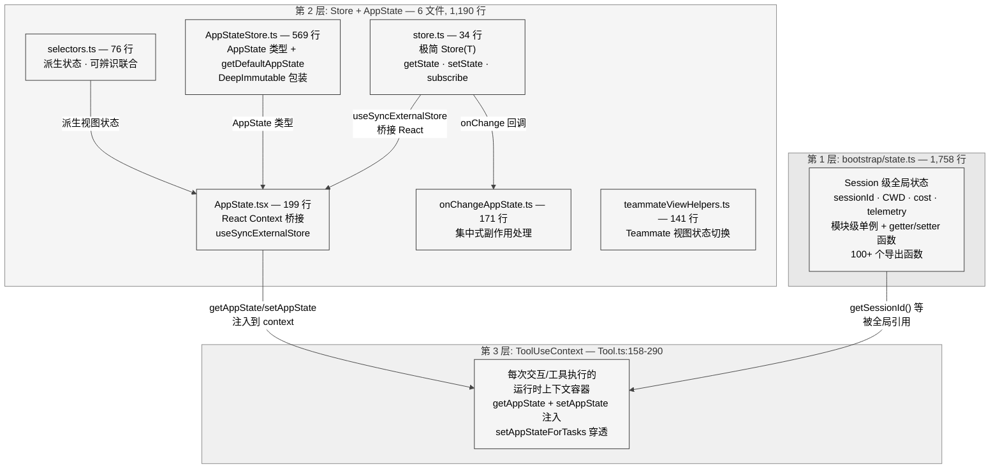
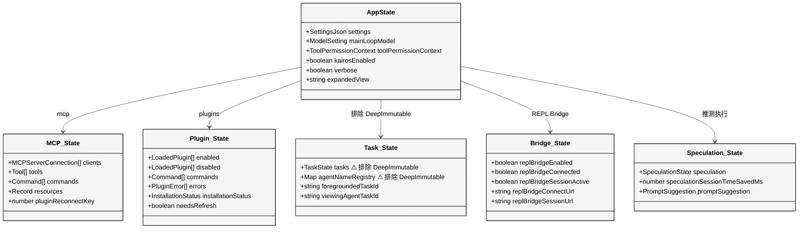
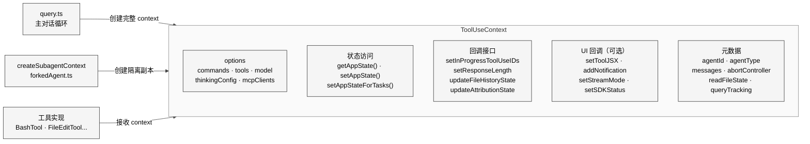
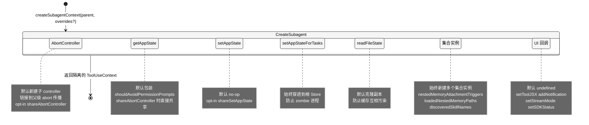
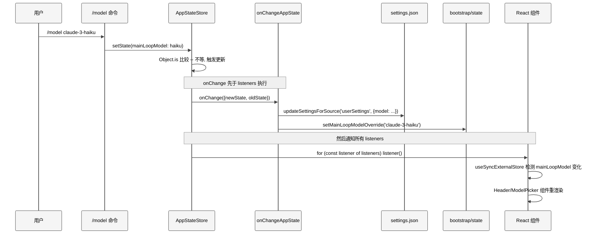
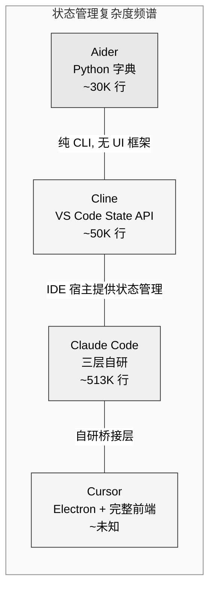

# 第 3 章 状态管理

> 核心提要：React 内外状态之间的桥接方式

## 3.1 定位

Claude Code 面临一个独特的工程难题：它**既是一个 React 应用，又不完全是**。

终端 UI 用 Ink（React for CLI）渲染，组件需要响应式的状态更新。但核心业务逻辑——API 调用、工具执行、Agent 编排——运行在 React 树之外。一次工具调用的结果需要同时被三个世界消费：

1. **React 组件**（终端 UI 渲染）
2. **非 React 的 `query.ts` 对话循环**（Agent 决策引擎）
3. **子 Agent 子系统**（可能运行在隔离上下文中，`setAppState` 甚至被替换为 no-op）

如果用 Redux/Zustand？终端 CLI 场景不需要 devtools、中间件链等重量级特性。React 内置的 `useState`/`useReducer`？无法从 React 树外部访问。模块级全局变量？无法触发 React 重渲染。

Claude Code 给出的答案是：**三层状态架构 + 一个 34 行的自研 Store**。

整个状态管理子系统仅 6 个文件、2,948 行代码（含 1,758 行的 `bootstrap/state.ts`），是 513,216 行代码库中最精简的子系统之一——但它的 API 被 **至少 98 个 React 组件/hooks** 和 **140+ 个非 React 模块** 调用，是整个应用最高频的基础设施。

<div style="background: #ffffff; padding: 16px; border-radius: 8px; margin: 16px 0;">



</div>

**本章结构**：3.2 节剖析架构设计哲学，3.3 节逐层深入实现细节，3.4 节分析防御编程模式，3.5 节做竞品对比，3.6 节回应社区误解，3.7 节讨论已知缺陷与未来方向。

---

## 3.2 架构

### 3.2.1 三层分离的根本原因：Import DAG 约束

三层架构不是一个"设计选择"——更准确地说，它是 **Import DAG（依赖有向无环图）约束** 下的必然结果。

`bootstrap/state.ts` 文件开头有两条著名的注释（`src/bootstrap/state.ts:L31`, `L259`）：

```typescript
// DO NOT ADD MORE STATE HERE - BE JUDICIOUS WITH GLOBAL STATE
```

```typescript
// ALSO HERE - THINK THRICE BEFORE MODIFYING
```

以及在 `onSessionSwitch` 的注释中（`src/bootstrap/state.ts:L484-L488`）：

```typescript
/**
 * Register a callback that fires when switchSession changes the active
 * sessionId. bootstrap can't import listeners directly (DAG leaf), so
 * callers register themselves.
 */
export const onSessionSwitch = sessionSwitched.subscribe
```

这段注释揭示了核心约束：`bootstrap/state.ts` 是 import 树的**叶子节点**——它几乎不 import 其他业务模块。如果它反向依赖了更高层的 `state/store.ts` 或 `state/AppStateStore.ts`，就会破坏 DAG 的拓扑结构，极易引入循环依赖。

**这解释了为什么存在两层独立的状态管理**：不是因为"bootstrap 级状态不需要响应式"（事实上 `getSlowOperations()` 就被 React 组件用 `useSyncExternalStore` 手动轮询），而是因为**依赖方向不允许合并**。

### 3.2.2 核心设计决策：Store 实例做 Context Value

整个桥接方案最关键的一个决策隐藏在 `AppState.tsx` 的注释中（原始 TypeScript 源码，通过 source map 还原）：

```typescript
// Store is created once and never changes -- stable context value means
// the provider never triggers re-renders. Consumers subscribe to slices
// via useSyncExternalStore in useAppState(selector).
const [store] = useState(() =>
  createStore<AppState>(
    initialState ?? getDefaultAppState(),
    onChangeAppState,
  ),
)
```

Provider 的 context value 是 `store`（Store 实例本身），而不是 `store.getState()`。Store 实例在创建后引用永远不变。由此可见：

- **Context value 的稳定性**避免了"因 context value 改变而导致的消费者全树重渲染"
- Provider 组件本身仍可能因父组件重渲染而重新执行（React 正常行为），但不会因 context value 变化而向下传播
- **真正驱动消费者更新的是 `useSyncExternalStore` 的 subscription 机制**，而非 context 变更

这是一个 React 性能工程的经典模式，但 Claude Code 将它推到了极致——在 98 个消费文件中，每个组件只订阅自己关心的状态切片，完全避免全量重渲染。

### 3.2.3 为什么自研 Store 而不用 Zustand？

Zustand 的核心 API 也是 `getState/setState/subscribe`，看起来几乎一样。但 Claude Code 选择 34 行自研有明确理由：

| 维度 | 自研 Store | Zustand |
|------|-----------|---------|
| 代码量 | 34 行 | 2,500+ 行 + middleware 生态 |
| `onChange` 回调 | 原生支持（构造时传入） | 需要 `subscribe` + 手动 diff |
| Bundle 体积 | 0 KB（内联） | ~7 KB gzip |
| TypeScript 贴合 | 完全自定义类型 | 泛型适配成本 |
| 中间件需求 | 无 | Claude Code 不需要 devtools/persist/immer |

最关键的是 `onChange` 回调——这是 Zustand 没有的原生特性。`onChangeAppState.ts` 依赖这个回调实现集中式副作用处理（3.3.4 节详述），如果用 Zustand 需要额外的 `subscribe` + 手动 diff 逻辑。

---

## 3.3 实现

### 3.3.1 第 1 层：bootstrap/state.ts — 1,758 行的进程级单例

**文件**：`src/bootstrap/state.ts`（1,758 行，100+ 个导出函数）

`State` 类型定义了约 **90 个字段**（`L45-L257`），涵盖：

| 类别 | 代表字段 | 数量 |
|------|---------|------|
| 身份标识 | `sessionId`, `parentSessionId`, `clientType` | ~6 |
| 路径信息 | `originalCwd`, `projectRoot`, `cwd` | ~3 |
| 成本与性能 | `totalCostUSD`, `totalAPIDuration`, `turnToolCount` 等 | ~15 |
| 模型配置 | `mainLoopModelOverride`, `initialMainLoopModel`, `modelStrings` | ~4 |
| 遥测基础设施 | `meter`, `sessionCounter`, `loggerProvider` 等 | ~12 |
| Session 标记 | `isInteractive`, `kairosActive`, `isRemoteMode` 等 | ~20 |
| 缓存稳定锁存 | `afkModeHeaderLatched`, `fastModeHeaderLatched` 等 | ~5 |
| SDK 集成 | `initJsonSchema`, `registeredHooks`, `sdkBetas` | ~5 |
| 技能追踪 | `invokedSkills` (Map) | ~3 |

**实现方式**：模块级闭包单例（`L429`）：

```typescript
// AND ESPECIALLY HERE
const STATE: State = getInitialState()
```

所有访问都通过导出的 getter/setter 函数。没有发布-订阅，没有响应式，纯命令式读写。

**一个精妙的性能优化**：`getSlowOperations()`（`L1595-L1621`）展示了即使在非响应式系统中也要考虑 React 消费者的情况：

```typescript
// src/bootstrap/state.ts:L1600-L1604
// Most common case: nothing tracked. Return a stable reference so the
// caller's setState() can bail via Object.is instead of re-rendering at 2fps.
if (STATE.slowOperations.length === 0) {
  return EMPTY_SLOW_OPERATIONS
}
```

这里用一个模块级常量 `EMPTY_SLOW_OPERATIONS` 确保空数组的引用稳定性。如果每次返回 `[]`，`Object.is` 永远为 false，React 组件会在每个 2fps 的轮询周期都重渲染——这是一个细微但关键的性能考量。

**scroll drain 机制**（`L792-L824`）是另一个值得注意的设计——它展示了 bootstrap/state 如何在不引入 React 依赖的前提下协调 UI 行为：

```typescript
// src/bootstrap/state.ts:L798-L806
export function markScrollActivity(): void {
  scrollDraining = true
  if (scrollDrainTimer) clearTimeout(scrollDrainTimer)
  scrollDrainTimer = setTimeout(() => {
    scrollDraining = false
    scrollDrainTimer = undefined
  }, SCROLL_DRAIN_IDLE_MS)
  scrollDrainTimer.unref?.()
}
```

滚动期间后台 intervals 通过 `getIsScrollDraining()` 自动跳过工作，避免与滚动帧竞争事件循环。这个标志位不在 `STATE` 对象中——而是模块作用域变量，因为它是短暂的热路径标志，不需要 test reset。

### 3.3.2 第 2 层核心：store.ts — 34 行的极简 Store

**文件**：`src/state/store.ts`（34 行）

完整实现：

```typescript
// src/state/store.ts — 完整源码
type Listener = () => void
type OnChange<T> = (args: { newState: T; oldState: T }) => void

export type Store<T> = {
  getState: () => T
  setState: (updater: (prev: T) => T) => void
  subscribe: (listener: Listener) => () => void
}

export function createStore<T>(
  initialState: T,
  onChange?: OnChange<T>,
): Store<T> {
  let state = initialState
  const listeners = new Set<Listener>()

  return {
    getState: () => state,

    setState: (updater: (prev: T) => T) => {
      const prev = state
      const next = updater(prev)
      if (Object.is(next, prev)) return
      state = next
      onChange?.({ newState: next, oldState: prev })
      for (const listener of listeners) listener()
    },

    subscribe: (listener: Listener) => {
      listeners.add(listener)
      return () => listeners.delete(listener)
    },
  }
}
```

五个关键设计点：

**1. `Object.is` 短路**（`L23`）：如果 updater 返回同一引用，跳过所有通知。这是 React `useSyncExternalStore` 的要求——snapshot 不变则不重渲染。

**2. 函数式 updater**：不接受直接赋值 `setState(newValue)`，只接受函数 `setState(prev => newValue)`。这确保多次异步更新可以正确组合——后一次 updater 拿到的 `prev` 是前一次更新后的结果。

**3. `onChange` 在 listener 之前调用**（`L25-L26`）：副作用处理先于 UI 通知。由此可见当 React 组件收到更新信号时，`onChangeAppState` 中的持久化/外部通知已经完成。

**4. `Set<Listener>`**：用 Set 存储 listener，`add/delete` 都是 O(1)，且天然去重。

**5. API 恰好匹配 `useSyncExternalStore`**：`getState` → `getSnapshot`，`subscribe` → 注册函数。这不是巧合，而是**为桥接而精确设计的接口**。

### 3.3.3 AppState 类型：452 行的单一状态树

**文件**：`src/state/AppStateStore.ts`（569 行）

`AppState` 是整个应用 UI 层面的**单一状态树**（`L89-L452`），用 `DeepImmutable<T>` 包装强制编译时不可变。实际统计约 **100+ 个字段**，按领域分组：

<div style="background: #ffffff; padding: 16px; border-radius: 8px; margin: 16px 0;">



</div>

**`DeepImmutable` 排除区域**（`L158-L169`）：

```typescript
// src/state/AppStateStore.ts:L158-L163
}> & {
  // Unified task state - excluded from DeepImmutable because TaskState
  // contains function types
  tasks: { [taskId: string]: TaskState }
  // Name → AgentId registry populated by Agent tool when `name` is provided.
  agentNameRegistry: Map<string, AgentId>
```

`tasks` 被排除因为 `TaskState` 包含 `abortController` 等函数类型；`agentNameRegistry` 是 `Map` 类型，与 `DeepImmutable` 的递归 readonly 转换不兼容。还有一条 TODO 注释（`L172`）暗示团队对当前方案并不完全满意：

```typescript
// TODO (ashwin): see if we can use utility-types DeepReadonly for this
```

**`getDefaultAppState()` 中的循环依赖规避**（`L456-L466`）：

```typescript
// src/state/AppStateStore.ts:L458-L462
  // Determine initial permission mode for teammates spawned with plan_mode_required
  // Use lazy require to avoid circular dependency with teammate.ts
  /* eslint-disable @typescript-eslint/no-require-imports */
  const teammateUtils =
    require('../utils/teammate.js') as typeof import('../utils/teammate.js')
```

这里用运行时 `require()` 代替编译时 `import` 来规避循环依赖——这是 Claude Code 代码库中常见的模式，尤其在初始化路径上。

### 3.3.4 onChangeAppState：集中式副作用的"单一咽喉"

**文件**：`src/state/onChangeAppState.ts`（171 行）

这个文件是整个状态管理系统中最有工程智慧的部分。它的注释（`L50-L64`）清楚记录了设计动机：

```typescript
// src/state/onChangeAppState.ts:L50-L64
  // toolPermissionContext.mode — single choke point for CCR/SDK mode sync.
  //
  // Prior to this block, mode changes were relayed to CCR by only 2 of 8+
  // mutation paths: a bespoke setAppState wrapper in print.ts (headless/SDK
  // mode only) and a manual notify in the set_permission_mode handler.
  // Every other path — Shift+Tab cycling, ExitPlanModePermissionRequest
  // dialog options, the /plan slash command, rewind, the REPL bridge's
  // onSetPermissionMode — mutated AppState without telling
  // CCR, leaving external_metadata.permission_mode stale and the web UI out
  // of sync with the CLI's actual mode.
```

这段注释是一个典型的**从散布式到集中式**重构的记录：过去权限模式变更需要在每个修改入口手动通知外部系统，8+ 个修改路径中只有 2 个正确同步。现在通过 `onChange` 回调，**任何** `setState` 调用导致的变更都被集中拦截处理。

`onChangeAppState` 处理六类副作用：

| 触发条件 | 副作用 | 目标系统 |
|---------|--------|---------|
| `toolPermissionContext.mode` 变化 | `notifySessionMetadataChanged` + `notifyPermissionModeChanged` | CCR + SDK |
| `mainLoopModel` → `null` | `updateSettingsForSource('userSettings', {model: undefined})` | settings.json |
| `mainLoopModel` → 非 null | `updateSettingsForSource('userSettings', {model: ...})` | settings.json |
| `expandedView` 变化 | `saveGlobalConfig({showExpandedTodos, showSpinnerTree})` | global config |
| `verbose` 变化 | `saveGlobalConfig({verbose})` | global config |
| `settings` 变化 | `clearApiKeyHelperCache()` + `clearAwsCredentialsCache()` + `clearGcpCredentialsCache()` | 认证缓存 |

权限模式通知还包含一个精巧的过滤逻辑（`L68-L91`）：内部模式名（如 `bubble`, `ungated auto`）被 `toExternalPermissionMode()` 转换后才发送给 CCR，如果外部模式没有实际变化（如 `default→bubble→default` 序列），CCR 通知会被跳过以避免噪音。

### 3.3.5 React 桥接：useSyncExternalStore 的精确运用

**文件**：`src/state/AppState.tsx`（199 行，编译后版本含 React Compiler 产出）

通过 source map 还原的原始 `useAppState` hook：

```typescript
// 还原自 AppState.tsx source map
export function useAppState<T>(selector: (state: AppState) => T): T {
  const store = useAppStore()

  const get = () => {
    const state = store.getState()
    const selected = selector(state)

    // Ant-only guard: prevent returning the entire state tree
    if ("external" === 'ant' && state === selected) {
      throw new Error(
        `Your selector in \`useAppState(${selector.toString()})\` returned the original state...`
      )
    }

    return selected
  }

  return useSyncExternalStore(store.subscribe, get, get)
}
```

注意 `"external" === 'ant'` 这个条件——在编译后的外部版本中永远为 `false`（被 DCE 移除），但在内部版本中会在开发时**捕获误用**：如果 selector 返回了整个 state 引用而非切片，说明开发者没有做细粒度订阅，这会导致每次状态变更都触发该组件重渲染。

文档注释（`L126-L141`）进一步规范了正确用法：

```typescript
/**
 * Do NOT return new objects from the selector -- Object.is will always see
 * them as changed. Instead, select an existing sub-object reference:
 * ```
 * const { text, promptId } = useAppState(s => s.promptSuggestion) // good
 * ```
 */
```

这是一个常见的 `useSyncExternalStore` 陷阱：如果 selector 每次都返回新对象（如 `s => ({a: s.a, b: s.b})`），`Object.is` 永远不等，组件永远重渲染。Claude Code 通过 JSDoc 注释和内部版本的运行时检查双重防护。

**容错版本** `useAppStateMaybeOutsideOfProvider`（`L186-L199`）用于可能在 Provider 外渲染的组件：

```typescript
// src/state/AppState.tsx:L186-L199
export function useAppStateMaybeOutsideOfProvider<T>(
  selector: (state: AppState) => T,
): T | undefined {
  const store = useContext(AppStoreContext)
  return useSyncExternalStore(
    store ? store.subscribe : NOOP_SUBSCRIBE,
    () => store ? selector(store.getState()) : undefined,
  )
}
```

`NOOP_SUBSCRIBE = () => () => {}` 确保在没有 Store 时不会崩溃，返回 `undefined`。

**re-export 迁移标记**（`L23-L26`）：

```typescript
// TODO: Remove these re-exports once all callers import directly from
// ./AppStateStore.js. Kept for back-compat during migration so .ts callers
// can incrementally move off the .tsx import and stop pulling React.
```

这揭示了一个正在进行的重构：将类型定义从 `.tsx` 文件分离到 `.ts` 文件，使非 React 代码不再被迫引入 React 运行时。`AppStateStore.ts`（纯类型 + 工厂函数）就是这次分离的产物。

### 3.3.6 第 3 层：ToolUseContext — 工具执行的运行时上下文容器

**文件**：`src/Tool.ts:L158-L290`（约 130 行类型定义）

`ToolUseContext` 不是存储在 Store 中的状态，而是面向**一次交互或一次工具执行**的运行时上下文容器。它是连接所有状态层的"传话人"。

<div style="background: #ffffff; padding: 16px; border-radius: 8px; margin: 16px 0;">



</div>

**为什么包含 `getAppState()` / `setAppState()` 而不是直接传 Store 实例？**

因为不同的调用者需要不同版本：

- **主对话循环**：直接连接真实 Store
- **同步子 Agent**（shareAbortController = true）：共享父级 Store，可以操作 UI
- **异步子 Agent**（默认）：`setAppState` 被替换为 `() => {}`，`getAppState` 被包装以自动设置 `shouldAvoidPermissionPrompts: true`

### 3.3.7 createSubagentContext：隔离与穿透的平衡

**文件**：`src/utils/forkedAgent.ts:L345-L462`

这是整个状态管理系统中**设计最精巧的函数**。它的核心原则是**默认隔离，显式共享**：

<div style="background: #ffffff; padding: 16px; border-radius: 8px; margin: 16px 0;">



</div>

**`setAppStateForTasks` 的"始终穿透"设计**（`L413-L417`）是这个函数最关键的细节：

```typescript
// src/utils/forkedAgent.ts:L413-L417
    // Task registration/kill must always reach the root store, even when
    // setAppState is a no-op — otherwise async agents' background bash tasks
    // are never registered and never killed (PPID=1 zombie).
    setAppStateForTasks:
      parentContext.setAppStateForTasks ?? parentContext.setAppState,
```

即使 `setAppState` 被设为 no-op（异步 Agent 不应修改 UI 状态），`setAppStateForTasks` 仍然连接到根 Store。原因是后台 Agent 启动的 bash 任务需要注册到全局任务列表，否则在进程退出时无法被正确清理——注释中"PPID=1 zombie"是 Unix 系统中父进程退出后孤儿进程被 init 领养的经典问题。

**另一个值得注意的隔离决策**——`localDenialTracking`（`L418-L422`）：

```typescript
// src/utils/forkedAgent.ts:L418-L422
    // Async subagents whose setAppState is a no-op need local denial tracking
    // so the denial counter actually accumulates across retries.
    localDenialTracking: overrides?.shareSetAppState
      ? parentContext.localDenialTracking
      : createDenialTrackingState(),
```

当 `setAppState` 是 no-op 时，权限拒绝计数器无法通过正常路径累积（因为写入被丢弃）。所以子 Agent 需要一个本地副本来独立追踪，否则 fallback-to-prompting 的阈值永远触达不了。

---

## 3.4 细节

### 3.4.1 数据流全景：一次模型切换的完整旅程

<div style="background: #ffffff; padding: 16px; border-radius: 8px; margin: 16px 0;">



</div>

一次 `setState` 调用同时完成三件事：更新内存状态、持久化到磁盘、通知 UI。这就是集中式 `onChange` 的威力——零遗漏、零散布。

### 3.4.2 嵌套禁止守卫

`AppStateProvider` 中有一个显式的嵌套检查（`L44-L47`）：

```typescript
// src/state/AppState.tsx:L44-L47
  const hasAppStateContext = useContext(HasAppStateContext)
  if (hasAppStateContext) {
    throw new Error(
      "AppStateProvider can not be nested within another AppStateProvider"
    )
  }
```

通过额外的 `HasAppStateContext`（boolean context）确保全局只有一个 Provider 实例。嵌套 Provider 会导致内层组件的 Store 与外层脱节——这在 React 开发中是一个经典的配置错误，Claude Code 在运行时就将其拦截。

### 3.4.3 权限模式挂载竞态条件

`AppStateProvider` 的 `useEffect` 处理了一个微妙的竞态条件（原始 source map 还原）：

```typescript
// 还原自 AppState.tsx source map
  // Check on mount if bypass mode should be disabled
  // This handles the race condition where remote settings load BEFORE this
  // component mounts, meaning the settings change notification was sent when
  // no listeners were subscribed.
  useEffect(() => {
    const { toolPermissionContext } = store.getState()
    if (
      toolPermissionContext.isBypassPermissionsModeAvailable &&
      isBypassPermissionsModeDisabled()
    ) {
      store.setState(prev => ({
        ...prev,
        toolPermissionContext: createDisabledBypassPermissionsContext(
          prev.toolPermissionContext,
        ),
      }))
    }
  }, [])
```

问题场景：远程 settings 在 React 树挂载**之前**就加载完成，设置变更通知被发送时没有任何 listener 在监听。这个 mount-only effect 在首次渲染后补偿性地检查并修正状态。

### 3.4.4 teammateViewHelpers 中的循环依赖规避

`src/state/teammateViewHelpers.ts` 展示了另一个防御模式（`L5-L6, L11-L21`）：

```typescript
// src/state/teammateViewHelpers.ts:L5-L6
// Inlined from framework.ts — importing creates a cycle through
// BackgroundTasksDialog. Keep in sync with PANEL_GRACE_MS there.
const PANEL_GRACE_MS = 30_000
```

```typescript
// src/state/teammateViewHelpers.ts:L11-L21
// Inline type check instead of importing isLocalAgentTask — breaks the
// teammateViewHelpers → LocalAgentTask runtime edge that creates a cycle
// through BackgroundTasksDialog.
function isLocalAgent(task: unknown): task is LocalAgentTaskState {
  return (
    typeof task === 'object' &&
    task !== null &&
    'type' in task &&
    task.type === 'local_agent'
  )
}
```

为了避免循环依赖，常量和类型守卫都被手动内联。这是一个典型的"用代码重复换取 import DAG 正确性"的权衡——注释中 "Keep in sync with PANEL_GRACE_MS there" 明确标记了需要手动同步的风险。

### 3.4.5 Selectors：可辨识联合的类型安全设计

`src/state/selectors.ts`（76 行）展示了一个教科书级的可辨识联合（Discriminated Union）用法：

```typescript
// src/state/selectors.ts:L46-L49
export type ActiveAgentForInput =
  | { type: 'leader' }
  | { type: 'viewed'; task: InProcessTeammateTaskState }
  | { type: 'named_agent'; task: LocalAgentTaskState }
```

调用方可以用 `switch(result.type)` 做穷举检查，TypeScript 编译器保证每个分支都被处理。`getActiveAgentForInput` 的实现（`L59-L76`）优先检查 teammate 视图，然后检查 named agent，最后 fallback 到 leader——这个优先级链决定了用户输入的路由目标。

### 3.4.6 `externalMetadataToAppState`：反向同步

`onChangeAppState.ts` 中还有一个容易被忽视的函数（`L24-L41`）：

```typescript
// src/state/onChangeAppState.ts:L23-L41
// Inverse of the push below — restore on worker restart.
export function externalMetadataToAppState(
  metadata: SessionExternalMetadata,
): (prev: AppState) => AppState {
  return prev => ({
    ...prev,
    ...(typeof metadata.permission_mode === 'string'
      ? { toolPermissionContext: {
            ...prev.toolPermissionContext,
            mode: permissionModeFromString(metadata.permission_mode),
          }}
      : {}),
    ...(typeof metadata.is_ultraplan_mode === 'boolean'
      ? { isUltraplanMode: metadata.is_ultraplan_mode }
      : {}),
  })
}
```

注释 "Inverse of the push below — restore on worker restart" 说明这是 `onChangeAppState` 中正向推送（AppState → CCR）的**逆操作**——当 worker 重启时，从 CCR 的 external metadata 恢复 AppState。这形成了一个**双向同步协议**：正向通过 `onChange` 自动推送，反向通过 `externalMetadataToAppState` 手动拉取。

---

## 3.5 比较

### 3.5.1 AI Agent 产品的状态管理频谱

<div style="background: #ffffff; padding: 16px; border-radius: 8px; margin: 16px 0;">



</div>

| 维度 | Claude Code | Aider | Cline | Cursor |
|------|-------------|-------|-------|--------|
| **UI 框架** | Ink (React for CLI) | 纯 CLI (print) | VS Code Webview | Electron + React |
| **状态管理** | 34 行自研 Store + useSyncExternalStore | Python 类属性 | VS Code ExtensionContext.globalState | 推测用 Redux/Zustand |
| **React 桥接** | 需要（Ink 是 React） | 不需要 | 不需要（WebView 独立） | 原生（Electron） |
| **子 Agent 隔离** | createSubagentContext + no-op setter | 无多 Agent | 无多 Agent | 未知 |
| **状态持久化** | onChange 集中式 | 手动 | VS Code API | 推测用 electron-store |
| **编译时 DCE** | feature() + 内部版本运行时检查 | 无 | 无 | 未知 |

**Claude Code 独特优势**：

1. **跨 React/非 React 边界的状态共享**是其他竞品不需要面对的问题——Aider 没有 UI 框架，Cline 的 Webview 与 Extension Host 通过消息传递（不需要共享内存状态），Cursor 在 Electron 中原生运行 React。Claude Code 的 Ink 选择使它必须解决这个独特问题，而 34 行 Store 是一个极其优雅的解决方案。

2. **子 Agent 上下文隔离**是其他竞品完全不具备的能力——Aider 和 Cline 没有多 Agent 编排，不需要处理"子 Agent 的 setState 应该是 no-op 但任务注册必须穿透"这类微妙问题。

**Claude Code 的局限**：

1. **没有 devtools**：34 行 Store 不支持 time-travel debugging。当状态出现异常时，只能靠 `logForDebugging` 手动追踪。
2. **`bootstrap/state.ts` 膨胀**：1,758 行 + 100+ getter/setter 函数，虽然注释警告"DO NOT ADD MORE STATE HERE"，但实际字段数已经接近 90 个，管理成本在上升。
3. **缺乏状态模式验证**：`AppState` 的某些字段组合可能是非法的（如 `viewingAgentTaskId` 指向不存在的 task），但没有运行时 invariant 检查。

---

## 3.6 辨误

### 误解 1："Claude Code 用了 Redux 或 Zustand"

**纠正**：Claude Code **没有使用任何外部状态管理库**。34 行自研 Store 的 API 与 Zustand 相似，但不是 Zustand。参考资料 E7 章描述 Store 使用了 "immer-style produce" 实现 structural sharing——这是**不准确的**。源码中的 `setState` 只做 `Object.is` 引用相等检查（`store.ts:L23`），不涉及任何 immer/produce/structural sharing。状态不可变性完全由 `DeepImmutable<T>` 在编译时保证，运行时无额外开销。

### 误解 2："`bootstrap/state.ts` 不能用 Store 是因为 Store 依赖 React"

**纠正**：`state/store.ts` 和 `state/AppStateStore.ts` 本身**不依赖 React**——真正引入 React 的是 `state/AppState.tsx`。不能合并的原因是 **Import DAG 约束**：`bootstrap/state.ts` 必须保持为依赖树的叶子节点，如果它反向依赖了任何 `state/` 模块（无论是否含 React），都会破坏 DAG 拓扑。源码注释（`L484-L488`）明确说明了这一点。

### 误解 3："AppState 有 565+ 个属性"

**纠正**：Karan Prasad 的分析文章称 "565+ state properties"，但实际 `AppState` 类型定义约 100+ 个顶层字段（含嵌套结构的叶子字段可能接近几百个）。"565" 可能包含了 `bootstrap/state.ts` 的字段和 `ToolUseContext` 的字段——这三层是不同的状态容器，不应简单相加。

### 误解 4："Store 使用了 DeepImmutable 做运行时保护"

**纠正**：`DeepImmutable<T>` 是**纯类型层面的**递归 `readonly` 映射，在编译后的 JavaScript 中完全消失。它不产生任何运行时开销（不像 Object.freeze 或 Immer 的 Proxy）。保护是编译时的——TypeScript 编译器会阻止直接修改被 `DeepImmutable` 包装的属性。

---

## 3.7 展望

### 3.7.1 已知的 TODO 和技术债务

源码中明确标记的 TODO（`state/` 目录内）：

1. **`AppStateStore.ts:L172`**：`// TODO (ashwin): see if we can use utility-types DeepReadonly for this` —— 对当前 `DeepImmutable` 方案不满意，考虑用第三方工具类型替代。

2. **`AppState.tsx:L23-L26`**：`// TODO: Remove these re-exports once all callers import directly from ./AppStateStore.js.` —— 正在进行的 `.tsx` → `.ts` 迁移，目的是让非 React 代码不再被迫引入 React 运行时。

### 3.7.2 可能的未来瓶颈

**1. `bootstrap/state.ts` 的单体化趋势**

尽管注释反复警告"DO NOT ADD MORE STATE HERE"，这个文件已经膨胀到 1,758 行、90 个字段、100+ 个导出函数。每增加一个全局状态都需要一对 getter/setter，文件长度线性增长。长期来看，可能需要按领域拆分为多个叶子模块（如 `bootstrap/telemetryState.ts`、`bootstrap/costState.ts`），每个都保持 DAG 叶子地位。

**2. `onChange` 回调的膨胀**

`onChangeAppState` 已经处理 6 类副作用。随着 AppState 字段增多，这个函数会变成一个巨大的 diff-and-dispatch 中心。可以考虑引入一个 "middleware-like" 的注册机制——每个副作用模块注册自己关心的字段和处理函数——但这会增加间接性和调试难度。

**3. 缺乏状态一致性验证**

`AppState` 中某些字段有隐式的一致性约束（如 `viewingAgentTaskId` 引用的 task 必须存在于 `tasks` 中），但没有运行时 invariant 检查。selector `getViewedTeammateTask` 通过多层 `if (!xxx) return undefined` 做了防御性处理（`selectors.ts:L24-L37`），但这只是"不崩溃"而非"不出错"。

**4. `DeepImmutable` 的排除区域**

`tasks` 和 `agentNameRegistry` 被排除在 `DeepImmutable` 之外，理论上可以被直接修改。虽然 `teammateViewHelpers.ts` 中的状态更新代码（`enterTeammateView`、`exitTeammateView`）都严格遵循不可变更新模式，但没有编译时强制保证。

### 3.7.3 改进建议

1. **引入状态分区**：将 `bootstrap/state.ts` 拆分为按领域组织的多个叶子模块，通过 barrel export 保持向后兼容。

2. **为 `onChange` 引入声明式注册**：类似于 `onSessionSwitch` 的 signal 模式（`L481-L489`），让各模块注册自己关心的状态变更处理器，而不是在一个函数里集中 diff。

3. **ToolUseContext 类型收窄**：当前 `ToolUseContext` 有 40+ 个字段，许多是可选的。可以用更严格的联合类型（如 `InteractiveContext | HeadlessContext | SubagentContext`）替代单一的大接口，让类型系统帮助捕获不合法的字段访问。

4. **考虑 `Map<string, TaskState>` 替代 `{ [taskId: string]: TaskState }`**：当前 `tasks` 字段用 Record 类型但被排除在 `DeepImmutable` 之外。如果切换到 `Map`，可以利用 `Map` 的天然引用语义和更好的性能特征（频繁增删场景）。

---

## 3.8 小结

### 核心 Takeaway

**1. 34 行 Store 是"恰好够用"工程哲学的极致体现**

`createStore` 的 API 表面积精确匹配了 `useSyncExternalStore` 的要求——不多不少。零依赖、完全可控、`onChange` 回调原生支持。在 Agent 工程中，自研极简状态管理比引入重量级框架更合理，因为需求曲线极其明确。

**2. Context Value 放 Store 实例是关键的性能决策**

Provider 传递稳定的 Store 引用（而非状态值），配合 selector + `useSyncExternalStore`，实现了**零全树重渲染**的精确订阅。这个模式适用于任何需要在 React 和非 React 代码之间共享状态的中小型应用。

**3. `onChange` 集中式副作用解决了"N 个入口、M 个副作用"的 N×M 组合爆炸**

历史教训是 8 个修改路径中只有 2 个正确通知外部系统。集中式 `onChange` 将复杂度从 O(N×M) 降到 O(N+M)。

**4. 默认隔离 + 选择性穿透是多 Agent 系统的安全模式**

`createSubagentContext` 默认将所有可变状态设为隔离的（no-op setter、克隆缓存、新建集合），只有经过明确 opt-in 的通道（`shareSetAppState`、`setAppStateForTasks`）才允许修改共享状态。特别是 `setAppStateForTasks` 的"始终穿透"设计——来自"PPID=1 zombie"的血泪教训——是任何多 Agent 系统都应该借鉴的模式。

**5. Import DAG 约束驱动了三层分离**

不是先有三层设计再有 DAG——而是 `bootstrap/state.ts` 作为叶子节点的约束，强制产生了独立的第一层。理解这个因果关系，才能理解为什么不能简单地"把所有状态放到一个 Store 里"。

### 对 Agent 开发者的实践建议

- **如果你的 Agent 有 React UI（包括 Ink）**：直接复用 Claude Code 的 34 行 Store + `useSyncExternalStore` 模式，不需要引入 Zustand/Redux
- **如果你的 Agent 有多 Agent 编排**：学习 `createSubagentContext` 的"默认 no-op + 选择性穿透"模式
- **如果你的 Agent 有多个状态修改入口**：学习 `onChange` 集中式副作用模式，避免散布式通知
- **如果你的状态管理出现循环依赖**：学习 Claude Code 的策略——将基础状态放在 import DAG 的叶子节点，用 `createSignal` + 注册模式实现反向通知
