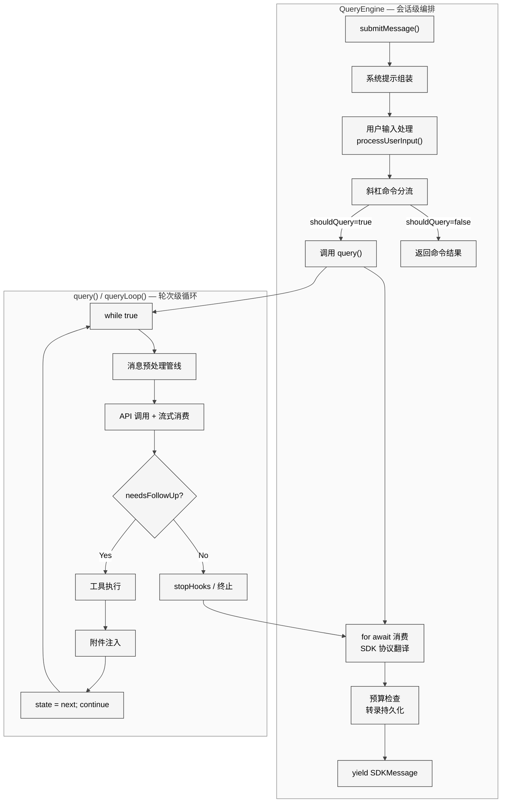
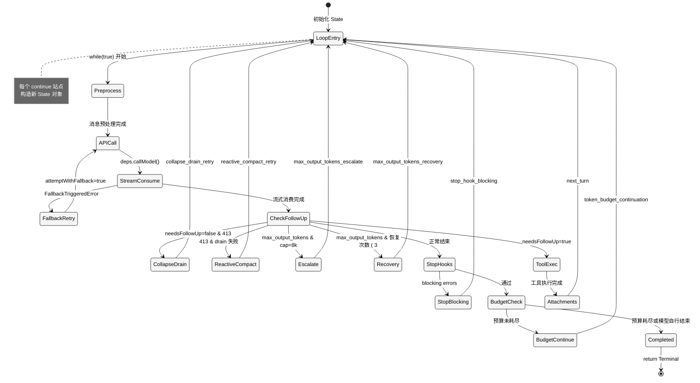
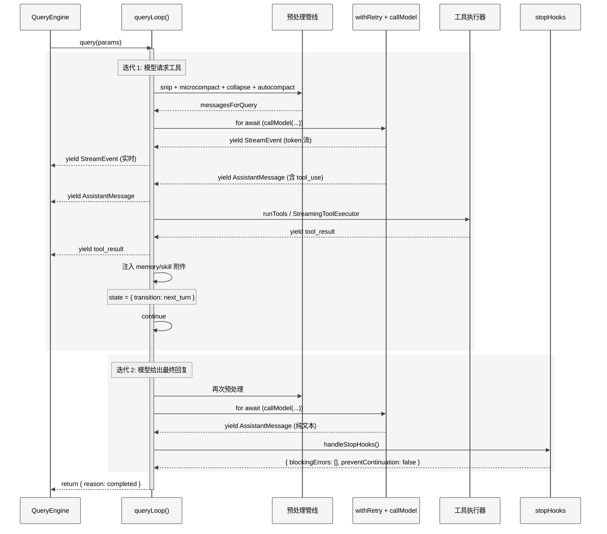

# 第 5 章 对话循环

> 核心提要：主循环与恢复分支的组织

---

## 5.1 定位

如果把 Claude Code 比作一个操作系统，`query.ts` 就是它的**心跳发生器**——每一次搏动驱动一轮 API 调用与工具执行。当用户在终端输入一句话，它所触发的不是一次简单的 HTTP 请求，而是一个精密编排的多阶段循环：

```
用户输入 → 消息预处理 → API 调用 → 流式响应 → 工具执行 → 附件注入 → 继续循环 / 终止
```

在 Claude Code 513,216 行源码（v2.1.88, 1,884 文件）中，对话循环涉及的核心文件清单如下：

| 文件 | 行数 | 核心职责 |
|------|------|---------|
| `src/query.ts` | 1,729 | 主循环编排：消息预处理、API 调用、工具分发、错误恢复 |
| `src/QueryEngine.ts` | 1,295 | 会话级编排器：系统提示组装、SDK 协议翻译、预算管理 |
| `src/services/api/withRetry.ts` | 822 | 网络重试层：指数退避、fallback 触发、持久重试 |
| `src/services/tools/StreamingToolExecutor.ts` | 530 | 流式工具执行器：流中启动工具、并发控制、丢弃机制 |
| `src/query/stopHooks.ts` | 473 | 停止钩子：轮次结束后的验证、记忆提取、AutoDream |
| `src/services/tools/toolOrchestration.ts` | 188 | 工具编排：并发安全分区、串行/并行调度 |
| `src/query/tokenBudget.ts` | 93 | Token 预算：自动续行、递减检测 |
| `src/query/config.ts` | 46 | 查询配置：Statsig gates 快照 |
| `src/query/deps.ts` | 40 | 依赖注入：测试友好的 I/O 抽象 |

总计约 **5,216 行**构成了完整的"循环系统"。主循环 `query.ts` 只占其中 1/3。

### 两层编排架构

对话循环采用经典的**两层编排**架构：

<div style="background: #ffffff; padding: 16px; border-radius: 8px; margin: 16px 0;">



</div>

**QueryEngine** 是会话生命周期的拥有者——一个 `QueryEngine` 实例对应一次完整对话。它的职责：组装系统提示、处理用户输入（包括斜杠命令分流）、管理 USD 预算检查、持久化转录、将内部消息类型翻译为 SDK 协议。源码注释（`src/QueryEngine.ts:176-183`）明确说明了这个定位：

```typescript
/**
 * QueryEngine owns the query lifecycle and session state for a conversation.
 * One QueryEngine per conversation. Each submitMessage() call starts a new
 * turn within the same conversation. State (messages, file cache, usage, etc.)
 * persists across turns.
 */
```

**query() / queryLoop()** 是单轮次的循环引擎——它接收预处理好的参数，执行 `while(true)` 循环直到模型不再请求工具为止。

> **实践建议**：两层分离的核心价值在于 **关注点隔离**。如果你在构建 Agent 框架，将"会话管理"（认证、预算、持久化）与"循环逻辑"（API 调用、工具执行、错误恢复）分开，可以让内层循环保持可测试、可复用。Claude Code 的 `QueryDeps` 依赖注入就是为此而设计。

---

## 5.2 架构

### 5.2.1 AsyncGenerator：关键的架构决策

`query()` 返回 `AsyncGenerator` 而非 `Promise`，这不是语法偏好，而是一个解决多个工程问题的核心架构决策。来看签名（`src/query.ts:219-239`）：

```typescript
export async function* query(
  params: QueryParams,
): AsyncGenerator<
  | StreamEvent
  | RequestStartEvent
  | Message
  | TombstoneMessage
  | ToolUseSummaryMessage,
  Terminal
> {
  const consumedCommandUuids: string[] = []
  const terminal = yield* queryLoop(params, consumedCommandUuids)
  for (const uuid of consumedCommandUuids) {
    notifyCommandLifecycle(uuid, 'completed')
  }
  return terminal
}
```

AsyncGenerator 解决了三个问题：

1. **流式事件产出**：每个中间结果（流式 token、工具进度、压缩通知）通过 `yield` 逐个产出。REPL 实时渲染，SDK 实时转发，不需要等一整轮完成。

2. **协作式取消**：调用方通过 `.return()` 终止 generator（如用户按 Ctrl+C）。generator 的 `finally` 块保证清理逻辑执行。注意 `query()` 和 `queryLoop()` 之间的 `yield*` 委托——当外层被 `.return()` 关闭时，两个 generator 同步关闭，`for...of` 循环中的命令完成通知被跳过——这正是预期行为：异常意味着命令未成功完成。

3. **背压控制**：只在调用方 `for await...of` 拉取时才推进循环。如果 SDK 消费慢，循环自然阻塞。

### 5.2.2 QueryParams：输入契约

`QueryParams`（`src/query.ts:181-199`）定义了循环的输入边界：

```typescript
export type QueryParams = {
  messages: Message[]
  systemPrompt: SystemPrompt
  userContext: { [k: string]: string }
  systemContext: { [k: string]: string }
  canUseTool: CanUseToolFn
  toolUseContext: ToolUseContext
  fallbackModel?: string
  querySource: QuerySource
  maxTurns?: number
  taskBudget?: { total: number }
  deps?: QueryDeps
}
```

其中 `QueryDeps`（`src/query/deps.ts:21-31`）是精心设计的依赖注入接口：

```typescript
export type QueryDeps = {
  callModel: typeof queryModelWithStreaming
  microcompact: typeof microcompactMessages
  autocompact: typeof autoCompactIfNeeded
  uuid: () => string
}
```

源码注释解释了设计动机："the most common mocks (callModel, autocompact) are each spied in 6-8 test files today with module-import-and-spy boilerplate"。依赖注入消除了这些样板代码。注意范围"intentionally narrow (4 deps) to prove the pattern"——这是一个正在演进中的重构。

### 5.2.3 State：循环的可变状态

每次迭代共享的可变状态被封装在 `State` 类型中（`src/query.ts:204-217`）：

```typescript
type State = {
  messages: Message[]
  toolUseContext: ToolUseContext
  autoCompactTracking: AutoCompactTrackingState | undefined
  maxOutputTokensRecoveryCount: number
  hasAttemptedReactiveCompact: boolean
  maxOutputTokensOverride: number | undefined
  pendingToolUseSummary: Promise<ToolUseSummaryMessage | null> | undefined
  stopHookActive: boolean | undefined
  turnCount: number
  transition: Continue | undefined
}
```

`transition` 字段记录了**上一次迭代为什么 `continue`**。它不仅用于调试和遥测——还用于控制恢复逻辑。例如，当 `transition.reason === 'collapse_drain_retry'` 时，下一次迭代不再尝试 collapse drain，防止重复恢复。

循环中共有 **7 个 `continue` 站点 + 12 个 `return` 退出口**。每个 `continue` 站点都通过构造新 `State` 对象来更新状态——这种"不可变更新"风格让每条恢复路径的意图一目了然：

<div style="background: #ffffff; padding: 16px; border-radius: 8px; margin: 16px 0;">



</div>

### 5.2.4 QueryConfig：环境快照

`buildQueryConfig()`（`src/query/config.ts:29-46`）在循环入口处**快照**一次运行时配置：

```typescript
export function buildQueryConfig(): QueryConfig {
  return {
    sessionId: getSessionId(),
    gates: {
      streamingToolExecution: checkStatsigFeatureGate_CACHED_MAY_BE_STALE(
        'tengu_streaming_tool_execution2',
      ),
      emitToolUseSummaries: isEnvTruthy(
        process.env.CLAUDE_CODE_EMIT_TOOL_USE_SUMMARIES,
      ),
      isAnt: process.env.USER_TYPE === 'ant',
      fastModeEnabled: !isEnvTruthy(process.env.CLAUDE_CODE_DISABLE_FAST_MODE),
    },
  }
}
```

注释明确排除了 `feature()` 编译时门控——那些是 Bun 打包器的 tree-shaking 边界，必须内联在代码块中才能被 Dead Code Elimination 识别。`QueryConfig` 只快照运行时 gates（Statsig 和 env），让 `CACHED_MAY_BE_STALE` 的"过时"语义控制在单次查询范围内。

---

## 5.3 实现

### 5.3.1 消息预处理管线

在每次 API 调用之前，消息经过一条五阶段管线。管线的核心原则是：**越轻量的压缩越先执行**。

<div style="background: #ffffff; padding: 16px; border-radius: 8px; margin: 16px 0;">


</div>

**阶段 1：applyToolResultBudget**（`src/query.ts:379-394`）

裁剪过大的工具结果。注意它在 microcompact **之前**运行——源码注释解释："cached MC operates purely by tool_use_id (never inspects content), so content replacement is invisible to it and the two compose cleanly"。两个阶段互不干扰。

**阶段 2：snipCompact**（`src/query.ts:401-410`）

`HISTORY_SNIP` feature gate 控制。Snip 不调用 API，直接在消息数组上截断旧历史。`snipTokensFreed` 被传递给后续 autocompact——因为 `tokenCountWithEstimation` 读取的是 protected-tail assistant 的 usage，snip 不会改变那个值，所以需要显式传递释放量。

**阶段 3：microcompact**（`src/query.ts:414-426`）

微压缩通过"缓存编辑"（cache editing）机制在 API 服务端删除过期工具结果缓存。`CACHED_MICROCOMPACT` gate 控制。关键细节：边界消息被**推迟**到 API 响应返回后才 yield——此时可以用 `cache_deleted_input_tokens` 的实际值（而非客户端估算）生成精确的压缩报告。

**阶段 4：contextCollapse**（`src/query.ts:440-447`）

上下文坍缩在 autocompact **之前**运行。源码注释揭示了原因："if collapse gets us under the autocompact threshold, autocompact is a no-op and we keep granular context instead of a single summary"。坍缩的视图是"读时投影"——摘要存在 collapse store 中，不修改 REPL 的原始消息数组。

**阶段 5：autocompact**（`src/query.ts:454-467`）

最重量级的阶段——需要一次完整的 API 调用生成对话摘要。压缩成功后替换 `messagesForQuery`，tracking 状态重置。

**为什么这个顺序至关重要？** 考虑一个极端场景：上下文已经膨胀到 180K tokens，接近 200K 限制。snip 先截断旧历史释放 20K，microcompact 再删除过期工具缓存释放 15K，context collapse 坍缩若干子对话释放 10K——此时 token 数降到 135K，低于 autocompact 阈值，不需要那次昂贵的 API 调用。如果 autocompact 先执行，它会在 180K 时触发，生成一个全量摘要，丢失大量上下文细粒度。

> **实践建议**：在设计 Agent 的上下文管理时，多级压缩的顺序比每级的算法更重要。"先本地、再远程"的原则可以显著降低 API 调用频率和成本。

### 5.3.2 API 调用与流式响应

API 调用通过 `deps.callModel()` 发起（`src/query.ts:659-863`）。整个流式消费发生在一个 `for await...of` 循环中：

```typescript
// src/query.ts:659-863（核心流程简化）
for await (const message of deps.callModel({
  messages: prependUserContext(messagesForQuery, userContext),
  systemPrompt: fullSystemPrompt,
  // ... 40+ 行配置参数 ...
})) {
  // 1. 处理流式降级（streaming fallback）
  if (streamingFallbackOccured) {
    for (const msg of assistantMessages) {
      yield { type: 'tombstone' as const, message: msg }
    }
    assistantMessages.length = 0  // 清空已收集的消息
    // 创建新的 StreamingToolExecutor
  }

  // 2. 暂扣可恢复的错误
  let withheld = false
  if (isPromptTooLongMessage(message)) withheld = true
  if (isWithheldMaxOutputTokens(message)) withheld = true
  if (!withheld) yield yieldMessage

  // 3. 收集 assistant 消息和 tool_use blocks
  if (message.type === 'assistant') {
    assistantMessages.push(message)
    const toolBlocks = message.message.content.filter(...)
    if (toolBlocks.length > 0) needsFollowUp = true
  }

  // 4. 流式工具执行
  if (streamingToolExecutor) {
    for (const toolBlock of msgToolUseBlocks) {
      streamingToolExecutor.addTool(toolBlock, message)
    }
    for (const result of streamingToolExecutor.getCompletedResults()) {
      yield result.message
    }
  }
}
```

这里有一个关键概念：**暂扣（withhold）**。当收到 prompt-too-long 或 max_output_tokens 等可恢复错误时，不立即 yield 给调用方——等流结束后尝试恢复。恢复成功则调用方**永远不会看到这个错误**；恢复失败再 yield。

为什么必须暂扣？源码注释（`src/query.ts:166-179`）解释：

> "Yielding early leaks an intermediate error to SDK callers (e.g. cowork/desktop) that terminate the session on any `error` field — the recovery loop keeps running but nobody is listening."

这是一个典型的"协议泄漏"问题：SDK 消费者将 `error` 字段视为终止信号，但恢复循环可能在继续运行。暂扣机制隔离了内部恢复策略与外部协议语义。

**backfillObservableInput 的微妙设计**（`src/query.ts:748-787`）：流式消息在 yield 前可能需要补充 `tool_use` block 的 `input` 字段。但关键约束是——原始 `message` 对象**不能被修改**，因为它会回传给 API 作为下一轮的上下文，修改会破坏 prompt caching（字节不匹配）。所以代码只在确实添加了新字段时才创建克隆：

```typescript
const addedFields = Object.keys(inputCopy).some(
  k => !(k in originalInput),
)
if (addedFields) {
  clonedContent ??= [...message.message.content]
  clonedContent[i] = { ...block, input: inputCopy }
}
```

### 5.3.3 完整的一次调用时序

下面的时序图展示一次**包含工具调用**的完整对话循环：

<div style="background: #ffffff; padding: 16px; border-radius: 8px; margin: 16px 0;">



</div>

### 5.3.4 错误恢复：七层防御

对话循环中最精密的工程在于错误恢复。Claude Code 为不同类型的错误设计了不同的恢复路径：

**第一层：withRetry 网络重试**（`src/services/api/withRetry.ts:170-517`）

`withRetry` 本身也是 AsyncGenerator——它通过 `yield` 产出重试状态消息（"API error, retrying in 2s..."），调用方可以在 UI 上实时显示。重试策略的核心区分是**前台 vs 后台**：

```typescript
// src/services/api/withRetry.ts:62-82
const FOREGROUND_529_RETRY_SOURCES = new Set<QuerySource>([
  'repl_main_thread', 'sdk', 'agent:custom', 'compact',
  'auto_mode', /* ... 更多 */
])
```

529（过载）错误只对前台查询重试。后台查询（标题生成、工具摘要等）立即放弃——源码注释解释："during a capacity cascade each retry is 3-10× gateway amplification, and the user never sees those fail anyway"。这是面向系统的思考：个体理性（重试）导致集体灾难（雪崩）。

退避策略：基础延迟 500ms，指数增长到 32s 上限，加 25% 抖动。如果 API 返回 `Retry-After` header，优先遵循服务端指示（`src/services/api/withRetry.ts:530-548`）。

**第二层：Fallback 模型切换**（`src/query.ts:893-953`）

连续 3 次 529 后，`withRetry` 抛出 `FallbackTriggeredError`，queryLoop 的内层 `try...catch` 接管：

```typescript
// src/query.ts:893-953（关键步骤）
if (innerError instanceof FallbackTriggeredError && fallbackModel) {
  currentModel = fallbackModel
  yield* yieldMissingToolResultBlocks(assistantMessages, 'Model fallback triggered')
  assistantMessages.length = 0  // 清空
  if (streamingToolExecutor) {
    streamingToolExecutor.discard()
    streamingToolExecutor = new StreamingToolExecutor(...)
  }
  // 剥离 thinking 签名块
  if (process.env.USER_TYPE === 'ant') {
    messagesForQuery = stripSignatureBlocks(messagesForQuery)
  }
  yield createSystemMessage(`Switched to ${renderModelName(fallbackModel)}...`)
  attemptWithFallback = true
  continue
}
```

`stripSignatureBlocks()` 是一个精妙细节——thinking 签名是模型绑定的：一个模型产生的 `protected-thinking` block 如果回放给另一个模型会触发 400 错误。降级时必须剥离。

**第三层：Prompt-Too-Long 三级恢复**（`src/query.ts:1085-1183`）

413 错误的恢复按成本递增：

```
Level 1: Context Collapse Drain（零 API 成本）
    ↓ 失败
Level 2: Reactive Compact（一次 API 调用做全量摘要）
    ↓ 失败  
Level 3: Surface Error（向用户报告错误）
```

Level 1 检查上一次 `transition` 是否已经是 `collapse_drain_retry`——如果是，说明 drain 后重试仍然 413，直接跳过避免无限循环。Level 2 使用 `hasAttemptedReactiveCompact` 标志位做同样的防护。

源码中还有一个关键的设计决策：413 恢复失败后**不执行 stop hooks**（`src/query.ts:1169-1172`）：

> "the model never produced a valid response, so hooks have nothing meaningful to evaluate. Running stop hooks on prompt-too-long creates a death spiral: error → hook blocking → retry → error → …"

**第四层：Max-Output-Tokens 两阶段恢复**（`src/query.ts:1188-1256`）

阶段 1 — **升级输出限制**：如果使用 8k 默认限制（`CAPPED_DEFAULT_MAX_TOKENS`），先升级到 64k（`ESCALATED_MAX_TOKENS`），纯重试同一请求：

```typescript
if (capEnabled && maxOutputTokensOverride === undefined) {
  state = { ..., maxOutputTokensOverride: ESCALATED_MAX_TOKENS,
    transition: { reason: 'max_output_tokens_escalate' } }
  continue
}
```

阶段 2 — **多轮恢复**：64k 也不够时，注入恢复消息让模型从断点继续，最多 3 次（`MAX_OUTPUT_TOKENS_RECOVERY_LIMIT`）：

```typescript
const recoveryMessage = createUserMessage({
  content: `Output token limit hit. Resume directly — no apology, no recap...`,
  isMeta: true,
})
```

恢复消息的措辞经过精心设计——"no apology, no recap"。如果不加这个约束，模型每次恢复时会重复之前的内容，浪费输出 token。

**第五层：Stop Hook 阻塞重试**（`src/query.ts:1282-1306`）

当用户定义的停止钩子返回 blocking error 时（如 lint 检查失败），将错误消息注入并 `continue`。注意 `hasAttemptedReactiveCompact` 被**保留**而非重置：

```typescript
// src/query.ts:1293-1297
// Preserve the reactive compact guard — if compact already ran and
// couldn't recover from prompt-too-long, retrying after a stop-hook
// blocking error will produce the same result. Resetting to false
// here caused an infinite loop: compact → still too long → error →
// stop hook blocking → compact → … burning thousands of API calls.
hasAttemptedReactiveCompact,
```

这条注释暴露了一个曾经存在的 bug——重置标志位导致无限循环烧掉数千次 API 调用。

**第六层：Token Budget 续行**（`src/query.ts:1308-1355`）

`TOKEN_BUDGET` feature gate 控制。当 token 预算未用完 90% 且无递减趋势时，注入续行消息让模型继续工作。`BudgetTracker`（`src/query/tokenBudget.ts:6-19`）跟踪连续续行次数和每次的 delta tokens，连续 3 次 delta 低于 500 token 时判定递减收益，提前停止。

**第七层：持久重试模式**（`src/services/api/withRetry.ts:96-98`）

```typescript
const PERSISTENT_MAX_BACKOFF_MS = 5 * 60 * 1000    // 5 分钟
const PERSISTENT_RESET_CAP_MS = 6 * 60 * 60 * 1000 // 6 小时
const HEARTBEAT_INTERVAL_MS = 30_000                 // 30 秒
```

无人值守会话（`CLAUDE_CODE_UNATTENDED_RETRY`）对 429/529 无限重试，退避上限 5 分钟。每 30 秒 yield 一个心跳消息防止宿主判定空闲——源码 TODO 注释（`src/services/api/withRetry.ts:94`）承认"the keep-alive via SystemAPIErrorMessage yields is a stopgap until there's a dedicated keep-alive channel"。

### 5.3.5 工具执行：两种模式

模型返回 `tool_use` block 后的执行路径（`src/query.ts:1380-1382`）：

```typescript
const toolUpdates = streamingToolExecutor
  ? streamingToolExecutor.getRemainingResults()
  : runTools(toolUseBlocks, assistantMessages, canUseTool, toolUseContext)
```

**Batch 模式**（`src/services/tools/toolOrchestration.ts:19-82`）是默认路径。`partitionToolCalls()` 将工具调用分为并发安全批次和串行批次：

```typescript
// src/services/tools/toolOrchestration.ts:91-116
function partitionToolCalls(toolUseMessages, toolUseContext): Batch[] {
  return toolUseMessages.reduce((acc: Batch[], toolUse) => {
    const tool = findToolByName(toolUseContext.options.tools, toolUse.name)
    const parsedInput = tool?.inputSchema.safeParse(toolUse.input)
    const isConcurrencySafe = parsedInput?.success
      ? (() => {
          try { return Boolean(tool?.isConcurrencySafe(parsedInput.data)) }
          catch { return false }  // 保守降级
        })()
      : false
    // 连续的 concurrent-safe 合并为一个批次
    if (isConcurrencySafe && acc[acc.length - 1]?.isConcurrencySafe) {
      acc[acc.length - 1]!.blocks.push(toolUse)
    } else {
      acc.push({ isConcurrencySafe, blocks: [toolUse] })
    }
    return acc
  }, [])
}
```

分区示例：`[Grep, Glob, Read, FileEdit, Grep, Read]` → 并发{Grep, Glob, Read} → 串行{FileEdit} → 并发{Grep, Read}。最大并发度通过 `CLAUDE_CODE_MAX_TOOL_USE_CONCURRENCY` 控制，默认 10。

**Streaming 模式**（`src/services/tools/StreamingToolExecutor.ts`）通过 Statsig gate `tengu_streaming_tool_execution2` 控制。工具在 API 流式传输**期间**就开始执行——每个 `tool_use` block 到达就入队：

```typescript
// src/query.ts:838-844
if (streamingToolExecutor && !toolUseContext.abortController.signal.aborted) {
  for (const toolBlock of msgToolUseBlocks) {
    streamingToolExecutor.addTool(toolBlock, message)
  }
}
```

`StreamingToolExecutor` 的丢弃机制分两套（`src/services/tools/StreamingToolExecutor.ts:69-71`）：

- **`discard()`**：流结束后调用，让已完成但未 yield 的结果**静默消失**
- **`getAbortReason()`**：执行过程中检查，为正在运行的工具生成**符合 API 协议的 tool_result 错误块**

### 5.3.6 附件注入：Memory、Skill、Queued Commands

工具执行完成后、下一次循环前，`queryLoop()` 注入多种附件（`src/query.ts:1580-1628`）：

1. **通用附件**：文件变更通知、queued commands——注意 slash commands 被过滤掉（"they must go through processSlashCommand after the turn ends"），且 Agent 作用域隔离：主线程只消费 `agentId===undefined` 的命令。

2. **Memory 预取**：使用 ES2024 的 `using` 关键字（`src/query.ts:301-304`）：
```typescript
using pendingMemoryPrefetch = startRelevantMemoryPrefetch(
  state.messages, state.toolUseContext,
)
```
预取在循环入口**启动一次**，在每次迭代结束时尝试消费。`settledAt !== null` 检查是零等待的——如果预取还没完成就跳过，下一次迭代再试。`using` 确保所有 generator 退出路径都执行清理。

3. **Skill 发现**：同样是预取-消费模式。源码注释提到："Replaces the blocking assistant_turn path that ran inside getAttachmentMessages (97% of those calls found nothing in prod)"——这个重构将 97% 的空操作从关键路径移到了并行预取。

---

## 5.4 细节

### 5.4.1 Tombstone：消息废弃协议

当 streaming fallback 发生时，已 yield 的 assistant 消息变成了"孤儿"——它们可能包含不完整的 thinking blocks，其签名会导致 API 400 错误。`query.ts` 通过 tombstone 机制废弃它们（`src/query.ts:712-723`）：

```typescript
for (const msg of assistantMessages) {
  yield { type: 'tombstone' as const, message: msg }
}
logEvent('tengu_orphaned_messages_tombstoned', {
  orphanedMessageCount: assistantMessages.length,
})
```

tombstone 是一个控制信号——告诉 UI 层和转录系统移除这些消息。这比"在原消息上设 deleted 标记"更安全，因为它不修改已 yield 的对象。

### 5.4.2 yieldMissingToolResultBlocks：协议完整性

Anthropic API 要求每个 `tool_use` block 都必须有对应的 `tool_result`。当异常导致流提前终止时（fallback、错误），已 emit 的 `tool_use` blocks 可能缺少 `tool_result`。`yieldMissingToolResultBlocks()`（`src/query.ts:123-149`）为每个孤立的 `tool_use` 生成合成的错误结果：

```typescript
function* yieldMissingToolResultBlocks(
  assistantMessages: AssistantMessage[], errorMessage: string,
) {
  for (const assistantMessage of assistantMessages) {
    const toolUseBlocks = assistantMessage.message.content.filter(
      content => content.type === 'tool_use',
    ) as ToolUseBlock[]
    for (const toolUse of toolUseBlocks) {
      yield createUserMessage({
        content: [{
          type: 'tool_result',
          content: errorMessage,
          is_error: true,
          tool_use_id: toolUse.id,
        }],
      })
    }
  }
}
```

这个函数在三处被调用：fallback 切换时、API 异常抛出时、中断处理时。它确保无论循环如何退出，API 协议的 `tool_use/tool_result` 配对约束都不被违反。

### 5.4.3 死亡螺旋防护

源码中有多处防护措施防止无限循环：

1. **`hasAttemptedReactiveCompact`**：reactive compact 后仍然 413 → 不再重复压缩
2. **`MAX_OUTPUT_TOKENS_RECOVERY_LIMIT = 3`**：输出截断最多恢复 3 次
3. **`transition.reason` 检查**：collapse drain 后仍然 413 → 不再 drain
4. **stop hook 中保留 `hasAttemptedReactiveCompact`**：防止 stop hook blocking → compact → 413 → stop hook blocking 的螺旋

5. **API error 时跳过 stop hooks**（`src/query.ts:1258-1265`）：

```typescript
if (lastMessage?.isApiErrorMessage) {
  void executeStopFailureHooks(lastMessage, toolUseContext)
  return { reason: 'completed' }
}
```

源码注释解释："hooks evaluating it create a death spiral: error → hook blocking → retry → error → …"

### 5.4.4 Prompt Cache 保护

流式消费中有一个容易忽视的性能约束：assistant message 的 content 对象**不能被修改**。`backfillObservableInput`（`src/query.ts:748-787`）只在需要时创建浅克隆：

> "The original `message` is left untouched for assistantMessages.push below — it flows back to the API and mutating it would break prompt caching (byte mismatch)."

在 Anthropic 的定价体系中，cache hit 与 cache miss 的成本差异可达 200 倍（200K tokens 场景下 $0.003 vs $0.60）。一个字节的修改就可能导致 cache invalidation，造成数百倍的成本膨胀。

### 5.4.5 dumpPromptsFetch 的内存管理

```typescript
// src/query.ts:582-591
// Each call to createDumpPromptsFetch creates a closure that captures the request body.
// Creating it once means only the latest request body is retained (~700KB),
// instead of all request bodies from the session (~500MB for long sessions).
const dumpPromptsFetch = config.gates.isAnt
  ? createDumpPromptsFetch(toolUseContext.agentId ?? config.sessionId)
  : undefined
```

如果每次迭代都创建新的 fetch 闭包，每个闭包会持有一次请求体的引用（~700KB），长会话可能累积到 500MB。创建一次后复用，只保留最新请求体。

---

## 5.5 比较

### 5.5.1 核心循环复杂度对比

| 维度 | Claude Code | Aider | Cline | Cursor |
|------|-------------|-------|-------|--------|
| 核心循环代码量 | 1,729 行（query.ts） | ~800 行（Python） | ~1,200 行（TypeScript） | 不开源 |
| 循环模型 | AsyncGenerator + while(true) | 简单 while loop | 回调 + Promise | 未知 |
| 流式消费 | for await + yield | 回调收集 | EventEmitter | 未知 |
| 错误恢复层数 | 7 层（retry → fallback → collapse → reactive → escalate → recovery → persistent） | 2 层（retry + manual） | 3 层（retry + manual compact + abort） | 未知 |
| 并发工具执行 | read-only 并行 + write 串行 | 全串行 | 全串行 | 未知 |
| 流式工具执行 | API 流期间启动工具 | 无 | 无 | 未知 |
| 上下文压缩 | 5 级自动管线 | 手动 /compact | 手动截断 | 自动 |
| 依赖注入 | QueryDeps 接口 | 无 | 无 | 未知 |

### 5.5.2 Claude Code 的独特优势

**1. AsyncGenerator 的架构选择**

大多数 Agent 框架使用 Promise + 回调或 EventEmitter 模式。AsyncGenerator 的优势在于它同时解决了流式产出、取消和背压——三个在生产环境中都至关重要的需求。Aider 的简单 while loop 虽然更容易理解，但在流式场景中需要大量的回调编排来模拟同样的效果。

**2. 暂扣（withhold）机制**

在 SDK 场景中，中间错误的暴露是一个严重的协议问题。Claude Code 的暂扣设计让恢复逻辑对调用方完全透明——这是 Aider 和 Cline 等开源工具目前缺少的能力。

**3. 流式工具执行**

传统 Agent 等 API 响应完成后才执行工具。Claude Code 的 `StreamingToolExecutor` 在 API 流式传输**期间**就开始执行只读工具——这在工具较多时可以显著降低端到端延迟。

### 5.5.3 局限性

**1. 状态管理的可读性**：7 个 `continue` 站点 + 12 个 `return` 退出口分散在 1,729 行中，`State` 的不可变更新虽然比逐字段赋值更清晰，但仍需要开发者在脑中维护完整的状态转换图。形式化的状态机（如 XState）可能提供更好的可维护性——但也会增加抽象层和性能开销。

**2. 单文件体量**：1,729 行的单文件（尽管已经将 stopHooks、config、deps、tokenBudget 拆分为独立模块）仍然偏大。源码注释提到 `state = next; continue` 的模式是为了"prove the pattern"后续重构。

**3. Feature Gate 的运行时成本**：每次循环迭代中有多处 `feature()` 检查。虽然这些在编译时被替换为常量，但在内部版本（所有 flag 为 true）中，所有分支都会执行，增加了代码路径的复杂度。

---

## 5.6 辨误

### 争议：Agent Loop 是否复杂？

社区围绕 Claude Code 的 Agent Loop 复杂度存在明显分歧。"51 万行单体"的标题容易让人认为循环本身是一个巨型复杂系统。

**源码实证裁决：核心循环极简，复杂度在外围。**

`query.ts` 的 1,729 行中，**纯循环控制流**（while + continue + return）不到 100 行。大部分代码是：
- 消息预处理管线调用（~100 行）
- 流式响应消费和 yield（~200 行）
- 错误恢复分支（~300 行）
- 工具执行和附件注入（~200 行）
- 遥测和 checkpoint（~100 行）
- 类型声明和辅助函数（~200 行）

如果把核心循环的**骨架**提取出来，它更准确地说是一个极简的 `while(true)` 主循环，围绕 `needsFollowUp`、budget、abort 等条件做多分支退出与恢复：

```typescript
while (true) {
  messagesForQuery = preprocess(messages)
  for await (const msg of callModel(messagesForQuery)) {
    yield msg
    if (msg has tool_use) needsFollowUp = true
  }
  if (!needsFollowUp) return { reason: 'completed' }
  toolResults = await runTools(toolUseBlocks)
  messages = [...messages, ...assistantMessages, ...toolResults]
}
```

这正好对应 Anthropic 官方在 [Building Effective Agents](https://www.anthropic.com/research/building-effective-agents) 中描述的"augmented LLM"模式，以及 [How Claude Code Works](https://code.claude.com/docs/en/how-claude-code-works) 中的三阶段工作模型（Gather Context → Take Action → Verify Results）。

真正的复杂度分布在**harness 基础设施**中——从 `withRetry` 的 822 行重试逻辑，到 `stopHooks.ts` 的 473 行钩子编排，到 `StreamingToolExecutor` 的 530 行并发控制。这些都是围绕核心循环的"支撑系统"，不是循环本身的复杂度。

Tony Bai 的"更好的模型+更傻的架构"说法准确地描述了内核——核心循环确实"傻"。但 shareAI-lab 的"Bash is all you need"复刻项目（200 行 Python）也恰好证明了：从 200 行到 5,216 行的差距，就是"能跑起来"到"生产级可靠性"的差距。

### 误解纠正：Agent Loop 本身很复杂

**更准确地说**：Agent Loop 的心智模型可以概括为“工具调用驱动的 follow-up 循环”，但字面实现并不是 `while(tool_call)`，而是一个不到 100 行核心控制流的 `while(true)` 主循环。让它膨胀到 1,729 行（加上外围共 5,216 行）的是：

1. **错误恢复**（~30% 代码）：7 层防御，每层解决一类特定故障
2. **上下文管理**（~20% 代码）：5 级压缩管线，确保不超出上下文窗口
3. **协议完整性**（~15% 代码）：tombstone、yieldMissingToolResultBlocks、暂扣机制
4. **遥测与可观测性**（~10% 代码）：logEvent、queryCheckpoint
5. **Feature Gate 分支**（~10% 代码）：CONTEXT_COLLAPSE、HISTORY_SNIP、TOKEN_BUDGET 等

这些是**生产系统的必要复杂度**，不是循环设计的固有复杂度。如果你只需要一个能工作的 Agent，100 行足够。如果你需要一个在网络不稳定、上下文超限、模型过载时仍然可靠运行的 Agent——5,000+ 行是合理的。

---

## 5.7 展望

### 5.7.1 源码中的 TODO 和已知缺陷

1. **`withRetry.ts:330`**："TODO: Revisit if the isNonCustomOpusModel check should still exist, or if isNonCustomOpusModel is a stale artifact of when Claude Code was hardcoded on Opus"——fallback 触发条件中的模型检查可能是历史遗留。

2. **`withRetry.ts:94`**："the keep-alive via SystemAPIErrorMessage yields is a stopgap until there's a dedicated keep-alive channel"——持久重试的心跳机制是权宜之计。

3. **`query.ts:545`**："TODO: no need to set toolUseContext.messages during set-up since it is updated here"——toolUseContext.messages 的设置时机需要清理。

4. **`deps.ts:20`**："Scope is intentionally narrow (4 deps) to prove the pattern"——依赖注入尚未覆盖全部 I/O 边界。

### 5.7.2 潜在瓶颈

**1. 单线程串行化**

`while(true)` 循环内，消息预处理 → API 调用 → 工具执行是串行的。虽然工具执行内部有并发（read-only 工具并行），但跨迭代的流水线化（如：迭代 N 的工具执行与迭代 N+1 的预处理重叠）不存在。对于需要大量轮次的长任务，这可能成为延迟瓶颈。

**2. 上下文坍缩的"读时投影"成本**

Context Collapse 每次迭代都执行 `projectView()`——虽然注释说"the next projectView() no-ops because the archived messages are already gone"，但在 collapse store 很大时，投影的遍历成本可能不可忽视。

**3. State 传播的隐式耦合**

`toolUseContext` 是一个大型上下文容器，在循环内部被多处读写。虽然不可变更新模式让 `continue` 站点清晰，但 `toolUseContext` 本身的修改（如 `toolUseContext.options.mainLoopModel = fallbackModel`，`src/query.ts:922`）是直接赋值——这打破了不可变约定。

### 5.7.3 如果重新设计

如果我来设计下一版对话循环，会考虑以下改进：

**1. 形式化状态机**

将 7 个 `continue` + 12 个 `return` 编码为显式的状态转换表。当前代码的 `transition` 字段是朝这个方向的半步——完成它可以让恢复路径成为可测试、可视化的图。

**2. 分阶段 AsyncGenerator 组合**

将预处理、API 调用、工具执行拆分为独立的 AsyncGenerator，通过组合而非嵌套来构建循环。这让每个阶段可以独立测试和替换。

**3. 结构化并发**

引入类似 Go 的 `errgroup` 或 structured concurrency 模式，让流式工具执行、memory 预取、skill 发现的生命周期与循环迭代绑定，避免手动的 `using` 和 `settledAt` 检查。

---

## 5.8 小结

### 五条核心 Takeaway

1. **核心循环极简，复杂度在外围**。`query.ts` 的 1,729 行中，纯控制流不到 100 行。7 层错误恢复、5 级上下文压缩、流式工具执行——这些"harness 基础设施"才是工程量的主体。从 200 行原型到 5,216 行生产代码，差距就是可靠性的成本。

2. **AsyncGenerator 是 Agent 循环的最佳抽象**。它同时解决流式产出、协作式取消和背压控制。`yield*` 委托让两层编排（QueryEngine → queryLoop）无缝组合。`yield` 的暂扣机制让错误恢复对外部调用方透明。

3. **消息预处理管线的顺序比算法更重要**。"先本地、再远程"的原则让轻量压缩有机会避免昂贵的 API 调用。5 级管线（toolResultBudget → snip → microcompact → contextCollapse → autocompact）是一个成本递增的级联过滤器。

4. **防御性编程的核心是防止死亡螺旋**。`hasAttemptedReactiveCompact`、`transition.reason` 检查、API error 时跳过 stop hooks——每一处防护都对应一个曾经（或可能）导致无限循环的路径。在 Agent 系统中，"不做什么"往往比"做什么"更重要。

5. **Prompt Cache 意识贯穿设计**。从 `systemContext` vs `userContext` 的分离，到 assistant message 的不可变保护，到 `backfillObservableInput` 的选择性克隆——cache hit 率直接影响运营成本，是架构决策的一等公民。

> **对 Agent 开发者的核心启示**：不要把精力花在让循环本身变得“智能”上。让主循环保持极简（例如 `while(true)` + 少量明确的退出/恢复分支），把工程投入放在围绕循环的基础设施上——上下文管理、错误恢复、权限控制、可观测性。这就是 Anthropic 所说的 "Agent = Model + Harness" 的工程实质。
