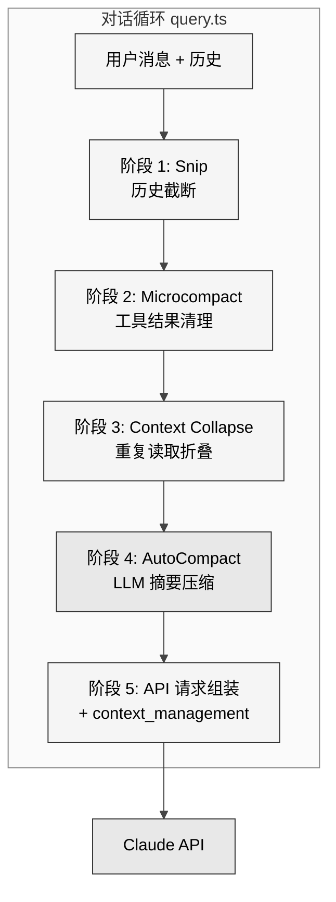
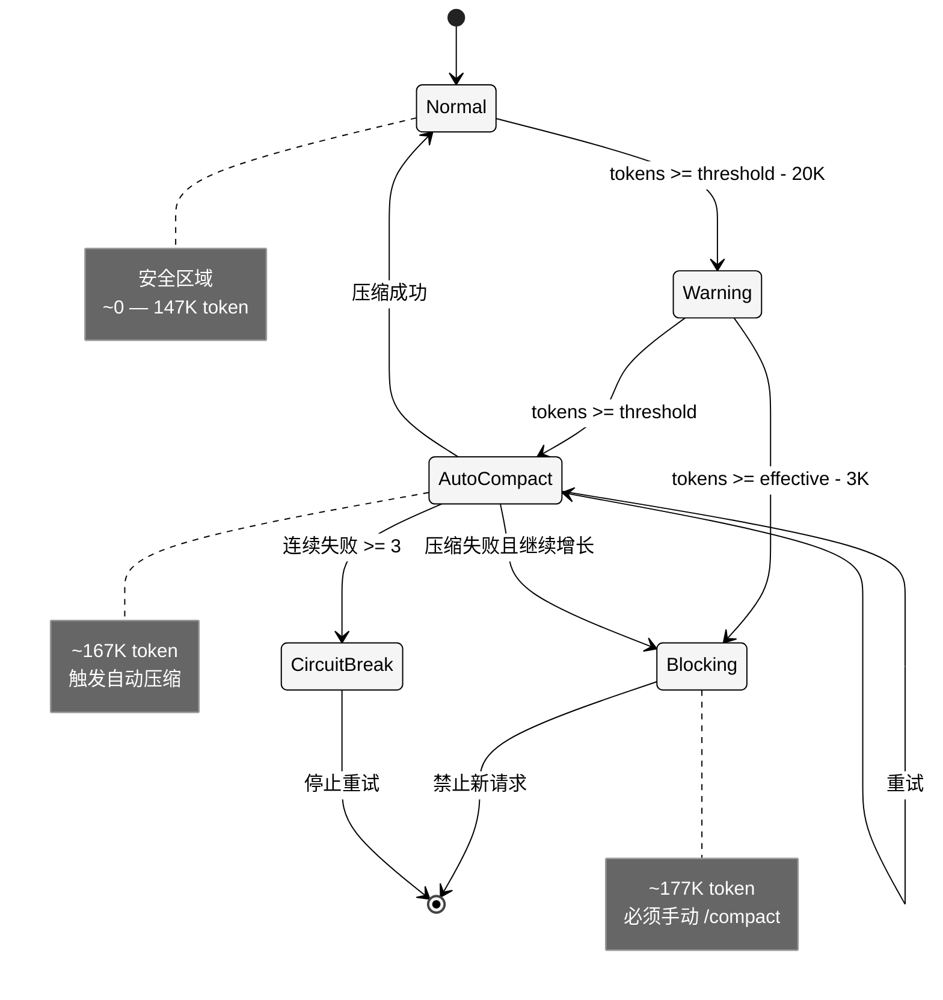
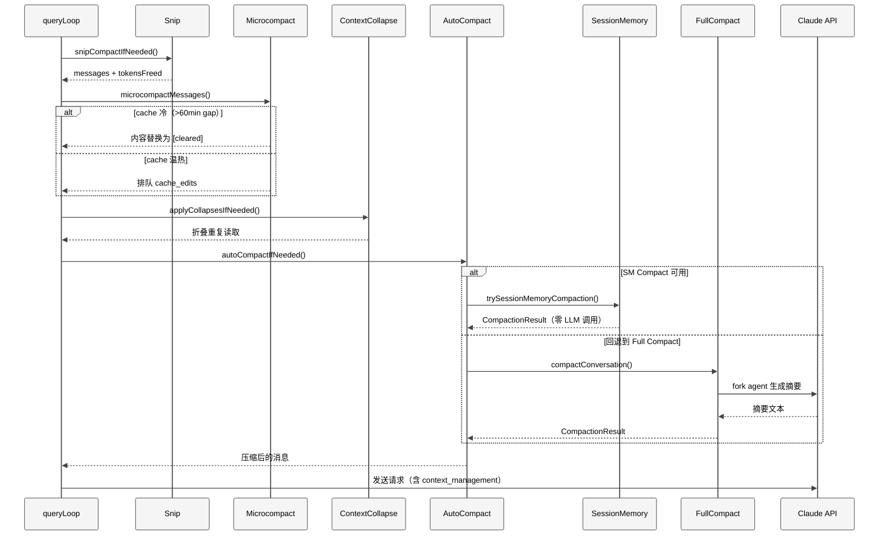
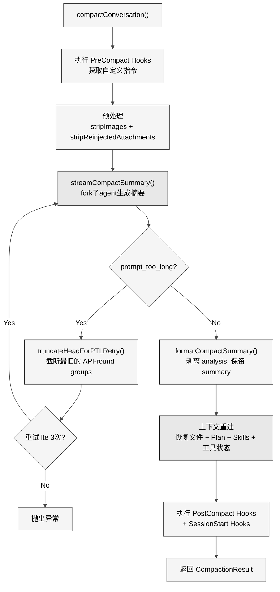

# 第 6 章 上下文管理

> 核心提要：预算与压缩路径的设计

## 6.1 定位

Claude Code 的 context window 是一个固定大小的容器——典型值为 200K token。但真实编程会话可以持续数小时，产生上百次工具调用，每次调用的结果（文件内容、命令输出、搜索结果）都在填满这个容器。**如果不做任何上下文管理，context window 大约在 20-30 轮工具调用后就会耗尽。**

上下文管理子系统的根本使命是：**让有限的 context window 支撑无限长度的对话，同时最小化信息损失。**

在 Claude Code 整体架构中，上下文管理位于对话循环（第 5 章）和 API 调用层之间，是每次 API 请求发送前的最后一道处理环节。它的源码集中在 `src/services/compact/` 目录下，共 11 个 TypeScript 文件、3,960 行代码。

<div style="background: #ffffff; padding: 16px; border-radius: 8px; margin: 16px 0;">



</div>

**本章结构**：6.2 节剖析 token 预算计算与四级告警；6.3 节分析多级压缩策略的实现细节——从 Microcompact 到 Session Memory Compact 再到 Full Compact；6.4 节解析压缩后的上下文重建与 FileStateCache；6.5 节讨论防御性编程模式；6.6 节进行竞品对比；6.7 节回应社区争议并纠正误解；6.8 节总结核心启示。

---

## 6.2 架构设计：Token 预算与四级告警

### 6.2.1 三个核心预算函数

上下文管理的数学基础建立在三个函数之上，它们定义了整个系统的运行边界。

**函数 1：`getEffectiveContextWindowSize()`** — 实际可用的输入空间

```typescript
// src/services/compact/autoCompact.ts:30-48
const MAX_OUTPUT_TOKENS_FOR_SUMMARY = 20_000

export function getEffectiveContextWindowSize(model: string): number {
  const reservedTokensForSummary = Math.min(
    getMaxOutputTokensForModel(model),
    MAX_OUTPUT_TOKENS_FOR_SUMMARY,
  )
  let contextWindow = getContextWindowForModel(model, getSdkBetas())

  const autoCompactWindow = process.env.CLAUDE_CODE_AUTO_COMPACT_WINDOW
  if (autoCompactWindow) {
    const parsed = parseInt(autoCompactWindow, 10)
    if (!isNaN(parsed) && parsed > 0) {
      contextWindow = Math.min(contextWindow, parsed)
    }
  }

  return contextWindow - reservedTokensForSummary
}
```

`MAX_OUTPUT_TOKENS_FOR_SUMMARY = 20_000` 的取值来源于生产统计：compact 摘要输出的 p99.99 为 17,387 token。20K 是带安全边际的上界。以 200K 模型为例：`effectiveContextWindow = 200,000 - 20,000 = 180,000`。

**函数 2：`getAutoCompactThreshold()`** — 自动压缩的触发线

```typescript
// src/services/compact/autoCompact.ts:62,72-90
export const AUTOCOMPACT_BUFFER_TOKENS = 13_000

export function getAutoCompactThreshold(model: string): number {
  const effectiveContextWindow = getEffectiveContextWindowSize(model)
  const autocompactThreshold = effectiveContextWindow - AUTOCOMPACT_BUFFER_TOKENS
  // 支持 CLAUDE_AUTOCOMPACT_PCT_OVERRIDE 环境变量覆盖（用于测试）
  return autocompactThreshold
}
```

13K 的缓冲区确保在检测到需要 compact 后，仍有空间完成当前 turn 的工具调用和模型响应。以 200K 为例：`threshold = 180,000 - 13,000 = 167,000`。

**函数 3：`calculateTokenWarningState()`** — 四级告警判定

```typescript
// src/services/compact/autoCompact.ts:63-65,93-145
export const WARNING_THRESHOLD_BUFFER_TOKENS = 20_000
export const ERROR_THRESHOLD_BUFFER_TOKENS = 20_000
export const MANUAL_COMPACT_BUFFER_TOKENS = 3_000
```

### 6.2.2 四级预警状态机

四个阈值常量构成一个渐进式的压力响应体系：

<div style="background: #ffffff; padding: 16px; border-radius: 8px; margin: 16px 0;">



</div>

以 200K context window 为例的四级阈值（auto-compact 启用时）：

| 级别 | 计算公式 | Token 值 | 系统响应 |
|------|---------|----------|---------|
| **Warning/Error** | threshold - 20K | ~147K | UI 显示红色警告 |
| **AutoCompact** | effective - 13K | ~167K | 触发自动压缩 |
| **Blocking** | effective - 3K | ~177K | 禁止新查询，强制 `/compact` |

一个值得注意的源码细节：Warning 和 Error 阈值当前**完全相同**（都用 20K 缓冲），意味着两者总是同时触发（`autoCompact.ts:113-114`）。分开定义两个常量是为未来独立调整留下扩展空间——例如可以让 Warning 在更早触发时显示黄色提示，Error 在更晚时显示红色。当前 UI 中（`TokenWarning.tsx`），因为两者同时触发，用户只会看到红色。

> **Agent 开发者启示**：资源预警不应是单一阈值的开关。设计多级渐进式响应——从轻量警告到自动干预再到强制阻断——让系统在每个压力等级都有合理的行动空间。

---

## 6.3 实现深度剖析：多级压缩策略

Claude Code 的上下文管理不是单一算法，而是**五种策略按优先级依次尝试**的流水线。在对话循环 `query.ts` 的每一轮迭代中，它们按固定顺序执行：

```typescript
// src/query.ts — queryLoop 每轮迭代（简化）
// 阶段 1: Snip — 截断远古历史
snipResult = snipModule.snipCompactIfNeeded(messagesForQuery)

// 阶段 2: Microcompact — 清理旧工具结果
microcompactResult = await deps.microcompact(messagesForQuery, ...)

// 阶段 3: Context Collapse — 折叠重复读取
contextCollapse.applyCollapsesIfNeeded(messagesForQuery, ...)

// 阶段 4: AutoCompact — LLM 摘要压缩
autoCompactResult = await deps.autocompact(messagesForQuery, ...)

// 阶段 5: API 请求组装 — 附带 context_management 参数
contextManagement = getAPIContextManagement({...})
```

<div style="background: #ffffff; padding: 16px; border-radius: 8px; margin: 16px 0;">



</div>

### 6.3.1 Microcompact — 零 LLM 成本的工具结果清理

Microcompact 是最轻量的压缩策略：不调用模型，直接清理旧的工具调用结果。它的核心假设是——工具输出在返回后的几轮中对模型决策至关重要，但随着对话推进，其信息价值递减。

**可清理的工具集**（`microCompact.ts:41-50`）：

```typescript
const COMPACTABLE_TOOLS = new Set<string>([
  FILE_READ_TOOL_NAME,
  ...SHELL_TOOL_NAMES,
  GREP_TOOL_NAME,
  GLOB_TOOL_NAME,
  WEB_SEARCH_TOOL_NAME,
  WEB_FETCH_TOOL_NAME,
  FILE_EDIT_TOOL_NAME,
  FILE_WRITE_TOOL_NAME,
])
```

有意排除的工具：**AgentTool 和 MCP 工具的结果不在清理范围内**。子 Agent 的输出是高度浓缩的摘要，且不可重现——清理后信息永久丢失。这是一个精确的设计权衡：牺牲可重现内容（文件随时可重新读取），保护不可重现内容。

**Microcompact 内部有两条互斥路径**，由 `microcompactMessages()`（`microCompact.ts:253-293`）按优先级选择：

**路径 A：Time-based Microcompact（cache 冷）**

当用户离开超过 60 分钟后回来，服务端 prompt cache 已过期。此时清理工具结果不会破坏缓存——反而能缩小 prompt 体积，降低即将发生的 cache 重建成本。

```typescript
// microCompact.ts:446-530（简化）
function maybeTimeBasedMicrocompact(messages, querySource) {
  const trigger = evaluateTimeBasedTrigger(messages, querySource)
  if (!trigger) return null

  const compactableIds = collectCompactableToolIds(messages)
  const keepRecent = Math.max(1, config.keepRecent)  // 至少保留 1 个
  const keepSet = new Set(compactableIds.slice(-keepRecent))
  const clearSet = new Set(compactableIds.filter(id => !keepSet.has(id)))

  // 构造新对象替换内容——不是原地修改
  const result = messages.map(message => {
    // ... 找到 clearSet 中的 tool_result，替换为占位文本
    return { ...block, content: '[Old tool result content cleared]' }
  })
}
```

源码中有一个微妙但关键的细节（`microCompact.ts:458-460`）：

```typescript
// Floor at 1: slice(-0) returns the full array (paradoxically keeps
// everything), and clearing ALL results leaves the model with zero working
// context. Neither degenerate is sensible — always keep at least the last.
const keepRecent = Math.max(1, config.keepRecent)
```

`slice(-0)` 在 JavaScript 中返回整个数组——这是一个容易写出的 bug。`Math.max(1, ...)` 是对此的防御性修正。

**路径 B：Cached Microcompact（cache 温热）**

当 prompt cache 仍然有效时，修改消息内容会改变 prompt 前缀，导致 cache 失效（cache hit $0.003 vs miss $0.60，200 倍成本差距）。Cached Microcompact 通过 Anthropic API 的 `cache_edits` 机制在服务端删除工具结果，本地消息完全不变：

```typescript
// microCompact.ts:305-399（简化）
async function cachedMicrocompactPath(messages, querySource) {
  const toolsToDelete = mod.getToolResultsToDelete(state)
  if (toolsToDelete.length > 0) {
    const cacheEdits = mod.createCacheEditsBlock(state, toolsToDelete)
    pendingCacheEdits = cacheEdits
    // 本地消息不变——cache_edits 在 API 层注入
    return { messages, compactionInfo: { pendingCacheEdits: {...} } }
  }
}
```

这是整个压缩系统中最精巧的设计之一：**同一个目标（清理旧工具结果）根据缓存温度选择不同实现路径**。cache 冷时做内容替换（反正要重建缓存），cache 热时用 API 原生的 cache_edits（零缓存开销）。

### 6.3.2 API Context Management — 声明式的服务端压缩

独立于 Microcompact，还有一套**声明式的 API 层上下文管理**。它不修改消息，而是在请求参数中声明清理策略，由服务端执行：

```typescript
// src/services/compact/apiMicrocompact.ts:64-153（简化）
export function getAPIContextManagement(options?) {
  const strategies: ContextEditStrategy[] = []

  // 策略 1：清理旧的 thinking 块
  if (hasThinking && !isRedactThinkingActive) {
    strategies.push({
      type: 'clear_thinking_20251015',
      keep: clearAllThinking ? { type: 'thinking_turns', value: 1 } : 'all',
    })
  }

  // 策略 2：清理旧的工具结果（ant-only 实验）
  if (useClearToolResults) {
    strategies.push({
      type: 'clear_tool_uses_20250919',
      trigger: { type: 'input_tokens', value: 180_000 },
      clear_at_least: { type: 'input_tokens', value: 140_000 },
      clear_tool_inputs: TOOLS_CLEARABLE_RESULTS,
    })
  }

  return { edits: strategies }
}
```

关键参数：`DEFAULT_MAX_INPUT_TOKENS = 180,000`（触发阈值）和 `DEFAULT_TARGET_INPUT_TOKENS = 40,000`（清理后保留目标）。在 `claude.ts:1718-1722`，该配置作为 `context_management` 字段传入 API：

```typescript
// src/services/api/claude.ts:1718-1722
...(contextManagement &&
  useBetas &&
  betasParams.includes(CONTEXT_MANAGEMENT_BETA_HEADER) && {
    context_management: contextManagement,
  }),
```

**与本地 Microcompact 的关系**：两者并行存在，互不排斥。客户端做一轮粗清理，服务端再做一轮精细清理。`apiMicrocompact.ts` 还区分了两类工具：`TOOLS_CLEARABLE_RESULTS`（只读工具，只清结果）和 `TOOLS_CLEARABLE_USES`（写入工具如 FileEdit/FileWrite/NotebookEdit，清理整个调用记录）。

### 6.3.3 Session Memory Compact — 零 LLM 调用的创新路径

这是 compact 体系中较有代表性的设计：**不用模型生成总结，直接使用 Session Memory 系统已有的结构化记忆作为压缩后的摘要**。

```typescript
// src/services/compact/sessionMemoryCompact.ts:514-630（简化）
export async function trySessionMemoryCompaction(messages, agentId?, autoCompactThreshold?) {
  if (!shouldUseSessionMemoryCompaction()) return null

  await waitForSessionMemoryExtraction()  // 等待后台提取完成

  const sessionMemory = await getSessionMemoryContent()
  if (!sessionMemory || await isSessionMemoryEmpty(sessionMemory)) return null

  const startIndex = calculateMessagesToKeepIndex(messages, lastSummarizedIndex)
  const messagesToKeep = messages.slice(startIndex)
    .filter(m => !isCompactBoundaryMessage(m))

  return createCompactionResultFromSessionMemory(
    messages, sessionMemory, messagesToKeep, ...
  )
}
```

**消息保留策略**有三个可配置的阈值（`sessionMemoryCompact.ts:57-61`）：

```typescript
export const DEFAULT_SM_COMPACT_CONFIG = {
  minTokens: 10_000,        // 保留消息的最小 token 数
  minTextBlockMessages: 5,   // 保留的最少文本消息数
  maxTokens: 40_000,        // 保留消息的最大 token 数（硬上限）
}
```

`calculateMessagesToKeepIndex()`（`sessionMemoryCompact.ts:324-397`）从 `lastSummarizedMessageId` 向后扫描，取 `minTokens` 和 `minTextBlockMessages` 的较大者，但不超过 `maxTokens`。一个容易忽略的不变量维护在 `adjustIndexToPreserveAPIInvariants()`（`sessionMemoryCompact.ts:232-314`）中：它向前扩展起始索引，确保不会拆分 `tool_use`/`tool_result` 配对，也不会拆分共享同一 `message.id` 的 thinking 块。函数头部的 70 行注释（L196-L231）详细描述了三个 bug 场景——这是防御性编程的典范。

> **Agent 开发者启示**：如果你有独立的后台信息提取系统（如 Session Memory），优先考虑将其产出复用于多个下游场景。Session Memory 的原始设计是为跨会话持久化，但被复用于压缩摘要，一举消除了 compact 的 LLM 调用成本和延迟。

### 6.3.4 Full Compact — 用模型自己总结对话

当 Session Memory Compact 不可用时，系统回退到最重量级的策略：**fork 一个子 agent，让模型生成对话摘要**。

<div style="background: #ffffff; padding: 16px; border-radius: 8px; margin: 16px 0;">



</div>

**Full Compact 的关键实现细节**（`compact.ts:387-763`，全文 1,705 行——整个 compact 目录最大的文件）：

**细节 1：Cache Sharing Fork**

`streamCompactSummary()`（`compact.ts:1136-1396`）优先使用 `runForkedAgent()` 执行摘要生成。Fork agent 复用主对话的 prompt cache 前缀——系统提示、工具定义、历史消息前缀相同，因此能获得 cache hit。源码注释明确警告（`compact.ts:1181-1186`）：

```typescript
// DO NOT set maxOutputTokens here. The fork piggybacks on the main thread's
// prompt cache by sending identical cache-key params (system, tools, model,
// messages prefix, thinking config). Setting maxOutputTokens would clamp
// budget_tokens via Math.min(budget, maxOutputTokens-1) in claude.ts,
// creating a thinking config mismatch that invalidates the cache.
```

**细节 2：Chain-of-Thought 然后剥离**

Compact prompt（`prompt.ts:61-143`）要求模型按 9 个维度进行结构化总结，但有一个技巧：模型被要求先在 `<analysis>` 标签中整理思路，再在 `<summary>` 中给出正式总结。`formatCompactSummary()`（`prompt.ts:311-335`）事后剥离 `<analysis>`：

```typescript
// src/services/compact/prompt.ts:311-335
export function formatCompactSummary(summary: string): string {
  let formattedSummary = summary
  // 剥离 analysis——它是提升总结质量的草稿，正式总结完成后无信息价值
  formattedSummary = formattedSummary.replace(/<analysis>[\s\S]*?<\/analysis>/, '')
  const summaryMatch = formattedSummary.match(/<summary>([\s\S]*?)<\/summary>/)
  if (summaryMatch) {
    formattedSummary = formattedSummary.replace(
      /<summary>[\s\S]*?<\/summary>/,
      `Summary:\n${summaryMatch[1]?.trim()}`,
    )
  }
  return formattedSummary.trim()
}
```

这实质上是一种**CoT-then-strip 技巧**：让模型深入思考以提升输出质量，但不让思考过程占用后续 context 空间。

**细节 3：NO_TOOLS_PREAMBLE 的由来**

```typescript
// src/services/compact/prompt.ts:12-26
// Aggressive no-tools preamble. The cache-sharing fork path inherits the
// parent's full tool set (required for cache-key match), and on Sonnet 4.6+
// adaptive-thinking models the model sometimes attempts a tool call despite
// the weaker trailer instruction. With maxTurns: 1, a denied tool call means
// no text output → falls through to the streaming fallback (2.79% on 4.6 vs
// 0.01% on 4.5).
const NO_TOOLS_PREAMBLE = `CRITICAL: Respond with TEXT ONLY. Do NOT call any tools.
- Tool calls will be REJECTED and will waste your only turn — you will fail the task.
`
```

这段注释透露了模型版本迁移中的工程痛点：Sonnet 4.6 比 4.5 更倾向于调用工具，将 compact 失败率从 0.01% 提升到 2.79%（近 280 倍）。解决方案是在 prompt 首尾都加上强力的 no-tools 指令。

**细节 4：prompt_too_long 自救**

当对话太长以至于 compact 请求本身都超限时（CC-1180），`truncateHeadForPTLRetry()`（`compact.ts:243-291`）截断最旧的 API-round groups 并重试（最多 3 次）。`groupMessagesByApiRound()`（`grouping.ts:22-63`）将消息按 `message.id` 变化分组，每组对应一个 API 往返。注释说明了为什么不用更粗粒度的"用户轮次"分组——SDK/CCR/eval 场景下整个工作负载可能只有一个用户轮次。

---

## 6.4 上下文重建与 FileStateCache

压缩不是故事的结束——压缩后需要重建模型继续工作所需的上下文。

### 6.4.1 Post-Compact 文件恢复

`createPostCompactFileAttachments()`（`compact.ts:1415-1464`）从 compact 前的文件状态快照中挑选最近读取的文件重新注入：

```typescript
// src/services/compact/compact.ts:122-130
export const POST_COMPACT_MAX_FILES_TO_RESTORE = 5
export const POST_COMPACT_TOKEN_BUDGET = 50_000
export const POST_COMPACT_MAX_TOKENS_PER_FILE = 5_000
export const POST_COMPACT_MAX_TOKENS_PER_SKILL = 5_000
export const POST_COMPACT_SKILLS_TOKEN_BUDGET = 25_000
```

恢复流程有严格的 token 预算控制：

- 最多恢复 **5 个文件**，每个最多 **5K token**
- 总文件恢复预算 **50K token**
- Skill 内容恢复：每个最多 **5K token**，总预算 **25K token**

恢复选择策略：按 `timestamp` 降序排列，跳过已在 `messagesToKeep` 中作为 Read 工具结果存在的文件（避免重复注入）。源码注释（`compact.ts:1398-1413`）明确说明了 dedup 逻辑：stub（`FILE_UNCHANGED_STUB`）指向的原始 Read 可能已被压缩掉，此时应该恢复真实内容。

除文件外，compact 后还恢复以下上下文：

- **Plan 附件**（`createPlanAttachmentIfNeeded`，L1470）——如果在 plan mode 中
- **Plan Mode 指令**（`createPlanModeAttachmentIfNeeded`，L1542）——确保 compact 后不退出 plan mode
- **已调用 Skill 的内容**（`createSkillAttachmentIfNeeded`，L1494）——按最近使用排序，截断到 5K/skill
- **Deferred Tools / Agent Listing / MCP 指令的增量附件**（L567-585）——重新公告所有工具/Agent/MCP 状态
- **Async Agent 状态**（`createAsyncAgentAttachmentsIfNeeded`，L1568）——后台运行的 Agent 不能因 compact 丢失

### 6.4.2 FileStateCache — 文件认知状态追踪

`FileStateCache`（`utils/fileStateCache.ts`）不是简单的读取缓存，而是追踪**模型对文件的认知状态**，在 compact 后充当文件恢复的索引。

```typescript
// src/utils/fileStateCache.ts:4-15
export type FileState = {
  content: string
  timestamp: number
  offset: number | undefined
  limit: number | undefined
  // True when this entry was populated by auto-injection (e.g. CLAUDE.md) and
  // the injected content did not match disk (stripped HTML comments, stripped
  // frontmatter, truncated MEMORY.md). The model has only seen a partial view;
  // Edit/Write must require an explicit Read first.
  isPartialView?: boolean
}
```

`isPartialView` 标记是此缓存最关键的语义字段。当文件是被截断注入的（如 CLAUDE.md 去掉 HTML 注释），这个标记告诉 FileEdit/FileWrite 工具：**不能基于缓存内容进行编辑，必须先做完整 Read**。而 `content` 字段存储的是原始磁盘内容（用于变更检测的 diff），不是模型实际看到的内容——这两者可能不同。

```typescript
// src/utils/fileStateCache.ts:30-39
export class FileStateCache {
  private cache: LRUCache<string, FileState>

  constructor(maxEntries: number, maxSizeBytes: number) {
    this.cache = new LRUCache<string, FileState>({
      max: maxEntries,            // 默认 100 条
      maxSize: maxSizeBytes,      // 默认 25MB
      sizeCalculation: value => Math.max(1, Buffer.byteLength(value.content)),
    })
  }
}
```

**双重限制设计**：`max` 限制条目数，`maxSize` 限制总大小。`sizeCalculation` 中的 `Math.max(1, ...)` 确保空内容也占据至少 1 字节的配额（LRU 要求正数 size）。

**路径标准化**：所有 key 在存取时经过 `normalize()`（`fileStateCache.ts:42`），确保 `/foo/../bar` 和 `/bar` 命中同一条缓存。

**Agent 隔离**：`cloneFileStateCache()`（`fileStateCache.ts:122-126`）在创建子 Agent 时被调用，通过 `dump()`/`load()` 实现深拷贝。子 Agent 的文件读取不污染父级的缓存状态。

---

## 6.5 防御性编程模式

### 6.5.1 熔断器（Circuit Breaker）

```typescript
// src/services/compact/autoCompact.ts:67-70
// BQ 2026-03-10: 1,279 sessions had 50+ consecutive failures (up to 3,272)
// in a single session, wasting ~250K API calls/day globally.
const MAX_CONSECUTIVE_AUTOCOMPACT_FAILURES = 3
```

这条注释是整个 compact 系统中最有教育意义的一段文字。没有熔断器时，context 不可恢复地超限的会话会在每个 turn 都发起注定失败的 compact 请求——1,279 个这样的会话每天浪费约 **25 万次 API 调用**。修复方案只有三行代码：

```typescript
// autoCompact.ts:260-264
if (tracking?.consecutiveFailures !== undefined &&
    tracking.consecutiveFailures >= MAX_CONSECUTIVE_AUTOCOMPACT_FAILURES) {
  return { wasCompacted: false }
}
```

成功时归零，失败时递增。简洁到令人惊叹——但缺少这三行代码的代价是每天 25 万次浪费的 API 调用。

### 6.5.2 递归保护

`shouldAutoCompact()`（`autoCompact.ts:160-238`）有五个递归保护：

```typescript
// 1. compact 自身不能触发新的 compact
if (querySource === 'session_memory' || querySource === 'compact') return false

// 2. Context Collapse 的 ctx-agent 不能触发 compact
if (querySource === 'marble_origami') return false

// 3. Reactive-only 模式下禁止主动 compact
if (getFeatureValue_CACHED_MAY_BE_STALE('tengu_cobalt_raccoon', false)) return false

// 4. Context Collapse 启用时禁止 autocompact
//    因为 collapse 在 90% commit / 95% blocking 运行，
//    autocompact 在 ~93% 触发，两者会竞争
if (isContextCollapseEnabled()) return false
```

注释（`autoCompact.ts:201-213`）解释了为什么 autocompact 和 context collapse 互斥：collapse 在 90% 时开始提交、95% 时阻塞，而 autocompact 在 ~93%（effective - 13K）触发，恰好落在 collapse 的 commit-start 和 blocking 之间，会抢先执行并"核爆"collapse 正在精心保存的细粒度上下文。

### 6.5.3 Post-Compact 清理的 Agent 隔离

```typescript
// src/services/compact/postCompactCleanup.ts:31-61（简化）
export function runPostCompactCleanup(querySource?: QuerySource): void {
  const isMainThreadCompact =
    querySource === undefined ||
    querySource.startsWith('repl_main_thread') ||
    querySource === 'sdk'

  resetMicrocompactState()
  if (isMainThreadCompact) {
    getUserContext.cache.clear?.()    // 只有主线程才清理
    resetGetMemoryFilesCache('compact')
  }
  clearSystemPromptSections()
  clearClassifierApprovals()
  clearSpeculativeChecks()
  clearBetaTracingState()
  clearSessionMessagesCache()
}
```

`isMainThreadCompact` 判断至关重要——子 Agent 和主线程运行在同一进程中共享模块级状态。如果子 Agent compact 时清理了 `getUserContext` 缓存或 context-collapse 状态，会损坏主线程。

### 6.5.4 compactWarningStore — 抑制虚假告警

`compactWarningState.ts` 只有 18 行代码，但解决了一个真实的 UX 问题：compact 成功后，系统缺少准确的 token 计数（要等下次 API 响应才能获得），如果继续基于旧数据显示告警，用户会看到"刚 compact 完就又报警"的困惑体验：

```typescript
// src/services/compact/compactWarningState.ts:1-18
export const compactWarningStore = createStore<boolean>(false)
export function suppressCompactWarning(): void {
  compactWarningStore.setState(() => true)
}
export function clearCompactWarningSuppression(): void {
  compactWarningStore.setState(() => false)
}
```

抑制在 compact 成功时设置，在下次 microcompact 开始时清除（`microCompact.ts:259`）。

### 6.5.5 WebSocket Keep-Alive

`streamCompactSummary()` 中有一个容易被忽略的 `setInterval`（`compact.ts:1167-1176`）：

```typescript
// Compaction API calls can take 5-10+ seconds, during which no other
// messages flow through the transport — without keep-alives, the server
// may close the WebSocket for inactivity.
const activityInterval = isSessionActivityTrackingActive()
  ? setInterval(() => {
      sendSessionActivitySignal()
      statusSetter?.('compacting')
    }, 30_000, context.setSDKStatus)
  : undefined
```

远程会话（bridge 模式）下，compact 的 5-10 秒 API 调用期间没有数据流经 WebSocket，服务端可能判定连接空闲而断开。这个 30 秒心跳是生产环境中发现的问题修复。

---

## 6.6 比较

| 维度 | Claude Code | Aider | Cursor | Codex CLI |
|------|-------------|-------|--------|-----------|
| **压缩层级** | 五阶段流水线 | 简单截断（`/clear`） | 未公开 | 未公开 |
| **Microcompact** | 双路径（time-based + cache_edits） | 无 | 无已知 | 无已知 |
| **LLM 摘要** | 9 维结构化 + CoT-then-strip | 无 | 可能有 | 可能有 |
| **零 LLM Compact** | Session Memory Compact | 无 | 无 | 无 |
| **熔断器** | 3 次连续失败 | 无 | 未公开 | 未公开 |
| **Cache 感知** | 根据 cache 温度选择路径 | 无 Prompt Cache | 未公开 | 未公开 |
| **上下文重建** | 文件恢复 + Skill 恢复 + 工具重公告 | 无 | 未公开 | 未公开 |
| **API 层压缩** | context_management 声明式策略 | 无 | 未公开 | 无 |
| **窗口大小** | 200K 默认，1M 可选 | 取决于模型 | 取决于模型 | 取决于模型 |

**Aider** 的上下文管理相对简单——依赖 `/clear` 命令手动清除历史，没有自动压缩或分级策略。其设计哲学是"短会话、频繁提交"，每次聚焦一个小任务，避免 context 膨胀。

**Cursor** 的上下文管理未公开源码，但从用户体验推断，它采用了某种自动截断策略。相比 Claude Code 的五阶段流水线，缺乏公开的 prompt cache 感知压缩和零 LLM compact 路径。

**Claude Code 的核心优势**在三个方面：

1. **Cache 感知的双路径 Microcompact** — 这是工程上关键的设计。根据缓存温度动态选择压缩路径，在保持 prompt cache 命中率的同时释放空间。其他产品要么不做 microcompact，要么不感知 cache 状态。

2. **Session Memory Compact** — 将后台信息提取系统的产出复用于压缩，实现零 LLM 调用的 compact。这在延迟和成本上都有显著优势。

3. **Post-Compact 上下文重建** — 不只是压缩，还有精确的重建：恢复最近文件、Plan 状态、Skill 内容、工具定义。其他产品在"压缩后恢复"这一环节几乎空白。

**Claude Code 的局限**：

1. **压缩质量不可验证** — Full Compact 依赖 LLM 生成摘要，但没有自动化的质量验证机制。如果摘要遗漏了关键信息，后续对话会偏离正轨。
2. **图片信息永久丢失** — `stripImagesFromMessages()`（`compact.ts:145-200`）在 compact 前将图片替换为 `[image]` 标记。对于依赖截图/架构图的会话，这是不可逆的信息损失。
3. **Feature Flag 复杂性** — 五种策略中有三种（Snip、Context Collapse、Reactive Compact）受 feature flag 门控（`HISTORY_SNIP`、`CONTEXT_COLLAPSE`、`REACTIVE_COMPACT`），增加了理解和调试的难度。

---

## 6.7 辨误

### 争议回应：压缩算法是否过度复杂？

社区中有声音认为"五阶段流水线"过度复杂——一个简单的"保留最近 N 条消息"策略或许就够了。

**源码实证裁决：复杂性是有充分工程理由的，不是过度设计。**

每一层压缩策略存在是因为其他层无法覆盖其场景：

1. **Snip**（feature-gated）处理的是极端场景：消息历史 fundamentally 过长，需要物理截断。Microcompact 和 AutoCompact 不做消息截断。

2. **Time-based Microcompact** 利用了一个特殊的物理现象：用户离开 60 分钟后 server cache 已过期。这是一个**免费的**优化窗口——不清理也要重建 cache，清理后还能缩小重建体积。

3. **Cached Microcompact** 解决的问题恰好是 Time-based MC 无法解决的：cache 温热时如何释放空间。两者互斥但互补。

4. **Session Memory Compact** 解决的是 Full Compact 的成本问题：一次 Full Compact 需要一次完整的 API 调用（输入几乎等于 compact 前的全部 token），而 SM Compact 是**零成本**的。

5. **Full Compact** 是最后的通用后备——当其他策略都不适用时。

**简单截断方案的问题**在于它无法区分"可以安全丢弃的工具输出"和"模型决策链中关键的用户反馈"。Claude Code 的方案之所以分层，正是因为不同类型的上下文有不同的信息密度和可重现性。丢弃一个文件读取结果是安全的（可以重新读取），丢弃用户的修正指令是灾难性的（不可重现）。

但也要承认，这种复杂性确实增加了维护负担——三种策略受 feature flag 门控，`shouldAutoCompact()` 有五个递归保护条件，Microcompact 的两条路径加上 API 层的独立策略意味着工具结果可能被三套机制同时操作。对于规模较小的 Agent 项目，两层策略（Microcompact + Full Compact）已足够。五层是 Claude Code 在**日活百万级开发者、年收入 25 亿美元**的生产规模下演化出的方案。

### 误解纠正："压缩是 AI 黑魔法"

社区中常见的误解是将 Claude Code 的上下文压缩神秘化——好像它是某种不可解释的 AI 行为。

**源码事实：压缩有明确的四阶段流水线和精确的触发条件，完全是确定性的工程系统。**

1. **触发条件完全确定**：`tokenCountWithEstimation(messages) >= autoCompactThreshold`——纯粹的数值比较，没有任何概率或 AI 判断。

2. **压缩路径选择确定**：Time-based MC → Cached MC → Session Memory Compact → Full Compact，按固定优先级短路选择。

3. **工具结果清理确定**：`COMPACTABLE_TOOLS` 是硬编码的 Set，什么能清理、什么不能清理在编译时就确定了。

4. **文件恢复确定**：按 timestamp 降序、不超过 5 个、不超过 50K token——全是确定性的排序和截断。

唯一涉及 AI 的环节是 Full Compact 的摘要生成。但即使这一步，输入（compact prompt 模板 + 对话历史）和输出格式（9 个维度的结构化总结）都是完全可审计的。`<analysis>` 标签的 CoT-then-strip 更说明了这是一个被精心工程化的 LLM 调用，不是黑盒。

> **Agent 开发者启示**：上下文压缩不需要神秘化。它本质上是资源管理——和操作系统的内存管理、数据库的缓冲池管理是同类问题。关键是建立清晰的分层策略和确定性的触发条件。

### 社区维度混淆纠正

社区中 Troy Hua 的"7 层记忆"框架将 Token 剪裁、MicroCompact、Context 折叠、AutoCompact、AutoDream、CLAUDE.md、Prompt Cache 全部归为"记忆层"。这种归纳有洞察力但**混淆了三个不同维度**：

- **运行时压缩**（Snip/Microcompact/AutoCompact）— 优化当前窗口空间
- **持久存储**（CLAUDE.md/Session Memory/AutoDream）— 跨会话的信息持久化
- **缓存策略**（Prompt Cache/cache_edits）— 成本优化

源码中这三者是完全不同的模块，运行时压缩在 `services/compact/`，持久存储在 `utils/claudemd.ts` + `services/SessionMemory/`，缓存策略在 `services/api/claude.ts`。它们的触发条件、生命周期和优化目标互不相同，不应混为一谈。

---

## 6.8 展望

### 6.8.1 源码中的已知问题

唯一的 TODO 标记出现在 `compact.ts:1690`：

```typescript
// TODO: Refactor to use isMemoryFilePath() from claudemd.ts for consistency
// and to also match child directory memory files (.claude/rules/*.md, etc.)
```

当前的 CLAUDE.md 排除逻辑通过遍历 `MEMORY_TYPE_VALUES` 手动构建路径集合，没有覆盖子目录规则文件。由此可见如果用户的 `.claude/rules/my-rule.md` 在 compact 前被读取，它可能被作为普通文件恢复——浪费 token，因为 CLAUDE.md 和规则文件会在下次 API 调用时通过 System Prompt 重新注入。

### 6.8.2 可能的未来瓶颈

**1. Warning/Error 阈值合并**

`WARNING_THRESHOLD_BUFFER_TOKENS` 和 `ERROR_THRESHOLD_BUFFER_TOKENS` 当前值相同（都是 20K），导致 UI 上只有一级警告。如果未来想实现"黄色→红色"的渐进提示，需要拆分这两个值——但拆分后需要重新校准所有相关的阈值关系。

**2. Session Memory Compact 的覆盖率**

SM Compact 的前提是 Session Memory 已有内容且非空。在短会话或 Session Memory 提取落后于对话速度的场景下，它会回退到 Full Compact。随着模型推理速度提升（对话速度加快），SM 提取可能更频繁地"跟不上"，降低 SM Compact 的命中率。

**3. 图片信息永久丢失**

`stripImagesFromMessages()` 将图片替换为 `[image]` 标记，丢失了所有视觉信息。在 CCD（Cloud Code Desktop）等场景下用户频繁附带截图，compact 后模型完全丧失对早期截图的认知。可能的改进方向：为图片生成文本描述后再丢弃原始数据。

### 6.8.3 改进建议

如果重新设计下一版，我会考虑以下方向：

1. **摘要质量验证循环**：在 Full Compact 后，用一个轻量级检查确认摘要包含了关键任务信息（如当前正在编辑的文件名、待完成的测试命令）。当前系统完全信任 LLM 的摘要输出。

2. **分级图片处理**：对于 compact 范围内的图片，先调用视觉模型生成文本描述（如"这是一个数据库 ER 图，包含 User、Order、Product 三个表"），然后用描述替换图片。成本远低于保留原始图片，但信息保留率远高于 `[image]`。

3. **统一的压缩策略编排器**：当前五种策略分散在 `query.ts` 的不同位置，通过 `if (feature(...))` 门控。可以抽象为一个 `CompressionOrchestrator`，接收 `Message[]` 和当前 token 用量，按配置好的策略链依次尝试。这会简化测试和策略的添加/移除。

---

## 6.9 小结

**核心 Takeaway**：

1. **多级压力梯度响应是上下文管理的架构本质**。从零成本的 Time-based MC（利用 cache 过期窗口）到 cache_edits API（保护 cache 命中率）到 Session Memory Compact（零 LLM 调用）再到 Full Compact（用模型生成摘要），每一层解决的是上一层无法覆盖的场景。简单截断方案无法区分可重现与不可重现的上下文。

2. **三行代码止血 25 万次 API 调用/天**。熔断器模式（`MAX_CONSECUTIVE_AUTOCOMPACT_FAILURES = 3`）是最具 ROI 的防御性编程：实现成本几乎为零，但在生产规模下节省了巨大的资源浪费。任何有重试逻辑的系统都应该有熔断器。

3. **Chain-of-Thought 然后剥离是 LLM 工程的实用技巧**。让模型在 `<analysis>` 中深入思考以提升 `<summary>` 质量，然后在后处理中丢弃 analysis。这在任何需要高质量 LLM 摘要的场景中都可复用——既提升了输出质量，又不浪费后续 context 空间。

4. **Cache 温度感知是 prompt cache 时代的新设计维度**。Microcompact 的双路径设计（cache 冷时内容替换，cache 热时 cache_edits）表明：在 prompt cache 普及后，任何修改 prompt 内容的操作都必须考虑缓存经济学。cache hit 和 miss 的 200 倍成本差距足以改变架构决策。

5. **压缩后的上下文重建与压缩本身同等重要**。Claude Code 在 compact 后恢复最近文件、Plan 状态、Skill 内容、工具定义——这些"重建"操作的代码量（`compact.ts` L517-L599）和"压缩"操作的代码量相当。只做压缩不做重建，等于让模型在 compact 后"失忆"。
