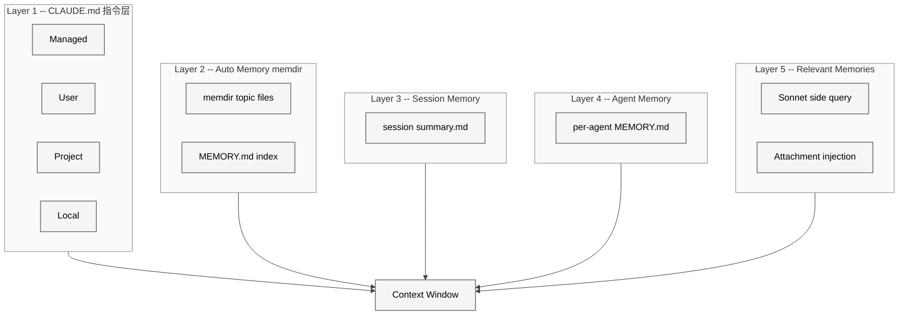
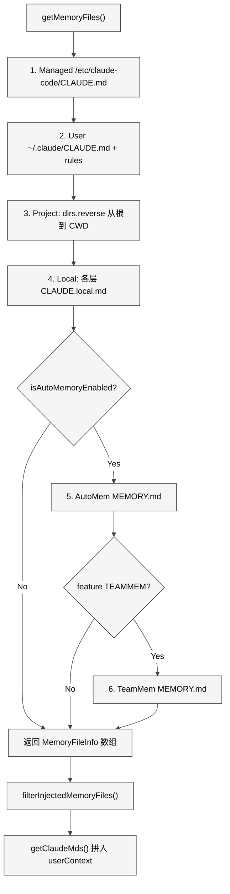
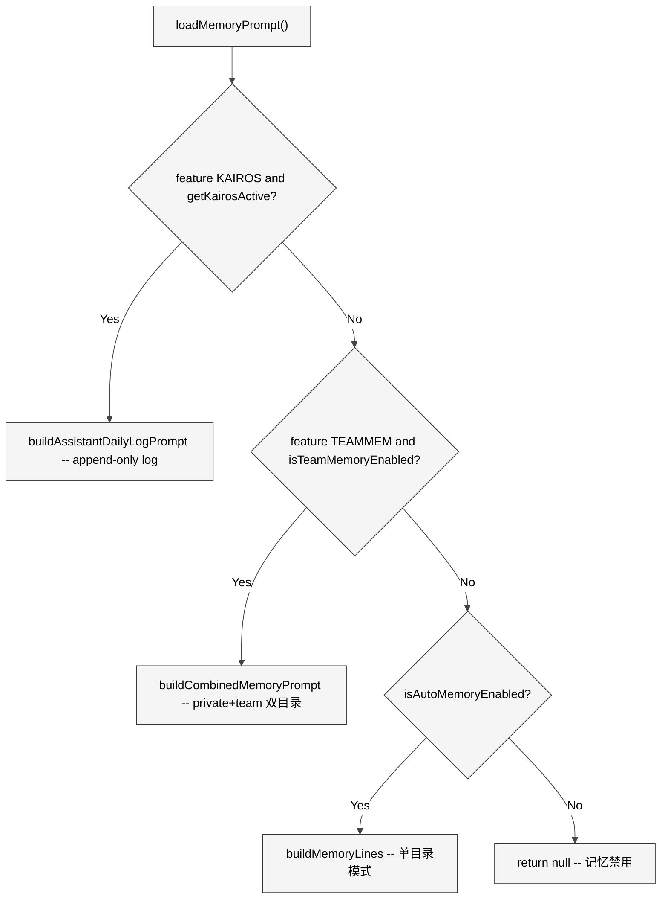
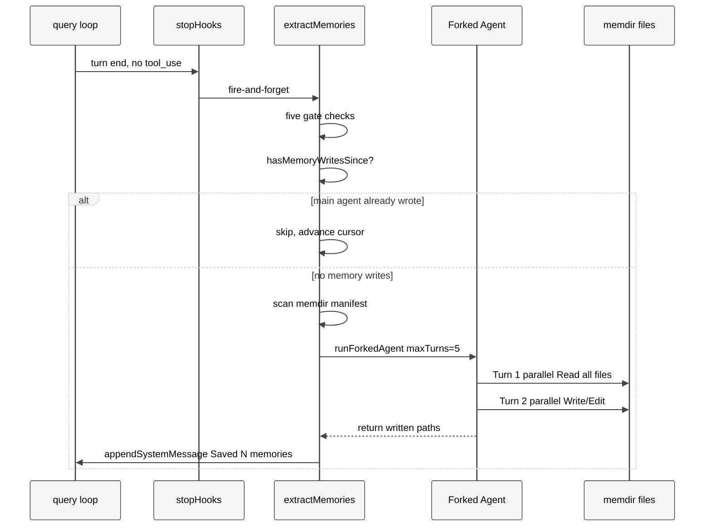
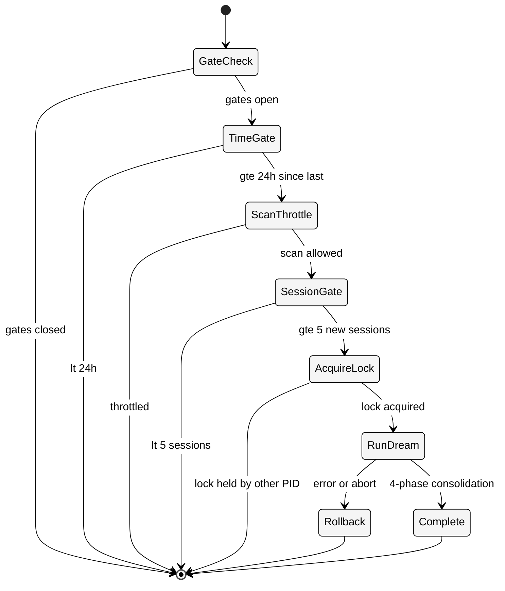
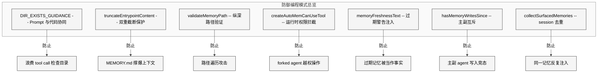

# 第 7 章 Memory

> 核心提要：记忆写入与召回路径

---

## 23.1 定位

LLM 天生是无状态的——每次对话从零开始。用户上次告诉 Claude"我喜欢用 bun 而不是 npm"，下次对话它就忘了。用户在项目里纠正了三次"不要 mock 数据库"，第四次它可能又 mock 了。没有记忆的 Agent 永远是新手。

Claude Code 用一套**五层记忆架构**解决了这个问题。在 restored-src v2.1.88 的 513,216 行 TypeScript 中，记忆系统横跨 `src/memdir/`（8 文件）、`src/utils/claudemd.ts`（1,480 行）、`src/services/extractMemories/`（2 文件，771 行）、`src/services/SessionMemory/`（3 文件，821 行）、`src/services/autoDream/`（4 文件，465 行）以及 `src/tools/AgentTool/agentMemory.ts`（178 行），共计约 4,200 行核心代码。

这些代码解决了三个根本问题：**跨会话知识持久化**（用户偏好不应每次重复）、**上下文空间经济性**（不能把所有记忆塞进有限的上下文窗口）、**多粒度记忆管理**（从个人偏好到团队共识到项目动态，生命周期各异）。

<div style="background: #ffffff; padding: 16px; border-radius: 8px; margin: 16px 0;">



</div>

| 层级 | 名称 | 生命周期 | 存储位置 | 核心职责 |
|------|------|---------|---------|---------|
| 1 | CLAUDE.md 指令文件 | 永久 | 项目/用户/企业目录 | 静态指令与规则 |
| 2 | Auto Memory（memdir） | 跨会话 | `~/.claude/projects/<slug>/memory/` | AI 自动提取的持久化知识 |
| 3 | Session Memory | 单次会话 | `~/.claude/projects/<slug>/<session-id>/session-memory/summary.md`（近似路径，具体以 `getSessionMemoryPath()` 为准） | 当前会话的结构化笔记 |
| 4 | Agent Memory | 跨会话 | 三种 scope 目录 | 特定 Agent 的专属记忆 |
| 5 | Relevant Memories | 每 turn 按需注入 | 内存（Attachment） | 按需召回的相关记忆 |

**与传统方案的本质区别**：传统 IDE 配置系统是静态的、层级扁平的 key-value 存储。Claude Code 的记忆系统是**动态的、AI 可读写的、按需检索的文件系统**。AI 既是记忆的消费者也是生产者——它不仅读取记忆，还能从对话中自动提取新记忆、在空闲时整理记忆。这是从"配置管理"到"知识管理"的质变。

---

## 23.2 架构

### 23.2.1 CLAUDE.md — 四层信任级别的指令发现

CLAUDE.md 是最基础的"记忆"形式。它不是 AI 自主写入的，而是**人类预写的指令文件**，但其发现与加载机制体现了精妙的设计哲学。

`claudemd.ts` 开头的注释定义了四种类型及加载顺序（`src/utils/claudemd.ts` L1-L9）：

```typescript
// 1. Managed memory (eg. /etc/claude-code/CLAUDE.md) - Global instructions for all users
// 2. User memory (~/.claude/CLAUDE.md) - Private global instructions for all projects
// 3. Project memory (CLAUDE.md, .claude/CLAUDE.md, .claude/rules/*.md) - Instructions checked into the codebase
// 4. Local memory (CLAUDE.local.md) - Private project-specific instructions
//
// Files are loaded in reverse order of priority, i.e. the latest files are highest priority
```

**加载顺序与优先级相反**。Managed 最先加载但优先级最低，Local 最后加载但优先级最高。这利用了 LLM 的 **recency bias**——对消息中靠后内容的关注度更高——让高优先级内容排在后面。

`getMemoryFiles()` 的核心遍历逻辑（`src/utils/claudemd.ts` L850-L934）从当前工作目录逐级向上遍历到文件系统根目录：

```typescript
const dirs: string[] = []
let currentDir = originalCwd
while (currentDir !== parse(currentDir).root) {
  dirs.push(currentDir)
  currentDir = dirname(currentDir)
}
// Process from root downward to CWD
for (const dir of dirs.reverse()) {
  // CLAUDE.md, .claude/CLAUDE.md, .claude/rules/*.md, CLAUDE.local.md
}
```

注意 `dirs.reverse()`——先 push 的是 CWD，reverse 后从根目录向 CWD 方向遍历，确保离 CWD 越近的文件在 prompt 中排得越靠后，优先级越高。

<div style="background: #ffffff; padding: 16px; border-radius: 8px; margin: 16px 0;">



</div>

**关键设计决策：CLAUDE.md 不在 System Prompt 中**。它被包装在 `<system-reminder>` 标签内作为**第一条 user message** 注入（`src/context.ts` L155-L177）。这保证了 System Prompt 的缓存稳定性——CLAUDE.md 内容变化不会导致 System Prompt cache miss（cache hit 成本 \$0.003 vs miss \$0.60），同时让模型以"用户指令"的权重来处理这些内容。

### 23.2.2 Auto Memory（memdir）— AI 的持久化知识库

Auto Memory 是记忆系统的核心，让 AI 能够**自主学习和记住**跨会话的知识。源码集中在 `src/memdir/` 目录的 8 个文件中。

**路径解析的三级优先级**（`src/memdir/paths.ts` L223-L235）：

```typescript
export const getAutoMemPath = memoize(
  (): string => {
    const override = getAutoMemPathOverride() ?? getAutoMemPathSetting()
    if (override) return override
    const projectsDir = join(getMemoryBaseDir(), 'projects')
    return (
      join(projectsDir, sanitizePath(getAutoMemBase()), AUTO_MEM_DIRNAME) + sep
    ).normalize('NFC')
  },
  () => getProjectRoot(),
)
```

1. 环境变量 `CLAUDE_COWORK_MEMORY_PATH_OVERRIDE`（Cowork/SDK 场景）
2. Settings 覆盖 `autoMemoryDirectory`——但**排除 projectSettings**（`src/memdir/paths.ts` L170-L186），防止恶意仓库通过 `.claude/settings.json` 将记忆目录指向 `~/.ssh`
3. 默认路径：基于 Git 根目录的 sanitized 路径

`getAutoMemBase()` 使用 `findCanonicalGitRoot()` 确保所有 Git worktree **共享同一个记忆目录**（`paths.ts` L203-L205），避免同一仓库的不同 worktree 各自维护一份记忆。

**四类记忆的闭合分类法**（`src/memdir/memoryTypes.ts` L14-L19）：

```typescript
export const MEMORY_TYPES = ['user', 'feedback', 'project', 'reference'] as const
```

| 类型 | 含义 | 写入时机 | 不应保存的内容 |
|------|------|---------|--------------|
| `user` | 用户角色、偏好、知识水平 | 了解到用户信息时 | 负面评价 |
| `feedback` | 行为纠正 + 正向确认 | 用户纠正或确认做法时 | 仅保存纠正而忽视确认 |
| `project` | 项目背景、决策、截止日期 | 了解到不可推导的项目信息时 | 可从 git log 推导的内容 |
| `reference` | 外部系统指针 | 了解到外部资源位置时 | 系统的具体内容（只存指针） |

`WHAT_NOT_TO_SAVE_SECTION`（`memoryTypes.ts` L183-L195）明确排除了 5 类内容，其中最值得注意的一条（L192-L194）：

> These exclusions apply even when the user explicitly asks you to save. If they ask you to save a PR list or activity summary, ask what was *surprising* or *non-obvious* about it — that is the part worth keeping.

即使用户**明确要求**保存低价值内容，AI 也应反问"什么是令人惊讶或不显而易见的"——这是通过 Prompt 约束 AI 行为的典型案例。

**实践启示**：在设计 Agent 记忆系统时，"What NOT to save"与"What to save"同样重要。可从当前状态派生的信息（代码模式、Git 历史）不应存储——它们会随时间漂移，反而比不存储更危险。

### 23.2.3 System Prompt 中的记忆指令三路分发

`loadMemoryPrompt()` 是记忆指令注入 System Prompt 的入口（`src/memdir/memdir.ts` L419-L507），根据启用状态做三路分发：

<div style="background: #ffffff; padding: 16px; border-radius: 8px; margin: 16px 0;">



</div>

三种模式对应三种使用场景：KAIROS（长期运行的 Assistant 模式，追加式日志）、TeamMem（团队共享记忆，private + team 双目录）、标准模式（单目录 auto memory）。

---

## 23.3 实现

### 23.3.1 Background Extract Memories — 从对话中自动提取

提取系统是记忆的"入口"——每次对话结束时，后台自动分析 transcript 并萃取值得持久化的知识。源码位于 `src/services/extractMemories/extractMemories.ts`（616 行）。

**五重门控**（`extractMemories.ts` L527-L564）按成本从低到高排列：

```typescript
async function executeExtractMemoriesImpl(context, appendSystemMessage) {
  if (context.toolUseContext.agentId) return         // 1. 只有主 agent
  if (!getFeatureValue('tengu_passport_quail')) return // 2. GrowthBook 远程开关
  if (!isAutoMemoryEnabled()) return                   // 3. 用户偏好
  if (getIsRemoteMode()) return                        // 4. 非 remote 模式
  if (inProgress) { pendingContext = {...}; return }    // 5. 不并发
  await runExtraction(...)
}
```

**闭包状态管理**。`initExtractMemories()` 使用闭包而非模块级变量来管理三个关键状态（`extractMemories.ts` L296-L325）：

- `lastMemoryMessageUuid`：游标，标记上次处理到哪条消息
- `inProgress`：互斥锁
- `pendingContext`：重叠时暂存最新上下文

这种模式让测试可以在 `beforeEach` 中调用 `initExtractMemories()` 获得全新的闭包，无需手动重置模块级状态。

**主 Agent 与提取 Agent 的互斥**（`extractMemories.ts` L348-L360）：

```typescript
if (hasMemoryWritesSince(messages, lastMemoryMessageUuid)) {
  logForDebugging('[extractMemories] skipping — conversation already wrote to memory files')
  const lastMessage = messages.at(-1)
  if (lastMessage?.uuid) { lastMemoryMessageUuid = lastMessage.uuid }
  return
}
```

`hasMemoryWritesSince()` 扫描助手消息中的 `tool_use` 块，检查是否有 Edit/Write 操作目标在 `isAutoMemPath()` 范围内。这避免了主 Agent 和后台 Agent 同时写同一个文件的竞态。

<div style="background: #ffffff; padding: 16px; border-radius: 8px; margin: 16px 0;">



</div>

**Forked Agent 的权限沙箱**（`extractMemories.ts` L171-L222）是安全设计的典范：

```typescript
export function createAutoMemCanUseTool(memoryDir: string): CanUseToolFn {
  return async (tool, input) => {
    if (tool.name === REPL_TOOL_NAME) return allow  // REPL 内部会再次检查
    if (tool.name === FILE_READ_TOOL_NAME || ...) return allow  // 读类放行
    if (tool.name === BASH_TOOL_NAME) {
      if (tool.isReadOnly(parsed.data)) return allow  // 只读 Bash
      return deny
    }
    if ((tool.name === FILE_EDIT_TOOL_NAME || FILE_WRITE_TOOL_NAME) 
        && isAutoMemPath(filePath)) return allow  // 仅限 memdir 写入
    return deny  // 其他一律拒绝
  }
}
```

关键的工程权衡隐藏在源码注释中（L177-L179）：

> Giving the fork a different tool list would break prompt cache sharing (tools are part of the cache key)

工具列表是 prompt cache key 的一部分。如果 forked agent 用不同的工具列表，就无法复用主 agent 的 prompt cache。所以设计是——**工具列表不变（保持 cache 命中），用运行时 canUseTool 拦截不该用的工具**。这是用安全层换经济性的工程权衡。

**重叠保护的合并模式**（`extractMemories.ts` L557-L564）：

```typescript
if (inProgress) {
  pendingContext = { context, appendSystemMessage }
  return
}
```

不排队所有请求，只保留最新的一个。因为最新的上下文包含了最多的消息，分析它就够了。当前提取完成后，从 `pendingContext` 启动"尾随提取"（trailing run），只处理游标之后的增量消息。

### 23.3.2 Relevant Memories — 按需召回的智能注入

Relevant Memories 解决的是"何时以及如何召回记忆"——不是把所有记忆都塞进上下文，而是**只注入与当前查询相关的记忆**。

**双阶段召回：Scan 然后 Select**

阶段一——扫描（`src/memdir/memoryScan.ts` L35-L77）：

```typescript
export async function scanMemoryFiles(memoryDir, signal): Promise<MemoryHeader[]> {
  const entries = await readdir(memoryDir, { recursive: true })
  const mdFiles = entries.filter(f => f.endsWith('.md') && basename(f) !== 'MEMORY.md')
  const headerResults = await Promise.allSettled(
    mdFiles.map(async (relativePath) => {
      const { content, mtimeMs } = await readFileInRange(filePath, 0, FRONTMATTER_MAX_LINES)
      const { frontmatter } = parseFrontmatter(content, filePath)
      return { filename, filePath, mtimeMs, description, type }
    })
  )
  return results.sort((a, b) => b.mtimeMs - a.mtimeMs).slice(0, MAX_MEMORY_FILES)
}
```

**单遍扫描设计**：`readFileInRange` 内部 stat 获取 `mtimeMs`，所以读取和排序不需要两轮 syscall。对于常见情况（N <= 200），**减半了系统调用次数**。

阶段二——选择（`src/memdir/findRelevantMemories.ts` L77-L141）：

```typescript
async function selectRelevantMemories(query, memories, signal, recentTools) {
  const manifest = formatMemoryManifest(memories)
  const result = await sideQuery({
    model: getDefaultSonnetModel(),
    system: SELECT_MEMORIES_SYSTEM_PROMPT,
    messages: [{ role: 'user', content: `Query: ${query}\n\nAvailable memories:\n${manifest}${toolsSection}` }],
    max_tokens: 256,
    output_format: { type: 'json_schema', schema: { ... } },
  })
  return parsed.selected_memories.filter(f => validFilenames.has(f))
}
```

用 Sonnet 做一个**轻量 side query**，传入用户查询和记忆清单（文件名 + 描述），让模型选择最多 5 个相关文件。

**异步预取 + Attachment 注入**。相关记忆召回是异步的（`src/utils/attachments.ts` L2361-L2424）：

```typescript
export function startRelevantMemoryPrefetch(messages, toolUseContext): MemoryPrefetch | undefined {
  if (!isAutoMemoryEnabled() || !getFeatureValue('tengu_moth_copse', false)) {
    return undefined
  }
  // ...extract last user message, check session byte limit...
  const promise = getRelevantMemoryAttachments(input, ...)
  // Returns a Disposable handle with settlement tracking
}
```

在 `query.ts` L301 中通过 `using` 关键字绑定到 turn 生命周期：

```typescript
using pendingMemoryPrefetch = startRelevantMemoryPrefetch(state.messages, state.toolUseContext)
```

**Session 级去重与总量控制**（`attachments.ts` L2251-L2266）：

```typescript
export function collectSurfacedMemories(messages) {
  const paths = new Set<string>()
  let totalBytes = 0
  for (const m of messages) {
    if (m.type === 'attachment' && m.attachment.type === 'relevant_memories') {
      for (const mem of m.attachment.memories) {
        paths.add(mem.path)
        totalBytes += mem.content.length
      }
    }
  }
  return { paths, totalBytes }
}
```

扫描 messages 而非追踪 `toolUseContext` 上的状态。当 compact 发生时，旧的 attachment 消息被删除，`surfacedPaths` 自然重置——那些记忆可以被**合理地重新注入**到压缩后的上下文中。

**新鲜度标记的缓存友好设计**（`src/memdir/memoryAge.ts` L15-L20）：

```typescript
export function memoryAge(mtimeMs: number): string {
  const d = memoryAgeDays(mtimeMs)
  if (d === 0) return 'today'
  if (d === 1) return 'yesterday'
  return `${d} days ago`
}
```

如果在每次 API 调用时重新计算，"saved 3 days ago" 可能变成 "saved 4 days ago"——不同的字节会导致 **Prompt Cache 失效**。新鲜度文本在注入时预计算，保证跨 turn 的字节稳定性。

### 23.3.3 Session Memory — 会话级结构化笔记

Session Memory 用 10 段 Markdown 模板维护当前会话的结构化笔记（`src/services/SessionMemory/prompts.ts` L11-L41），核心价值在 auto-compact 时体现——可以直接复用后台已提取好的笔记作为压缩摘要，免去额外的 API 调用。

**双阈值触发**（`sessionMemory.ts` L134-L181）：

```typescript
export function shouldExtractMemory(messages): boolean {
  const currentTokenCount = tokenCountWithEstimation(messages)
  if (!isSessionMemoryInitialized()) {
    if (!hasMetInitializationThreshold(currentTokenCount)) return false  // 10,000 tokens
    markSessionMemoryInitialized()
  }
  const hasMetTokenThreshold = hasMetUpdateThreshold(currentTokenCount)     // +5,000 tokens
  const hasMetToolCallThreshold = toolCallsSinceLastUpdate >= getToolCallsBetweenUpdates() // 3 calls
  return (hasMetTokenThreshold && hasMetToolCallThreshold) ||
         (hasMetTokenThreshold && !hasToolCallsInLastTurn)
}
```

默认阈值（`sessionMemoryUtils.ts` L32-L36）：初始化 10,000 tokens，更新间隔 5,000 tokens + 3 次 tool calls。**Token 阈值是必要条件**——即使 tool call 阈值满足，token 没增长就不触发，防止过度提取。

每个 section 有 2,000 token 的软限制，总文件有 12,000 token 的硬限制（`prompts.ts` L8-L9），`truncateSessionMemoryForCompact()` 在注入 compact 消息时做硬截断。

### 23.3.4 Agent Memory — 自定义 Agent 的专属记忆空间

`src/tools/AgentTool/agentMemory.ts`（178 行）为自定义 Agent 提供三种作用域的独立记忆空间：

```typescript
export type AgentMemoryScope = 'user' | 'project' | 'local'
```

| Scope | 路径 | 版本控制 | 适用场景 |
|-------|------|---------|---------|
| `user` | `~/.claude/agent-memory/<type>/` | 否 | 跨项目通用知识 |
| `project` | `<cwd>/.claude/agent-memory/<type>/` | 是 | 项目特定，团队共享 |
| `local` | `<cwd>/.claude/agent-memory-local/<type>/` | 否 | 本地特定 |

**Fire-and-forget 目录创建**（`agentMemory.ts` L160-L165）的注释解释了安全性：

```typescript
// Fire-and-forget: this runs at agent-spawn time inside a sync
// getSystemPrompt() callback. The spawned agent won't try to Write
// until after a full API round-trip, by which time mkdir will have completed.
void ensureMemoryDirExists(memoryDir)
```

Agent spawn 到实际写文件中间至少经过一个完整 API 往返（几百毫秒到几秒），而 `mkdir` 只需微秒级别。

### 23.3.5 Auto Dream — 记忆的后台巩固

Auto Dream 类似人类睡眠时的记忆巩固（`src/services/autoDream/autoDream.ts`，324 行）。

**三重门控**（按成本从低到高，`autoDream.ts` L95-L99）：

```typescript
function isGateOpen(): boolean {
  if (getKairosActive()) return false
  if (getIsRemoteMode()) return false
  if (!isAutoMemoryEnabled()) return false
  return isAutoDreamEnabled()
}
```

通过后还有时间门控（默认 >= 24 小时）、会话门控（默认 >= 5 个新会话）、PID 锁文件（防并发）。

<div style="background: #ffffff; padding: 16px; border-radius: 8px; margin: 16px 0;">



</div>

巩固 Prompt（`src/services/autoDream/consolidationPrompt.ts`）定义了四个阶段：Orient（读 MEMORY.md 和目录结构）、Gather（读日志、检查漂移记忆、grep 转录）、Consolidate（合并重复、更新过时、删除无用）、Prune（保持 MEMORY.md 在 200 行 / 25KB 内）。

**锁文件设计的巧妙之处**（`consolidationLock.ts` L29-L36）：锁文件的 **mtime 就是 lastConsolidatedAt**——不需要额外的状态文件，一个 stat 调用同时完成"读取上次巩固时间"和"检查锁状态"。

```typescript
export async function readLastConsolidatedAt(): Promise<number> {
  try {
    const s = await stat(lockPath())
    return s.mtimeMs
  } catch { return 0 }
}
```

失败时通过 `rollbackConsolidationLock()` 将 mtime 回退到 acquire 前的值，让时间门控在下次会话重新通过。

### 23.3.6 Team Memory — 组织级知识共享

Team Memory（`src/services/teamMemorySync/`，5 个文件）是 Auto Memory 的团队扩展，通过 API 与服务端同步。路径是 Auto Memory 目录下的 `team/` 子目录（`teamMemPaths.ts` L84-L86）：

```typescript
export function getTeamMemPath(): string {
  return (join(getAutoMemPath(), 'team') + sep).normalize('NFC')
}
```

同步语义（`teamMemorySync/index.ts` L14-L19）：Pull 以服务端为准（server wins per-key），Push 按 hash 差量上传，文件删除不同步到服务端。

团队记忆有严格的安全保护——`teamMemPaths.ts` 实现了完整的路径遍历防护（null byte 检测、URL 编码遍历检测、Unicode 标准化攻击防护、symlink 逃逸检测），以及密钥扫描（`secretScanner.ts`）防止 API key 等敏感信息被推送到服务端。

---

## 23.4 细节

### 23.4.1 DIR_EXISTS_GUIDANCE — Prompt 与代码的协同

一个看似微小但极具启发性的设计（`memdir.ts` L111-L117）：

```typescript
// Shipped because Claude was burning turns on `ls`/`mkdir -p` before writing.
export const DIR_EXISTS_GUIDANCE =
  'This directory already exists — write to it directly with the Write tool (do not run mkdir or check for its existence).'
```

AI 在写入记忆前会浪费 1-2 个 tool call 去检查目录是否存在。解决方案不是改代码逻辑，而是在 Prompt 中告诉 AI"目录已经存在，直接写"。同时，`ensureMemoryDirExists()` 保证这个承诺成立。

**实践启示**：这是典型的 **Prompt 与代码协同**设计模式——代码保证前置条件，Prompt 告知 AI 前置条件已满足。对 Agent 开发者来说，与其试图通过 Prompt 让 AI "学会"检查前置条件，不如在 Harness 层保证前置条件，然后在 Prompt 中告知 AI。

### 23.4.2 MEMORY.md 索引的双重截断保护

`truncateEntrypointContent()`（`memdir.ts` L57-L103）实现双重保护：

```typescript
export function truncateEntrypointContent(raw: string): EntrypointTruncation {
  // 先按行截断（200 行）
  let truncated = wasLineTruncated
    ? contentLines.slice(0, MAX_ENTRYPOINT_LINES).join('\n') : trimmed
  // 再按字节截断（25KB），在最后一个换行符处切割
  if (truncated.length > MAX_ENTRYPOINT_BYTES) {
    const cutAt = truncated.lastIndexOf('\n', MAX_ENTRYPOINT_BYTES)
    truncated = truncated.slice(0, cutAt > 0 ? cutAt : MAX_ENTRYPOINT_BYTES)
  }
  // ...append WARNING
}
```

源码注释（L36-L38）解释了为什么需要字节限制："~125 chars/line at 200 lines. At p97 today; catches long-line indexes that slip past the line cap (p100 observed: 197KB under 200 lines)."——有用户的 MEMORY.md 在 200 行内写到了 197KB。

### 23.4.3 安全路径验证的纵深防御

`validateMemoryPath()`（`paths.ts` L109-L150）展现了安全路径验证的完整防御清单：

- 相对路径（`../foo`）→ reject
- 根或近根路径（length < 3）→ reject
- Windows 驱动器根（`C:\`）→ reject
- UNC 网络路径（`\\server\share`）→ reject
- Null byte（`\0`）→ reject
- 波浪号展开保护：`~/`、`~/.`、`~/..` 不展开

团队记忆路径验证更加严格（`teamMemPaths.ts` L22-L64）：除了上述检查，还包括 URL 编码遍历检测（`%2e%2e%2f`）、Unicode 标准化攻击防护（fullwidth 字符 `．．／`）、反斜杠注入检测。

### 23.4.4 tengu_moth_copse — MEMORY.md 注入的双路径

`filterInjectedMemoryFiles()`（`claudemd.ts` L1142-L1151）控制着记忆注入的关键分岔：

```typescript
export function filterInjectedMemoryFiles(files: MemoryFileInfo[]): MemoryFileInfo[] {
  const skipMemoryIndex = getFeatureValue_CACHED_MAY_BE_STALE('tengu_moth_copse', false)
  if (!skipMemoryIndex) return files
  return files.filter(f => f.type !== 'AutoMem' && f.type !== 'TeamMem')
}
```

当 `tengu_moth_copse` 开启时，MEMORY.md 索引不再注入 user context——记忆完全依赖 `startRelevantMemoryPrefetch()` 的异步预取。这是从"始终注入全量索引"到"按需注入相关记忆"的演进。

### 23.4.5 记忆新鲜度与过期警告

`memoryFreshnessText()`（`memoryAge.ts` L33-L42）为超过 1 天的记忆附加过期警告：

```typescript
export function memoryFreshnessText(mtimeMs: number): string {
  const d = memoryAgeDays(mtimeMs)
  if (d <= 1) return ''
  return `This memory is ${d} days old. Memories are point-in-time observations, not live state — ` +
    `claims about code behavior or file:line citations may be outdated. Verify against current code before asserting as fact.`
}
```

源码注释（L29-L32）揭示了设计动机："Motivated by user reports of stale code-state memories (file:line citations to code that has since changed) being asserted as fact"——记忆中的代码引用反而让过时信息看起来更权威。

<div style="background: #ffffff; padding: 16px; border-radius: 8px; margin: 16px 0;">



</div>

---

## 23.5 比较

### 23.5.1 横向对比矩阵

| 维度 | Claude Code | Cursor | Copilot | Aider | Cline |
|------|------------|--------|---------|-------|-------|
| **指令系统** | 4 层 CLAUDE.md 层级 | `.cursorrules` 单层 | `copilot-instructions.md` 单层 | `.aider.conf.yml` | `.clinerules` |
| **持久记忆** | memdir 4 类分类 + 索引 | 简单缓存 | 无 | 无 | 无持久记忆 |
| **自动提取** | forked agent 后台提取 | 无 | 无 | 无 | 无 |
| **检索方式** | Sonnet side query + grep | 未公开 | 未公开 | 无 | 无 |
| **团队共享** | TeamMem 服务端同步 | 无 | 无 | 无 | 无 |
| **记忆巩固** | Auto Dream 24h 触发 | 无 | 无 | 无 | 无 |
| **Agent 记忆** | 3 scope 独立记忆空间 | 无 | 无 | 无 | 无 |
| **条件规则** | frontmatter paths glob | 无 | 无 | 无 | 无 |

### 23.5.2 Claude Code 的独特优势

1. **记忆是一等公民**：完整的 CRUD 生命周期（创建、读取、更新、删除），AI 既是消费者也是生产者。竞品中的"规则文件"只是静态配置。

2. **分类学约束**：四类记忆的闭合分类法 + 明确的"不应保存"清单，是 Claude Code 记忆质量远超竞品的关键。这不是技术创新，是**产品设计**创新。

3. **按需召回**：Sonnet side query 实现了零额外基础设施的"语义检索"——不需要向量数据库，不需要 embedding 模型，用 LLM 自身做相关性判断。

4. **经济性设计**：forked agent 共享 prompt cache、`DIR_EXISTS_GUIDANCE` 省去验证 turn、预计算新鲜度保证缓存稳定性——每一处都在优化 token 成本。

### 23.5.3 已知局限

1. **无真正的语义检索**：`findRelevantMemories` 依赖 Sonnet side query，当记忆数量超过 200 个时的 manifest 本身就很大，选择器的准确性随记忆增长而下降。

2. **单机限制**：Auto Memory 存储在本地文件系统，Team Memory 是唯一的多机同步方案，但依赖 Anthropic API。

3. **巩固频率固定**：Auto Dream 的 24h + 5 session 门控不适应所有使用模式——高频使用者可能在 12 小时内产生大量记忆碎片。

---

## 23.6 辨误

### 23.6.1 争议裁决：4 层 vs 7 层 vs 3 层

**裁决：持久记忆是五层（含 Agent Memory），不是 7 层也不是 3 层。**

Troy Hua 的"7 层记忆"将三个不同维度混为一谈：持久记忆（CLAUDE.md + memdir + Session + Agent + Relevant）、运行时上下文管理（Snip/MicroCompact/ContextCollapse/AutoCompact）、跨会话巩固（AutoDream）。上下文压缩是**运行时优化**，不是"记忆层"。

Chen Zhang (DEV Community) 的"4 层"（Managed → User → Project → Local）只描述了 CLAUDE.md 的四种类型，没有覆盖 memdir/Session Memory/Agent Memory 等 AI 自主管理的记忆。

源码实证：`getMemoryFiles()` 实际加载 6 种 `MemoryType`（`src/utils/claudemd.ts` L229-L244）：`Managed`、`User`、`Project`、`Local`、`AutoMem`、`TeamMem`。加上独立的 Session Memory 和 Agent Memory，持久化记忆涉及**八种存储类型**。但从架构维度看，按时间跨度和管理方式可以清晰归为五层。

### 23.6.2 误解纠正：记忆用了 RAG/向量数据库

**源码事实：没有 RAG，没有向量数据库，没有 embedding。**

`findRelevantMemories` 的全部代码在 `src/memdir/findRelevantMemories.ts`（141 行）和 `memoryScan.ts`（95 行）中，完整流程是：

1. `readdir` 递归扫描 `.md` 文件
2. `readFileInRange` 读取每个文件的前 30 行 frontmatter
3. `formatMemoryManifest` 拼成文本清单
4. `sideQuery` 调用 Sonnet 做 JSON schema 结构化输出，返回最多 5 个文件名
5. 读取选中文件的完整内容，注入为 attachment

整个过程中没有 embedding、没有向量相似度计算、没有 RAG pipeline。检索用的是 **LLM 做判断** + **grep 做搜索**。

`buildSearchingPastContextSection()`（`memdir.ts` L375-L406）中明确指导 AI 用 grep 搜索记忆：

```typescript
const memSearch = embedded
  ? `grep -rn "<search term>" ${autoMemDir} --include="*.md"`
  : `${GREP_TOOL_NAME} with pattern="<search term>" path="${autoMemDir}" glob="*.md"`
```

### 23.6.3 争议裁决：grep vs embedding 检索

**裁决：grep 是当前阶段的正确选择。**

Anthropic 在 Context Engineering 文章中解释了这个设计哲学：grep/glob 即时检索 + CLAUDE.md 预加载的混合模型，优先保证**确定性和安全性**，而非语义检索的"智能感"。

源码层面的理由更加具体：

1. **无额外基础设施**：embedding 需要向量数据库或至少一个 embedding model 的 API 端点。Claude Code 是 CLI 工具，不应引入重型依赖。

2. **确定性可审计**：grep 的结果用户可以复现和验证，embedding 相似度的结果不透明。

3. **Sonnet 做补偿**：`findRelevantMemories` 的 Sonnet side query 在文件名 + 描述级别做了语义匹配，是"穷人版语义检索"，但成本远低于维护 embedding 索引。

4. **记忆规模有限**：MAX_MEMORY_FILES = 200。在这个规模下，全量 frontmatter 扫描 + Sonnet 选择的延迟和成本都可接受。

**但这不是终态**。当记忆数量突破数百到数千，纯 frontmatter 扫描会变成瓶颈。未来可能的演进是 frontmatter 索引 + lightweight embedding（例如基于 Claude Haiku 的快速 embedding）的混合方案。

### 23.6.4 误解纠正：7 层记忆

**源码事实：将运行时压缩（Snip/MicroCompact/ContextCollapse/AutoCompact）算作"记忆层"是概念混淆。**

上下文压缩的代码在 `src/services/compact/` 目录，与 `src/memdir/`、`src/services/SessionMemory/` 完全分离。压缩是**运行时优化**——它缩短当前对话，不产生跨会话持久化的知识。Session Memory 虽然在 compact 时被使用（作为压缩摘要的来源），但它本身的存储和维护是独立的子系统。

正确的理解是：记忆系统和上下文管理系统是**正交的两个维度**。记忆系统处理"跨会话的知识持久化"，上下文管理系统处理"单次会话中的 token 经济性"。两者在 compact 时交汇（Session Memory 提供压缩摘要），但不应混为一谈。

---

## 23.7 展望

### 23.7.1 源码中的 TODO 和 Feature Gates

源码中大量使用 GrowthBook feature gates 控制记忆功能的灰度发布：

| Feature Gate | 控制范围 | 含义 |
|-------------|---------|------|
| `tengu_passport_quail` | extractMemories | 后台提取总开关 |
| `tengu_moth_copse` | MEMORY.md 注入 | 切换到按需预取模式 |
| `tengu_bramble_lintel` | extractMemories | 提取频率节流 |
| `tengu_session_memory` | SessionMemory | session memory 总开关 |
| `tengu_herring_clock` | TeamMem | 团队记忆总开关 |
| `tengu_onyx_plover` | AutoDream | 自动巩固配置 |
| `tengu_coral_fern` | 过去上下文搜索 | 启用 grep 搜索记忆/转录 |

这些 gates 表明多个功能仍在灰度阶段，Anthropic 在通过 A/B 测试验证每个功能的价值。

### 23.7.2 潜在瓶颈

1. **MEMORY.md 索引模型**：当 `tengu_moth_copse` 关闭时，MEMORY.md 始终注入上下文，200 行 / 25KB 的限制意味着最多约 100 条记忆。随着使用时间增长，索引压力会越来越大。

2. **提取成本**：每次提取都要调用一次 Sonnet API（forked agent），即使没有值得提取的内容。`tengu_bramble_lintel` 的节流缓解但未根除这个问题。

3. **团队记忆冲突**：Push 是 delta upload + upsert，但没有冲突解决机制——两个用户同时修改同一个记忆文件，后推送的覆盖先推送的。

### 23.7.3 改进建议

如果设计下一版记忆系统：

1. **分层检索**：先用 lightweight embedding（例如 BM25 + Haiku）做粗排，再用 Sonnet 做精排，突破 200 个文件的扫描上限。

2. **记忆置信度**：为每条记忆添加置信度评分（基于确认次数、来源数量、时间衰减），在召回时优先返回高置信度记忆。

3. **增量巩固**：Auto Dream 从"定时全量扫描"改为"事件驱动增量合并"——每次提取后立即检查是否有可合并的记忆对，而非等 24 小时后全量巩固。

4. **结构化记忆图谱**：从扁平的文件列表演进为记忆图谱，记录记忆之间的关系（冲突、补充、上下级），让召回时能提供更完整的上下文。

---

## 23.8 小结

1. **五层架构解决了记忆的完整生命周期**：CLAUDE.md（人类编写的指令）→ Auto Memory（AI 自动提取的持久知识）→ Session Memory（会话级结构化笔记）→ Agent Memory（自定义 Agent 专属记忆）→ Relevant Memories（按需召回的相关记忆）。每层解决不同时间尺度和粒度的需求。

2. **grep 胜过 embedding 是当前阶段的正确选择**。在记忆规模有限（MAX 200 文件）的前提下，Sonnet side query + grep 的组合提供了零额外基础设施、确定性可审计、成本可控的"语义检索"。

3. **Prompt 与代码的协同设计**是 Claude Code 记忆系统最大的创新。`DIR_EXISTS_GUIDANCE`、预计算新鲜度、四类分类法 + "What NOT to save"——这些设计不是纯技术创新，而是对 AI 行为特性的深刻理解后做出的工程决策。

4. **安全是深入骨髓的**。从 `validateMemoryPath()` 的路径遍历防护，到 `createAutoMemCanUseTool()` 的权限沙箱，到 `teamMemPaths.ts` 的 symlink 逃逸检测——记忆系统的每个可写入路径都有纵深防御。

5. **经济性驱动了架构选择**。forked agent 共享 prompt cache（而非独立工具列表）、fire-and-forget 目录创建（而非 async/await 阻塞）、session 级记忆去重（compact 后自然重置而非手动跟踪）——每一处都在优化 token 成本和 API 调用次数。
