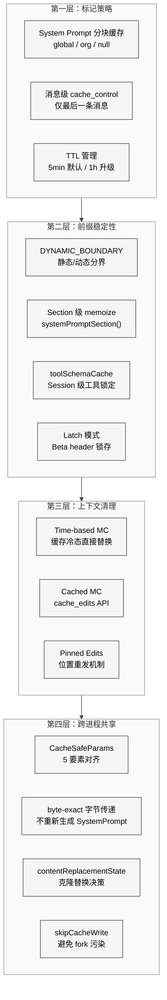
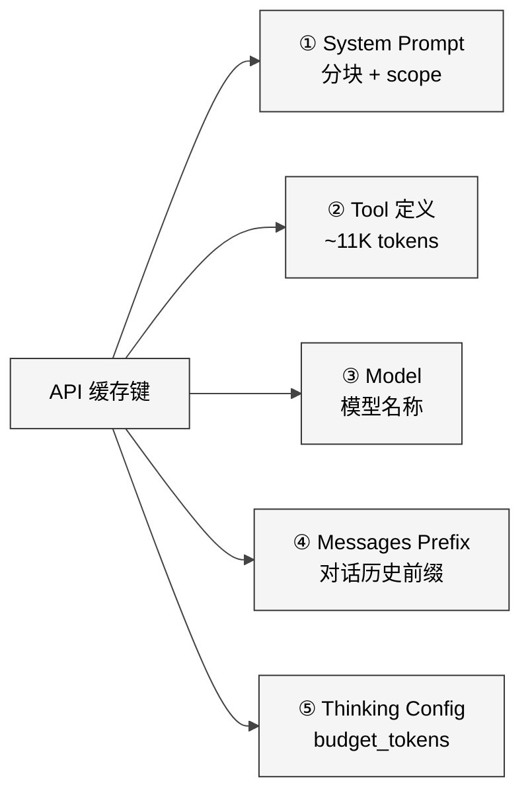
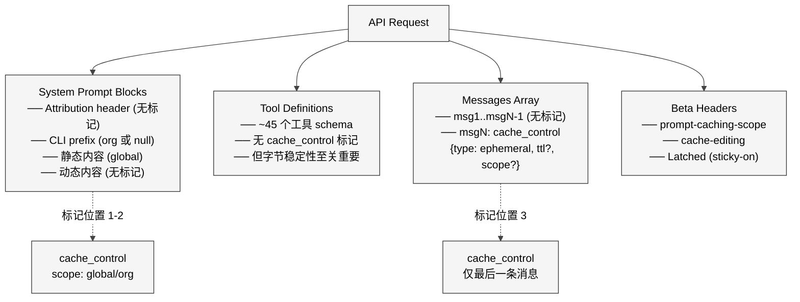
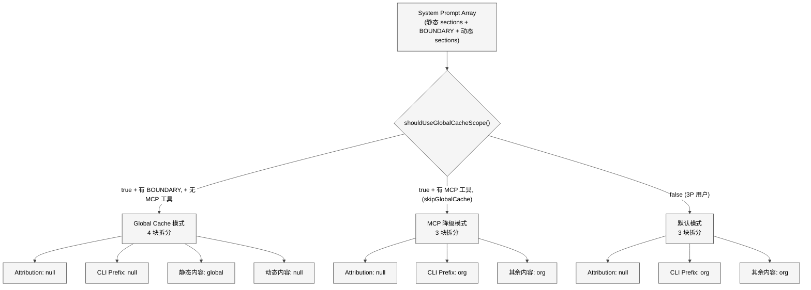
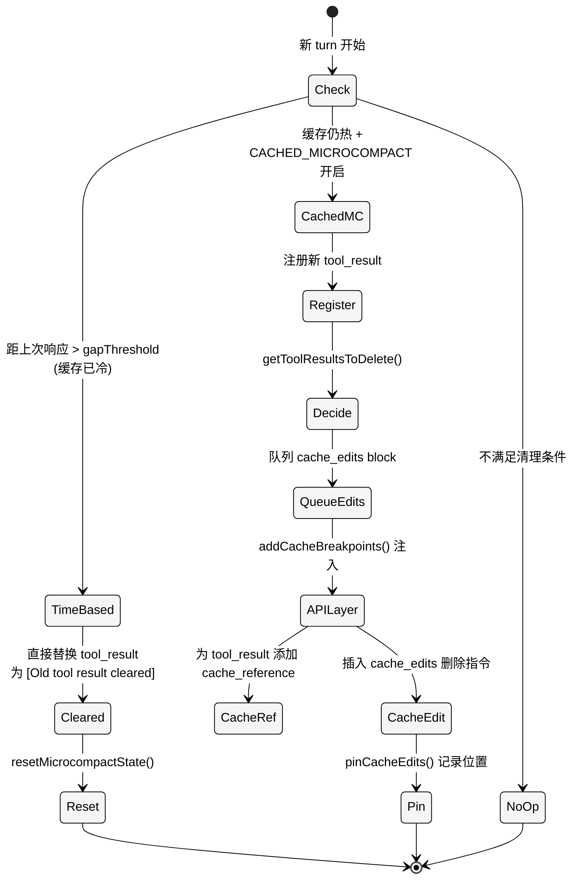
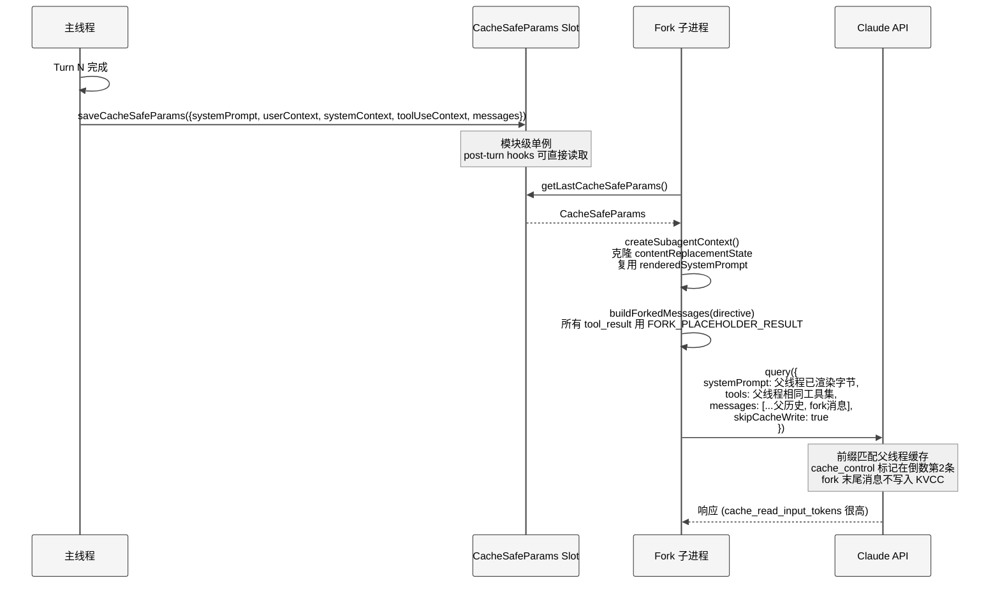

# 第 8 章 Prompt Cache

> 核心提要：缓存边界与成本控制

## 7.1 定位

调用大模型 API 最大的成本来自 **input tokens**。在一个典型的 Claude Code 交互式会话中，每次用户提问都会把完整的 System Prompt（约 2 万 token）、工具定义（约 1.1 万 token）以及之前所有的对话历史一起发送给 API。如果对话进行了 50 轮，每轮平均 5 万 input tokens，一个会话就消耗 250 万 input tokens。

Anthropic 的 Prompt Caching 机制可以将**重复前缀**的成本降低 90%。服务端缓存请求前缀（System Prompt + 工具定义 + 消息历史前缀），只要下次请求的前缀字节完全一致，就从缓存中读取而非重新处理。以 200K token 上下文为参照，cache hit 的成本约为 \$0.003，而 cache miss 高达 \$0.60 —— **200 倍的成本差距**意味着缓存策略的好坏直接决定产品的商业可行性。

但"字节完全一致"这个要求极其严苛。**哪怕多一个空格、换一个 JSON 字段顺序、改一个 `cache_control` 的 scope，整个缓存就失效了。** Claude Code 的源码中充斥着对这个约束的防御性设计 —— 从 System Prompt 的静态/动态分界，到 beta header 的 latch（锁存）模式，到 Fork Agent 的 byte-exact 参数传递，再到 12 维度的缓存失效检测系统。这些设计横切了 12 个以上的源码文件、超过 7,000 行 TypeScript，构成了 Claude Code 成本控制的基石。

**本章涉及的核心源码文件**：

| 文件 | 行数 | 核心职责 |
|------|------|---------|
| `services/api/claude.ts` | 3,419 | 缓存标记放置、latch 逻辑、API 请求组装 |
| `utils/api.ts` | 718 | System Prompt 分块、工具 schema 缓存 |
| `services/api/promptCacheBreakDetection.ts` | 727 | 12 维度缓存失效检测 |
| `utils/forkedAgent.ts` | 689 | CacheSafeParams、Fork Agent 缓存共享 |
| `services/compact/microCompact.ts` | 530 | 双路径 Microcompact（Time-based / Cached） |
| `utils/toolResultStorage.ts` | 1,040 | 工具结果预算管理、替换状态克隆 |
| `constants/prompts.ts` | 914 | System Prompt 构建、动态边界标记 |
| `tools/AgentTool/forkSubagent.ts` | 210 | Fork 子进程 byte-identical 消息构造 |
| `utils/toolSchemaCache.ts` | 26 | Session 级工具 schema 缓存 |
| `constants/systemPromptSections.ts` | 68 | Section 级缓存/非缓存注册 |
| `utils/betas.ts` | 434 | Beta header 管理、global scope 判断 |

本章将回答三个核心问题：

1. **缓存是怎么标记的？** —— `cache_control` 标记的放置策略、作用域选择与 TTL 管理
2. **缓存是怎么保护的？** —— 从 System Prompt 分段到 latch 模式，如何避免意外失效
3. **缓存是怎么共享的？** —— Fork Agent 如何通过 `CacheSafeParams` 实现跨进程缓存命中

## 7.2 架构

### 7.2.1 Prompt Cache 的四层防御架构

Claude Code 的 Prompt Cache 策略不是一个单点优化，而是一个**横切四层的防御体系**。从 API 请求的序列化字节到 Fork 子进程的参数传递，每一层都为缓存前缀的字节稳定性提供保障。

<div style="background: #ffffff; padding: 16px; border-radius: 8px; margin: 16px 0;">



</div>

### 7.2.2 缓存键的五要素模型

Anthropic API 的缓存键由五个要素组成。理解这五个要素是理解所有缓存优化策略的基础：

<div style="background: #ffffff; padding: 16px; border-radius: 8px; margin: 16px 0;">



</div>

这五个要素中**任何一个**发生字节级变化，都会导致缓存失效。`CacheSafeParams` 类型（`utils/forkedAgent.ts:57-68`）正是围绕这五个要素设计的：

```typescript
// utils/forkedAgent.ts:46-68
/**
 * Parameters that must be identical between the fork and parent API requests
 * to share the parent's prompt cache. The Anthropic API cache key is composed of:
 * system prompt, tools, model, messages (prefix), and thinking config.
 */
export type CacheSafeParams = {
  systemPrompt: SystemPrompt
  userContext: { [k: string]: string }
  systemContext: { [k: string]: string }
  toolUseContext: ToolUseContext
  forkContextMessages: Message[]
}
```

前四个要素被显式携带，第五个（thinking config）从 `toolUseContext.options.thinkingConfig` 继承。注释中甚至警告 `maxOutputTokens` 会间接影响 `budget_tokens`，从而破坏缓存键。

### 7.2.3 API 请求中缓存标记的放置位置

一个完整的 Claude Code API 请求，缓存标记的放置遵循严格的层级规则：

<div style="background: #ffffff; padding: 16px; border-radius: 8px; margin: 16px 0;">



</div>

一个关键的工程决策是：**每个请求只在消息层面放一个 `cache_control` 标记**（`claude.ts:3063-3089`）。源码注释揭示了原因 —— API 服务端的 KV 缓存页管理器只保留最后一个 `cache_control` 位置的本地注意力 KV 页。如果放两个标记，倒数第二个位置的页面会被保护一个额外的 turn 却永远不会被恢复，浪费缓存空间。

## 7.3 实现

### 7.3.1 `getCacheControl()` —— 缓存标记的序列化

`getCacheControl()` 是所有缓存标记的出口函数，决定了 wire 上传输的 `cache_control` 对象的精确字节：

```typescript
// services/api/claude.ts:358-374
export function getCacheControl({
  scope,
  querySource,
}: {
  scope?: CacheScope
  querySource?: QuerySource
} = {}): {
  type: 'ephemeral'
  ttl?: '1h'
  scope?: CacheScope
} {
  return {
    type: 'ephemeral',
    ...(should1hCacheTTL(querySource) && { ttl: '1h' }),
    ...(scope === 'global' && { scope }),
  }
}
```

三种作用域在 wire 上的表现：

| 内部概念 | wire 上的 JSON | 缓存共享范围 |
|---------|---------------|-------------|
| `global` | `{ type: 'ephemeral', scope: 'global' }` | 所有用户共享 |
| `org` | `{ type: 'ephemeral' }`（省略 scope） | 同一组织内共享（API 默认行为） |
| `null` | 不添加 `cache_control` 字段 | 不缓存 |

注意 `org` 是 Claude Code 内部的语义抽象，在 wire 上表现为省略 `scope` 字段。这不是偶然 —— Anthropic API 的默认缓存行为就是组织级隔离，所以不需要显式声明。

### 7.3.2 TTL 管理：5 分钟 vs 1 小时的 Latch 模式

默认的 `ephemeral` 缓存 TTL 是 5 分钟。符合条件的用户可以获得 1 小时 TTL。`should1hCacheTTL()` 函数（`claude.ts:393-434`）实现了一个精密的资格判断逻辑：

```typescript
// services/api/claude.ts:393-434
function should1hCacheTTL(querySource?: QuerySource): boolean {
  // 3P Bedrock 用户通过环境变量 opt-in
  if (getAPIProvider() === 'bedrock' &&
      isEnvTruthy(process.env.ENABLE_PROMPT_CACHING_1H_BEDROCK)) {
    return true
  }

  // 在 session 级别锁定（latch）资格判断
  let userEligible = getPromptCache1hEligible()
  if (userEligible === null) {
    userEligible =
      process.env.USER_TYPE === 'ant' ||
      (isClaudeAISubscriber() && !currentLimits.isUsingOverage)
    setPromptCache1hEligible(userEligible)  // 锁定，不再重新计算
  }
  if (!userEligible) return false

  // GrowthBook allowlist 也被锁定
  let allowlist = getPromptCache1hAllowlist()
  if (allowlist === null) {
    const config = getFeatureValue_CACHED_MAY_BE_STALE<{
      allowlist?: string[]
    }>('tengu_prompt_cache_1h_config', {})
    allowlist = config.allowlist ?? []
    setPromptCache1hAllowlist(allowlist)  // 锁定
  }

  return (
    querySource !== undefined &&
    allowlist.some(pattern =>
      pattern.endsWith('*')
        ? querySource.startsWith(pattern.slice(0, -1))
        : querySource === pattern,
    )
  )
}
```

这里的 **latch（锁存）模式** 是整个缓存系统中最重要的防御模式之一。`userEligible` 和 `allowlist` 在 session 内首次评估后就被写入 bootstrap state，此后不再重新计算。为什么？

设想一个场景：用户在对话第 10 轮时超出了配额限制（`isUsingOverage` 从 `false` 变成 `true`）。如果不锁存，`should1hCacheTTL` 会从返回 `true` 变成返回 `false`，`cache_control` 对象从 `{ type: 'ephemeral', ttl: '1h' }` 变成 `{ type: 'ephemeral' }` —— 序列化字节改变，**整个缓存前缀立即失效**，约 5 万 token 的前缀需要重新处理。锁存模式以"可能多给一点 TTL"为代价，换取缓存前缀在整个 session 内的绝对稳定性。

### 7.3.3 System Prompt 的缓存分块策略

System Prompt 由静态部分（核心指令、工具使用规范）和动态部分（Git 状态、CLAUDE.md、语言设置）组成。如果合并为一个块缓存，动态部分的任何变化都会导致全部失效。

**`SYSTEM_PROMPT_DYNAMIC_BOUNDARY`** 标记（`constants/prompts.ts:114-115`）将两者分开：

```typescript
// constants/prompts.ts:560-576
  return [
    // --- Static content (cacheable) ---
    getSimpleIntroSection(outputStyleConfig),
    getSimpleSystemSection(),
    outputStyleConfig === null ||
    outputStyleConfig.keepCodingInstructions === true
      ? getSimpleDoingTasksSection()
      : null,
    getActionsSection(),
    getUsingYourToolsSection(enabledTools),
    getSimpleToneAndStyleSection(),
    getOutputEfficiencySection(),
    // === BOUNDARY MARKER - DO NOT MOVE OR REMOVE ===
    ...(shouldUseGlobalCacheScope() ? [SYSTEM_PROMPT_DYNAMIC_BOUNDARY] : []),
    // --- Dynamic content (registry-managed) ---
    ...resolvedDynamicSections,
  ].filter(s => s !== null)
```

`splitSysPromptPrefix()`（`utils/api.ts:321-435`）根据这个边界将 System Prompt 拆分为最多 4 个块：

<div style="background: #ffffff; padding: 16px; border-radius: 8px; margin: 16px 0;">



</div>

**Global Cache 模式的核心价值**：当 10 万用户发送相同的静态 System Prompt 前缀时，只需要在 API 服务端缓存一份。静态内容标记为 `global` scope，动态内容不标记（`null`），动态部分的变化不影响静态部分的缓存命中。

**MCP 工具导致降级的原因**：MCP 工具定义是用户级别的（不同用户配置不同的 MCP 服务器），工具定义位于 System Prompt 之后、消息之前。即使 System Prompt 的静态部分用 `global` scope 缓存了，工具数组的差异会导致后续前缀无法匹配。因此当有非 defer 的 MCP 工具时，`globalCacheStrategy` 被设为 `'none'`（`claude.ts:1225-1229`），System Prompt 降级到 `org` scope。

> **源码考古**：`GlobalCacheStrategy` 类型定义（`services/api/logging.ts:46`）中保留了 `'tool_based'` 值，但当前主查询路径只产生 `'system_prompt'` 或 `'none'`。这可能是早期"在工具定义上也放 `cache_control` 标记"方案的遗留，最终被 System Prompt 分块方案取代。

### 7.3.4 Section 级缓存：`systemPromptSection()` vs `DANGEROUS_uncachedSystemPromptSection()`

动态 section 的计算成本也需要控制。`systemPromptSections.ts`（68 行）定义了两种 section 注册方式：

```typescript
// constants/systemPromptSections.ts:16-38
export function systemPromptSection(
  name: string,
  compute: ComputeFn,
): SystemPromptSection {
  return { name, compute, cacheBreak: false }
}

export function DANGEROUS_uncachedSystemPromptSection(
  name: string,
  compute: ComputeFn,
  _reason: string,
): SystemPromptSection {
  return { name, compute, cacheBreak: true }
}
```

`resolveSystemPromptSections()`（`systemPromptSections.ts:40-58`）对 `cacheBreak: false` 的 section 只计算一次并缓存在 bootstrap state 中，后续 turn 直接复用。这确保了动态 section 的文本在 session 内保持字节稳定。

**`DANGEROUS_` 前缀的设计意图**：函数名中的 `DANGEROUS_` 是刻意为之的 API 设计。它要求调用者必须传入 `_reason` 参数解释为什么需要每次重新计算 —— 因为如果计算结果变化了，就会破坏 Prompt Cache。在整个代码库中，只有一个地方使用了它：

```typescript
// constants/prompts.ts:512-518
DANGEROUS_uncachedSystemPromptSection(
  'mcp_instructions',
  () =>
    isMcpInstructionsDeltaEnabled()
      ? null
      : getMcpInstructionsSection(mcpClients),
  'MCP servers connect/disconnect between turns',
)
```

MCP 服务器可能在 turn 之间连接或断开，其指令必须实时反映。注释解释了当 `isMcpInstructionsDeltaEnabled()` 为 true 时，MCP 指令改为通过 delta attachment 机制注入（而非直接写入 System Prompt），从而避免破坏缓存。

`clearSystemPromptSections()`（`systemPromptSections.ts:60-68`）在 `/clear` 和 `/compact` 时同时清除 section cache 和 beta header latches —— 因为 compact 后对话被重新摘要，相当于开始一段新的缓存前缀。

### 7.3.5 Tool Schema Cache：防止工具定义抖动

工具定义是缓存键的第二要素。`toolSchemaCache.ts`（26 行）虽然只有一个简单的 `Map`，但其存在的理由极其重要：

```typescript
// utils/toolSchemaCache.ts:1-27
// Session-scoped cache of rendered tool schemas. Tool schemas render at server
// position 2 (before system prompt), so any byte-level change busts the entire
// ~11K-token tool block AND everything downstream. GrowthBook gate flips
// (tengu_tool_pear, tengu_fgts), MCP reconnects, or dynamic content in
// tool.prompt() all cause this churn. Memoizing per-session locks the schema
// bytes at first render — mid-session GB refreshes no longer bust the cache.
const TOOL_SCHEMA_CACHE = new Map<string, CachedSchema>()
```

`toolToAPISchema()`（`utils/api.ts:119-266`）使用这个缓存：工具的 `name`、`description`、`input_schema` 在 session 内只计算一次。即使 GrowthBook 的 feature flag 在 session 中途翻转（比如 `tengu_tool_pear` 从 false 变成 true），已缓存的工具 schema 也不会改变。

一个值得注意的细节：`toolToAPISchema` 的接口**支持** `cacheControl` 选项（`utils/api.ts:129-133`），但当前主查询路径调用它时**并未传入 `cacheControl`**（`claude.ts:1235-1245`）。工具数组上目前没有 `cache_control` 标记 —— 它的字节稳定性完全依赖于 `toolSchemaCache` 的 session 级锁定。

### 7.3.6 Latch 模式：Beta Header 的 Sticky-on 锁存

Beta headers 是 API 请求的一部分，它们的变化也会破坏缓存键。Claude Code 对四个动态 beta header 使用 sticky-on latch 模式（`claude.ts:1405-1456`）：

```typescript
// services/api/claude.ts:1405-1411
  // Sticky-on latches for dynamic beta headers. Each header, once first
  // sent, keeps being sent for the rest of the session so mid-session
  // toggles don't change the server-side cache key and bust ~50-70K tokens.
  // Latches are cleared on /clear and /compact via clearBetaHeaderLatches().
```

| Latch | 代码行 | 触发条件 | 含义 |
|-------|--------|---------|------|
| `afkHeaderLatched` | L1412-1422 | auto mode 首次激活 | AFK mode beta header |
| `fastModeHeaderLatched` | L1425-1428 | fast mode 首次使用 | Fast mode beta header |
| `cacheEditingHeaderLatched` | L1431-1441 | cached MC 首次启用 | Cache editing beta header |
| `thinkingClearLatched` | L1446-1455 | 1h 缓存 TTL 过期 | Context management header |

规则是：**一旦开启就不关闭**。即使用户中途关闭 auto mode，AFK beta header 依然保留在后续请求中。源码注释直接量化了代价："bust ~50-70K tokens" —— 这是一次 header 翻转导致的缓存失效成本。

### 7.3.7 Cached Microcompact：在保护缓存的同时清理上下文

长对话中早期的工具调用结果（文件内容、Bash 输出）已经过时但仍占用 token。Microcompact 机制清理它们，但修改消息内容会改变前缀字节。解决方案是**双路径策略**：

<div style="background: #ffffff; padding: 16px; border-radius: 8px; margin: 16px 0;">



</div>

**Time-based 路径**（`microCompact.ts:446-530`）：当距离上一次 API 响应超过配置阈值（缓存已过期），直接修改消息内容。`evaluateTimeBasedTrigger()`（L422-444）通过计算 `(Date.now() - lastAssistant.timestamp) / 60_000` 与 `config.gapThresholdMinutes` 比较来判断缓存冷热。

**Cached MC 路径**（`microCompact.ts:305-399`）：缓存仍热时，**不修改消息内容**。而是通过两个 API 扩展字段操作：

- **`cache_reference`**：标记在 `tool_result` 块上（`claude.ts:3196-3203`），告诉 API "这个结果可以被引用删除"
- **`cache_edits`**：放在 user message 中，指令 API "删除这些 cache_reference 对应的内容"

**Pinned edits 的不变量**：一旦某个 `cache_edits` block 在某个 message index 被发送，后续所有请求**都必须在相同的 index 重新发送它**（`microCompact.ts:111-118`）。这是因为 `cache_edits` 本身也是前缀的一部分 —— 如果只在一次请求中出现，前缀就不一致了。

### 7.3.8 Fork Agent 缓存共享的完整流程

Fork Agent 的缓存共享涉及多个精密的对齐机制。以下时序图展示了从主线程 turn 结束到 Fork 子进程发起 API 请求的完整流程：

<div style="background: #ffffff; padding: 16px; border-radius: 8px; margin: 16px 0;">



</div>

**三个关键的 byte-exact 保障**：

1. **System Prompt 字节传递**（`forkSubagent.ts:44-59`）：Fork 子进程**不重新生成** System Prompt，而是直接复用父线程已渲染的字节（`toolUseContext.renderedSystemPrompt`）。注释解释原因：GrowthBook 状态可能从 cold 变 warm，重新生成会产生不同的 Feature Flag 分支。

2. **`contentReplacementState` 克隆**（`forkedAgent.ts:388-403`）：工具结果预算管理机制会把超大结果替换为磁盘摘要。Fork 子进程必须对父线程的消息做出**相同的替换决策**，否则序列化字节不一致。源码注释一针见血："A fresh state would see them as unseen and make divergent replacement decisions → wire prefix differs → cache miss."

3. **`FORK_PLACEHOLDER_RESULT` 统一占位符**（`forkSubagent.ts:91-93`）：所有 fork 子进程共享相同的 `'Fork started — processing in background'` 占位符。`buildForkedMessages()`（L95-169）确保只有最后的 directive 文本块不同 —— 前面所有相同的部分都能被缓存命中。

### 7.3.9 `skipCacheWrite`：避免 Fork 污染缓存

Fork 子进程通常是 fire-and-forget，其末尾消息不需要被缓存。`skipCacheWrite` 模式将 `cache_control` 标记移到**倒数第二条消息**（`claude.ts:3084-3089`）—— 这恰好是父线程和 fork 共享的最后一个前缀点。在这个点写入缓存是 no-op（因为父线程已缓存过），而 fork 自己的末尾消息不写入 KVCC。

```typescript
// services/api/claude.ts:3084-3089
// For fire-and-forget forks (skipCacheWrite) we shift the
// marker to the second-to-last message: that's the last shared-prefix
// point, so the write is a no-op merge on mycro (entry already exists)
// and the fork doesn't leave its own tail in the KVCC.
const markerIndex = skipCacheWrite ? messages.length - 2 : messages.length - 1
```

## 7.4 细节

### 7.4.1 缓存失效检测系统：12 维度监控

即使有了上述所有保护，缓存仍可能意外失效。`promptCacheBreakDetection.ts`（727 行）实现了一个完整的**两阶段检测系统**：

**阶段 1（pre-call）**：`recordPromptState()` 在每次 API 调用前记录快照，与上一次调用的状态逐一对比 12 个维度（`promptCacheBreakDetection.ts:332-346`）：

| # | 维度 | 检测内容 |
|---|------|---------|
| 1 | `systemPromptChanged` | System Prompt 文本 hash（去除 cache_control） |
| 2 | `toolSchemasChanged` | 工具定义聚合 hash + 逐工具 hash 对比 |
| 3 | `modelChanged` | 模型名称 |
| 4 | `fastModeChanged` | Fast mode 开关 |
| 5 | `cacheControlChanged` | cache_control 的 scope/TTL（含 cache_control 的 hash） |
| 6 | `globalCacheStrategyChanged` | Global cache 策略 |
| 7 | `betasChanged` | 排序后的 beta header 列表 |
| 8 | `autoModeChanged` | Auto mode 开关 |
| 9 | `overageChanged` | 用量超限状态 |
| 10 | `cachedMCChanged` | Cached microcompact 开关 |
| 11 | `effortChanged` | Effort 级别 |
| 12 | `extraBodyChanged` | 额外 API body 参数 hash |

**阶段 2（post-call）**：`checkResponseForCacheBreak()` 检查 API 响应的 `cache_read_tokens`。当同时满足两个条件时判定为缓存失效（`promptCacheBreakDetection.ts:484-492`）：

- `cache_read_tokens` 相比上一次**下降超过 5%**
- 绝对下降**超过 2,000 tokens**（`MIN_CACHE_MISS_TOKENS`）

双条件设计避免了正常波动触发误报。检测器还特殊处理了 Cached MC 场景 —— `cache_edits` 删除会导致合理的 cache read 下降，通过 `cacheDeletionsPending` 标志跳过这种情况。

注意维度 8-10 的注释："should NOT break cache anymore (sticky-on latched in claude.ts). Tracked to verify the fix." —— 这些维度曾经是缓存失效的常见原因，latch 模式修复后仍然被追踪以验证修复效果。

### 7.4.2 `getSessionSpecificGuidanceSection()`：为缓存而迁移的 Section

`constants/prompts.ts:343-400` 有一个精彩的注释，揭示了一次为缓存优化而进行的重构：

```typescript
// constants/prompts.ts:343-349
/**
 * Session-variant guidance that would fragment the cacheScope:'global'
 * prefix if placed before SYSTEM_PROMPT_DYNAMIC_BOUNDARY. Each conditional
 * here is a runtime bit that would otherwise multiply the Blake2b prefix
 * hash variants (2^N). See PR #24490, #24171 for the same bug class.
 */
```

这个 section 原本可能在 BOUNDARY 之前（静态区域），但其中包含条件分支（如工具是否启用），每个条件位会使 prefix hash 变体数指数增长（2^N）。将它移到 BOUNDARY 之后的动态区域，避免了 global cache 的碎片化。

### 7.4.3 `DANGEROUS_` 命名约定：代码审查的社会工程

`DANGEROUS_uncachedSystemPromptSection()` 的命名不仅仅是警告 —— 它是一种**代码审查层面的社会工程**。当团队中任何人在 PR 中看到 `DANGEROUS_` 前缀，都会自然地追问："为什么需要每次重新计算？能否避免？" 强制传入的 `_reason` 参数确保了决策的可追溯性。

整个代码库中只有一处使用了这个函数（MCP 指令 section），而且即使在那里也通过 `isMcpInstructionsDeltaEnabled()` 提供了一个不破坏缓存的替代路径。这种"让危险操作看起来危险"的设计模式值得所有 Agent 工程团队借鉴。

### 7.4.4 工具结果预算管理与缓存的交互

`enforceToolResultBudget()`（`toolResultStorage.ts:769-909`）管理每条消息中工具结果的总大小。当某条消息的工具结果超过预算时，它会选择性地将部分结果替换为磁盘上的摘要版本。

这个机制与缓存的交互极其微妙：替换决策记录在 `ContentReplacementState` 中（`toolResultStorage.ts:390-393`），包含两个集合：

```typescript
export type ContentReplacementState = {
  seenIds: Set<string>       // 已经处理过的 tool_use_id
  replacements: Map<string, string>  // 需要替换的 id → 替换内容
}
```

Fork 子进程必须克隆这个 state（`toolResultStorage.ts:405-412`）而非创建新的。如果用全新 state，fork 处理父线程消息时会把某些"父线程已替换"的结果视为"未见过"，做出不同的决策 —— 替换后的内容不同，序列化字节不一致，缓存失效。

## 7.5 比较

### 7.5.1 AI Coding Agent 的缓存策略格局

| 维度 | Claude Code | Cursor | GitHub Copilot | Aider | Cline |
|------|-------------|--------|---------------|-------|-------|
| **缓存标记** | 多层 `cache_control` + scope（global/org） | 未公开，推测使用 API 级缓存 | 依赖 GitHub 后端缓存 | 无 prompt caching | 依赖 API 提供商 |
| **前缀稳定性** | 12 维度检测 + latch + section cache + tool schema cache | 未公开 | 未公开 | 无专门机制 | 无专门机制 |
| **上下文清理** | 双路径 MC（time-based + cached） | 未公开 | 上下文截断 | 简单截断 | 上下文截断 |
| **跨进程共享** | CacheSafeParams + byte-exact threading | N/A（非多进程） | N/A | 单进程 | 单进程 |
| **TTL 管理** | 5min 默认 / 1h 升级 + latch | 依赖 API | 依赖 API | 无 | 依赖 API |
| **缓存失效诊断** | `promptCacheBreakDetection.ts`（727 行） | 未公开 | 未公开 | 无 | 无 |

### 7.5.2 Claude Code 的独特优势

**全局缓存共享（`scope: 'global'`）**：这是 Claude Code 独有的优势，因为它是 Anthropic 的 1P（第一方）产品，可以使用 `PROMPT_CACHING_SCOPE_BETA_HEADER` 来激活跨组织的缓存共享。第三方产品（Cursor 等调用 Claude API 的产品）只能使用 `org` 级别的缓存。当 Claude Code 有 100 万日活用户时，静态 System Prompt 前缀只需缓存一份 —— 这是巨大的基础设施成本优势。

**Cached Microcompact**：通过 `cache_edits` / `cache_reference` API 在不修改消息内容的情况下清理工具结果，这是目前公开可见的唯一实现。其他产品要么不清理旧工具结果（导致上下文浪费），要么直接修改内容（破坏缓存）。

**Fork Agent 缓存共享**：Claude Code 的 fork 子进程（session memory、prompt suggestion、post-turn summary）都能共享主线程的缓存前缀。这在多 Agent 并发执行时意味着后台 fork 几乎不产生额外的 input token 成本。

### 7.5.3 Claude Code 的局限性

**对 1P API 的深度依赖**：`cache_edits`、`cache_reference`、`scope: 'global'` 等机制都依赖 Anthropic 私有 API 扩展。3P 用户（通过 Bedrock 或 Vertex AI 调用）失去大部分优化。`shouldUseGlobalCacheScope()` 明确限制为 `getAPIProvider() === 'firstParty'`（`betas.ts:227-232`）。

**缓存前缀的脆弱性**：前缀匹配是**全有全无**的 —— 任何位置的字节差异都导致从该位置开始的所有缓存失效。没有部分匹配或模糊匹配机制。这迫使 Claude Code 投入大量工程来维护字节稳定性，本质上是在应用层补偿 API 层的刚性约束。

**CLAUDE.md 不在 System Prompt 中**：CLAUDE.md 内容被包装在 `<system-reminder>` 标签内作为第一条 user message 注入（`utils/api.ts:449-474`），而非 System Prompt 的一部分。由此可见 CLAUDE.md 的任何变化（比如用户编辑了项目级配置）会改变消息前缀的第一条消息，导致后续所有消息的缓存失效。这是社区最常见的误解之一 —— 许多用户频繁编辑 CLAUDE.md 而不知道每次编辑都在破坏缓存。

## 7.6 辨误

### 误解 1："工具定义上有 `cache_control` 标记"

Source Study 参考文档中提到了遗留注释 "toolSchemas (which carries the cache_control marker)"（`claude.ts:1388`），但当前代码中**工具数组上没有 `cache_control` 标记**。`toolToAPISchema()` 的接口虽然支持 `cacheControl` 选项，但主查询路径不传入该选项。工具定义的缓存保护完全依赖于 `toolSchemaCache` 的 session 级锁定。

### 误解 2："Prompt Cache 是透明的，开发者不需要关心"

事实恰恰相反。Prompt Cache 的有效性高度依赖于请求前缀的字节稳定性。Claude Code 投入了 7,000+ 行代码来维护这个稳定性。对于在 Claude API 上构建 Agent 的开发者，以下行为会破坏缓存：

- 在 System Prompt 中加入时间戳或随机数
- 每次请求重新生成工具定义（应缓存后复用）
- mid-session 切换模型或修改 beta headers
- 修改早期消息的内容（即使语义不变）

### 误解 3："7 层记忆体系包含 Prompt Cache"

Troy Hua 的"7 层记忆"框架将 Prompt Cache 归为"记忆层"之一。但源码层面，Prompt Cache 与记忆系统（CLAUDE.md、Auto Memory）是完全不同的模块，解决完全不同的问题：

- **记忆系统**：解决"跨会话保留什么信息"
- **上下文压缩**：解决"当前窗口如何高效利用"
- **Prompt Cache**：解决"重复前缀的处理成本如何降低"

将三者混为一谈会导致工程决策的混乱。

### 误解 4："缓存失效只是成本问题"

缓存失效不仅增加成本，还**增加延迟**。cache miss 意味着 API 需要重新处理整个前缀的 KV 计算。在 200K token 的上下文中，这可能增加数秒到十几秒的 TTFT（Time To First Token）。Anthropic 官方在 Context Engineering 文章中也强调了上下文管理对延迟的影响。

## 7.7 展望

### 7.7.1 已知缺陷与 TODO

**`cachedMicrocompact.ts` 缺失**：在 restored-src v2.1.88 中，`microCompact.ts` 通过 `import('./cachedMicrocompact.js')` 引用这个模块，但对应的 `.ts` 源文件不在 restored tree 中。由此可见 Cached MC 的核心逻辑（`registerToolResult`、`getToolResultsToDelete`、`createCacheEditsBlock` 的实现）无法直接审查。从调用端代码推断，删除策略基于计数阈值（`triggerThreshold` 和 `keepRecent` 来自 GrowthBook 配置）。

**`GlobalCacheStrategy: 'tool_based'` 未使用**：类型定义中保留了 `'tool_based'` 值，暗示曾有或计划有"在工具定义上放置缓存标记"的方案。当前只有 `'system_prompt'` 和 `'none'` 两种策略被使用。

**Legacy microcompact 路径已移除**：`microcompactMessages()` 中有注释 "Legacy microcompact path removed — tengu_cache_plum_violet is always true"（`microCompact.ts:283`），表明代码经历了从旧路径到 Cached MC 的迁移。

### 7.7.2 潜在瓶颈

**全局缓存的碎片化风险**：`splitSysPromptPrefix()` 将静态内容合并为一个 `global` scope 块。但如果 Anthropic 在不同版本之间修改了静态 System Prompt 的措辞（哪怕一个标点），所有正在运行的旧版本客户端的 global cache 都会失效。版本升级可能造成短期的全局缓存风暴。

**Latch 模式的信息损失**：Latch 保护了缓存但牺牲了灵活性。用户无法在 session 中途关闭 fast mode 后"真正地"停止发送 fast mode beta header。这在某些边缘场景下可能导致非预期的行为差异。

**Cached MC 的 Pinned Edits 累积**：每次 Cached MC 删除工具结果，都会在 `pinnedEdits` 数组中追加一条记录，且必须在后续所有请求的相同位置重新发送。随着对话变长，这个数组会持续增长，增加请求的有效载荷。

### 7.7.3 改进方向

**部分前缀匹配**：当前的前缀匹配是全有全无的。如果 API 层能支持"从最近的匹配点恢复"（类似 HTTP Range 请求），大部分前缀稳定性的工程投入都可以简化。这需要 Anthropic API 团队的支持。

**声明式缓存策略**：当前的缓存保护逻辑分散在 12+ 个文件中。一个更好的设计可能是在 API 请求层引入声明式的 `cachePolicy` 配置，将 latch、section cache、tool schema cache 等机制统一到一个策略引擎中。

**自适应 TTL**：当前的 5min/1h TTL 是静态的。根据用户的交互频率（两次请求之间的间隔）自适应调整 TTL，可以在成本和缓存命中率之间取得更好的平衡。

## 7.8 小结

### 核心 Takeaway

1. **Prompt Cache 的本质是前缀字节稳定性博弈**。Claude Code 投入 7,000+ 行代码、横切 12 个文件来维护 API 请求前缀的字节级一致性。200 倍的 cache hit/miss 成本差距使缓存策略成为产品商业可行性的基石。

2. **Latch 模式是最关键的防御模式**。TTL 资格、beta headers、GrowthBook 配置都在 session 首次评估后锁存，不再重新计算。这以轻微的功能灵活性损失换取了缓存前缀的绝对稳定性。

3. **System Prompt 分块 + 作用域分层是成本控制的核心杠杆**。`SYSTEM_PROMPT_DYNAMIC_BOUNDARY` 将静态内容（`global` scope，跨用户共享）与动态内容（`null`，不缓存）分开。百万级用户共享一份静态前缀缓存，这是 1P 产品的独有优势。

4. **Cached Microcompact 是"既要又要"的工程范例**。它证明了"清理上下文"和"保护缓存"可以同时实现 —— 通过引入 `cache_edits` / `cache_reference` 这对 API 扩展，在不修改消息内容的情况下删除缓存中的工具结果。

5. **Fork Agent 缓存共享展示了 byte-exact 工程的极致**。从 System Prompt 的字节传递、`contentReplacementState` 的克隆、`FORK_PLACEHOLDER_RESULT` 的统一占位符，到 `skipCacheWrite` 避免缓存污染 —— 每一个细节都在为"fork 子进程的 API 请求前缀与父线程完全相同"这个目标服务。

### 对 Agent 开发者的实践建议

- **Session 级缓存一切可变状态**：工具 schema、System Prompt section、配置判断结果都应在 session 内首次计算后缓存。mid-session 变化是缓存的头号杀手。
- **将 System Prompt 分为静态/动态两部分**：静态部分用最广的缓存 scope，动态部分不缓存或用窄 scope。
- **让危险操作看起来危险**：`DANGEROUS_uncachedSystemPromptSection()` 的命名约定值得借鉴 —— 任何可能破坏缓存的操作都应在 API 层面发出明确警告。
- **建立缓存失效检测**：不要假设缓存总是命中。监控 `cache_read_tokens` 的变化趋势，当发现异常下降时立即诊断。
- **Fork 子进程传递而非重新计算**：在并发 Agent 中，直接传递父进程已序列化的参数，避免重新生成导致的微小差异。
