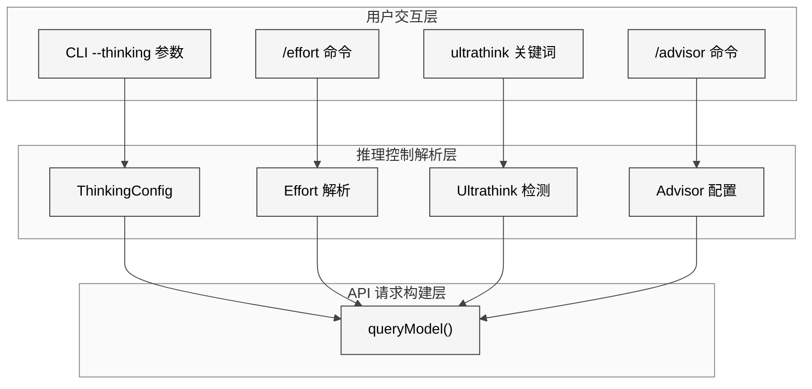
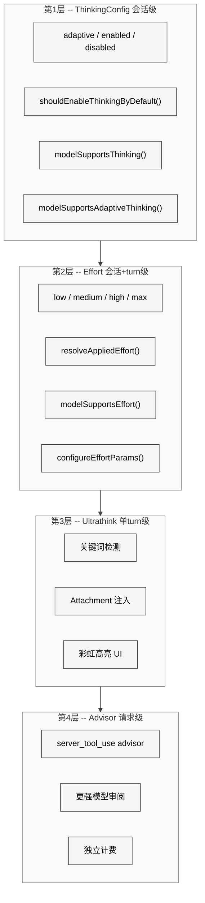
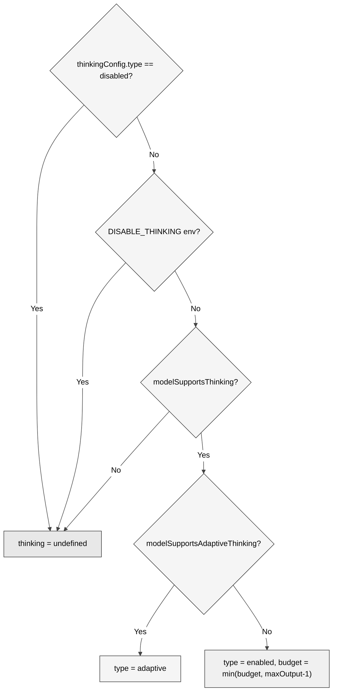
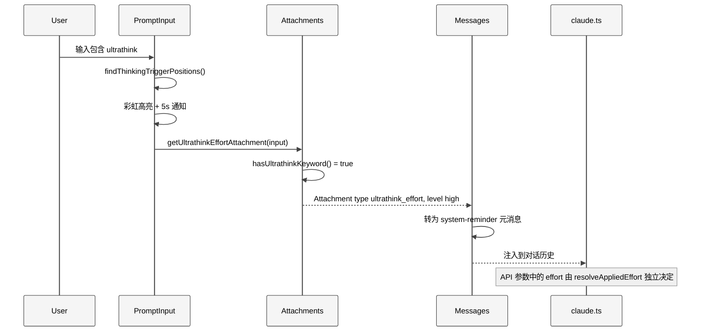

# 第 9 章 Thinking 与推理

> 核心提要：推理深度的控制面

## 8.1 定位

大语言模型的推理不是免费午餐。当模型"想得更深"时，它消耗更多的 token、花费更多的时间、产生更高的成本。但在 Claude Code 的日常使用中，任务复杂度的方差极大——从重命名一个变量到重构整个模块的架构，所需的思考量天差地别。如果所有任务都用最深度的推理，用户会因为等待而流失；如果一律使用浅层推理，复杂任务的质量会直线下降。

Claude Code 围绕这个核心矛盾构建了四个相互关联但各自独立的子系统：

| 子系统 | 核心文件 | 控制面 | 粒度 |
|--------|---------|--------|------|
| **ThinkingConfig** | `src/utils/thinking.ts` (163 行) | 是否开启 Extended Thinking 及其模式 | 会话级 |
| **Effort** | `src/utils/effort.ts` (329 行) | 模型推理努力程度 (low/medium/high/max) | 会话级 + turn 级 |
| **Ultrathink** | `src/utils/thinking.ts` + `src/utils/attachments.ts` | 关键词触发临时推理提升 | 单 turn |
| **Advisor** | `src/utils/advisor.ts` (146 行) | 引入更强模型审阅 | API 请求级 |

这四个子系统共同实现了一个精细的"推理控制面"——让用户、系统和模型在速度、质量、成本三角之间灵活切换。

在 Claude Code 整体架构中，推理控制位于 **API 请求构建层**（`src/services/api/claude.ts`）和**用户交互层**（`src/commands/effort/`、`src/components/PromptInput/`）之间，是连接用户意图和模型能力的关键桥梁。

<div style="background: #ffffff; padding: 16px; border-radius: 8px; margin: 16px 0;">



</div>

## 8.2 架构

### 8.2.1 ThinkingConfig — Extended Thinking 的三种模式

ThinkingConfig 是整个推理控制体系的基石。它定义了模型是否使用 Extended Thinking（扩展思考），以及使用何种模式。

**文件**：`src/utils/thinking.ts` L10-L13

```typescript
export type ThinkingConfig =
  | { type: 'adaptive' }
  | { type: 'enabled'; budgetTokens: number }
  | { type: 'disabled' }
```

三种模式的设计体现了一个清晰的演进路线：

| 模式 | API 参数 | 语义 | 适用场景 |
|------|---------|------|---------|
| `adaptive` | `{ type: 'adaptive' }` | 模型自主决定是否思考及思考深度 | Claude 4.6+ 新模型，推荐默认 |
| `enabled` + budgetTokens | `{ type: 'enabled', budget_tokens: N }` | 强制开启思考，设定 token 上限 | 旧模型或需精确控制预算 |
| `disabled` | 不发送 thinking 参数 | 完全关闭思考 | 辅助调用（classifier、side query） |

**设计决策剖析**：为什么需要 `adaptive` 模式？

从源码注释可以推断出演进历史。`getMaxThinkingTokensForModel()` 在 `src/utils/context.ts` L219 被明确标注为 **Deprecated**：

```typescript
/**
 * Deprecated since newer models use adaptive thinking rather than a
 * strict thinking token budget.
 */
export function getMaxThinkingTokensForModel(model: string): number {
  return getModelMaxOutputTokens(model).upperLimit - 1
}
```

早期模型（Claude 3.x 系列）需要客户端显式设定 thinking budget——由此可见客户端必须猜测任务需要多少思考 token，猜少了模型被截断，猜多了浪费 output 配额。`adaptive` 模式将这个决策权还给了模型自身，是一个显著的用户体验改进。

### 8.2.2 核心架构：四层推理控制体系

<div style="background: #ffffff; padding: 16px; border-radius: 8px; margin: 16px 0;">



</div>

**关键设计哲学**：这四层是**独立正交**的。ThinkingConfig 决定"模型能不能想"，Effort 决定"想多深"，Ultrathink 是"当前这一句话想得更深"，Advisor 是"请更强的模型来检查"。它们在代码路径上各自独立——`hasThinking` 分支和 `configureEffortParams()` 互不依赖（`src/services/api/claude.ts` L1458, L1563），两者各自直接写入 API 请求参数。

### 8.2.3 默认值的确定：多层覆盖优先级

ThinkingConfig 的默认值确定体现了一个严谨的优先级链：

**文件**：`src/utils/thinking.ts` L146-L162

```typescript
export function shouldEnableThinkingByDefault(): boolean {
  if (process.env.MAX_THINKING_TOKENS) {
    return parseInt(process.env.MAX_THINKING_TOKENS, 10) > 0
  }
  const { settings } = getSettingsWithErrors()
  if (settings.alwaysThinkingEnabled === false) {
    return false
  }
  // Enable thinking by default unless explicitly disabled.
  return true
}
```

源码中三处标注 `IMPORTANT` 注释的位置（L100、L131、L156）反复强调同一条规则：

> Do not change default thinking enabled value without notifying the model launch DRI and research. This can greatly affect model quality and bashing.

这种密度的警告注释在整个 51 万行代码库中极为罕见，说明 Anthropic 团队在生产中已经因为不慎修改默认值而导致过模型质量事故。"bashing"一词暗示了用户会在社交媒体上批评模型"变笨了"——这不是技术问题，而是产品事故。

**启动时的初始化逻辑**展示了完整的优先级链：

**文件**：`src/main.tsx` L2456-L2488

```typescript
let thinkingEnabled = shouldEnableThinkingByDefault();
let thinkingConfig: ThinkingConfig = thinkingEnabled !== false ? {
  type: 'adaptive'
} : {
  type: 'disabled'
};
if (options.thinking === 'adaptive' || options.thinking === 'enabled') {
  thinkingEnabled = true;
  thinkingConfig = { type: 'adaptive' };
} else if (options.thinking === 'disabled') {
  thinkingEnabled = false;
  thinkingConfig = { type: 'disabled' };
} else {
  const maxThinkingTokens = process.env.MAX_THINKING_TOKENS
    ? parseInt(process.env.MAX_THINKING_TOKENS, 10)
    : options.maxThinkingTokens;
  if (maxThinkingTokens !== undefined) {
    if (maxThinkingTokens > 0) {
      thinkingEnabled = true;
      thinkingConfig = { type: 'enabled', budgetTokens: maxThinkingTokens };
    } else if (maxThinkingTokens === 0) {
      thinkingEnabled = false;
      thinkingConfig = { type: 'disabled' };
    }
  }
}
```

一个重要的细节：当用户指定 `--thinking enabled` 时，实际创建的是 `{ type: 'adaptive' }`。这是一个向前兼容的设计——`enabled` 作为旧 CLI 参数被映射到新模型的 `adaptive` 模式，避免了用户需要修改脚本。

## 8.3 实现

### 8.3.1 Thinking 注入 API 请求的核心决策逻辑

这是整个推理控制体系中最关键的代码段，位于 `queryModel()` 函数内部：

**文件**：`src/services/api/claude.ts` L1596-L1630

```typescript
const hasThinking =
  thinkingConfig.type !== 'disabled' &&
  !isEnvTruthy(process.env.CLAUDE_CODE_DISABLE_THINKING)
let thinking: BetaMessageStreamParams['thinking'] | undefined = undefined

if (hasThinking && modelSupportsThinking(options.model)) {
  if (
    !isEnvTruthy(process.env.CLAUDE_CODE_DISABLE_ADAPTIVE_THINKING) &&
    modelSupportsAdaptiveThinking(options.model)
  ) {
    thinking = { type: 'adaptive' }
  } else {
    let thinkingBudget = getMaxThinkingTokensForModel(options.model)
    if (
      thinkingConfig.type === 'enabled' &&
      thinkingConfig.budgetTokens !== undefined
    ) {
      thinkingBudget = thinkingConfig.budgetTokens
    }
    thinkingBudget = Math.min(maxOutputTokens - 1, thinkingBudget)
    thinking = {
      budget_tokens: thinkingBudget,
      type: 'enabled',
    }
  }
}
```

这段代码的决策树如下：

<div style="background: #ffffff; padding: 16px; border-radius: 8px; margin: 16px 0;">



</div>

**关键约束**：`budget_tokens` 必须严格小于 `max_tokens`（API 硬性要求），因此用 `Math.min(maxOutputTokens - 1, thinkingBudget)` 保证。而 `getMaxThinkingTokensForModel()` 自身就返回 `upperLimit - 1`，这形成了双重保险。

**Temperature 与 Thinking 的互斥**是另一个容易被忽视的约束：

**文件**：`src/services/api/claude.ts` L1691-L1694

```typescript
const temperature = !hasThinking
  ? (options.temperatureOverride ?? 1)
  : undefined
```

API 要求 Extended Thinking 开启时 temperature 必须为 1（模型内部已做最优温度控制）。源码直接在 thinking 开启时不发送 temperature，依赖服务端默认值，避免参数冲突。

### 8.3.2 模型能力检测：三层判定逻辑

并非所有模型都支持所有推理特性。源码实现了一套三层能力检测系统。

**第一层：三方平台覆盖**

**文件**：`src/utils/model/modelSupportOverrides.ts` L30-L50

```typescript
export const get3PModelCapabilityOverride = memoize(
  (model: string, capability: ModelCapabilityOverride): boolean | undefined => {
    if (getAPIProvider() === 'firstParty') return undefined
    const m = model.toLowerCase()
    for (const tier of TIERS) {
      const pinned = process.env[tier.modelEnvVar]
      const capabilities = process.env[tier.capabilitiesEnvVar]
      if (!pinned || capabilities === undefined) continue
      if (m !== pinned.toLowerCase()) continue
      return capabilities.toLowerCase().split(',').map(s => s.trim())
        .includes(capability)
    }
    return undefined
  },
  (model, capability) => `${model.toLowerCase()}:${capability}`,
)
```

Bedrock 和 Vertex 上的模型能力与 1P（Anthropic 直连）可能不同。通过环境变量 `ANTHROPIC_DEFAULT_OPUS_MODEL_SUPPORTED_CAPABILITIES` 等，部署方以逗号分隔列表声明支持的能力。`memoize` 确保同一查询只执行一次。

五种可声明的能力类型（`ModelCapabilityOverride`）：`effort`、`max_effort`、`thinking`、`adaptive_thinking`、`interleaved_thinking`。

**第二层：模型名匹配**

**文件**：`src/utils/thinking.ts` L90-L110

```typescript
export function modelSupportsThinking(model: string): boolean {
  const supported3P = get3PModelCapabilityOverride(model, 'thinking')
  if (supported3P !== undefined) return supported3P
  if (process.env.USER_TYPE === 'ant') {
    if (resolveAntModel(model.toLowerCase())) return true
  }
  const canonical = getCanonicalName(model)
  const provider = getAPIProvider()
  if (provider === 'foundry' || provider === 'firstParty') {
    return !canonical.includes('claude-3-')
  }
  return canonical.includes('sonnet-4') || canonical.includes('opus-4')
}
```

**第三层："安全默认值"策略**

`modelSupportsAdaptiveThinking()` 对未知模型字符串的处理最能体现设计哲学：

**文件**：`src/utils/thinking.ts` L135-L143

```typescript
// Newer models (4.6+) are all trained on adaptive thinking and MUST have it
// enabled for model testing. DO NOT default to false for first party, otherwise
// we may silently degrade model quality.

// Default to true for unknown model strings on 1P and Foundry
const provider = getAPIProvider()
return provider === 'firstParty' || provider === 'foundry'
```

这是一个深思熟虑的不对称设计：**对 1P/Foundry 未知模型默认开启**（宁可多发一个参数让旧模型忽略，也不能静默降低新模型质量），**对 3P 未知模型默认关闭**（因为 3P 模型字符串格式不一致，贸然开启可能导致 API 错误）。

### 8.3.3 Effort 级别系统的完整解析

Effort 是独立于 ThinkingConfig 的第二个推理控制旋钮。

**文件**：`src/utils/effort.ts` L13-L20

```typescript
export const EFFORT_LEVELS = [
  'low', 'medium', 'high', 'max',
] as const satisfies readonly EffortLevel[]

export type EffortValue = EffortLevel | number
```

`EffortValue` 的联合类型设计揭示了一个双轨制：外部用户使用字符串级别（`low`/`medium`/`high`/`max`），Anthropic 内部用户（`ant`）还可以使用数值型 effort 进行更精细的控制。

**Effort 优先级链**：

**文件**：`src/utils/effort.ts` L152-L167

```typescript
export function resolveAppliedEffort(
  model: string,
  appStateEffortValue: EffortValue | undefined,
): EffortValue | undefined {
  const envOverride = getEffortEnvOverride()
  if (envOverride === null) return undefined  // env 设为 'unset'

  const resolved =
    envOverride ?? appStateEffortValue ?? getDefaultEffortForModel(model)

  if (resolved === 'max' && !modelSupportsMaxEffort(model)) {
    return 'high'
  }
  return resolved
}
```

优先级：`CLAUDE_CODE_EFFORT_LEVEL` 环境变量 > AppState 用户设置 > 模型默认值。`max` 在非 Opus 4.6 模型上自动降级为 `high`——**优雅降级而非报错**。

**Effort 注入 API 的三条路径**：

**文件**：`src/services/api/claude.ts` L440-L466

```typescript
function configureEffortParams(
  effortValue: EffortValue | undefined,
  outputConfig: BetaOutputConfig,
  extraBodyParams: Record<string, unknown>,
  betas: string[],
  model: string,
): void {
  if (!modelSupportsEffort(model) || 'effort' in outputConfig) return

  if (effortValue === undefined) {
    betas.push(EFFORT_BETA_HEADER)        // 仅启用 beta，不设值
  } else if (typeof effortValue === 'string') {
    outputConfig.effort = effortValue      // 字符串级别
    betas.push(EFFORT_BETA_HEADER)
  } else if (process.env.USER_TYPE === 'ant') {
    const existingInternal =
      (extraBodyParams.anthropic_internal as Record<string, unknown>) || {}
    extraBodyParams.anthropic_internal = {
      ...existingInternal,
      effort_override: effortValue,        // 数值型，ant-only
    }
  }
}
```

三条路径中最值得注意的是第一条：当 `effortValue === undefined` 时，仍然发送 `EFFORT_BETA_HEADER`。由此可见即使用户没有设置 effort，API 也知道客户端"理解"effort 概念，可以使用服务端默认值。这是一种**声明式能力协商**。

**默认 Effort 的产品策略**揭示了一个重要的商业决策：

**文件**：`src/utils/effort.ts` L279-L329

```typescript
export function getDefaultEffortForModel(
  model: string,
): EffortValue | undefined {
  // ...ant 用户有独立路径...

  // Default effort on Opus 4.6 to medium for Pro.
  if (model.toLowerCase().includes('opus-4-6')) {
    if (isProSubscriber()) return 'medium'
    if (
      getOpusDefaultEffortConfig().enabled &&
      (isMaxSubscriber() || isTeamSubscriber())
    ) {
      return 'medium'
    }
  }

  // When ultrathink feature is on, default effort to medium
  if (isUltrathinkEnabled() && modelSupportsEffort(model)) {
    return 'medium'
  }

  return undefined  // 回退到 undefined，API 默认为 high
}
```

**Opus 4.6 默认 `medium` 而非 `high`**。这背后是一个精心计算的产品权衡。`OPUS_DEFAULT_EFFORT_CONFIG_DEFAULT` 中的对话框文案解释了原因（`src/utils/effort.ts` L260-L265）：

> "Effort determines how long Claude thinks for when completing your task. We recommend medium effort for most tasks to **balance speed and intelligence and maximize rate limits**. Use ultrathink to trigger high effort when needed."

关键词是 **maximize rate limits**。Opus 4.6 作为最强模型，其 rate limit 最为紧张。默认 `medium` 让每个请求消耗更少的服务端资源，用户能在单位时间内发更多请求。配合 `ultrathink` 机制，用户可以在真正需要深度推理时手动提升到 `high`——这是"默认高效 + 按需升级"的产品策略。

### 8.3.4 Ultrathink — 关键词触发的推理加速

Ultrathink 是一个精巧的 UX 创新：用户只需在输入中包含 `ultrathink` 这个关键词，Claude Code 就自动将当前 turn 的推理提示注入模型。

**双重门控**：

**文件**：`src/utils/thinking.ts` L19-L24

```typescript
export function isUltrathinkEnabled(): boolean {
  if (!feature('ULTRATHINK')) return false  // 编译期门控
  return getFeatureValue_CACHED_MAY_BE_STALE('tengu_turtle_carbon', true)
}
```

`feature('ULTRATHINK')` 是 Bun bundler 的编译期 tree-shaking 门控——如果外部构建不包含此特性，相关代码在编译时就被移除。`tengu_turtle_carbon` 是 GrowthBook 的运行时 A/B 测试 flag，控制灰度发布。

**关键词检测到 API 注入的完整数据流**：

<div style="background: #ffffff; padding: 16px; border-radius: 8px; margin: 16px 0;">



</div>

**容易被误解的关键点**：Ultrathink 关键词**仅通过 Attachment 系统向模型注入一条 meta 指令**，并**不会直接改写 API 请求中的 `output_config.effort` 参数**。

**文件**：`src/utils/messages.ts` L4170-L4176

```typescript
case 'ultrathink_effort': {
  return wrapMessagesInSystemReminder([
    createUserMessage({
      content: `The user has requested reasoning effort level: ${attachment.level}. Apply this to the current turn.`,
      isMeta: true,
    }),
  ])
}
```

实际写入 API `output_config.effort` 的是 `resolveAppliedEffort() -> configureEffortParams()` 链路，与 ultrathink 无关。但 ultrathink 的启用**间接影响 effort 默认值**：当 `isUltrathinkEnabled()` 为 `true` 时，`getDefaultEffortForModel()` 将默认设为 `medium`（`src/utils/effort.ts` L321-L324）。因此，ultrathink 的真实效果是：基线降到 `medium`，关键词触发时通过 prompt 层面引导模型在该 turn 投入更多推理。

**彩虹高亮的实现**：

**文件**：`src/utils/thinking.ts` L60-L86

```typescript
const RAINBOW_COLORS: Array<keyof Theme> = [
  'rainbow_red', 'rainbow_orange', 'rainbow_yellow',
  'rainbow_green', 'rainbow_blue', 'rainbow_indigo', 'rainbow_violet',
]

export function getRainbowColor(
  charIndex: number, shimmer: boolean = false,
): keyof Theme {
  const colors = shimmer ? RAINBOW_SHIMMER_COLORS : RAINBOW_COLORS
  return colors[charIndex % colors.length]!
}
```

**文件**：`src/components/PromptInput/PromptInput.tsx` L685-L698

```typescript
if (isUltrathinkEnabled()) {
  for (const trigger of thinkTriggers) {
    for (let i = trigger.start; i < trigger.end; i++) {
      highlights.push({
        start: i,
        end: i + 1,
        color: getRainbowColor(i - trigger.start),
        // ...
      })
    }
  }
}
```

每个字符使用不同的彩虹色，配合 shimmer 动画。这是一个精妙的 UX 设计——用户在打字时就能获得即时视觉反馈，知道"超级思考"已被激活。同时，一个临时通知会出现 5 秒（`src/components/PromptInput/PromptInput.tsx` L748-L758）：

```typescript
addNotification({
  key: 'ultrathink-active',
  text: 'Effort set to high for this turn',
  priority: 'immediate',
  timeoutMs: 5000
});
```

**文件**：`src/utils/thinking.ts` L36-L57 中的 `findThinkingTriggerPositions()` 有一个有趣的实现细节：

```typescript
export function findThinkingTriggerPositions(text: string): Array<{
  word: string; start: number; end: number
}> {
  // Fresh /g literal each call — String.prototype.matchAll copies lastIndex
  // from the source regex, so a shared instance would leak state from
  // hasUltrathinkKeyword's .test() into this call on the next render.
  const matches = text.matchAll(/\bultrathink\b/gi)
  // ...
}
```

注释揭示了一个微妙的 bug 防范：JavaScript 的 `RegExp` 带 `/g` 标志时有状态（`lastIndex`），如果复用 `hasUltrathinkKeyword` 中的正则实例，`matchAll` 会从上次 `.test()` 停留的位置开始匹配。因此每次调用都创建新的正则字面量。

### 8.3.5 Advisor — 更强模型的审阅机制

Advisor 是推理控制体系中最"重"的一层——它不是调整当前模型的参数，而是引入另一个更强模型来审阅当前模型的工作。

**文件**：`src/utils/advisor.ts` L9-L34

```typescript
export type AdvisorServerToolUseBlock = {
  type: 'server_tool_use'
  id: string
  name: 'advisor'
  input: { [key: string]: unknown }
}

export type AdvisorToolResultBlock = {
  type: 'advisor_tool_result'
  tool_use_id: string
  content:
    | { type: 'advisor_result'; text: string }
    | { type: 'advisor_redacted_result'; encrypted_content: string }
    | { type: 'advisor_tool_result_error'; error_code: string }
}
```

Advisor 在 API 层面被实现为一个 **server-side tool**——模型可以"调用" advisor 工具，API 服务端自动将对话历史转发给 advisor 模型并返回结果。由此可见：

1. **客户端不需要额外的 API 调用**——advisor 请求在服务端完成
2. **advisor 看到完整对话历史**——包括所有工具调用和结果
3. **结果可以被加密**——`advisor_redacted_result` 支持加密内容，防止被模型蒸馏

Advisor 的启用逻辑通过 GrowthBook 控制：

**文件**：`src/utils/advisor.ts` L53-L68

```typescript
function getAdvisorConfig(): AdvisorConfig {
  return getFeatureValue_CACHED_MAY_BE_STALE<AdvisorConfig>(
    'tengu_sage_compass', {},
  )
}

export function isAdvisorEnabled(): boolean {
  if (isEnvTruthy(process.env.CLAUDE_CODE_DISABLE_ADVISOR_TOOL)) return false
  if (!shouldIncludeFirstPartyOnlyBetas()) return false
  return getAdvisorConfig().enabled ?? false
}
```

三重门控：环境变量 kill switch、仅限 1P（Bedrock/Vertex 会 400 错误）、GrowthBook 配置。

**Advisor 的注入位置**在 `queryModel()` 中：

**文件**：`src/services/api/claude.ts` L1073-L1115

```typescript
if (isAdvisorEnabled()) {
  betas.push(ADVISOR_BETA_HEADER)
}

let advisorModel: string | undefined
if (isAgenticQuery && isAdvisorEnabled()) {
  let advisorOption = options.advisorModel
  const advisorExperiment = getExperimentAdvisorModels()
  if (advisorExperiment !== undefined) {
    if (
      normalizeModelStringForAPI(advisorExperiment.baseModel) ===
      normalizeModelStringForAPI(options.model)
    ) {
      advisorOption = advisorExperiment.advisorModel
    }
  }
  // ...验证后设置 advisorModel
}
```

一个重要的设计细节：advisor beta header **始终发送**（只要 advisor 功能启用），而 advisor server tool 只在 agentic query 中注入。注释解释了原因：

> Always send the advisor beta header when advisor is enabled, so non-agentic queries (compact, side_question, extract_memories, etc.) can parse advisor server_tool_use blocks already in the conversation history.

这解决了一个边界情况：如果对话历史中已有 advisor block，后续的 compact 操作需要能解析它们，否则 API 会报错。

**Advisor 的 System Prompt 指令**极其详尽（`src/utils/advisor.ts` L130-L145），核心要点：

1. **在实质性工作前调用 advisor**——写代码前、提交方案前、基于假设前
2. **在认为任务完成时调用**——调用前先保存成果到文件（因为 advisor 调用耗时，如果会话中断未保存的结果会丢失）
3. **陷入困境时调用**——错误反复出现、方案不收敛
4. **如果 advisor 建议与你的发现矛盾**——发起一次 reconcile call，不要无声切换方案

**Advisor 的独立计费**：

**文件**：`src/cost-tracker.ts` L304-L321

```typescript
for (const advisorUsage of getAdvisorUsage(usage)) {
  const advisorCost = calculateUSDCost(advisorUsage.model, advisorUsage)
  logEvent('tengu_advisor_tool_token_usage', {
    advisor_model: advisorUsage.model,
    input_tokens: advisorUsage.input_tokens,
    output_tokens: advisorUsage.output_tokens,
    cache_read_input_tokens: advisorUsage.cache_read_input_tokens ?? 0,
    cache_creation_input_tokens: advisorUsage.cache_creation_input_tokens ?? 0,
    cost_usd_micros: Math.round(advisorCost * 1_000_000),
  })
  totalCost += addToTotalSessionCost(advisorCost, advisorUsage, advisorUsage.model)
}
```

Advisor 模型的 token 使用量通过 `usage.iterations` 数组中 `type === 'advisor_message'` 的条目获取，各自独立计费。

## 8.4 细节

### 8.4.1 运维逃生阀：Kill Switch 体系

源码中散布着六个可以在运行时紧急关闭推理特性的环境变量：

| 环境变量 | 作用 | 源码位置 |
|---------|------|---------|
| `CLAUDE_CODE_DISABLE_THINKING` | 完全关闭 Extended Thinking | `claude.ts` L1597 |
| `CLAUDE_CODE_DISABLE_ADAPTIVE_THINKING` | 仅关闭 adaptive 模式 | `claude.ts` L1606 |
| `CLAUDE_CODE_EFFORT_LEVEL` | 强制覆盖 effort | `effort.ts` L136-L142 |
| `CLAUDE_CODE_ALWAYS_ENABLE_EFFORT` | 跳过模型检测强制启用 effort | `effort.ts` L25 |
| `CLAUDE_CODE_DISABLE_ADVISOR_TOOL` | 关闭 Advisor | `advisor.ts` L61 |
| `DISABLE_INTERLEAVED_THINKING` | 关闭 Interleaved Thinking | `betas.ts` L258 |

这些 kill switch 的设计模式是一致的：**检查环境变量 → 如果设置则立即短路 → 跳过复杂逻辑**。在生产事故中，运维人员可以通过设置环境变量在秒级关闭有问题的特性，而不需要发布新版本。

### 8.4.2 Thinking 清理与 Prompt Cache 的精妙协作

Extended Thinking block 会占用大量的上下文窗口。当对话空闲超过 1 小时后，Prompt Cache 已经过期，保留旧的 thinking block 纯属浪费。

**文件**：`src/services/api/claude.ts` L1443-L1456

```typescript
let thinkingClearLatched = getThinkingClearLatched() === true
if (!thinkingClearLatched && isAgenticQuery) {
  const lastCompletion = getLastApiCompletionTimestamp()
  if (
    lastCompletion !== null &&
    Date.now() - lastCompletion > CACHE_TTL_1HOUR_MS
  ) {
    thinkingClearLatched = true
    setThinkingClearLatched(true)
  }
}
```

`thinkingClearLatched` 是一个**会话级单向锁存器（latch）**。一旦检测到缓存超时就锁定为"清理"模式，不会自行翻转回去。背后的原理：如果翻转回"保留所有 thinking"，会破坏刚因清理而预热的新缓存。

但锁存器**并非永久锁定**。`clearBetaHeaderLatches()` 会在 `/clear` 和 `/compact` 时将其重置为 `null`：

**文件**：`src/bootstrap/state.ts` L1744-L1749

```typescript
export function clearBetaHeaderLatches(): void {
  STATE.afkModeHeaderLatched = null
  STATE.fastModeHeaderLatched = null
  STATE.cacheEditingHeaderLatched = null
  STATE.thinkingClearLatched = null
}
```

该信号最终传递给 API Context Management：

**文件**：`src/services/compact/apiMicrocompact.ts` L64-L87

```typescript
export function getAPIContextManagement(options?: {
  hasThinking?: boolean
  isRedactThinkingActive?: boolean
  clearAllThinking?: boolean
}): ContextManagementConfig | undefined {
  // ...
  if (hasThinking && !isRedactThinkingActive) {
    strategies.push({
      type: 'clear_thinking_20251015',
      keep: clearAllThinking
        ? { type: 'thinking_turns', value: 1 }
        : 'all',
    })
  }
}
```

当 `clearAllThinking` 为 `true` 时保留最后 1 个 thinking turn（API 要求 `value >= 1`）；当 `isRedactThinkingActive` 时跳过（redacted block 没有模型可见内容，不需要管理）。

### 8.4.3 Interleaved Thinking 与 Redacted Thinking

这两个关联特性增强了 Extended Thinking 的灵活性。

**Interleaved Thinking（ISP）**允许 thinking block 出现在工具调用之间：

**文件**：`src/utils/betas.ts` L92-L107

```typescript
export function modelSupportsISP(model: string): boolean {
  const supported3P = get3PModelCapabilityOverride(model, 'interleaved_thinking')
  if (supported3P !== undefined) return supported3P
  const canonical = getCanonicalName(model)
  const provider = getAPIProvider()
  if (provider === 'foundry') return true
  if (provider === 'firstParty') {
    return !canonical.includes('claude-3-')
  }
  return canonical.includes('sonnet-4') || canonical.includes('opus-4')
}
```

**Redacted Thinking** 在交互模式下默认启用，跳过 Haiku 的 thinking 摘要：

**文件**：`src/utils/betas.ts` L264-L277

```typescript
// Skip the API-side Haiku thinking summarizer — the summary is only used
// for ctrl+o display, which interactive users rarely open. The API returns
// redacted_thinking blocks instead; AssistantRedactedThinkingMessage already
// renders those as a stub.
if (
  includeFirstPartyOnlyBetas &&
  modelSupportsISP(model) &&
  !getIsNonInteractiveSession() &&
  getInitialSettings().showThinkingSummaries !== true
) {
  betaHeaders.push(REDACT_THINKING_BETA_HEADER)
}
```

注释解释了产品决策：交互模式用户很少展开查看 thinking 内容（需要按 ctrl+o），所以跳过摘要生成以节省 token。SDK/print 模式保留摘要，因为程序化调用者可能需要遍历 thinking 内容。

### 8.4.4 非流式回退的 Thinking Budget 调整

当流式请求失败需要回退到非流式时，`max_tokens` 被限制到 64K。此时 thinking budget 也需要同步调整：

**文件**：`src/services/api/claude.ts` L3356-L3385

```typescript
export function adjustParamsForNonStreaming<
  T extends { max_tokens: number; thinking?: BetaMessageStreamParams['thinking'] }
>(params: T, maxTokensCap: number): T {
  const cappedMaxTokens = Math.min(params.max_tokens, maxTokensCap)
  const adjustedParams = { ...params }
  if (
    adjustedParams.thinking?.type === 'enabled' &&
    adjustedParams.thinking.budget_tokens
  ) {
    adjustedParams.thinking = {
      ...adjustedParams.thinking,
      budget_tokens: Math.min(
        adjustedParams.thinking.budget_tokens,
        cappedMaxTokens - 1,
      ),
    }
  }
  // ...
}
```

注意这里只调整 `type === 'enabled'` 的 thinking——`adaptive` 模式不需要调整，因为没有客户端设定的 budget。

### 8.4.5 Effort 的持久化策略

`/effort` 命令同时更新 AppState（当前会话）和 `userSettings`（未来会话），但有一个精心设计的过滤层：

**文件**：`src/utils/effort.ts` L95-L105

```typescript
export function toPersistableEffort(
  value: EffortValue | undefined,
): EffortLevel | undefined {
  if (value === 'low' || value === 'medium' || value === 'high') return value
  if (value === 'max' && process.env.USER_TYPE === 'ant') return value
  return undefined  // 不持久化
}
```

`max` 对外部用户是 session-only（不持久化），数值型 effort 也不持久化。这防止了用户设置一个他们不理解的高成本配置后忘记取消。

`resolvePickerEffortPersistence()` 处理另一个边界情况（`src/utils/effort.ts` L126-L134）：当用户在 ModelPicker 中切换模型时，如何处理之前设定的 effort。只有用户**主动设定过** effort（通过 `/effort` 命令或 picker 中的 toggle）才会被持久化；纯粹跟随模型默认值的 effort 不会持久化——这样用户换模型时 effort 会自然跟随新模型的默认值。

### 8.4.6 内部用户（ant）的特殊通道

源码中多处为 `process.env.USER_TYPE === 'ant'` 开辟特殊路径：

1. **`modelSupportsThinking()`**：通过 `resolveAntModel()` 扩展模型支持范围（`thinking.ts` L95-L99）
2. **`modelSupportsMaxEffort()`**：ant 用户开放所有内部模型的 `max` effort（`effort.ts` L61-L63）
3. **`getDefaultEffortForModel()`**：ant 用户有独立的默认值链路，可通过 GrowthBook 的 `defaultModel` 配置覆盖（`effort.ts` L282-L301）
4. **`configureEffortParams()`**：数值型 effort 通过 `anthropic_internal.effort_override` 传递（`claude.ts` L457-L464）
5. **`convertEffortValueToLevel()`**：数值到字符串的映射逻辑——`<=50` 为 low，`<=85` 为 medium，`<=100` 为 high，`>100` 为 max（`effort.ts` L209-L214）

这些特殊路径让内部团队能在生产环境中精细调试模型行为，同时不暴露给外部用户。

## 8.5 比较

### 8.5.1 推理控制的行业格局

| 维度 | Claude Code | Cursor | GitHub Copilot | Aider | Cline |
|------|------------|--------|---------------|-------|-------|
| Thinking 模式 | 3 种 (adaptive/enabled/disabled) | "Think" 按钮 (on/off) | 无显式控制 | 无 | 无 |
| Effort 级别 | 4 级 (low/medium/high/max) | 无独立控制 | 无 | 无 | 无 |
| 临时提升 | ultrathink 关键词 | 无 | 无 | 无 | 无 |
| 更强模型审阅 | Advisor (server-side tool) | 无 | 无 | 无 | 无 |
| 运维 Kill Switch | 6 个环境变量 | 未知 | 未知 | 无 | 无 |
| Cache 感知清理 | 1h latch 机制 | 未知 | 无 | 无 | 无 |
| 内部精细控制 | 数值型 effort + ant 特殊路径 | 无 | 无 | 无 | 无 |

### 8.5.2 Claude Code 的优势分析

**1. 控制面的正交分离**

Claude Code 将"是否思考"（ThinkingConfig）、"思考多深"（Effort）、"临时加深"（Ultrathink）和"外部审阅"（Advisor）四个维度正交分离。用户可以独立调整每个维度而不影响其他维度。这种设计远比竞品的"开/关"二元模式灵活。

**2. Ultrathink 的 UX 创新**

将推理控制嵌入自然语言输入本身——用户不需要离开输入框去找设置面板。彩虹高亮提供即时反馈。这是一个典型的"把复杂性隐藏在简单交互后面"的设计。

**3. Advisor 的系统级审阅**

Advisor 不是简单的"换个模型跑一次"，而是一个 server-side tool，advisor 模型能看到完整的对话历史（包括所有工具调用结果）。这种"全局上帝视角审阅"在其他产品中没有对应物。

**4. 生产级运维能力**

六个 kill switch 环境变量、latch 机制、A/B 测试 flag——这些不是技术演示，而是经过生产事故打磨的运维工具。

### 8.5.3 Claude Code 的局限

**1. Ultrathink 仅通过 prompt 层面引导**

如 8.3.4 节分析，ultrathink 关键词不会改写 API 的 `effort` 参数，而是通过注入一条 meta 消息来引导模型行为。由此可见效果依赖于模型对指令的遵从度，不如直接调整 API 参数确定。

**2. Advisor 的可控性有限**

Advisor 作为 server-side tool，客户端对其执行过程几乎无控制力。从 `advisor_redacted_result` 类型可以看出，某些情况下客户端甚至无法获得 advisor 的明文回复。

**3. 四维控制面的认知负荷**

虽然四个维度是正交的，但对普通用户来说理解它们之间的关系和交互仍然困难。默认值设计（Opus 4.6 默认 medium + ultrathink 按需提升）是缓解这个问题的尝试。

## 8.6 辨误

### 误解 1："ultrathink 会直接提高 API 的 effort 参数"

**纠正**：ultrathink 关键词仅通过 Attachment 系统注入一条 meta 指令（"The user has requested reasoning effort level: high. Apply this to the current turn."），不会改写 `output_config.effort`。真正写入 API effort 参数的是 `resolveAppliedEffort()` 链路。ultrathink 的间接效果是：当功能启用时，`getDefaultEffortForModel()` 将基线降到 `medium`。

### 误解 2："Thinking 和 Effort 是同一个东西"

**纠正**：ThinkingConfig 控制的是 Extended Thinking（模型生成 thinking block 的能力），Effort 控制的是推理努力程度。两者在 `queryModel()` 中的代码路径完全独立——`hasThinking` 分支（`claude.ts` L1596-L1630）和 `configureEffortParams()` 调用（`claude.ts` L1563-L1569）互不依赖。一个模型可以开启 Thinking 但使用 low effort，也可以关闭 Thinking 但使用 high effort。

### 误解 3："Adaptive Thinking 就是没有限制的 Thinking"

**纠正**：`adaptive` 模式不是"无限制"，而是"模型自主决定"。模型仍受 `max_tokens` 的总体约束。与 `enabled` 模式的区别在于：`enabled` 需要客户端预设一个 `budget_tokens` 上限（必须 < `max_tokens`），而 `adaptive` 让模型在 `max_tokens` 范围内自主分配思考和输出的比例。

### 误解 4："所有 Claude 模型都支持 Thinking"

**纠正**：源码中的能力检测清晰表明，**Claude 3.x 系列不支持 Thinking**（`canonical.includes('claude-3-')` 返回 false），而 3P 平台上甚至更保守——只有 Opus 4+ 和 Sonnet 4+ 支持。Effort 的支持范围更窄：仅 Opus 4.6 和 Sonnet 4.6（`effort.ts` L33-L35）。`max` effort 仅限 Opus 4.6（`effort.ts` L58-L59）。

### 误解 5："Advisor 是一个本地功能"

**纠正**：Advisor 是一个 **server-side tool**（`type: 'advisor_20260301'`），由 API 服务端执行。客户端只负责声明 advisor 模型和处理返回结果。Beta header `advisor-tool-2026-03-01` 表明这是一个 2026 年 3 月才引入的新特性，仍在 beta 阶段。TODO 注释（`advisor.ts` L8）也确认 SDK 尚未有正式类型定义。

## 8.7 展望

### 8.7.1 源码中的 TODO 和 @[MODEL LAUNCH] 标记

源码中有大量 `@[MODEL LAUNCH]` 注释标记（`thinking.ts` L112, `effort.ts` L22/L51/L278, `advisor.ts` L87/L98），表明每次新模型发布时都需要手动更新这些允许列表。这是一种**显式的、需要人工介入的发布检查清单**。

关键 TODO 标记：
- `TODO(inigo): add support for probing unknown models via API error detection`（`thinking.ts` L88）—— 暗示未来可能通过尝试发送参数并检测错误响应来自动探测模型能力，而不是硬编码允许列表
- `TODO(hackyon): Migrate to the real anthropic SDK types when this feature ships publicly`（`advisor.ts` L8）—— Advisor 的类型定义仍是手写的，等待 SDK 正式支持

### 8.7.2 可能的未来瓶颈

**1. 硬编码模型名的维护负担**

`modelSupportsThinking()`、`modelSupportsEffort()`、`modelSupportsMaxEffort()`、`modelSupportsAdvisor()` 等函数都包含硬编码的模型名匹配（如 `opus-4-6`、`sonnet-4-6`）。每次新模型发布都需要更新这些函数。虽然 `@[MODEL LAUNCH]` 标记提供了检查清单，但随着模型矩阵扩大（不同 provider、不同版本、不同能力组合），维护成本会线性增长。

`thinking.ts` L88 的 TODO 提出了一个解决方向：通过 API 错误检测自动探测能力。这将从"白名单"模式转向"能力探测"模式，大幅降低维护成本。

**2. Ultrathink 的"语义泄漏"风险**

`ultrathink` 作为一个普通英文单词出现在用户输入中，可能被误触发——比如用户讨论 "the concept of ultrathink" 时并不想激活高推理模式。当前的 `\bultrathink\b` 正则是大小写不敏感的全词匹配，没有上下文消歧机制。

**3. Effort 的 A/B 测试复杂度**

`getDefaultEffortForModel()` 中涉及多个 GrowthBook 配置（`tengu_grey_step2`、`tengu_turtle_carbon`）和多个用户分群（Pro/Max/Team/ant），这些组合的交叉测试空间巨大。`getOpusDefaultEffortConfig()` 的默认值（`src/utils/effort.ts` L260-L265）通过远程配置动态调整，意味着默认行为可能在用户不知情的情况下变化。

### 8.7.3 改进建议

**1. 基于 API 能力协商的动态检测**

参考 HTTP 的内容协商机制，可以在首次请求时发送全能力参数，根据 API 的 4xx 响应自动降级。缓存探测结果即可避免重复开销。这比维护硬编码允许列表更可持续。

**2. Ultrathink 的上下文感知**

在关键词检测之外引入简单的意图分类——比如检测关键词是否出现在引号内、代码块内或问题讨论中，避免误触发。

**3. Effort 选择的自动化**

基于任务复杂度的启发式推断 effort 级别。例如：短输入 + 简单工具调用（重命名、格式化）自动降低 effort；长输入 + 架构类关键词自动提高 effort。这可以进一步减少用户需要手动调整的频率。

**4. Advisor 结果的可观测性**

当前 `advisor_redacted_result` 导致用户无法查看 advisor 的具体建议。可以在 UI 中提供一个"advisor 建议摘要"（非完整内容），让用户了解 advisor 提出了什么观点，提高透明度。

## 8.8 小结

<div style="background: #ffffff; padding: 16px; border-radius: 8px; margin: 16px 0;">


</div>

**五条核心 Takeaway**：

1. **四层正交设计**：ThinkingConfig（是否思考）、Effort（思考深度）、Ultrathink（临时提升）、Advisor（外部审阅）四个维度独立正交，在代码路径上互不依赖。这种分层设计让系统在任何一个维度出问题时都可以独立关闭，不会级联影响。

2. **"安全默认值"哲学贯穿始终**：对 1P 未知模型默认开启 adaptive thinking（宁可多发参数也不降低质量）；`max` effort 自动降级为 `high`（优雅降级而非报错）；thinking 默认开启（除非显式关闭）。三处 `IMPORTANT` 注释证明了这些默认值在生产中的敏感性。

3. **Ultrathink 是"嵌入自然语言的控制面"**：这是一个值得 Agent 开发者学习的 UX 模式——将高级功能触发嵌入用户的自然输入流中，配合即时视觉反馈（彩虹高亮 + 5s 通知），极大降低了使用门槛。但它的实现方式是 prompt 层面的引导而非 API 参数变更，效果依赖模型的指令遵从度。

4. **Advisor 开创了"系统级审阅"范式**：通过 server-side tool 让更强模型看到完整对话历史（包括所有工具调用），这不是简单的"再问一遍另一个模型"，而是一种有完整上下文的 code review 机制。其 `advisor_redacted_result` 类型还暗示了反蒸馏考量。

5. **六个 Kill Switch 反映了生产级成熟度**：每个推理特性都有独立的环境变量 kill switch，thinking 清理有 latch 机制防止 cache 抖动，effort 有 GrowthBook 控制的 A/B 测试——这些不是技术炫技，而是在年收入 25 亿美元的生产系统上、被真实事故打磨出来的运维工程。

**对 Agent 开发者的实践建议**：

- **推理控制不是奢侈品**：即使你的 Agent 只用一个模型，也应该提供"快速模式"和"深度模式"的切换。用户任务的复杂度方差远比你想象的大。
- **默认值是产品决策，不是技术决策**：Claude Code 将 Opus 4.6 默认 effort 设为 `medium` 而非 `high`，是在速度、质量和 rate limit 之间的产品权衡。你的 Agent 的默认值也应该基于用户数据做出，而不是"越高越好"。
- **为每个新特性设计 kill switch**：在 Agent 系统中，任何涉及 LLM API 参数的变更都可能导致不可预测的行为变化。一个简单的环境变量检查可以在事故时节省数小时的排查时间。
- **考虑 Advisor 模式**：如果你的 Agent 处理高风险任务（如生产环境部署），引入一个"审阅者模型"来检查主模型的工作是值得的投资。关键是审阅者需要看到完整上下文，而不只是最终输出。
