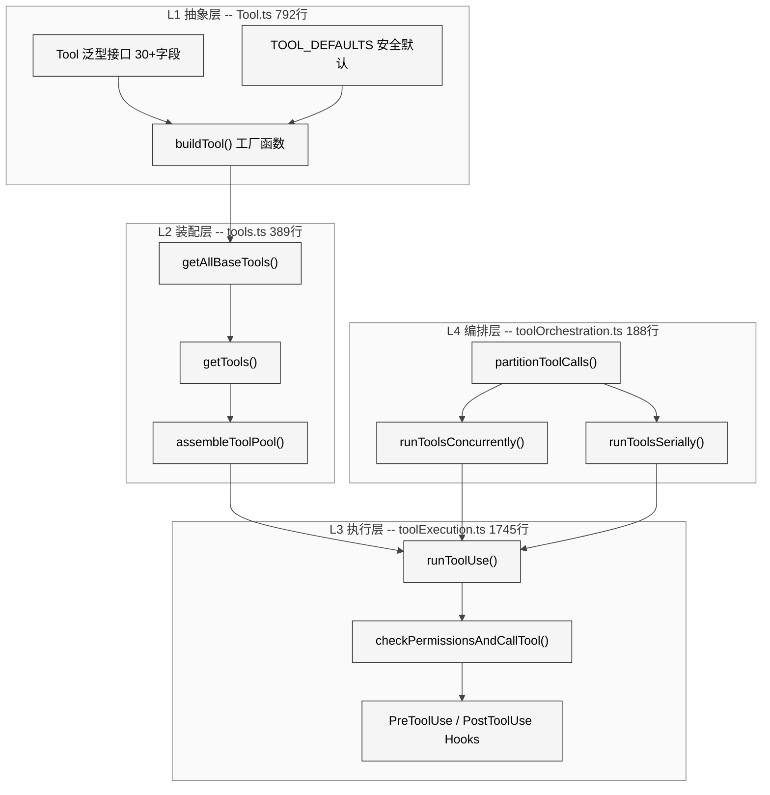
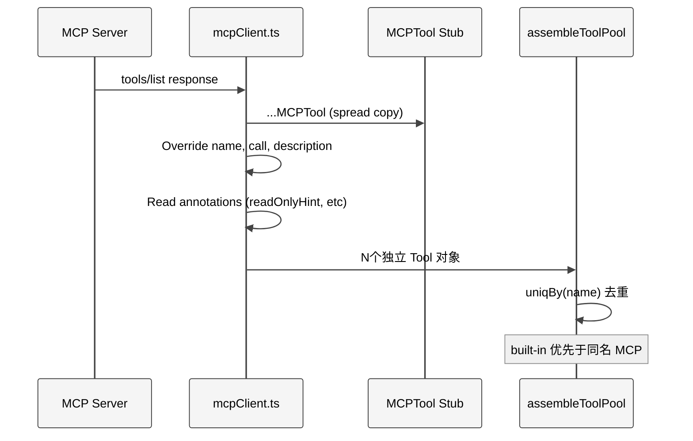
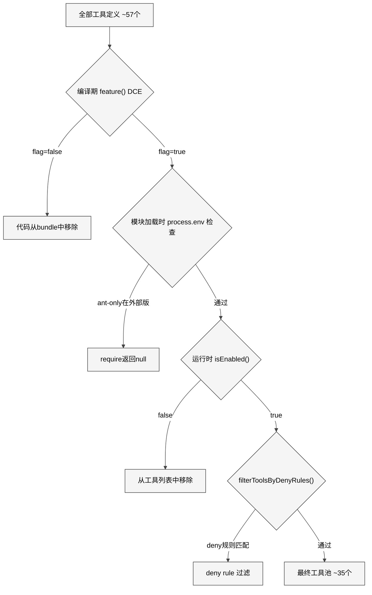
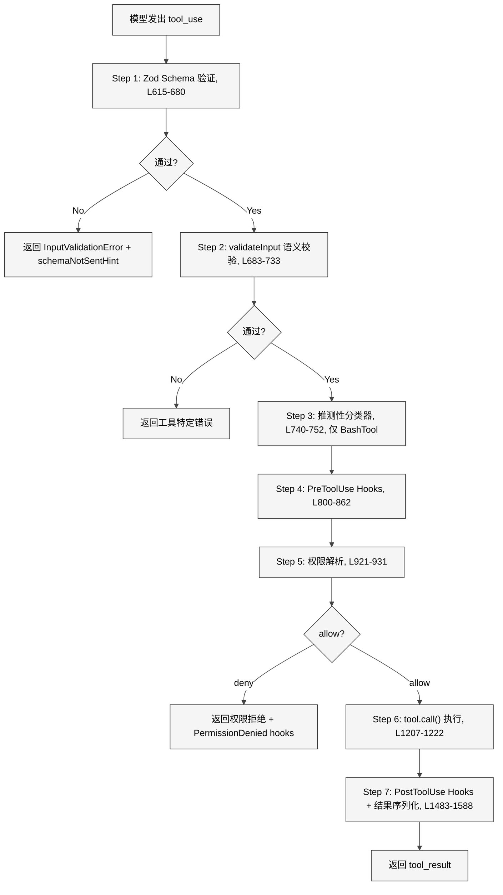
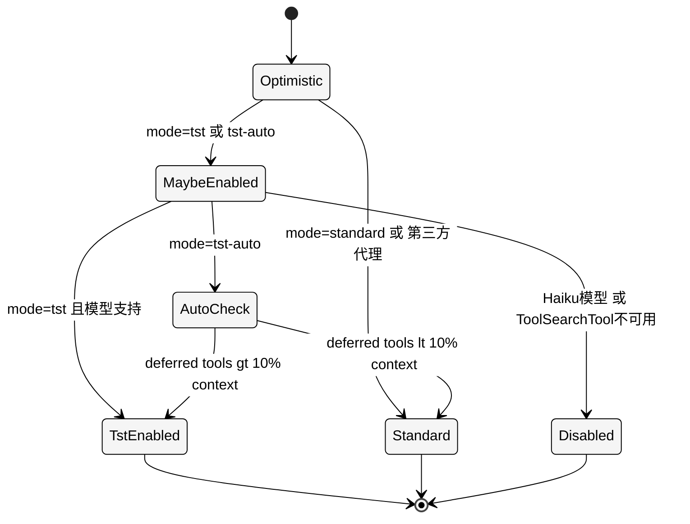
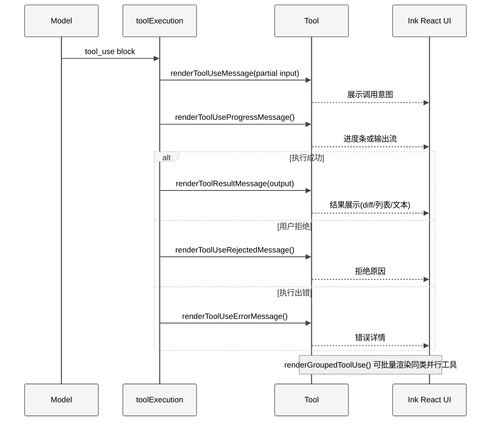

# 第 10 章 工具系统

> 核心提要：工具抽象与注册机制

---

## 9.1 定位

一个 AI Agent 与普通 chatbot 的本质区别在于：**Agent 能执行动作**。当模型决定读取一个文件、运行一条 Shell 命令、或搜索代码时，它依赖的是工具系统。工具系统是 agentic loop 的"肌肉"——模型通过 `tool_use` 块声明意图，工具系统负责验证、授权、执行、返回结果。

Claude Code 的工具系统管理着 42 个工具目录（`src/tools/` 下）中的 45+ 个内置工具，以及通过 MCP 协议动态接入的无限数量外部工具。在 restored-src v2.1.88 的 513,216 行 TypeScript 中，工具系统的核心基础设施由 6 个文件、4,520 行代码构成：

| 文件 | 行数 | 核心职责 |
|------|------|---------|
| `src/Tool.ts` | 792 | 类型基础：Tool 泛型接口 + buildTool() 工厂 + TOOL_DEFAULTS |
| `src/tools.ts` | 389 | 注册表：getAllBaseTools() + getTools() + assembleToolPool() |
| `src/services/tools/toolExecution.ts` | 1,745 | 执行引擎：7 步验证-权限-执行流水线 |
| `src/services/tools/toolOrchestration.ts` | 188 | 编排层：partitionToolCalls() 并发安全分区 |
| `src/services/tools/toolHooks.ts` | 650 | Hook 集成：PreToolUse / PostToolUse 生命周期 |
| `src/utils/toolSearch.ts` | 756 | 延迟发现：ToolSearch 启用策略与阈值计算 |

这 4,520 行代码是整个 51 万行系统中"杠杆率最高"的部分——它们定义了模型与物理世界交互的全部协议。

**本章结构**：9.2 节剖析架构设计哲学；9.3 节深入 `buildTool()` 的类型体操和 MCPTool 桩模式；9.4 节追踪从注册到执行的完整数据流；9.5 节分析防御性编程和性能优化；9.6 节横向对比竞品；9.7 节审视已知缺陷和未来方向。

---

## 9.2 架构

### 9.2.1 四层架构：从抽象到执行

工具系统由四层构成，每层有清晰的职责边界：

<div style="background: #ffffff; padding: 16px; border-radius: 8px; margin: 16px 0;">



</div>

这个四层架构的设计哲学是**关注点分离的极致**：

- **L1 抽象层**只定义"一个工具应该是什么样"，不关心有哪些具体工具
- **L2 装配层**只决定"当前环境下有哪些工具可用"，不关心工具怎么执行
- **L3 执行层**只处理"一个工具调用的完整生命周期"，不关心多个工具之间的关系
- **L4 编排层**只决定"多个工具调用的执行顺序"，不关心单个工具的内部逻辑

### 9.2.2 核心设计决策：工具是微服务，不是函数

在传统编程中，一个"工具"通常只是一个函数签名加一段执行逻辑。但 Claude Code 的 `Tool` 接口定义了 **30+ 个方法/属性**（`src/Tool.ts:362-695`），涵盖了从身份标识、输入验证、权限控制、执行逻辑、进度报告、UI 渲染、结果序列化到搜索发现的完整生命周期。

这不是过度工程。一个 AI Agent 的工具与传统 CLI 工具有根本区别：

| 维度 | 传统 CLI 工具 | AI Agent 工具 |
|------|-------------|-------------|
| 调用者 | 人类（有判断力） | 模型（可能犯错） |
| 输入校验 | 可以依赖用户自检 | 必须机器校验（模型会生成无效 JSON） |
| 权限模型 | OS 级别 ACL | 细粒度到每次调用的 allow/deny/ask |
| 并发安全 | 由调用者保证 | 系统必须自动判断 |
| UI 反馈 | stdout/stderr | React 组件渲染（进度条、diff 视图、文件列表） |
| 可发现性 | man page / --help | 模型通过名称 + 描述自主选择 |

正是这些区别，决定了每个工具必须是一个自描述、自校验、自渲染的**微服务**。

### 9.2.3 设计哲学：Fail-Closed 安全默认

`buildTool()` 的 `TOOL_DEFAULTS`（`src/Tool.ts:757-769`）体现了整个系统最重要的安全设计原则——**fail-closed**：

```typescript
// src/Tool.ts:757-769
const TOOL_DEFAULTS = {
  isEnabled: () => true,
  isConcurrencySafe: (_input?: unknown) => false,   // 假设不可并发
  isReadOnly: (_input?: unknown) => false,           // 假设会写入
  isDestructive: (_input?: unknown) => false,
  checkPermissions: (input, _ctx?) =>
    Promise.resolve({ behavior: 'allow', updatedInput: input }),
  toAutoClassifierInput: (_input?: unknown) => '',
  userFacingName: (_input?: unknown) => '',
}
```

**为什么 `isConcurrencySafe` 默认 `false`？** 如果工具作者忘了声明，系统会假设该工具不能与其他工具并行执行。后果是性能降级（本可并发的变成串行），但**不会**导致数据竞争。如果默认 `true`，忘记声明的写入工具就会被并发执行，可能导致文件损坏。

**为什么 `isReadOnly` 默认 `false`？** 同理。将写入工具错误标记为只读会绕过权限检查——安全漏洞比性能降级严重得多。

**为什么 `checkPermissions` 默认 `allow`？** 这看似违反 fail-closed 原则，但实际上默认的 `allow` 只是 "defer to general permission system"（将权限决策推给全局权限管线），而非绕过所有权限检查。全局管线仍然会检查 deny rules、ask rules、安全分类器等。

---

## 9.3 实现

### 9.3.1 buildTool()：一行运行时 + 六十行类型体操

`buildTool()` 的运行时逻辑只有一行（`src/Tool.ts:787-791`）：

```typescript
export function buildTool<D extends AnyToolDef>(def: D): BuiltTool<D> {
  return {
    ...TOOL_DEFAULTS,
    userFacingName: () => def.name,
    ...def,
  } as BuiltTool<D>
}
```

三层对象展开：先铺 `TOOL_DEFAULTS`，再用 `() => def.name` 覆盖空字符串的默认 `userFacingName`，最后用 `def`（工具自身定义）覆盖所有它选择实现的方法。如果工具定义了 `isReadOnly() { return true }`，它就覆盖默认的 `false`；如果没定义，保留安全的 `false`。

但真正精巧的部分在 **类型层**。`BuiltTool<D>` 类型（`src/Tool.ts:735-741`）在编译期精确地模拟了运行时的 spread 语义：

```typescript
// src/Tool.ts:735-741
type BuiltTool<D> = Omit<D, DefaultableToolKeys> & {
  [K in DefaultableToolKeys]-?: K extends keyof D
    ? undefined extends D[K]
      ? ToolDefaults[K]   // D 未提供 -- 用默认值类型
      : D[K]              // D 提供了 -- 用 D 的类型
    : ToolDefaults[K]
}
```

关键的 `-?` 语义：将所有 defaultable 方法标记为**必需**（去掉可选标记），因为 `buildTool()` 保证它们在输出对象上一定存在——要么来自工具定义，要么来自 `TOOL_DEFAULTS`。这让所有消费者都能安全地调用 `tool.isReadOnly(input)` 而无需 `?.()` 可选链。

`ToolDef` 类型（`src/Tool.ts:721-726`）则反向操作——用 `Partial<Pick<Tool, DefaultableToolKeys>>` 让这些方法在输入端变为可选：

```typescript
export type ToolDef<Input, Output, P> =
  Omit<Tool<Input, Output, P>, DefaultableToolKeys> &
  Partial<Pick<Tool<Input, Output, P>, DefaultableToolKeys>>
```

这对类型系统的巧用确保了：
1. 工具**定义时**可以省略默认方法（开发体验好）
2. 工具**使用时**所有方法一定存在（消费者安全）
3. TypeScript 编译器能**精确推断**每个方法的实际返回类型

整个工具系统 42 个工具目录、60+ 个 `buildTool()` 调用全部零类型错误通过编译——这是类型设计正确性的最好证明。

```mermaid
%%{init: {'theme': 'neutral', 'themeVariables': {'background': '#ffffff', 'primaryColor': '#f5f5f5', 'primaryTextColor': '#000000', 'primaryBorderColor': '#333333', 'lineColor': '#444444', 'textColor': '#000000', 'mainBkg': '#f5f5f5', 'nodeBorder': '#333333', 'clusterBkg': '#fafafa', 'clusterBorder': '#888888', 'edgeLabelBackground': '#ffffff'}}}%%
flowchart LR
    subgraph input ["ToolDef -- 输入端"]
        OPT["isEnabled? -- 可选"]
        OPT2["isConcurrencySafe? -- 可选"]
        OPT3["isReadOnly? -- 可选"]
        REQ["name, call, prompt -- 必需"]
    end
    BT["buildTool()"]
    subgraph output ["BuiltTool -- 输出端"]
        ALL1["isEnabled -- 必需, 默认true"]
        ALL2["isConcurrencySafe -- 必需, 默认false"]
        ALL3["isReadOnly -- 必需, 默认false"]
        ALL4["name, call, prompt -- 必需"]
    end
    input --> BT --> output
```

<div style="background: #ffffff; padding: 16px; border-radius: 8px; margin: 16px 0;">



</div>

### 9.3.2 GlobTool 实例剖析：一个典型工具的完整画像

以 `GlobTool`（`src/tools/GlobTool/GlobTool.ts:57-198`）为例，看一个中等复杂度工具如何使用 `buildTool()`：

```typescript
// src/tools/GlobTool/GlobTool.ts:57-198 (关键片段)
export const GlobTool = buildTool({
  name: GLOB_TOOL_NAME,
  searchHint: 'find files by name pattern or wildcard',
  maxResultSizeChars: 100_000,

  // Schema 延迟求值
  get inputSchema(): InputSchema { return inputSchema() },
  get outputSchema(): OutputSchema { return outputSchema() },

  // 覆盖默认值：声明为只读且可并发
  isConcurrencySafe() { return true },
  isReadOnly() { return true },

  // UNC 路径安全校验
  async validateInput({ path }): Promise<ValidationResult> {
    if (path) {
      const absolutePath = expandPath(path)
      if (absolutePath.startsWith('\\\\') || absolutePath.startsWith('//')) {
        return { result: true }
      }
      // 验证目录存在...
    }
    return { result: true }
  },

  // 权限委托给文件系统读取权限
  async checkPermissions(input, context) {
    return checkReadPermissionForTool(GlobTool, input, ...)
  },

  // 核心执行逻辑
  async call(input, { abortController, getAppState, globLimits }) {
    const { files, truncated } = await glob(
      input.pattern,
      GlobTool.getPath(input),
      { limit: globLimits?.maxResults ?? 100 },
      abortController.signal,
    )
    return { data: { filenames: files.map(toRelativePath), ... } }
  },

  // UI 渲染委托给独立文件
  renderToolUseMessage,       // 来自 ./UI.tsx
  renderToolResultMessage,    // 来自 ./UI.tsx
  renderToolUseErrorMessage,  // 来自 ./UI.tsx
} satisfies ToolDef<InputSchema, Output>)
```

这段代码展示了几个关键模式：

**模式一：`satisfies ToolDef<...>`**。TypeScript 4.9 的 `satisfies` 关键字确保对象结构符合 `ToolDef`，同时保留字面量类型推断。比 `as Tool` 更安全——`as` 会抹去具体类型信息，而 `satisfies` 在保留类型精度的同时做结构检查。

**模式二：UI 逻辑分离**。渲染方法来自独立的 `UI.tsx` 文件，工具定义文件只含业务逻辑。这遵循了 Claude Code 终端 UI 架构的一贯设计——业务逻辑与 Ink React 组件解耦。

**模式三：`get inputSchema()` + `lazySchema()`**。Zod schema 构造在模块加载时就会执行，但 CLI 工具需要极快的启动速度。`lazySchema` 将构造推迟到首次访问：

```typescript
// src/utils/lazySchema.ts (完整 8 行)
export function lazySchema<T>(factory: () => T): () => T {
  let cached: T | undefined
  return () => (cached ??= factory())
}
```

配合 getter `get inputSchema() { return inputSchema() }`，实现了 schema 的按需构造——启动时只注册工具名称，schema 在第一次实际使用时才构造和缓存。

### 9.3.3 MCPTool 桩模式：动态工具的原型链

MCP 工具的数量和种类在编译时完全未知。Claude Code 不可能为每个 MCP 工具写一个独立的文件，因此采用了**桩（Stub）模式**——一个占位空壳在运行时被真实属性覆盖。

`MCPTool`（`src/tools/MCPTool/MCPTool.ts`，77 行）是整个桩的定义。源码中反复出现 `// Overridden in mcpClient.ts` 注释：

```typescript
// src/tools/MCPTool/MCPTool.ts:27-77
export const MCPTool = buildTool({
  isMcp: true,
  name: 'mcp',                       // 占位名
  async description() { return DESCRIPTION },  // 占位描述
  async call() { return { data: '' } },        // 空实现
  async checkPermissions() {
    return { behavior: 'passthrough', message: 'MCPTool requires permission.' }
  },
  renderToolUseMessage,
  renderToolUseProgressMessage,
  renderToolResultMessage,
  // ...
})
```

运行时展开发生在 `src/services/mcp/client.ts:1767-1813` 的 `fetchToolsForClient` 函数中：

```typescript
// src/services/mcp/client.ts:1767-1813 (关键片段)
return toolsToProcess.map((tool): Tool => {
  const fullyQualifiedName = buildMcpToolName(client.name, tool.name)
  return {
    ...MCPTool,                              // 复制桩的全部属性
    name: fullyQualifiedName,                // 覆盖为真实名
    mcpInfo: { serverName: client.name, toolName: tool.name },
    searchHint: tool._meta?.['anthropic/searchHint'] ?? undefined,
    alwaysLoad: tool._meta?.['anthropic/alwaysLoad'] === true,
    async description() { return tool.description ?? '' },
    isConcurrencySafe() { return tool.annotations?.readOnlyHint ?? false },
    isReadOnly() { return tool.annotations?.readOnlyHint ?? false },
    isDestructive() { return tool.annotations?.destructiveHint ?? false },
    inputJSONSchema: tool.inputSchema as Tool['inputJSONSchema'],
    async checkPermissions() { return { behavior: 'passthrough' } },
    async call(input, ctx, ...) { /* 真实的 MCP server 调用 */ },
  }
})
```

这种展开运算符模式的优势明显：

1. **代码复用**：所有 MCP 工具共享同一套 UI 渲染（`renderToolUseMessage` 等）和结果处理逻辑
2. **动态扩展**：连多少 MCP server、每个 server 多少工具，完全在运行时决定
3. **类型安全**：桩满足 `Tool` 接口约束，展开后的对象自然也满足
4. **MCP 元数据透传**：`_meta['anthropic/searchHint']` 和 `_meta['anthropic/alwaysLoad']` 让 MCP server 能控制自己工具的搜索行为和加载策略

注意 `checkPermissions` 返回 `passthrough`——MCP 工具的权限不由工具自身决定，而是被上推到全局权限管线。这是因为 MCP 工具来自不受信的外部服务器，权限决策必须由 Claude Code 的安全基础设施统一处理。

<div style="background: #ffffff; padding: 16px; border-radius: 8px; margin: 16px 0;">



</div>

### 9.3.4 注册表三重门控：从编译期到运行时

`tools.ts` 是所有内置工具的单一注册来源（single source of truth）。`getAllBaseTools()`（`src/tools.ts:193-251`）使用三种不同的门控机制：

**门控一：编译期死代码消除（DCE）**

```typescript
// src/tools.ts:25-28
const SleepTool =
  feature('PROACTIVE') || feature('KAIROS')
    ? require('./tools/SleepTool/SleepTool.js').SleepTool
    : null
```

`feature()` 来自 `bun:bundle`（`src/tools.ts:104`），在 bundler 阶段求值。当 flag 为 `false` 时，整个 `require()` 分支（包括对应的源文件）被从最终 bundle 中彻底移除。这不仅节省包体积，还防止了功能泄露——feature-gated 工具的代码在外部构建版本中物理不存在。

**门控二：运行时环境变量**

```typescript
// src/tools.ts:16-19
const REPLTool =
  process.env.USER_TYPE === 'ant'
    ? require('./tools/REPLTool/REPLTool.js').REPLTool
    : null
```

区分 Anthropic 内部版（`ant`）和外部版。REPLTool、ConfigTool、TungstenTool、SuggestBackgroundPRTool 等只在内部版可用。

**门控三：运行时 `isEnabled()` 检查**

```typescript
// src/tools.ts:325-326
const isEnabled = allowedTools.map(_ => _.isEnabled())
return allowedTools.filter((_, i) => isEnabled[i])
```

每个工具的 `isEnabled()` 方法可以检查更复杂的运行时条件——GrowthBook feature flag 组合、环境变量交叉检查、依赖服务可用性等。

三层门控形成**递进过滤漏斗**：

<div style="background: #ffffff; padding: 16px; border-radius: 8px; margin: 16px 0;">



</div>

**一个容易被忽视的细节**：`tools.ts` 中有三处 lazy `require()` 用函数包装来打破循环依赖：

```typescript
// src/tools.ts:62-72
const getTeamCreateTool = () =>
  require('./tools/TeamCreateTool/TeamCreateTool.js')
    .TeamCreateTool as typeof import('./tools/TeamCreateTool/TeamCreateTool.js').TeamCreateTool
```

`as typeof import(...)` 同时保留了完整类型信息——不丢失类型安全的同时避免了模块加载时的循环。

### 9.3.5 assembleToolPool()：Prompt Cache 稳定性设计

`assembleToolPool()`（`src/tools.ts:345-367`）是最终工具池的组装点，它的排序策略值得特别关注：

```typescript
// src/tools.ts:354-366
// Sort each partition for prompt-cache stability, keeping built-ins as a
// contiguous prefix. The server's claude_code_system_cache_policy places a
// global cache breakpoint after the last prefix-matched built-in tool; a flat
// sort would interleave MCP tools into built-ins and invalidate all downstream
// cache keys whenever an MCP tool sorts between existing built-ins.
const byName = (a: Tool, b: Tool) => a.name.localeCompare(b.name)
return uniqBy(
  [...builtInTools].sort(byName).concat(allowedMcpTools.sort(byName)),
  'name',
)
```

注释清楚地解释了设计意图：API 服务端在 built-in 工具的最后一个位置设置了 cache breakpoint。如果 MCP 工具混入 built-in 区间（flat sort 会导致这种情况），就会让所有下游 cache key 失效。因此 built-in 和 MCP **分别排序后拼接**，确保 built-in 始终是一个连续的前缀。

`uniqBy('name')` 确保同名时 built-in 优先于 MCP——因为 `concat` 的顺序是 built-in 在前。这让用户可以用 deny rules 屏蔽内置工具，然后用同名的 MCP 工具替代。

---

## 9.4 工具执行全流程

### 9.4.1 七步执行流水线

`checkPermissionsAndCallTool()`（`src/services/tools/toolExecution.ts:599-1745`）实现了一个 7 步流水线。这是整个工具系统最关键的 1,146 行代码——每次工具调用都经过这条路径：

<div style="background: #ffffff; padding: 16px; border-radius: 8px; margin: 16px 0;">



</div>

每一步都有独立的错误处理和遥测日志。几个值得深入的细节：

**Step 1 的 `buildSchemaNotSentHint`**（`src/services/tools/toolExecution.ts:578-597`）。当 ToolSearch 机制启用时，deferred 工具的 schema 不在初始 prompt 中——模型必须先通过 ToolSearchTool 加载 schema 才能正确调用工具。如果模型跳过了这一步直接调用（常见于子 agent 或 compaction 后），Zod 验证会因为"expected array, got string"等错误而失败。裸错误信息对模型来说毫无意义，`buildSchemaNotSentHint` 追加了一条清晰的指令：

```
This tool's schema was not sent to the API... Load the tool first: call
ToolSearch with query "select:ToolName", then retry this call.
```

**Step 3 的推测性分类器**。对 Bash 命令，安全分类器在权限 UI 显示给用户的**同时**就启动了（`src/services/tools/toolExecution.ts:740-752`）：

```typescript
if (tool.name === BASH_TOOL_NAME && parsedInput.data && 'command' in parsedInput.data) {
  startSpeculativeClassifierCheck(
    (parsedInput.data as BashToolInput).command,
    appState.toolPermissionContext,
    toolUseContext.abortController.signal,
    toolUseContext.options.isNonInteractiveSession,
  )
}
```

这是一个经典的**推测执行**优化：当用户在权限对话框中考虑是否批准时，分类器已经在后台分析命令了。如果用户批准，分类器通常已经完成，消除了额外的等待时间。源码注释特意强调 UI indicator（setClassifierChecking）**不在这里设置**，避免对 auto-allow 的命令闪烁"classifier running"。

**Step 6 中 `_simulatedSedEdit` 的纵深防御**（L756-773）。`_simulatedSedEdit` 是一个内部字段，只应由权限系统在用户批准 sed 编辑操作后注入。但如果模型试图直接在 Bash 输入中构造这个字段来绕过权限检查，就会绕过安全机制。源码做了双重防御：Zod 的 `strictObject` 应该拒绝未知字段，但为了防止"future regressions"，执行层又额外做了一次 strip：

```typescript
// src/services/tools/toolExecution.ts:756-773
// Defense-in-depth: strip _simulatedSedEdit from model-provided Bash input.
if (tool.name === BASH_TOOL_NAME && '_simulatedSedEdit' in processedInput) {
  const { _simulatedSedEdit: _, ...rest } = processedInput
  processedInput = rest
}
```

### 9.4.2 并发安全分区算法

当模型一次返回多个 `tool_use` 调用时，`partitionToolCalls()`（`src/services/tools/toolOrchestration.ts:91-116`）决定执行顺序：

```typescript
function partitionToolCalls(toolUseMessages, toolUseContext): Batch[] {
  return toolUseMessages.reduce((acc: Batch[], toolUse) => {
    const tool = findToolByName(toolUseContext.options.tools, toolUse.name)
    const parsedInput = tool?.inputSchema.safeParse(toolUse.input)
    const isConcurrencySafe = parsedInput?.success
      ? (() => {
          try { return Boolean(tool?.isConcurrencySafe(parsedInput.data)) }
          catch { return false }  // 解析失败 -- 保守处理
        })()
      : false

    if (isConcurrencySafe && acc[acc.length - 1]?.isConcurrencySafe) {
      acc[acc.length - 1]!.blocks.push(toolUse)  // 合并到当前并发 batch
    } else {
      acc.push({ isConcurrencySafe, blocks: [toolUse] })  // 新 batch
    }
    return acc
  }, [])
}
```

算法是一个 **贪心连续合并**：扫描工具调用序列，将连续的并发安全工具合并为一个 batch，遇到不安全的就切割。例如：

```
[Glob, Grep, Grep, FileEdit, Glob, Grep]
→ Batch1(concurrent): [Glob, Grep, Grep]
→ Batch2(serial):     [FileEdit]
→ Batch3(concurrent): [Glob, Grep]
```

并发 batch 通过 `all()` 工具（`src/utils/generators.ts:32-89`）并行执行，最大并发度默认 10（通过 `CLAUDE_CODE_MAX_TOOL_USE_CONCURRENCY` 环境变量可配置，`src/services/tools/toolOrchestration.ts:8-12`）。

一个重要的约束在 `ToolResult` 类型（`src/Tool.ts:329-330`）：

```typescript
// contextModifier is only honored for tools that aren't concurrency safe.
contextModifier?: (context: ToolUseContext) => ToolUseContext
```

`contextModifier` 允许工具修改后续工具的执行上下文（例如 `cd` 命令改变工作目录）。但这个修改器**只对串行执行的工具生效**——并发 batch 中的工具无法互相修改上下文，它们的 modifier 在 batch 结束后按顺序应用（`src/services/tools/toolOrchestration.ts:42-63`）。

### 9.4.3 ToolSearch：延迟发现的动态机制

当 MCP 工具数量很多时，把所有工具定义塞进 system prompt 会消耗大量 token。ToolSearch 通过 **defer_loading + tool_reference** 机制解决这个问题。

**延迟判定逻辑**（`src/tools/ToolSearchTool/prompt.ts:62-108`）：

```typescript
export function isDeferredTool(tool: Tool): boolean {
  if (tool.alwaysLoad === true) return false      // MCP 可通过 _meta opt-out
  if (tool.isMcp === true) return true             // MCP 工具默认延迟
  if (tool.name === TOOL_SEARCH_TOOL_NAME) return false  // 搜索工具本身不能延迟
  // Fork subagent 实验：AgentTool 第一轮就需要
  if (feature('FORK_SUBAGENT') && tool.name === AGENT_TOOL_NAME) {
    if (m.isForkSubagentEnabled()) return false
  }
  return tool.shouldDefer === true
}
```

延迟工具只以名称列表形式告知模型。模型需要使用某个 deferred 工具时，先调用 `ToolSearchTool`。搜索支持两种模式：

1. **精确选择**：`select:Name1,Name2` — 按名称直接查找
2. **关键词搜索**：按 tool name 分词 + searchHint + description 综合评分

关键词评分权重体现了搜索策略（`src/tools/ToolSearchTool/ToolSearchTool.ts:259-301`）：

| 匹配位置 | MCP 工具得分 | 普通工具得分 |
|---------|------------|------------|
| name 部分精确匹配 | 12 | 10 |
| name 部分包含匹配 | 6 | 5 |
| searchHint 匹配 | 4 | 4 |
| description 匹配 | 2 | 2 |

MCP 工具在名称匹配上有更高的权重，因为 MCP 工具名的 server 部分（如 `mcp__slack__send_message` 中的 `slack`）是最有效的区分信号。

**启用策略分两层**。乐观检查 `isToolSearchEnabledOptimistic()`（`src/utils/toolSearch.ts:270-320`）在工具注册时使用，决定是否将 ToolSearchTool 放入工具列表。最终决策 `isToolSearchEnabled()`（`src/utils/toolSearch.ts:385-473`）在 API 调用前执行，额外检查模型兼容性（Haiku 不支持 `tool_reference`）和 `tst-auto` 模式的阈值判定。

乐观检查中有一个重要的**代理网关守卫**（`src/utils/toolSearch.ts:299-311`）：当 `ENABLE_TOOL_SEARCH` 未显式设置、且 `ANTHROPIC_BASE_URL` 指向非 Anthropic 第一方地址时，ToolSearch 被禁用。注释引用了 GitHub issue #30912 和 #31936，说明这是从真实 bug 中学来的教训——第三方代理通常不支持 `tool_reference` beta content type。

`tst-auto` 模式计算所有 deferred 工具定义占上下文窗口的比例，超过阈值（默认 10%）才启用（`src/utils/toolSearch.ts:104-109`）：

```typescript
function getAutoToolSearchTokenThreshold(model: string): number {
  const contextWindow = getContextWindowForModel(model, betas)
  const percentage = getAutoToolSearchPercentage() / 100
  return Math.floor(contextWindow * percentage)
}
```

<div style="background: #ffffff; padding: 16px; border-radius: 8px; margin: 16px 0;">



</div>

### 9.4.4 ToolUseContext：Agent 隔离的上下文容器

每次工具调用接收的 `ToolUseContext`（`src/Tool.ts:158-300`）是一个 142 行的庞大类型。它不只是参数包——它是工具执行的**完整运行时环境**，包含 `abortController`、`readFileState`（LRU 文件缓存）、`getAppState/setAppState`、`messages`、`toolDecisions`、`contentReplacementState` 等。

最关键的设计在于 `setAppState` 的**子 agent 隔离**。注释（`src/Tool.ts:184-192`）说明：

```typescript
// Always-shared setAppState for session-scoped infrastructure (background
// tasks, session hooks). Unlike setAppState, which is no-op for async agents
// (see createSubagentContext), this always reaches the root store so agents
// at any nesting depth can register/clean up infrastructure that outlives
// a single turn.
setAppStateForTasks?: (f: (prev: AppState) => AppState) => void
```

子 agent 的 `setAppState` 被 `createSubagentContext()` 替换为 no-op，实现了**状态隔离**——子 agent 不能修改主线程的全局状态。但 `setAppStateForTasks` 是"始终共享"的，让子 agent 能注册/清理后台任务等需要在 agent 生命周期之外存在的基础设施。

另一个值得注意的字段是 `localDenialTracking`（L279-283）——为 `setAppState` 为 no-op 的异步子 agent 提供本地的权限拒绝计数。没有这个字段，否定计数器永远不会累积，"fallback-to-prompting"阈值永远不会触发。

---

## 9.5 细节

### 9.5.1 六种防御性编程模式

工具系统中的防御性编程不是"以防万一"——每一个都对应着真实的风险场景：

**模式一：Fail-Closed 默认值**（前述 TOOL_DEFAULTS）。防的是工具作者的遗忘。

**模式二：`_simulatedSedEdit` Strip**（`toolExecution.ts:756-773`）。防的是模型通过构造内部字段绕过权限系统。这是经典的**纵深防御**——即使 Zod `strictObject` 拒绝了非法字段，执行层仍然做二次检查。

**模式三：UNC 路径安全检查**（`GlobTool.ts:101`）。GlobTool 的 `validateInput` 中有一段看似奇怪的代码——检测 `\\` 或 `//` 开头的路径并跳过文件系统操作。注释解释了原因：

```typescript
// SECURITY: Skip filesystem operations for UNC paths to prevent NTLM credential leaks.
if (absolutePath.startsWith('\\\\') || absolutePath.startsWith('//')) {
  return { result: true }
}
```

在 Windows 上，访问 UNC 路径（如 `\\malicious-server\share`）会触发 NTLM 认证握手，可能泄露用户凭据。如果模型被诱导搜索一个恶意 UNC 路径，就会发生凭据泄露。

**模式四：`backfillObservableInput` 的浅克隆防护**（`toolExecution.ts:784-793`）。某些工具（如 SendMessageTool）需要向输入对象添加遗留/派生字段供 hooks 和 canUseTool 看到。但直接修改原始输入会改变序列化的 transcript 和 VCR fixture 哈希。解决方案是先浅克隆，backfill 在克隆上操作，`call()` 仍然接收原始输入。

**模式五：`isConcurrencySafe` 的 try-catch**（`toolOrchestration.ts:100-107`）。`isConcurrencySafe()` 可能因为 shell-quote 解析失败而抛异常。分区算法用 try-catch 包裹，异常时保守地返回 `false`。

**模式六：`buildSchemaNotSentHint` 的优雅降级**（`toolExecution.ts:578-597`）。当 deferred 工具的 schema 未被加载就被调用时，Zod 验证错误对模型毫无帮助。系统检测到这种情况后追加一条清晰的指令，引导模型先用 ToolSearchTool 加载 schema。

### 9.5.2 性能优化策略

**`lazySchema` 延迟 Zod 构造**。8 行代码解决了一个实际问题：42 个工具的 Zod schema 如果在模块加载时全部构造，会拖慢 CLI 启动速度。`lazySchema` 将构造推迟到首次使用。

**`memoizeWithLRU` 缓存 MCP 工具定义**。`fetchToolsForClient`（`src/services/mcp/client.ts:1743`）用 LRU 缓存避免重复的 `tools/list` RPC 调用。缓存以 server name 为 key，在 reconnect 时显式清除（`client.ts:1389`）。

**推测性分类器并行**。Bash 命令的安全分类（side_query）在权限对话框显示的同时启动，利用用户思考时间完成分类。源码注释（`toolExecution.ts:937-946`）甚至区分了 auto 模式和 default 模式的计时语义——default 模式的"权限等待时间"包含了用户思考时间，记录为"慢"没有意义。

**Prompt Cache 稳定排序**。`assembleToolPool` 的排序设计（前述）直接影响 API 成本——cache hit $0.003 vs cache miss $0.60，200 倍成本差距。

**并发控制上限**。`getMaxToolUseConcurrency()` 默认 10（`toolOrchestration.ts:8-12`），通过环境变量可调。过高的并发会导致文件系统 I/O 竞争和终端渲染瓶颈，10 是经验值。

### 9.5.3 UI 渲染协议

工具接口定义了 1 个必需 + 5 个可选的 render 方法，加上 `renderToolUseTag`、`isResultTruncated`、`extractSearchText` 等辅助方法，构成了完整的 UI 生命周期协议：

<div style="background: #ffffff; padding: 16px; border-radius: 8px; margin: 16px 0;">



</div>

`renderToolUseMessage` 接收 `Partial<z.infer<Input>>`——因为在流式 streaming 中，工具参数可能尚未完全到达就需要开始渲染。这让 BashTool 可以在命令字符串还在 streaming 时就显示"Running..."，FileEditTool 可以在 diff 还在传输时就显示文件路径。

`isResultTruncated(output)` 门控了 fullscreen 模式的"点击展开"功能——只有 `verbose` 模式确实会显示更多内容的工具结果才启用交互，避免对已完整显示的结果添加无意义的展开按钮。

`extractSearchText(output)` 用于 transcript 搜索索引。注释（`src/Tool.ts:582-598`）详细解释了"phantom text"问题——如果这个方法返回的文本在实际渲染中不可见，搜索计数和高亮就会不一致。有专门的测试 `transcriptSearch.renderFidelity.test.tsx` 捕获这类 drift。

---

## 9.6 比较

### 9.6.1 横向对比

| 维度 | Claude Code | Cursor | Aider | Cline | Codex CLI |
|------|------------|--------|-------|-------|-----------|
| 内置工具数 | 45+ | ~15 | ~8 | ~10 | ~8 |
| 工具接口统一性 | 30+ 字段的完整接口 | 简化接口 | 无统一接口 | 简化接口 | 简化接口 |
| 外部扩展 | MCP 协议 | MCP 协议 | 无 | MCP 协议 | MCP 协议 |
| 权限粒度 | 每工具每输入 + hooks | 全局 approve/deny | 全局开关 | 每工具 | 每工具 |
| 并发控制 | 显式 isConcurrencySafe 标志 | 未公开 | 串行 | 串行 | 未公开 |
| 延迟加载 | ToolSearch + tool_reference | 无 | 无 | 无 | 无 |
| 安全分类器 | toAutoClassifierInput | 无 | 无 | 无 | 无 |
| UI 渲染协议 | 6 个 render 方法 + Ink React | VS Code native | 终端文本 | VS Code webview | 终端文本 |
| 编译期 DCE | bun:bundle feature() | 无（运行时 flag） | 无 | 无 | 无 |

### 9.6.2 Claude Code 的核心优势

**优势一：ToolSearch 的延迟加载是独有设计**。其他所有竞品在 MCP 工具接入时都将全部工具定义一次性加载到 system prompt。当连接多个 MCP server、工具数超过 50 时，token 消耗急剧增长。Claude Code 通过 `defer_loading: true` + `tool_reference` 将 token 开销从 O(N * schema_size) 降低到 O(N * name_length)——这是一个 10-100 倍的差异。

**优势二：Fail-Closed 的默认值设计成为行业标杆**。大多数 Agent 框架要么没有默认值机制（每个工具必须手动声明所有属性），要么默认值不够保守（默认可并发、默认只读）。Claude Code 的 `buildTool()` + `TOOL_DEFAULTS` 在"零配置安全"和"最小样板代码"之间找到了最佳平衡。

**优势三：并发分区算法的实用性**。Aider 和 Cline 的工具执行完全串行，浪费了大量可并行的搜索/读取操作。Claude Code 的 `partitionToolCalls()` 用 7 行核心逻辑实现了安全的贪心并发——连续的只读工具自动合并为并发 batch，写入工具自动串行。

### 9.6.3 Claude Code 的局限

**局限一：MCP 工具和内置工具的代码路径分叉**。源码中有一个显式的 `TOOD(hackyon)`（注意这个拼写错误是原文如此，`src/services/tools/toolExecution.ts:1476`）：

```typescript
// TOOD(hackyon): refactor so we don't have different experiences for MCP tools
if (!isMcpTool(tool)) {
  await addToolResult(toolOutput, mappedToolResultBlock)
}
```

MCP 工具的结果处理需要等待 PostToolUse hooks 可能修改输出后再序列化，而内置工具可以提前序列化。这种分叉导致了 MCP 工具的 hook 行为与内置工具不完全一致，是一个已知的技术债务。

**局限二：ToolSearch 依赖 API 端的 beta 特性**。`tool_reference` 是一个 beta content type，第三方代理（如 LiteLLM 的某些配置）可能不支持。`isToolSearchEnabledOptimistic` 中的代理网关守卫（L299-311）是一个 workaround——它通过检测 `ANTHROPIC_BASE_URL` 来猜测代理是否支持 beta 特性。注释引用了 `#30912` 和 `#31936` 两个 GitHub issue，说明这个问题已经在真实用户中造成了 regression。

---

## 9.7 辨误

### 9.7.1 误解一："Claude Code 的工具系统很简单"

社区中一些初级分析文章（如 shareAI-lab 的"Bash is all you need"复刻）认为 Claude Code 的工具系统就是"调用 bash 返回结果"。这种观点忽略了 4,520 行核心基础设施所处理的复杂性——输入验证、权限管线、并发分区、推测性分类、Hook 生命周期、延迟发现、Prompt Cache 排序、结果大小管理（`maxResultSizeChars` + 磁盘持久化）。

核心循环确实简洁——`while(tool_use) → execute → feed back`。但这个"简洁循环"运行在一个极其精密的执行引擎之上。类比操作系统：`read(fd, buf, count)` 系统调用的接口也很简洁，但背后是页缓存、文件系统、I/O 调度器。

### 9.7.2 误解二："MCP 工具和内置工具完全等价"

从模型的视角看，MCP 工具和内置工具确实通过相同的 `tool_use` / `tool_result` 协议交互。但从工具系统内部看，两者有三个关键差异：

1. **权限模型不同**：内置工具可以自定义 `checkPermissions`（如 GlobTool 委托给 `checkReadPermissionForTool`），MCP 工具一律返回 `passthrough`，权限决策完全由全局管线处理
2. **结果处理路径分叉**：MCP 工具的 PostToolUse hooks 可以修改输出（`updatedMCPToolOutput`），内置工具的输出在 hook 之前就已序列化
3. **Schema 来源不同**：内置工具用 Zod（`inputSchema`），MCP 工具直接用 JSON Schema（`inputJSONSchema`），避免了 Zod 和 JSON Schema 之间的转换损失

### 9.7.3 误解三："buildTool() 是不必要的抽象"

有人认为直接导出对象字面量也能工作，`buildTool()` 只是一层不必要的封装。这种观点忽略了两个关键价值：

1. **安全默认值注入**：如果 42 个工具中有任何一个忘记声明 `isConcurrencySafe`，直接导出就意味着运行时访问 `tool.isConcurrencySafe` 会返回 `undefined`，调用方需要处理 `undefined` case。`buildTool()` 消除了这个可能性。
2. **类型精确性**：`BuiltTool<D>` 的条件映射类型确保输出类型**精确反映**运行时语义——提供了的方法用工具自身的类型，未提供的用默认值的类型。如果没有这层类型体操，要么所有方法的返回类型都退化为 union（类型不精确），要么需要 60+ 处手动类型断言（维护噩梦）。

---

## 9.8 展望

### 9.8.1 源码中的已知问题

**TODO：`outputSchema` 应变为必需**（`src/Tool.ts:398`）：

```
// Optional because TungstenTool doesn't define this. TODO: Make it required.
```

TungstenTool（ant-only 的虚拟终端工具）是唯一不定义 `outputSchema` 的工具，导致整个接口被迫将其标记为可选。这个 TODO 表明团队希望统一要求所有工具声明输出 schema，但 ant-only 工具的向后兼容阻碍了推进。

**TOOD（拼写错误）：MCP 工具路径统一**（`toolExecution.ts:1476`）：

```
// TOOD(hackyon): refactor so we don't have different experiences for MCP tools
```

MCP 和非 MCP 工具的 PostToolUse 结果处理分叉是最大的技术债务。统一路径需要重构 hook 系统让所有工具的输出都能在序列化前被 hook 修改。

### 9.8.2 潜在瓶颈

**ToolSearch 的搜索质量**。当前的关键词搜索基于分词 + 正则匹配，没有语义理解。如果用户连了一个"weather forecast"的 MCP server，但模型搜索"天气预报"（中文），搜索不会命中。随着全球用户增长和多语言场景增多，这可能成为瓶颈。

**`assembleToolPool` 的 O(N log N) 排序**。每次 API 调用都重新排序全部工具。当工具数达到数百时（多个 MCP server），排序开销可能可察觉。但考虑到 API 调用本身的网络延迟，这个优化优先级较低。

**`ToolUseContext` 的膨胀**。142 行的类型定义意味着每次工具调用都传递一个庞大的上下文对象。随着功能增加（如 `criticalSystemReminder_EXPERIMENTAL`、`preserveToolUseResults`、`localDenialTracking`），这个对象会继续膨胀。未来可能需要将其拆分为必需核心 + 可选扩展的组合。

### 9.8.3 如果重新设计

1. **工具生命周期 Hook 标准化**。当前的 PreToolUse/PostToolUse hooks 是外部配置（settings.json），但 MCP 工具的 PostToolUse 修改输出的能力是硬编码在 `toolExecution.ts` 中的。应该将"工具输出后处理"统一为一个标准 hook 接口。

2. **Schema 统一到 JSON Schema**。当前内置工具用 Zod、MCP 工具用 JSON Schema 的双轨制增加了复杂性。考虑到 API 层面工具定义本身就是 JSON Schema，应该考虑让所有工具直接使用 JSON Schema + 独立的验证器。

3. **ToolSearch 语义增强**。可以在 `searchHint` 之外引入轻量级的 embedding 索引，支持跨语言的语义搜索。这不需要向量数据库——几百个工具的 embedding 可以直接放在内存中做余弦相似度。

4. **ToolUseContext 分层**。将当前的单体 context 拆分为 `CoreContext`（name, abortController, messages）+ `SecurityContext`（permissions, toolDecisions）+ `RenderContext`（setToolJSX, theme）+ `ExtensionContext`（hooks, MCP meta），按需组合。

---

## 9.9 小结

### 五条核心 Takeaway

1. **工具不是函数，是微服务**。Claude Code 的 `Tool` 接口用 30+ 个方法定义了一个自描述、自校验、自渲染的完整执行单元。这个设计决策看似过度工程，实际上是 AI Agent 场景（非人类调用者、细粒度权限、流式 UI）的必然要求。

2. **安全默认值是唯一正确的选择**。`TOOL_DEFAULTS` 的 fail-closed 策略——`isConcurrencySafe: false`、`isReadOnly: false`——确保工具作者的遗忘不会导致安全漏洞或数据竞争，只会导致性能降级。对于任何管理 Agent 工具的系统，这应该是不可协商的设计原则。

3. **编译期 DCE + 运行时门控 + isEnabled() 三层过滤漏斗**是管理 feature-gated 工具的最佳实践。编译期移除代码（防泄露）、运行时移除工具（按环境配置）、`isEnabled()` 动态检查（按运行状态）——三层各司其职，互不干扰。

4. **ToolSearch 的 defer_loading + tool_reference 机制**是当前 AI Agent 领域唯一的生产级工具延迟发现方案。它将 MCP 工具的 token 开销从 O(N * schema_size) 降到 O(N * name_length)，使得连接数十个 MCP server 变得经济可行。

5. **Prompt Cache 稳定性必须在架构层面设计**。`assembleToolPool()` 的分区排序不是优化——它是一个影响 200 倍成本差距的架构决策。任何构建 AI Agent 工具系统的团队都应该在第一天就考虑工具列表的缓存稳定性。

### 对 Agent 开发者的实践建议

- 如果你在构建 Agent 工具系统，从 `buildTool()` 模式开始——用一个工厂函数 + 安全默认值确保每个工具都"生而安全"
- 如果你的工具数超过 20 个，提前设计延迟发现机制——全量加载的 token 成本会在用户毫不知情的情况下飙升
- 如果你支持外部工具扩展（MCP 或其他协议），桩模式（stub + spread override）是最优的代码复用策略
- 并发安全必须由工具自身声明，不能由框架猜测——`isConcurrencySafe` 这种显式标志比任何启发式算法都可靠
