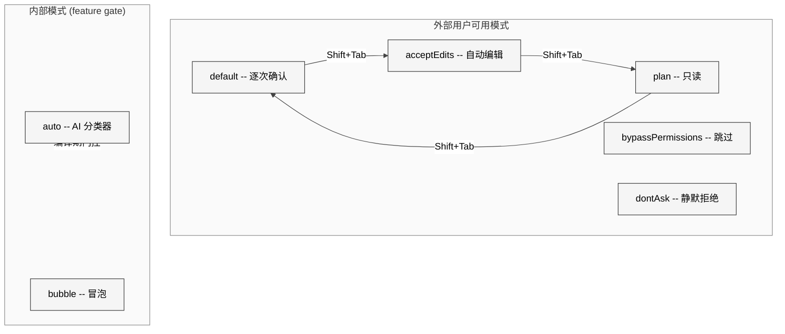
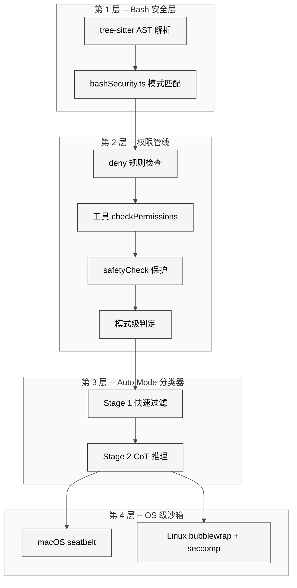
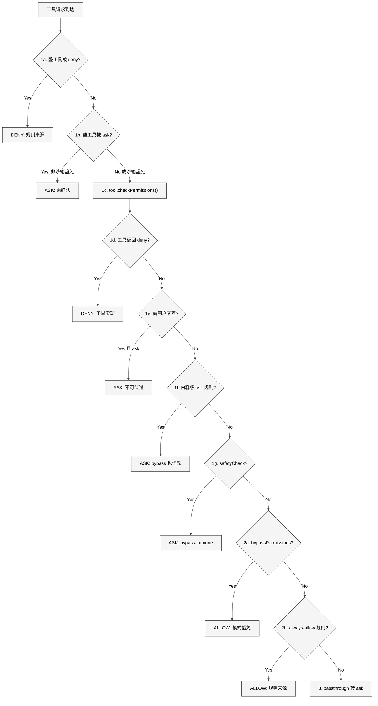
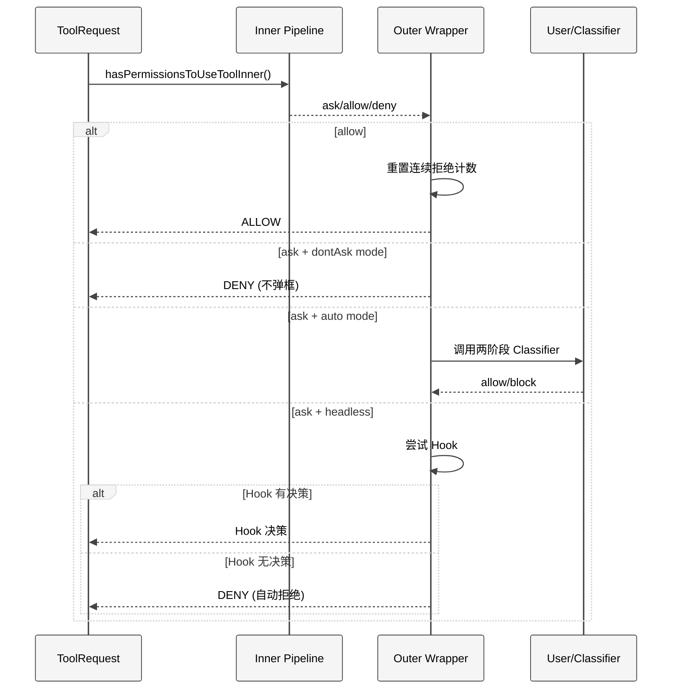
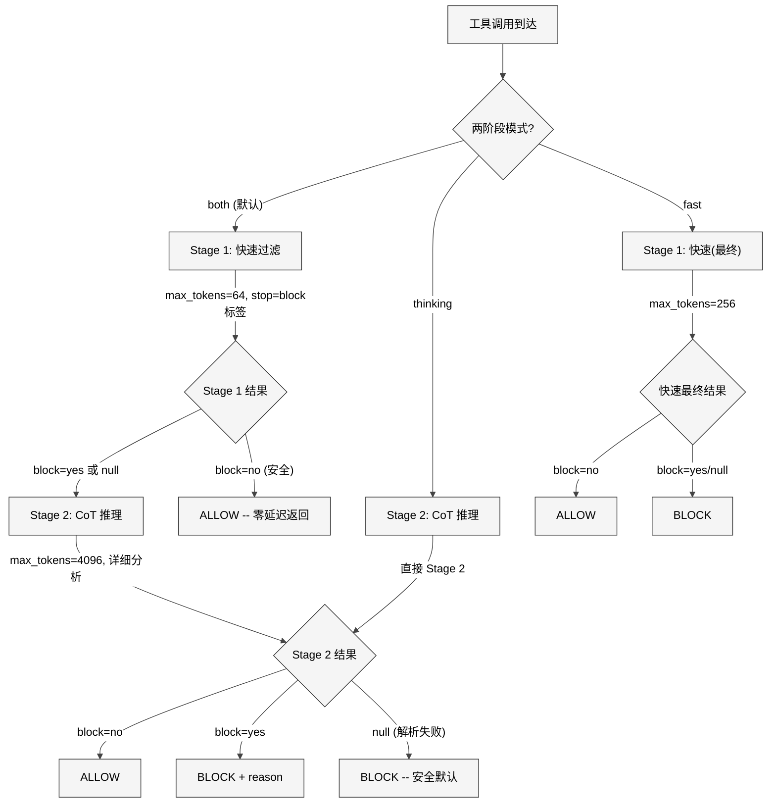

# 第 12 章 权限系统

> 核心提要：权限与沙箱的分层判定

---

## 16.1 定位

Claude Code 权限系统的总代码量约 9,400 行 TypeScript（`src/utils/permissions/` 目录下 24 个文件），加上 44 个 UI 组件（`src/components/permissions/`）和沙箱适配层（`src/utils/sandbox/`），构成了整个 Agent 运行时最关键的安全基础设施。

传统 CLI 工具的安全模型很简单——用户敲什么就执行什么，责任在用户。但 AI Agent 颠覆了这个范式：**模型自主决定执行什么操作**。用户说"帮我重构这个项目"，模型可能决定删除文件、执行 shell 命令、修改 `.gitconfig`——这些操作的风险谱系从无害到灾难性。权限系统的根本使命是在这条谱系上划出动态边界：**既不让用户被审批对话框淹没，又不让 AI 越权操作**。

在 Claude Code 整体架构中，权限系统处于工具执行管线的"咽喉"位置——每一次工具调用都必须经过 `hasPermissionsToUseTool()` 的裁决。它不是可选的安全层，而是工具执行的前置条件。

**本章结构**：16.2 节分析架构设计与设计哲学，16.3 节深入核心管线的实现细节，16.4 节剖析 Auto Mode 的两阶段分类器，16.5 节讨论文件系统路径验证，16.6 节回应社区争议与纠正误解，16.7 节分析仍存在的问题与未来方向，16.8 节总结核心 takeaway。

---

## 16.2 架构

### 16.2.1 七种权限模式

权限模式是用户表达全局信任级别的机制。定义在 `src/types/permissions.ts` L16-36：

```typescript
export const EXTERNAL_PERMISSION_MODES = [
  'acceptEdits', 'bypassPermissions', 'default', 'dontAsk', 'plan',
] as const

export type InternalPermissionMode = ExternalPermissionMode | 'auto' | 'bubble'
```

其中 `auto` 模式通过编译期门控 `feature('TRANSCRIPT_CLASSIFIER')` 控制——外部构建中这个模式的代码会被 Dead Code Elimination 完全移除。这是一个精巧的设计：**同一份源码支持内外两种安全策略**。

| 模式 | 信任级别 | 行为语义 | 适用场景 |
|------|---------|----------|---------|
| `default` | 最低 | 每个非只读操作需用户确认 | 标准交互模式 |
| `plan` | 只读 | 只能读取和搜索，写入需确认 | 规划阶段 |
| `acceptEdits` | 中等 | 工作目录内文件编辑自动允许 | `--accept-edits` |
| `bypassPermissions` | 高 | 跳过大部分检查（safety check 仍生效） | `--dangerously-skip-permissions` |
| `dontAsk` | 特殊 | ask 自动转为 deny，不弹对话框 | 非交互/后台环境 |
| `auto` | 智能 | 用两阶段 AI Classifier 判断操作安全性 | 研究预览 |
| `bubble` | 内部 | 权限提示冒泡到父终端 | Fork 子 Agent |

<div style="background: #ffffff; padding: 16px; border-radius: 8px; margin: 16px 0;">



</div>

### 16.2.2 规则系统：八源三行为

规则是"细粒度"控制的核心。每条规则由三元组构成（`src/types/permissions.ts` L75-79）：

```typescript
export type PermissionRule = {
  source: PermissionRuleSource   // 8 种来源
  ruleBehavior: PermissionBehavior  // allow | deny | ask
  ruleValue: PermissionRuleValue    // toolName + 可选 ruleContent
}
```

规则来源的加载顺序定义在 `src/utils/permissions/permissions.ts` L109-114：

```typescript
const PERMISSION_RULE_SOURCES = [
  ...SETTING_SOURCES,  // userSettings, projectSettings, localSettings,
                       // flagSettings, policySettings
  'cliArg',    // --allowedTools / --disallowedTools
  'command',   // 斜杠命令
  'session',   // 当前会话临时授权
] as const
```

**关键设计细节**：`SETTING_SOURCES` 的合并语义是"后覆盖前"（policySettings 最高），但权限规则的实际匹配是**所有来源 flatMap 后按序扫描，第一个匹配即返回**。由此可见来源优先级本质上由数组顺序决定。

### 16.2.3 纵深防御架构总览

<div style="background: #ffffff; padding: 16px; border-radius: 8px; margin: 16px 0;">



</div>

**设计哲学**：每一层都假设上一层可能被绕过。Bash 安全层阻止了大部分危险命令，但权限管线不依赖它；权限管线拦截了未授权操作，但 Auto Mode 分类器不信任它的 passthrough 结果；分类器做出判断，但沙箱不依赖分类器——即使所有上层失效，seatbelt/bubblewrap 仍然限制了文件系统和网络访问。

---

## 16.3 实现深度剖析：七步权限管线

权限管线的核心是 `hasPermissionsToUseToolInner()` 函数（`src/utils/permissions/permissions.ts` L1158-1319），它按严格的优先级顺序执行七步检查。

### 16.3.1 内层管线的七个检查步骤

<div style="background: #ffffff; padding: 16px; border-radius: 8px; margin: 16px 0;">



</div>

**关键设计决策**：步骤 1f 和 1g 位于步骤 2a（bypass 检查）**之前**。由此可见：

1. 用户显式配置的 `ask` 规则（如 `Bash(npm publish:*)`），**即使在 bypass 模式下也会触发确认**
2. Safety check（保护 `.git/`、`.claude/` 等路径），**在 bypass 模式下也不会被跳过**

源码中对此有清晰注释（L1238-1243）：

```typescript
// 1f. Content-specific ask rules from tool.checkPermissions take precedence
// over bypassPermissions mode. When a user explicitly configures a
// content-specific ask rule (e.g. Bash(npm publish:*)), the tool's
// checkPermissions returns {behavior:'ask', decisionReason:{type:'rule',
// rule:{ruleBehavior:'ask'}}}. This must be respected even in bypass mode,
// just as deny rules are respected at step 1d.
```

### 16.3.2 外层包装：模式级变换

`hasPermissionsToUseTool()`（L473-956）对内层返回的 `ask` 决策进行模式级变换：

<div style="background: #ffffff; padding: 16px; border-radius: 8px; margin: 16px 0;">



</div>

注意 L519-520 的注释揭示了一个重要的设计选择：

```typescript
// Apply auto mode: use AI classifier instead of prompting user
// Check this BEFORE shouldAvoidPermissionPrompts so classifiers work in headless mode
```

Auto mode 检查在 headless 检查**之前**，由此可见即使在无人值守的后台 Agent 中，分类器仍然可以做出安全判断。

### 16.3.3 规则解析：三种 Shell 匹配模式

`src/utils/permissions/shellRuleMatching.ts` 定义了三种匹配模式：

```typescript
export type ShellPermissionRule =
  | { type: 'exact'; command: string }      // 精确匹配: "git status"
  | { type: 'prefix'; prefix: string }      // 前缀匹配: "npm:*"（旧语法）
  | { type: 'wildcard'; pattern: string }   // 通配符匹配: "git *"
```

通配符匹配的实现（`matchWildcardPattern`，L90-153）有一个精妙细节——当模式以 `' *'` 结尾且只有一个通配符时，尾部的"空格+参数"变为可选：

```typescript
const unescapedStarCount = (processed.match(/\*/g) || []).length
if (regexPattern.endsWith(' .*') && unescapedStarCount === 1) {
  regexPattern = regexPattern.slice(0, -3) + '( .*)?'
}
```

这使得规则 `git *` 同时匹配 `git add`（有参数）和 `git`（无参数），与旧的前缀语法 `git:*` 语义对齐。

### 16.3.4 规则解析器的转义机制

`src/utils/permissions/permissionRuleParser.ts` 处理规则字符串的解析，支持括号转义。关键函数 `permissionRuleValueFromString()`（L93-133）：

```typescript
// "Bash()" 和 "Bash(*)" 都被归约为 { toolName: 'Bash' }（整工具级规则）
if (rawContent === '' || rawContent === '*') {
  return { toolName: normalizeLegacyToolName(toolName) }
}
```

`normalizeLegacyToolName()` 确保旧工具名到新名的映射（`Task` -> `Agent`、`KillShell` -> `TaskStop`），防止用户旧配置失效。

---

## 16.4 Auto Mode：两阶段 AI 分类器

Auto Mode 是权限系统中技术含量最高的部分——它用一个**独立的 AI 模型**来判断主模型请求的操作是否安全。

### 16.4.1 三层快速通道

在调用分类器 API 之前，系统先检查三个快速通道以避免昂贵的 API 调用（`permissions.ts` L600-686）：

**快速通道 1：acceptEdits 模拟**。如果操作在 `acceptEdits` 模式下会被允许（如工作目录内的文件编辑），直接放行。但 Agent 和 REPL 工具被**显式排除**：

```typescript
// Skip for Agent and REPL — their checkPermissions returns 'allow' for
// acceptEdits mode, which would silently bypass the classifier. REPL
// code can contain VM escapes between inner tool calls
if (tool.name !== AGENT_TOOL_NAME && tool.name !== REPL_TOOL_NAME) {
```

**快速通道 2：安全工具白名单**。`src/utils/permissions/classifierDecision.ts` L56-94 定义了不需要分类器检查的安全工具：

```typescript
const SAFE_YOLO_ALLOWLISTED_TOOLS = new Set([
  FILE_READ_TOOL_NAME,    // 只读文件操作
  GREP_TOOL_NAME,         // 搜索
  GLOB_TOOL_NAME,         // 文件查找
  TODO_WRITE_TOOL_NAME,   // TODO 管理（元数据）
  TASK_CREATE_TOOL_NAME,  // 任务创建
  ASK_USER_QUESTION_TOOL_NAME,  // 用户交互
  ENTER_PLAN_MODE_TOOL_NAME,    // 模式切换
  // ... 共 20+ 个安全工具
])
```

**快速通道 3**：两个快速通道都不匹配时，才调用分类器。

### 16.4.2 两阶段 XML 分类器架构

`src/utils/permissions/yoloClassifier.ts` 实现了完整的分类器。从 L711 的 `classifyYoloActionXml()` 可以看到两阶段设计：

<div style="background: #ffffff; padding: 16px; border-radius: 8px; margin: 16px 0;">



</div>

**Stage 1（快速过滤）**：`max_tokens=64`，附加 `stop_sequences: ['</block>']`，使模型输出一个单 token 的 `yes/no` 判断。提示后缀为（L550）：

```typescript
const XML_S1_SUFFIX = '\nErr on the side of blocking. <block> immediately.'
```

**Stage 2（CoT 推理）**：`max_tokens=4096`，允许模型进行链式推理后再给出判断。提示后缀要求更详细的分析（L560）：

```typescript
const XML_S2_SUFFIX = '\nReview the classification process and follow it carefully, making sure you deny actions that should be blocked. As a reminder, explicit (not suggestive or implicit) user confirmation is required to override blocks. Use <thinking> before responding with <block>.'
```

两阶段共享相同的系统提示和用户内容，利用 Prompt Cache 的 1 小时 TTL——Stage 2 几乎完全是 cache hit。

### 16.4.3 Reasoning-Blind 设计

分类器的 transcript 构建（`buildTranscriptEntries()`，L302-360）实现了 Anthropic 官方博客所述的"Reasoning-Blind"设计：

```typescript
} else if (msg.type === 'assistant') {
  const blocks: TranscriptBlock[] = []
  for (const block of msg.message.content) {
    // Only include tool_use blocks — assistant text is model-authored
    // and could be crafted to influence the classifier's decision.
    if (block.type === 'tool_use') {
      blocks.push({ type: 'tool_use', name: block.name, input: block.input })
    }
  }
```

分类器**只看用户消息 + 工具调用命令**，不看 assistant 的文本推理。这防止了主模型生成有说服力的合理化论述来欺骗分类器。工具输出也被剥离——它们是 Prompt Injection 的入口。

每个工具通过 `toAutoClassifierInput()` 方法控制暴露给分类器的字段。如果返回空字符串，该工具调用对分类器完全不可见（L1021-1029）：

```typescript
if (actionCompact === '') {
  return {
    shouldBlock: false,
    reason: 'Tool declares no classifier-relevant input',
    model: getClassifierModel(),
  }
}
```

### 16.4.4 CLAUDE.md 感知

分类器通过 `buildClaudeMdMessage()`（L460-477）将用户的 CLAUDE.md 配置注入上下文：

```typescript
text: `The following is the user's CLAUDE.md configuration. These are ` +
  `instructions the user provided to the agent and should be treated ` +
  `as part of the user's intent when evaluating actions.\n\n` +
  `<user_claude_md>\n${claudeMd}\n</user_claude_md>`,
```

这是一个关键设计——分类器需要理解用户的**意图边界**才能做出准确判断。CLAUDE.md 中如果写了"允许执行 npm publish"，分类器会将 `npm publish` 视为符合用户意图。

### 16.4.5 连续拒绝熔断

`src/utils/permissions/denialTracking.ts`（仅 45 行）实现了精简的熔断机制：

```typescript
export const DENIAL_LIMITS = {
  maxConsecutive: 3,   // 连续拒绝 3 次
  maxTotal: 20,        // 总拒绝 20 次
} as const

export function shouldFallbackToPrompting(state: DenialTrackingState): boolean {
  return (
    state.consecutiveDenials >= DENIAL_LIMITS.maxConsecutive ||
    state.totalDenials >= DENIAL_LIMITS.maxTotal
  )
}
```

当达到阈值时（`permissions.ts` L984-1058），行为取决于运行环境：

- **交互式 CLI**：回退到用户手动审批（弹出确认对话框）
- **Headless 模式**：直接 `throw new AbortError('Agent aborted: too many classifier denials in headless mode')`——因为没有用户可审批

`recordSuccess()` 函数有一个微妙的优化——当连续拒绝计数已经为 0 时，返回同一引用（L32-33）：

```typescript
export function recordSuccess(state: DenialTrackingState): DenialTrackingState {
  if (state.consecutiveDenials === 0) return state // No change needed
  return { ...state, consecutiveDenials: 0 }
}
```

这让 `persistDenialState()` 中 store 的 `Object.is` 检查直接跳过 listener 循环（L974），减少不必要的 React 重渲染。

### 16.4.6 Fail-Closed 策略

当分类器 API 不可用时（L845-876），行为由 GrowthBook Feature Flag 控制：

```typescript
if (getFeatureValue_CACHED_WITH_REFRESH(
  'tengu_iron_gate_closed', true, CLASSIFIER_FAIL_CLOSED_REFRESH_MS,
)) {
  // Fail closed: 拒绝操作
  return { behavior: 'deny', message: buildClassifierUnavailableMessage(...) }
}
// Fail open: 回退到正常权限处理
return result
```

`CLASSIFIER_FAIL_CLOSED_REFRESH_MS` 为 30 分钟（L107）——Feature Flag 的刷新周期。默认值是 `true`（fail closed），由此可见**如果 GrowthBook 也不可用，分类器不可用时默认拒绝**。双重安全保障。

当 transcript 超过分类器的上下文窗口时（L818-842），系统特殊处理——这是**确定性**错误（同一 transcript 永远触发），不同于 429/5xx 的瞬态错误。在 headless 模式下直接 abort（transcript 只会增长），在交互模式下回退到用户确认。

---

## 16.5 文件系统路径验证

文件路径验证是权限系统中最复杂的部分之一。`src/utils/permissions/filesystem.ts`（1,778 行）和 `src/utils/permissions/pathValidation.ts`（486 行）共同实现了多维安全检查。

### 16.5.1 危险文件与目录保护

`filesystem.ts` L57-79 定义了两组保护列表：

```typescript
export const DANGEROUS_FILES = [
  '.gitconfig', '.gitmodules', '.bashrc', '.bash_profile',
  '.zshrc', '.zprofile', '.profile', '.ripgreprc',
  '.mcp.json', '.claude.json',
] as const

export const DANGEROUS_DIRECTORIES = [
  '.git', '.vscode', '.idea', '.claude',
] as const
```

**所有检查都是大小写不敏感的**（L90-92），防止在 macOS/Windows 上通过 `.cLauDe/Settings.locaL.json` 绕过：

```typescript
export function normalizeCaseForComparison(path: string): string {
  return path.toLowerCase()
}
```

### 16.5.2 Windows 路径攻击面检测

`hasSuspiciousWindowsPathPattern()`（L537-602）是一个令人惊叹的函数——它检测了六种 Windows 特有的路径绕过技术：

1. **NTFS 备用数据流**（`file.txt::$DATA`）：仅在 Windows/WSL 上检查冒号
2. **8.3 短名称**（`GIT~1`、`CLAUDE~1`）：检测 `~\d` 模式
3. **长路径前缀**（`\\?\C:\...`）：绕过 MAX_PATH 限制
4. **尾随点和空格**（`.git.`）：Windows 会在路径解析时剥离
5. **DOS 设备名**（`.git.CON`、`settings.json.PRN`）
6. **三连点攻击**（`.../file.txt`）：路径混淆

源码注释（L499-532）明确解释了**为什么检测而不是规范化**：

> An alternative approach would be to normalize these paths using Windows APIs (e.g., GetLongPathNameW). However... Short path normalization is relative to files that currently exist on the filesystem. This creates issues when writing to new files since they don't exist yet and cannot be normalized.

这是一个**务实的安全工程决策**：检测比规范化更可靠，因为它不依赖外部状态。

### 16.5.3 TOCTOU 防御

`validatePath()`（`pathValidation.ts` L373-485）在路径验证前进行多项 TOCTOU 防御：

```typescript
// SECURITY: Reject tilde variants (~user, ~+, ~-) that expandTilde doesn't handle.
// expandTilde resolves ~ and ~/ to $HOME, but ~root, ~+, ~- etc. are left as literal
// text and resolved as relative paths (e.g., /cwd/~root/.ssh/id_rsa).
// The shell expands these differently (~root -> /var/root, ~+ -> $PWD, ~- -> $OLDPWD),
// creating a TOCTOU gap: we validate /cwd/~root/... but bash reads /var/root/...
if (cleanPath.startsWith('~')) {
  return { allowed: false, resolvedPath: cleanPath, ... }
}

// SECURITY: Reject paths containing ANY shell expansion syntax
if (cleanPath.includes('$') || cleanPath.includes('%') || cleanPath.startsWith('=')) {
  return { allowed: false, resolvedPath: cleanPath, ... }
}
```

`=` 前缀的检测是 Zsh 特有的——`=curl` 会展开为 `/usr/bin/curl`，这在其他 Agent 工具中从未见过。

### 16.5.4 .claude/ 目录的精细权限控制

文件写入权限检查（`checkWritePermissionForTool()`，L1205-1412）在 safety check **之前**有一个特殊的 `.claude/` allow 规则检查（L1252-1300）：

```typescript
// 1.6. Check for .claude/** allow rules BEFORE safety checks
// This allows session-level permissions to bypass the safety blocks for .claude/
// We only allow this for session-level rules to prevent users from accidentally
// permanently granting broad access to their .claude/ folder.
const claudeFolderAllowRule = matchingRuleForInput(
  path,
  { ...toolPermissionContext, alwaysAllowRules: {
    session: toolPermissionContext.alwaysAllowRules.session ?? [],
  }},
  'edit', 'allow',
)
```

**限定条件**极为严格：
- 只在 session source 中搜索（不看 userSettings/projectSettings）
- 规则内容必须以 `/.claude/` 或 `~/.claude/` 开头
- 禁止 `..` 路径穿越
- 必须以 `/**` 结尾

还有一个更精细的 skill 作用域检测（`getClaudeSkillScope()`，L101-157）——如果编辑的文件在 `.claude/skills/{name}/` 下，只授权该 skill 目录，而不是整个 `.claude/`。

### 16.5.5 危险删除路径检测

`isDangerousRemovalPath()`（`pathValidation.ts` L331-367）防止删除灾难性路径：

```typescript
export function isDangerousRemovalPath(resolvedPath: string): boolean {
  const forwardSlashed = resolvedPath.replace(/[\\/]+/g, '/')
  if (forwardSlashed === '*' || forwardSlashed.endsWith('/*')) return true
  if (normalizedPath === '/') return true
  if (WINDOWS_DRIVE_ROOT_REGEX.test(normalizedPath)) return true // C:\
  if (normalizedPath === normalizedHome) return true // 家目录
  if (dirname(normalizedPath) === '/') return true // /usr, /tmp 等
  if (WINDOWS_DRIVE_CHILD_REGEX.test(normalizedPath)) return true // C:\Windows
  return false
}
```

---

## 16.6 辨误

### 16.6.1 争议：Bash 工具缺乏文件系统边界

**社区批评**：Bash 工具可以访问工作目录以外的文件系统，没有硬性边界。

**源码裁决**：这个批评有一定道理，但忽略了沙箱的存在。从源码看，Claude Code 的防御策略是**分层的**：

1. **权限管线层**：`checkWritePermissionForTool()` 检查路径是否在工作目录内
2. **Bash 安全层**：`bashSecurity.ts` 检测危险命令模式（命令替换、重定向到敏感路径等）
3. **沙箱层**：`sandbox-adapter.ts` 在 OS 级别限制文件访问

当沙箱启用时，`shouldUseSandbox()` 的检查结果直接影响权限决策——sandboxed 的 Bash 命令可以获得更宽松的权限（步骤 1b 中的 `canSandboxAutoAllow`），因为沙箱已经在 OS 级别限制了访问范围。

但沙箱并非默认启用，且部分命令被排除在沙箱外。因此**在无沙箱配置下，Bash 确实缺乏硬性的文件系统边界**——这是一个有意识的权衡：过严的文件系统限制会破坏开发工作流（许多合法操作需要访问 `/tmp`、`node_modules` 等外部路径）。

### 16.6.2 争议：MCP 作为攻击面

**社区批评**：每个 MCP 服务器是不受信的外部依赖，扩展了攻击面。

**源码裁决**：Claude Code 对 MCP 工具的安全处理是**谨慎但不完美的**。从 `permissions.ts` L238-269 可以看到，MCP 工具走同一套权限管线：

```typescript
function toolMatchesRule(tool, rule): boolean {
  const nameForRuleMatch = getToolNameForPermissionCheck(tool)
  if (rule.ruleValue.toolName === nameForRuleMatch) return true
  // MCP server-level permission: "mcp__server1" matches "mcp__server1__tool1"
  const ruleInfo = mcpInfoFromString(rule.ruleValue.toolName)
  const toolInfo = mcpInfoFromString(nameForRuleMatch)
  return ruleInfo !== null && toolInfo !== null &&
    (ruleInfo.toolName === undefined || ruleInfo.toolName === '*') &&
    ruleInfo.serverName === toolInfo.serverName
}
```

MCP 工具的 `checkPermissions()` 返回 `passthrough`（需要用户确认），deny 规则支持 `mcp__server` 级别的粒度。但**MCP 工具输出是分类器的盲区**——分类器的 Reasoning-Blind 设计剥离了工具输出，由此可见 MCP 服务器返回的恶意内容不会直接影响分类器判断，但**会进入主模型的上下文**，可能间接影响后续工具调用。

### 16.6.3 争议与误解纠正：反蒸馏设计的有效性

**社区误解**：反蒸馏无法绕过。

**基于源码的更准确地说**：反蒸馏的设计目标不是"不可绕过"，而是**提高蒸馏成本**。从 `src/services/api/claude.ts` 可以看到，反蒸馏的激活需要四个条件全部为真：

1. `feature('ANTI_DISTILLATION_CC')`（编译时标志）
2. `process.env.CLAUDE_CODE_ENTRYPOINT === 'cli'`（CLI 入口）
3. `shouldIncludeFirstPartyOnlyBetas()`（第一方 API）
4. GrowthBook 开关 `tengu_anti_distill_fake_tool_injection`

任何一个条件不满足就不触发。MITM 代理可以剥离 `anti_distillation` 字段——这在技术上确实可行，但需要额外的工程投入来识别和剥离这些字段。

更重要的第二重机制是 **Connector-Text Summarization**：服务端缓冲 assistant 文本并替换为加密签名摘要。即使被拦截，攻击者拿到的只是摘要而非完整推理链。但此机制仅对内部用户生效（`USER_TYPE === 'ant'`）。

正如 Alex Kim 所说："The real protection is probably legal, not technical." 反蒸馏是经济威慑，不是技术壁垒。

### 16.6.4 Auto Mode 的危险规则剥离

Auto Mode 入口处会自动剥离危险的 allow 规则。`src/utils/permissions/permissionSetup.ts` L94-147 的 `isDangerousBashPermission()` 检测了所有会绕过分类器的规则模式：

```typescript
export function isDangerousBashPermission(toolName, ruleContent): boolean {
  if (toolName !== BASH_TOOL_NAME) return false
  if (ruleContent === undefined || ruleContent === '') return true // Bash(*)
  const content = ruleContent.trim().toLowerCase()
  if (content === '*') return true
  // 检查 DANGEROUS_BASH_PATTERNS: python, node, ruby, perl, bash, sh, ssh...
  for (const pattern of DANGEROUS_BASH_PATTERNS) { ... }
}
```

`DANGEROUS_BASH_PATTERNS`（`dangerousPatterns.ts`）包含 20+ 个危险前缀。内部用户（ant）还有额外的模式：`curl`、`wget`、`gh`、`kubectl`、`aws` 等。

Anthropic 官方博客确认了这一设计：

> 进入 Auto Mode 时，已知授予任意代码执行的权限规则会被自动剥离。

---

## 16.7 细节

### 16.7.1 状态重新获取

`hasPermissionsToUseToolInner()` L1263-1264 在步骤 2a 前**重新获取** appState：

```typescript
// IMPORTANT: Call getAppState() to get the latest value
appState = context.getAppState()
```

这防止了一个微妙的 race condition：在步骤 1c 的 `tool.checkPermissions()` 执行期间，用户可能通过 Shift+Tab 切换了权限模式。如果不重新获取，bypass 检查会使用过时的模式值。

### 16.7.2 性能优化：Memoized 路径解析

`filesystem.ts` L681 将工作目录的路径解析结果 memoize：

```typescript
export const getResolvedWorkingDirPaths = memoize(getPathsForPermissionCheck)
```

工作目录在会话内稳定——每次权限检查时重复的 `existsSync`/`lstatSync`/`realpathSync` 系统调用是浪费。代码注释说明之前每次 Read 权限检查会产生 30 次系统调用（6 个函数各 5 次），memoize 后降至 0。

### 16.7.3 Bundled Skills 的 Nonce 防御

`getBundledSkillsRoot()`（L365-370）使用随机 nonce 防止路径抢占攻击：

```typescript
export const getBundledSkillsRoot = memoize(function getBundledSkillsRoot(): string {
  const nonce = randomBytes(16).toString('hex')
  return join(getClaudeTempDir(), 'bundled-skills', MACRO.VERSION, nonce)
})
```

注释（L352-364）详细解释了为什么 uid 和 VERSION 不够：

> Every other path component (uid, VERSION, skill name, file keys) is public knowledge, so without it a local attacker can pre-create the tree on a shared /tmp — sticky bit prevents deletion, not creation — and either symlink an intermediate directory or own a parent dir and swap file contents post-write for prompt injection via the read allowlist.

### 16.7.4 企业管控：Managed-Only 模式

`permissionsLoader.ts` L120-133 实现了企业策略覆盖：

```typescript
export function loadAllPermissionRulesFromDisk(): PermissionRule[] {
  if (shouldAllowManagedPermissionRulesOnly()) {
    return getPermissionRulesForSource('policySettings')
  }
  // ...
}
```

`syncPermissionRulesFromDisk()`（`permissions.ts` L1419-1471）在设置变更时清除所有非 policy 来源的规则——包括用户设置、项目设置和本地设置。

---

## 16.8 比较

| 维度 | Claude Code | Cursor | Copilot | Aider | Cline | Codex CLI |
|------|-------------|--------|---------|-------|-------|-----------|
| 权限层数 | 4 层纵深 | 基本确认 | 无独立层 | 全局确认 | 全局确认 | 沙箱 + 网络 |
| 权限模式 | 7 种 | 2 种 | N/A | 1 种 | 1 种 | 2-3 种 |
| AI 辅助决策 | 两阶段分类器 | 无 | 无 | 无 | 无 | 未公开 |
| 渐进信任 | Once/Session/Always | 无 | N/A | 无 | 有限 | 有 |
| 路径安全检查 | Windows/UNC/TOCTOU/symlink | 基本 | N/A | 无 | 无 | 沙箱级 |
| 企业策略 | Managed 层覆盖 | 有限 | 有 | 无 | 无 | 有限 |
| Fail-closed | 是（GrowthBook 控制） | N/A | N/A | N/A | N/A | 未公开 |
| Bash 安全代码 | 9,400+ 行（权限）+ 12,400+ 行（Bash 安全） | 极少 | N/A | 无 | 基本 | Rust 沙箱 |

**Claude Code 的优势**：

1. **深度最深**：从 AST 解析到 OS 沙箱的四层防御，每层独立运作
2. **Auto Mode 独特**：唯一使用独立 AI 模型做安全判断的 Agent
3. **路径安全最细**：NTFS 备用数据流、8.3 短名称、Zsh 等号展开等在其他工具中从未见过
4. **企业级管控**：policySettings 覆盖、GrowthBook 远程开关、bypass 模式可禁用

**Claude Code 的局限**：

1. **Bash 无硬性文件边界**（无沙箱时）：依赖软性的规则匹配
2. **分类器成本**：两阶段调用虽然优化了（Stage 1 仅 64 tokens），但仍有延迟
3. **17% 漏报率**：Anthropic 官方坦承每 6 个危险操作约漏过 1 个，主要在用户授权边界的误读
4. **规则语法学习成本**：`Bash(npm publish:*)` 的语法对新用户不直观

---

## 16.9 展望

### 16.9.1 源码中的已知问题

从 `permissionRuleParser.ts` 的 `_DEPRECATED` 后缀函数名可以看到，旧的 `splitCommand_DEPRECATED` 解析器存在已知的 misparsing 问题——`isBashSecurityCheckForMisparsing` 字段（`types/permissions.ts` L213-216）就是为此设置的：

```typescript
/**
 * If true, this ask decision was triggered by a bashCommandIsSafe_DEPRECATED security check
 * for patterns that splitCommand_DEPRECATED could misparse (e.g. line continuations, shell-quote
 * transformations).
 */
isBashSecurityCheckForMisparsing?: boolean
```

### 16.9.2 分类器 transcript 溢出

`yoloClassifier.ts` L1073-1092 的 context 对比逻辑揭示了一个架构隐患：

```typescript
const classifierTokensEst = Math.round(classifierChars / 4)
const mainLoopTokens = tokenCountWithEstimation(messages)
```

注释明确警告：classifier prompt 应该**严格小于**主循环上下文，这样 auto-compact 会在 classifier 溢出之前触发。但 projection 可能 diverge（分类器 tokens 多于主循环），代码中有 `delta (classifierEst - mainLoop)` 的监控指标。

### 16.9.3 如果重新设计

1. **统一的安全策略语言**：当前规则系统混合了旧的 `:*` 前缀语法、新的通配符语法和 gitignore 模式匹配，增加了认知负担。可以设计一套统一的 DSL。

2. **分类器的增量学习**：当前分类器是无状态的——不记住用户之前的审批决策。可以引入 per-project 的安全偏好模型，随时间降低误报率。

3. **沙箱默认启用**：沙箱能消除大量权限提示（Anthropic 数据显示减少 84%），但当前不是默认开启。让沙箱成为默认选项，同时提供优雅的降级路径。

4. **MCP 工具的输出审查**：当前分类器不看工具输出（Reasoning-Blind 设计的一部分），但 MCP 输出是 Prompt Injection 的主要入口。可以增加一个专门的输出审查层，在工具输出进入主模型上下文之前进行注入检测。

---

## 16.10 小结

1. **七步管线是权限系统的脊梁**：deny 规则 -> ask 规则 -> 工具特定检查 -> 用户交互 -> 内容级规则 -> safetyCheck -> 模式判定。步骤 1f 和 1g 位于 bypass 检查之前，确保用户显式规则和安全检查不可绕过。

2. **两阶段分类器是 Auto Mode 的核心创新**：Stage 1（64 tokens）快速过滤安全操作，Stage 2（4096 tokens）用 CoT 推理降低误报。Reasoning-Blind 设计剥离了 assistant 文本和工具输出，防止主模型影响分类器判断。

3. **路径安全检查的深度远超行业水平**：Windows 路径攻击（NTFS ADS、8.3 短名称、DOS 设备名）、TOCTOU 防御（shell 展开检测、tilde 变体拒绝）、大小写规范化——这些在其他 Agent 产品中几乎不存在。

4. **安全设计目标是"提高攻击成本"而非"完全防御"**：反蒸馏是经济威慑，17% 的分类器漏报率是对标 bypass 模式（100% 无保护）的大幅改善。每一层都假设上一层可能被绕过——这是成熟的安全工程思维。

5. **对 Agent 开发者的启示**：权限系统不是事后添加的安全层，而是架构的一等公民。如果你在构建 AI Agent，从第一天就设计权限管线——它的复杂度会随产品功能指数增长，而追溯重构的成本远高于前期投入。
