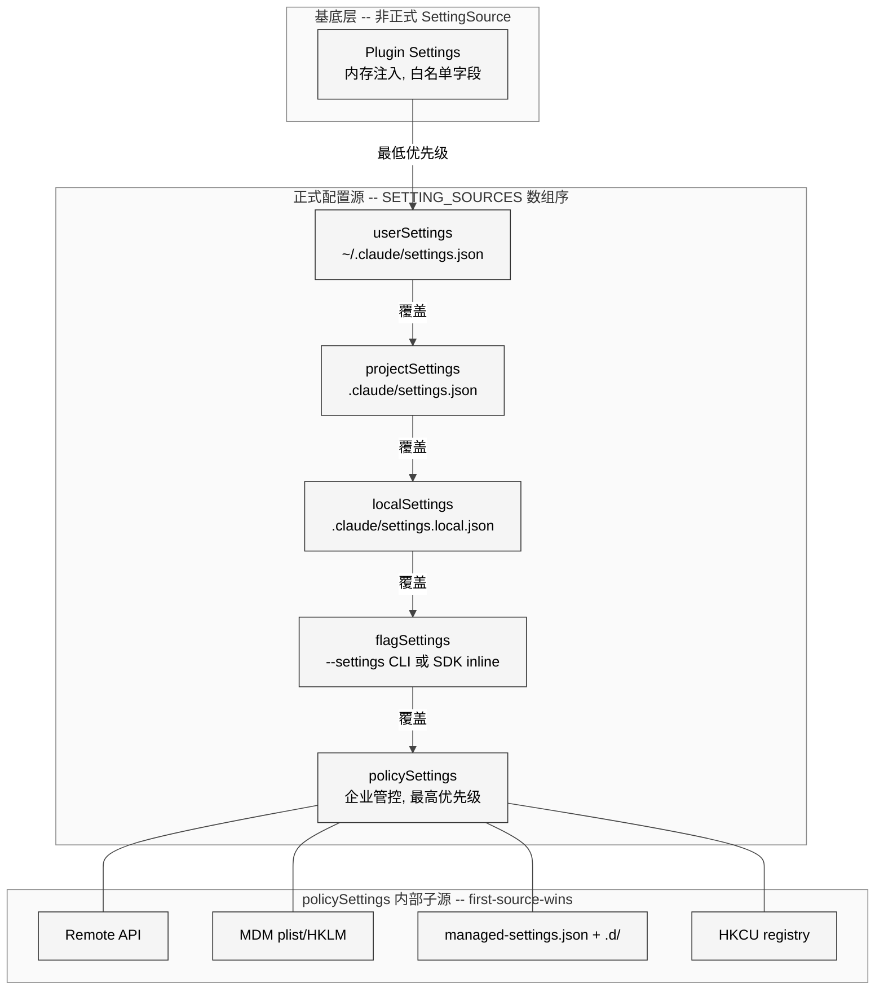
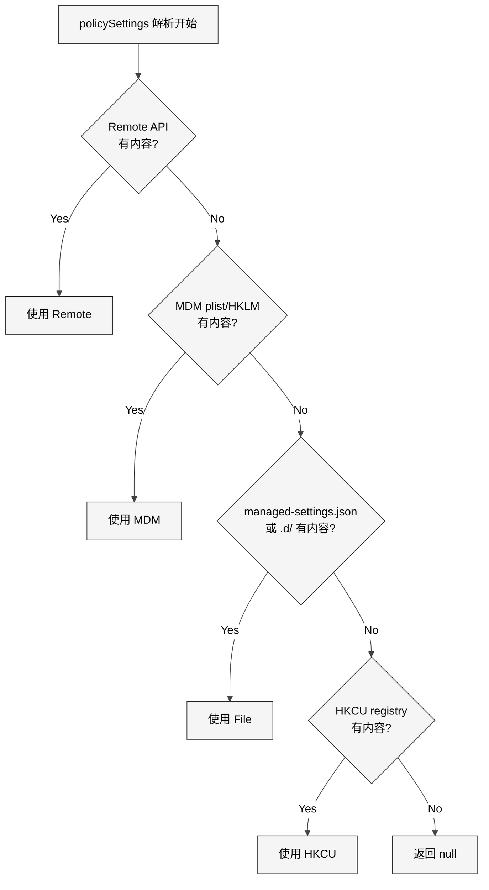
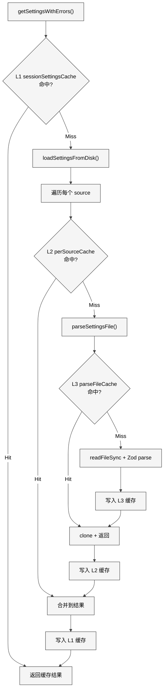
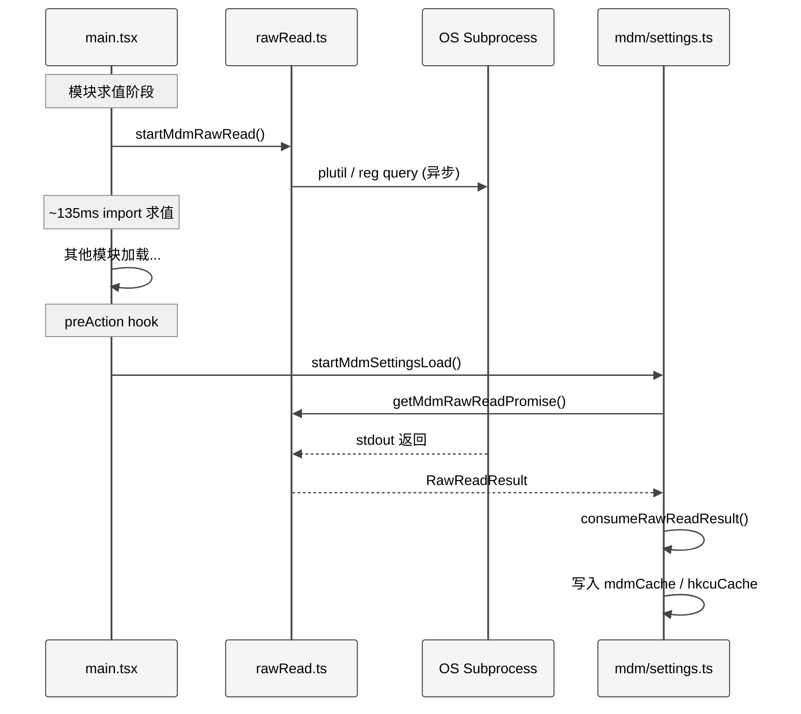
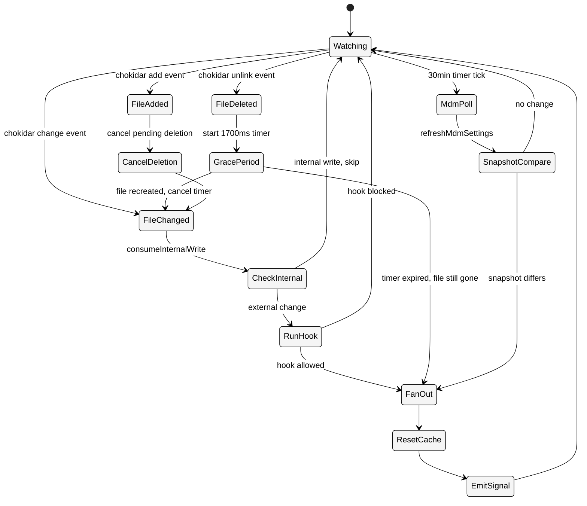

# 第 13 章 Settings

> 核心提要：配置合并与企业策略

## 17.1 定位

一个 CLI 工具的配置需求看似简单——用户写一个 JSON 文件就行了。但 Claude Code 面对的现实远比这复杂：个人偏好、团队共享、本地覆盖、企业管控、远程策略、跨平台 MDM——这些需求层层叠加，任何单一配置文件都无法满足。

Claude Code 的 Settings 系统通过**多层配置源 + 优先级合并 + 变更检测热更新**的架构解决了这个问题。在 restored-src v2.1.88（1,884 文件，513,216 行 TypeScript）中，Settings 系统由 19 个核心源文件和 5 个远程管理服务文件组成，总计约 2,800 行 TypeScript，实现了一套面向企业级部署的配置治理体系。

**在整体架构中的定位**：Settings 系统是 Claude Code Agent OS 的"文件系统"和"注册表"——几乎所有子系统（权限管线、工具系统、沙箱、MCP、Hooks、遥测、模型选择）都依赖它来读取运行时配置。它不只是"读取 JSON 文件"，而是一个具备跨平台 MDM 集成、远程策略下发、运行时热更新、三级缓存、安全校验的完整配置管理平台。

**本章结构**：首先剖析 5+1 层配置源的优先级设计（17.2），然后深入核心合并算法的实现细节（17.3），接着分析 MDM 跨平台集成（17.4）、远程策略系统（17.5）、变更检测与热更新（17.6），最后进行竞品对比和开放问题讨论（17.7-17.8）。

## 17.2 架构设计：5+1 层优先级链

### 17.2.1 配置源全景

Settings 系统的核心设计是一条明确的优先级链。配置从多个来源读取，按照优先级从低到高逐层合并：

<div style="background: #ffffff; padding: 16px; border-radius: 8px; margin: 16px 0;">



</div>

正式的配置源类型定义在 `src/utils/settings/constants.ts` 中：

```typescript
// src/utils/settings/constants.ts L7-L22
export const SETTING_SOURCES = [
  'userSettings',      // 用户全局
  'projectSettings',   // 项目共享
  'localSettings',     // 本地覆盖（gitignored）
  'flagSettings',      // CLI --settings 参数
  'policySettings',    // 企业管控（最高优先级）
] as const
```

数组的顺序就是合并顺序——**后面的覆盖前面的**。`policySettings` 排在最后，意味着企业管控策略拥有最终决定权。

此外还有一个**非正式的第 0 层**——Plugin Settings。它不是 `SettingSource` 类型成员，而是通过 `getPluginSettingsBase()` 在 `loadSettingsFromDisk()` 中作为最低优先级基底注入。Plugin 只包含白名单内的字段（如 `agent` 配置），所有正式的 file-based sources 都会覆盖它。

```typescript
// src/utils/settings/settingsCache.ts L66-L76
let pluginSettingsBase: Record<string, unknown> | undefined

export function getPluginSettingsBase(): Record<string, unknown> | undefined {
  return pluginSettingsBase
}

export function setPluginSettingsBase(
  settings: Record<string, unknown> | undefined,
): void {
  pluginSettingsBase = settings
}
```

### 17.2.2 各层文件位置与用途

| 层级 | 配置源 | 文件位置 | 典型用途 | 可编辑性 |
|------|--------|---------|---------|---------|
| 基底 | Plugin | 内存注入 | 插件默认 Agent 配置 | 只读 |
| 1 | userSettings | `~/.claude/settings.json` | 个人全局偏好（模型、权限） | 可编辑 |
| 2 | projectSettings | `$PROJECT/.claude/settings.json` | 团队共享配置（Hook、MCP） | 可编辑 |
| 3 | localSettings | `$PROJECT/.claude/settings.local.json` | 本地覆盖，自动 gitignore | 可编辑 |
| 4 | flagSettings | `--settings` CLI 或 SDK inline | SDK/IDE 注入的临时配置 | 只读 |
| 5 | policySettings | 多种来源（见下文） | 企业安全管控 | 只读 |

一个精巧的设计细节：`constants.ts` 中的 `getEnabledSettingSources()` 函数确保 **policySettings 和 flagSettings 永远启用**，即使用户通过 `--setting-sources` 参数选择性地禁用了某些源：

```typescript
// src/utils/settings/constants.ts L159-L167
export function getEnabledSettingSources(): SettingSource[] {
  const allowed = getAllowedSettingSources()
  const result = new Set<SettingSource>(allowed)
  result.add('policySettings')
  result.add('flagSettings')
  return Array.from(result)
}
```

由此可见企业策略和 SDK 注入永远不能被用户绕过——一个安全性优先的设计决策。

### 17.2.3 安全导向的源排除设计

Settings 系统中多个关键函数显式排除 `projectSettings` 以防范供应链攻击。这是一个贯穿整个系统的安全设计原则：

```typescript
// src/utils/settings/settings.ts L882-L889
export function hasSkipDangerousModePermissionPrompt(): boolean {
  return !!(
    getSettingsForSource('userSettings')?.skipDangerousModePermissionPrompt ||
    getSettingsForSource('localSettings')?.skipDangerousModePermissionPrompt ||
    getSettingsForSource('flagSettings')?.skipDangerousModePermissionPrompt ||
    getSettingsForSource('policySettings')?.skipDangerousModePermissionPrompt
  )
}
```

注意 `projectSettings` 被显式排除——源码注释解释了原因：*"a malicious project could otherwise auto-bypass the dialog (RCE risk)"*。同样的排除出现在 `hasAutoModeOptIn()`、`getAutoModeConfig()` 等函数中。这种"不信任项目配置中的安全相关字段"的原则是应对 `.claude/settings.json` 被恶意提交到 Git 仓库的防御。

### 17.2.4 Policy Settings 的内部优先级

Policy Settings 不像其他层级那样简单地从一个文件读取。它有自己的 **4 层子优先级链**，使用"first source wins"（第一个有内容的来源胜出）策略：

```typescript
// src/utils/settings/settings.ts L319-L345
function getSettingsForSourceUncached(source: SettingSource): SettingsJson | null {
  if (source === 'policySettings') {
    // 1. Remote API（最高优先级）
    const remoteSettings = getRemoteManagedSettingsSyncFromCache()
    if (remoteSettings && Object.keys(remoteSettings).length > 0) {
      return remoteSettings
    }
    // 2. Admin-only MDM (HKLM/plist)
    const mdmResult = getMdmSettings()
    if (Object.keys(mdmResult.settings).length > 0) {
      return mdmResult.settings
    }
    // 3. File-based managed settings
    const { settings: fileSettings } = loadManagedFileSettings()
    if (fileSettings) { return fileSettings }
    // 4. HKCU registry（最低 -- 用户可写）
    const hkcu = getHkcuSettings()
    if (Object.keys(hkcu.settings).length > 0) {
      return hkcu.settings
    }
    return null
  }
  // ...
}
```

这与外层的合并策略截然不同：外层是所有层级**逐层 merge**，Policy 内部是**第一个胜出即停止**。设计意图很明确——如果企业通过 Remote API 下发了策略，就不应该再考虑本地 managed-settings.json 的内容，避免策略冲突。

<div style="background: #ffffff; padding: 16px; border-radius: 8px; margin: 16px 0;">



</div>

## 17.3 核心合并算法深度剖析

### 17.3.1 loadSettingsFromDisk() — 系统心脏

整个 Settings 系统最核心的函数是 `loadSettingsFromDisk()`（`settings.ts` L645-L796），负责按优先级顺序读取并合并所有配置源。这个 152 行的函数包含了多个精巧的工程设计：

**防递归守卫**：

```typescript
// src/utils/settings/settings.ts L638-L649
let isLoadingSettings = false

function loadSettingsFromDisk(): SettingsWithErrors {
  if (isLoadingSettings) {
    return { settings: {}, errors: [] }
  }
  isLoadingSettings = true
  try {
    // ... 主逻辑
  } finally {
    isLoadingSettings = false
  }
}
```

某些验证逻辑（如权限校验）可能间接触发 `getSettings()`，如果不做守卫就会无限递归。这不是理论上的风险——`syncCacheState.ts` 的注释记录了一个真实事故（`gh-23085`）：`isBridgeEnabled()` 在 Commander 定义阶段意外触发了 settings 读取，导致合并缓存被"毒化"。

**文件去重**：

```typescript
// src/utils/settings/settings.ts L671-L767
const seenFiles = new Set<string>()
for (const source of getEnabledSettingSources()) {
  // ...
  const filePath = getSettingsFilePathForSource(source)
  if (filePath) {
    const resolvedPath = resolve(filePath)
    if (!seenFiles.has(resolvedPath)) {
      seenFiles.add(resolvedPath)
      // ... 解析并合并
    }
  }
}
```

`seenFiles` 确保同一个物理文件不会被加载两次——主要防御的是符号链接导致两个逻辑路径指向同一物理文件的边缘情况。

**错误去重**：

```typescript
// src/utils/settings/settings.ts L670, L750-L756
const seenErrors = new Set<string>()
// ...
for (const error of errors) {
  const errorKey = `${error.file}:${error.path}:${error.message}`
  if (!seenErrors.has(errorKey)) {
    seenErrors.add(errorKey)
    allErrors.push(error)
  }
}
```

用 `file:path:message` 三元组作为 key 去重。多个 source 可能因为同一个 schema 版本差异产生相同的验证错误，去重后用户只看到一次。

### 17.3.2 数组合并策略 — 一个关键的设计决策

合并时使用自定义的 `settingsMergeCustomizer`：

```typescript
// src/utils/settings/settings.ts L538-L547
export function settingsMergeCustomizer(
  objValue: unknown,
  srcValue: unknown,
): unknown {
  if (Array.isArray(objValue) && Array.isArray(srcValue)) {
    return mergeArrays(objValue, srcValue)  // 去重拼接
  }
  return undefined  // 其他值让 lodash 默认处理
}

function mergeArrays<T>(targetArray: T[], sourceArray: T[]): T[] {
  return uniq([...targetArray, ...sourceArray])
}
```

数组是**拼接去重**（concatenate + deduplicate），而非替换。这个决策对权限系统至关重要——多层的 `allow` 和 `deny` 规则会合并在一起，用户级的 `allow: ["Bash(npm test)"]` 不会被项目级的 `allow: ["FileRead"]` 覆盖，而是两者都生效。

但在 `updateSettingsForSource()`（写入时）则使用了不同的策略：

```typescript
// src/utils/settings/settings.ts L476-L494
const updatedSettings = mergeWith(
  existingSettings || {},
  settings,
  (_objValue, srcValue, key, object) => {
    if (srcValue === undefined && object && typeof key === 'string') {
      delete object[key]  // undefined 语义 = 删除
      return undefined
    }
    if (Array.isArray(srcValue)) {
      return srcValue  // 写入时数组是替换而非拼接
    }
    return undefined
  },
)
```

读取时数组拼接、写入时数组替换——这是一个深思熟虑的不对称设计。读取时拼接确保多层规则都生效，写入时替换确保调用方能精确控制最终状态（调用方负责计算完整的目标数组）。

### 17.3.3 三级缓存体系

频繁读取配置文件会带来性能问题。Settings 系统使用三级缓存来避免重复 I/O：

<div style="background: #ffffff; padding: 16px; border-radius: 8px; margin: 16px 0;">



</div>

```typescript
// src/utils/settings/settingsCache.ts L1-L59
let sessionSettingsCache: SettingsWithErrors | null = null    // L1: 最终合并结果
const perSourceCache = new Map<SettingSource, SettingsJson | null>()  // L2: 单源缓存
const parseFileCache = new Map<string, ParsedSettings>()      // L3: 文件解析缓存

export function resetSettingsCache(): void {
  sessionSettingsCache = null
  perSourceCache.clear()
  parseFileCache.clear()
}
```

三级缓存覆盖不同粒度：
- **L3 parseFileCache**：避免同一个文件被重复解析（`parseSettingsFile()` 和 `getSettingsForSource()` 可能从不同路径命中同一文件）
- **L2 perSourceCache**：避免单源重复计算（如 `policySettings` 的 4 层子源查找）
- **L1 sessionSettingsCache**：避免整体合并的重复计算

一个重要的防御细节——`parseSettingsFile()` 返回的是 **clone** 而非原始缓存引用：

```typescript
// src/utils/settings/settings.ts L182-L199
export function parseSettingsFile(path: string): {
  settings: SettingsJson | null
  errors: ValidationError[]
} {
  const cached = getCachedParsedFile(path)
  if (cached) {
    return {
      settings: cached.settings ? clone(cached.settings) : null,
      errors: cached.errors,
    }
  }
  // ...
}
```

源码注释解释了原因：*"Clone so callers (e.g. mergeWith in getSettingsForSourceUncached, updateSettingsForSource) can't mutate the cached entry."* `lodash.mergeWith` 会就地修改目标对象，如果直接返回缓存引用，合并操作会污染缓存。

## 17.4 配置验证与容错

### 17.4.1 Zod Schema — 向后兼容优先

`SettingsSchema` 定义在 `types.ts` 中，使用 `lazySchema()` 延迟构造。它的设计严格遵循向后兼容原则——源码中的注释（`types.ts` L210-L241）堪称教科书级的 schema 演进指南：

```
✅ 允许的变更：
- 添加新的可选字段（始终使用 .optional()）
- 添加新的 enum 值（保留现有值）
- 使验证更宽松

❌ 应避免的破坏性变更：
- 删除字段（改为标记 deprecated）
- 删除 enum 值
- 将可选字段改为必需
- 使类型更严格
```

Schema 覆盖了超过 60 个配置字段，从基础的 `model`、`env` 到复杂的 `permissions`、`hooks`、`sandbox`、`allowedMcpServers` 等。整个 schema 使用 `.passthrough()` 结尾，确保未知字段不会导致验证失败——这对跨版本兼容至关重要。

### 17.4.2 strictPluginOnlyCustomization — 前向兼容的典范

`types.ts` 中关键的容错设计是 `strictPluginOnlyCustomization` 字段：

```typescript
// src/utils/settings/types.ts L518-L548
strictPluginOnlyCustomization: z
  .preprocess(
    // 前向兼容：过滤掉未知的 surface 名称，这样未来新增的枚举值
    // 不会导致旧客户端 safeParse 失败，
    // 进而导致整个 managed-settings 文件被丢弃
    v => Array.isArray(v)
      ? v.filter(x =>
          (CUSTOMIZATION_SURFACES as readonly string[]).includes(x),
        )
      : v,
    z.union([z.boolean(), z.array(z.enum(CUSTOMIZATION_SURFACES))]),
  )
  .optional()
  .catch(undefined)  // 非法值降级为 undefined 而非验证失败
```

这里有三层防护：
1. **preprocess 过滤未知值**：`["skills", "commands"]` 在不认识 `"commands"` 的旧客户端上降级为 `["skills"]`——锁定已知的，忽略未知的
2. **.catch(undefined)**：完全非法的值（如字符串 `"skills"` 而非数组）降级为 `undefined` 而非让整个文件验证失败
3. **降级方向始终安全**：降级到"更少锁定"而非"全部解锁"

源码注释精确地总结了设计哲学：*"Degrades to less-locked, never to everything-unlocked."* 和 *"Degrades to unlocked-for-this-field, never to everything-broken."*

### 17.4.3 权限规则预过滤

一个容易被忽视的容错设计是 `filterInvalidPermissionRules()`——它在 Zod schema 验证**之前**运行：

```typescript
// src/utils/settings/settings.ts L213-L226
const data = safeParseJSON(content, false)
const ruleWarnings = filterInvalidPermissionRules(data, path)
const result = SettingsSchema().safeParse(data)
```

```typescript
// src/utils/settings/validation.ts L224-L265
export function filterInvalidPermissionRules(
  data: unknown,
  filePath: string,
): ValidationError[] {
  // ... 遍历 permissions.allow/deny/ask 数组
  perms[key] = rules.filter(rule => {
    const result = validatePermissionRule(rule)
    if (!result.valid) {
      warnings.push({ /* ... */ })
      return false  // 移除无效规则
    }
    return true
  })
  return warnings
}
```

一条坏的权限规则（如 `"Bash()"`——空括号）不会导致整个配置文件被拒绝。无效规则被过滤掉，产生 warning，其他有效配置继续生效。这遵循了 Postel 定律的精神：对输入宽容，对输出严格。

### 17.4.4 allErrors 循环依赖打破

`allErrors.ts` 是一个优雅的循环依赖解决方案：

```typescript
// src/utils/settings/allErrors.ts L1-L32
/**
 * Combines settings validation errors with MCP configuration errors.
 * This module exists to break a circular dependency:
 *   settings.ts -> mcp/config.ts -> settings.ts
 */
export function getSettingsWithAllErrors(): SettingsWithErrors {
  const result = getSettingsWithErrors()
  const scopes = ['user', 'project', 'local'] as const
  const mcpErrors = scopes.flatMap(scope => getMcpConfigsByScope(scope).errors)
  return {
    settings: result.settings,
    errors: [...result.errors, ...mcpErrors],
  }
}
```

通过引入一个"叶子模块"同时导入 `settings.ts` 和 `mcp/config.ts`（但不被它们导入），打破了循环引用。类似的模式也出现在 `syncCacheState.ts`（打破 `settings.ts -> syncCache.ts -> auth.ts -> settings.ts` 循环）中。这种"叶子模块打破 SCC（强连通分量）"的策略是 Claude Code 代码库中反复出现的架构模式。

## 17.5 MDM 集成：跨平台企业设备管理

### 17.5.1 三模块分层架构

MDM 实现被拆分为三个模块，每个模块有明确的职责和 import 约束：

```
mdm/
├── constants.ts  — 零重量 import（只有 os），共享常量和路径构建器
├── rawRead.ts    — 最小 import（child_process + fs），子进程 I/O
└── settings.ts   — 解析、缓存、first-source-wins 逻辑
```

**为什么要拆成三个文件？** 因为 `rawRead.ts` 在 `main.tsx` 模块求值阶段就被调用，此时不能引入任何重量级模块。源码注释（`rawRead.ts` L1-L10）明确说明：*"Has minimal imports — only child_process, fs, and mdmConstants (which only imports os)."*

### 17.5.2 两阶段启动优化

MDM 读取分为两个阶段，利用 Node.js 的 import 求值期并行执行子进程 I/O：

<div style="background: #ffffff; padding: 16px; border-radius: 8px; margin: 16px 0;">



</div>

**阶段一**（`main.tsx` 顶层，模块求值期）：

```typescript
// src/utils/settings/mdm/rawRead.ts L120-L123
export function startMdmRawRead(): void {
  if (rawReadPromise) return
  rawReadPromise = fireRawRead()  // 立即启动子进程
}
```

**阶段二**（`main.tsx` preAction hook 中，`~135ms` 后）：

```typescript
// src/utils/settings/mdm/settings.ts L67-L98
export function startMdmSettingsLoad(): void {
  if (mdmLoadPromise) return
  mdmLoadPromise = (async () => {
    const rawPromise = getMdmRawReadPromise() ?? fireRawRead()
    const { mdm, hkcu } = consumeRawReadResult(await rawPromise)
    mdmCache = mdm
    hkcuCache = hkcu
  })()
}
```

如果阶段一的子进程在 ~135ms 内完成（大多数情况下是这样），阶段二几乎零等待。

### 17.5.3 跨平台读取策略

`fireRawRead()` 实现了三个平台的 MDM 读取：

**macOS**：并行执行多个 `plutil` 子进程，将 plist 转换为 JSON。包含一个重要的快速路径优化——先用同步 `existsSync` 检查文件是否存在，不存在就跳过（省 ~5ms 的 plutil 启动时间）。非 MDM 管理的机器上这些文件永远不存在，这个优化对大多数用户有效。

```typescript
// src/utils/settings/mdm/rawRead.ts L57-L88
if (process.platform === 'darwin') {
  const plistPaths = getMacOSPlistPaths()
  const allResults = await Promise.all(
    plistPaths.map(async ({ path, label }) => {
      if (!existsSync(path)) {
        return { stdout: '', label, ok: false }
      }
      const { stdout, code } = await execFilePromise(PLUTIL_PATH, [
        ...PLUTIL_ARGS_PREFIX, path,
      ])
      return { stdout, label, ok: code === 0 && !!stdout }
    }),
  )
  const winner = allResults.find(r => r.ok)
  // ...
}
```

macOS plist 优先级（`constants.ts` L45-L81）：

| 优先级 | 路径 | 来源 |
|--------|------|------|
| 最高 | `/Library/Managed Preferences/{username}/com.anthropic.claudecode.plist` | 每用户 MDM |
| 中 | `/Library/Managed Preferences/com.anthropic.claudecode.plist` | 设备级 MDM |
| 最低(ant-only) | `~/Library/Preferences/com.anthropic.claudecode.plist` | 本地测试用 |

**Windows**：并行读取 HKLM 和 HKCU 注册表。源码注释（`constants.ts` L17-L22）解释了为什么注册表路径在 `SOFTWARE\Policies` 下：*"These keys live under SOFTWARE\Policies which is on the WOW64 shared key list — both 32-bit and 64-bit processes see the same values without redirection."*

**Linux**：无 MDM 等价物，使用 `/etc/claude-code/managed-settings.json` 文件。

### 17.5.4 HKCU 降级的精细控制

`consumeRawReadResult()` 中有一个容易被忽视的细节——只有在 managed-settings.json 也不存在时才使用 HKCU：

```typescript
// src/utils/settings/mdm/settings.ts L255-L258
// No admin MDM -- check managed-settings.json before using HKCU
if (hasManagedSettingsFile()) {
  return { mdm: EMPTY_RESULT, hkcu: EMPTY_RESULT }
}
```

这防止了一个微妙的安全问题：如果管理员通过 managed-settings.json 部署了策略但没有使用 MDM，HKCU（用户可写）不应该提供替代策略——否则用户可以通过写 HKCU 绕过管理员意图。

### 17.5.5 Drop-in 目录模式

除了单一的 `managed-settings.json`，系统还支持 `managed-settings.d/` 目录：

```typescript
// src/utils/settings/settings.ts L62-L121
export function loadManagedFileSettings(): {
  settings: SettingsJson | null
  errors: ValidationError[]
} {
  // 1. 先加载 managed-settings.json 作为基底
  const { settings } = parseSettingsFile(getManagedSettingsFilePath())
  // ...
  // 2. 扫描 managed-settings.d/ 下的 .json 文件，按文件名字母序排列
  const entries = getFsImplementation()
    .readdirSync(dropInDir)
    .filter(d => (d.isFile() || d.isSymbolicLink()) && 
                  d.name.endsWith('.json') && !d.name.startsWith('.'))
    .map(d => d.name)
    .sort()
  for (const name of entries) {
    // 后面的覆盖前面的
    merged = mergeWith(merged, settings, settingsMergeCustomizer)
  }
}
```

这是对 Linux `systemd`/`sudoers` drop-in 模式的借鉴：不同团队可以独立地提交策略片段（如 `10-otel.json`、`20-security.json`），不需要协调对同一个文件的编辑。支持符号链接（`d.isSymbolicLink()`），方便容器化部署中挂载配置。

## 17.6 远程策略：Remote Managed Settings

### 17.6.1 资格检查与 Fail-Open 设计

`isRemoteManagedSettingsEligible()` 决定当前用户是否应向 API 查询远程策略。它的判断逻辑分为**前置排除**和**三路放行**两个阶段：

```typescript
// src/services/remoteManagedSettings/syncCache.ts L49-L112
export function isRemoteManagedSettingsEligible(): boolean {
  // -- 前置排除 --
  if (getAPIProvider() !== 'firstParty') return (cached = setEligibility(false))
  if (!isFirstPartyAnthropicBaseUrl()) return (cached = setEligibility(false))
  if (process.env.CLAUDE_CODE_ENTRYPOINT === 'local-agent')
    return (cached = setEligibility(false))

  // -- 路径 1：外部注入 OAuth token（subscriptionType === null）--
  const tokens = getClaudeAIOAuthTokens()
  if (tokens?.accessToken && tokens.subscriptionType === null)
    return (cached = setEligibility(true))

  // -- 路径 2：Enterprise 或 Team 订阅 --
  if (tokens?.accessToken &&
      tokens.scopes?.includes(CLAUDE_AI_INFERENCE_SCOPE) &&
      (tokens.subscriptionType === 'enterprise' || tokens.subscriptionType === 'team'))
    return (cached = setEligibility(true))

  // -- 路径 3：Console API Key --
  try {
    const { key: apiKey } = getAnthropicApiKeyWithSource({
      skipRetrievingKeyFromApiKeyHelper: true,
    })
    if (apiKey) return (cached = setEligibility(true))
  } catch { /* CI/test 环境无 key */ }

  return (cached = setEligibility(false))
}
```

注意两个关键的工程决策：

1. **OAuth 优先于 API Key 检查**：源码注释解释了原因——*"The API key check spawns `security find-generic-password` (~20-50ms) which returns null for OAuth-only users. Checking OAuth first short-circuits that subprocess for the common case."* 对大多数 Claude.ai 用户来说，这省掉了一次不必要的子进程调用。

2. **subscriptionType === null 时宁可误判**：外部注入的 token 缺少元数据，系统选择让 API 决定——*"the cost of a false positive is one round-trip"*。误判只是一次 HTTP 请求，漏判会导致企业策略完全不生效。

### 17.6.2 ETag 缓存与 SHA-256 Checksum

远程设置使用文件缓存（`~/.claude/remote-settings.json`）+ 内存缓存（session 级）的双层机制，并通过 ETag 实现增量更新：

```typescript
// src/services/remoteManagedSettings/index.ts L131-L137
export function computeChecksumFromSettings(settings: SettingsJson): string {
  const sorted = sortKeysDeep(settings)
  const normalized = jsonStringify(sorted)  // 无空格分隔符
  const hash = createHash('sha256').update(normalized).digest('hex')
  return `sha256:${hash}`
}
```

checksum 计算必须与服务端 Python 实现完全一致（`sort_keys=True, separators=(",", ":")`）——`jsonStringify` 不传 `null, 2` 参数以匹配 Python 的紧凑格式。这是跨语言协作中最容易出错的细节之一。

### 17.6.3 安全确认 — 危险设置变更需要用户批准

在应用新获取的远程设置之前，系统执行安全检查：

```typescript
// src/services/remoteManagedSettings/index.ts L456-L474
if (hasContent) {
  const securityResult = await checkManagedSettingsSecurity(
    cachedSettings, newSettings,
  )
  if (!handleSecurityCheckResult(securityResult)) {
    logForDebugging('Remote settings: User rejected new settings, using cached')
    return cachedSettings
  }
  setSessionCache(newSettings)
  await saveSettings(newSettings)
}
```

`checkManagedSettingsSecurity()`（`securityCheck.tsx`）对比新旧设置中的安全相关字段。如果检测到"危险"变更（如权限规则变化、沙箱配置变化），会渲染一个 React 对话框让用户确认。拒绝时直接 `gracefulShutdownSync(1)` 退出进程——这确保了即使企业管理员远程推送了策略变更，用户也不会在不知情的情况下被降低安全等级。

但在非交互模式下（`!getIsInteractive()`），安全检查被跳过。这是 headless/SDK 场景的实际需要——没有 UI 可以显示确认对话框。

### 17.6.4 Cache-First 启动优化

`loadRemoteManagedSettings()` 中包含一个重要的性能优化——先用磁盘缓存解除等待方的阻塞，再异步发起网络请求：

```typescript
// src/services/remoteManagedSettings/index.ts L527-L532
// Cache-first: 先用磁盘缓存解除 waiters 阻塞，省掉 ~77ms 的 fetch-wait
if (getRemoteManagedSettingsSyncFromCache() && loadingCompleteResolve) {
  loadingCompleteResolve()
  loadingCompleteResolve = null
}
```

源码注释提到这为 print-mode 启动节省了 ~77ms。其他需要等待远程设置的子系统（如遥测初始化）可以通过 `waitForRemoteManagedSettingsToLoad()` 等待，但如果有本地缓存就几乎零等待。

### 17.6.5 后台轮询与 Deadlock 防护

初始加载后启动 1 小时间隔的后台轮询：

```typescript
// src/services/remoteManagedSettings/index.ts L612-L628
export function startBackgroundPolling(): void {
  pollingIntervalId = setInterval(() => {
    void pollRemoteSettings()
  }, POLLING_INTERVAL_MS)  // 60 * 60 * 1000 = 1 小时
  pollingIntervalId.unref()  // 不阻止进程退出
}
```

一个容易被忽视但关键的细节——loading promise 有 30 秒超时防护：

```typescript
// src/services/remoteManagedSettings/index.ts L88-L96
setTimeout(() => {
  if (loadingCompleteResolve) {
    logForDebugging('Remote settings: Loading promise timed out, resolving anyway')
    loadingCompleteResolve()
    loadingCompleteResolve = null
  }
}, LOADING_PROMISE_TIMEOUT_MS)  // 30 seconds
```

源码注释解释：*"Timeout for the loading promise to prevent deadlocks if loadRemoteManagedSettings() is never called (e.g., in Agent SDK tests that don't go through main.tsx)"*。这是一个防御性设计——在测试或非标准入口中，如果 `loadRemoteManagedSettings()` 没被调用，等待方不会永远阻塞。

## 17.7 变更检测与热更新

### 17.7.1 chokidar 文件监听

`changeDetector.ts` 使用 chokidar 库监听配置文件变更。初始化时精心构建监听目标：

```typescript
// src/utils/settings/changeDetector.ts L84-L146
export async function initialize(): Promise<void> {
  if (getIsRemoteMode()) return  // 远程模式不监听本地文件
  // ...
  watcher = chokidar.watch(dirs, {
    persistent: true,
    ignoreInitial: true,
    depth: 0,  // 只监听直接子级
    awaitWriteFinish: {
      stabilityThreshold: 1000,  // 等待写入稳定 1s
      pollInterval: 500,
    },
    ignored: (path, stats) => {
      // 只监听已知的配置文件路径 + drop-in 目录中的 .json
      // ...
    },
  })
}
```

几个值得注意的设计选择：
- **flagSettings 被排除在监听之外**：源码注释（`changeDetector.ts` L193）指出 flag 文件可能在 `$TMPDIR` 中，该目录可能包含 FIFO 等特殊文件导致 watcher hang。引用了具体 issue `#16469`。
- **depth: 0**：只监听直接子级，不递归。性能和安全兼顾。
- **usePolling: false**：使用原生文件系统事件而非轮询。

### 17.7.2 内部写入过滤

当 Claude Code 自身修改配置文件时，不应该触发变更通知。系统通过时间戳 Map 实现过滤：

```typescript
// src/utils/settings/internalWrites.ts L15-L33
const timestamps = new Map<string, number>()

export function markInternalWrite(path: string): void {
  timestamps.set(path, Date.now())
}

export function consumeInternalWrite(path: string, windowMs: number): boolean {
  const ts = timestamps.get(path)
  if (ts !== undefined && Date.now() - ts < windowMs) {
    timestamps.delete(path)  // 消费后删除
    return true
  }
  return false
}
```

`consumeInternalWrite` 使用消费语义——匹配后删除标记，确保下一次真正的外部变更不会被误过滤。时间窗口为 5 秒（`INTERNAL_WRITE_WINDOW_MS`）。

`internalWrites.ts` 被独立为一个单独的模块，源码注释解释了原因：*"Extracted from changeDetector.ts to break the settings.ts -> changeDetector.ts -> hooks.ts -> ... -> settings.ts cycle."* 又一个循环依赖打破的案例。

### 17.7.3 删除-重建的优雅处理

配置文件经常被"删除然后重新创建"（auto-updater 或另一个 session 启动时）。系统引入了 grace period 机制：

```typescript
// src/utils/settings/changeDetector.ts L62-L64
const DELETION_GRACE_MS =
  FILE_STABILITY_THRESHOLD_MS + FILE_STABILITY_POLL_INTERVAL_MS + 200
  // = 1000 + 500 + 200 = 1700ms
```

```typescript
// src/utils/settings/changeDetector.ts L330-L360
function handleDelete(path: string): void {
  const timer = setTimeout((p, src) => {
    pendingDeletions.delete(p)
    // 超时后才真正处理删除
    void executeConfigChangeHooks(/* ... */).then(results => {
      if (hasBlockingResult(results)) return
      fanOut(src)
    })
  }, DELETION_GRACE_MS, path, source)
  pendingDeletions.set(path, timer)
}

function handleAdd(path: string): void {
  // 文件被重新创建 -- 取消 pending 的删除
  const pendingTimer = pendingDeletions.get(path)
  if (pendingTimer) {
    clearTimeout(pendingTimer)
    pendingDeletions.delete(path)
  }
  handleChange(path)  // 当作 change 处理
}
```

1700ms 的 grace period 必须超过 chokidar 的 `awaitWriteFinish` 延迟（`stabilityThreshold + pollInterval = 1500ms`），确保新文件的写入稳定检查完成后 grace 窗口仍然有效。

### 17.7.4 MDM 轮询与缓存快照

MDM 配置（注册表/plist）不能通过文件系统事件监听，所以使用 30 分钟轮询：

```typescript
// src/utils/settings/changeDetector.ts L381-L418
function startMdmPoll(): void {
  lastMdmSnapshot = jsonStringify({
    mdm: initial.settings, hkcu: initialHkcu.settings,
  })
  mdmPollTimer = setInterval(() => {
    void (async () => {
      const { mdm, hkcu } = await refreshMdmSettings()
      const currentSnapshot = jsonStringify({
        mdm: current.settings, hkcu: currentHkcu.settings,
      })
      if (currentSnapshot !== lastMdmSnapshot) {
        lastMdmSnapshot = currentSnapshot
        setMdmSettingsCache(current, currentHkcu)
        fanOut('policySettings')
      }
    })()
  }, MDM_POLL_INTERVAL_MS)
  mdmPollTimer.unref()
}
```

通过 JSON 序列化的快照比较检测变更——简单但有效。`unref()` 确保轮询 timer 不阻止进程退出。

### 17.7.5 fanOut 的缓存一致性保证

`fanOut()` 函数是变更通知的唯一出口点：

```typescript
// src/utils/settings/changeDetector.ts L437-L440
function fanOut(source: SettingSource): void {
  resetSettingsCache()  // 先清缓存
  settingsChanged.emit(source)  // 再通知
}
```

源码注释（L420-L436）记录了一个重要的性能修复：之前缓存重置分散在每个 listener 中，导致 N 个 subscriber 时产生 N 次磁盘重载。现在集中在 `fanOut` 中一次重置——*"one notification = one disk reload: the first listener to call getSettingsWithErrors() pays the miss and repopulates; all subsequent listeners hit the cache."* Profile 显示这把 5 次 `loadSettingsFromDisk` 调用（12ms）降到了 1 次。

<div style="background: #ffffff; padding: 16px; border-radius: 8px; margin: 16px 0;">



</div>

## 17.8 Settings 变更的应用

当 `changeDetector` 通知设置已变更时，`applySettingsChange.ts` 负责将变更应用到运行时 AppState：

```typescript
// src/utils/settings/applySettingsChange.ts L33-L92
export function applySettingsChange(
  source: SettingSource,
  setAppState: (f: (prev: AppState) => AppState) => void,
): void {
  const newSettings = getInitialSettings()
  const updatedRules = loadAllPermissionRulesFromDisk()
  updateHooksConfigSnapshot()

  setAppState(prev => {
    let newContext = syncPermissionRulesFromDisk(prev.toolPermissionContext, updatedRules)
    // ... 重新评估 bypass 权限、auto mode、effort level
    return { ...prev, settings: newSettings, toolPermissionContext: newContext }
  })
}
```

一次 settings 变更触发的连锁更新包括：
1. 权限规则重新加载和同步
2. Hooks 配置快照更新
3. 过于宽泛的 Bash 权限规则重新剥离（ant-only）
4. bypass permissions 模式状态重新评估
5. plan/auto mode 转换
6. effort level 同步

**一个微妙的 effort level 同步逻辑**：只有当 `effortLevel` 确实变了且新值非 `undefined` 时才传播——防止无关的 settings churn 覆盖 `--effort` CLI flag 的值。

## 17.9 比较

### 17.9.1 多维度对比

| 维度 | Claude Code | Cursor | GitHub Copilot | Aider | Cline |
|------|-------------|--------|----------------|-------|-------|
| 配置层级 | 5+1 层 | 2 层（用户+项目） | 2-3 层（VS Code 继承） | 1 层（.aider.conf.yml） | 2 层（用户+项目） |
| 企业 MDM 集成 | macOS plist + Windows Registry + Linux file | 无 | VS Code 策略 | 无 | 无 |
| 远程策略下发 | API + ETag + 后台轮询 | 无 | GitHub org settings | 无 | 无 |
| 运行时热更新 | chokidar + MDM poll + remote poll | 配置变更重启 | VS Code 设置同步 | 重启 | 重启 |
| 配置验证 | Zod schema + 容错降级 | JSON Schema | VS Code schema | YAML 手动 | JSON Schema |
| 安全源排除 | projectSettings 排除敏感字段 | 无 | 无 | 无 | 无 |
| Drop-in 目录 | managed-settings.d/ | 无 | 无 | 无 | 无 |

### 17.9.2 Claude Code 的独特优势

**1. 企业级配置治理**：Claude Code 是唯一一个同时支持 MDM 设备管理、远程策略下发、文件级管控三条路径的 AI Agent。这不是"多了一个功能"——它反映了从"个人开发工具"到"企业 IT 管控资产"的定位转变。

**2. 安全导向的源排除**：通过显式排除 `projectSettings` 中的安全敏感字段（`skipDangerousModePermissionPrompt`、`skipAutoPermissionPrompt`、`autoMode` 等），Claude Code 防范了"恶意仓库通过 .claude/settings.json 自动绕过安全对话框"的攻击向量。这在其他竞品中完全没有考虑。

**3. 容错优先的 Schema 设计**：`preprocess` + `.catch(undefined)` + `filterInvalidPermissionRules` 的三层容错确保了一个无效字段值不会让整个企业策略文件失效。相比之下，大多数竞品在配置验证失败时要么全部拒绝要么完全不验证。

### 17.9.3 局限性

**1. 缺乏配置锁定可视化**：虽然企业策略通过 `strictPluginOnlyCustomization` 可以锁定特定 surface，但用户没有直观的方式查看"我的哪些设置被企业策略覆盖了"。`getSettingsWithSources()` 提供了分层视图，但只有 `/status` 命令使用它，缺少更丰富的诊断 UI。

**2. Policy 的 first-source-wins 可能导致困惑**：如果企业同时部署了 Remote API 和 managed-settings.json，只有 Remote 生效。管理员可能不清楚为什么本地文件的策略没有生效。`getPolicySettingsOrigin()` 函数提供了诊断能力，但需要管理员知道这个 API。

**3. 数组合并的不可预测性**：权限规则的拼接去重在大多数情况下是正确的，但对于冲突的 `allow` 和 `deny` 规则，最终行为取决于权限管线的评估顺序而非配置层级——这可能让多层配置的管理员感到困惑。

## 17.10 辨误

### 误解 1："Claude Code 的配置就是一个 JSON 文件"

这是一种常见误解。更准确地说，Settings 系统是一套完整的配置管理机制——包含 5+1 层配置源、Policy 子源、缓存、监听热更新、MDM 集成与远程策略。把它概括成“一个 JSON 文件”会遮蔽其真正的实现层次。

### 误解 2："企业策略只是覆盖用户配置"

不完全准确。企业策略使用 **first-source-wins**（不是所有 Policy 源合并），并且对于数组字段使用**拼接去重**（不是替换）。一条用户的 `allow` 规则不会被企业策略覆盖——两者都生效，最终行为由权限管线决定。

### 误解 3："配置变更需要重启 Claude Code"

错误。Settings 系统支持运行时热更新——文件变更通过 chokidar 监听，MDM 变更通过 30 分钟轮询，远程策略通过 1 小时轮询。变更会触发 `applySettingsChange` 重新评估权限、Hooks、模型等所有依赖配置的子系统。

### 误解 4（来自 E3 章参考文档）："五层配置从内建默认到企业远程策略"

E3 章的描述将 `SettingSource` 命名为 `default`、`enterprise_local`、`user`、`project`、`enterprise_remote`，这与源码不符。实际的枚举值是 `userSettings`、`projectSettings`、`localSettings`、`flagSettings`、`policySettings`。没有 `default` 和 `enterprise_local` 作为独立源——内建默认通过代码逻辑提供，本地企业策略和远程策略统一在 `policySettings` 的 first-source-wins 子源链中。

E3 章描述的"锁定"机制（`__locked` 标记）在源码中也不存在——实际的锁定是通过 `strictPluginOnlyCustomization` 和安全敏感字段的源排除来实现的，没有 per-field lock 标记。

## 17.11 展望

### 17.11.1 代码质量——零 TODO/HACK

令人印象深刻的是，整个 Settings 子系统（19 个核心文件 + 5 个远程管理文件）中没有一个 TODO、HACK 或 FIXME 标记。这在 Claude Code 的代码库中是罕见的——暗示这是一个被精心维护、反复打磨的模块。唯一的"技术债"信号是 `writeFileSyncAndFlush_DEPRECATED` 的使用（`settings.ts` L500）——这个函数名本身标记了待迁移状态。

### 17.11.2 潜在瓶颈

**1. 同步 I/O 管线**：整个 settings 读取管线是同步的（`readFileSync`）。在启动路径上这是合理的（避免 Promise 复杂性），但当 `loadSettingsFromDisk()` 在热路径上被调用时（如 `getInitialSettings()` 首次 cache miss），它会阻塞事件循环。对于大型 managed-settings.d/ 目录（10+ 个策略片段），每个文件的同步读取 + Zod 解析可能累计到可感知的延迟。

**2. Clone 开销**：`parseSettingsFile()` 对每次缓存命中都执行 `clone()`。对于包含大量权限规则的配置，深克隆的开销可能显著。可以考虑使用 immutable data structure 或 copy-on-write 优化。

**3. JSON 序列化快照比较**：MDM 和 Remote 的变更检测通过 `jsonStringify` 比较整个对象。对于大型配置，这不如增量 hash 高效。不过考虑到 settings 通常不会太大（几十 KB 级别），这是可接受的工程权衡。

### 17.11.3 如果设计下一版

**1. 结构化诊断 API**：提供 `claude settings diagnose` 命令，展示每个字段的最终值来自哪一层、是否被覆盖、是否有验证错误。`getSettingsWithSources()` 已经提供了数据基础，但缺少面向用户的诊断视图。

**2. 配置 diff 通知**：热更新时不仅通知"settings 变了"，还告诉 listener 具体哪些字段变了。这可以避免不必要的重新评估（如只有 `spinnerTipsEnabled` 变了，不需要重新加载权限规则）。

**3. Policy 来源混合合并**：当前的 first-source-wins 设计意味着 Remote 和 managed-settings.json 不能同时生效。企业可能希望 Remote 提供核心策略、本地文件提供环境特定配置。这需要引入 Policy 层内部的 merge 语义。

## 17.12 小结

**Takeaway 1：设计哲学是"容错优先、安全兜底"**。一个无效字段值不会让整个配置文件失效（`.catch(undefined)` + `preprocess` 过滤）；一个恶意项目不能通过 `.claude/settings.json` 绕过安全对话框（`projectSettings` 源排除）；远程策略获取失败不阻塞启动（fail-open）。

**Takeaway 2：架构的核心是"两种不同的合并策略"**。外层五个 source 使用逐层 merge（高层覆盖低层），Policy 内部四个子源使用 first-source-wins（最高优先级独占）。数组使用拼接去重（读取时）和替换（写入时），标量使用覆盖。这套不对称设计精确匹配了配置治理的实际需求。

**Takeaway 3：性能优化贯穿每个细节**。MDM 两阶段启动利用 import 求值期并行子进程 I/O；三级缓存避免重复磁盘读取；`fanOut` 集中缓存重置避免 N 次重载；Remote 的 cache-first 策略省掉 ~77ms 的网络等待。这些优化单独看微不足道，组合起来让一个涉及文件 I/O、子进程、网络请求的系统在启动路径上接近零感知延迟。

**Takeaway 4：对 Agent 开发者的实践启示**。如果你在构建面向企业的 AI Agent 产品，配置系统需要从第一天就考虑多层优先级、企业管控、运行时热更新。Claude Code 的实现证明了这不是"过度工程"——从个人开发者到企业 IT 管理员，每个角色都有明确的配置入口和控制边界。Schema 的向后兼容设计和容错降级策略应该成为所有配置系统的标配。

**Takeaway 5：循环依赖是真实的工程敌人**。Settings 系统至少有 3 处通过"叶子模块"打破循环引用（`allErrors.ts`、`syncCacheState.ts`、`internalWrites.ts`）。源码注释详细记录了每个 cycle 的路径和打破策略，这种文档化的依赖管理值得借鉴。
