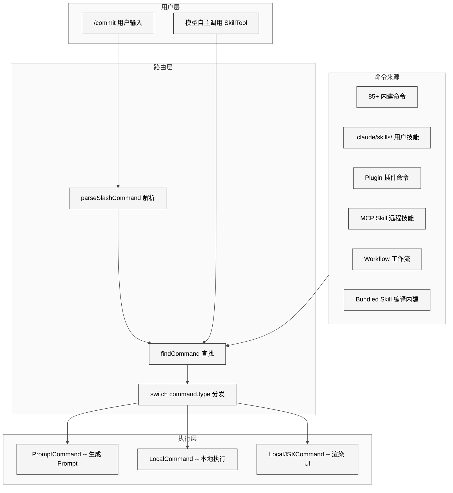
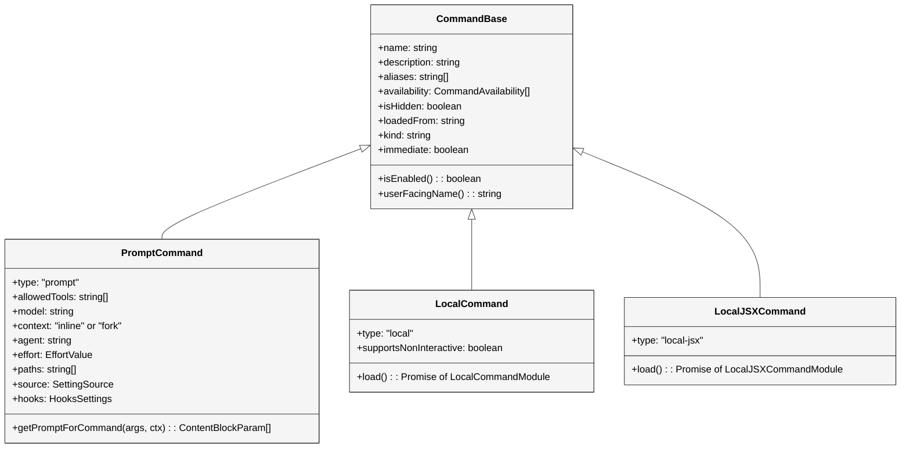
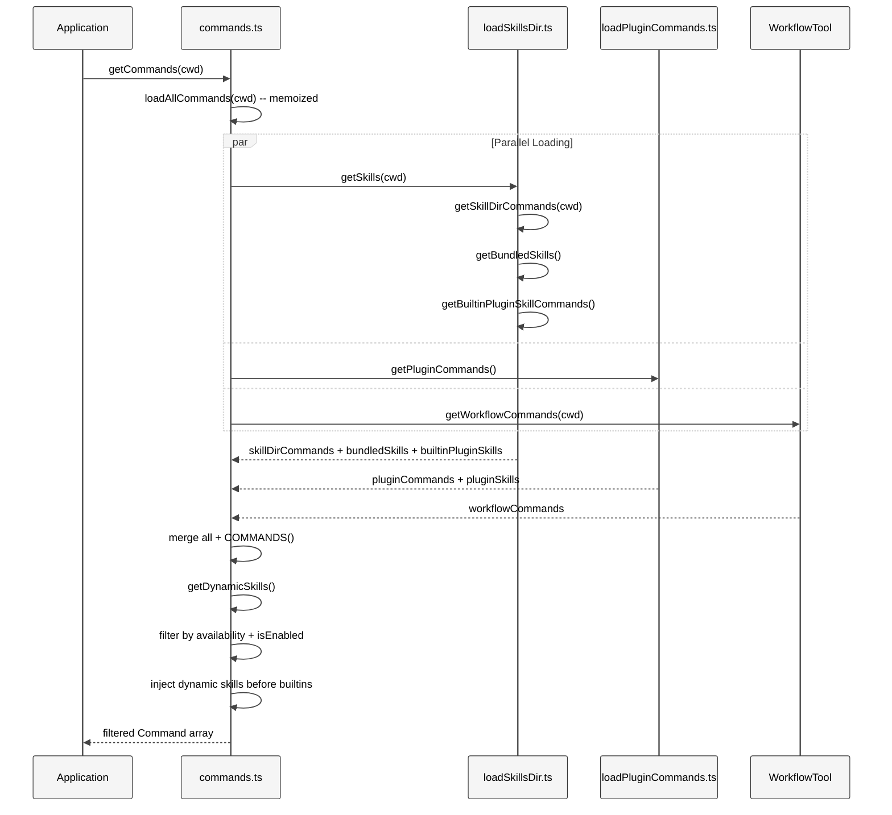
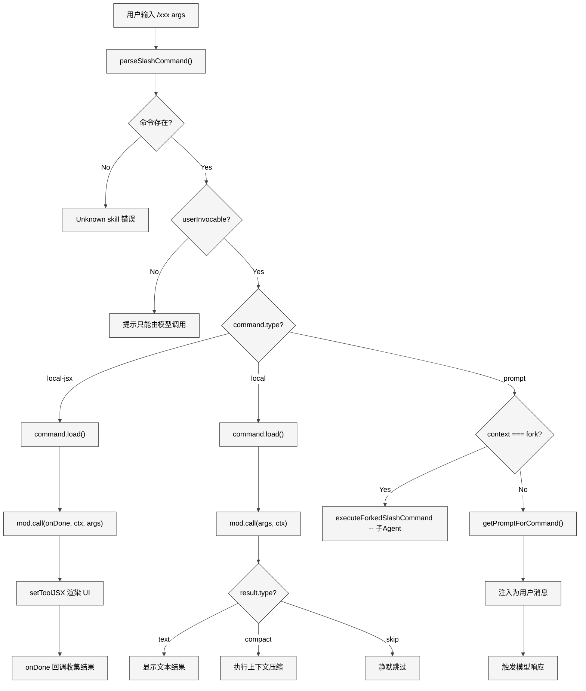
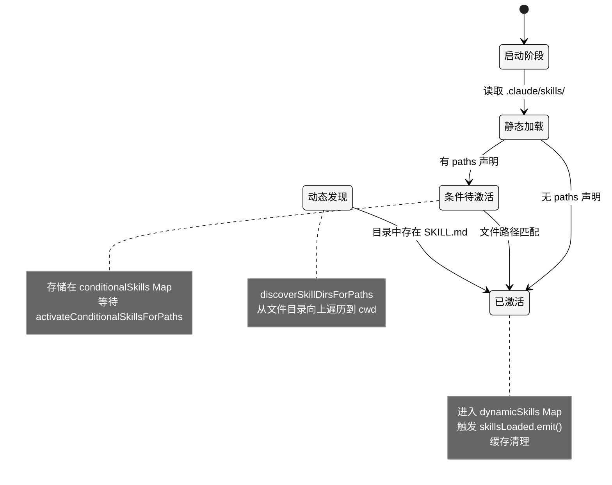
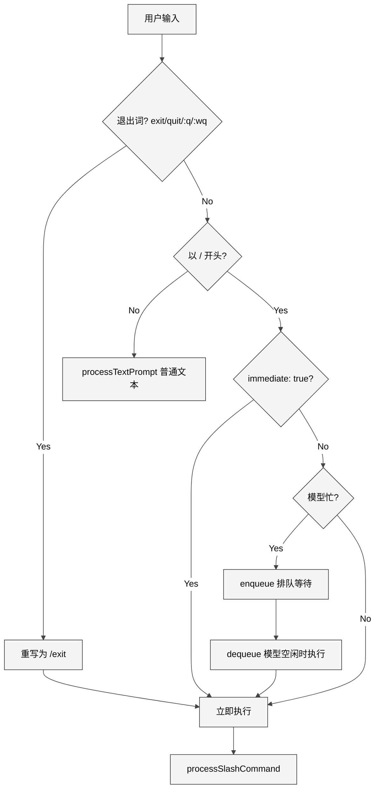

# 第 14 章 命令系统

> 核心提要：命令加载与扩展分发

## 11.1 定位

在 Claude Code 的 513,216 行 TypeScript 源码中（restored-src v2.1.88，1,884 文件），命令系统横跨 `src/commands.ts`（755 行聚合枢纽）、`src/types/command.ts`（217 行类型定义）、`src/commands/`（66 个子目录 + 12 个独立文件）、`src/skills/`（技能加载器）、`src/utils/processUserInput/processSlashCommand.tsx`（921 行调度器）以及 `src/tools/SkillTool/`（模型调用桥接），这些跨目录模块共同构成了一个数千行量级的命令分发与扩展体系，驱动着 85+ 个内建命令和可扩展的外部命令生态。

命令系统在 Claude Code 整体架构中的定位可以用一句话概括：**它是用户意图和模型能力之间的路由层**。用户通过 `/commit` 触发一个 Git 提交助手，通过 `/config` 打开配置面板，通过 `/my-skill` 调用自定义工作流——这些交互背后的类型体系、加载机制、分发逻辑和权限控制构成了 Claude Code 最重要的扩展架构。

<div style="background: #ffffff; padding: 16px; border-radius: 8px; margin: 16px 0;">



</div>

本章将从七个维度深入分析命令系统：类型体系的设计本质、六源聚合的工程方案、从 Markdown 到 Command 的转换流水线、命令分发的三叉路径、防御性编程模式、与竞品的对比，以及源码中仍存在的技术债务和改进方向。

---

## 11.2 架构设计：三种执行模型的统一

### 11.2.1 本质是什么

命令系统解决的根本问题是：**如何用一套统一的类型体系和分发机制，将执行方式完全不同、来源完全不同的 70+ 种操作聚合在一起**。

传统 CLI 工具的命令系统通常很简单——每个命令是一个函数，注册到一个 map 中，调用时查找并执行。但 Claude Code 面临三个非传统挑战：

1. **混合执行模型**：有的命令本地执行返回文本（`/clear`），有的生成 Prompt 发给 LLM（`/commit`），有的渲染交互式 React/Ink UI（`/config`）
2. **多源动态发现**：命令不仅来自代码中的静态定义，还来自磁盘上的 Markdown 文件、远程 MCP 服务器、第三方插件，甚至会话过程中才发现的嵌套目录
3. **双入口触发**：命令既可被用户通过 `/xxx` 手动触发，也可被模型通过 `SkillTool` 自主调用

解决方案是一个**判别联合类型**（Discriminated Union）+ **六源并行加载** + **三路分发**的架构。

### 11.2.2 Command 联合类型

类型基础定义在 `src/types/command.ts` L205-L206：

```typescript
export type Command = CommandBase &
  (PromptCommand | LocalCommand | LocalJSXCommand)
```

这是一个经典的 TypeScript 判别联合。`command.type` 字段取值为 `'prompt'` | `'local'` | `'local-jsx'`，编译器据此在 `switch` 语句中自动收窄类型。三种执行模型的本质差异如下：

| 类型 | `type` 值 | 执行方式 | 结果去向 | 典型命令 |
|------|-----------|---------|---------|---------|
| **PromptCommand** | `'prompt'` | `getPromptForCommand()` 生成 `ContentBlockParam[]` | 作为用户消息注入对话，触发模型响应 | `/commit`, `/review`, 自定义 Skill |
| **LocalCommand** | `'local'` | `load()` 后 `call()` 返回 `LocalCommandResult` | 文本直接显示 / 触发 compact / skip | `/clear`, `/compact`, `/cost` |
| **LocalJSXCommand** | `'local-jsx'` | `load()` 后 `call()` 返回 `React.ReactNode` | 渲染 Ink 全屏 UI，通过 `onDone` 回调收集结果 | `/config`, `/model`, `/help` |

**设计决策分析**：为什么不把所有命令统一为一种执行模型？答案在于 **结果的本质不同**。PromptCommand 的结果是"一段要发给 LLM 的文本"，它触发模型的下一轮思考；LocalCommand 的结果是"一段要显示给用户的文本"，它终结当前轮次；LocalJSXCommand 的结果是"一个交互式 UI"，它接管整个终端。三种结果需要完全不同的后续处理流程，合并反而会增加复杂度。

### 11.2.3 CommandBase：共享的元数据协议

`CommandBase`（`src/types/command.ts` L175-L203）定义了 20 个共享字段，构成命令系统的**发现协议**。无论命令来自哪里，只要实现这个接口，就能被 typeahead 搜索、权限检查、可用性过滤等基础设施统一处理：

```typescript
export type CommandBase = {
  name: string                           // 命令标识符
  description: string                    // 用户可见描述
  aliases?: string[]                     // 别名数组
  availability?: CommandAvailability[]   // 静态身份门控
  isEnabled?: () => boolean              // 动态功能开关
  isHidden?: boolean                     // 隐藏不在 typeahead 中显示
  loadedFrom?: 'commands_DEPRECATED' | 'skills' | 'plugin' | 'managed' | 'bundled' | 'mcp'
  kind?: 'workflow'                      // 区分 workflow 命令
  immediate?: boolean                    // 绕过排队立即执行
  disableModelInvocation?: boolean       // 禁止模型通过 SkillTool 调用
  userInvocable?: boolean                // 是否允许用户手动触发
  isSensitive?: boolean                  // 参数脱敏
  userFacingName?: () => string          // 显示名（可不同于内部 name）
  // ...
}
```

这里有一个精妙的设计分离——`availability` 与 `isEnabled()` 的职责划分：

- **`availability`**：静态的身份门控。`'claude-ai'` 表示仅 claude.ai 订阅者可用，`'console'` 表示仅 Console API 用户可用。这由 `meetsAvailabilityRequirement()` 在 `commands.ts` L417-L443 检查。
- **`isEnabled()`**：动态的功能开关。由 Feature Flag、平台检测、环境变量等运行时条件决定。这由 `isCommandEnabled()` 在 `types/command.ts` L214-L216 检查。

源码注释（`types/command.ts` L154-L167）对此有详尽说明：

> This is separate from `isEnabled()`:
>   - `availability` = who can use this (auth/provider requirement, static)
>   - `isEnabled()`  = is this turned on right now (GrowthBook, platform, env vars)

**对 Agent 开发者的启示**：将"谁有权访问"和"功能是否开启"分离为两个正交维度，是一个值得借鉴的权限设计模式。它避免了在一个条件函数中混杂身份检查和功能开关的逻辑。

<div style="background: #ffffff; padding: 16px; border-radius: 8px; margin: 16px 0;">



</div>

### 11.2.4 PromptCommand 的丰富性

PromptCommand（`src/types/command.ts` L25-L57）是三种类型中最复杂的，因为它同时支持内建 Prompt 命令和外部 Skill 扩展。关键字段包括：

- **`getPromptForCommand(args, context)`**：核心方法，生成发给模型的 Prompt 内容
- **`context: 'inline' | 'fork'`**：`inline` 将 Skill 内容展开到当前对话上下文，`fork` 启动独立子 Agent 执行
- **`allowedTools`**：Skill 额外允许的工具白名单（如 `/commit` 允许 `Bash(git add:*)`）
- **`paths`**：条件激活的文件路径 glob，只在模型触及匹配文件时才激活
- **`hooks`**：Skill 自带的 hooks 配置，在调用时临时注册

**`context: 'fork'` 是一个重要的架构决策**。当 Skill 声明 `context: fork` 时，它不再在主对话中展开（避免污染主上下文），而是启动一个独立的子 Agent（通过 `runAgent()`），拥有独立的 token 预算和工具上下文。这在 `SkillTool.ts` L122-L289 的 `executeForkedSkill()` 和 `processSlashCommand.tsx` L62 的 `executeForkedSlashCommand()` 中均有实现。

### 11.2.5 懒加载模式

Local 和 Local-JSX 命令使用 `load()` 方法实现懒加载。以 `/clear` 命令为例（`src/commands/clear/index.ts`）：

```typescript
const clear = {
  type: 'local',
  name: 'clear',
  description: 'Clear conversation history and free up context',
  aliases: ['reset', 'new'],
  supportsNonInteractive: false,
  load: () => import('./clear.js'),
} satisfies Command
```

`index.ts` 只包含元数据——name、description、aliases 等静态信息，总共 19 行。真正的实现代码在 `clear.ts` 中，通过 `load()` 的动态 `import()` 延迟到实际执行时才加载。由此可见 CLI 启动时加载 66 个命令子目录的 `index.ts` 成本极低。

`satisfies Command` 是一个精妙的 TypeScript 技巧：它在保持类型检查（确保对象满足 `Command` 接口）的同时，保留了字面类型推断（使 `type: 'local'` 被推断为字面量类型而非宽泛的 `string`），这对后续的 `switch` 语句类型收窄至关重要。

---

## 11.3 实现深度剖析：六源聚合与分发管线

### 11.3.1 六源并行加载

`commands.ts` 是命令系统的**聚合枢纽**。其核心函数 `loadAllCommands()`（L449-L469）将六个来源的命令并行加载后合并：

```typescript
const loadAllCommands = memoize(async (cwd: string): Promise<Command[]> => {
  const [
    { skillDirCommands, pluginSkills, bundledSkills, builtinPluginSkills },
    pluginCommands,
    workflowCommands,
  ] = await Promise.all([
    getSkills(cwd),
    getPluginCommands(),
    getWorkflowCommands ? getWorkflowCommands(cwd) : Promise.resolve([]),
  ])

  return [
    ...bundledSkills,         // 1. 编译内建的 Skill
    ...builtinPluginSkills,   // 2. 内置 Plugin 的 Skill
    ...skillDirCommands,      // 3. 用户/项目 .claude/skills/
    ...workflowCommands,      // 4. Workflow 命令
    ...pluginCommands,        // 5. Plugin 命令
    ...pluginSkills,          // 6. Plugin 提供的 Skill
    ...COMMANDS(),            // 7. 85+ 内建命令（优先级最低）
  ]
})
```

**合并顺序决定了命名冲突的优先级**：扩展命令排在前面，内建命令排在最后。由于 `findCommand()` 返回第一个匹配项，用户自定义的同名 Skill 会覆盖内建命令。这是一个有意的设计——赋予用户最高的自定义权限。

`memoize` 包装是因为加载涉及磁盘 I/O（读取 `.claude/skills/` 目录）和网络操作（Plugin 加载），结果按 `cwd` 缓存。但注意——缓存的是 `loadAllCommands`，而非最终暴露的 `getCommands()`。

<div style="background: #ffffff; padding: 16px; border-radius: 8px; margin: 16px 0;">



</div>

### 11.3.2 COMMANDS() 注册表与 Feature Gate

文件顶部（`commands.ts` L2-L152）是内建命令的导入区。这里有三种导入策略，服务于不同的编译时/运行时需求：

**策略一：静态 import**（约 60 个命令，L2-L58）

```typescript
import clear from './commands/clear/index.js'
import compact from './commands/compact/index.js'
import config from './commands/config/index.js'
```

对于使用 `index.ts` + `load()` 模式的 Local/Local-JSX 命令，静态导入的成本很低。但对于直接导入完整实现的 Prompt 命令（如 `commit.ts`、`review.ts`、`advisor.ts`），导入会加载实际依赖。

项目对此有明确意识——`/insights` 命令（113KB/3,200 行）专门做了懒加载 shim（L188-L202）：

```typescript
const usageReport: Command = {
  type: 'prompt',
  name: 'insights',
  description: 'Generate a report analyzing your Claude Code sessions',
  contentLength: 0,
  progressMessage: 'analyzing your sessions',
  source: 'builtin',
  async getPromptForCommand(args, context) {
    const real = (await import('./commands/insights.js')).default
    if (real.type !== 'prompt') throw new Error('unreachable')
    return real.getPromptForCommand(args, context)
  },
}
```

这个特殊处理恰好说明：**并非所有内建 Prompt 命令都做了懒加载，只有重量级模块（如 insights.ts）才值得单独处理**。

**策略二：feature() 门控 + 条件 require**（约 15 个命令，L62-L122）

```typescript
const proactive =
  feature('PROACTIVE') || feature('KAIROS')
    ? require('./commands/proactive.js').default
    : null

const voiceCommand = feature('VOICE_MODE')
  ? require('./commands/voice/index.js').default
  : null
```

`feature()` 来自 `bun:bundle`，是编译期常量。当 `feature('VOICE_MODE')` 为 `false` 时，整个 `require()` 分支被死代码消除（DCE）移除——不仅模块不被执行，连文件都不会打包。这里有 15 个 feature-gated 命令，涵盖语音（`VOICE_MODE`）、桥接（`BRIDGE_MODE`）、工作流（`WORKFLOW_SCRIPTS`）、分叉（`FORK_SUBAGENT`）、伙伴（`BUDDY`）等实验性功能。

**策略三：运行时条件 require**（L48-L51）

```typescript
const agentsPlatform =
  process.env.USER_TYPE === 'ant'
    ? require('./commands/agents-platform/index.js').default
    : null
```

`USER_TYPE === 'ant'` 是运行时检查，区分 Anthropic 内部版和外部版。与 `feature()` 不同，这不会被编译时移除——模块会被打包，只是运行时条件跳过。

所有命令汇聚到 `COMMANDS()` 函数（L258-L346）。注释解释了为什么用 `memoize(() => [...])` 而不是直接声明数组：

> Declared as a function so that we don't run this until getCommands is called, since underlying functions read from config, which can't be read at module initialization time.

具体来说，`login()` 命令（L337）需要读取认证配置，而配置在模块初始化阶段还没就绪。

`INTERNAL_ONLY_COMMANDS`（L225-L254）收集了约 25 个仅对 `USER_TYPE === 'ant'` 可见的命令，包括 `backfillSessions`、`breakCache`、`bughunter`、`commit`（内部版 commit 与外部版不同）、`share`、`teleport`、`antTrace` 等。

### 11.3.3 getCommands()：可用性过滤与动态注入

`getCommands()`（L476-L517）是对外暴露的核心 API。它在 memoized 的 `loadAllCommands()` 之上叠加两层处理：

**第一层：可用性 + 启用状态过滤**

```typescript
const baseCommands = allCommands.filter(
  _ => meetsAvailabilityRequirement(_) && isCommandEnabled(_),
)
```

**为什么不 memoize？** 注释（L472-L474）说得很清楚：

> Not memoized — auth state can change mid-session (e.g. after /login), so this must be re-evaluated on every getCommands() call.

用户执行 `/login` 后，`isClaudeAISubscriber()` 的返回值可能改变，之前不可用的命令需要变为可用。

**第二层：动态 Skill 注入**

```typescript
const builtInNames = new Set(COMMANDS().map(c => c.name))
const insertIndex = baseCommands.findIndex(c => builtInNames.has(c.name))
return [
  ...baseCommands.slice(0, insertIndex),
  ...uniqueDynamicSkills,
  ...baseCommands.slice(insertIndex),
]
```

动态发现的 Skill 被插入到"所有扩展命令之后、所有内建命令之前"的位置。这确保了它们的优先级低于显式加载的扩展，但高于内建命令。

### 11.3.4 命令分发：三路 switch

当用户输入以 `/` 开头的文本时，`processSlashCommand.tsx` 中的 `getMessagesForSlashCommand()` 函数（L525）负责分发。核心逻辑在 L550-L761：

```typescript
switch (command.type) {
  case 'local-jsx':
    return new Promise<SlashCommandResult>(resolve => {
      const onDone = (result?, options?) => { /* ... */ }
      command.load().then(mod => mod.call(onDone, context, args))
        .then(jsx => { setToolJSX({ jsx, ... }) })
    })

  case 'local':
    const mod = await command.load()
    const result = await mod.call(args, context)
    // result.type === 'text' | 'compact' | 'skip'
    // ...

  case 'prompt':
    if (command.context === 'fork') {
      return await executeForkedSlashCommand(command, args, ...)
    }
    return await getMessagesForPromptSlashCommand(command, args, ...)
}
```

**Local-JSX 路径的异步模型值得注意**。它返回一个 `new Promise`，通过 `onDone` 回调（而非 async/await）收集结果。这是因为 JSX 命令需要渲染交互式 UI（如 `/config` 的配置面板），用户与 UI 交互完成后才调用 `onDone`。在 UI 渲染期间，`setToolJSX()` 接管了终端显示。

代码中有一个精巧的竞态条件防护（L629）：

```typescript
if (doneWasCalled) return;
```

这防止了以下情况：当 `mod.call()` 在返回 JSX 之前就同步调用了 `onDone`（早期退出路径），随后的 `setToolJSX()` 会与已经清理的状态冲突，导致焦点和队列处理器死锁。

<div style="background: #ffffff; padding: 16px; border-radius: 8px; margin: 16px 0;">



</div>

### 11.3.5 双入口：用户 /xxx 与模型 SkillTool

命令系统有两个触发入口：

1. **用户手动**：用户输入 `/commit` → `handlePromptSubmit()` → `processUserInput()` → `processSlashCommand()` → `getMessagesForSlashCommand()`
2. **模型自主**：模型调用 `SkillTool` 工具 → `SkillTool.call()` → `processPromptSlashCommand()` 或 `executeForkedSkill()`

`SkillTool`（`src/tools/SkillTool/SkillTool.ts`）是模型调用命令的桥接工具。它的 `getAllCommands()`（L81-L94）合并了本地命令和 MCP 命令：

```typescript
async function getAllCommands(context: ToolUseContext): Promise<Command[]> {
  const mcpSkills = context
    .getAppState()
    .mcp.commands.filter(
      cmd => cmd.type === 'prompt' && cmd.loadedFrom === 'mcp',
    )
  if (mcpSkills.length === 0) return getCommands(getProjectRoot())
  const localCommands = await getCommands(getProjectRoot())
  return uniqBy([...localCommands, ...mcpSkills], 'name')
}
```

**关键过滤逻辑**：并非所有 `getCommands()` 返回的命令都能被模型调用。`getSkillToolCommands()`（`commands.ts` L563-L581）过滤出模型可见的命令子集：

```typescript
export const getSkillToolCommands = memoize(
  async (cwd: string): Promise<Command[]> => {
    const allCommands = await getCommands(cwd)
    return allCommands.filter(
      cmd =>
        cmd.type === 'prompt' &&
        !cmd.disableModelInvocation &&
        cmd.source !== 'builtin' &&
        (cmd.loadedFrom === 'bundled' ||
          cmd.loadedFrom === 'skills' ||
          cmd.loadedFrom === 'commands_DEPRECATED' ||
          cmd.hasUserSpecifiedDescription ||
          cmd.whenToUse),
    )
  },
)
```

注意这里排除了 `source === 'builtin'` 的命令——内建的 `/clear`、`/compact`、`/help` 等不会出现在模型的技能列表中，因为它们是本地操作，模型调用没有意义。

SkillTool 还实现了一个精巧的**安全属性白名单**（L875-L933）：如果 Skill 只包含安全属性（名称、描述、模型、effort 等），则自动允许执行，无需用户确认权限。只有包含 `allowedTools`（额外工具权限）、`hooks`（自定义钩子）等"有影响力"的属性时，才要求用户确认。

---

## 11.4 Skill 加载：从 Markdown 到 Command

### 11.4.1 五层目录结构

Skill 从五个目录层级加载，优先级由 `getSkillDirCommands()`（`src/skills/loadSkillsDir.ts` L638-L804）控制：

| 层级 | 路径示例 | 来源标识 | 作用 |
|------|---------|---------|------|
| Managed | `<MDM-path>/.claude/skills/` | `policySettings` | 企业策略强制 |
| User | `~/.claude/skills/` | `userSettings` | 用户全局 |
| Project | `<cwd>/.claude/skills/` | `projectSettings` | 项目级别 |
| Additional | `<--add-dir>/.claude/skills/` | `projectSettings` | 附加目录 |
| Legacy | `<cwd>/.claude/commands/` | `commands_DEPRECATED` | 兼容旧格式 |

新格式要求严格的目录结构：`my-skill/SKILL.md`。旧的 `/commands/` 目录额外支持单文件格式（`some-command.md`）。

五个来源的加载是**完全并行**的（L679-L714），因为它们读取不同目录，没有共享状态。

### 11.4.2 Frontmatter 解析与 createSkillCommand

每个 `SKILL.md` 使用 YAML Frontmatter 定义元数据。解析分两个函数：

- `parseSkillFrontmatterFields()`（L185-L265）：解析 description、allowed-tools、model、hooks、context、agent、effort、shell 等 14 个字段
- `parseSkillPaths()`（L159-L178）：独立解析 `paths` 字段，因为它使用 `ignore` 库的 glob 匹配

`createSkillCommand()`（L270-L401）完成从 Markdown 到 Command 对象的转换。其核心是 `getPromptForCommand()` 方法，执行四步处理：

```typescript
async getPromptForCommand(args, toolUseContext) {
  // 1. 注入 base directory 信息
  let finalContent = baseDir
    ? `Base directory for this skill: ${baseDir}\n\n${markdownContent}`
    : markdownContent

  // 2. 参数替换：${ARG1} -> 用户传入的参数
  finalContent = substituteArguments(finalContent, args, true, argumentNames)

  // 3. 目录变量替换
  finalContent = finalContent.replace(/\$\{CLAUDE_SKILL_DIR\}/g, skillDir)
  finalContent = finalContent.replace(/\$\{CLAUDE_SESSION_ID\}/g, getSessionId())

  // 4. 内联 Shell 命令执行：!`git status` -> 实际执行结果
  if (loadedFrom !== 'mcp') {
    finalContent = await executeShellCommandsInPrompt(finalContent, ...)
  }

  return [{ type: 'text', text: finalContent }]
}
```

**第 4 步的安全决策至关重要**：MCP Skill 来自远程不可信来源，跳过 `executeShellCommandsInPrompt`，防止其 Markdown 中的 `` !`...` `` 语法被执行为远程代码。源码注释（L371-L373）明确说明：

> Security: MCP skills are remote and untrusted — never execute inline shell commands (!`…` / ```! … ```) from their markdown body.

### 11.4.3 去重机制

由于 Skill 从多个目录层级加载，可能通过 symlink 或重叠的父目录引用同一个文件。`getSkillDirCommands()` 使用 `getFileIdentity()`（L118-L124）解析 `realpath`，基于规范路径去重。

源码注释（L107-L116）解释了为什么选择 `realpath` 而非 `inode`：

> Uses realpath to resolve symlinks, which is filesystem-agnostic and avoids issues with filesystems that report unreliable inode values (e.g., inode 0 on some virtual/container/NFS filesystems, or precision loss on ExFAT).

这是从 GitHub issue #13893 的真实 Bug 中学到的经验。

### 11.4.4 条件 Skill 与动态发现

这是命令系统中关键的两个机制。

**条件 Skill**（`activateConditionalSkillsForPaths()`，L997-L1058）：

Skill 可以声明 `paths: src/**/*.ts`，表示只在模型操作匹配文件时才激活。这些 Skill 在启动时加载但存入 `conditionalSkills` Map 中，不进入命令列表。当模型读写文件时，系统检查路径匹配：

```typescript
const skillIgnore = ignore().add(skill.paths)
if (skillIgnore.ignores(relativePath)) {
  dynamicSkills.set(name, skill)
  conditionalSkills.delete(name)
  activatedConditionalSkillNames.add(name)
}
```

使用 `ignore` 库（与 `.gitignore` 相同的 glob 引擎），确保匹配行为与开发者已有的心智模型一致。

**动态目录发现**（`discoverSkillDirsForPaths()`，L861-L915）：

当模型在对话过程中读取或编辑文件时，系统从文件所在目录向上遍历到 `cwd`，检查路径上是否存在 `.claude/skills/` 目录：

```typescript
while (currentDir.startsWith(resolvedCwd + pathSep)) {
  const skillDir = join(currentDir, '.claude', 'skills')
  if (!dynamicSkillDirs.has(skillDir)) {
    dynamicSkillDirs.add(skillDir)
    await fs.stat(skillDir)
    if (await isPathGitignored(currentDir, resolvedCwd)) continue
    newDirs.push(skillDir)
  }
  currentDir = dirname(currentDir)
}
```

注意 `isPathGitignored` 检查：阻止 `node_modules/pkg/.claude/skills/` 等被 gitignore 的目录中的 Skill 被加载，这是一个重要的安全防线。

**两个机制的协作实现了渐进式发现**：项目根目录的 Skill 在启动时加载；嵌套在子目录中的 Skill 在模型接触到那个区域时动态发现；声明了 `paths` 的 Skill 在匹配文件被操作时条件激活。

<div style="background: #ffffff; padding: 16px; border-radius: 8px; margin: 16px 0;">



</div>

### 11.4.5 其他命令来源

**Bundled Skills**（`src/skills/bundledSkills.ts`）：通过代码注册的内建 Skill，如 `/batch`、`/simplify`。支持 `files` 字段——附带的参考文件在首次调用时懒写入临时目录。写入使用 `O_NOFOLLOW | O_EXCL` 标志（L176-L184）防止 symlink 攻击，注释详细解释了安全模型（L169-L175）：

> The per-process nonce in getBundledSkillsRoot() is the primary defense against pre-created symlinks/dirs. Explicit 0o700/0o600 modes keep the nonce subtree owner-only...

**Plugin Commands**（`src/utils/plugins/loadPluginCommands.ts`）：Plugin 通过 Marketplace 安装。命令名称采用 `pluginName:baseName` 的命名空间规则（`getCommandNameFromFile()`，L60-L97），支持目录嵌套（`pluginName:ns:sk`）。Plugin 命令额外支持 `${CLAUDE_PLUGIN_ROOT}` 和 `${CLAUDE_PLUGIN_DATA}` 变量替换，以及 `userConfig` 选项替换（L348-L354）。

**MCP Skills**：通过 `mcpSkillBuilders.ts`（45 行）的写一次注册表打破循环依赖。`loadSkillsDir.ts` 在模块初始化时注册 `createSkillCommand` 和 `parseSkillFrontmatterFields`，MCP 模块通过 `getMCPSkillBuilders()` 获取这些函数。注释（L7-L24）详细解释了为什么需要这种间接方式：

> The non-literal dynamic-import approach ("await import(variable)") fails at runtime in Bun-bundled binaries — the specifier is resolved against the chunk's /$bunfs/root/… path...

**Workflow Commands**：通过 `feature('WORKFLOW_SCRIPTS')` 门控，在 `CommandBase` 中通过 `kind: 'workflow'` 标记。`formatDescriptionWithSource()`（`commands.ts` L728-L754）据此在 typeahead 中显示 `(workflow)` 徽章。

---

## 11.5 细节

### 11.5.1 Prompt 预算管理

SkillTool 的 prompt 生成面临一个实际问题：当用户安装了数十个 Skill 时，技能列表本身就消耗大量 token。`src/tools/SkillTool/prompt.ts` 实现了一套预算管理机制：

```typescript
export const SKILL_BUDGET_CONTEXT_PERCENT = 0.01  // 上下文窗口的 1%
export const CHARS_PER_TOKEN = 4
export const DEFAULT_CHAR_BUDGET = 8_000           // 默认 8K 字符
export const MAX_LISTING_DESC_CHARS = 250          // 单条描述上限
```

`formatCommandsWithinBudget()`（L70-L171）实现了三级降级策略：

1. **全量**：所有命令的完整描述。如果总字符数在预算内，直接使用
2. **截断**：非 Bundled 命令的描述被截断到 `maxDescLen` 字符。Bundled Skill 永远保留完整描述（因为它们是 Anthropic 精心设计的，描述对匹配率至关重要）
3. **仅名称**：极端情况下，非 Bundled 命令只显示名称，Bundled 保留描述

这种"Bundled 优先"的设计体现了一个务实的优先级判断：内建 Skill 的描述经过精心调优，对模型的技能匹配准确率影响最大。

### 11.5.2 缓存清理的链式传播

命令系统维护了多层缓存，清理时需要正确传播。`clearCommandsCache()`（`commands.ts` L534-L539）调用了四个清理函数：

```typescript
export function clearCommandsCache(): void {
  clearCommandMemoizationCaches()
  clearPluginCommandCache()
  clearPluginSkillsCache()
  clearSkillCaches()
}
```

但更精妙的是 `clearCommandMemoizationCaches()`（L523-L532），它发现了一个 lodash `memoize` 的陷阱：

> getSkillIndex in skillSearch/localSearch.ts is a separate memoization layer built ON TOP of getSkillToolCommands/getCommands. Clearing only the inner caches is a no-op for the outer — lodash memoize returns the cached result without ever reaching the cleared inners. Must clear it explicitly.

由此可见如果只清理 `getSkillToolCommands` 的缓存而不清理上层的 `getSkillIndex` 缓存，上层函数仍然返回过期结果。

动态 Skill 发现时，通过 `skillsLoaded` 信号（`createSignal()`）通知所有监听者清理缓存。`onDynamicSkillsLoaded()`（L839-L851）包装了回调以防止抛出异常中断信号传播。

### 11.5.3 Bridge 安全过滤

远程 Bridge 场景（移动端/Web 客户端通过 Remote Control 连接）下，`isBridgeSafeCommand()`（L672-L676）对命令进行安全过滤：

```typescript
export function isBridgeSafeCommand(cmd: Command): boolean {
  if (cmd.type === 'local-jsx') return false   // 无法远程渲染 JSX
  if (cmd.type === 'prompt') return true        // 展开为文本，天然安全
  return BRIDGE_SAFE_COMMANDS.has(cmd)           // local 需要显式白名单
}
```

`BRIDGE_SAFE_COMMANDS`（L651-L660）只包含 6 个命令：`compact`、`clear`、`cost`、`summary`、`releaseNotes`、`files`。注释（L639-L650）记录了这个设计的起因：

> PR #19134 blanket-blocked all slash commands from bridge inbound because `/model` from iOS was popping the local Ink picker.

### 11.5.4 handlePromptSubmit 的退出词重写

`handlePromptSubmit.ts` 在最外层实现了退出词检测：用户输入 `exit`、`quit`、`:q`、`:wq` 等会被重写为 `/exit` 命令。这是在 `processUserInput()` 之前完成的，确保退出逻辑不受命令系统内部状态的影响。

### 11.5.5 即时命令与队列机制

当模型正在处理时（queryGuard 激活），大多数命令被 `enqueue()` 排队。但标记了 `immediate: true` 的命令绕过队列立即执行。目前只有 Local-JSX 类型使用此机制（如 `/exit`、`/model`），因为它们需要在模型运行时响应用户操作。

<div style="background: #ffffff; padding: 16px; border-radius: 8px; margin: 16px 0;">



</div>

---

## 11.6 比较

### 11.6.1 命令系统设计对比

| 维度 | Claude Code | Cursor | Aider | Cline | Copilot CLI |
|------|------------|--------|-------|-------|-------------|
| 命令架构 | 判别联合 3 类型 | IDE Action 系统 | 纯文本 /commands | VS Code 命令面板 | CLI 子命令 |
| 扩展机制 | Markdown SKILL.md + MCP + Plugin | Rules + Notepads | 无用户扩展 | 无用户扩展 | 无 |
| 模型可调用 | SkillTool 桥接 | 内部 tool_call | 否 | 否 | 否 |
| 条件激活 | paths glob 匹配 | 无 | 无 | 无 | 无 |
| 动态发现 | 文件路径向上遍历 | 无 | 无 | 无 | 无 |
| 执行上下文 | inline/fork 可选 | 固定 inline | 固定 inline | 固定 inline | 固定 inline |
| 预算管理 | 1% 上下文窗口预算 | 无限制 | 无 | 无 | 无 |

### 11.6.2 Claude Code 的优势

**Markdown-as-Command 是最低门槛的扩展方式**。用户只需写一个 Markdown 文件就能创建新命令，不需要学习任何 API 或 SDK。这比 Cursor 的 Rules（仅影响行为指令）更强大，因为 Skill 可以携带 `allowed-tools`、`hooks`、`model` 等运行时配置。

**模型双向调用**是独有的设计。在 Aider 和 Cline 中，命令只能由用户手动触发。Claude Code 通过 SkillTool 让模型能自主判断"现在应该调用 /commit"并执行，实现了 Agent 的自主性。

**条件激活 + 动态发现**构成了一个"按需加载"的精细化体系。只有当模型实际接触到相关代码区域时，对应的 Skill 才会出现在模型的工具列表中。这不仅节省了 Prompt Token，还减少了模型的选择困难。

### 11.6.3 Claude Code 的局限

**缺乏类型化参数**。当前所有命令的参数都是单一的 `args: string`，缺少参数验证、自动补全和类型化的参数定义。相比之下，MCP 工具的参数使用 JSON Schema 精确定义。`argumentHint` 和 `argNames` 只提供了最基础的提示，远未达到 CLI 框架（如 yargs、commander）的参数处理能力。

**Skill 间无依赖管理**。Skill A 无法声明依赖 Skill B，也无法组合多个 Skill。Cursor 的 Rules 虽然更简单，但通过文件路径 glob 实现了条件组合。

**无版本化和回滚**。Skill 没有版本概念（`version` 字段虽然存在于 `CommandBase` 中，但未被任何逻辑使用），无法在更新 Skill 后回滚到之前的版本。

---

## 11.7 辨误

### 误解一："Claude Code 的命令就是简单的 /slash 快捷方式"

这是社区最常见的低估。实际上，命令系统是 Claude Code 最主要的扩展入口——Bundled Skill `/batch` 实现了大规模并行修改（拆成 5-30 个独立单元，每个单元一个后台 Agent），`/simplify` 派 3 个并行 Review Agent 检查代码质量。这些不是"快捷方式"，而是完整的 Agent 工作流。

### 误解二："Skill 就是 System Prompt 的一部分"

错误。Skill 内容不是注入 System Prompt，而是通过 `createUserMessage({ content: finalContent, isMeta: true })` 作为 **isMeta 的用户消息**注入对话。`isMeta` 标记意味着这条消息对模型可见但对用户隐藏。这与 CLAUDE.md 的注入方式（`<system-reminder>` 标签）不同，也与 System Prompt 的静态缓存段不同。

### 误解三："Feature-gated 命令在外部版中被删除了"

部分正确。通过 `feature()` 门控的命令在编译时被 DCE 移除，确实不存在于外部构建产物中。但通过 `process.env.USER_TYPE === 'ant'` 门控的命令（如 `agentsPlatform`）**仍然打包在外部版中**，只是运行时不执行。这是两种不同的门控策略，分别适用于不同的保密级别。

### 误解四："MCP Skill 和本地 Skill 行为完全相同"

不完全。有两个关键差异：
1. MCP Skill **不执行内联 Shell 命令**（`loadedFrom !== 'mcp'` 检查）
2. MCP Skill 通过 `AppState.mcp.commands` 而非 `getCommands()` 传递，需要 `SkillTool.getAllCommands()` 额外合并

---

## 11.8 展望

### 11.8.1 源码中的技术债务

**Legacy `/commands/` 目录**。`loadedFrom: 'commands_DEPRECATED'` 明确标记了旧格式的弃用状态，但兼容代码仍然存在（`loadSkillsDir.ts` L566-L623 的 `loadSkillsFromCommandsDir()`）。`transformSkillFiles()` 需要处理两种格式的混合情况，增加了代码复杂度。

**processSlashCommand.tsx 的 921 行体量**。这个文件承担了太多职责：命令分发、Prompt 生成、Fork 子 Agent 执行、Bridge 安全检查、遥测事件、消息构造。按照单一职责原则，至少应该拆分为 3-4 个模块。

**Prompt 命令缺乏统一的懒加载**。如前所述，只有 `/insights` 做了懒加载 shim，其他 Prompt 命令（`commit.ts`、`review.ts`、`advisor.ts` 等）的完整实现在启动时就被加载。这些文件虽然不大（数百行），但其依赖链（`executeShellCommandsInPrompt`、`getAttributionTexts` 等）可能拉入更多模块。

### 11.8.2 潜在的架构瓶颈

**`memoize` 的粗粒度缓存**。`loadAllCommands` 按 `cwd` 缓存，意味着同一工作目录下的所有会话共享同一份命令列表。当动态 Skill 被发现时，需要通过 `clearCommandMemoizationCaches()` 清除所有层级的缓存。如果未来支持多工作目录或工作区（workspace），这种缓存策略可能需要重新设计。

**线性搜索的 `findCommand()`**。当前实现（`commands.ts` L688-L698）是 O(n) 的线性扫描：

```typescript
export function findCommand(commandName: string, commands: Command[]): Command | undefined {
  return commands.find(
    _ => _.name === commandName ||
      getCommandName(_) === commandName ||
      _.aliases?.includes(commandName),
  )
}
```

对于 100+ 个命令，每次查找需要遍历整个数组并检查 name、userFacingName、aliases。虽然在当前规模下性能不是问题，但如果命令数量增长到数百个（大量 Plugin + MCP Skill），构建 `Map<string, Command>` 的索引会更高效。

### 11.8.3 如果设计下一版

1. **类型化参数系统**：用 Zod Schema 定义命令参数，支持验证、自动补全和类型安全。SkillTool 已经使用了 `z.object({ skill, args })` 定义自己的输入，同样的模式可以推广到所有命令。

2. **Skill 组合器**：允许 Skill 声明依赖其他 Skill，或定义一个 Skill Pipeline（A -> B -> C）。当前要实现类似效果，只能在 Markdown 中写自然语言指令让模型自行串联。

3. **增量式缓存更新**：发现新的动态 Skill 时，不清除全部缓存重建，而是增量追加。这需要将 `memoize` 替换为自定义的缓存管理器。

4. **命令注册表索引化**：将 `findCommand()` 的线性搜索替换为 `Map<string, Command>` 索引，支持按 name、alias、loadedFrom 等多维度快速查找。

5. **统一 Prompt 命令的懒加载**：为所有 Prompt 命令引入与 Local 命令相同的 `index.ts` + `load()` 模式，将 `getPromptForCommand` 的实际实现延迟加载。

---

## 11.9 小结

1. **三种执行模型的统一**：`Command = CommandBase & (PromptCommand | LocalCommand | LocalJSXCommand)` 的判别联合设计，用 TypeScript 类型系统保证了分发安全性——编译器在 `switch` 语句中自动收窄类型，不可能遗漏分支。

2. **六源并行加载 + 优先级排序**：`loadAllCommands()` 将 Bundled Skill、Builtin Plugin Skill、用户 Skill、Workflow、Plugin Commands、Plugin Skills 和 85+ 内建命令并行加载并按优先级合并。扩展命令优先于内建命令，用户的自定义可以覆盖默认行为。

3. **渐进式发现模型**：启动时加载静态命令 -> 会话中按文件路径动态发现嵌套 Skill -> 按 `paths` glob 条件激活特定 Skill。这种三阶段加载策略在启动速度和功能完整性之间取得了精确的平衡。

4. **双入口触发的 Agent 自主性**：命令不仅可被用户通过 `/xxx` 手动触发，还可被模型通过 SkillTool 自主调用。`SAFE_SKILL_PROPERTIES` 白名单确保安全 Skill 无需确认即可执行，而包含 `allowedTools` 或 `hooks` 的 Skill 则需要用户授权。

5. **Markdown-as-Command 的极低扩展门槛**：创建一个 `.claude/skills/my-skill/SKILL.md` 文件就能注册新命令，支持参数替换、内联 Shell 执行、模型覆盖、工具白名单、Fork 子 Agent 等高级能力。这是 AI Agent 产品中对"扩展性"最务实的回答——不需要 SDK、不需要编译、不需要发布，一个 Markdown 文件即是全部。

**对 Agent 开发者的核心启示**：设计 Agent 的扩展系统时，应该让扩展的创建成本趋近于零（Markdown 文件），同时让扩展的能力上限足够高（工具白名单、模型覆盖、子 Agent 分叉）。Claude Code 的命令系统证明了这两个看似矛盾的目标可以同时实现。
