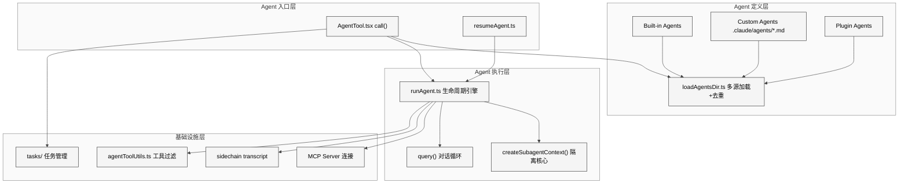
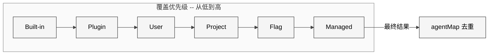
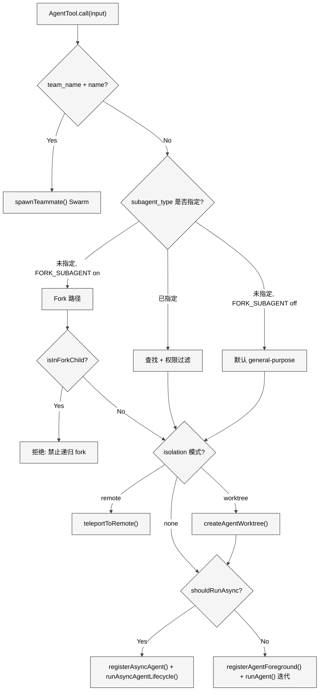
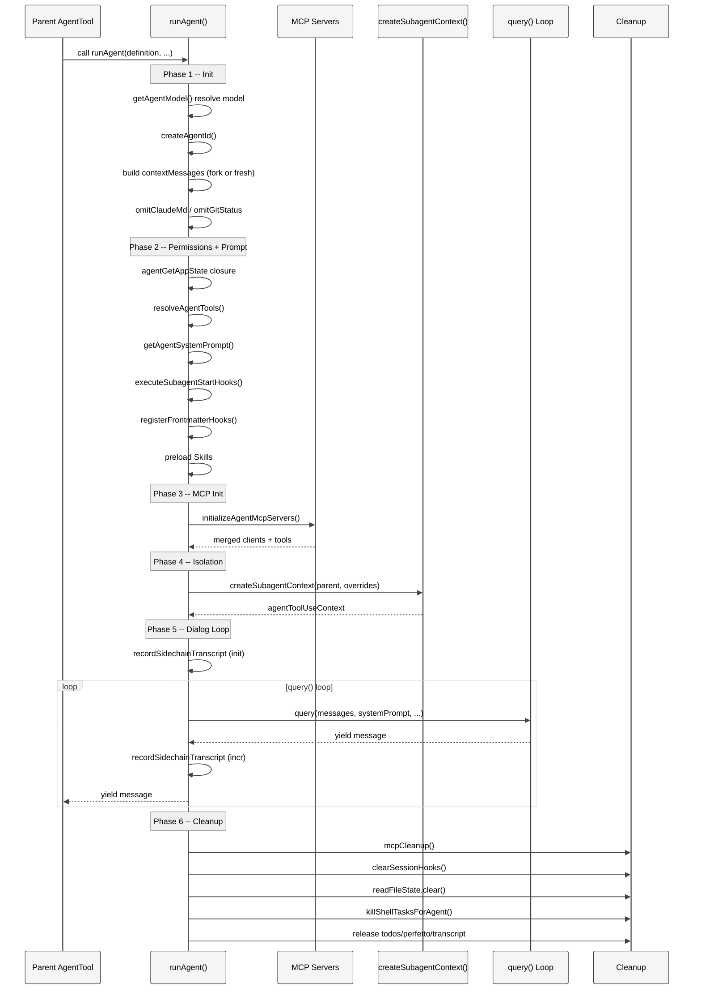
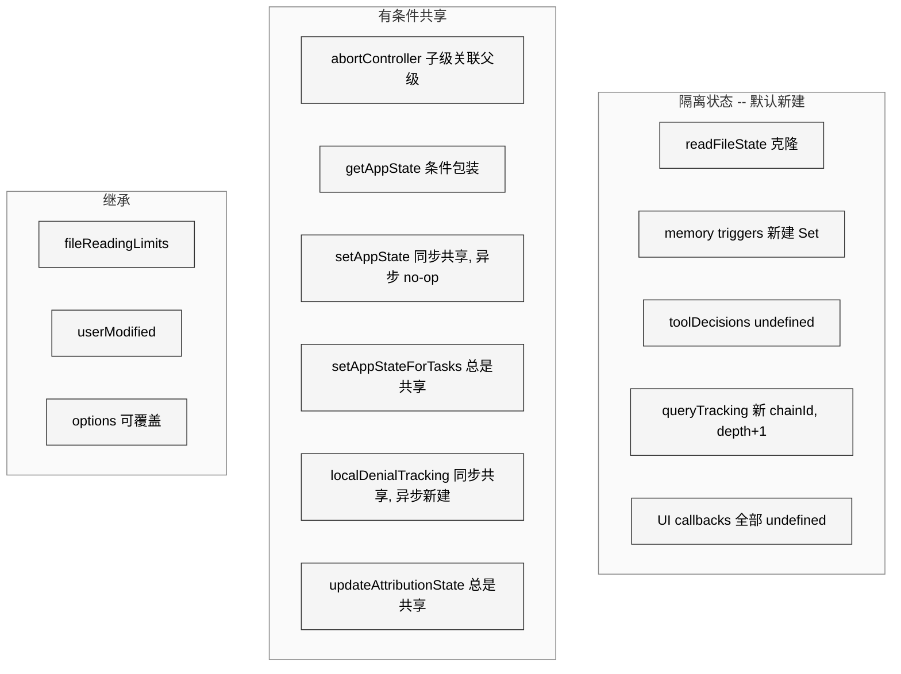
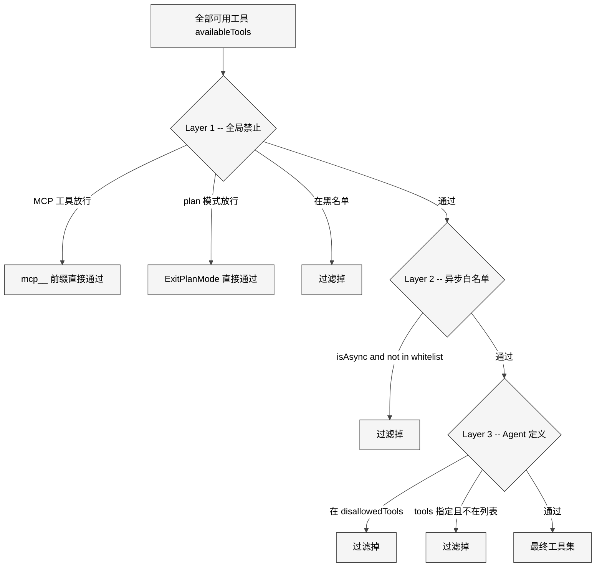
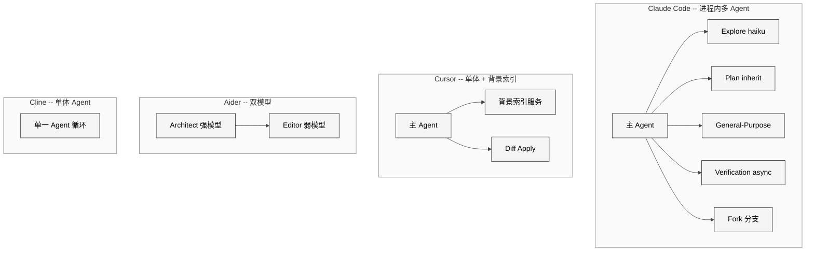
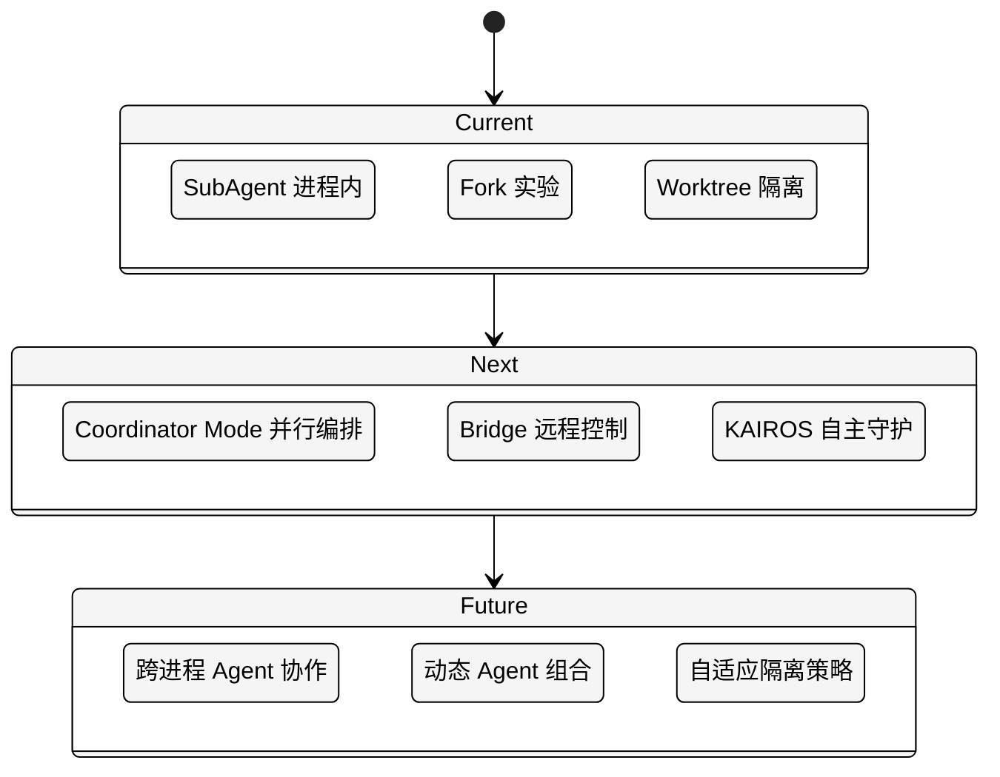

# 第 15 章 Agent 系统

> 核心提要：子 Agent 的隔离与共享

## 12.1 定位

### 12.1.1 Agent 系统在 Claude Code 中的位置

在 Claude Code 的 513,216 行 TypeScript 代码（restored-src v2.1.88，1,884 文件）中，Agent 子系统占据了独特的位置：它既不是最庞大的模块（`utils/` 更大），也不是最底层的基础设施（那是 `bootstrap/` 和 `state/`），但它是**连接用户意图与执行能力的关键枢纽**。

Agent 子系统的核心实现集中在 `src/tools/AgentTool/` 目录（20 个文件，6,782 行），辅以 `src/utils/forkedAgent.ts`（约 680 行）和 `src/tasks/`（12 个文件）的任务管理基础设施。从代码量看不算庞大，但从引用关系看，它是整个系统中**扇出最高**的模块之一——`AgentTool.tsx` 一个文件就导入了 50+ 个模块。

### 12.1.2 缘起

单体 Agent 面临三个根本矛盾：

1. **上下文膨胀**：搜索文件、阅读代码、编写代码的中间输出会永久占据 context window，而这些信息对最终决策的价值密度极低
2. **能力无差异化**：所有任务共享同一套工具集和 System Prompt，无法针对特定场景做精细的约束
3. **串行瓶颈**：所有步骤必须串行执行，无法利用 API 并发加速

Claude Code 的解决方案是**进程内多 Agent 协作**：主 Agent 通过 `AgentTool` 按需生成子 Agent，每个子 Agent 拥有独立的上下文窗口、对话循环和工具集，完成任务后只返回精炼结果。

### 12.1.3 结构

本章按以下维度展开分析：

- **12.2 架构设计**：Agent 的类型体系、加载机制、整体架构
- **12.3 实现深度剖析**：`runAgent()` 的完整生命周期、`createSubagentContext()` 的隔离策略
- **12.4 工程细节与防御编程**：资源清理、token 优化、工具过滤
- **12.5 竞品对比与行业定位**：与 Cursor、Aider、Cline 等的方案差异
- **12.6 社区争议与误解澄清**：上下文隔离策略争议
- **12.7 开放问题与未来方向**：已知缺陷与改进建议
- **12.8 本章小结**：核心 takeaway

---

## 12.2 架构

### 12.2.1 Agent 系统全景架构

<div style="background: #ffffff; padding: 16px; border-radius: 8px; margin: 16px 0;">



</div>

### 12.2.2 三种 Agent 类型与类型体系

Claude Code 的 Agent 系统建立在一个清晰的类型层次之上，定义在 `src/tools/AgentTool/loadAgentsDir.ts` 中。三种 Agent 类型对应三种来源：

```typescript
// src/tools/AgentTool/loadAgentsDir.ts L136-L165
export type BuiltInAgentDefinition = BaseAgentDefinition & {
  source: 'built-in'
  baseDir: 'built-in'
  callback?: () => void
  getSystemPrompt: (params: {
    toolUseContext: Pick<ToolUseContext, 'options'>
  }) => string
}

export type CustomAgentDefinition = BaseAgentDefinition & {
  getSystemPrompt: () => string
  source: SettingSource
  filename?: string
  baseDir?: string
}

export type PluginAgentDefinition = BaseAgentDefinition & {
  getSystemPrompt: () => string
  source: 'plugin'
  filename?: string
  plugin: string
}
```

一个值得注意的**设计不对称**：`BuiltInAgentDefinition.getSystemPrompt` 接受 `toolUseContext` 参数（可根据当前可用工具动态调整 prompt），而 Custom 和 Plugin 类型的 prompt 通过闭包静态捕获。这不是遗漏——Built-in Agent 需要根据运行环境（如是否有嵌入式搜索工具）动态生成指引，而用户定义的 Agent 只需要 Markdown body 作为 System Prompt。

### 12.2.3 BaseAgentDefinition：Agent 的可配置维度

`BaseAgentDefinition`（`loadAgentsDir.ts` L106-L133）定义了 Agent 可配置的 20+ 个维度。以下列出核心字段和它们的设计考量：

| 字段 | 类型 | 设计意图 |
|------|------|---------|
| `agentType` | string | 唯一标识，用于路由、权限、分析 |
| `whenToUse` | string | 模型选择依据——直接展示给 LLM 判断何时选用 |
| `tools` / `disallowedTools` | string[] | 正向白名单 + 反向黑名单，双向控制能力边界 |
| `model` | string | `'inherit'` 继承父级，否则指定模型 |
| `permissionMode` | PermissionMode | 覆盖权限模式，如 `'plan'`（只读）或 `'dontAsk'`（免提示） |
| `omitClaudeMd` | boolean | 省略 CLAUDE.md 以节省 token（只读 Agent 专用） |
| `criticalSystemReminder_EXPERIMENTAL` | string | 每轮注入的硬约束，防止模型在长对话中"遗忘"关键规则 |
| `background` | boolean | 是否强制作为后台任务运行 |
| `memory` | AgentMemoryScope | 持久化记忆范围：user / project / local |
| `isolation` | 'worktree' / 'remote' | 文件系统隔离模式 |
| `requiredMcpServers` | string[] | 必须可用的 MCP 服务器（不满足则 Agent 不可用） |

其中 `omitClaudeMd` 字段伴随着一条揭示大规模运营思维的源码注释：

```typescript
// src/tools/AgentTool/loadAgentsDir.ts L128-L132
/** Omit CLAUDE.md hierarchy from the agent's userContext. Read-only agents
 * (Explore, Plan) don't need commit/PR/lint guidelines — the main agent has
 * full CLAUDE.md and interprets their output. Saves ~5-15 Gtok/week across
 * 34M+ Explore spawns. Kill-switch: tengu_slim_subagent_claudemd. */
omitClaudeMd?: boolean
```

**每周省 5-15 Giga token，3400 万次 Explore 调用**——这是产品级工程与原型级工程的本质区别。单个字段的 boolean 切换，背后是对整个 Agent 调用量的精确测量和成本计算。

### 12.2.4 Agent 定义的多源加载与优先级

Agent 的加载由 `getAgentDefinitionsWithOverrides()`（`loadAgentsDir.ts` L296-L393）统一编排：

```typescript
// src/tools/AgentTool/loadAgentsDir.ts L296-L305
export const getAgentDefinitionsWithOverrides = memoize(
  async (cwd: string): Promise<AgentDefinitionsResult> => {
    if (isEnvTruthy(process.env.CLAUDE_CODE_SIMPLE)) {
      const builtInAgents = getBuiltInAgents()
      return { activeAgents: builtInAgents, allAgents: builtInAgents }
    }
    // ...加载 markdown、plugin、built-in 三种来源
  }
)
```

`getActiveAgentsFromList()`（L193-L221）实现了**有序覆盖**的去重策略：

```typescript
// src/tools/AgentTool/loadAgentsDir.ts L193-L221
const agentGroups = [
  builtInAgents,    // 最低优先级
  pluginAgents,
  userAgents,
  projectAgents,
  flagAgents,
  managedAgents,    // 最高优先级
]
const agentMap = new Map<string, AgentDefinition>()
for (const agents of agentGroups) {
  for (const agent of agents) {
    agentMap.set(agent.agentType, agent)
  }
}
```

后面的覆盖前面的同名 Agent。由此可见企业级管理（`policySettings`）的 Agent 定义拥有最高优先级，可以覆盖所有其他来源——这是 Claude Code 企业版控制策略的关键设计。

<div style="background: #ffffff; padding: 16px; border-radius: 8px; margin: 16px 0;">



</div>

### 12.2.5 六种内置 Agent 类型谱系

`builtInAgents.ts` 注册了六种内置 Agent，构成一个从快速搜索到深度规划、从只读分析到对抗性验证的完整谱系：

| Agent | 模型 | 工具集 | 关键特征 |
|-------|------|--------|---------|
| **Explore** | haiku（外部）/ inherit（内部） | Glob, Grep, Read, Bash(只读) | `omitClaudeMd: true`，快速搜索，一次性 |
| **Plan** | inherit | 同 Explore | `omitClaudeMd: true`，输出实现计划 |
| **general-purpose** | 默认子 Agent 模型 | `['*']`（全部） | 默认回退 Agent |
| **verification** | inherit | 全部（只读） | `background: true`，`criticalSystemReminder_EXPERIMENTAL` |
| **claude-code-guide** | haiku | Glob, Grep, Read, WebFetch, WebSearch | `permissionMode: 'dontAsk'`，动态 System Prompt |
| **statusline-setup** | sonnet | Read, Edit | PS1 转换为 statusLine 设置 |

其中 Verification Agent 的设计最具启发性。它使用 `criticalSystemReminder_EXPERIMENTAL` 在**每个 user turn** 重复注入硬约束：

```typescript
// src/tools/AgentTool/built-in/verificationAgent.ts L150-L151
criticalSystemReminder_EXPERIMENTAL:
  'CRITICAL: This is a VERIFICATION-ONLY task. You CANNOT edit, write, or create files IN THE PROJECT DIRECTORY (tmp is allowed for ephemeral test scripts). You MUST end with VERDICT: PASS, VERDICT: FAIL, or VERDICT: PARTIAL.',
```

这是一个对 LLM "遗忘效应"的工程化对策——在长对话中，模型可能逐渐偏离最初的约束。通过在每轮对话的 user 消息中重新注入约束，确保 Verification Agent 永远不会"忘记"自己的只读身份。

---

## 12.3 实现

### 12.3.1 AgentTool.call() 执行路径决策树

`AgentTool.tsx`（1,397 行）的 `call()` 方法是整个 Agent 系统的入口。理解它的决策树是理解整个系统的前提：

<div style="background: #ffffff; padding: 16px; border-radius: 8px; margin: 16px 0;">



</div>

几个关键的决策节点值得深入：

**Fork 路径**（`AgentTool.tsx` L317-L335）是 Claude Code 最新引入的实验性特性。当 `FORK_SUBAGENT` feature flag 启用且未指定 `subagent_type` 时，子 Agent 会**继承父 Agent 的完整对话历史和系统提示**。这是为了最大化 Prompt Cache 命中率——fork 子 Agent 与父 Agent 共享完全相同的 API 请求前缀。

**递归 fork 防护**（`forkSubagent.ts` L78-L89）通过双重机制防止 fork 子 Agent 再次 fork：

```typescript
// src/tools/AgentTool/forkSubagent.ts L78-L89
export function isInForkChild(messages: MessageType[]): boolean {
  return messages.some(m => {
    if (m.type !== 'user') return false
    const content = m.message.content
    if (!Array.isArray(content)) return false
    return content.some(
      block => block.type === 'text' && block.text.includes(`<${FORK_BOILERPLATE_TAG}>`),
    )
  })
}
```

主检查是 `querySource`（抗压缩——设置在 `context.options` 上，即使 autocompact 重写消息也不会丢失），消息扫描是后备。这种双重防护设计源于一个真实的 bug 场景：autocompact 压缩消息后会移除 `fork_boilerplate` 标签，如果只靠消息扫描就会失败。

### 12.3.2 runAgent() 完整生命周期

`runAgent()`（`src/tools/AgentTool/runAgent.ts` L248-L860）是一个 `AsyncGenerator`，经历六个阶段：

<div style="background: #ffffff; padding: 16px; border-radius: 8px; margin: 16px 0;">



</div>

#### Phase 1-2：初始化与准备

**模型解析** 经过多级 fallback（`runAgent.ts` L340-L345）：Agent 定义的 model → 父级 mainLoopModel → 调用时传入的 override → 权限模式影响。

**消息构建** 有两种模式（L370-L378）：

```typescript
// src/tools/AgentTool/runAgent.ts L370-L378
const contextMessages: Message[] = forkContextMessages
  ? filterIncompleteToolCalls(forkContextMessages)
  : []
const initialMessages: Message[] = [...contextMessages, ...promptMessages]

const agentReadFileState = forkContextMessages !== undefined
  ? cloneFileStateCache(toolUseContext.readFileState)
  : createFileStateCacheWithSizeLimit(READ_FILE_STATE_CACHE_SIZE)
```

Fork 模式继承父对话历史（克隆文件缓存），Fresh 模式从零开始（新建空缓存）。`filterIncompleteToolCalls()` 过滤掉没有对应 `tool_result` 的 `tool_use` 消息，避免 API 报错。

**Token 节省优化** 两处有针对性的 context 裁剪（L385-L410）：

1. **省略 CLAUDE.md**（Explore/Plan 不需要 commit/PR/lint 规则）——每周省 5-15 Gtok
2. **省略 gitStatus**（Explore/Plan 可自行运行 `git status`）——每周省 1-3 Gtok

**权限模式覆盖**（L416-L498）是一个精心构造的闭包 `agentGetAppState`，在每次调用时动态返回包含覆盖权限的 AppState：

```typescript
// src/tools/AgentTool/runAgent.ts L469-L479
if (allowedTools !== undefined) {
  toolPermissionContext = {
    ...toolPermissionContext,
    alwaysAllowRules: {
      cliArg: state.toolPermissionContext.alwaysAllowRules.cliArg,
      session: [...allowedTools],
    },
  }
}
```

注意 `cliArg` 的保留——SDK 通过 `--allowedTools` 传入的权限在子 Agent 中仍然有效，而父 Agent 的 session 级权限不会泄漏给子 Agent。这是一个精确到字段级别的权限隔离。

#### Phase 3：Agent 专属 MCP 服务器

`initializeAgentMcpServers()`（`runAgent.ts` L95-L218）为 Agent 创建增量 MCP 连接：

```typescript
// src/tools/AgentTool/runAgent.ts L140-L170
if (typeof spec === 'string') {
  // 按名称引用——使用 memoized 连接，与父级共享
  name = spec
  config = getMcpConfigByName(spec)
} else {
  // 内联定义——Agent 专属服务器
  isNewlyCreated = true
}
```

关键设计：cleanup 只关闭新创建的内联连接，不影响按名称引用的共享连接。这避免了子 Agent 结束时意外断开父级正在使用的 MCP 服务器。

#### Phase 4：Context 隔离的核心——createSubagentContext()

`createSubagentContext()`（`src/utils/forkedAgent.ts` L345-L462）是整个 Agent 系统中**最关键的函数**，也是本章的核心分析对象。它为子 Agent 创建一个**默认全隔离、显式 opt-in 共享**的 `ToolUseContext`。

```typescript
// src/utils/forkedAgent.ts L345-L462
export function createSubagentContext(
  parentContext: ToolUseContext,
  overrides?: SubagentContextOverrides,
): ToolUseContext {
  const abortController =
    overrides?.abortController ??
    (overrides?.shareAbortController
      ? parentContext.abortController
      : createChildAbortController(parentContext.abortController))

  const getAppState: ToolUseContext['getAppState'] = overrides?.getAppState
    ? overrides.getAppState
    : overrides?.shareAbortController
      ? parentContext.getAppState
      : () => {
          const state = parentContext.getAppState()
          if (state.toolPermissionContext.shouldAvoidPermissionPrompts)
            return state
          return {
            ...state,
            toolPermissionContext: {
              ...state.toolPermissionContext,
              shouldAvoidPermissionPrompts: true,
            },
          }
        }

  return {
    readFileState: cloneFileStateCache(
      overrides?.readFileState ?? parentContext.readFileState,
    ),
    nestedMemoryAttachmentTriggers: new Set<string>(),
    loadedNestedMemoryPaths: new Set<string>(),
    // ...
    setAppState: overrides?.shareSetAppState
      ? parentContext.setAppState : () => {},
    setAppStateForTasks:
      parentContext.setAppStateForTasks ?? parentContext.setAppState,
    localDenialTracking: overrides?.shareSetAppState
      ? parentContext.localDenialTracking
      : createDenialTrackingState(),
    // UI callbacks - undefined for subagents
    addNotification: undefined,
    setToolJSX: undefined,
    // ...
    queryTracking: {
      chainId: randomUUID(),
      depth: (parentContext.queryTracking?.depth ?? -1) + 1,
    },
  }
}
```

下表是对隔离策略的完整总结：

<div style="background: #ffffff; padding: 16px; border-radius: 8px; margin: 16px 0;">



</div>

| 状态类别 | 隔离方式 | 原因 |
|---------|---------|------|
| `readFileState` | 克隆（深拷贝） | 子 Agent 的文件读取不污染父级缓存 |
| `getAppState` | 条件包装 | 非交互式 Agent 自动注入 `shouldAvoidPermissionPrompts` |
| `setAppState` | 同步共享 / 异步 no-op | 异步 Agent 不应更新共享 UI 状态 |
| `setAppStateForTasks` | **总是共享** | 后台 bash 任务的注册必须到达根 Store |
| `localDenialTracking` | 隔离时新建 | 异步 Agent 的拒绝计数器需在重试间本地累积 |
| `abortController` | 新建子级（关联父级） | 父级 abort 传播到子级，子级 abort 不影响父级 |
| `contentReplacementState` | 克隆 | Fork 子 Agent 需做一致的替换决策以命中 prompt cache |
| `updateAttributionState` | 总是共享 | 函数式回调（`prev => next`），并发安全 |
| `queryTracking` | 新建（depth+1） | 每个子 Agent 有独立的调用链追踪 |
| 5 个 UI 回调 | `undefined` | 子 Agent 不能操作父级 UI |

源码中对 `setAppStateForTasks` 的注释揭示了一个真实的 bug 教训：

```typescript
// src/utils/forkedAgent.ts L413-L415
// Task registration/kill must always reach the root store, even when
// setAppState is a no-op — otherwise async agents' background bash tasks
// are never registered and never killed (PPID=1 zombie).
```

如果异步 Agent 的 bash 任务没有被注册到根 Store，当 Agent 结束后这些任务会变成孤儿进程。

#### Phase 5：对话循环

核心循环（`runAgent.ts` L747-L806）：

```typescript
// src/tools/AgentTool/runAgent.ts L747-L806
for await (const message of query({
  messages: initialMessages,
  systemPrompt: agentSystemPrompt,
  // ...
})) {
  onQueryProgress?.()
  if (message.type === 'stream_event' && message.event.type === 'message_start') {
    toolUseContext.pushApiMetricsEntry?.(message.ttftMs)
    continue
  }
  if (message.type === 'attachment' && message.attachment.type === 'max_turns_reached') {
    break
  }
  if (isRecordableMessage(message)) {
    await recordSidechainTranscript([message], agentId, lastRecordedUuid)
    yield message
  }
}
```

每条消息都被增量记录到 sidechain transcript（磁盘），使得 Agent 可以在崩溃后通过 `resumeAgent.ts` 恢复执行。

#### Phase 6：清理——不留任何痕迹

`finally` 块（L816-L858）执行了 **11 项** 清理工作：

```typescript
// src/tools/AgentTool/runAgent.ts L816-L858
finally {
  await mcpCleanup()                              // 1. 关闭 Agent 专属 MCP
  if (agentDefinition.hooks) {
    clearSessionHooks(rootSetAppState, agentId)    // 2. 清除 session hooks
  }
  if (feature('PROMPT_CACHE_BREAK_DETECTION')) {
    cleanupAgentTracking(agentId)                  // 3. 清理 prompt cache 追踪
  }
  agentToolUseContext.readFileState.clear()         // 4. 释放文件缓存
  initialMessages.length = 0                       // 5. 释放 fork 消息
  unregisterPerfettoAgent(agentId)                 // 6. 释放性能追踪
  clearAgentTranscriptSubdir(agentId)              // 7. 释放 transcript 映射
  rootSetAppState(prev => {                        // 8. 释放 todos 条目
    if (!(agentId in prev.todos)) return prev
    const { [agentId]: _removed, ...todos } = prev.todos
    return { ...prev, todos }
  })
  killShellTasksForAgent(agentId, ...)             // 9. 杀死孤儿 bash 进程
  if (feature('MONITOR_TOOL')) {
    mcpMod.killMonitorMcpTasksForAgent(...)        // 10. 清理 monitor MCP
  }
  // 11. 总共 11 项清理操作
}
```

todos 条目清理的注释再次揭示了大规模运营的现实：

```
// Whale sessions spawn hundreds of agents; each orphaned key is a small leak that adds up.
```

### 12.3.3 Fork 子 Agent：Prompt Cache 共享的极致

Fork 是 Claude Code Agent 系统中最精巧的优化。核心思路：让所有 fork 子 Agent 的 API 请求前缀**字节级相同**，从而最大化 Prompt Cache 命中。

`buildForkedMessages()`（`forkSubagent.ts` L107-L168）的策略：

1. 克隆父 Agent 的完整 assistant 消息（所有 `tool_use` 块）
2. 为每个 `tool_use` 创建占位 `tool_result`——**文本完全相同**（`"Fork started — processing in background"`）
3. 仅在最后一个文本块中放置每个子 Agent 特有的指令

```typescript
// src/tools/AgentTool/forkSubagent.ts L92-L93
const FORK_PLACEHOLDER_RESULT = 'Fork started — processing in background'
```

结果：`[...history, assistant(all_tool_uses), user(placeholder_results..., directive)]`——只有最后的 directive 文本不同，前缀字节级相同，cache hit 成本从 $0.60 降到 $0.003（200K token 场景）。

Fork Agent 的定义也体现了这一点：

```typescript
// src/tools/AgentTool/forkSubagent.ts L60-L71
export const FORK_AGENT = {
  agentType: FORK_SUBAGENT_TYPE,
  tools: ['*'],
  maxTurns: 200,
  model: 'inherit',
  permissionMode: 'bubble',
  source: 'built-in',
  baseDir: 'built-in',
  getSystemPrompt: () => '',   // 未使用——fork 路径直接传入父级渲染后的 bytes
} satisfies BuiltInAgentDefinition
```

`getSystemPrompt: () => ''` 并非遗漏——fork 路径通过 `override.systemPrompt` 传入父级已渲染的系统提示字节流。如果重新调用 `getSystemPrompt()` 可能因 GrowthBook 状态变化导致字节不同，从而破坏 cache。

---

## 12.4 细节

### 12.4.1 三层工具过滤机制

子 Agent 的可用工具经过三层过滤（`agentToolUtils.ts` L70-L225）：

**第一层：全局禁止**——所有 Agent 都不能使用的工具：

```typescript
// src/constants/tools.ts L36-L46
export const ALL_AGENT_DISALLOWED_TOOLS = new Set([
  TASK_OUTPUT_TOOL_NAME,
  EXIT_PLAN_MODE_V2_TOOL_NAME,
  ENTER_PLAN_MODE_TOOL_NAME,
  ...(process.env.USER_TYPE === 'ant' ? [] : [AGENT_TOOL_NAME]),
  ASK_USER_QUESTION_TOOL_NAME,
  TASK_STOP_TOOL_NAME,
  ...(feature('WORKFLOW_SCRIPTS') ? [WORKFLOW_TOOL_NAME] : []),
])
```

注意 `AgentTool` 本身对外部用户是禁止的（防止递归），但 Anthropic 内部用户（`ant`）可以使用——这启用了嵌套 Agent 功能。

**第二层：异步 Agent 白名单**——只有显式列出的工具才允许：

```typescript
// src/constants/tools.ts L55-L71
export const ASYNC_AGENT_ALLOWED_TOOLS = new Set([
  FILE_READ_TOOL_NAME, WEB_SEARCH_TOOL_NAME, TODO_WRITE_TOOL_NAME,
  GREP_TOOL_NAME, WEB_FETCH_TOOL_NAME, GLOB_TOOL_NAME,
  ...SHELL_TOOL_NAMES, FILE_EDIT_TOOL_NAME, FILE_WRITE_TOOL_NAME,
  NOTEBOOK_EDIT_TOOL_NAME, SKILL_TOOL_NAME, SYNTHETIC_OUTPUT_TOOL_NAME,
  TOOL_SEARCH_TOOL_NAME, ENTER_WORKTREE_TOOL_NAME, EXIT_WORKTREE_TOOL_NAME,
])
```

**优先级更高的放行通道**（`agentToolUtils.ts` L81-L93）：

```typescript
// src/tools/AgentTool/agentToolUtils.ts L81-L93
if (tool.name.startsWith('mcp__')) return true    // MCP 工具无条件放行
if (toolMatchesName(tool, EXIT_PLAN_MODE_V2_TOOL_NAME)
    && permissionMode === 'plan') return true      // plan 模式下放行 ExitPlanMode
```

**第三层：Agent 定义的 tools/disallowedTools**——`resolveAgentTools()`（L122-L225）在前两层的基础上，应用 Agent 自身的白名单和黑名单。

<div style="background: #ffffff; padding: 16px; border-radius: 8px; margin: 16px 0;">



</div>

### 12.4.2 异步 Agent 的完整生命周期

异步 Agent 的生命周期由 `runAsyncAgentLifecycle()`（`agentToolUtils.ts` L508-L686）驱动。它的设计体现了一个关键原则：**状态转换必须先于外部副作用**。

```typescript
// src/tools/AgentTool/agentToolUtils.ts L599-L603
// Mark task completed FIRST so TaskOutput(block=true) unblocks
// immediately. classifyHandoffIfNeeded (API call) and getWorktreeResult
// (git exec) are notification embellishments that can hang — they must
// not gate the status transition (gh-20236).
completeAsyncAgent(agentResult, rootSetAppState)
```

这里引用了一个具体的 bug 编号（gh-20236）：如果先执行分类器 API 调用或 git 操作再标记完成，这些操作可能会超时导致任务永远不会从 "running" 转到 "completed"。

### 12.4.3 Worker 工具池的独立组装

`AgentTool.tsx` L568-L577 中有一个容易被忽视但至关重要的设计：

```typescript
// src/tools/AgentTool/AgentTool.tsx L568-L577
const workerPermissionContext = {
  ...appState.toolPermissionContext,
  mode: selectedAgent.permissionMode ?? 'acceptEdits'
}
const workerTools = assembleToolPool(workerPermissionContext, appState.mcp.tools)
```

Worker 的工具池是用 `assembleToolPool()` **独立重新组装**的，使用的是 worker 自身的 permissionMode（默认 `'acceptEdits'`），而不是父级的工具池。这确保了子 Agent 的能力不受父级当前权限模式的约束——例如父级在 `plan` 模式下无法编辑文件，但它生成的 `general-purpose` 子 Agent 可以。

这个组装在 `AgentTool.tsx` 而不是 `runAgent.ts` 中完成，原因是源码注释明确说明的：

```typescript
// src/tools/AgentTool/runAgent.ts L293-L295
/** Precomputed tool pool for the worker agent. Computed by the caller
 * (AgentTool.tsx) to avoid a circular dependency between runAgent and tools.ts. */
availableTools: Tools
```

### 12.4.4 Agent 记忆：三级作用域

`agentMemory.ts`（177 行）实现了 Agent 的持久化记忆系统：

```typescript
// src/tools/AgentTool/agentMemory.ts L52-L65
export function getAgentMemoryDir(agentType: string, scope: AgentMemoryScope): string {
  const dirName = sanitizeAgentTypeForPath(agentType)
  switch (scope) {
    case 'project': return join(getCwd(), '.claude', 'agent-memory', dirName) + sep
    case 'local':   return getLocalAgentMemoryDir(dirName)
    case 'user':    return join(getMemoryBaseDir(), 'agent-memory', dirName) + sep
  }
}
```

| 作用域 | 路径 | 版本控制 | 用途 |
|--------|------|---------|------|
| `user` | `~/.claude/agent-memory/<type>/` | 否 | 跨项目的通用知识 |
| `project` | `<cwd>/.claude/agent-memory/<type>/` | 是 | 团队共享的项目知识 |
| `local` | `<cwd>/.claude/agent-memory-local/<type>/` | 否 | 个人的本地知识 |

当 Agent 启用 memory 且定义了 `tools` 白名单时，系统会自动注入 FileWrite/FileEdit/FileRead 工具（`loadAgentsDir.ts` L663-L674），确保 Agent 可以读写自己的记忆文件。

`agentMemorySnapshot.ts`（197 行）进一步实现了项目级快照同步：当团队成员在 `.claude/agent-memory-snapshots/` 中提交了更新的记忆快照，系统会在加载时检测并提供初始化或更新选项。

### 12.4.5 Sidechain Transcript 与崩溃恢复

每个子 Agent 的消息都被增量写入 sidechain transcript（磁盘上的 JSONL 文件）。`resumeAgent.ts`（265 行）利用这些记录实现崩溃恢复：

```typescript
// src/tools/AgentTool/resumeAgent.ts L70-L79
const resumedMessages = filterWhitespaceOnlyAssistantMessages(
  filterOrphanedThinkingOnlyMessages(
    filterUnresolvedToolUses(transcript.messages),
  ),
)
const resumedReplacementState = reconstructForSubagentResume(
  toolUseContext.contentReplacementState,
  resumedMessages,
  transcript.contentReplacements,
)
```

恢复过程应用了三层消息清洗：过滤空白 assistant 消息、孤立 thinking 消息、未完成的 tool_use。然后重建 `contentReplacementState` 确保 prompt cache 的连续性。

### 12.4.6 Handoff 安全分类

当 `TRANSCRIPT_CLASSIFIER` feature flag 启用时，异步 Agent 完成后会经过一个安全分类步骤（`agentToolUtils.ts` L389-L481）：

```typescript
// src/tools/AgentTool/agentToolUtils.ts L410-L424
const classifierResult = await classifyYoloAction(
  agentMessages,
  {
    role: 'user',
    content: [{
      type: 'text',
      text: "Sub-agent has finished and is handing back control to the main agent. Review the sub-agent's work based on the block rules...",
    }],
  },
  tools,
  toolPermissionContext as ToolPermissionContext,
  abortSignal,
)
```

如果分类器判定子 Agent 的操作可能违反安全策略，会在结果前注入安全警告。即使分类器本身不可用，也会注入"请仔细核实"的提醒——不是默认放行，而是有降级策略的安全门控。

---

## 12.5 比较

### 12.5.1 Agent 编排方案对比

<div style="background: #ffffff; padding: 16px; border-radius: 8px; margin: 16px 0;">



</div>

| 维度 | Claude Code | Cursor | Aider | Cline |
|------|------------|--------|-------|-------|
| **Agent 拓扑** | 进程内多 Agent，按需生成 | 单体 + 背景服务 | 双模型（Architect + Editor） | 单体循环 |
| **上下文隔离** | 显式隔离，`createSubagentContext` | Tab 级隔离 | 模型间自然隔离 | 无隔离 |
| **工具定制** | 每 Agent 独立工具集 + 权限 | 统一工具集 | Architect 无工具 / Editor 有编辑 | 统一工具集 |
| **并行执行** | 多异步 Agent 并行 | 无 Agent 并行 | 串行 | 串行 |
| **可扩展性** | 用户自定义 Agent（Markdown） | 无 | 无 | 无 |
| **崩溃恢复** | sidechain transcript 恢复 | 无 | 无 | 无 |

### 12.5.2 Claude Code 的优势

1. **真正的并行**：多个异步 Agent 可以同时工作，每个有独立的 context window。这对于"搜索+分析+验证"这样的复合任务有显著加速
2. **精细的权限隔离**：每个 Agent 有独立的 permissionMode 和工具集，Verification Agent 不能修改文件，Explore Agent 只有只读工具
3. **成本控制**：`omitClaudeMd`、`omitGitStatus`、fork prompt cache 共享等优化，在百万级调用量下节省巨额 token 成本
4. **可扩展性**：用户通过 `.claude/agents/*.md` 即可定义自定义 Agent，门槛极低

### 12.5.3 Claude Code 的局限

1. **无跨进程通信**：所有 Agent 在同一进程内，没有真正的分布式 Agent 协作（除实验性的 Coordinator Mode 和 Bridge）
2. **无状态共享**：Agent 之间只能通过工具结果间接通信，没有共享内存或消息队列
3. **无动态路由**：LLM 只能在预定义的 Agent 类型中选择，不能根据任务特征动态组合 Agent 能力

---

## 12.6 辨误

### 12.6.1 核心争议：子 Agent 上下文隔离策略

**争议内容**：社区对 Claude Code 的子 Agent 上下文隔离策略存在两极观点。一方认为完全隔离是浪费（"搜索结果没有传给主 Agent，又要重新搜一遍"），另一方认为隔离不够彻底（"子 Agent 仍然共享 `setAppStateForTasks`，不是真正的隔离"）。

**源码裁决**：

基于 `createSubagentContext()` 的完整实现，Claude Code 的隔离策略是**精确到字段级别的选择性隔离**，既不是"完全隔离"也不是"完全共享"。每个字段的隔离/共享决策都有明确的工程原因：

- `readFileState` 被克隆是因为子 Agent 的文件读取中间结果不应该污染父级的 prompt cache——如果共享，Explore Agent 读取的几十个文件会进入主 Agent 的缓存，导致不相关的文件内容在后续对话中被复用
- `setAppStateForTasks` 总是共享是因为 bash 任务注册必须到达根 Store——否则异步 Agent 生成的后台进程会变成 PPID=1 的孤儿进程（这是真实遭遇的 bug）
- `updateAttributionState` 总是共享是因为它是函数式回调（`prev => next`），通过 React 状态队列自动组合，并发安全

**结论**：批评"隔离不够彻底"的观点忽视了 `setAppStateForTasks` 共享的必要性——这不是隔离的缺陷，而是在隔离与系统正确性之间做出的精确权衡。批评"隔离太多"的观点忽视了子 Agent 的核心价值——正是上下文隔离使得搜索结果不会永久膨胀主 Agent 的 context window。子 Agent 返回的**精炼结果**（由 `finalizeAgentTool()` 提取最后一条 assistant 消息的文本内容）才是主 Agent 需要的信息。

### 12.6.2 常见误解纠正

**误解 1："子 Agent 是独立的进程"**

错误。Claude Code 的所有子 Agent 都在**同一个 Node.js 进程**内运行。`runAgent()` 是一个 `AsyncGenerator`，通过 `yield` 逐步产出消息。异步 Agent 通过 `void runWithAgentContext(...)` 火出去，但仍在同一事件循环内。真正的进程级隔离只在实验性的 `worktree` 模式和 `remote` 模式中存在。

**误解 2："Explore Agent 使用 haiku 是因为便宜"**

不完全准确。源码揭示了更细致的策略：

```typescript
// src/tools/AgentTool/built-in/exploreAgent.ts L78
model: process.env.USER_TYPE === 'ant' ? 'inherit' : 'haiku',
```

Anthropic 内部用户使用 `inherit`（继承父级模型），外部用户使用 haiku。这不仅是成本考量，更是**速度优先**——Explore Agent 的价值在于快速返回搜索结果，haiku 的低延迟比更强的推理能力更重要。

**误解 3："每个 Agent 调用都会建立新的 MCP 连接"**

错误。`initializeAgentMcpServers()` 对按名称引用的 MCP 服务器使用 memoized 的 `connectToServer`，实际会复用已有连接。只有内联定义的 MCP 服务器才会新建连接，并在 Agent 结束时清理。

### 12.6.3 社区关注度排名与实际重要性

社区对 Agent 系统的讨论集中在"多 Agent 协作"的概念层面，但源码分析表明，**真正的技术深度在细节中**：

| 社区关注度 | 实际技术深度 | 主题 |
|-----------|------------|------|
| 高 | 中 | "多 Agent 协作"的概念 |
| 低 | **极高** | `createSubagentContext()` 的隔离策略 |
| 低 | **极高** | Fork 路径的 prompt cache 共享 |
| 低 | 高 | 11 项清理操作的资源管理 |
| 中 | 中 | 内置 Agent 类型设计 |

---

## 12.7 展望

### 12.7.1 源码中的 TODO 和 HACK

源码中发现了 3 处 TODO 标记，揭示了已知的技术债务：

1. **`forkSubagent.ts` L154**：`TODO(smoosh)` — fork 消息中的 `[tool_result, text]` 模式在 wire 上产生了额外的渲染开销。开发者已经意识到可以用 `smooshIntoToolResult` 优化，但因为"每个子 Agent 只构建一次"所以优先级低

2. **`loadAgentsDir.ts` L260**：`user prompt TODO` — Agent 记忆快照的更新提示尚未实现用户交互界面

3. **`AgentTool.tsx` L1206**：`TODO: Find a cleaner way to express this` — abort 错误处理的代码结构不够清晰

### 12.7.2 潜在瓶颈

1. **单进程天花板**：所有 Agent 在同一事件循环中运行。当 whale 用户同时运行数十个异步 Agent 时，事件循环的延迟会增加。`PPID=1 zombie` 的注释暗示这已经是实际问题

2. **Memoize 缓存一致性**：`getAgentDefinitionsWithOverrides` 使用 `memoize` 按 `cwd` 缓存。如果用户在运行过程中修改了 `.claude/agents/*.md`，需要手动触发 `clearAgentDefinitionsCache()` 才能生效

3. **Fork 路径的 GrowthBook 竞态**：Fork 子 Agent 需要父级已渲染的系统提示字节。如果 GrowthBook 在父级渲染和 fork 生成之间更新了，回退路径（重新计算系统提示）可能产生不同的字节，导致 cache miss。源码注释（`AgentTool.tsx` L498-L500）承认了这个问题

### 12.7.3 下一代方向：从源码中的实验性功能推断

<div style="background: #ffffff; padding: 16px; border-radius: 8px; margin: 16px 0;">



</div>

源码中的 feature flag 揭示了三个明确的演进方向：

1. **Coordinator Mode**（`COORDINATOR_MODE`）：单一协调者 + 多个 Worker Agent 的并行执行模型。`builtInAgents.ts` L35-L43 中，当 Coordinator Mode 启用时，`getBuiltInAgents()` 返回完全不同的 Agent 集合

2. **KAIROS 自主守护**（`feature('KAIROS')`）：后台常驻的自主 Agent。`AgentTool.tsx` L567 中的 `assistantForceAsync` 在 KAIROS 模式下强制所有 Agent 异步运行

3. **Fork Subagent**（`FORK_SUBAGENT`）：当前正在 A/B 测试的实验。`builtInAgents.ts` L14 中通过 GrowthBook 控制 Explore/Plan Agent 的启用

### 12.7.4 改进建议

如果设计下一版 Agent 系统，以下是基于源码分析的改进方向：

1. **Agent 间通信通道**：引入轻量级的共享内存或消息队列，替代当前仅通过工具结果间接传递信息的方式。Scratchpad 目录（在 Coordinator Mode 中已出现）是一个好的起点，但应提升为一等公民

2. **动态工具组合**：允许 Agent 根据任务特征动态请求额外工具，而非静态定义。当前的 `requiredMcpServers` 检查机制可以扩展为更通用的"能力协商"

3. **自适应隔离策略**：当前的隔离策略是编译时确定的（由 `shareSetAppState`、`shareAbortController` 等 boolean 控制）。可以根据 Agent 类型和运行时上下文自动选择隔离级别

4. **流式结果返回**：当前子 Agent 完成后才返回文本结果。对于长时间运行的 Agent，应支持中间结果的流式传递，让主 Agent 可以提前开始后续处理

---

## 12.8 小结

1. **默认隔离、显式共享**是 Claude Code Agent 系统的核心设计哲学。`createSubagentContext()` 中的每个字段隔离决策都有明确的工程原因——从防止 context 污染（`readFileState` 克隆）到避免孤儿进程（`setAppStateForTasks` 总是共享）

2. **成本工程是产品级 Agent 系统的隐藏维度**。`omitClaudeMd` 省 5-15 Gtok/周、fork prompt cache 共享将成本降低 200 倍、`ONE_SHOT_BUILTIN_AGENT_TYPES` 省去 agentId/usage trailer 的 135 字节 × 3400 万次/周——这些优化在原型中不存在但在生产中不可或缺

3. **三层工具过滤 + 双重递归防护 + 11 项资源清理**构成了 Agent 系统的纵深防御。每一层都对应着真实遭遇的 bug 或资源泄漏（`PPID=1 zombie`、`whale sessions` 内存泄漏）

4. **Fork 子 Agent 是 Prompt Cache 经济学的极致体现**。通过字节级相同的 API 请求前缀，将 200K token 场景下的成本从 $0.60 降到 $0.003——这是 Harness 工程比模型选择更重要的又一个实证

5. **Agent 系统正处于从"进程内多 Agent"到"分布式 Agent 编排"的演进拐点**。Coordinator Mode、KAIROS、Bridge 等实验性功能表明 Anthropic 正在构建一个远超当前形态的 Agent 操作系统

> **对 Agent 开发者的核心启示**：不要只盯着 Agent 循环本身。更准确的心智模型是“一个很小的主循环 + 大量围绕它的隔离、清理、缓存与成本控制基础设施”。Claude Code 的 AgentTool 代码量之所以庞大，核心原因并不是对话骨架复杂，而是生产级运行保障复杂。
