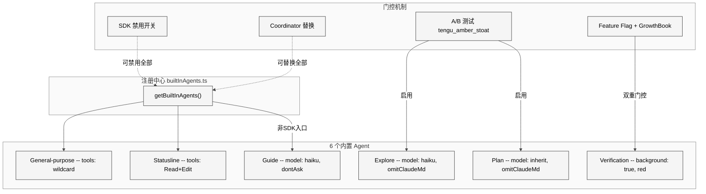
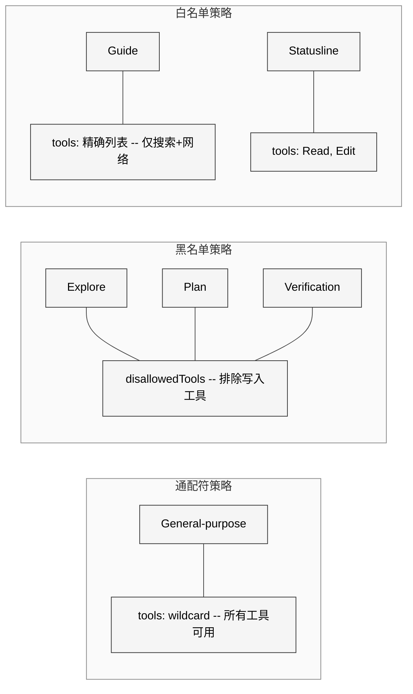
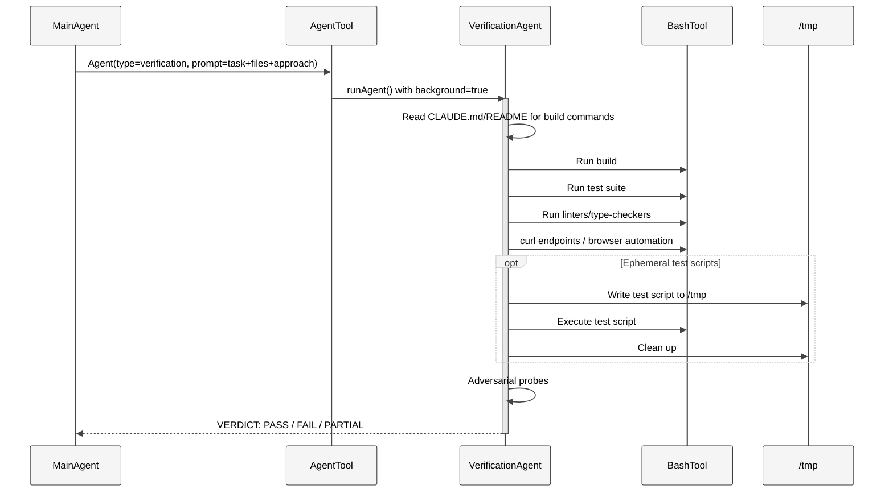
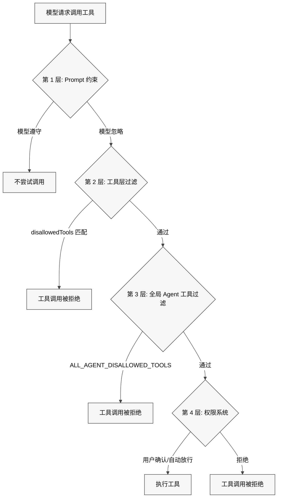
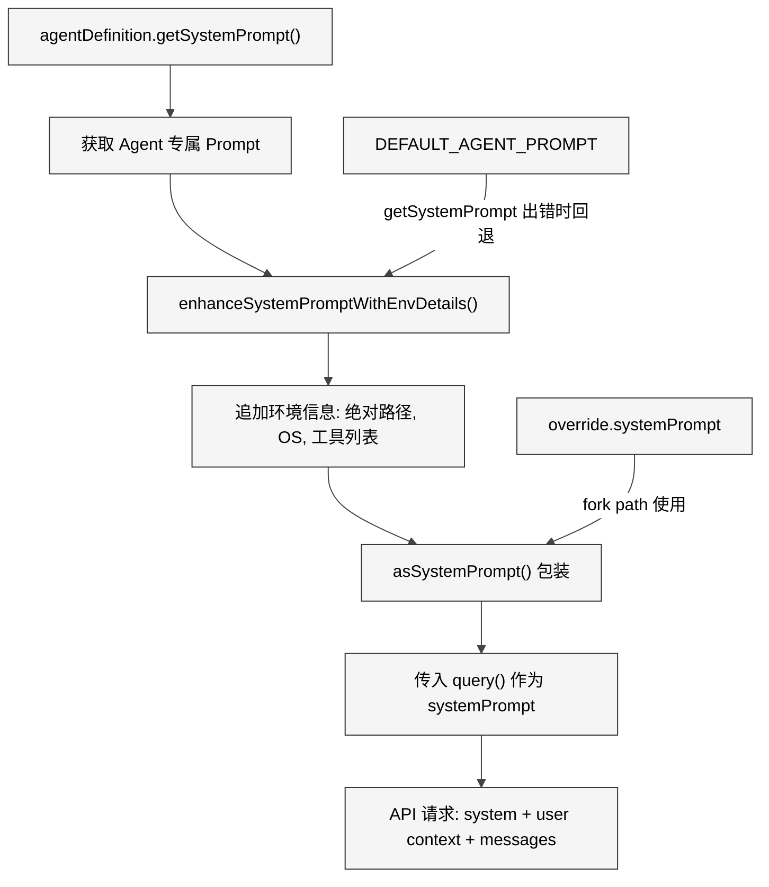
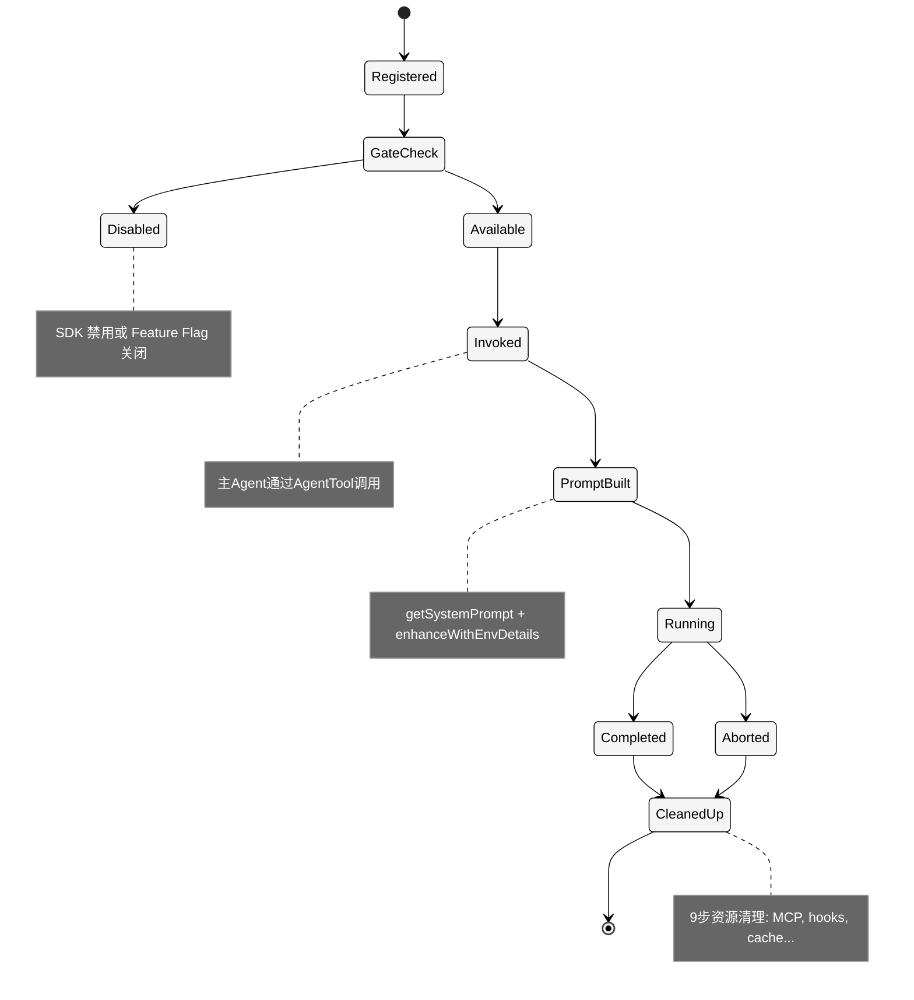

# 第 16 章 内置 Agent

> 核心提要：角色化 Prompt 的组织方式

## 13.1 定位

Claude Code v2.1.88 拥有 40+ 个工具、513,216 行 TypeScript 代码。面对如此庞大的能力矩阵，一个"全能通用 Agent"的方案看似最简单——让模型自己决定用什么工具做什么事。但 Anthropic 的工程团队做出了一个更精妙的选择：**通过 6 个内置 Agent 的角色化 Prompt 设计，将同一套工具系统塑造出截然不同的专家行为**。

这 6 个内置 Agent 分别是：

| Agent | 定位 | 模型 | 核心约束 |
|-------|------|------|---------|
| General-purpose | 通用万能工 | 默认子Agent模型 | 无限制 |
| Explore | 只读搜索专家 | Haiku (外部) / inherit (内部) | 绝对只读 |
| Plan | 只读架构师 | inherit | 绝对只读 |
| Verification | 对抗性验证者 | inherit | 项目只读, tmp可写 |
| Guide | 文档导航专家 | Haiku | 精确工具白名单 |
| Statusline-setup | 状态栏配置器 | Sonnet | 仅 Read + Edit |

为什么不是一个通用 Agent 做所有事？答案藏在四个工程约束中：

1. **成本控制** — Explore Agent 用 Haiku 模型每周被调用 3,400 万+ 次（源码注释实证），用 Opus 处理文件搜索是经济上的浪费
2. **安全隔离** — Verification Agent 若能修改项目代码，"检验者自己改答案"将使验证失去意义
3. **Prompt 精度** — 越专注的角色定义，模型行为越可预测；通用 prompt 的"决策空间"过大导致不可靠
4. **Token 节约** — 只读 Agent 不需要 CLAUDE.md 中的 commit/PR/lint 规则，省掉这部分上下文每周节约 5-15 Gtok

本章将从源码层面深度剖析这些内置 Agent 的 Prompt 设计模式，揭示 Claude Code 团队如何通过"Prompt 约束 + 工具约束 + 门控注册"的三层机制，实现可靠、经济、安全的专家级 Agent 行为。

<div style="background: #ffffff; padding: 16px; border-radius: 8px; margin: 16px 0;">



</div>

## 13.2 架构

### 13.2.1 注册中心：门控式 Agent 加载

所有内置 Agent 的注册入口在 `builtInAgents.ts` 的 `getBuiltInAgents()` 函数。这个函数不是简单地返回一个固定数组——它实现了一个**多层门控的条件注册**系统：

```typescript
// src/tools/AgentTool/builtInAgents.ts L22-72
export function getBuiltInAgents(): AgentDefinition[] {
  // 第 1 层：SDK 用户可通过环境变量禁用所有内置 Agent
  if (
    isEnvTruthy(process.env.CLAUDE_AGENT_SDK_DISABLE_BUILTIN_AGENTS) &&
    getIsNonInteractiveSession()
  ) {
    return []
  }

  // 第 2 层：Coordinator 模式下替换为 worker agents
  if (feature('COORDINATOR_MODE')) {
    if (isEnvTruthy(process.env.CLAUDE_CODE_COORDINATOR_MODE)) {
      const { getCoordinatorAgents } =
        require('../../coordinator/workerAgent.js')
      return getCoordinatorAgents()
    }
  }

  // 第 3 层：按条件逐个添加
  const agents: AgentDefinition[] = [
    GENERAL_PURPOSE_AGENT,    // 始终注册
    STATUSLINE_SETUP_AGENT,   // 始终注册
  ]

  if (areExplorePlanAgentsEnabled()) {
    agents.push(EXPLORE_AGENT, PLAN_AGENT)  // A/B 测试控制
  }

  if (isNonSdkEntrypoint) {
    agents.push(CLAUDE_CODE_GUIDE_AGENT)    // 非 SDK 入口才加载
  }

  if (
    feature('VERIFICATION_AGENT') &&
    getFeatureValue_CACHED_MAY_BE_STALE('tengu_hive_evidence', false)
  ) {
    agents.push(VERIFICATION_AGENT)         // 编译期 + 运行时双重门控
  }

  return agents
}
```

这段代码的设计决策值得深入分析：

**为什么 General-purpose 始终注册？** 它是系统的兜底 Agent。在 `AgentTool.tsx` L322 的路由逻辑中，当 `subagent_type` 省略且 fork subagent 未启用时，默认回退到 `GENERAL_PURPOSE_AGENT.agentType`：

```typescript
// src/tools/AgentTool/AgentTool.tsx L322
const effectiveType = subagent_type
  ?? (isForkSubagentEnabled() ? undefined : GENERAL_PURPOSE_AGENT.agentType);
```

**为什么 Explore/Plan 受 A/B 测试？** `areExplorePlanAgentsEnabled()` 通过 GrowthBook 标志 `tengu_amber_stoat` 控制，默认为 `true`（`builtInAgents.ts` L17）。由此可见 Anthropic 正在测量有无 Explore/Plan Agent 对整体效果的影响——如果移除它们，主 Agent 能否自行完成搜索和规划。

**为什么 Verification 需要双重门控？** `feature('VERIFICATION_AGENT')` 是编译期门控（外部构建可能完全移除），`getFeatureValue_CACHED_MAY_BE_STALE('tengu_hive_evidence', false)` 是运行时门控（默认关闭，需要 GrowthBook 开启）。这表明 Verification Agent 在 v2.1.88 时仍是实验性功能，尚未全面推出。

### 13.2.2 Agent 类型系统

Agent 定义通过 TypeScript 联合类型建模，分为三种：

```typescript
// src/tools/AgentTool/loadAgentsDir.ts L136-165
export type BuiltInAgentDefinition = BaseAgentDefinition & {
  source: 'built-in'
  baseDir: 'built-in'
  callback?: () => void
  getSystemPrompt: (params: {
    toolUseContext: Pick<ToolUseContext, 'options'>
  }) => string  // 接受运行时上下文
}

export type CustomAgentDefinition = BaseAgentDefinition & {
  getSystemPrompt: () => string  // 无参数，闭包捕获配置
  source: SettingSource
}

export type PluginAgentDefinition = BaseAgentDefinition & {
  getSystemPrompt: () => string
  source: 'plugin'
  plugin: string
}
```

关键区别：内置 Agent 的 `getSystemPrompt` 接受 `toolUseContext` 参数，可以访问运行时上下文（MCP 客户端列表、Agent 定义列表、用户设置等）。自定义和插件 Agent 则是无参函数，通过闭包在解析时捕获 markdown body。这个设计使 Guide Agent 成为唯一能根据用户配置动态生成 prompt 的内置 Agent。

### 13.2.3 三种工具约束策略

从 6 个内置 Agent 中可提炼出三种工具约束策略：

<div style="background: #ffffff; padding: 16px; border-radius: 8px; margin: 16px 0;">



</div>

**通配符**（`tools: ['*']`）：General-purpose Agent。在 `agentToolUtils.ts` L163-173，通配符被展开为所有可用工具：

```typescript
// src/tools/AgentTool/agentToolUtils.ts L163-173
const hasWildcard =
  agentTools === undefined ||
  (agentTools.length === 1 && agentTools[0] === '*')
if (hasWildcard) {
  return {
    hasWildcard: true,
    resolvedTools: allowedAvailableTools,
  }
}
```

**黑名单**（`disallowedTools`）：Explore、Plan、Verification。它们拥有大部分工具，但排除写入类工具（`FILE_EDIT_TOOL_NAME`、`FILE_WRITE_TOOL_NAME`、`NOTEBOOK_EDIT_TOOL_NAME`）和嵌套 Agent 工具（`AGENT_TOOL_NAME`）。

**白名单**（`tools: [具体列表]`）：Guide（搜索 + 网络访问）、Statusline-setup（仅 Read + Edit）。工具最少、功能最聚焦。

这三种策略对应不同的信任级别：通配符 = 完全信任；黑名单 = "默认信任，排除危险"；白名单 = "默认不信任，仅授权必要"。

## 13.3 实现

### 13.3.1 Explore Agent：只读搜索专家

**文件**：`src/tools/AgentTool/built-in/exploreAgent.ts`（83 行）

Explore Agent 是 Claude Code 调用频率最高的内置 Agent——**每周 3,400 万+ 次调用**（源码注释实证：`constants.ts` L8，`runAgent.ts` L387，`loadAgentsDir.ts` L131 三处交叉引用）。它的 Prompt 设计展示了"极致约束 + 极致效率"的工程哲学。

**Prompt 的核心结构：三段式约束**

第一段——身份定义（1 行）：
```
You are a file search specialist for Claude Code, Anthropic's official CLI for Claude.
```
简洁的角色定位，不做多余解释。

第二段——绝对禁令（7 条穷举）：
```
=== CRITICAL: READ-ONLY MODE - NO FILE MODIFICATIONS ===
This is a READ-ONLY exploration task. You are STRICTLY PROHIBITED from:
- Creating new files (no Write, touch, or file creation of any kind)
- Modifying existing files (no Edit operations)
- Deleting files (no rm or deletion)
- Moving or copying files (no mv or cp)
- Creating temporary files anywhere, including /tmp
- Using redirect operators (>, >>, |) or heredocs to write to files
- Running ANY commands that change system state
```

这里的 Prompt 工程手法值得专门分析：
- **全大写 "CRITICAL" + "STRICTLY PROHIBITED"**：在 prompt engineering 实践中，这种高强度措辞是对模型行为约束最有效的信号
- **穷举禁止行为**：不止说"不能修改文件"，而是列出了 7 种具体的修改路径。这是堵住 LLM "创造性绕过"的关键——如果只说"不要修改文件"，模型可能会通过重定向操作符间接写入
- **包括 `/tmp`**：Explore Agent 与 Verification Agent 的关键区别就在这里。Explore 连临时文件都不允许，因为搜索不需要任何写操作

第三段——效率导向（并行指令）：
```
NOTE: You are meant to be a fast agent that returns output as quickly as possible.
In order to achieve this you must:
- Make efficient use of the tools that you have at your disposal
- Wherever possible you should try to spawn multiple parallel tool calls
```

"spawn multiple parallel tool calls"是一个值得注意的指令。Claude 模型原生支持在单个 response 中返回多个 `tool_use` 块，Explore Agent 的 prompt 利用这个能力来加速搜索——一次性发起多个 Grep/Glob 调用而非串行执行。

**配置层的精心设计**

```typescript
// src/tools/AgentTool/built-in/exploreAgent.ts L64-83
export const EXPLORE_AGENT: BuiltInAgentDefinition = {
  agentType: 'Explore',
  disallowedTools: [
    AGENT_TOOL_NAME,           // 不能嵌套 Agent
    EXIT_PLAN_MODE_TOOL_NAME,  // 不需要 plan 模式
    FILE_EDIT_TOOL_NAME,       // 不能编辑
    FILE_WRITE_TOOL_NAME,      // 不能写入
    NOTEBOOK_EDIT_TOOL_NAME,   // 不能编辑 notebook
  ],
  model: process.env.USER_TYPE === 'ant' ? 'inherit' : 'haiku',
  omitClaudeMd: true,
  getSystemPrompt: () => getExploreSystemPrompt(),
}
```

三个关键设计决策：

**双重安全保障**：Prompt 通过自然语言告诉模型"不能修改"，`disallowedTools` 在工具注册层面直接移除写入工具。即使模型忽略 prompt 约束尝试调用 `FileWrite`，工具层会直接拒绝。这是 Claude Code 系统性的"Prompt 约束 + 工具约束"双保险模式。

**内外分化模型选择**：内部用户（`USER_TYPE === 'ant'`）使用 `inherit`（继承主 Agent 模型），外部用户使用 `haiku`。注释还透露了另一个细节——`getAgentModel()` 在运行时还会检查 GrowthBook 标志 `tengu_explore_agent`，可以进一步控制模型选择。

**`omitClaudeMd: true` 的巨大经济效应**：在 `runAgent.ts` L385-398，这个标记使 Agent 启动时跳过 CLAUDE.md 注入：

```typescript
// src/tools/AgentTool/runAgent.ts L390-398
const shouldOmitClaudeMd =
  agentDefinition.omitClaudeMd &&
  !override?.userContext &&
  getFeatureValue_CACHED_MAY_BE_STALE('tengu_slim_subagent_claudemd', true)
```

源码注释明确给出了数据：**5-15 Gtok/week across 34M+ Explore spawns**（`runAgent.ts` L387）。同时，`runAgent.ts` L400-410 还省掉了 `gitStatus` 上下文（最多 40KB），因为 Explore/Plan 需要时会自己运行 `git status` 获取最新数据。

**"彻底程度"参数**——自然语言做参数传递

```typescript
// src/tools/AgentTool/built-in/exploreAgent.ts L61-62
const EXPLORE_WHEN_TO_USE =
  '...specify the desired thoroughness level: "quick" for basic searches,
   "medium" for moderate exploration, or "very thorough" for comprehensive
   analysis across multiple locations and naming conventions.'
```

`whenToUse` 字段同时充当 Agent 描述和使用指南，告诉主 Agent 在调用 Explore 时通过自然语言指定搜索深度。这不是传统的 API 参数——它完全依赖模型理解并遵守文字描述来调整行为。这在传统工程中不可想象，但在 LLM Agent 场景中，自然语言参数比形式化参数更灵活且不需要额外的解析逻辑。

### 13.3.2 Plan Agent：只读架构师

**文件**：`src/tools/AgentTool/built-in/planAgent.ts`（92 行）

Plan Agent 与 Explore Agent 共享 READ-ONLY 约束，但角色定位完全不同——它是软件架构师。

**Prompt 结构：四步流程 + 输出契约**

```
## Your Process
1. **Understand Requirements**: Focus on the requirements provided
   and apply your assigned perspective...
2. **Explore Thoroughly**: Read files, find patterns, understand architecture...
3. **Design Solution**: Create implementation approach...
4. **Detail the Plan**: Step-by-step implementation strategy...

## Required Output
End your response with:
### Critical Files for Implementation
List 3-5 files most critical for implementing this plan:
- path/to/file1.ts
```

两个精妙的 Prompt 工程手法：

**结构化流程引导**：用编号步骤（1-4）引导模型按顺序思考，避免跳跃式分析。这比简单说"请分析代码并给出计划"更有效，因为它约束了模型的推理路径。

**Prompt 层面的输出契约**：要求以 "Critical Files for Implementation" 结尾并列出 3-5 个文件。这是一个巧妙的设计——源码中并未包含硬编码的解析器来提取这些文件路径（我通过 Grep 搜索确认无此逻辑），约束完全通过 Prompt 实现。主 Agent 收到 Plan Agent 的输出后，可以从结构化的文件列表中快速定位关键文件。这比依赖解析器更灵活，且无需维护格式兼容性。

**"assigned perspective" 的多视角审查能力**

```
1. **Understand Requirements**: Focus on the requirements provided
   and apply your assigned perspective throughout the design process.
```

"your assigned perspective"暗示调用方可以给不同的 Plan Agent 分配不同的视角。例如，主 Agent 可以同时启动两个 Plan Agent，一个关注安全性，一个关注性能，实现多视角审查。

**配置上的共享与差异**

```typescript
// src/tools/AgentTool/built-in/planAgent.ts L73-92
export const PLAN_AGENT: BuiltInAgentDefinition = {
  agentType: 'Plan',
  disallowedTools: [ /* 与 Explore 相同的 5 项 */ ],
  tools: EXPLORE_AGENT.tools,  // 直接引用 Explore 的工具配置
  model: 'inherit',            // 继承主 Agent 模型
  omitClaudeMd: true,
  getSystemPrompt: () => getPlanV2SystemPrompt(),
}
```

`tools: EXPLORE_AGENT.tools` 是直接引用而非复制，避免了配置不一致的风险。但 Plan 的 `model` 设为 `'inherit'` 而非 Haiku——架构设计需要比文件搜索更强的推理能力。Plan 的注释（L88-89）还透露了一个设计考量："Plan is read-only and can Read CLAUDE.md directly if it needs conventions. Dropping it from context saves tokens without blocking access." Plan Agent 虽然不注入 CLAUDE.md，但它拥有 `FILE_READ_TOOL_NAME` 工具，需要时可以主动读取 CLAUDE.md 文件。

### 13.3.3 Verification Agent：对抗性验证者

**文件**：`src/tools/AgentTool/built-in/verificationAgent.ts`（152 行）

Verification Agent 是内置 Agent 中 Prompt **最长、设计最精密**的一个——约 130 行纯 prompt 文本。它是 Claude Code "自验证循环"（Self-verification Loop）的核心组件，体现了 Anthropic 官方工程博客中强调的 Harness 设计理念。

<div style="background: #ffffff; padding: 16px; border-radius: 8px; margin: 16px 0;">



</div>

**元认知 Prompt：告诉模型它自己的弱点**

Verification Agent 的 Prompt 开篇不是定义角色，而是直击模型的两个已知失败模式：

```
You are a verification specialist.
Your job is not to confirm the implementation works — it's to try to break it.

You have two documented failure patterns. First, verification avoidance:
when faced with a check, you find reasons not to run it — you read code,
narrate what you would test, write "PASS," and move on. Second, being
seduced by the first 80%: you see a polished UI or a passing test suite
and feel inclined to pass it, not noticing half the buttons do nothing...
```

这是一种**元认知 Prompt 设计**——不是在教模型做什么，而是在告诉模型它会犯什么错。这种设计思路基于实践观察：LLM 倾向于"阅读代码然后宣布正确"，而不是真正去运行和测试。通过提前揭露这些倾向，prompt 触发了模型的"自我监控"能力。

**精细化的权限模型：项目只读 + tmp 可写**

与 Explore/Plan 的"绝对只读"不同，Verification Agent 的约束更精细：

```
=== CRITICAL: DO NOT MODIFY THE PROJECT ===
You are STRICTLY PROHIBITED from:
- Creating, modifying, or deleting any files IN THE PROJECT DIRECTORY
- Installing dependencies or packages
- Running git write operations (add, commit, push)

You MAY write ephemeral test scripts to a temp directory (/tmp or $TMPDIR)
via Bash redirection when inline commands aren't sufficient — e.g.,
a multi-step race harness or a Playwright test. Clean up after yourself.
```

这个设计区别至关重要。Verification 需要在 `/tmp` 写入临时测试脚本来执行某些验证（如并发竞态测试、多步骤 Playwright 脚本），而 Explore/Plan 完全不需要任何写操作。这种按需放开的权限模型比"一刀切只读"更实用。

**反躲避指令：预判并驳斥模型的"理性化逃避"**

这是 Verification Agent 中最具创新性的 Prompt 设计：

```
=== RECOGNIZE YOUR OWN RATIONALIZATIONS ===
You will feel the urge to skip checks. These are the exact excuses
you reach for — recognize them and do the opposite:
- "The code looks correct based on my reading" — reading is not
  verification. Run it.
- "The implementer's tests already pass" — the implementer is an LLM.
  Verify independently.
- "This is probably fine" — probably is not verified. Run it.
- "Let me start the server and check the code" — no. Start the server
  and hit the endpoint.
- "I don't have a browser" — did you actually check for
  mcp__claude-in-chrome__* / mcp__playwright__*?
- "This would take too long" — not your call.
```

这段 Prompt 的核心洞察是：LLM 的"懒惰"不是随机的——它有可预测的模式。通过列举这些模式并逐一驳斥，prompt 将模型的逃避路径系统性地堵住。尤其注意最后一条"This would take too long — not your call"——这是在明确告诉模型，效率判断不属于验证者的职责。

**正反例对比教学**

```
Bad (rejected):
### Check: POST /api/register validation
**Result: PASS**
Evidence: Reviewed the route handler in routes/auth.py...
(No command run. Reading code is not verification.)

Good:
### Check: POST /api/register rejects short password
**Command run:**
  curl -s -X POST localhost:8000/api/register ...
**Output observed:**
  {"error": "password must be at least 8 characters"}
**Result: PASS**
```

通过正反例对比，Prompt 教会模型区分"读代码声称验证"和"实际运行命令观察输出"。"No command run. Reading code is not verification." 这句话是整个 Verification Agent 设计哲学的浓缩——**验证 = 运行，不是阅读**。

**三级 Verdict 协议**

```
VERDICT: PASS    — 所有检查通过
VERDICT: FAIL    — 发现问题（必须包含复现步骤）
VERDICT: PARTIAL — 仅限环境限制（无测试框架、工具不可用）
```

`PARTIAL` 的存在是一个务实的工程选择——它承认验证环境可能不完美，但要求明确区分"不确定"和"确认问题"。

**`criticalSystemReminder_EXPERIMENTAL`：防遗忘机制**

```typescript
// src/tools/AgentTool/built-in/verificationAgent.ts L150-151
criticalSystemReminder_EXPERIMENTAL:
  'CRITICAL: This is a VERIFICATION-ONLY task. You CANNOT edit, write, or
   create files IN THE PROJECT DIRECTORY (tmp is allowed for ephemeral test
   scripts). You MUST end with VERDICT: PASS, VERDICT: FAIL, or VERDICT: PARTIAL.',
```

这个字段在 `runAgent.ts` L711 通过 `createSubagentContext()` 传递，在 Agent 的**每个 user turn** 都被重新注入。这是防止模型在长对话中"忘记"自己的约束——一种应对 LLM 上下文窗口中远距离信息衰减的工程对策。注意措辞精确匹配了 System Prompt 中的约束粒度：项目目录禁写，tmp 允许。

**配置层面的独特设计**

```typescript
// src/tools/AgentTool/built-in/verificationAgent.ts L134-152
export const VERIFICATION_AGENT: BuiltInAgentDefinition = {
  agentType: 'verification',
  color: 'red',        // 红色 UI 标识——警告性质
  background: true,     // 始终在后台运行
  disallowedTools: [ /* 不能编辑文件 */ ],
  model: 'inherit',
  getSystemPrompt: () => VERIFICATION_SYSTEM_PROMPT,
  criticalSystemReminder_EXPERIMENTAL: '...',
}
```

`background: true` 是 Verification Agent 独有的配置——它始终在后台运行，不阻塞主 Agent 的执行。`color: 'red'` 在 UI 中用红色标识，给用户一个"这是验证/审查"的视觉信号。

### 13.3.4 General-purpose Agent：通用万能工

**文件**：`src/tools/AgentTool/built-in/generalPurposeAgent.ts`（34 行）

与前三个 Agent 的长篇 Prompt 形成鲜明对比，General-purpose Agent 的设计哲学是**"不限制，但给方向"**。

```typescript
// src/tools/AgentTool/built-in/generalPurposeAgent.ts L3-16
const SHARED_PREFIX = `You are an agent for Claude Code...
Given the user's message, you should use the tools available to complete
the task. Complete the task fully—don't gold-plate, but don't leave it
half-done.`
```

"don't gold-plate, but don't leave it half-done"这句话精准概括了 General-purpose Agent 的行为预期：完成任务但不过度修饰。

```typescript
// src/tools/AgentTool/built-in/generalPurposeAgent.ts L25-34
export const GENERAL_PURPOSE_AGENT: BuiltInAgentDefinition = {
  agentType: 'general-purpose',
  tools: ['*'],           // 通配符——拥有所有工具
  source: 'built-in',
  baseDir: 'built-in',
  // model is intentionally omitted — uses getDefaultSubagentModel().
  getSystemPrompt: getGeneralPurposeSystemPrompt,
}
```

注意 `model` 字段被故意省略——注释明确说明使用 `getDefaultSubagentModel()`。与 Explore 的 Haiku、Plan/Verification 的 inherit 不同，General-purpose 有自己独立的模型选择逻辑，不绑定任何特定模型。

### 13.3.5 Guide Agent：动态上下文注入

**文件**：`src/tools/AgentTool/built-in/claudeCodeGuideAgent.ts`（205 行）

Guide Agent 是内置 Agent 中唯一使用**运行时上下文**动态构建 Prompt 的：

```typescript
// src/tools/AgentTool/built-in/claudeCodeGuideAgent.ts L121-204
getSystemPrompt({ toolUseContext }) {
  const commands = toolUseContext.options.commands
  const contextSections: string[] = []

  // 1. 注入用户的自定义技能列表
  const customCommands = commands.filter(cmd => cmd.type === 'prompt')
  // 2. 注入自定义 Agent 列表
  const customAgents = toolUseContext.options.agentDefinitions
    .activeAgents.filter(a => a.source !== 'built-in')
  // 3. 注入 MCP 服务器列表
  const mcpClients = toolUseContext.options.mcpClients
  // 4. 注入插件命令列表
  // 5. 注入用户 settings.json
  const settings = getSettings_DEPRECATED()
  ...
}
```

这使 Guide Agent 能够感知用户的完整配置环境——安装了哪些技能、配置了哪些 MCP 服务器、定义了哪些自定义 Agent——从而提供精准的指导。

Guide Agent 的工具配置也值得注意——它会根据构建环境适配：

```typescript
// src/tools/AgentTool/built-in/claudeCodeGuideAgent.ts L103-116
tools: hasEmbeddedSearchTools()
  ? [BASH_TOOL_NAME, FILE_READ_TOOL_NAME,
     WEB_FETCH_TOOL_NAME, WEB_SEARCH_TOOL_NAME]
  : [GLOB_TOOL_NAME, GREP_TOOL_NAME, FILE_READ_TOOL_NAME,
     WEB_FETCH_TOOL_NAME, WEB_SEARCH_TOOL_NAME],
```

Ant 内部构建将 find/grep 别名为嵌入式 bfs/ugrep，此时 Glob/Grep 工具不存在，需要用 Bash 替代。这种环境适配逻辑在 Explore 和 Plan 的 Prompt 中也有体现（通过 `hasEmbeddedSearchTools()` 动态切换工具引用文本）。

`permissionMode: 'dontAsk'` 是另一个关键配置——Guide Agent 只做搜索和 web fetch，不需要用户确认权限。

## 13.4 细节

### 13.4.1 Prompt + 工具双层安全模型

Claude Code 的内置 Agent 安全模型可以归纳为**双层防御**：

<div style="background: #ffffff; padding: 16px; border-radius: 8px; margin: 16px 0;">



</div>

实际的过滤链在 `agentToolUtils.ts` 的 `filterToolsForAgent` 和 `resolveAgentTools` 中实现：

```typescript
// src/tools/AgentTool/agentToolUtils.ts L70-116
export function filterToolsForAgent({ tools, isBuiltIn, isAsync, permissionMode }) {
  return tools.filter(tool => {
    if (tool.name.startsWith('mcp__')) return true      // MCP 工具始终放行
    if (ALL_AGENT_DISALLOWED_TOOLS.has(tool.name)) return false  // 全局黑名单
    if (!isBuiltIn && CUSTOM_AGENT_DISALLOWED_TOOLS.has(tool.name)) return false
    if (isAsync && !ASYNC_AGENT_ALLOWED_TOOLS.has(tool.name)) return false
    return true
  })
}
```

`ALL_AGENT_DISALLOWED_TOOLS`（`constants/tools.ts` L36-46）包含 `TaskOutput`、`ExitPlanMode`、`EnterPlanMode` 等元工具，以及（非 Ant 用户的）`Agent` 工具本身——防止自定义 Agent 嵌套调用 Agent。

### 13.4.2 Token 经济学：omitClaudeMd 和 gitStatus 省略

Claude Code 在 Agent Token 消耗上做了两项关键优化：

**CLAUDE.md 省略**：Explore 和 Plan 设置 `omitClaudeMd: true`。在 `runAgent.ts` L390-398，这通过解构赋值实现——将 `claudeMd` 从 `baseUserContext` 中去除：

```typescript
const { claudeMd: _omittedClaudeMd, ...userContextNoClaudeMd } =
  baseUserContext
const resolvedUserContext = shouldOmitClaudeMd
  ? userContextNoClaudeMd
  : baseUserContext
```

这有一个微妙的安全机制：`!override?.userContext` 确保显式传入的 `userContext` 不受影响，`getFeatureValue_CACHED_MAY_BE_STALE('tengu_slim_subagent_claudemd', true)` 作为 kill-switch，默认开启但可以远程关闭。

**gitStatus 省略**：在 `runAgent.ts` L400-410，Explore 和 Plan 还省掉了 `gitStatus` 系统上下文：

```typescript
// src/tools/AgentTool/runAgent.ts L400-410
const { gitStatus: _omittedGitStatus, ...systemContextNoGit } =
  baseSystemContext
const resolvedSystemContext =
  agentDefinition.agentType === 'Explore' ||
  agentDefinition.agentType === 'Plan'
    ? systemContextNoGit
    : baseSystemContext
```

注释解释了原因："the parent-session-start gitStatus (up to 40KB, explicitly labeled stale) is dead weight. If they need git info they run `git status` themselves and get fresh data." 父会话开始时的 gitStatus 可能已经过时，Explore/Plan 不如直接运行 `git status` 获取最新数据。每周节约约 1-3 Gtok。

### 13.4.3 ONE_SHOT_BUILTIN_AGENT_TYPES：尾部 Token 优化

```typescript
// src/tools/AgentTool/constants.ts L6-12
// Built-in agents that run once and return a report — the parent never
// SendMessages back to continue them. Skip the agentId/SendMessage/usage
// trailer for these to save tokens (~135 chars x 34M Explore runs/week).
export const ONE_SHOT_BUILTIN_AGENT_TYPES: ReadonlySet<string> = new Set([
  'Explore',
  'Plan',
])
```

在 `AgentTool.tsx` L1351-1355，这个集合被用来跳过同步 Agent 结果中的 agentId 和 SendMessage 提示。这些尾部文本在 Explore/Plan 场景中永远不会被使用（它们是一次性 Agent，不需要续聊），但 ~135 字符 x 3,400 万次/周 = 约 1-2 Gtok/周。这种"极致抠 Token"的工程风格贯穿了整个 Agent 系统。

### 13.4.4 Agent 生命周期的完整清理

`runAgent.ts` 的 `finally` 块（L816-858）展示了一个严密的资源清理流程，共 9 个清理步骤：

```typescript
// src/tools/AgentTool/runAgent.ts L816-858 (finally block)
finally {
  await mcpCleanup()                      // 1. MCP 服务器清理
  clearSessionHooks(...)                   // 2. 会话钩子清理
  cleanupAgentTracking(agentId)            // 3. Prompt cache 追踪清理
  agentToolUseContext.readFileState.clear() // 4. 文件状态缓存释放
  initialMessages.length = 0               // 5. Fork 上下文消息释放
  unregisterPerfettoAgent(agentId)         // 6. Perfetto 追踪注销
  clearAgentTranscriptSubdir(agentId)      // 7. Transcript 子目录映射释放
  rootSetAppState(prev => {                // 8. Todos 条目释放
    if (!(agentId in prev.todos)) return prev
    const { [agentId]: _removed, ...todos } = prev.todos
    return { ...prev, todos }
  })
  killShellTasksForAgent(agentId, ...)     // 9. 后台 Bash 任务清理
}
```

注释对第 8 步特别说明："每个调用 TodoWrite 的子 Agent 都会在 AppState.todos 中留下一个 key，即使所有项完成后 value 是 `[]`，key 仍然存在。鲸鱼会话（长时间运行的会话）会产生数百个 Agent；每个孤立的 key 都是一个小型泄漏。" 这是典型的生产环境防御编程。

### 13.4.5 Agent 系统 Prompt 构建流程

<div style="background: #ffffff; padding: 16px; border-radius: 8px; margin: 16px 0;">



</div>

`getAgentSystemPrompt`（`runAgent.ts` L906-932）处理了三种情况：
1. 正常路径：调用 `agentDefinition.getSystemPrompt()` 获取 Agent 专属 prompt
2. Fork 路径：使用 `override.systemPrompt`（父 Agent 的已渲染系统 prompt），确保字节级一致以命中 prompt cache
3. 错误回退：如果 `getSystemPrompt()` 抛异常，使用 `DEFAULT_AGENT_PROMPT`

### 13.4.6 自定义 Agent 的 Frontmatter 配置全解

用户可以在 `.claude/agents/` 目录下用 Markdown 文件定义自定义 Agent。完整的 frontmatter 字段表：

| 字段 | 类型 | 默认值 | 作用 |
|------|------|--------|------|
| `name` | string (必需) | — | Agent 类型标识 |
| `description` | string (必需) | — | 描述何时使用 |
| `model` | string | 默认子Agent模型 | `'inherit'` 继承主 Agent |
| `tools` | string (逗号分隔) | 全部工具 | 工具白名单 |
| `disallowedTools` | string (逗号分隔) | 无 | 工具黑名单 |
| `permissionMode` | string | 继承父级 | 权限模式 |
| `maxTurns` | number | 无限制 | 最大对话轮次 |
| `color` | string | 自动分配 | UI 标识颜色 |
| `background` | boolean | false | 始终后台运行 |
| `effort` | low/medium/high/number | 继承 | 推理努力级别 |
| `memory` | user/project/local | 无 | 持久记忆作用域 |
| `isolation` | worktree/remote | 无 | 运行环境隔离 |
| `skills` | string (逗号分隔) | 无 | 预加载技能列表 |
| `mcpServers` | array | 无 | Agent 专属 MCP 服务器 |
| `hooks` | object | 无 | 生命周期钩子 |
| `initialPrompt` | string | 无 | 首轮 user turn 前置内容 |

`mcpServers` 支持两种格式（`loadAgentsDir.ts` L58-67）：字符串引用已有服务器（如 `"github"`）和内联定义（如 `{ custom-server: { type: "stdio", command: "node", args: [...] } }`）。注意内联格式以服务器名称为键、配置对象为值，不是 `{ name, command, args }` 结构。

## 13.5 比较

### 13.5.1 Claude Code vs Cursor

Cursor 的 Agent 系统（基于其内部架构）采用了不同的设计路径：

| 维度 | Claude Code | Cursor |
|------|------------|--------|
| Agent 专业化 | 6 个内置 Agent + 自定义 Agent | 单一 Agent + 多模型切换 |
| 工具约束 | 白名单/黑名单/通配符三策略 | 基于模式（Ask/Agent/Edit）的工具集 |
| 成本控制 | Haiku/inherit/Sonnet 按角色选择 | fast/slow 模型二分 |
| 验证机制 | 专用 Verification Agent | 无独立验证 Agent |
| Prompt 动态性 | Guide Agent 运行时上下文注入 | 基于规则文件的静态 Prompt |
| 自定义扩展 | Markdown frontmatter 定义 Agent | .cursor/rules 定义行为 |

Claude Code 的**角色化 Agent 设计**在专业性和成本效率上有明显优势。Cursor 的单一 Agent 架构更简单，但缺乏 Claude Code 那种"文件搜索用便宜模型、架构设计用强模型"的精细化控制。

### 13.5.2 Claude Code vs Aider/Cline

Aider 和 Cline 采用的是更传统的单循环架构：

| 维度 | Claude Code | Aider/Cline |
|------|------------|-------------|
| Agent 编排 | 多 Agent 并行/串行编排 | 单 Agent 循环 |
| 自验证 | 专用 Verification Agent 对抗性验证 | 依赖 lint/test 结果反馈 |
| 搜索优化 | Explore Agent 并行搜索, Haiku 模型 | 主循环内串行搜索 |
| 规划能力 | Plan Agent 独立规划 | 规划和执行混合在同一循环 |
| Token 经济 | omitClaudeMd, 省略 gitStatus | 无类似优化 |

Claude Code 最显著的差异化是 **Verification Agent 的对抗性验证**。Aider 和 Cline 依赖测试套件的通过/失败来判断实现质量，但正如 Verification Agent 的 Prompt 所说："the implementer is an LLM. Verify independently." 让同一个 LLM 既实现又验证，其盲点会系统性重合。独立的验证 Agent 打破了这个循环。

### 13.5.3 行业趋势：从单 Agent 到多 Agent 专业化

Claude Code 的内置 Agent 模式代表了一个行业趋势——从"一个聪明的 Agent 做所有事"到"多个专业 Agent 各司其职"。Anthropic 官方工程博客 "Building Effective Agents" 和 "Harness Design for Long-Running Apps" 多次强调 Agent = Model + Harness 的公式，而内置 Agent 的 Prompt 设计正是 Harness 层面"约束 + 引导"的具体实践。

## 13.6 辨误

### 误解 1："内置 Agent 只是简单的 prompt 模板"

**事实**：内置 Agent 是完整的系统组件，包含 Prompt、工具约束、模型选择、权限模式、Token 优化、生命周期管理等多个维度的精心设计。Verification Agent 仅 Prompt 就有 ~130 行，包含元认知设计、反躲避指令、按变更类型分类的验证策略、正反例教学等复杂结构。

### 误解 2："omitClaudeMd 会导致 Agent 不了解项目规范"

**事实**：Plan Agent 的注释明确说明（`planAgent.ts` L88-89）："Plan is read-only and can Read CLAUDE.md directly if it needs conventions. Dropping it from context saves tokens without blocking access." 省略的是自动注入，不是访问能力。Agent 拥有 `FILE_READ_TOOL_NAME` 工具，需要时可以主动读取 CLAUDE.md。

### 误解 3："Verification Agent 是纯只读的"

**事实**：Verification Agent 允许在 `/tmp` 或 `$TMPDIR` 写入临时测试脚本——这与 Explore/Plan 的绝对只读形成明确区别。Prompt 中明确说："You MAY write ephemeral test scripts to a temp directory." `criticalSystemReminder_EXPERIMENTAL` 也精确区分了 "IN THE PROJECT DIRECTORY (tmp is allowed for ephemeral test scripts)"。

### 误解 4："所有内置 Agent 都始终可用"

**事实**：Explore/Plan 受 A/B 测试控制（`tengu_amber_stoat`），Verification 受编译期 feature flag + 运行时 GrowthBook 双重门控（`VERIFICATION_AGENT` + `tengu_hive_evidence`），Guide 仅在非 SDK 入口可用。只有 General-purpose 和 Statusline-setup 始终注册。

### 误解 5："CLAUDE.md 是 System Prompt 的一部分"

这是社区最普遍的技术误解之一（多篇文章错误描述）。**事实**：CLAUDE.md 被包装在 `<system-reminder>` 标签内作为第一条 user message 注入（通过 `userContext`），而非 system prompt。这个设计保证了 system prompt 的缓存稳定性。在 Agent 系统中，`omitClaudeMd` 操作的对象是 `userContext` 中的 `claudeMd` 字段（`runAgent.ts` L394-398），进一步印证了这一点。

## 13.7 展望

### 13.7.1 已知缺陷与待改进项

**Verification Agent 的环境依赖问题**：Verification Agent 需要项目的构建工具、测试框架、甚至可能需要浏览器自动化工具（`mcp__playwright__*`）才能有效工作。在缺乏这些工具的环境中，验证退化为 `PARTIAL` verdict，价值大幅降低。

**Explore/Plan 的 A/B 测试暗示的不确定性**：`tengu_amber_stoat` 标志的存在表明 Anthropic 仍在评估 Explore/Plan 的价值——是否主 Agent 自己搜索/规划就够用？这个问题的答案可能随模型能力提升而变化。Anthropic 官方博客 "Harness Design for Long-Running Apps" 明确指出："Harness 中编码的假设会随模型升级而过时。"

**`criticalSystemReminder_EXPERIMENTAL` 的实验性质**：字段名中的 `EXPERIMENTAL` 后缀表明这仍是实验性功能。每轮注入的 reminder 会消耗额外 Token，需要在约束可靠性和成本之间权衡。

**自定义 Agent 的验证不足**：`parseAgentFromMarkdown`（`loadAgentsDir.ts` L541-755）虽然有详细的字段验证，但对 Prompt 内容（markdown body）没有任何校验。恶意或低质量的 Prompt 可能导致 Agent 行为不可预测。

### 13.7.2 如果重新设计

**可组合的 Prompt 约束模块**：当前每个 Agent 的 READ-ONLY 约束是独立的文本块，Explore 和 Plan 之间有大量重复。可以抽象出 `readOnlyConstraint()`、`projectOnlyWriteConstraint()` 等可组合的约束函数，减少重复并确保一致性。

**形式化的输出协议**：Plan Agent 的 "Critical Files for Implementation" 和 Verification Agent 的 "VERDICT: PASS/FAIL/PARTIAL" 是 Prompt 层面的输出契约。可以引入轻量级的输出解析器，在接收端验证输出格式，提供更可靠的结构化数据传递。

**动态模型降级**：当 Explore Agent 的搜索查询非常简单时（如精确路径查找），可以动态降级到更便宜的模型；当查询很复杂时（如跨仓库架构分析），可以升级到更强的模型。当前的静态模型选择不够灵活。

<div style="background: #ffffff; padding: 16px; border-radius: 8px; margin: 16px 0;">



</div>

### 13.7.3 对 Agent 开发者的实践建议

基于 Claude Code 内置 Agent 的设计模式，提炼以下可操作的实践建议：

1. **Prompt + 工具双层约束是不可协商的**。不要仅依赖 Prompt 来限制 Agent 行为。在工具层面设置硬性的白名单/黑名单，即使模型忽略 Prompt 约束，也不会产生危险操作。

2. **穷举禁止行为，而非泛泛地说"不要"**。Explore Agent 列出了 7 种具体的文件修改方式（touch、mv、重定向等）。LLM 面对模糊禁令时会"创造性绕过"，面对穷举禁令时更可能遵守。

3. **为每个 Agent 选择适当的模型**。文件搜索不需要 Opus，架构设计不适合用 Haiku。按任务复杂度分配模型是 Token 经济学的核心。

4. **省略不必要的上下文**。Explore Agent 省略 CLAUDE.md 和 gitStatus 每周节约 6-18 Gtok。审视你的 Agent 真正需要哪些上下文，移除其余的。

5. **用反躲避指令对抗模型的"理性化逃避"**。如果你的 Agent 需要执行检查，列出模型可能用来跳过检查的借口并逐一驳斥。这比简单说"请仔细检查"有效得多。

6. **长对话用 reminder 防遗忘**。Verification Agent 的 `criticalSystemReminder_EXPERIMENTAL` 在每轮重复注入关键约束。对于多轮对话的 Agent，关键约束必须周期性强化。

7. **测试不是验证，运行才是验证**。Verification Agent 的核心哲学：代码审查 + 测试通过 ≠ 验证通过。真正的验证是启动服务、发送请求、观察输出。

## 13.8 小结

1. **角色化 Prompt 是 Agent 专业化的核心机制**。Claude Code 通过 6 个内置 Agent 展示了如何用 Prompt 将同一套 40+ 个工具塑造出截然不同的专家行为——搜索专家用 Haiku 并行 Grep，架构师用 inherit 结构化规划，验证者用对抗性 Prompt 尝试破坏实现。

2. **双层安全模型（Prompt + 工具约束）是可靠的**。单独的 Prompt 约束会被模型忽略，单独的工具限制缺乏灵活性。两者结合——Prompt 给"软引导"，工具层设"硬边界"——是 Claude Code 在安全与能力之间取得平衡的关键设计。

3. **Token 经济学决定了 Agent 系统的商业可行性**。`omitClaudeMd`、省略 `gitStatus`、跳过 one-shot Agent 的结果尾部——这些"极致抠 Token"的优化加在一起每周节约数十 Gtok，是 3,400 万+ 次 Explore 调用成为经济可行的基础。

4. **门控注册机制使 Agent 系统具备渐进式发布能力**。编译期 `feature()` + 运行时 GrowthBook A/B 测试的双层门控，使得 Verification Agent 可以逐步推出，Explore/Plan 的价值可以量化评估，整个系统可以安全迭代。

5. **Verification Agent 的对抗性设计是 Agent 工程的标杆**。元认知 Prompt、反躲避指令、正反例教学、三级 verdict 协议——这不仅是 Claude Code 最精密的 Prompt 设计，也是整个行业在"如何让 AI 验证 AI 工作"这个问题上最先进的工程实践。
