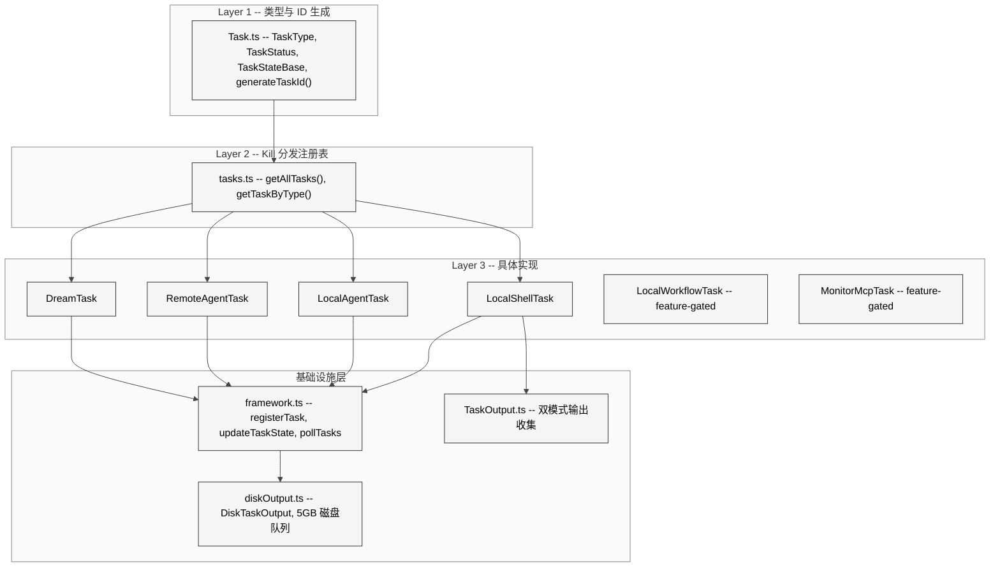
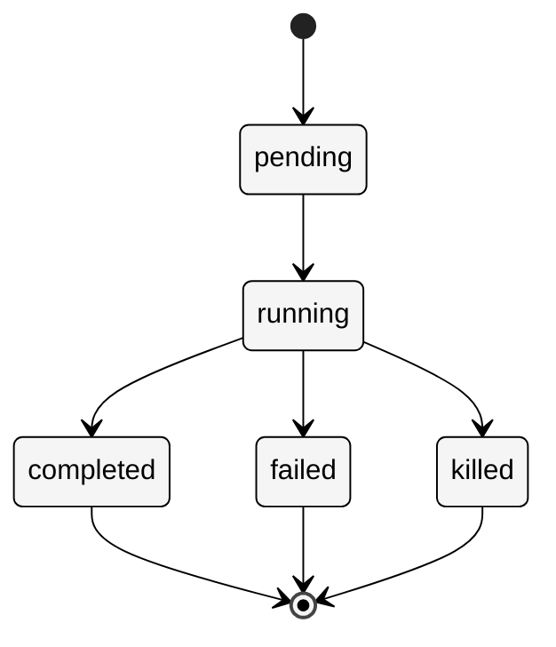
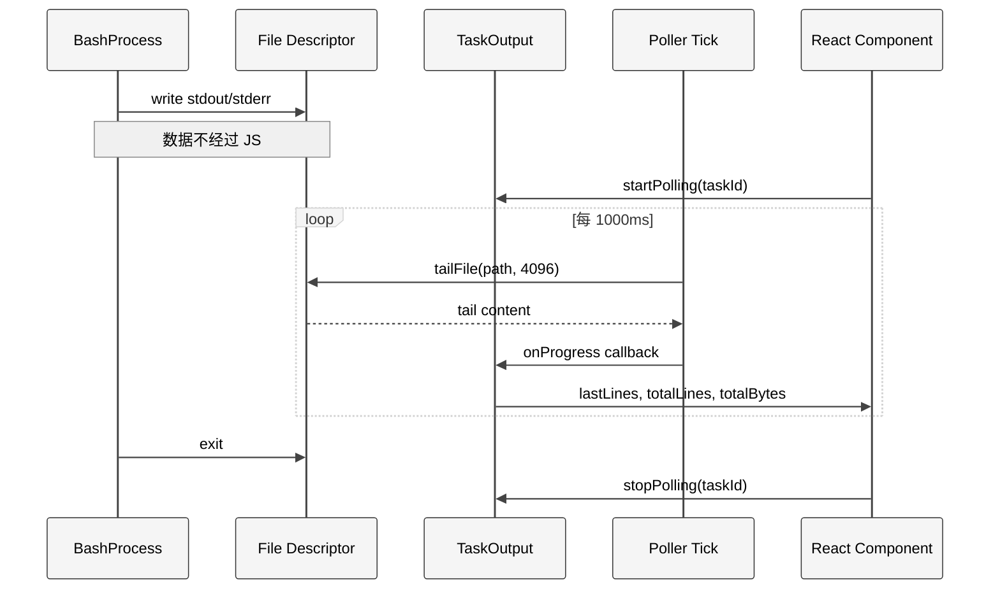
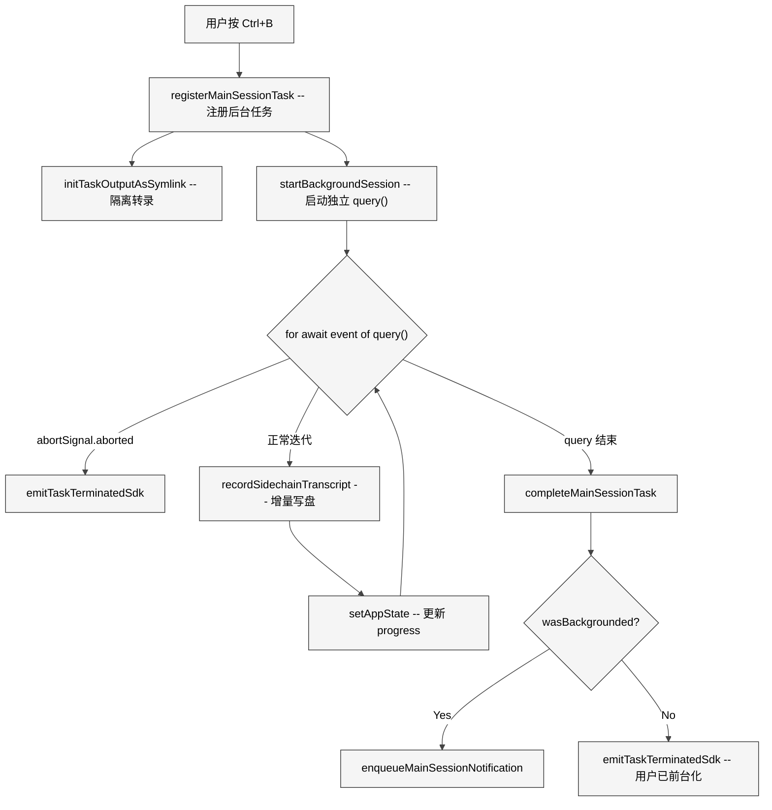
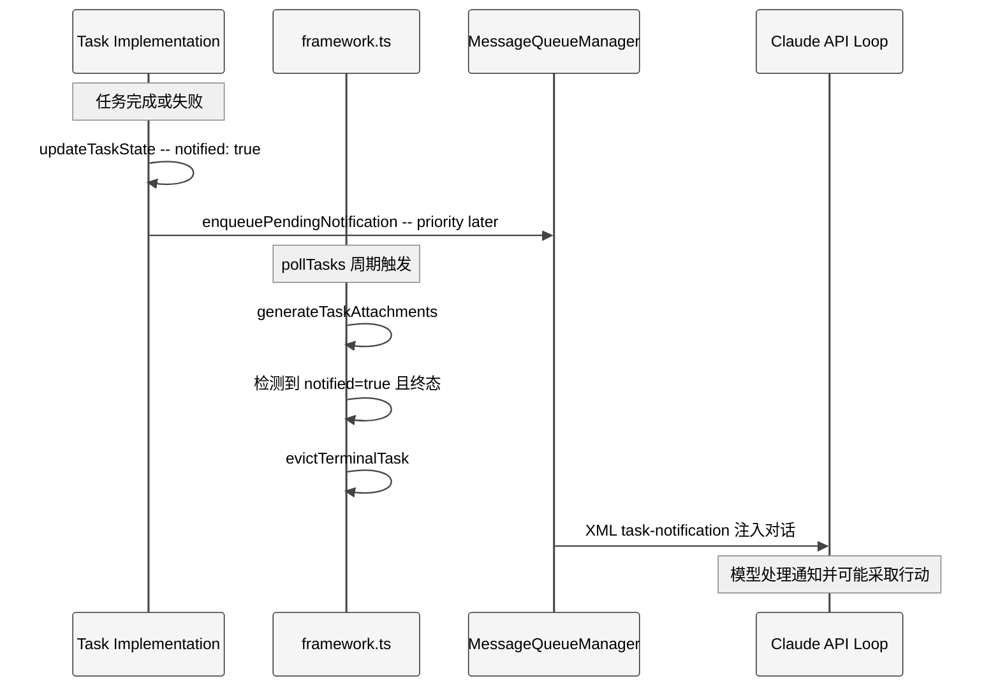
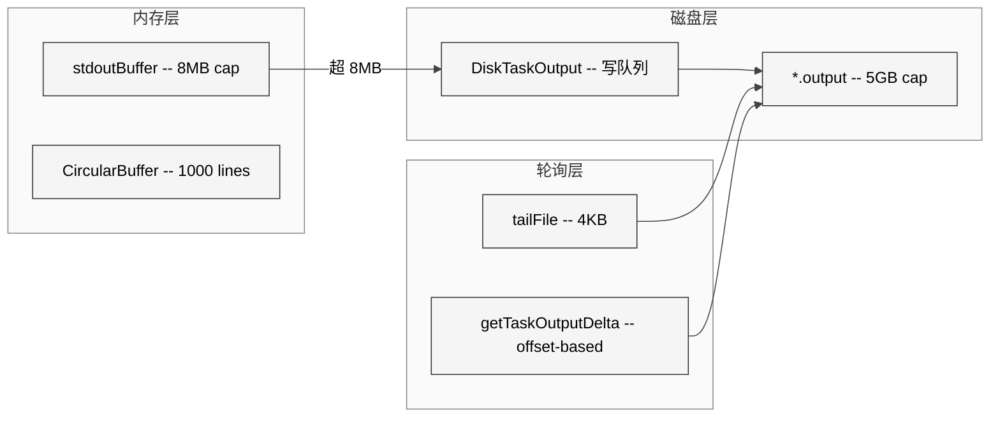
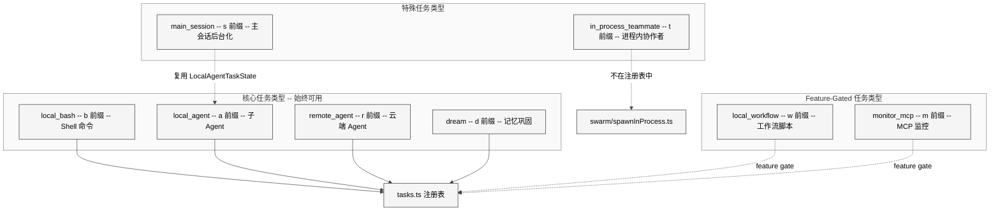

# 第 17 章 任务系统

> 核心提要：任务执行与前后台切换

---

## 14.1 定位

在前几章中，我们已经分析了 Agent 系统（第 12 章）和内置 Agent 设计模式（第 13 章）。但一个关键的工程问题尚未回答：**当模型同时发起多个子 Agent、多个后台 Shell 命令、甚至一个"做梦"式的记忆整理任务时，这些并发工作如何被统一管理？**

设想一个真实场景：Coordinator 模式下，主 Agent 同时派出 3 个 Worker 去研究代码库的不同部分，每个 Worker 又可能启动自己的后台 Shell 命令。此时系统需要追踪所有任务的生命周期、安全终止任务（包括清理子进程）、收集并转发任务输出、隔离任务状态、并在终端 UI 中展示后台任务进度。

这就是**任务系统**要解决的问题。它是 Claude Code 的并发执行引擎，位于 `src/tasks/`（12 个文件）和 `src/utils/task/`（5 个文件）目录中，将所有异步工作统一在一个类型安全、生命周期完整的框架下。在 Claude Code 的整体架构中，任务系统扮演着类似于**操作系统进程调度器**的角色——它不关心任务执行的具体内容，只负责注册、追踪状态、转发通知和安全清理。

**本章路线图**：首先剖析任务系统的三层分离架构（14.2），然后深入基础设施层的 framework.ts 和磁盘输出管理（14.3），接着逐一分析 7 种具体任务类型的实现（14.4），再分析任务通知的 XML 协议和消息队列（14.5），随后讨论防御编程模式（14.6），与竞品对比（14.7），最后总结开放问题和实践启示（14.8-14.9）。

---

## 14.2 架构

### 14.2.1 三层分离：类型、注册表、实现

任务系统采用了一个清晰的三层分离架构，这个设计选择直接影响了系统的可扩展性和模块解耦。

<div style="background: #ffffff; padding: 16px; border-radius: 8px; margin: 16px 0;">



</div>

**Layer 1**（`src/Task.ts`，126 行）定义了所有任务共享的类型。`TaskType` 是一个 7 值联合类型，`TaskStatus` 是 5 值状态枚举，`TaskStateBase` 包含 12 个基础字段。关键的 `Task` 接口只有一个方法——`kill`：

```typescript
// src/Task.ts L72-L76
export type Task = {
  name: string
  type: TaskType
  kill(taskId: string, setAppState: SetAppState): Promise<void>
}
```

源码注释直接解释了这个极简设计的由来：

> What getTaskByType dispatches for: kill. spawn/render were never called polymorphically (removed in #22546). All six kill implementations use only setAppState — getAppState/abortController were dead weight.

这是一个**从实践中涌现的极简设计**——`spawn` 和 `render` 最初是 `Task` 接口的方法，但每种任务的创建方式差异太大，不适合统一接口。只有 `kill` 需要多态分发（`stopTask.ts` 通过 `getTaskByType(task.type)` 找到实现后调用 `taskImpl.kill()`），所以接口收敛到只剩 `kill`。

**Layer 2**（`src/tasks.ts`，40 行）是 kill 分发注册表：

```typescript
// src/tasks.ts L22-L32
export function getAllTasks(): Task[] {
  const tasks: Task[] = [
    LocalShellTask,
    LocalAgentTask,
    RemoteAgentTask,
    DreamTask,
  ]
  if (LocalWorkflowTask) tasks.push(LocalWorkflowTask)
  if (MonitorMcpTask) tasks.push(MonitorMcpTask)
  return tasks
}
```

注意 `LocalWorkflowTask` 和 `MonitorMcpTask` 使用了 `feature()` 门控 + 条件 `require()` 模式。在外部构建中，这两个任务类型的代码会被 Dead Code Elimination 完全物理移除。另一个关键事实是：**`InProcessTeammateTask` 不在此注册表中**。它虽然实现了 `Task` 接口，但其生命周期由 `utils/swarm/spawnInProcess.ts` 中的 `killInProcessTeammate()` 直接管理。由此可见通过 `stopTask()` 终止 `in_process_teammate` 类型会抛出 `unsupported_type` 错误。

**Layer 3** 是具体任务实现，每种任务类型都是一个独立目录，包含自己的状态类型定义、生命周期逻辑和 kill 方法。

### 14.2.2 TaskType 与状态机

7 种任务类型各有唯一的 ID 前缀：

```typescript
// src/Task.ts L79-L87
const TASK_ID_PREFIXES: Record<string, string> = {
  local_bash: 'b',
  local_agent: 'a',
  remote_agent: 'r',
  in_process_teammate: 't',
  local_workflow: 'w',
  monitor_mcp: 'm',
  dream: 'd',
}
```

ID 格式为 `prefix + 8位随机字符`（36^8 约 2.8 万亿组合），使用仅包含小写字母和数字的字母表，源码注释明确指出这是为了"resist brute-force symlink attacks"——防止沙箱内的攻击者通过猜测任务 ID 来创建指向任意文件的符号链接。

所有任务共享同一个 5 状态机：

<div style="background: #ffffff; padding: 16px; border-radius: 8px; margin: 16px 0;">



</div>

`isTerminalTaskStatus()` 函数（`Task.ts` L27-L29）判断任务是否处于终态。这个谓词在整个系统中被广泛使用：防止向已死任务注入消息、触发清理逻辑、控制 UI 展示和 GC 驱逐。

### 14.2.3 设计哲学：去中心化 + 约定优于配置

任务系统的架构哲学可以用两个关键词概括：

1. **去中心化的生命周期管理**：每种任务类型各自负责自己的 spawn、通知和状态转换逻辑，framework 层只提供共用的 CRUD 原语。这看起来像是"不统一"，但实际上反映了一个深刻的工程洞察——7 种任务的创建方式、运行环境和通知需求差异太大，强行统一接口会导致大量的条件分支和适配层。

2. **约定优于配置**：所有任务共享 `TaskStateBase` 的 12 个字段（id, type, status, description, toolUseId, startTime, endTime, outputFile, outputOffset, notified 等），各类型通过 TypeScript 交叉类型 (`&`) 扩展自己的特有字段。这避免了 OOP 式的继承层级，同时通过类型系统确保了安全性。

> **对 Agent 开发者的启示**：不要试图为所有任务类型设计一个大一统的接口。观察 Claude Code 的演化路径——从包含 spawn/render/kill 的完整接口，到只保留 kill 的极简接口。让实践告诉你哪些行为真正需要多态，哪些只是看起来相似但本质不同。

---

## 14.3 实现深度剖析：基础设施层

### 14.3.1 framework.ts — 任务的"操作系统内核"

`src/utils/task/framework.ts`（309 行）是任务系统的核心基础设施。它提供了 5 个关键操作：

**registerTask()** — 在 AppState 中注册任务（L77-L117）。这个函数有一个精妙的细节：当 `resumeAgentBackground` 重新注册已有任务时，它保留了用户的 `retain`（保持在 UI 中显示的标记）、`startTime`（保持面板排序稳定）和 `messages`（保持已查看的对话记录）：

```typescript
// src/utils/task/framework.ts L87-L97
const merged =
  existing && 'retain' in existing
    ? {
        ...task,
        retain: existing.retain,
        startTime: existing.startTime,
        messages: existing.messages,
        diskLoaded: existing.diskLoaded,
        pendingMessages: existing.pendingMessages,
      }
    : task
```

这是一种**面向用户体验的状态合并**策略——用户正在查看的 Agent 面板不会因为后台恢复操作而闪烁或丢失上下文。

**updateTaskState()** — 泛型更新操作（L48-L72）。这个函数的**引用相等性优化**值得特别关注：

```typescript
// src/utils/task/framework.ts L59-L62
if (updated === task) {
  // Updater returned the same reference (early-return no-op). Skip the
  // spread so s.tasks subscribers don't re-render on unchanged state.
  return prev
}
```

如果 updater 返回了相同的引用（表示无需更新），跳过 spread 操作避免触发 React 不必要的重渲染。这与 Claude Code 状态管理系统中 `Object.is` 检查是同一个模式——在高频更新的场景下（多个后台任务并发轮询），每一次不必要的重渲染都是真实的性能成本。

**evictTerminalTask()** — 终态任务的驱逐（L125-L144）。驱逐有三层检查：

1. 必须处于终态（completed/failed/killed）
2. 必须已通知（`notified = true`）
3. 对于带 `retain` 字段的 `LocalAgentTaskState`：`evictAfter` 时间戳必须已过期（默认 `PANEL_GRACE_MS = 30_000`，即 30 秒）

第三层确保 Coordinator 面板中完成的 Agent 不会立即消失——用户有 30 秒时间查看结果。

**generateTaskAttachments()** — 轮询式的增量输出收集（L158-L206）。源码中一段关键注释揭示了通知架构的核心设计决策：

```typescript
// src/utils/task/framework.ts L199-L202
// Completed tasks are NOT notified here — each task type handles its own
// completion notification via enqueuePendingNotification(). Generating
// attachments here would race with those per-type callbacks, causing
// dual delivery (one inline attachment + one separate API turn).
```

由此可见完成通知是**去中心化**的——每种任务类型在自己的生命周期代码中负责发送通知，framework 层主要处理运行中任务的输出 offset 更新和终态任务的 AppState 驱逐。

**applyTaskOffsetsAndEvictions()** — 安全的异步状态合并（L213-L249）。这个函数解决了一个棘手的 TOCTOU（Time-of-Check-Time-of-Use）问题：`generateTaskAttachments()` 中的磁盘读取是异步的，期间任务状态可能已经变化（比如任务完成了，或者被 resume 替换了）。解决方案是在合并时对每个任务**重新检查 fresh 状态**：

```typescript
// src/utils/task/framework.ts L228-L232
// Re-check status on fresh state — task may have completed during the
// await. If it's no longer running, the offset update is moot.
if (fresh?.status === 'running') {
  newTasks[id] = { ...fresh, outputOffset: updatedTaskOffsets[id]! }
}
```

### 14.3.2 DiskTaskOutput — 高性能磁盘写入队列

`src/utils/task/diskOutput.ts`（452 行）实现了后台任务输出的磁盘持久化。`DiskTaskOutput` 类的核心设计要点：

**写队列模式**：`append()` 只往 `#queue` 数组里推数据，真正的 I/O 由 `#drain()` 异步循环驱动。这确保了调用方（如 Shell 进程的 stdout 处理）永远不会被 I/O 阻塞。

**极致的内存管理**：源码中有一段极其严肃的注释：

```typescript
// src/utils/task/diskOutput.ts L179-L181
// This code is extremely precise.
// You **must not** add an await here!! That will cause memory to balloon
// as the queue grows.
```

`#writeAllChunks()` 方法不能包含 `await`——如果在这里 await，当前正在写的 Buffer 数组就会被 Promise 链捕获而无法 GC，导致内存膨胀。`#queueToBuffers()` 使用 `splice(0, length)` 原地清空数组让 GC 尽快回收。

**5GB 磁盘上限**（`MAX_TASK_OUTPUT_BYTES`）和 **O_NOFOLLOW 安全防护**：

```typescript
// src/utils/task/diskOutput.ts L17-L21
// SECURITY: O_NOFOLLOW prevents following symlinks when opening task output files.
// Without this, an attacker in the sandbox could create symlinks in the tasks directory
// pointing to arbitrary files, causing Claude Code on the host to write to those files.
```

**会话隔离**：输出目录包含 session ID（`getProjectTempDir()/sessionId/tasks/`），并且 session ID 在首次调用时被捕获并缓存。源码注释引用了一个真实的 bug（`inc-4586 / boris-20260309-060423`）：之前没有 session 隔离时，一个会话的启动清理会删除另一个会话正在写入的输出文件。

### 14.3.3 TaskOutput — 双模式输出收集

`src/utils/task/TaskOutput.ts`（391 行）统一了两种输出收集模式：

| 模式 | 用途 | 数据流 |
|------|------|--------|
| **File 模式** | Bash 命令 | stdout/stderr 直接写文件 fd（不经过 JS），进度通过轮询文件尾部获取 |
| **Pipe 模式** | Hook 脚本 | 数据经过 `writeStdout()`/`writeStderr()`，先在内存缓冲，超 8MB 溢出到磁盘 |

File 模式的进度轮询使用了**静态注册表 + 按需轮询**架构：

```typescript
// src/utils/task/TaskOutput.ts L53-L56
static #registry = new Map<string, TaskOutput>()
static #activePolling = new Map<string, TaskOutput>()
static #pollInterval: ReturnType<typeof setInterval> | null = null
```

React 组件通过 `startPolling(taskId)` / `stopPolling(taskId)` 控制哪些任务需要被轮询。当没有任何任务在轮询时，interval 被自动清除（`.unref()` 确保不阻止进程退出）。`#tick()` 方法使用 `.then()` 而非 `async/await`，注释说明"Non-async body to avoid stacking if I/O is slow"——防止文件读取慢时多个 tick 叠加。

<div style="background: #ffffff; padding: 16px; border-radius: 8px; margin: 16px 0;">



</div>

---

## 14.4 任务类型详解

### 14.4.1 LocalShellTask — 后台 Shell 命令

**核心文件**：`src/tasks/LocalShellTask/`（3 个文件，guards.ts 42 行 + killShellTasks.ts 77 行 + LocalShellTask.tsx 523 行）

`LocalShellTaskState` 扩展了 `TaskStateBase`，增加了 `command`、`shellCommand`、`isBackgrounded`、`agentId` 和 `kind` 字段。`agentId` 实现了一个重要的**生命周期绑定**：

```typescript
// src/tasks/LocalShellTask/killShellTasks.ts L48-L76
// Kill all running bash tasks spawned by a given agent.
// Called from runAgent.ts finally block so background processes don't outlive
// the agent that started them (prevents 10-day fake-logs.sh zombies).
export function killShellTasksForAgent(agentId, getAppState, setAppState) {
  // ...
  dequeueAllMatching(cmd => cmd.agentId === agentId)
}
```

注释中"prevents 10-day fake-logs.sh zombies"生动地说明了为什么需要这个清理机制。

**卡顿检测**（`startStallWatchdog()`）是 LocalShellTask 独有的精妙设计：

- 每 5 秒检查一次输出文件大小（`STALL_CHECK_INTERVAL_MS = 5_000`）
- 如果 45 秒无新输出（`STALL_THRESHOLD_MS = 45_000`），读取文件尾部 1KB
- 检查最后一行是否匹配 7 种交互式 prompt 模式（`(y/n)`、`Press any key`、`Continue?` 等）
- 如果匹配，发送一条 `<task-notification>` 告知模型该任务可能卡在了交互式输入上
- 如果不匹配（可能只是编译慢），重置计时器继续等待

注意这个 watchdog 的通知**故意不包含 `<status>` 标签**，源码注释解释："print.ts treats `<status>` as a terminal signal and an unknown value falls through to 'completed', falsely closing the task for SDK consumers"。

**前后台切换**是 LocalShellTask 的另一个复杂场景，涉及三个函数：
- `registerForeground()` — 注册为前台任务（`isBackgrounded: false`）
- `backgroundExistingForegroundTask()` — 原地切换到后台（不重新注册，避免重复 SDK 事件）
- `backgroundAll()` — 用户按 Ctrl+B 时批量后台化所有前台任务

### 14.4.2 LocalAgentTask — 本地子 Agent

**核心文件**：`src/tasks/LocalAgentTask/LocalAgentTask.tsx`（683 行）

LocalAgentTask 是最丰富的任务类型，管理通过 AgentTool 在本地启动的子 Agent。其 `LocalAgentTaskState` 包含 20+ 个字段，几个关键设计：

**pendingMessages 队列**：Coordinator 通过 `SendMessage` 工具向运行中的 Agent 发送后续指令。消息不能直接注入 Agent 的对话循环（会破坏正在进行的 API 调用），而是放入 `pendingMessages` 队列，在工具轮次边界由 `drainPendingMessages()` 消耗。

**retain + diskLoaded + evictAfter**：这三个字段构成了 Coordinator 面板的**可见性控制协议**。`retain = true` 阻止驱逐（用户正在查看），`diskLoaded` 标记是否已从磁盘 JSONL 加载完整对话，`evictAfter` 是面板显示的截止时间戳（默认完成后 30 秒）。

**ProgressTracker 的 Token 统计陷阱**：

```typescript
// src/tasks/LocalAgentTask/LocalAgentTask.tsx L42-L48
// input_tokens in Claude API is cumulative per turn (includes all previous context),
// so we keep the latest value. output_tokens is per-turn, so we sum those.
latestInputTokens: number
cumulativeOutputTokens: number
```

Claude API 的 `input_tokens` 是累积的，`output_tokens` 是每轮的。如果简单地把两者都累加，input token 数会被严重高估。

**子 AbortController 链**：`registerAsyncAgent()` 支持可选的 `parentAbortController`，通过 `createChildAbortController()` 创建子控制器，确保父 Agent（如 in-process teammate）中止时子 Agent 也被中止。

### 14.4.3 RemoteAgentTask — 远程云 Agent

**核心文件**：`src/tasks/RemoteAgentTask/RemoteAgentTask.tsx`

RemoteAgentTask 管理通过 Teleport 协议在 Anthropic 云端运行的 Agent session。它不在本地执行代码，而是**轮询远程 session 的事件流**。其状态包含 `sessionId`、`todoList`、`isUltraplan` 和 `ultraplanPhase` 等字段。

`ultraplanPhase` 驱动了底部 pill 的状态指示器（`pillLabel.ts` L43-L52）：运行中显示 `◇ ultraplan`，等待审批显示 `◆ ultraplan ready`，需要输入显示 `◇ ultraplan needs your input`。

### 14.4.4 InProcessTeammateTask — 进程内协作者

**核心文件**：`src/tasks/InProcessTeammateTask/`（types.ts 122 行 + InProcessTeammateTask.tsx 126 行）

这是最复杂的任务类型，用于 Swarm/Team 模式下的多 Agent 协作。与 LocalAgentTask 不同，in-process teammates **运行在同一个 Node.js 进程中**，通过 `AsyncLocalStorage` 实现上下文隔离。

关键的架构事实：`InProcessTeammateTask` 虽然在类型系统和 UI 层完整存在，但它**没有注册到 `tasks.ts` 的 `getAllTasks()` 注册表中**。它的 kill 逻辑由 `killInProcessTeammate()`（`utils/swarm/spawnInProcess.ts`）直接处理。

**双 AbortController**：`abortController` 终止整个 teammate，`currentWorkAbortController` 只中止当前轮次（让 teammate 可以接收新任务）。

**消息 UI 上限**（`TEAMMATE_MESSAGES_UI_CAP = 50`）：源码注释引用了一次真实的事故分析：

```typescript
// src/tasks/InProcessTeammateTask/types.ts L96-L100
// BQ analysis (round 9, 2026-03-20) showed ~20MB RSS per agent at 500+ turn
// sessions and ~125MB per concurrent agent in swarm bursts. Whale session
// 9a990de8 launched 292 agents in 2 minutes and reached 36.8GB.
```

解决方案是限制 UI 镜像的消息数量为 50 条，完整对话在磁盘上。`appendCappedMessage()` 函数实现了一个简洁的环形缓冲逻辑。

### 14.4.5 DreamTask — 记忆整理

**核心文件**：`src/tasks/DreamTask/DreamTask.ts`（158 行）

DreamTask 是最独特的任务类型——它不是用户主动触发的，而是系统在 session 空闲时自动启动的**记忆巩固**过程。状态简洁，只有 `phase`（starting/updating）、`sessionsReviewing`、`filesTouched` 和 `turns`。

DreamTask 的 kill 实现有一个特殊的恢复机制：

```typescript
// src/tasks/DreamTask/DreamTask.ts L150-L155
// Rewind the lock mtime so the next session can retry. Same path as the
// fork-failure catch in autoDream.ts.
if (priorMtime !== undefined) {
  await rollbackConsolidationLock(priorMtime)
}
```

当用户终止 dreaming 时，回滚 consolidation lock 的 mtime，防止"梦被打断后再也不做梦"的问题。

DreamTask 的通知路径也与众不同——`notified: true` 在完成时立即设置，因为 dream 没有模型级的通知路径（它是纯 UI 展示），inline 的 `appendSystemMessage` 就是用户看到的全部。

### 14.4.6 LocalMainSessionTask — 主会话后台化

**核心文件**：`src/tasks/LocalMainSessionTask.ts`（480 行）

当用户按两次 Ctrl+B 将当前查询转入后台时创建。它复用了 `LocalAgentTaskState`（`agentType = 'main-session'`），但使用 `s` 前缀的独立 ID 生成器。

<div style="background: #ffffff; padding: 16px; border-radius: 8px; margin: 16px 0;">



</div>

关键设计决策是**隔离转录文件**——不使用主会话的 `getTranscriptPath()`，而是创建独立的 `getAgentTranscriptPath(asAgentId(taskId))`。源码注释解释："writing there from a background query after /clear would corrupt the post-clear conversation"。

---

## 14.5 任务通知机制

### 14.5.1 XML 协议骨架

所有任务通知共享一个基于 XML 的骨架结构，通过 `<task-notification>` 标签包裹：

```xml
<task-notification>
  <task-id>a7f2h8k3m</task-id>
  <tool-use-id>toolu_01X...</tool-use-id>
  <output-file>/tmp/.claude/session123/tasks/a7f2h8k3m.output</output-file>
  <status>completed</status>
  <summary>Agent "Investigate auth bug" completed</summary>
</task-notification>
```

各任务类型在此基础上追加特有字段：
- **LocalAgentTask**：`<result>`（最终回复）+ `<usage>`（token/工具统计）+ `<worktree>`
- **LocalShellTask**：退出码信息、Monitor 变体的专用前缀
- **DreamTask**：无模型通知（`notified: true` 在完成时立即设置）

### 14.5.2 通知协议全景

<div style="background: #ffffff; padding: 16px; border-radius: 8px; margin: 16px 0;">



</div>

### 14.5.3 重复通知防护

每种任务类型独立实现了原子性的 `notified` 标记检查，防止 `TaskStopTool`（模型调用）和任务自然完成两条路径产生重复通知：

```typescript
// 模式在 LocalShellTask, LocalAgentTask, LocalMainSessionTask 中重复出现
let shouldEnqueue = false
updateTaskState(taskId, setAppState, task => {
  if (task.notified) return task
  shouldEnqueue = true
  return { ...task, notified: true }
})
if (!shouldEnqueue) return
```

`stopTask.ts`（L70-L94）中有一个针对 Shell 任务的特殊处理：kill 后**抑制** exit code 137 的通知（"noise"），但对 Agent 任务不抑制——因为 Agent 的 `AbortError` catch 会发送包含 `extractPartialResult(agentMessages)` 的通知，这是有价值的 payload。

### 14.5.3 消息队列优先级

通知通过 `enqueuePendingNotification()` 写入 MessageQueueManager：

| 优先级 | 用途 | 说明 |
|--------|------|------|
| `'now'` | 紧急命令 | 立即处理 |
| `'next'` | 用户输入、stall 通知 | 下一轮处理 |
| `'later'` | 普通任务完成通知 | 用户输入处理完后 |

Shell 任务的 stall 通知使用 `'next'` 优先级（因为模型需要尽快知道命令卡住了），而普通完成通知使用 `'later'`（不打断正在进行的对话）。`feature('MONITOR_TOOL')` 启用时 Monitor 类型也使用 `'next'`。

---

## 14.6 细节

### 14.6.1 安全防护

**O_NOFOLLOW + O_EXCL**：`initTaskOutput()` 使用 `O_NOFOLLOW | O_CREAT | O_EXCL` 打开文件——`O_NOFOLLOW` 防止符号链接攻击，`O_EXCL` 确保创建新文件（如果路径已存在则失败）。

**Task ID 字母表**：仅使用 `0-9a-z`（36 个字符），case-insensitive-safe。36^8 约 2.8 万亿组合，"sufficient to resist brute-force symlink attacks"。

**bridgeApi 路径遍历防护**：`validateBridgeId()` 使用 `/^[a-zA-Z0-9_-]+$/` 正则防止路径遍历。

### 14.6.2 状态更新中的副作用隔离

LocalShellTask 的代码中反复出现一个模式——**在 updateTaskState 的 updater 函数外部执行副作用**：

```typescript
// src/tasks/LocalShellTask/LocalShellTask.tsx L335-L358
let cleanupFn: (() => void) | undefined
updateTaskState<LocalShellTaskState>(taskId, setAppState, t => {
  // Capture cleanup function to call outside of updater
  cleanupFn = t.unregisterCleanup
  return { ...t, ... }
})
// Call cleanup outside of the state updater (avoid side effects in updater)
cleanupFn?.()
```

这是因为 `setAppState` 的 updater 函数应该是纯函数——在其中调用 `unregisterCleanup()` 等副作用函数可能导致不可预测的行为（比如 updater 被多次调用时副作用重复执行）。

### 14.6.3 投机执行中止

Shell 任务和 Agent 任务完成通知时都会调用 `abortSpeculation(setAppState)`：

```typescript
// src/tasks/LocalShellTask/LocalShellTask.tsx L126-L128
// Abort any active speculation — background task state changed, so speculated
// results may reference stale task output.
abortSpeculation(setAppState)
```

这防止了一个微妙的一致性问题：PromptSuggestion 服务可能已经基于旧的任务状态预计算了一个响应，后台任务完成后这个预计算结果就过时了。

### 14.6.4 性能热点

1. **TaskOutput 的轮询频率**：`POLL_INTERVAL_MS = 1000`（1 秒），是全系统统一的轮询间隔。对于产出大量输出的命令（如 `find /`），`PROGRESS_TAIL_BYTES = 4096` 确保每次只读 4KB 尾部。
2. **DiskTaskOutput 的单 drain 循环**：使用 flat array + splice 而非 chained Promise，避免 GC 压力。
3. **appendCappedMessage 的截断策略**：`slice(-(CAP - 1))` + `push` 确保 O(N) 而非创建中间数组。
4. **formatTaskOutput 的截断**：输出超过 `TASK_MAX_OUTPUT_DEFAULT = 32_000` 字符时，取**最后** N 个字符（不是前 N 个），因为最新的输出通常最有价值。

<div style="background: #ffffff; padding: 16px; border-radius: 8px; margin: 16px 0;">



</div>

---

## 14.7 比较

### 14.7.1 任务类型矩阵

<div style="background: #ffffff; padding: 16px; border-radius: 8px; margin: 16px 0;">



</div>

### 14.7.2 与其他 AI Agent 产品的对比

| 维度 | Claude Code | Cursor Agent | Copilot Workspace | Aider | Cline |
|------|-------------|-------------|-------------------|-------|-------|
| 并发模型 | 7 种任务类型 + 统一注册表 | 单 Agent 串行 | 云端并行 | 纯串行 | 单 Agent |
| 后台执行 | 完整前后台切换 | 不支持 | 云端异步 | 不支持 | 不支持 |
| 多 Agent 编排 | Coordinator + Swarm | 无 | 内部并行 | 无 | 无 |
| 输出管理 | File/Pipe 双模式 + 5GB 磁盘 | 内存 | 云端存储 | 内存 | 内存 |
| 任务通知 | XML 协议 + 优先级队列 | 无 | Webhook | 无 | 无 |

Claude Code 在任务并发能力上**显著领先**于所有竞品。这不是偶然——Coordinator 模式需要同时管理 3-10 个 Worker Agent，每个 Worker 可能启动多个后台 Shell 命令，加上可能的 DreamTask 和 RemoteAgentTask，并发任务总数可以轻松达到 20+。没有一个健壮的任务系统，这种规模的并发是不可能可靠运行的。

### 14.7.2 Claude Code 的优势与局限

**优势**：
1. **类型安全的多态分发**：`TaskState` 联合类型 + `getTaskByType()` 实现了编译期安全的 kill 分发
2. **面向用户体验的状态合并**：`registerTask()` 的 retain/startTime/messages 保留逻辑
3. **生产级的输出管理**：O_NOFOLLOW 安全防护 + 5GB 磁盘上限 + 内存溢出到磁盘

**局限**：
1. **注册表不完整**：`InProcessTeammateTask` 不在 `getAllTasks()` 中，kill 路径不统一
2. **通知协议去中心化**：每种任务类型各自实现通知逻辑，存在代码重复
3. **轮询模型的延迟**：1 秒固定间隔意味着任务完成后最长 1 秒延迟才能被主循环感知

---

## 14.8 辨误

**误解 1："Claude Code 是单线程的，不支持并发"**

这是最常见的误解。Claude Code 确实运行在单个 Node.js 进程中（除了 Swarm 的 tmux/iTerm 后端），但它通过 `AsyncLocalStorage` + AppState 实现了完整的并发任务管理。InProcessTeammateTask 可以在同一进程中运行数十个并发 Agent，BQ 分析记录的极端案例是 292 个。

**误解 2："后台任务就是简单的 `child_process.spawn`"**

LocalShellTask 的实现远比 spawn 复杂——它包含卡顿检测、前后台切换、Agent 生命周期绑定、磁盘输出管理和交互式 prompt 识别。单独的 `killShellTasks.ts` 被提取为独立文件，是为了避免 React/Ink 的依赖进入 `runAgent.ts` 的模块图（同样的模块解耦理由适用于 `guards.ts`）。

**误解 3："DreamTask 是一个常规的后台 Agent"**

DreamTask 有两个关键区别：(1) 它没有模型级的通知路径，只有 UI 展示；(2) 它的 kill 方法包含 consolidation lock 的 mtime 回滚，防止打断做梦后再也无法做梦。这反映了 DreamTask 的特殊地位——它是系统级的维护任务，不是用户请求的工作。

---

## 14.9 展望

### 14.9.1 已知缺陷

1. **InProcessTeammateTask 的注册表游离**：类型层已就绪，但 kill 分发未统一。由此可见某些代码路径（如 SDK 的 `stop_task`）无法正确处理这种类型。
2. **DreamTask 的 filesTouched 不完整**：源码注释明确承认"INCOMPLETE reflection of what the dream agent actually changed — it misses any bash-mediated writes"。
3. **LocalMainSessionTask 的 ID 生成器独立**：使用了自己的 `generateMainSessionTaskId()`（`s` 前缀 + `randomBytes`），而非复用 `Task.ts` 的 `generateTaskId()`，两套 ID 生成逻辑增加了维护成本。

### 14.9.2 如果重新设计

1. **统一注册表**：将 `InProcessTeammateTask` 纳入 `getAllTasks()`，消除 kill 路径的分歧
2. **通知 middleware 层**：抽取重复通知防护模式（`notified` 标记的原子检查）为 framework 层的统一 middleware，避免每种任务类型独立实现
3. **事件驱动替代轮询**：对于 File 模式的输出收集，使用 `fs.watch()` 替代 1 秒轮询，降低延迟（但需要处理 watch 在某些文件系统上的不可靠性）
4. **任务优先级**：当前所有任务平等竞争——在高并发场景下，应该允许 Coordinator 标记某些 Worker 为高优先级

### 14.9.3 对行业的启示

Claude Code 的任务系统证明了一个重要观点：**Agent 的并发执行不是可选的"高级功能"，而是生产级 Agent 系统的基础设施**。当 Agent 需要同时运行多个子任务（调研 + 实现 + 测试）、管理后台进程（编译、测试运行）、并在空闲时进行自我维护（记忆巩固），一个类型安全、生命周期完整的任务管理框架是不可或缺的。

> **对 Agent 开发者的核心建议**：如果你的 Agent 系统只支持串行执行，你正在错过巨大的效率提升。Anthropic 的"Building a C Compiler with 16 Parallel Agents"案例研究表明，并行可以将复杂任务的完成时间缩短 5-10 倍。但并行不是免费的——你需要一个健壮的任务系统来管理生命周期、隔离状态、收集输出和安全清理。Claude Code 的 7 种任务类型 + framework 层的模式是一个很好的参考架构。

---

## 14.10 小结

1. **极简多态接口**：`Task` 接口只有 `kill` 一个方法，是从"大接口"演化到"小接口"的实践结果。不要预设抽象，让实际的多态需求驱动接口设计。

2. **三层分离 + 去中心化通知**：类型层 → 注册表层 → 实现层的分离确保了可扩展性，但通知的去中心化是一个权衡——它避免了竞态条件（dual delivery），代价是每种任务类型的通知逻辑存在代码重复。

3. **生产级输出管理**：DiskTaskOutput 的写队列 + O_NOFOLLOW + 5GB 上限 + 会话隔离 + splice-for-GC 是一套完整的"不会在生产环境出问题"的方案，任何一个细节的缺失都可能导致安全漏洞、数据丢失或内存爆炸。

4. **面向用户体验的状态设计**：`retain`/`evictAfter`/`diskLoaded` 三元组、`PANEL_GRACE_MS = 30_000` 的面板保持、`TEAMMATE_MESSAGES_UI_CAP = 50` 的消息截断——这些不是技术细节，而是用户体验工程。

5. **并发是基础设施，不是功能**：7 种任务类型 + 统一状态机 + 前后台切换 + 生命周期绑定——这套系统支撑了从单个后台 Shell 命令到 292 个并发 Agent 的全部场景。如果你在构建 Agent 系统，任务管理应该是你最先而非最后设计的模块。
