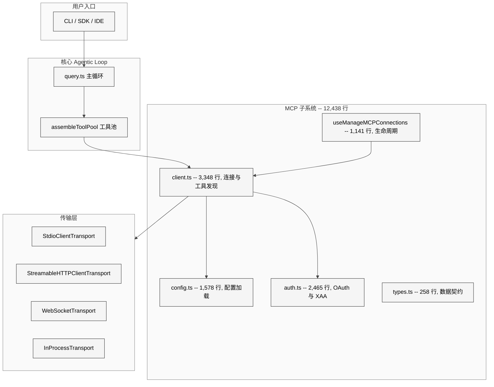
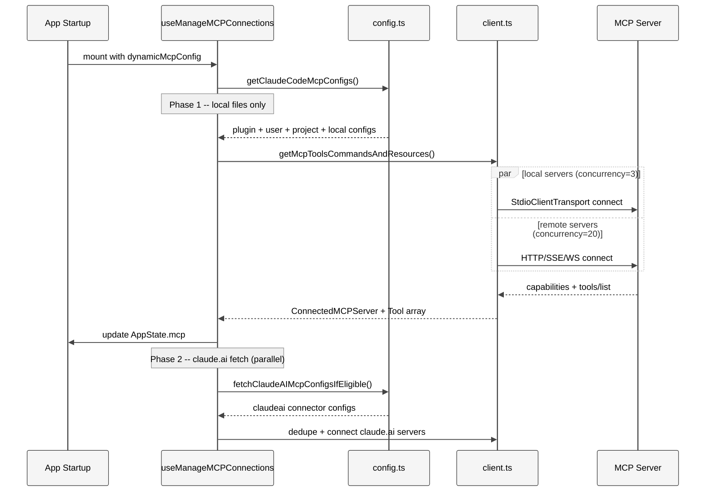
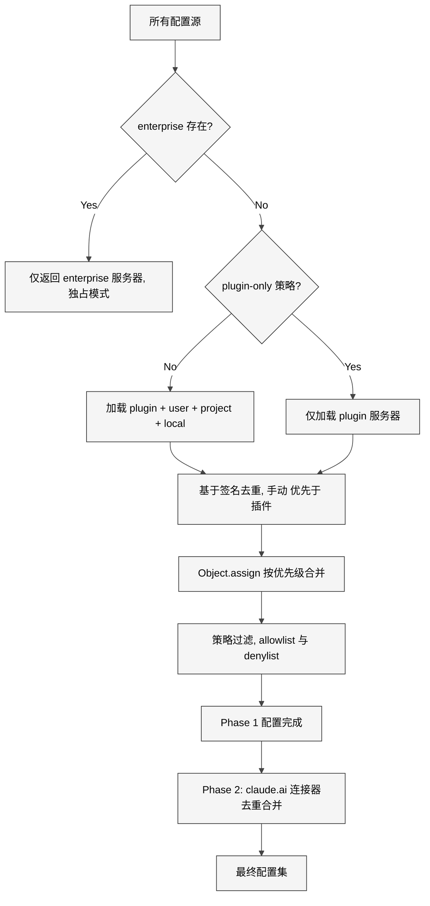
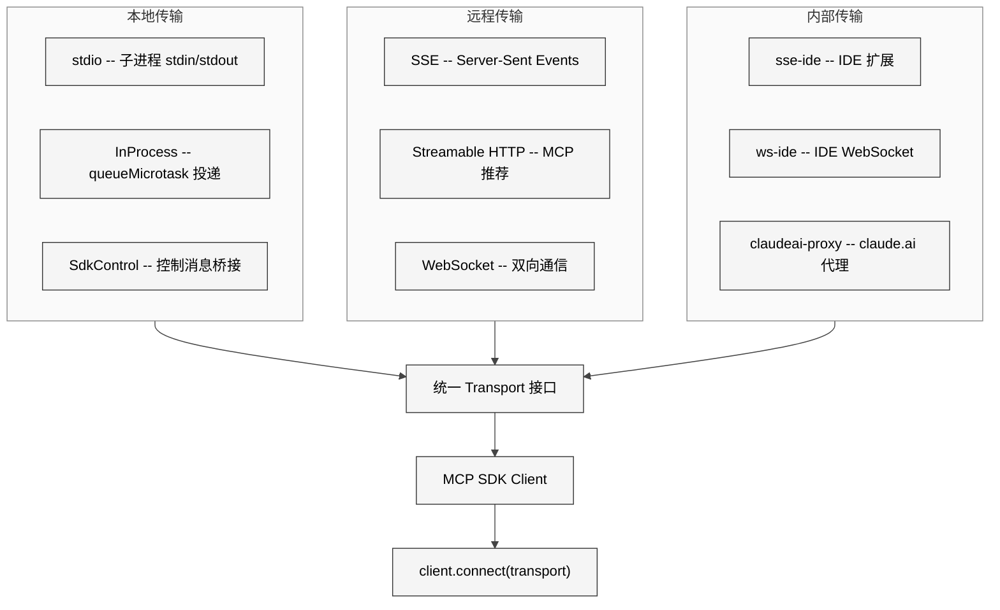
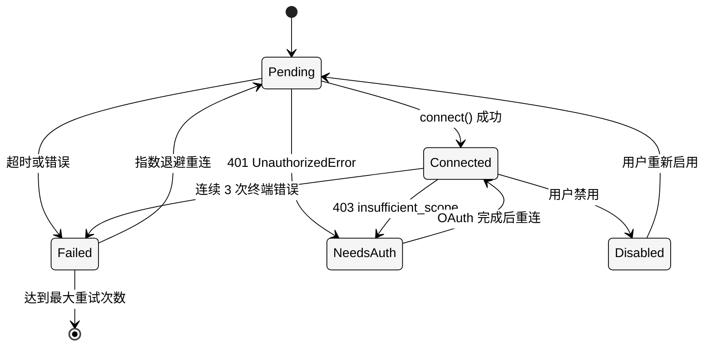
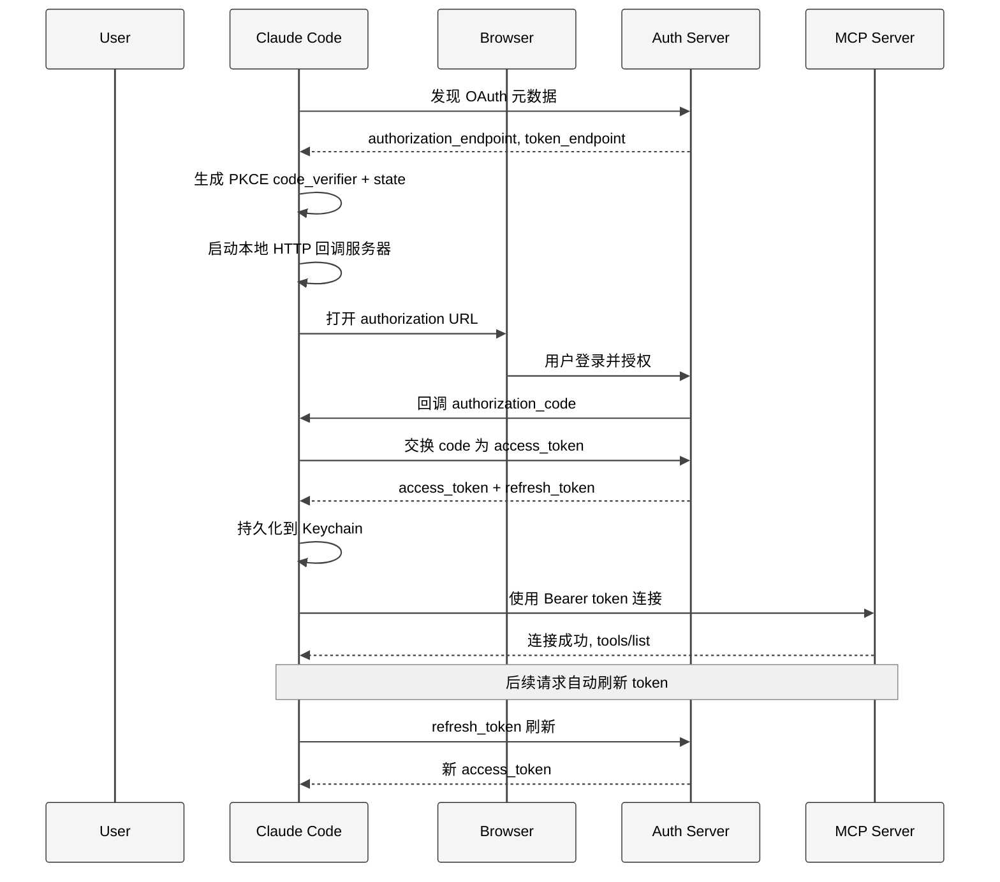
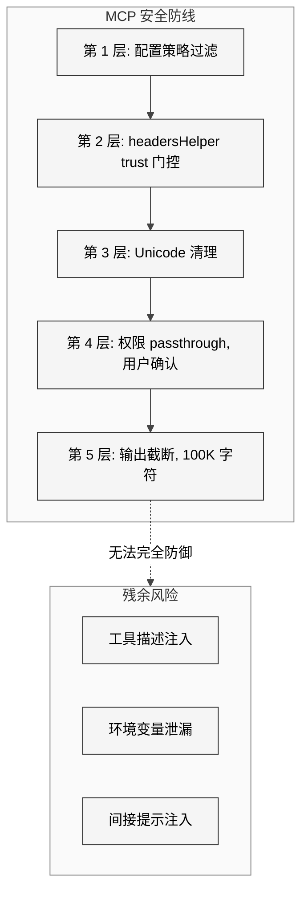

# 第 18 章 MCP

> 核心提要：外部工具接入的协议层

## 15.1 定位

Claude Code 内置了 40+ 个工具（BashTool、FileEditTool、GlobTool 等），足以覆盖大部分编程场景。但真实世界的开发远不止于此——你可能需要查询 Jira 看板、操作 Slack 消息、调用公司内部的 API 网关、访问 GitHub Issues。这些能力不可能也不应该全部内置。

**Model Context Protocol（MCP）** 是 Anthropic 提出的开放标准协议，定义了 AI 应用（Client）与外部工具/数据服务（Server）之间的通信规范。可以把 MCP 理解为 AI 世界的"USB 接口"——只要服务实现了 MCP 协议，Claude Code 就能自动发现并使用其工具，无需修改 Claude Code 自身的代码。

Claude Code 的 MCP 实现是一个完整的生产级客户端系统，代码集中在 `src/services/mcp/` 目录（22 个 TypeScript 文件，**12,438 行代码**）加上 `src/utils/mcpWebSocketTransport.ts`（200 行）和 4 个 Tool 定义文件。它需要解决六个核心问题：

1. **类型安全**：用 TypeScript + Zod 精确定义 8 种服务器配置和 5 种连接状态
2. **多层配置**：7 个来源的配置如何分两阶段加载、合并与去重
3. **传输适配**：stdio / SSE / HTTP / WebSocket / SDK / InProcess 六种传输方式如何统一抽象
4. **连接管理**：30+ 个 MCP 服务器如何并发连接、错误恢复、自动重连
5. **Tool 代理**：外部 MCP Tool 如何无缝融入 Claude Code 的内置工具系统
6. **安全认证**：OAuth / XAA（Cross-App Access）如何保护远程服务器的访问

### 本章结构预览

本章按照"数据契约 → 配置加载 → 传输连接 → 工具注入 → 认证保护 → 竞品对比 → 争议回应"的顺序组织。每个小节都从源码出发，先展示关键代码，再分析设计决策背后的权衡。

### MCP 子系统在 Claude Code 整体架构中的位置

<div style="background: #ffffff; padding: 16px; border-radius: 8px; margin: 16px 0;">



</div>

---

## 15.2 架构

### 15.2.1 类型系统：精确建模一切

MCP 的类型定义集中在 `services/mcp/types.ts`（258 行），这个文件是整个子系统的**数据契约层**。

**配置作用域**定义了 7 个配置来源层级：

```typescript
// services/mcp/types.ts L10-19
export const ConfigScopeSchema = lazySchema(() =>
  z.enum([
    'local',      // .claude/settings.local.json
    'user',       // ~/.claude/settings.json
    'project',    // .mcp.json（从 CWD 向上遍历）
    'dynamic',    // 运行时动态注入（--mcp-config）
    'enterprise', // managed-mcp.json（企业管控）
    'claudeai',   // claude.ai 连接器
    'managed',    // 企业 managed settings
  ]),
)
```

**传输类型**枚举了 6 种公开类型，但 `McpServerConfigSchema` 的 union 实际支持 8 种 server config——额外包含内部使用的 `ws-ide`（IDE WebSocket）和 `claudeai-proxy`（claude.ai 代理）：

```typescript
// services/mcp/types.ts L124-135
export const McpServerConfigSchema = lazySchema(() =>
  z.union([
    McpStdioServerConfigSchema(),     // 本地进程
    McpSSEServerConfigSchema(),       // Server-Sent Events
    McpSSEIDEServerConfigSchema(),    // IDE 内部 SSE
    McpWebSocketIDEServerConfigSchema(), // IDE 内部 WebSocket
    McpHTTPServerConfigSchema(),      // Streamable HTTP（推荐）
    McpWebSocketServerConfigSchema(), // WebSocket
    McpSdkServerConfigSchema(),       // 进程内 SDK
    McpClaudeAIProxyServerConfigSchema(), // claude.ai 代理
  ]),
)
```

**连接状态**使用 TypeScript 的 discriminated union 精确建模 5 种状态：

```typescript
// services/mcp/types.ts L221-226
export type MCPServerConnection =
  | ConnectedMCPServer   // 已连接，带 Client 实例和 capabilities
  | FailedMCPServer      // 连接失败，带 error 信息
  | NeedsAuthMCPServer   // 需要认证
  | PendingMCPServer     // 连接中，带 reconnectAttempt 计数
  | DisabledMCPServer    // 已禁用
```

这种 discriminated union 设计的关键价值在于：在任何使用 `MCPServerConnection` 的地方，TypeScript 编译器会强制你用 `type` 字段做判别，确保每种状态都被处理。`ConnectedMCPServer` 是唯一一个携带 `client: Client` 和 `cleanup: () => Promise<void>` 的状态——这不是约定，而是类型系统的硬性保证。

**设计决策分析**：为什么使用 `lazySchema()` 包装所有 Zod schema？因为 Zod v4 的 schema 构造本身有一定的计算成本。在 Claude Code 的 1,884 个文件中，并非每次启动都需要 MCP 相关的 schema 验证。`lazySchema` 延迟到首次使用时才构造，这是启动性能优化的一个缩影——Claude Code 对每一毫秒的启动时间都非常敏感。

### 15.2.2 核心架构图

<div style="background: #ffffff; padding: 16px; border-radius: 8px; margin: 16px 0;">



</div>

---

## 15.3 实现

### 15.3.1 两阶段配置加载：快启动 + 延迟补充

`services/mcp/config.ts`（1,578 行）负责从多个层级收集、验证、去重和合并 MCP 服务器配置。理解 MCP 配置的关键在于：**`getClaudeCodeMcpConfigs()` 明确排除了 claude.ai 服务器**——注释写道 *"excludes claude.ai servers from the returned set — they're fetched separately and merged by callers"*。claude.ai 连接器需要网络请求，放在主函数中会拖慢启动速度。

```typescript
// services/mcp/config.ts L1062-1069
/**
 * Get Claude Code MCP configurations (excludes claude.ai servers from the
 * returned set — they're fetched separately and merged by callers).
 * This is fast: only local file reads; no awaited network calls on the
 * critical path.
 */
export async function getClaudeCodeMcpConfigs(
  dynamicServers: Record<string, ScopedMcpServerConfig> = {},
  extraDedupTargets: Promise<Record<string, ScopedMcpServerConfig>> = Promise.resolve({}),
)
```

真正的加载流程分为两个阶段。Phase 1 只涉及本地文件读取，通常在几毫秒内完成；Phase 2 的 claude.ai fetch 是网络请求，可能需要数百毫秒甚至数秒，但它在 Phase 1 执行期间就已经并行发起了。

**Phase 1 内部优先级**：通过 `Object.assign` 按优先级从低到高合并：

```typescript
// services/mcp/config.ts L1231-1238
const configs = Object.assign(
  {},
  dedupedPluginServers,    // 最低：插件提供的服务器
  userServers,             // ~/.claude/settings.json
  approvedProjectServers,  // .mcp.json（需通过审批）
  localServers,            // .claude/settings.local.json（最高）
)
```

然后调用方做 `{ ...claudeCodeConfigs, ...dynamicMcpConfig }`，使 dynamic 配置覆盖上述所有层级。最后 claude.ai 连接器在 Phase 2 作为最低优先级合并。完整优先级：

| 优先级 | 来源 | 加载阶段 |
|--------|------|----------|
| 最低 | claude.ai 连接器 | Phase 2（网络请求） |
| ↑ | plugin 服务器 | Phase 1（缓存读取） |
| ↑ | user 配置 | Phase 1（本地文件） |
| ↑ | project 配置（需审批） | Phase 1（本地文件） |
| ↑ | local 配置 | Phase 1（本地文件） |
| 最高 | dynamic（--mcp-config） | Phase 1（调用方覆盖） |
| **独占** | enterprise（managed-mcp.json） | 跳过其他所有 |

**Enterprise 独占模式**：当 enterprise 配置存在时，直接返回，跳过所有其他配置加载：

```typescript
// services/mcp/config.ts L1082-1096
if (doesEnterpriseMcpConfigExist()) {
  const filtered: Record<string, ScopedMcpServerConfig> = {}
  for (const [name, serverConfig] of Object.entries(enterpriseServers)) {
    if (!isMcpServerAllowedByPolicy(name, serverConfig)) {
      continue
    }
    filtered[name] = serverConfig
  }
  return { servers: filtered, errors: [] }
}
```

这个独占设计的出发点很明确：企业客户往往不希望其员工自行添加 MCP 服务器。但 SDK 类型的服务器被豁免——因为 `type: 'sdk'` 是进程内传输的占位符，CLI 不会为它们 spawn 进程或打开网络连接。

### 15.3.2 Project 配置的向上遍历

`.mcp.json` 有一个精妙的行为：**从 CWD 开始，向上遍历到文件系统根目录**，越靠近 CWD 的配置优先级越高：

```typescript
// services/mcp/config.ts L909-955
case 'project': {
  const dirs: string[] = []
  let currentDir = getCwd()
  while (currentDir !== parse(currentDir).root) {
    dirs.push(currentDir)
    currentDir = dirname(currentDir)
  }
  // 从根目录向 CWD 方向处理，靠近 CWD 的文件覆盖远端
  for (const dir of dirs.reverse()) {
    const mcpJsonPath = join(dir, '.mcp.json')
    const { config, errors } = parseMcpConfigFromFilePath({
      filePath: mcpJsonPath, expandVars: true, scope: 'project',
    })
    if (config?.mcpServers) {
      Object.assign(allServers, addScopeToServers(config.mcpServers, scope))
    }
  }
}
```

由此可见 monorepo 的根目录可以定义通用的 MCP 服务器，子项目目录可以覆盖或添加自己的。这是一个对大型代码仓库友好的设计。

### 15.3.3 基于签名的智能去重

当多个来源定义了指向同一底层服务的 MCP 服务器时（例如用户手动配置了 Slack MCP，插件也提供了 Slack MCP），需要智能去重。去重的关键是**服务器签名**——不依赖名称，而是根据实际的命令或 URL 生成唯一标识：

```typescript
// services/mcp/config.ts L202-212
export function getMcpServerSignature(config: McpServerConfig): string | null {
  const cmd = getServerCommandArray(config)
  if (cmd) {
    return `stdio:${jsonStringify(cmd)}`  // 本地进程：按命令+参数签名
  }
  const url = getServerUrl(config)
  if (url) {
    return `url:${unwrapCcrProxyUrl(url)}`  // 远程服务：按 URL 签名
  }
  return null  // sdk 类型没有签名
}
```

去重规则清晰分层：手动配置 > 插件配置 > claude.ai 连接器。注释 `config.ts L268-280` 说明了设计原理：*"Manual wins: a user who wrote .mcp.json or ran `claude mcp add` expressed higher intent than a connector toggled in the web UI."* 这里的"intent"概念很有意思——系统通过配置来源推断用户意图的强弱。

<div style="background: #ffffff; padding: 16px; border-radius: 8px; margin: 16px 0;">



</div>

### 15.3.4 传输层：六种方式统一连接

`services/mcp/client.ts`（3,348 行）是整个子系统最大的文件，其中 `connectToServer()` 函数（L595-1155，560 行）根据配置类型创建对应的传输层。

**stdio 传输**——最常见的本地 MCP：

```typescript
// services/mcp/client.ts L944-958
} else if (serverRef.type === 'stdio' || !serverRef.type) {
  const finalCommand =
    process.env.CLAUDE_CODE_SHELL_PREFIX || serverRef.command
  const finalArgs = process.env.CLAUDE_CODE_SHELL_PREFIX
    ? [[serverRef.command, ...serverRef.args].join(' ')]
    : serverRef.args
  transport = new StdioClientTransport({
    command: finalCommand,
    args: finalArgs,
    env: {
      ...subprocessEnv(),
      ...serverRef.env,
    } as Record<string, string>,
    stderr: 'pipe', // prevents error output from printing to the UI
  })
}
```

`stderr: 'pipe'` 是一个关键细节——MCP 服务器的 stderr 被捕获到调试日志，而不是打印到终端，避免干扰 Claude Code 的 Ink UI 渲染。stderr 的积累还被限制在 64MB 以内（L973）：`if (stderrOutput.length < 64 * 1024 * 1024)`。

**HTTP 传输**（Streamable HTTP）——MCP 2025-03-26 规范推荐的远程传输方式。Claude Code 的实现有一个精妙的 `wrapFetchWithTimeout` 包装器：

```typescript
// services/mcp/client.ts L492-549
export function wrapFetchWithTimeout(baseFetch: FetchLike): FetchLike {
  return async (url: string | URL, init?: RequestInit) => {
    const method = (init?.method ?? 'GET').toUpperCase()
    // GET 请求不设超时——MCP 中 GET 是长连接的 SSE 流
    if (method === 'GET') {
      return baseFetch(url, init)
    }
    // 用 setTimeout 而非 AbortSignal.timeout()
    // 因为 Bun 中 AbortSignal.timeout 的内部定时器在 GC 前不释放，
    // 每个请求泄漏约 2.4KB 原生内存
    const controller = new AbortController()
    const timer = setTimeout(
      c => c.abort(new DOMException('The operation timed out.', 'TimeoutError')),
      MCP_REQUEST_TIMEOUT_MS, // 60 秒
      controller,
    )
    timer.unref?.()  // 不阻止 Node.js 退出
    // ... 清理逻辑
  }
}
```

这里有两个关键洞察：(1) **GET 请求豁免超时**——在 MCP 中 GET 是长连接的 SSE 流，60 秒超时会错误地杀死它；(2) **手动 setTimeout 替代 AbortSignal.timeout()**——因为 Bun 运行时中后者有约 2.4KB/请求的原生内存泄漏。这些都是从生产环境中踩出来的坑。

**InProcess 传输**——避免 325MB 子进程：

```typescript
// services/mcp/InProcessTransport.ts L11-49
class InProcessTransport implements Transport {
  private peer: InProcessTransport | undefined
  private closed = false

  async send(message: JSONRPCMessage): Promise<void> {
    if (this.closed) throw new Error('Transport is closed')
    // 异步投递到对端，避免同步请求/响应导致栈溢出
    queueMicrotask(() => {
      this.peer?.onmessage?.(message)
    })
  }
}
```

注释 `client.ts L909` 说明了原因：*"Run the Chrome MCP server in-process to avoid spawning a ~325 MB subprocess"*。使用方式是创建一对链接的传输通道：

```typescript
// services/mcp/client.ts L916-923
const [clientTransport, serverTransport] = createLinkedTransportPair()
await inProcessServer.connect(serverTransport)
transport = clientTransport
```

`queueMicrotask` 的使用是精心选择的——它确保消息异步投递，避免同步的请求/响应循环导致调用栈溢出。这是 InProcess 传输与 stdio 传输的根本区别：后者天然是异步的（跨进程 I/O），前者需要手动制造异步性。

**WebSocket 传输**——自研的 Bun/Node 双运行时兼容层：

```typescript
// utils/mcpWebSocketTransport.ts L22-70
export class WebSocketTransport implements Transport {
  private isBun = typeof Bun !== 'undefined'

  constructor(private ws: WebSocketLike) {
    // Bun 使用 addEventListener API
    if (this.isBun) {
      nws.addEventListener('message', this.onBunMessage)
    // Node 使用 EventEmitter API
    } else {
      nws.on('message', this.onNodeMessage)
    }
  }
}
```

这个 200 行的文件必须同时兼容 Bun 的原生 WebSocket（DOM API 风格）和 Node.js 的 `ws` 包（EventEmitter 风格）。`handleCloseCleanup`（L123-137）在关闭时移除所有事件监听器，这是防止内存泄漏的关键——MCP 连接可能被频繁创建/销毁（特别是在 reconnect 场景下）。

**SDK 传输**——CLI 与 SDK 进程间的控制通道桥接：

```typescript
// services/mcp/SdkControlTransport.ts L60-95
export class SdkControlClientTransport implements Transport {
  constructor(
    private serverName: string,
    private sendMcpMessage: SendMcpMessageCallback,
  ) {}

  async send(message: JSONRPCMessage): Promise<void> {
    if (this.isClosed) throw new Error('Transport is closed')
    const response = await this.sendMcpMessage(this.serverName, message)
    if (this.onmessage) {
      this.onmessage(response)
    }
  }
}
```

SDK 传输的设计文档（文件头注释 L1-37）清楚地描述了双向通信流程：CLI 的 MCP Client 通过 SdkControlClientTransport 发送请求，控制消息经 stdout 传递到 SDK 进程，SDK 中的 SdkControlServerTransport 将响应回传。这个设计支持多个 SDK MCP 服务器同时运行，通过 `server_name` 字段路由。

<div style="background: #ffffff; padding: 16px; border-radius: 8px; margin: 16px 0;">



</div>

### 15.3.5 并发连接调度：本地与远程分治

当用户配置了大量 MCP 服务器时，连接调度策略直接影响启动速度。`getMcpToolsCommandsAndResources()`（L2226-2399）将服务器分为本地和远程两组：

```typescript
// services/mcp/client.ts L2264-2271
const localServers = configEntries.filter(([_, config]) => isLocalMcpServer(config))
const remoteServers = configEntries.filter(([_, config]) => !isLocalMcpServer(config))
```

本地服务器（stdio/sdk）使用低并发度（默认 3），因为它们需要 spawn 进程，会争抢系统资源；远程服务器使用高并发度（默认 20），因为它们只是网络连接。两组并行处理：

```typescript
// services/mcp/client.ts L2391-2400
await Promise.all([
  processBatched(localServers, getMcpServerConnectionBatchSize(), processServer),    // 3
  processBatched(remoteServers, getRemoteMcpServerConnectionBatchSize(), processServer), // 20
])
```

源码注释记录了一次重要优化：

```typescript
// services/mcp/client.ts L2212-2224
// Replaced 2026-03: previous implementation ran fixed-size sequential batches
// (await batch 1 fully, then start batch 2). That meant one slow server in
// batch N held up ALL servers in batch N+1, even if the other 19 slots were
// idle. pMap frees each slot as soon as its server completes, so a single
// slow server only occupies one slot instead of blocking an entire batch boundary.
async function processBatched<T>(
  items: T[], concurrency: number, processor: (item: T) => Promise<void>,
): Promise<void> {
  await pMap(items, processor, { concurrency })
}
```

从固定批次变为 `p-map` 的滑动窗口——同样的并发上限，更好的调度效率。这是生产环境反馈驱动的优化。

### 15.3.6 连接超时与错误恢复

连接使用 `Promise.race` 实现超时控制：

```typescript
// services/mcp/client.ts L1048-1080
const connectPromise = client.connect(transport)
const timeoutPromise = new Promise<never>((_, reject) => {
  const timeoutId = setTimeout(() => {
    if (inProcessServer) inProcessServer.close().catch(() => {})
    transport.close().catch(() => {})
    reject(new TelemetrySafeError_I_VERIFIED_THIS_IS_NOT_CODE_OR_FILEPATHS(
      `MCP server "${name}" connection timed out after ${getConnectionTimeoutMs()}ms`,
      'MCP connection timeout',
    ))
  }, getConnectionTimeoutMs())
  connectPromise.then(() => clearTimeout(timeoutId), () => clearTimeout(timeoutId))
})
await Promise.race([connectPromise, timeoutPromise])
```

连接成功后，系统注册了一套完整的**连接健康监测机制**（L1216-1310）。核心是 `isTerminalConnectionError` 函数，识别 8 种致命网络错误（ECONNRESET、ETIMEDOUT、EPIPE 等）。当连续错误达到 `MAX_ERRORS_BEFORE_RECONNECT`（3 次）时，主动关闭并触发重连：

```typescript
// services/mcp/client.ts L1249-1263
const isTerminalConnectionError = (msg: string): boolean => {
  return (
    msg.includes('ECONNRESET') || msg.includes('ETIMEDOUT') ||
    msg.includes('EPIPE') || msg.includes('EHOSTUNREACH') ||
    msg.includes('ECONNREFUSED') || msg.includes('Body Timeout Error') ||
    msg.includes('terminated') ||
    msg.includes('SSE stream disconnected') ||
    msg.includes('Failed to reconnect SSE stream')
  )
}
```

重连使用指数退避策略（`useManageMCPConnections.ts L88-90`）：初始 1 秒，最大 30 秒，最多 5 次尝试。

<div style="background: #ffffff; padding: 16px; border-radius: 8px; margin: 16px 0;">



</div>

### 15.3.7 Tool 发现与 MCPTool 桩模式

`fetchToolsForClient`（L1743-1998）是工具发现的核心。它通过 MCP 协议的 `tools/list` 获取工具列表，然后使用**桩模式（Stub Pattern）** 将每个工具包装为 Claude Code 的内置 `Tool` 接口：

```typescript
// services/mcp/client.ts L1766-1774
return toolsToProcess.map((tool): Tool => {
  const fullyQualifiedName = buildMcpToolName(client.name, tool.name)
  return {
    ...MCPTool,                              // 复制桩的全部属性
    name: skipPrefix ? tool.name : fullyQualifiedName,
    mcpInfo: { serverName: client.name, toolName: tool.name },
    // ... 覆盖 description, call, checkPermissions 等
  }
})
```

**MCPTool 桩定义**（`tools/MCPTool/MCPTool.ts`，77 行）提供了所有 MCP 工具共享的行为（权限检查 passthrough、UI 渲染、结果截断），而每个字段标注了 `// Overridden in mcpClient.ts` 以明确占位意图：

```typescript
// tools/MCPTool/MCPTool.ts L27-77
export const MCPTool = buildTool({
  isMcp: true,
  name: 'mcp',                    // 占位名，运行时替换
  maxResultSizeChars: 100_000,
  async call() { return { data: '' } },  // 空实现
  async checkPermissions(): Promise<PermissionResult> {
    return { behavior: 'passthrough', message: 'MCPTool requires permission.' }
  },
  // ... UI 渲染、结果截断等共性行为
})
```

这种展开运算符（`...MCPTool`）+ 覆盖的模式实现了：(1) **代码复用**——所有 MCP 工具共享权限、渲染、截断逻辑；(2) **动态扩展**——工具数量在运行时决定；(3) **类型安全**——桩满足 `Tool` 接口约束，展开后的对象自然也满足。

**MCP 工具的 Tool Annotations** 是一个值得注意的新特性。Claude Code 利用 MCP 工具元数据的 `annotations` 字段来推断工具属性：

```typescript
// services/mcp/client.ts L1796-1811
isConcurrencySafe() { return tool.annotations?.readOnlyHint ?? false },
isReadOnly() { return tool.annotations?.readOnlyHint ?? false },
isDestructive() { return tool.annotations?.destructiveHint ?? false },
isOpenWorld() { return tool.annotations?.openWorldHint ?? false },
```

如果 MCP 服务器声明了 `readOnlyHint: true`，Claude Code 就可以安全地并发执行该工具。这是协议层面的信息传递——远比运行时猜测可靠。

### 15.3.8 needs-auth 缓存：避免重复 401

对于需要认证的远程服务器，系统维护了 15 分钟 TTL 的缓存，避免每次连接都发起一轮 HTTP 401 + OAuth 发现的网络往返：

```typescript
// services/mcp/client.ts L2307-2322
if (
  (config.type === 'claudeai-proxy' || config.type === 'http' || config.type === 'sse') &&
  ((await isMcpAuthCached(name)) ||
   ((config.type === 'http' || config.type === 'sse') &&
    hasMcpDiscoveryButNoToken(name, config)))
) {
  logMCPDebug(name, `Skipping connection (cached needs-auth)`)
  onConnectionAttempt({
    client: { name, type: 'needs-auth' as const, config },
    tools: [createMcpAuthTool(name, config)],
    commands: [],
  })
  return
}
```

注释解释了设计原理（L2301-2306）：*"The second check closes the gap the TTL leaves open: without it, every 15min we re-probe servers that cannot succeed until the user runs /mcp. Each probe is a network round-trip for connect-401 plus OAuth discovery."* 被标记为 `needs-auth` 的服务器不会尝试连接，而是直接注入一个 `McpAuthTool`，引导用户通过 `/mcp` 命令完成认证。

---

## 15.4 认证体系：OAuth 与 XAA

### 15.4.1 ClaudeAuthProvider：OAuth 客户端实现

`auth.ts`（2,465 行）是 MCP 子系统中第二大的文件，实现了完整的 OAuth 2.0 客户端。`ClaudeAuthProvider`（L1376-1600+）实现了 MCP SDK 的 `OAuthClientProvider` 接口：

```typescript
// services/mcp/auth.ts L1376-1407
export class ClaudeAuthProvider implements OAuthClientProvider {
  // ... 字段定义
  get clientMetadata(): OAuthClientMetadata {
    return {
      client_name: `Claude Code (${this.serverName})`,
      redirect_uris: [this.redirectUri],
      grant_types: ['authorization_code', 'refresh_token'],
      response_types: ['code'],
      token_endpoint_auth_method: 'none', // Public client
    }
  }

  get clientMetadataUrl(): string | undefined {
    // CIMD (SEP-991): URL-based client_id
    return process.env.MCP_OAUTH_CLIENT_METADATA_URL || MCP_CLIENT_METADATA_URL
  }
}
```

**Step-Up 检测** 是一个特别精妙的机制（L1354-1374）。当 MCP 服务器返回 403 + `WWW-Authenticate: insufficient_scope` 时，`wrapFetchWithStepUpDetection` 拦截这个响应并标记 provider 需要 scope 升级：

```typescript
// services/mcp/auth.ts L1354-1374
export function wrapFetchWithStepUpDetection(
  baseFetch: FetchLike, provider: ClaudeAuthProvider,
): FetchLike {
  return async (url, init) => {
    const response = await baseFetch(url, init)
    if (response.status === 403) {
      const wwwAuth = response.headers.get('WWW-Authenticate')
      if (wwwAuth?.includes('insufficient_scope')) {
        const match = wwwAuth.match(/scope=(?:"([^"]+)"|([^\s,]+))/)
        const scope = match?.[1] ?? match?.[2]
        if (scope) provider.markStepUpPending(scope)
      }
    }
    return response
  }
}
```

这个包装器被放在 fetch 链的最内层（L632-633 中 `wrapFetchWithStepUpDetection(createFetchWithInit())` 再包 `wrapFetchWithTimeout`），确保 403 在 SDK 的 auth handler 介入之前就被捕获。

`tokens()` 方法（L1540-1600+）的实现异常复杂，包含了对 XAA 静默刷新的支持。一个关键细节是注释中提到的性能问题（L1541-1547）：

> *We do NOT clearKeychainCache() here — tokens() is called by the MCP SDK's _commonHeaders on every request, and forcing a cache miss would trigger a blocking spawnSync(`security find-generic-password`) 30-40x/sec. See CPU profile: spawnSync was 7.2% of total CPU after PR #19436.*

每个 MCP 请求都会调用 `tokens()` 获取认证头。如果每次都清除 keychain 缓存重新读取，macOS 上的 `security` 命令（同步 spawn）会消耗 7.2% 的 CPU。这是一个从 CPU profile 中发现并修复的真实性能问题。

### 15.4.2 XAA（Cross-App Access）：企业级无浏览器认证

`xaa.ts`（511 行）实现了 SEP-990 规范的 Cross-App Access 认证链。与常规 OAuth 的浏览器授权不同，XAA 通过 IdP（Identity Provider）的 id_token 交换来获取 MCP 访问令牌，无需用户每次都打开浏览器确认。

认证链包含四步：

1. **PRM 发现**：RFC 9728 受保护资源元数据发现
2. **AS 发现**：RFC 8414 授权服务器元数据发现
3. **Token 交换**：RFC 8693 id_token 交换为 ID-JAG
4. **JWT 授权**：RFC 7523 ID-JAG 交换为 access_token

```typescript
// services/mcp/xaa.ts L1-17（文件头注释）
/**
 * Cross-App Access (XAA) / Enterprise Managed Authorization (SEP-990)
 *
 * Obtains an MCP access token WITHOUT a browser consent screen by chaining:
 *   1. RFC 8693 Token Exchange at the IdP: id_token -> ID-JAG
 *   2. RFC 7523 JWT Bearer Grant at the AS: ID-JAG -> access_token
 */
```

`XaaTokenExchangeError`（L77-84）是一个精心设计的错误类型——它携带 `shouldClearIdToken` 标志，让调用方根据 OAuth 错误语义（而非字符串匹配）决定是否清除缓存的 id_token：4xx/invalid_grant 意味着 token 坏了要清除，5xx 意味着服务器故障但 token 可能仍有效。

### 15.4.3 敏感信息保护

auth.ts 和 xaa.ts 中有多处敏感信息保护机制。`SENSITIVE_TOKEN_RE`（xaa.ts L91-92）用正则表达式匹配 token 类字段并在日志中替换为 `[REDACTED]`。OAuth 回调中的 `SENSITIVE_OAUTH_PARAMS`（auth.ts L100）确保 state、code 等参数不会泄露到日志。headersHelper 在 project/local scope 下需要通过 trust dialog（headersHelper.ts L40-57）——这是防止恶意 `.mcp.json` 在用户不知情的情况下执行脚本的安全门控。

---

## 15.5 细节

### 15.5.1 最关键的 5 个文件

| 文件 | 行数 | 核心职责 |
|------|------|---------|
| `client.ts` | 3,348 | 连接建立、传输创建、工具发现与包装、并发调度 |
| `auth.ts` | 2,465 | OAuth 客户端（ClaudeAuthProvider）、OAuth 流程编排、token 管理 |
| `config.ts` | 1,578 | 7 层配置加载、去重、策略过滤、企业独占模式 |
| `useManageMCPConnections.ts` | 1,141 | React Hook 生命周期管理、重连调度、状态批量更新 |
| `xaa.ts` | 511 | XAA 认证链（PRM + AS 发现 + Token 交换 + JWT 授权） |

### 15.5.2 防御性编程模式

**1. stderr 积累上限防止 OOM**

```typescript
// services/mcp/client.ts L972-980
if (stderrOutput.length < 64 * 1024 * 1024) {
  try { stderrOutput += data.toString() }
  catch { /* Ignore errors from exceeding max string length */ }
}
```

MCP 服务器可能向 stderr 输出大量内容（尤其是 Python 服务器的 traceback）。没有这个上限，一个异常 verbose 的服务器可能导致 Claude Code 进程 OOM。

**2. 重入保护防止死循环**

```typescript
// services/mcp/client.ts L1230-1232
let hasTriggeredClose = false
const closeTransportAndRejectPending = (reason: string) => {
  if (hasTriggeredClose) return
  hasTriggeredClose = true
  // ...
}
```

`close()` 会中止正在进行的流，这可能触发 `onerror`，而 `onerror` 可能再次调用 `close()`。没有这个重入保护，会形成 `close -> onerror -> close` 的无限递归。

**3. 批量状态更新防止渲染风暴**

```typescript
// services/mcp/useManageMCPConnections.ts L207-308
const MCP_BATCH_FLUSH_MS = 16
const pendingUpdatesRef = useRef<PendingUpdate[]>([])
const flushTimerRef = useRef<ReturnType<typeof setTimeout> | null>(null)
// 16ms 窗口内的所有更新合并为一次 setAppState
```

当 30 个服务器并发连接时，每个连接成功都会触发状态更新。没有批量合并，React 的 reconciliation 会被频繁触发。16ms 的窗口（约一帧）在视觉上无感知但性能上显著改善。

**4. Session 过期自动重试**

```typescript
// services/mcp/client.ts L1860-1922
const MAX_SESSION_RETRIES = 1
for (let attempt = 0; ; attempt++) {
  try {
    const connectedClient = await ensureConnectedClient(client)
    const mcpResult = await callMCPToolWithUrlElicitationRetry({ ... })
    return { data: mcpResult.content }
  } catch (error) {
    if (error instanceof McpSessionExpiredError && attempt < MAX_SESSION_RETRIES) {
      continue  // 清除缓存，用新 client 重试
    }
    throw error
  }
}
```

MCP 会话可能因服务器重启而过期（HTTP 404 + JSON-RPC -32001）。`isMcpSessionExpiredError`（L193-208）通过双信号检测（HTTP 状态码 + 错误消息）避免将普通 404 误判为会话过期。

**5. 环境变量展开的安全处理**

```typescript
// services/mcp/envExpansion.ts L10-38
export function expandEnvVarsInString(value: string) {
  const missingVars: string[] = []
  const expanded = value.replace(/\$\{([^}]+)\}/g, (match, varContent) => {
    const [varName, defaultValue] = varContent.split(':-', 2)
    const envValue = process.env[varName]
    if (envValue !== undefined) return envValue
    if (defaultValue !== undefined) return defaultValue
    missingVars.push(varName)
    return match  // 保留原文，便于调试
  })
  return { expanded, missingVars }
}
```

未找到的变量保留原文而非替换为空——这让错误配置在调试时可见。支持 `${VAR:-default}` 语法，覆盖了 shell 的常见用法。

### 15.5.3 Elicitation：MCP 服务器主动请求用户交互

`elicitationHandler.ts`（313 行）处理 MCP 的 elicitation 协议——当 MCP 服务器需要用户输入（表单或 URL 确认）时，通过 JSON-RPC 请求触发客户端 UI。这是 MCP 协议中相对较新的能力：

```typescript
// services/mcp/elicitationHandler.ts L77-171
client.setRequestHandler(ElicitRequestSchema, async (request, extra) => {
  // 先运行 hooks——它们可以程序化地提供响应
  const hookResponse = await runElicitationHooks(serverName, request.params, extra.signal)
  if (hookResponse) return hookResponse

  // 否则通过 AppState 将请求推入 UI 队列
  const response = new Promise<ElicitResult>(resolve => {
    setAppState(prev => ({
      ...prev,
      elicitation: {
        queue: [...prev.elicitation.queue, {
          serverName, requestId: extra.requestId,
          params: request.params, signal: extra.signal,
          respond: resolve,
        }],
      },
    }))
  })
  return await response
})
```

设计的巧妙之处在于：hooks 优先于 UI——自动化场景（如 CI/CD）可以通过 hooks 程序化地响应 elicitation，无需人工干预。

### 15.5.4 资源与命令发现

工具发现之外，MCP 还支持**资源（Resources）** 和**命令/提示模板（Prompts）** 的发现。`fetchResourcesForClient`（`client.ts L2000-2031`）通过 `resources/list` 获取服务器提供的资源列表，每个资源被打上 `server` 字段标记来源。`fetchCommandsForClient`（`client.ts L2033-2096`）将 MCP prompts 转换为 Claude Code 的 `Command` 格式，使其可通过斜杠命令调用：

```typescript
// services/mcp/client.ts L2054-2069
return promptsToProcess.map(prompt => {
  return {
    type: 'prompt' as const,
    name: 'mcp__' + normalizeNameForMCP(client.name) + '__' + prompt.name,
    // Use prompt.name (programmatic identifier) not prompt.title (display name)
    // to avoid spaces breaking slash command parsing
    userFacingName() {
      return `${client.name}:${prompt.name} (MCP)`
    },
    async getPromptForCommand(args: string) {
      const connectedClient = await ensureConnectedClient(client)
      const result = await connectedClient.client.getPrompt({
        name: prompt.name,
        arguments: zipObject(argNames, argsArray),
      })
      return transformed.flat()
    },
  }
})
```

三种发现（tools + resources + prompts）在连接成功后通过 `Promise.all` 并行执行（`client.ts L2344-2355`），最大化利用网络并发。如果任何一种发现失败，不会阻塞其他两种——每个 fetch 函数内部都有 try-catch 保护，失败时返回空数组。这是容错性设计的典型体现。

当至少有一个服务器支持 resources 时，系统自动注入 `ListMcpResourcesTool` 和 `ReadMcpResourceTool` 两个内置工具（`client.ts L2361-2364`）。这些工具使模型能够浏览和读取 MCP 服务器提供的数据资源（如数据库记录、文件内容等），而不仅仅是调用工具。

### 15.5.5 名称规范化与工具命名

MCP 工具的命名遵循严格的 `mcp__<server>__<tool>` 格式。`normalization.ts`（23 行）负责将任意服务器名规范化为 API 兼容格式：

```typescript
// services/mcp/normalization.ts L17-23
export function normalizeNameForMCP(name: string): string {
  let normalized = name.replace(/[^a-zA-Z0-9_-]/g, '_')
  if (name.startsWith(CLAUDEAI_SERVER_PREFIX)) {
    normalized = normalized.replace(/_+/g, '_').replace(/^_|_$/g, '')
  }
  return normalized
}
```

claude.ai 服务器名有特殊处理——连续下划线被折叠、首尾下划线被去除——因为 `__` 是分隔符，如果服务器名中出现 `__` 会导致解析歧义。源码注释（`mcpStringUtils.ts L14-16`）明确承认了这个限制：*"Known limitation: If a server name contains `__`, parsing will be incorrect."*

`getToolNameForPermissionCheck`（`mcpStringUtils.ts L60-67`）确保权限规则检查时使用全限定名 `mcp__server__tool`，防止针对内置工具的 deny 规则（如 `Write`）误匹配同名 MCP 工具。

### 15.5.6 claude.ai 连接器：云端 MCP 的落地

`claudeai.ts`（164 行）实现了从 Claude.ai 组织配置获取 MCP 服务器列表的功能。它通过 `v1/mcp_servers` API 获取组织管理员在 claude.ai 上配置的 MCP 服务器，将它们转换为 `claudeai-proxy` 类型的配置：

```typescript
// services/mcp/claudeai.ts L39-75
export const fetchClaudeAIMcpConfigsIfEligible = memoize(
  async (): Promise<Record<string, ScopedMcpServerConfig>> => {
    // 检查环境变量开关
    if (isEnvDefinedFalsy(process.env.ENABLE_CLAUDEAI_MCP_SERVERS)) return {}
    // 检查 OAuth token 和 scope
    const tokens = getClaudeAIOAuthTokens()
    if (!tokens?.accessToken) return {}
    if (!tokens.scopes?.includes('user:mcp_servers')) return {}
    // 带 5 秒超时的 API 调用
    const url = `${baseUrl}/v1/mcp_servers?limit=1000`
    // ... fetch and transform
  },
)
```

结果被 memoize（每个 CLI 会话只 fetch 一次），5 秒超时确保网络故障不会无限阻塞。这些 claude.ai 服务器通过 `claudeai-proxy` 传输类型连接——请求经由 Anthropic 的代理服务器转发到实际的 MCP 服务器，用户的 Claude.ai OAuth token 用于认证代理。

---

## 15.6 比较

### 15.6.1 MCP 支持度对比

| 维度 | Claude Code | Cursor | GitHub Copilot | Aider | Cline |
|------|-------------|--------|---------------|-------|-------|
| 传输类型 | 8 种（stdio/SSE/HTTP/WS/SDK/InProcess/IDE/claudeai） | stdio + SSE | stdio（有限） | 无原生 MCP | stdio + SSE |
| 配置层级 | 7 层 + 企业独占 | 工作区 + 用户 | 工作区 | N/A | 工作区 |
| 认证 | OAuth + XAA + CIMD | OAuth（基础） | 无 | N/A | OAuth（基础） |
| 并发调度 | 本地/远程分治，pMap 滑动窗口 | 顺序连接 | 单连接 | N/A | 顺序连接 |
| InProcess 传输 | 有（Chrome/ComputerUse） | 无 | 无 | N/A | 无 |
| 工具延迟加载 | ToolSearchTool 按需加载 | 全量加载 | 全量加载 | N/A | 全量加载 |
| Elicitation | 完整支持（form + URL） | 无 | 无 | N/A | 无 |
| 企业策略 | allowlist + denylist + 独占 | 无 | 有限 | N/A | 无 |

### 15.6.2 Claude Code 的优势

**1. 传输层的完整性和工程成熟度**。8 种传输类型覆盖了从本地进程到企业代理的所有场景。InProcess 传输（避免 325MB 子进程）和 SDK 传输（CLI-SDK 跨进程桥接）是其他产品没有的创新。WebSocket 传输的 Bun/Node 双运行时兼容也体现了深度工程投入。

**2. 配置系统的灵活性**。7 层配置 + 企业独占 + 向上遍历 + 签名去重，覆盖了从个人开发者到大型企业的所有需求。Cursor 和 Cline 只有工作区级别的配置，无法处理 monorepo 或企业管控场景。

**3. 认证体系的完整性**。OAuth + XAA + CIMD + Step-Up 检测，这是目前 AI 编码工具中最完整的 MCP 认证实现。XAA 解决了企业场景下"每次连接都要打开浏览器"的痛点。

### 15.6.3 Claude Code 的局限

**1. 代码复杂度高**。`client.ts` 3,348 行是一个明显的"God Module"——连接建立、传输创建、工具发现、并发调度、Session 管理全在一个文件里。源码中 `TODO (ollie): The memoization here increases complexity by a lot, and im not sure it really improves performance`（L589）直接表达了开发者对复杂度的不满。

**2. memoize 导致的状态管理困难**。`connectToServer` 被 `memoize` 包装（L595），缓存键是 `name + JSON.stringify(config)`。由此可见配置变更必须通过 `clearServerCache` 显式失效缓存，且 `TODO` 注释（`useManageMCPConnections.ts L342`）承认了 AppState 与磁盘状态不一致的问题。

**3. 没有连接池**。每次断线重连都创建全新的 Client 和 Transport 实例。对于频繁断线的不稳定网络环境，这可能导致资源频繁分配/释放。

---

## 15.7 辨误

### 15.7.1 MCP：未来标准 vs Vendor Lock-in

**争议本质**：MCP 是 Anthropic 主导的协议，社区担心它会成为 vendor lock-in 的工具，而非真正的开放标准。

**源码实证裁决**：从 Claude Code 的实现来看，MCP 的开放性是**有限但实质的**。证据如下：

1. **协议层面**：Claude Code 使用的是 `@modelcontextprotocol/sdk`（MIT 许可的开源 SDK），传输层基于 HTTP/SSE/WebSocket 等标准协议，不依赖任何 Anthropic 私有协议。
2. **扩展层面**：`claudeai-proxy` 和 `ws-ide` 类型是 Anthropic 的私有扩展，不在公开的 `TransportSchema` 枚举中（`types.ts L23-25` 只列出 6 种公开类型）。这些扩展通过 `McpServerConfigSchema` 的 union 类型"偷偷"加入。
3. **认证层面**：XAA（SEP-990）和 CIMD（SEP-991）是 Anthropic 提出的扩展规范。虽然它们基于标准 RFC（8693、7523、9728），但这些 SEP 目前还不是 MCP 核心规范的一部分。
4. **实际采用**：Cursor、Cline、Codex CLI 等竞品也已支持 MCP（至少 stdio 传输），这表明 MCP 正在形成事实标准。

**裁决**：MCP 目前处于"Anthropic 主导但逐渐开放"的状态。核心协议（stdio + HTTP）是真正开放的；高级功能（XAA、Elicitation、通道权限）有 Anthropic 的先发优势。对于 Agent 开发者，MCP 是目前最好的选择，但要注意不要深度依赖私有扩展。

### 15.7.2 MCP 作为攻击面

**争议本质**：MCP 服务器是不受信的外部代码，它们提供的工具可能被用于提示注入、数据窃取或命令注入。

**源码实证裁决**：Claude Code 对 MCP 攻击面有**多层缓解，但并非完全防御**：

**缓解措施**：
1. **权限 passthrough**：所有 MCP 工具的 `checkPermissions` 返回 `passthrough`（`MCPTool.ts L56-60`），由此可见权限决策被上推到全局权限管线。用户在首次执行 MCP 工具时会收到确认提示。
2. **Unicode 清理**：`fetchToolsForClient` 对所有 MCP 工具数据执行 `recursivelySanitizeUnicode`（`client.ts L1758`），防止 Unicode 注入。
3. **输出截断**：`MCPTool.maxResultSizeChars = 100_000`（`MCPTool.ts L35`）防止超大输出耗尽上下文窗口。
4. **企业策略**：denylist 拥有绝对优先权（`config.ts L422`），企业管理员可以精确控制允许的服务器。
5. **headersHelper 信任门控**：来自 project/local scope 的 headersHelper 脚本需要通过 trust dialog（`headersHelper.ts L42-57`）。
6. **searchHint 清理**：MCP 工具的 `_meta['anthropic/searchHint']` 被强制清除换行符（`client.ts L1782-1783`），防止向延迟工具列表注入恶意文本。

**残余风险**：
1. **工具描述注入**：MCP 工具的 `description` 直接进入模型上下文，恶意服务器可以通过 crafted description 影响模型行为。`MAX_MCP_DESCRIPTION_LENGTH` 截断可以限制但不能消除这个风险。
2. **stdio stderr 捕获有限**：虽然 stderr 被 pipe 并截断，但 MCP 服务器仍然可以通过工具返回值传递恶意内容。
3. **环境变量泄漏**：`subprocessEnv()` 传递给 stdio 服务器（`client.ts L954`），恶意服务器可以读取环境变量。

**裁决**：MCP 的安全模型是"纵深防御 + 用户确认"，不是"完全隔离"。这是一个合理的权衡——完全沙箱化 MCP 服务器会极大限制其能力（需要访问文件系统、网络等才有价值）。对于高安全要求的场景，enterprise 策略的 allowlist/denylist 机制提供了足够的管控。

### 15.7.4 OAuth 完整流程剖析

为了更清晰地展示认证的完整流程，这里给出 `performMCPOAuthFlow`（`auth.ts L847-1000+`）编排的完整时序：

<div style="background: #ffffff; padding: 16px; border-radius: 8px; margin: 16px 0;">



</div>

XAA 流程的区别在于跳过了浏览器环节：用预先缓存的 IdP id_token 通过 RFC 8693 Token Exchange 获取 ID-JAG，再通过 RFC 7523 JWT Bearer Grant 获取 access_token。整个过程对用户完全透明——首次需要 IdP 登录（一个浏览器弹窗），之后的所有 MCP 服务器连接都是静默的。注释 `auth.ts L857-867` 明确说明：*"No silent fallback: if `oauth.xaa` is set, XAA is the only path. We never fall through to the consent flow — that would be surprising and security-relevant."*

<div style="background: #ffffff; padding: 16px; border-radius: 8px; margin: 16px 0;">



</div>

### 15.7.3 纠正社区常见误解

**误解 1："MCP 就是 HTTP API 调用的封装"**

实际上 MCP 远不止于此。从 Claude Code 的实现可以看到，MCP 包括工具发现（`tools/list`）、资源管理（`resources/list`）、命令/提示模板（`prompts/list`）、elicitation（用户交互请求）、通知机制（工具/资源列表变更），以及完整的认证框架（OAuth + XAA）。它是一个**完整的交互协议**，不是简单的 API 调用。

**误解 2："每个 MCP 服务器都是独立进程"**

InProcessTransport 证明了这不是真的。Chrome MCP 和 Computer Use MCP 在 Claude Code 进程内运行，通过 `createLinkedTransportPair()` 实现零序列化成本的通信。SDK 传输通过控制消息桥接也避免了额外进程。

**误解 3："MCP 工具和内置工具是完全不同的系统"**

MCPTool 桩模式使得 MCP 工具在运行时与内置工具完全统一——它们共享相同的 `Tool` 接口、相同的权限管线、相同的上下文注入方式。从模型的角度看，`mcp__github__create_pr` 和 `FileEditTool` 没有任何区别。

---

## 15.8 展望

### 15.8.1 源码中的 TODO 和已知缺陷

| 位置 | 内容 | 影响 |
|------|------|------|
| `client.ts L589` | `TODO (ollie): The memoization here increases complexity by a lot, and im not sure it really improves performance` | connectToServer 的 memoize 可能是过早优化 |
| `client.ts L681` | `TODO: Use the auth token provided in the lockfile` | IDE 传输缺少认证 |
| `auth.ts L1743` | `TODO(xaa-ga): add cross-process lockfile before GA` | 多进程 token 刷新可能竞争 |
| `xaa.ts L133, L176` | `TODO: upstream to SDK` -- 发行人不匹配验证 | 安全验证逻辑未回馈上游 SDK |
| `xaa.ts L229` | `TODO(xaa-ga): consult token_endpoint_auth_methods_supported from IdP` | IdP 认证方法选择硬编码 |
| `useManageMCPConnections.ts L342` | `TODO: This really isn't great: ideally we'd check appstate as the source of truth` | AppState 与磁盘状态不一致 |

### 15.8.2 设计瓶颈

**1. client.ts 的单文件膨胀**。3,348 行的文件承担了太多职责。如果 MCP 规范继续演进（新增传输类型、新的交互模式），这个文件会变得更加难以维护。建议拆分为 `connection.ts`（传输创建）、`discovery.ts`（工具/资源发现）、`scheduling.ts`（并发调度）。

**2. memoize 的缓存一致性**。`connectToServer` 和 `fetchToolsForClient` 都使用了 memoize，但缓存失效依赖显式调用 `clearServerCache`。当配置变更、网络状态变化或认证过期时，缓存可能包含陈旧数据。一个更健壮的方案是使用带 TTL 的缓存或响应式的 invalidation 机制。

**3. 重连策略的粗粒度**。当前的指数退避重连不区分暂时性故障（网络波动）和永久性故障（服务器下线）。一个改进方向是引入故障分类：网络超时用快速重连，认证失败转入 `needs-auth`，进程崩溃检查 exit code 后决定是否重启。

### 15.8.3 如果我来设计下一版

1. **传输层抽象重构**：引入 `TransportFactory` 模式，将 `connectToServer` 中的 8 段 if-else 替换为注册表驱动的工厂。每种传输类型一个文件，通过统一接口注册。
2. **连接池化**：为远程服务器维护连接池，断线后复用 Client 实例。MCP 的 session ID 机制天然支持这一点。
3. **增量配置更新**：当前任何配置变更都触发全量重连。可以引入配置 diff 机制，只重连变更的服务器。
4. **工具能力协商**：利用 MCP 的 capabilities 机制做更细粒度的功能发现，而非一股脑 `tools/list + resources/list + prompts/list`。
5. **沙箱化 stdio 传输**：对于来自 `project` scope 的 MCP 服务器，可以在沙箱（macOS Seatbelt / Linux seccomp）内启动子进程，限制其文件系统和网络访问。

---

## 15.9 小结

### 对行业的启示

Claude Code 的 MCP 实现给出了一个重要信号：**AI Agent 的工具扩展协议正在从"各自为政"走向"标准化"**。这与 Web 生态的演进路径高度相似——从各浏览器的私有 API 到 W3C 标准，从各家的 RPC 协议到 REST/gRPC。

MCP 的真正价值不在于技术复杂度（JSON-RPC 2.0 并不新奇），而在于**解决了 AI Agent 生态的核心协调问题**：工具提供方不需要为每个 Agent 产品写适配器，Agent 产品不需要为每个工具写集成代码。Claude Code 的 12,438 行 MCP 客户端代码证明了这个协调成本是多么昂贵——想象如果每个 Agent 都要从头实现一遍，行业整体的浪费将是惊人的。

但 MCP 的成功并非确定的。历史上不乏"最先进但最终失败"的标准（如 SOAP、CORBA）。MCP 能否成为 AI Agent 世界的"HTTP"，取决于：(1) Anthropic 能否在标准治理上保持足够的开放性；(2) 竞品（OpenAI、Google）是否采用或提出替代方案；(3) 企业用户是否愿意将关键工具集成绑定到 MCP 上。从 Claude Code 的工程投入来看，Anthropic 在这场标准之战中投入了真金白银——不仅是代码量，还有 OAuth/XAA 认证、企业策略、通道权限等"不性感但决定企业采购"的功能。

### 核心 Takeaways

1. **类型驱动设计**：258 行的 `types.ts` 是整个子系统的基石。8 种 server config union + 5 种连接状态 discriminated union，让 TypeScript 编译器成为 MCP 实现正确性的第一道防线。

2. **两阶段加载是性能与完整性的平衡**：Phase 1 只读本地文件（毫秒级），Phase 2 的 claude.ai fetch 并行进行（秒级）。这让用户在网络不佳时也能快速启动，同时不丢失远程配置。

3. **传输层的工程深度远超预期**：从 Bun 内存泄漏规避（`wrapFetchWithTimeout`）到 SSE 长连接的超时豁免，再到 InProcess 传输节省 325MB 内存——每一个细节都源于生产环境的真实问题。

4. **MCPTool 桩模式是动态工具注入的优雅解法**：`{ ...MCPTool, name: 实际名, call: 实际调用 }` 的展开覆盖模式，让编译时未知数量的 MCP 工具在运行时无缝融入内置工具体系。

5. **OAuth/XAA 认证是企业级采用的关键门槛**：2,465 行的 auth.ts + 511 行的 xaa.ts 反映了将 MCP 从"开发者玩具"推向"企业基础设施"的工程投入。Step-Up 检测、cross-process 刷新、keychain 性能优化——这些不是协议设计者能预见的问题，只能在生产环境中发现和解决。

### 对 Agent 开发者的实践建议

- **配置层级设计**：如果你的 Agent 需要企业部署，从第一天就设计多层配置体系。Claude Code 的 7 层模型可以简化为 3 层起步（用户 < 项目 < 企业），但"企业独占"能力必须 Day 1 就有。
- **传输选择**：优先支持 HTTP（Streamable HTTP），这是 MCP 规范推荐的远程传输方式。stdio 用于本地服务器。SSE 已被标记为遗留。
- **并发策略**：本地服务器低并发（进程 spawn 成本高），远程服务器高并发（只是网络连接）。使用滑动窗口（`p-map`）而非固定批次。
- **认证**：OAuth 是必须的。如果目标用户包含企业，考虑实现 XAA（无浏览器认证）——这是用户体验的巨大提升。
- **安全**：MCP 工具的权限至少要 `passthrough` 到用户确认。对工具描述和返回值做 sanitization。不要信任 MCP 服务器提供的任何数据。
