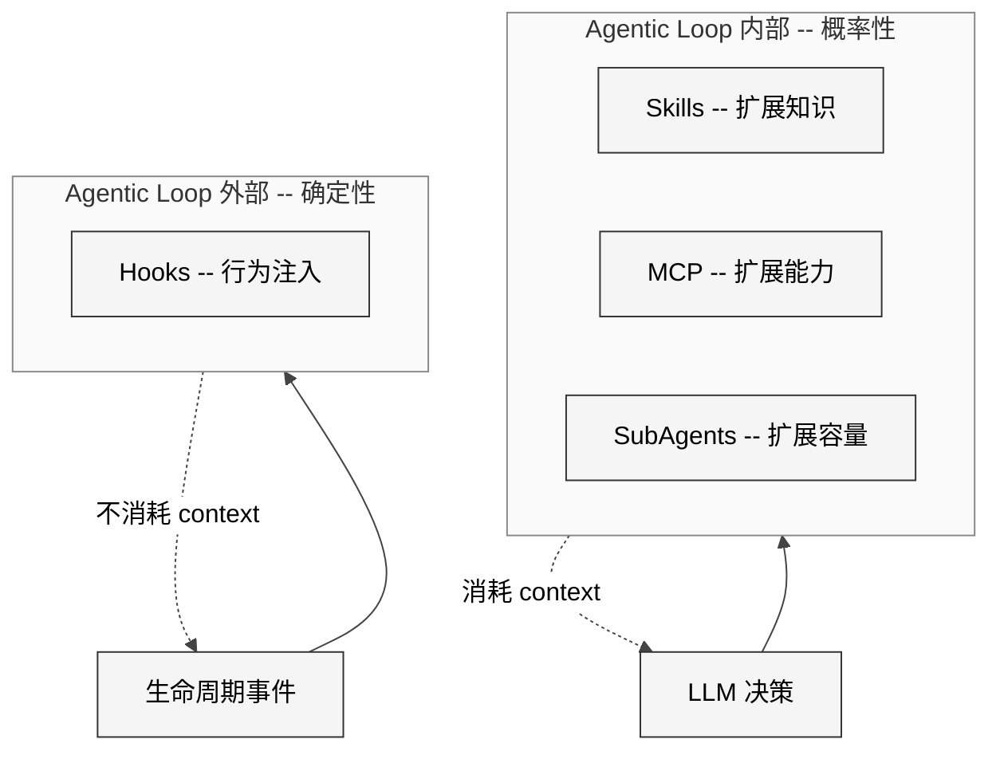
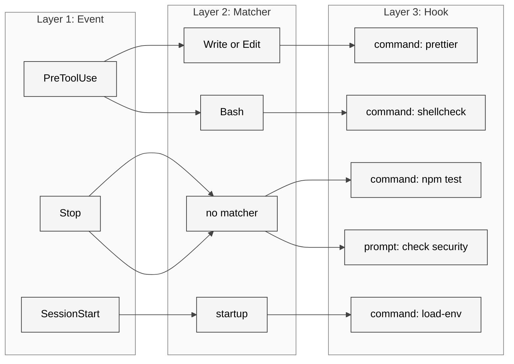
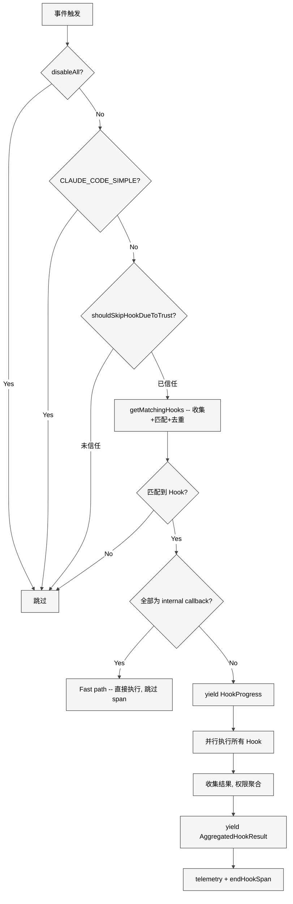
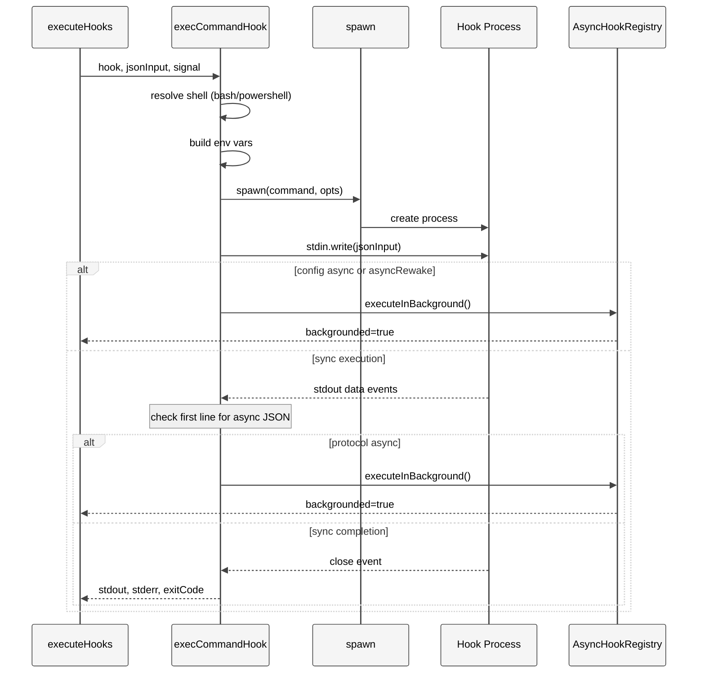
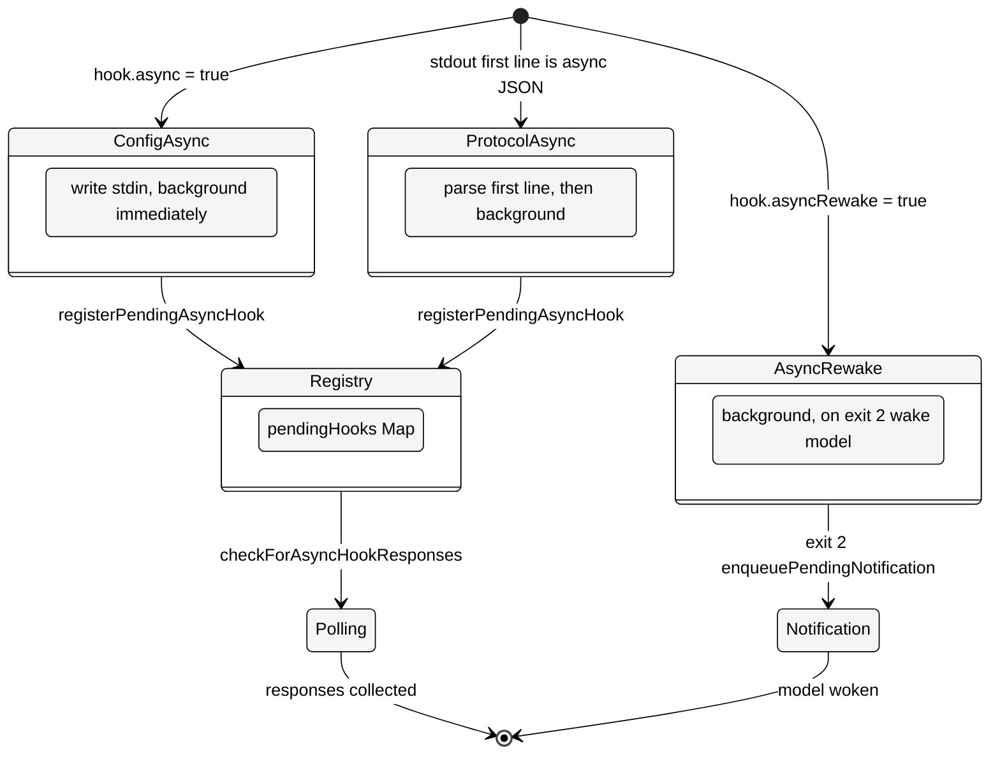
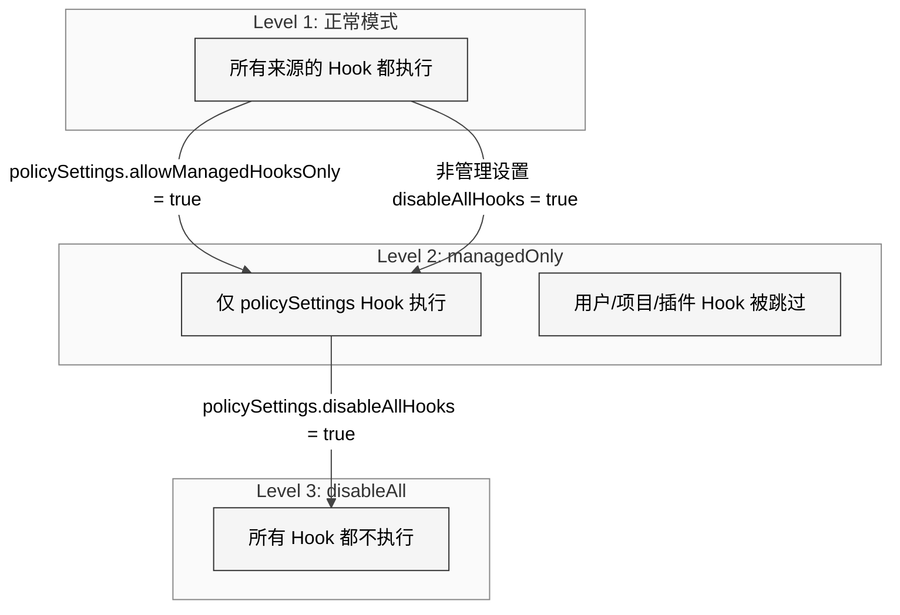

# 第 19 章 Hooks

> 核心提要：生命周期自动化与执行边界

## 18.1 定位

### 定义

Hooks 是 Claude Code 的**生命周期事件拦截框架** — 用户通过 `settings.json` 声明式配置，在 AI Agent 执行周期的 27 个节点上注入 Shell 命令、LLM 评估、Agent 验证或 HTTP 调用，实现确定性的行为扩展与安全管控。

### 位置

在 Anthropic 官方定义的四种 Claude Code 扩展机制中，Hooks 占据独特地位：

- **Skills**：扩展 Claude "知道什么"，在 agentic loop **内部**运行，受 LLM 决策控制
- **MCP**：扩展 Claude "能做什么"，在 agentic loop **内部**运行，受 LLM 决策控制
- **SubAgents**：扩展 Claude "容量"，在 agentic loop **内部**运行，受 LLM 决策控制
- **Hooks**：在 agentic loop **外部**触发，具备确定性执行入口；但 `prompt` / `agent` hook 本身仍可能调用模型

这是 Hooks 与其他三种机制的根本区别：它是唯一在 loop 外运行的确定性自动化层。当你需要"每次文件编辑后一定运行 `prettier`"时，用 Skill 或 MCP 都有概率性风险（LLM 可能忘了调用），但 Hooks 保证执行。

<div style="background: #ffffff; padding: 16px; border-radius: 8px; margin: 16px 0;">



</div>

### 代码规模

Hooks 子系统横跨 19 个文件，总计 **9,255 行 TypeScript**：

| 文件 | 行数 | 核心职责 |
|------|------|---------|
| `src/utils/hooks.ts` | 5,022 | 主引擎：事件触发、匹配、执行、结果聚合 |
| `src/utils/hooks/sessionHooks.ts` | 447 | Session 级动态 Hook 注册（Map 数据结构） |
| `src/utils/hooks/hooksConfigManager.ts` | 400 | UI 层 Hook 配置分组与展示 |
| `src/utils/hooks/execAgentHook.ts` | 339 | Agent Hook 执行器（多轮 query） |
| `src/utils/hooks/AsyncHookRegistry.ts` | 309 | 异步 Hook 全局注册表 |
| `src/utils/hooks/ssrfGuard.ts` | 294 | HTTP Hook 的 SSRF 防护 |
| `src/utils/hooks/hooksSettings.ts` | 271 | Hook 配置解析与展示工具 |
| `src/utils/hooks/skillImprovement.ts` | 267 | Skill 自动改进（实验性） |
| `src/utils/hooks/execHttpHook.ts` | 242 | HTTP Hook 执行器 |
| `src/utils/hooks/execPromptHook.ts` | 211 | Prompt Hook 执行器（LLM 评估） |
| `src/utils/hooks/hookEvents.ts` | 192 | Hook 事件广播系统 |
| `src/utils/hooks/fileChangedWatcher.ts` | 191 | 文件变更监视器（chokidar） |
| `src/utils/hooks/hooksConfigSnapshot.ts` | 133 | 快照隔离与三级管控 |
| `src/schemas/hooks.ts` | 222 | Zod Schema 定义 |
| `src/types/hooks.ts` | 290 | TypeScript 类型与 SDK 类型断言 |
| 其他 4 个辅助文件 | ~425 | hookHelpers, postSamplingHooks, registerFrontmatter/SkillHooks, apiQueryHookHelper |

### 结构

本章首先剖析 27 个事件类型的完整分类，然后深入三层配置模型的 Schema 设计，接着追踪从事件触发到结果收集的完整执行链路（含异步模式、Prompt Elicitation 协议、权限决策聚合），再分析安全边界的三级管控策略和 SSRF 防护，最后与竞品对比并指出现存问题。

---

## 18.2 架构

### 18.2.1 事件类型全景：27 个生命周期节点

Claude Code 在 `src/entrypoints/sdk/coreSchemas.ts` L355-L383 定义了 27 个事件类型，以 `as const` 数组声明：

```typescript
export const HOOK_EVENTS = [
  'PreToolUse',         'PostToolUse',        'PostToolUseFailure',
  'Notification',       'UserPromptSubmit',   'SessionStart',
  'SessionEnd',         'Stop',               'StopFailure',
  'SubagentStart',      'SubagentStop',       'PreCompact',
  'PostCompact',        'PermissionRequest',  'PermissionDenied',
  'Setup',              'TeammateIdle',       'TaskCreated',
  'TaskCompleted',      'Elicitation',        'ElicitationResult',
  'ConfigChange',       'WorktreeCreate',     'WorktreeRemove',
  'InstructionsLoaded', 'CwdChanged',         'FileChanged',
] as const
```

这 27 个事件按功能域可分为七大类：

| 类别 | 事件 | 典型用途 |
|------|------|---------|
| **工具生命周期** | `PreToolUse`, `PostToolUse`, `PostToolUseFailure` | 拦截/审计/增强工具调用，自动格式化 |
| **会话生命周期** | `SessionStart`, `SessionEnd`, `Setup`, `Stop`, `StopFailure`, `UserPromptSubmit` | 环境初始化、清理、验证、通知 |
| **权限与安全** | `PermissionRequest`, `PermissionDenied` | 自定义权限决策、自动重试 |
| **Agent 协作** | `SubagentStart`, `SubagentStop`, `TeammateIdle`, `TaskCreated`, `TaskCompleted` | 多 Agent 编排、任务管控 |
| **上下文管理** | `PreCompact`, `PostCompact`, `Notification` | 压缩前注入自定义指令、通知路由 |
| **环境感知** | `ConfigChange`, `CwdChanged`, `FileChanged`, `InstructionsLoaded` | 响应外部变化、动态环境变量 |
| **隔离与 MCP** | `WorktreeCreate`, `WorktreeRemove`, `Elicitation`, `ElicitationResult` | VCS 无关隔离、MCP elicitation 拦截 |

**与 Source Study 参考的交叉验证**：参考文档称"27 个事件类型"与源码一致。源码中 `hooksConfigManager.ts` L274-L302 的 `groupHooksByEventAndMatcher` 函数枚举了全部 27 个事件键名，进一步确认。

每个事件有不同的 **matcher 语义**。在 `getMatchingHooks()` 函数（`hooks.ts` L1616-L1670）中，switch 分支根据事件类型选择不同的 matchQuery 来源：

```typescript
switch (hookInput.hook_event_name) {
  case 'PreToolUse':
  case 'PostToolUse':
  case 'PostToolUseFailure':
  case 'PermissionRequest':
  case 'PermissionDenied':
    matchQuery = hookInput.tool_name       // 匹配工具名
    break
  case 'SessionStart':
    matchQuery = hookInput.source          // startup|resume|clear|compact
    break
  case 'FileChanged':
    matchQuery = basename(hookInput.file_path) // 匹配文件名
    break
  // ...
}
```

由此可见同一个 `matcher: "Write|Edit"` 在 PreToolUse 事件中匹配工具名，但这个 matcher 在 SessionStart 事件中匹配的是 `source` 字段（`startup`/`resume` 等）。**Matcher 的语义由事件类型决定，而非全局统一** — 这是一个容易被忽视的设计要点。

### 18.2.2 三层配置模型：Event - Matcher - Hook

Hooks 的配置通过 `settings.json` 声明，采用 Event → Matcher → Hook 的三层嵌套结构。

<div style="background: #ffffff; padding: 16px; border-radius: 8px; margin: 16px 0;">



</div>

Zod Schema 定义在 `src/schemas/hooks.ts` L194-L213：

```typescript
export const HookMatcherSchema = lazySchema(() =>
  z.object({
    matcher: z.string().optional()
      .describe('String pattern to match (e.g. tool names like "Write")'),
    hooks: z.array(HookCommandSchema())
      .describe('List of hooks to execute when the matcher matches'),
  }),
)

export const HooksSchema = lazySchema(() =>
  z.partialRecord(z.enum(HOOK_EVENTS), z.array(HookMatcherSchema())),
)
```

**设计决策分析**：使用 `z.partialRecord` 而非 `z.record` 意味着不要求定义全部 27 个事件 — 用户只需声明关心的事件。`lazySchema()` 是一个延迟求值包装器，避免模块加载时的循环依赖（Schema 文件的开头注释明确说明这一点：`schemas/hooks.ts` L1-L9 解释了从 `settings/types.ts` 抽取到此处是为了打破 settings 和 plugins 之间的循环引用）。

### 18.2.3 六种 Hook 类型

`HookCommand` 是一个 **discriminated union**，`type` 字段区分四种可持久化类型（`schemas/hooks.ts` L176-L189）：

```typescript
export const HookCommandSchema = lazySchema(() => {
  const { BashCommandHookSchema, PromptHookSchema, AgentHookSchema, HttpHookSchema } = buildHookSchemas()
  return z.discriminatedUnion('type', [
    BashCommandHookSchema,   // type: 'command'
    PromptHookSchema,        // type: 'prompt'
    AgentHookSchema,         // type: 'agent'
    HttpHookSchema,          // type: 'http'
  ])
})
```

加上两种内存级类型，共六种：

| 类型 | 持久化 | 执行方式 | 典型场景 |
|------|--------|---------|---------|
| `command` | settings.json | `spawn()` Shell 进程 | lint/test/格式化脚本 |
| `prompt` | settings.json | 调用小模型（默认 Haiku）评估 | "检查代码安全性" |
| `agent` | settings.json | 启动多轮 Agent 对话 | "验证单元测试通过" |
| `http` | settings.json | HTTP POST | 外部审批/CI 系统 |
| `callback` | 内存 | TypeScript 回调 | SDK 注册、文件访问追踪、commit attribution |
| `function` | 内存 | TypeScript 回调（Session 级） | 结构化输出强制校验 |

**`callback` 和 `function` 的区别是什么？** 来自 `sessionHooks.ts` 的类型定义揭示了答案：`callback` 通过 `bootstrap/state.ts` 的 `getRegisteredHooks()` 全局注册，生命周期跟随进程；`function` 通过 `addFunctionHook()` 注册到 `AppState.sessionHooks` 这个 Map 中，生命周期跟随 Agent Session。`function` 类型的典型用法是 `registerStructuredOutputEnforcement()`（`hookHelpers.ts` L70-L83）— 为 Agent Hook 注册一个 Stop 钩子，强制 Agent 必须调用 `SyntheticOutputTool` 返回结构化结果。

### 18.2.4 Matcher 匹配逻辑

`matchesPattern()` 函数（`hooks.ts` L1346-L1381）支持三种渐进模式：

```typescript
function matchesPattern(matchQuery: string, matcher: string): boolean {
  if (!matcher || matcher === '*') {
    return true  // 空或 * 匹配一切
  }
  if (/^[a-zA-Z0-9_|]+$/.test(matcher)) {
    if (matcher.includes('|')) {
      const patterns = matcher.split('|').map(p => normalizeLegacyToolName(p.trim()))
      return patterns.includes(matchQuery)
    }
    return matchQuery === normalizeLegacyToolName(matcher)
  }
  try {
    const regex = new RegExp(matcher)
    if (regex.test(matchQuery)) return true
    for (const legacyName of getLegacyToolNames(matchQuery)) {
      if (regex.test(legacyName)) return true
    }
    return false
  } catch { return false }
}
```

三个关键设计点值得注意：

1. **精确匹配优先**：只有当 matcher 包含正则特殊字符时才进入正则路径，避免了 `"Write"` 被意外当作正则解析
2. **Legacy 工具名兼容**：通过 `normalizeLegacyToolName()` 和 `getLegacyToolNames()` 双向兼容旧工具名（如 `Task` → `TodoWrite`），保证用户升级后旧配置不失效
3. **正则失败静默降级**：无效正则不抛异常，仅记录日志并返回 false — 防御性设计

此外，`if` 条件字段（`schemas/hooks.ts` L19-L27）提供更细粒度的过滤：`"Bash(git *)"` 使用权限规则语法，只匹配 git 命令。`prepareIfConditionMatcher()`（`hooks.ts` L1390-L1421）预计算匹配器，避免为每个 Hook 重复解析。

---

## 18.3 实现

### 18.3.1 核心执行链路

整个 Hook 执行由 `executeHooks()` AsyncGenerator 驱动（`hooks.ts` L1952-L2972），这是一个约 1,020 行的核心函数。完整链路如下：

<div style="background: #ffffff; padding: 16px; border-radius: 8px; margin: 16px 0;">



</div>

**Fast path 优化**（`hooks.ts` L2036-L2067）是一个精妙的性能设计：当所有匹配的 Hook 都是 internal callback（如文件访问追踪的 `sessionFileAccessHooks`、commit attribution 的 `attributionHooks`）时，跳过 span 创建、进度消息、JSON 序列化和 telemetry 上报。源码注释明确标注了测量结果："Measured: 6.01us -> ~1.8us per PostToolUse hit (-70%)"。这在 PostToolUse 这种高频事件上累积效果显著。

### 18.3.2 Hook 配置的三路合并

`getHooksConfig()` 函数（`hooks.ts` L1492-L1566）从三个来源合并 Hook 配置：

**来源 1 — Settings 快照**（`hooksConfigSnapshot.ts` L95-L97）：

```typescript
export function captureHooksConfigSnapshot(): void {
  initialHooksConfig = getHooksFromAllowedSources()
}
```

`getHooksFromAllowedSources()` 内部实现了复杂的策略层级（`hooksConfigSnapshot.ts` L18-L53）：先检查 `policySettings.disableAllHooks`（完全禁用），再检查 `allowManagedHooksOnly`（仅管理策略 Hook），然后检查 `isRestrictedToPluginOnly('hooks')`（严格插件模式），最后回退到全量合并。

**来源 2 — 注册 Hook**：通过 `getRegisteredHooks()` 获取 SDK callback 和 Plugin 原生 Hook。当 `managedOnly` 为 true 时，带 `pluginRoot` 的 Hook 被跳过。

**来源 3 — Session Hook**（`hooks.ts` L1541-L1563）：Agent 和 Skill 通过 frontmatter 注册的运行时 Hook。

Session Hook 使用 `Map<string, SessionStore>` 数据结构（`sessionHooks.ts` L48-L62），源码注释详细解释了设计理由：

> Map (not Record) so .set/.delete don't change the container's identity. Mutator functions mutate the Map and return prev unchanged, letting store.ts's Object.is(next, prev) check short-circuit and skip listener notification. Session hooks are ephemeral per-agent runtime callbacks, never reactively read (only getAppState() snapshots in the query loop). Same pattern as agentControllers on LocalWorkflowTaskState.
>
> This matters under high-concurrency workflows: parallel() with N schema-mode agents fires N addFunctionHook calls in one synchronous tick. With a Record + spread, each call cost O(N) to copy the growing map (O(N^2) total) plus fired all ~30 store listeners. With Map: .set() is O(1), return prev means zero listener fires.

这段注释揭示了一个真实的性能问题及其解决思路：在并行 Agent 场景下，N 个 Agent 同时注册 Hook，如果使用 Record + spread 模式，每次注册的时间复杂度是 O(N)（复制整个对象），总复杂度 O(N^2)，且每次触发约 30 个 store listener。改用 Map 后，`.set()` 是 O(1)，且由于 `prev` 引用不变，`Object.is()` 短路跳过所有 listener 通知。

### 18.3.3 去重与 if 条件过滤

去重逻辑（`hooks.ts` L1712-L1806）按来源命名空间隔离：

```typescript
function hookDedupKey(m: MatchedHook, payload: string): string {
  return `${m.pluginRoot ?? m.skillRoot ?? ''}\0${payload}`
}
```

去重键使用 NUL 字符 (`\0`) 作为分隔符（不会出现在路径或命令中），用 `pluginRoot` 或 `skillRoot` 作为命名空间前缀。由此可见：

- 同一 Plugin 的相同命令模板被合并为一个
- 不同 Plugin 的相同模板 `${CLAUDE_PLUGIN_ROOT}/hook.sh` 不会合并（展开后指向不同文件）
- Settings 文件中用户/项目/本地三级的重复命令只保留最后一个（`new Map(entries)` 保留最后值）

**性能优化**：当所有 Hook 都是 callback 或 function 类型时，完全跳过去重逻辑（`hooks.ts` L1723-L1729）。注释标注 "44x faster in microbench" — 因为跳过了 6 轮 filter + 4 个 Map 构造 + 4 个 `Array.from` 调用。

Shell 类型也参与去重键计算（`hooks.ts` L1744-L1748）：`{command:'echo x', shell:'bash'}` 和 `{command:'echo x', shell:'powershell'}` 被视为两个不同的 Hook。

### 18.3.4 Shell 命令执行器

`execCommandHook()`（`hooks.ts` L747-L1335）是整个系统中最复杂的函数，约 590 行。它处理跨平台 Shell 差异、异步后台化、Prompt Elicitation 协议和超时控制。

<div style="background: #ffffff; padding: 16px; border-radius: 8px; margin: 16px 0;">



</div>

**跨平台 Shell 适配**（`hooks.ts` L790-L984）：

- **Bash 路径**：Windows 上使用 Git Bash（非 cmd.exe），所有路径通过 `windowsPathToPosixPath()` 转换（`C:\Users\foo` → `/c/Users/foo`）；非 Windows 上 `shell: true` 实际使用 `/bin/sh`（注释 L975 明确指出），因此 Hook 命令应使用 POSIX shell 语法
- **PowerShell 路径**：使用 `getCachedPowerShellPath()` 定位 pwsh 可执行文件，以 `-NoProfile -NonInteractive -Command` 参数启动，跳过所有 bash 特定处理（路径转换、`.sh` 自动前缀、`CLAUDE_CODE_SHELL_PREFIX`）

**环境变量注入**（`hooks.ts` L882-L926）：每个 Hook 进程接收精心准备的环境变量，包括 `CLAUDE_PROJECT_DIR`（始终指向真实项目根目录，不受 worktree 切换影响）。Plugin Hook 额外获得 `CLAUDE_PLUGIN_ROOT`、`CLAUDE_PLUGIN_DATA`、以及所有 plugin 选项的 `CLAUDE_PLUGIN_OPTION_*` 变量。

**`CLAUDE_ENV_FILE` 机制**：SessionStart/Setup/CwdChanged/FileChanged 四种事件的 Hook 获得一个特殊的 `CLAUDE_ENV_FILE` 路径。Hook 可以向这个文件写入 `export VAR=value` 格式的环境变量定义，后续的 BashTool 命令会自动加载这些变量。这让 SessionStart Hook 可以为整个会话动态配置环境。

**Exit Code 语义**：

| Exit Code | 含义 | 处理方式 |
|-----------|------|---------|
| 0 | 成功 | stdout 作为成功消息（`hooks.ts` L2617-L2644） |
| 2 | 阻塞性错误 | stderr 反馈给模型，**阻止操作继续**（`hooks.ts` L2648-L2668） |
| 其他 | 非阻塞性错误 | stderr 展示给用户，操作继续（`hooks.ts` L2670-L2697） |

Exit code 2 的设计尤其巧妙 — 它让 Hook 可以阻止 AI 操作并给出反馈。例如，一个 PreToolUse Hook 对 Write 操作返回 exit 2 + stderr 内容"文件不符合 lint 规则"，AI 会收到错误消息并调整行为。选择 2 而非 1 的原因是：1 是最常见的通用错误码（脚本 bug、命令找不到等），用 2 作为"有意阻止"的语义码，可以区分"脚本出了 bug"和"脚本有意拒绝"。

### 18.3.5 JSON 输出协议

当 Hook 的 stdout 以 `{` 开头时，系统尝试解析为结构化 JSON 响应。`parseHookOutput()`（`hooks.ts` L399-L451）的解析策略很保守：

```typescript
function parseHookOutput(stdout: string) {
  const trimmed = stdout.trim()
  if (!trimmed.startsWith('{')) {
    return { plainText: stdout }  // 不以 { 开头 -> 纯文本
  }
  try {
    const result = validateHookJson(trimmed)
    if ('json' in result) return result
    return { plainText: stdout, validationError: result.validationError }
  } catch (e) {
    return { plainText: stdout }
  }
}
```

JSON 失败时回退到纯文本 — 这保证了"任何输出纯文本的脚本都能正常工作"，降低了迁移成本。

`syncHookResponseSchema`（`types/hooks.ts` L50-L166）定义了丰富的结构化输出字段，根据 `hookSpecificOutput.hookEventName` 提供不同事件的专用字段。其中最强大的是：

- **`updatedInput`**（PreToolUse）：修改工具的输入参数，实现输入改写
- **`permissionDecision`**（PreToolUse）：做出 allow/deny/ask 权限决策
- **`updatedMCPToolOutput`**（PostToolUse）：替换 MCP 工具的输出
- **`watchPaths`**（SessionStart/CwdChanged/FileChanged）：动态注册文件监视路径
- **`initialUserMessage`**（SessionStart）：注入初始用户消息

### 18.3.6 异步 Hook：三种模式

<div style="background: #ffffff; padding: 16px; border-radius: 8px; margin: 16px 0;">



</div>

**模式 1 — 配置级异步**（`hooks.ts` L995-L1030）：`hook.async = true` 时，写入 stdin 后立即后台化。

**模式 2 — 协议级异步**（`hooks.ts` L1112-L1164）：Hook 运行时在 stdout 第一行输出 `{"async": true}`，系统检测到后自动后台化。关键实现细节：只解析 **第一行**（通过 `firstLineOf()` 提取），而非整个 stdout — 注释明确解释原因："if the process is fast and writes more before this 'data' event fires, parsing the full accumulated stdout fails and an async hook blocks for its full duration instead of backgrounding"。

**模式 3 — asyncRewake**（`hooks.ts` L205-L246）：后台运行，如果以 exit code 2 退出，通过 `enqueuePendingNotification()` 唤醒模型。注释揭示了一个关键技术决策：**不调用 `shellCommand.background()`**，因为 background 会调用 `taskOutput.spillToDisk()`，破坏内存中的 stdout/stderr 捕获（`getStderr()` 在 disk 模式下返回空字符串）。

`AsyncHookRegistry`（`AsyncHookRegistry.ts`）是一个基于 `Map<string, PendingAsyncHook>` 的全局注册表。`checkForAsyncHookResponses()`（L113-L268）使用 `Promise.allSettled()` 而非 `Promise.all()`，确保一个 Hook 的失败不影响其他 Hook 的结果收集。这是教科书级的隔离故障处理。

### 18.3.7 Prompt Hook 与 Agent Hook

**Prompt Hook**（`execPromptHook.ts`）用小模型评估条件。核心实现：

```typescript
const response = await queryModelWithoutStreaming({
  messages: messagesToQuery,
  systemPrompt: asSystemPrompt([
    `You are evaluating a hook in Claude Code.
Your response must be a JSON object matching one of the following schemas:
1. If the condition is met, return: {"ok": true}
2. If the condition is not met, return: {"ok": false, "reason": "..."}`,
  ]),
  thinkingConfig: { type: 'disabled' as const },
  options: {
    model: hook.model ?? getSmallFastModel(),
    outputFormat: {
      type: 'json_schema',
      schema: { /* ok: boolean, reason: string */ },
    },
  },
})
```

设计要点：禁用 thinking 减少延迟；使用 `json_schema` 结构化输出确保可解析；默认使用 `getSmallFastModel()`（当前为 Haiku）但允许通过 `hook.model` 指定任意模型。

**Agent Hook**（`execAgentHook.ts`）更进一步 — 启动一个完整的多轮 `query()` 对话。Agent 可以调用工具来验证条件（读文件、运行测试等），最多执行 50 轮（`MAX_AGENT_TURNS = 50`，L119）。它通过 `registerStructuredOutputEnforcement()` 注册一个 Function Hook，强制 Agent 必须调用 `SyntheticOutputTool` 返回结构化结果。

Agent Hook 的一个精妙设计是权限配置（`execAgentHook.ts` L137-L153）：它自动为 Agent 添加读取 transcript 文件的 session 级权限规则（`Read(/<transcriptPath>)`），让 Agent 可以回读会话历史来验证条件，同时设置 `mode: 'dontAsk'` 防止权限弹窗阻塞自动化流程。

### 18.3.8 HTTP Hook 与 SSRF 防护

HTTP Hook（`execHttpHook.ts`）通过 axios POST 发送 Hook 输入 JSON 到指定 URL。安全防护层级：

1. **URL Allowlist**（L135-L145）：策略 `allowedHttpHookUrls` 控制，undefined 不限制，`[]` 阻止所有，非空必须匹配
2. **环境变量白名单**（L89-L108）：Header 中的 `$VAR_NAME` 只解析 `allowedEnvVars` 中列出的变量，其他替换为空字符串
3. **CRLF 注入防护**（L76-L79）：`sanitizeHeaderValue()` 剥离 `\r\n\x00` 防止 HTTP header 注入
4. **SSRF Guard**（`ssrfGuard.ts`）：阻止私有/链路本地地址（10.0.0.0/8, 169.254.0.0/16, 172.16.0.0/12, 192.168.0.0/16），但允许 loopback（127.0.0.0/8）— 因为本地开发策略服务器是 HTTP Hook 的主要用例
5. **Sandbox Proxy**（L189-L217）：当沙箱启用时，通过沙箱网络代理路由，代理执行自己的域名白名单检查

`ssrfGuard.ts` 的 IPv6 处理（L88-L204）特别值得注意：它不仅检查 `fc00::/7`（unique local）和 `fe80::/10`（link-local），还正确处理 IPv4-mapped IPv6 地址（`::ffff:169.254.169.254`），通过 `expandIPv6Groups()` 将所有 IPv6 地址规范化为 8 个 hex group 后再提取嵌入的 IPv4 地址。这防止了攻击者用 hex 编码绕过 IPv4 检查。

### 18.3.9 权限决策聚合

PreToolUse Hook 可以做出权限决策，聚合逻辑在 `hooks.ts` L2820-L2847：

```typescript
switch (result.permissionBehavior) {
  case 'deny':
    permissionBehavior = 'deny'       // deny 始终优先
    break
  case 'ask':
    if (permissionBehavior !== 'deny') {
      permissionBehavior = 'ask'      // ask 次之
    }
    break
  case 'allow':
    if (!permissionBehavior) {
      permissionBehavior = 'allow'    // allow 只在无其他决策时生效
    }
    break
  case 'passthrough':
    break                             // passthrough 不参与决策
}
```

**优先级链：deny > ask > allow > passthrough**。这是"最严格决策获胜"的安全设计 — 如果任意一个 Hook 说 deny，操作一定被阻止。一个典型场景：安全团队的 policySettings Hook 返回 deny 阻止写入敏感路径，即使开发者的用户级 Hook 返回 allow 也无效。

### 18.3.10 Prompt Elicitation 协议

Shell Hook 支持运行中向用户提问（`hooks.ts` L1060-L1110）。Hook 在 stdout 输出符合 `promptRequestSchema` 的 JSON：

```json
{"prompt": "request-id-123", "message": "Which branch?", "options": [{"key": "main", "label": "main"}, {"key": "dev", "label": "develop"}]}
```

系统解析后通过 `requestPrompt` 回调向用户展示选项，用户选择后将响应写回 Hook 的 stdin：

```json
{"prompt_response": "request-id-123", "selected": "main"}
```

关键实现：prompt 请求被序列化处理（`promptChain = promptChain.then(...)`），保证响应顺序。处理过的 prompt 行被记录在 `processedPromptLines` Set 中，最终输出时被过滤掉（`hooks.ts` L1243-L1249），确保 `parseHookOutput()` 只看到最终 Hook 结果。

### 18.3.11 文件变更监视器

`fileChangedWatcher.ts` 使用 chokidar 监视文件变更，是 Hooks 系统中唯一的主动感知组件（其他 Hook 都是被动触发）：

```typescript
watcher = chokidar.watch(paths, {
  persistent: true,
  ignoreInitial: true,
  awaitWriteFinish: { stabilityThreshold: 500, pollInterval: 200 },
  ignorePermissionErrors: true,
})
```

`stabilityThreshold: 500` 意味着文件停止变化 500ms 后才触发事件 — 防止编辑器的多次保存（如 VSCode 的 auto-save + format-on-save）触发重复 Hook。

监视路径来自两个来源：静态（FileChanged matcher 中的文件名）和动态（Hook 输出的 `watchPaths`）。`updateWatchPaths()` 通过排序比较避免不必要的 watcher 重启。

---

## 18.4 细节

### 18.4.1 安全边界：三级管控

<div style="background: #ffffff; padding: 16px; border-radius: 8px; margin: 16px 0;">



</div>

关键设计：非管理设置的 `disableAllHooks` **不能**禁用管理策略 Hook — 它只是将模式升级为 managedOnly。只有 `policySettings.disableAllHooks` 才能完全禁用。这保证了企业管理员的 Hook 不会被用户配置绕过。

### 18.4.2 快照隔离与定点刷新

Hook 配置在 `setup()` 阶段被捕获为快照。`updateHooksConfigSnapshot()`（`hooksConfigSnapshot.ts` L104-L112）在刷新前先调用 `resetSettingsCache()` — 注释详细解释原因：

> Without this, the snapshot could use stale cached settings when the user edits settings.json externally and then runs /hooks — the session cache may not have been invalidated yet (e.g., if the file watcher's stability threshold hasn't elapsed).

刷新时机：进入 worktree 后重新读取、退出 worktree 时恢复、设置文件变更时同步。这种"快照 + 定点刷新"防止了 mid-session 的随意配置注入。

### 18.4.3 Workspace Trust 集中式防御

`shouldSkipHookDueToTrust()`（`hooks.ts` L267-L296）的注释记录了两个历史漏洞：

> Historical vulnerabilities that prompted this check:
> - SessionEnd hooks executing when user declines trust dialog
> - SubagentStop hooks executing when subagent completes before trust

当前设计采用集中式防御：交互模式下所有 Hook 无条件要求 workspace trust。非交互模式（SDK）下信任是隐式的（调用者是程序化 API，不存在用户确认环节）。

### 18.4.4 CWD 安全性

`execCommandHook()` 中有一个防御性 CWD 检查（`hooks.ts` L928-L938）：

```typescript
const hookCwd = getCwd()
const safeCwd = (await pathExists(hookCwd)) ? hookCwd : getOriginalCwd()
```

当 Agent worktree 被删除后，`getCwd()` 可能通过 `AsyncLocalStorage` 返回已删除的路径。直接用这个路径 `spawn()` 会产生异步 'error' 事件而非同步异常，导致难以调试。源码注释明确解释："spawn() emits async 'error' events for missing cwd rather than throwing synchronously"。

### 18.4.5 Plugin 目录预检

`execCommandHook()` 在 spawn 前检查 plugin 目录是否存在（`hooks.ts` L831-L836）：

```typescript
if (!(await pathExists(pluginRoot))) {
  throw new Error(
    `Plugin directory does not exist: ${pluginRoot}` +
      (pluginId ? ` (${pluginId} — run /plugin to reinstall)` : ''),
  )
}
```

注释揭示了预检的必要性："exit-2-from-missing-script is indistinguishable from an intentional block after spawn" — 如果 `python3 <missing>.py` 以 exit code 2 退出，系统会将其误判为有意阻止操作，导致 UserPromptSubmit/Stop 被永久阻塞直到重启。

### 18.4.6 stdin 换行符问题

一个微小但重要的细节（`hooks.ts` L1006）：stdin 写入时附加换行符 `jsonInput + '\n'`。注释引用了具体的 issue 编号：

> Without it, bash `read -r line` returns exit 1 (EOF before delimiter) — the variable IS populated but `if read -r line; then ...` skips the branch. See gh-30509 / CC-161.

这揭示了一个跨系统交互的 bug：bash 的 `read` 命令在 EOF 前没有换行符时虽然能读到数据，但返回非零退出码，导致常见的 `if read` 模式失败。

### 18.4.7 已知 TODO 和缺陷

源码中有 4 个 TODO 标记：

1. **`hooks.ts` L1193** — `TODO: Add tests for EPIPE handling.` — EPIPE 处理（Hook 进程提前关闭 stdin）缺乏测试覆盖。注释说明 "Bun and Node have different behaviors"，暗示跨运行时兼容性问题
2. **`hooks.ts` L3152** — `TODO: Implement prompt stop hooks outside REPL` — Prompt Hook 在非 REPL 模式下未实现
3. **`hooks.ts` L3162** — `TODO: Implement agent stop hooks outside REPL` — Agent Hook 在非 REPL 模式下未实现
4. **`hooksSettings.ts` L179** — `TODO: Get the actual plugin hook file paths instead of using glob pattern` — Plugin Hook 的文件路径展示使用了 glob 模式而非精确路径

此外，`schemas/hooks.ts` L80 有一个 `@[MODEL LAUNCH]` 标记：每次发布新模型时需要更新 `.describe()` 中的示例模型 ID — 这是一个容易遗忘的手动步骤。

`schemas/hooks.ts` L130-L137 的 AgentHookSchema 注释记录了一个被修复的 bug（gh-24920, CC-79）：之前对 `prompt` 字段使用了 `.transform()`，导致 `parseSettingsFile` 往返序列化时丢失 prompt 内容。这个 bug 的根因是 JSON.stringify 会静默丢弃函数值。

---

## 18.5 比较

### 18.5.1 AI Agent 产品的 Hook 机制对比

| 维度 | Claude Code | Cursor | GitHub Copilot | Aider | Cline |
|------|-------------|--------|---------------|-------|-------|
| 事件类型数 | 27 | 有限（自定义 Rules） | 无 Hook 系统 | 无 Hook 系统 | 无 Hook 系统 |
| Hook 类型 | 6 种（command/prompt/agent/http/callback/function） | Rules 文件 | N/A | N/A | N/A |
| 异步执行 | 3 种模式（config/protocol/rewake） | N/A | N/A | N/A | N/A |
| 权限决策 | allow/deny/ask 三级聚合 | N/A | N/A | N/A | N/A |
| 工具输入改写 | updatedInput | N/A | N/A | N/A | N/A |
| 安全管控 | 三级（normal/managedOnly/disableAll） | 基础 | N/A | N/A | N/A |
| SSRF 防护 | 完整（IPv4/IPv6/mapped） | N/A | N/A | N/A | N/A |
| 文件监视 | chokidar 集成 | 编辑器级 | N/A | N/A | N/A |

**核心差异分析**：

Claude Code 的 Hooks 系统在 AI Agent 领域几乎没有直接竞品。Cursor 的 Rules 系统本质上是提示词注入（影响 LLM 行为），而非确定性的生命周期拦截。GitHub Copilot 和 Aider 完全没有类似机制。

这与 Claude Code 的产品定位有关：它不仅是一个编码助手，而是一个 **Agent Operating System**。Hooks 对标的不是其他 AI 编码工具，而是传统的 **CI/CD Pipeline** 和 **Git Hooks** — 它们同样提供生命周期事件上的确定性脚本执行。Claude Code 的创新在于：将这种范式从代码提交周期扩展到了 **AI Agent 的执行周期**。

### 18.5.2 与传统 Hook 系统的对比

| 维度 | Claude Code Hooks | Git Hooks | Webpack Plugins | React Hooks |
|------|------------------|-----------|-----------------|-------------|
| 触发源 | AI Agent 执行事件 | VCS 操作 | 构建事件 | 组件生命周期 |
| 执行模型 | 并行 + 结果聚合 | 串行 | 串行/并行混合 | 同步 |
| 阻止能力 | exit 2 或 JSON | 非零退出码 | 抛异常 | N/A |
| 输入修改 | updatedInput | N/A | 修改 AST | setState |
| 远程执行 | HTTP Hook | N/A | N/A | N/A |
| AI 评估 | Prompt/Agent Hook | N/A | N/A | N/A |

Claude Code Hooks 相比传统方案的独特创新：

1. **Prompt Hook**：用 LLM 评估条件，打破了"脚本只能做确定性检查"的限制
2. **Agent Hook**：多轮工具调用验证，能执行"跑测试并检查结果"这类复杂验证
3. **asyncRewake 模式**：后台执行 + 唤醒模型，实现了"不阻塞但有反馈"的异步模型
4. **权限决策聚合**：多个 Hook 的权限决策按优先级合并，支持多团队协作的安全策略

### 18.5.3 优势与局限

**优势**：

- **覆盖面完整**：27 个事件覆盖了 Agent 交互的几乎所有节点
- **类型丰富**：6 种 Hook 类型从简单脚本到完整 Agent，适配不同复杂度
- **安全管控精密**：三级开关 + 权限聚合 + SSRF 防护 + Trust 检查
- **性能优化到位**：Fast path、去重跳过、Map vs Record 等微优化累积显著

**局限**：

- **没有条件组合**：`if` 条件只支持单一工具名模式，不能表达 AND/OR 组合
- **没有 Hook 间通信**：多个 Hook 并行执行但不能共享状态
- **Prompt/Agent Hook 仅限 REPL**：TODO 标记显示非 REPL 模式下这两类 Hook 未实现
- **SessionEnd 超时极短**：默认 1500ms（`hooks.ts` L175），复杂清理脚本可能超时

---

## 18.6 辨误

### 误解 1："Hooks 等同于 Git Hooks"

虽然 Claude Code Hooks 借鉴了 Git Hooks 的概念模型（生命周期事件 + 脚本执行），但它们在执行模型上有本质区别：

- **Git Hooks 串行执行**，Claude Code Hooks **并行执行**
- **Git Hooks 没有结构化输出**，Claude Code Hooks 有完整的 JSON 输出协议
- **Git Hooks 不能修改操作输入**，Claude Code Hooks 的 `updatedInput` 可以改写工具参数
- **Git Hooks 没有 LLM 评估**，Claude Code Hooks 的 Prompt/Agent 类型用 AI 验证条件

### 误解 2："Hooks 只是简单的 Shell 命令"

这忽略了系统的丰富性。六种 Hook 类型中，Shell 命令只是最基础的一种。Prompt Hook 用 LLM 做语义级检查，Agent Hook 启动完整的多轮对话，HTTP Hook 对接外部服务，Function Hook 用 TypeScript 回调做结构化验证。更重要的是，Shell Hook 本身也不简单 — 它支持异步三模式、Prompt Elicitation 协议、JSON 结构化输出、环境变量文件注入等高级能力。

### 误解 3："配置 Hooks 不安全，因为 .claude/settings.json 可以被恶意修改"

Claude Code 的防御设计对此有系统性应对：

1. **Workspace Trust**：交互模式下所有 Hook 执行前必须通过信任对话框
2. **快照隔离**：Hook 配置在 setup 阶段捕获快照，不会因 mid-session 的文件修改而实时更新
3. **三级管控**：企业管理员可以通过 `policySettings` 限制只执行管理策略 Hook
4. **SSRF Guard**：HTTP Hook 防止访问私有网络地址
5. **Plugin 目录预检**：防止通过删除 plugin 目录触发 exit 2 阻塞

### 误解 4："Hooks 会增加每次工具调用的延迟"

对于没有配置 Hook 的事件，开销几乎为零：`hasHookForEvent()`（`hooks.ts` L1582-L1593）是一个轻量级存在性检查，只需 3 个 if 判断。对于只有 internal callback 的事件（如 PostToolUse 的文件访问追踪），Fast path 将开销控制在 1.8μs。只有用户明确配置的 Hook 才会产生 Shell spawn 或 LLM 调用的开销。

---

## 18.7 展望

### 18.7.1 已知缺陷

1. **Prompt/Agent Hook 非 REPL 缺失**：两个 TODO 标记表明这些高级 Hook 类型在 SDK 模式和命令行管道模式下不可用，限制了自动化场景的使用

2. **SessionEnd 超时过短**：默认 1500ms 对于需要清理资源、发送通知的 Hook 可能不够。虽然可通过 `CLAUDE_CODE_SESSIONEND_HOOKS_TIMEOUT_MS` 环境变量覆盖，但大多数用户不知道这个选项

3. **HTTP Hook 不支持 SessionStart/Setup**：源码注释（`hooks.ts` L1850-L1864）解释原因："In headless mode the sandbox ask callback deadlocks because the structuredInput consumer hasn't started yet when these hooks fire" — 这是一个初始化时序问题，限制了 HTTP Hook 在会话初始化阶段的使用

4. **缺少 Hook 间通信**：并行执行的 Hook 无法共享状态。如果 Hook A 的结果应该影响 Hook B 的行为，目前没有机制支持

### 18.7.2 潜在瓶颈

1. **单线程 JSON 序列化**：每次 Hook 执行都需要 `jsonStringify(hookInput)`（`hooks.ts` L2097-L2104），在 hookInput 包含大量工具输出时可能成为瓶颈。`slowOperations.ts` 的命名暗示团队已意识到 JSON 序列化的成本

2. **chokidar 的稳定性**：`fileChangedWatcher.ts` 依赖 chokidar 做文件监视，而 chokidar 在某些平台（特别是 Linux 上大量文件的场景）存在已知的可靠性问题

3. **Prompt Hook 的延迟**：每次 Prompt Hook 执行都需要一次 LLM API 调用，即使使用 Haiku，延迟也在 500ms-2s 范围。如果在 PreToolUse 等高频事件上配置 Prompt Hook，累积延迟可能影响用户体验

### 18.7.3 改进建议

1. **Hook 优先级与依赖**：允许 Hook 声明优先级和依赖关系，实现有序执行。目前的纯并行模型在某些场景下不够（如"先 lint 再 format"的顺序依赖）

2. **Hook 结果缓存**：对于幂等的 Hook（如 lint 检查），缓存结果直到相关文件变更，避免重复执行

3. **条件组合表达式**：将 `if` 字段从单一模式扩展为组合表达式（如 `"Bash(git *) AND NOT Bash(git status)"` ），减少 Hook 配置冗余

4. **WebSocket Hook 类型**：HTTP Hook 是无状态的请求-响应模型。对于需要持久连接的场景（如实时 CI 状态更新），WebSocket Hook 会更高效

5. **Skill 自动改进的产品化**：`skillImprovement.ts` 是一个实验性的 Post-Sampling Hook，通过 LLM 分析对话检测用户偏好并自动更新 Skill 文件。这个功能目前由 feature flag `SKILL_IMPROVEMENT` 和 GrowthBook 开关 `tengu_copper_panda` 双重门控，显然还在早期实验阶段。如果产品化，它将成为 Hooks 系统最有想象力的应用

---

## 18.8 小结

### 核心 Takeaway

1. **确定性是核心价值**：Hooks 是 Claude Code 四种扩展机制中唯一在 agentic loop 外部、确定性执行的机制。当你需要"一定发生"而非"LLM 可能会做"的行为时，Hooks 是唯一正确的选择

2. **六种类型覆盖完整频谱**：从 5 行的 Shell 命令到 50 轮的 Agent 对话，从本地 TypeScript 回调到远程 HTTP POST，Hooks 为不同复杂度的需求提供了对应的解决方案

3. **安全设计是 defense-in-depth**：Trust 检查、快照隔离、三级管控、权限聚合、SSRF 防护 — 每一层都不是完美的，但叠加后攻击成本极高。历史漏洞（SessionEnd/SubagentStop 绕过 Trust）被修复后成为了集中式防御的动力

4. **性能优化面向真实热点**：Fast path（-70%）、Map vs Record（O(1) vs O(N^2)）、callback 跳过去重（44x）— 这些优化都基于实际性能测量，而非猜测

5. **对 Agent 开发者的启示**：如果你在构建 AI Agent 产品，Hooks 系统展示了"如何让用户在不修改源码的情况下扩展 Agent 行为"的工程化答案。关键设计模式 — 事件驱动 + 多来源合并 + 权限聚合 + 异步后台化 — 可以直接迁移到其他 Agent 架构中
