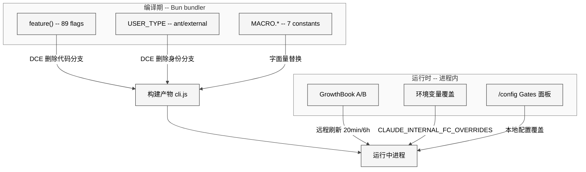
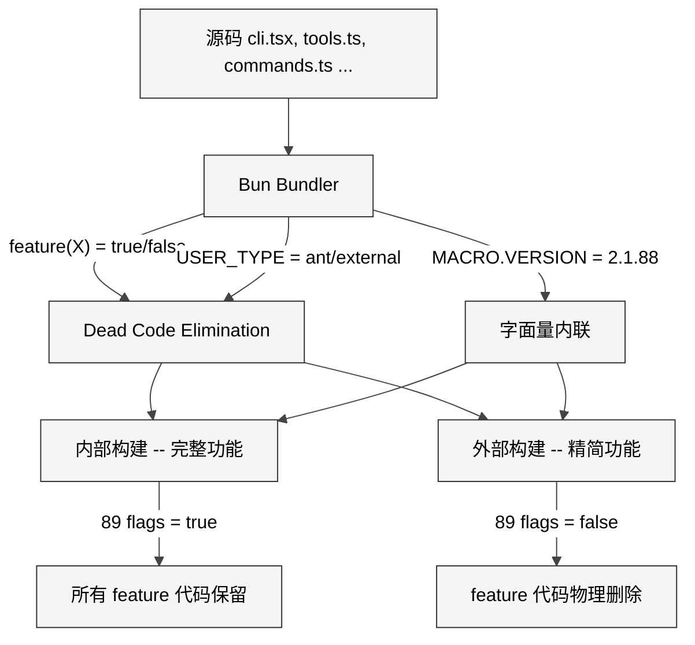
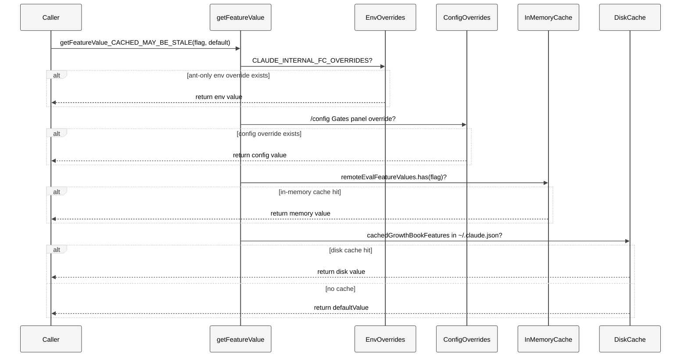
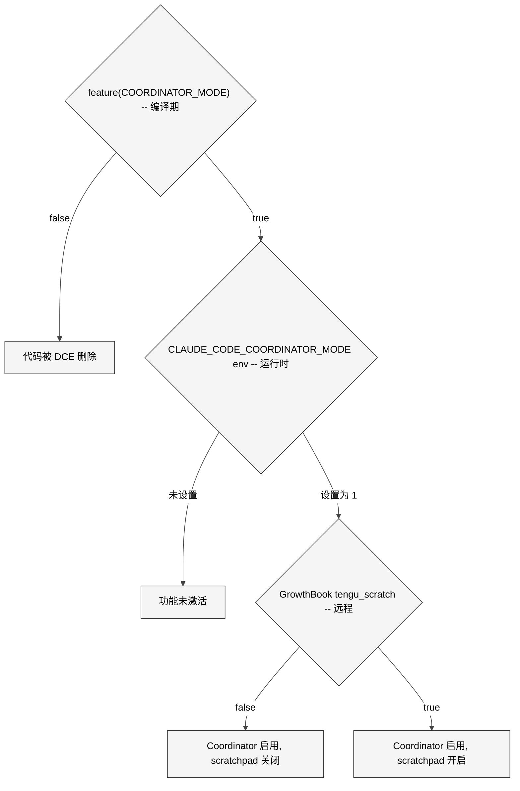
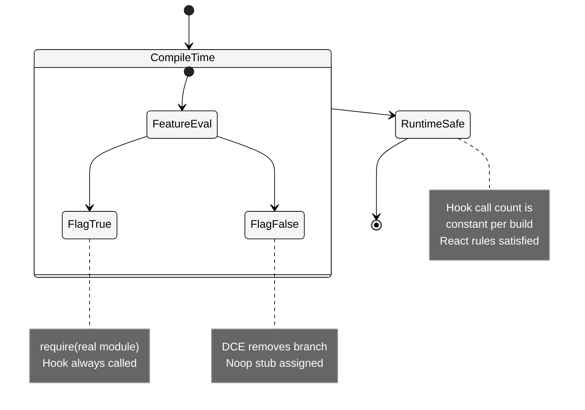
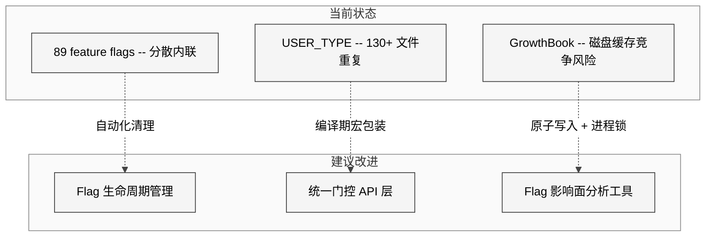

# 第 20 章 Feature Flag

> 核心提要：特性开关与构建裁剪

---

## 19.1 定位

Claude Code 既是面向全球开发者的 CLI 工具，又是 Anthropic 内部工程师每日使用的增强版——语音交互、多 Agent 编排、后台守护进程、桌面 GUI 控制等实验性功能仅在内部版本中可用。维护两个独立代码仓库的成本是不可接受的：分支漂移、合并冲突、功能回归会随代码量（513,216 行 TypeScript，1,884 文件）指数增长。

Anthropic 的解决方案是**三层 Feature Flag 体系**，在三个不同的时间维度上协同工作：

| 层级 | 机制 | 决策时机 | 产物影响 |
|------|------|---------|---------|
| 编译期功能门控 | `feature()` from `bun:bundle` | Bun 构建时 | 代码被物理删除（DCE） |
| 编译期身份门控 | `process.env.USER_TYPE` via `--define` | Bun 构建时 | 同样触发 DCE |
| 编译期常量注入 | `MACRO.*` via `--define` | Bun 构建时 | 占位符替换为具体值 |
| 运行时门控 | GrowthBook A/B 测试 | 进程运行中 | 不重启即可开关功能 |

这套体系的精妙之处在于：前两层都是**编译期机制**，但解决不同粒度的问题——`feature()` 是**功能级开关**（89 个独立 flag），`USER_TYPE` 是**身份级开关**（内部/外部二值），`MACRO.*` 是**值级注入**（7 个构建常量）。运行时的 GrowthBook 则补充了不重启进程就能开关功能的灵活性。

本章将从源码实证出发，逐层解剖这套体系的架构设计、实现细节、防御编程模式，以及它对 Agent 工程实践的启示。

<div style="background: #ffffff; padding: 16px; border-radius: 8px; margin: 16px 0;">



</div>

---

## 19.2 架构

### 19.2.1 第一层：`feature()` 编译期常量折叠与 DCE

`feature()` 是从 `bun:bundle` 导入的编译期函数（`src/entrypoints/cli.tsx:L1`）。在 Bun 构建时，它被替换为 `true` 或 `false` 字面量。当结果为 `false` 时，Bun 的 bundler 对 `if (false) { ... }` 分支执行 Dead Code Elimination（DCE），将整个分支**及其依赖模块**从产物中物理删除。

由此可见在外部构建中，被 `feature()` 关闭的代码**不存在于最终的 JS 文件中**——不是被运行时跳过，而是被完全删除。攻击者无法通过修改环境变量来启用这些功能，因为相关代码根本不在产物里。

**DCE 的核心约束**是 `feature()` 必须保持内联。源码注释明确写道：

```1:1:restored-src/src/entrypoints/cli.tsx
import { feature } from 'bun:bundle';
```

```110:111:restored-src/src/entrypoints/cli.tsx
  // feature() must stay inline for build-time dead code elimination;
  // isBridgeEnabled() checks the runtime GrowthBook gate.
```

### 19.2.2 `feature()` 搭配的两种模块加载方式

在 DCE 约束下，`feature()` 可以搭配两种模块加载方式，但**不能**使用顶层静态 `import`——ES Module 的静态 `import` 会被模块系统无条件解析，bundler 无法删除其依赖树。

**方式一：条件 `require()`** —— 用于模块顶层的条件加载：

```25:28:restored-src/src/tools.ts
const SleepTool =
  feature('PROACTIVE') || feature('KAIROS')
    ? require('./tools/SleepTool/SleepTool.js').SleepTool
    : null
```

**方式二：分支内动态 `import()`** —— 用于 async 函数体内：

```100:106:restored-src/src/entrypoints/cli.tsx
  if (feature('DAEMON') && args[0] === '--daemon-worker') {
    const {
      runDaemonWorker
    } = await import('../daemon/workerRegistry.js');
    await runDaemonWorker(args[1]);
    return;
  }
```

选择哪种方式取决于上下文：`require()` 适用于模块顶层（同步，可赋值给 `const`），`await import()` 适用于 async 函数体内（异步，更自然的代码流）。这种模式在 `tools.ts` 中最为密集——17 个条件 `require()` 构成了工具注册的 feature gate 矩阵。

### 19.2.3 89 个 Feature Flag 全景

通过搜索整个代码库，共发现 **89 个**不同的 `feature()` 标识符，累计 **941** 个调用点。以使用频次排序，Top 15 为：

| Feature Flag | 使用次数 | 功能领域 |
|-------------|---------|---------|
| `KAIROS` | 154 | 助手/聊天模式（自主守护进程） |
| `TRANSCRIPT_CLASSIFIER` | 107 | 权限自动分类 |
| `TEAMMEM` | 51 | 团队记忆同步 |
| `VOICE_MODE` | 46 | 语音交互（Push-to-Talk） |
| `BASH_CLASSIFIER` | 45 | Bash 命令安全分类 |
| `KAIROS_BRIEF` | 39 | 简报模式 |
| `PROACTIVE` | 37 | 主动通知模式 |
| `COORDINATOR_MODE` | 32 | 多 Agent 并行协调器 |
| `BRIDGE_MODE` | 28 | IDE 远程桥接 |
| `EXPERIMENTAL_SKILL_SEARCH` | 21 | 实验性技能搜索 |
| `CONTEXT_COLLAPSE` | 20 | 上下文折叠压缩 |
| `KAIROS_CHANNELS` | 19 | 频道功能 |
| `UDS_INBOX` | 17 | Unix 域套接字消息 |
| `BUDDY` | 16 | 伴侣宠物彩蛋 |
| `CHICAGO_MCP` | 16 | Computer Use MCP |

`KAIROS`（希腊语"恰当时机"）出现 154 次，遥遥领先——它对应的是 Claude Code 的「助手」模式，一个大型内部实验功能。尾部有 25 个 flag 仅出现 1 次（如 `ABLATION_BASELINE`、`NATIVE_CLIENT_ATTESTATION`），属于高度定向的实验开关。

### 19.2.4 第二层：`process.env.USER_TYPE` 身份级 DCE

一个容易误解的关键事实：`process.env.USER_TYPE` **不是**普通的运行时环境变量——它是通过 Bun 的 `--define` 在构建时注入的**编译期常量**。源码注释明确了这一点：

```137:138:restored-src/src/utils/envUtils.ts
  // USER_TYPE is build-time --define'd; in external builds this block is
  // DCE'd so the require() and namespace allowlist never appear in the bundle.
```

在外部构建中，`process.env.USER_TYPE` 被替换为字面量 `"external"`。由此可见 `process.env.USER_TYPE === 'ant'` 被常量折叠为 `false`，DCE 效果与 `feature()` 完全一致。在 `REPL.tsx` 的编译产物中可以直观看到这一替换：

```103:108:restored-src/src/screens/REPL.tsx
const useFrustrationDetection: typeof import('../components/FeedbackSurvey/useFrustrationDetection.js').useFrustrationDetection = "external" === 'ant' ? require('../components/FeedbackSurvey/useFrustrationDetection.js').useFrustrationDetection : () => ({
  state: 'closed',
  handleTranscriptSelect: () => {}
});
```

`"external" === 'ant'` 永远为 `false`，bundler 安全删除整个 true-branch。

**关键约束**：`USER_TYPE` 必须在每个调用点内联，不能提升为 `const`：

```typescript
// 错误写法 — bundler 可能无法追溯到编译期常量
const isAnt = process.env.USER_TYPE === 'ant'
if (isAnt) { ... }

// 正确写法 — 每个调用点内联
if (process.env.USER_TYPE === 'ant') { ... }
```

这不是代码风格问题，而是 DCE 正确性要求。

### 19.2.5 `feature()` vs `USER_TYPE` 分工

两者都能实现 DCE，为什么需要两套机制？

```193:215:restored-src/src/tools.ts
export function getAllBaseTools(): Tools {
  return [
    AgentTool,
    // ...
    // USER_TYPE 身份门控
    ...(process.env.USER_TYPE === 'ant' ? [ConfigTool] : []),
    ...(process.env.USER_TYPE === 'ant' ? [TungstenTool] : []),
    // feature() 功能门控
    ...(WebBrowserTool ? [WebBrowserTool] : []),
    ...(OverflowTestTool ? [OverflowTestTool] : []),
    // ...
  ]
}
```

- **`feature()`**：功能级。89 个独立 flag，内部构建中也可选择性关闭某些 feature。
- **`USER_TYPE`**：身份级。只有 `'ant'`/`"external"` 两值，控制"是否为内部员工"。

### 19.2.6 第三层：`MACRO.*` 构建时常量注入

除了布尔门控，项目还通过 `MACRO.*` 注入**构建时确定的字符串/值常量**。共发现 7 个 MACRO 常量，148 个引用点：

| 常量 | 引用次数 | 用途 |
|------|---------|------|
| `MACRO.VERSION` | 97 | 版本号（API 头、更新检查、`--version`） |
| `MACRO.PACKAGE_URL` | 25 | npm 包地址（自动更新） |
| `MACRO.NATIVE_PACKAGE_URL` | 8 | 原生安装器地址 |
| `MACRO.FEEDBACK_CHANNEL` | 8 | 反馈渠道链接 |
| `MACRO.BUILD_TIME` | 5 | 构建时间戳（遥测元数据） |
| `MACRO.VERSION_CHANGELOG` | 3 | 版本变更日志 |
| `MACRO.ISSUES_EXPLAINER` | 2 | 反馈渠道说明（System Prompt） |

`MACRO.VERSION` 在 `--version` 快速路径中实现了**零 import 返回**（`cli.tsx:L37-L42`）：编译后 `${MACRO.VERSION}` 变成纯字符串字面量 `"2.1.88"`，不需要 import 任何模块、不需要读取 `package.json`。

`MACRO.VERSION` 与 `feature()` 可以**组合使用**（`constants/system.ts:L78-L93`）：

```78:93:restored-src/src/constants/system.ts
  const version = `${MACRO.VERSION}.${fingerprint}`
  const entrypoint = process.env.CLAUDE_CODE_ENTRYPOINT ?? 'unknown'
  const cch = feature('NATIVE_CLIENT_ATTESTATION') ? ' cch=00000;' : ''
  // ...
  const header = `x-anthropic-billing-header: cc_version=${version}; cc_entrypoint=${entrypoint};${cch}${workloadPair}`
```

这行代码同时使用了 `feature()` 决定是否包含客户端认证标记，和 `MACRO.VERSION` 注入版本号——两种编译期机制在同一表达式中协作。

<div style="background: #ffffff; padding: 16px; border-radius: 8px; margin: 16px 0;">



</div>

---

## 19.3 实现

### 19.3.1 入口点快速路径：feature() 的瀑布式分发

`cli.tsx` 是整个应用的入口点（302 行），展示了 `feature()` 在顶层路由中的瀑布式分发模式：

```33:42:restored-src/src/entrypoints/cli.tsx
async function main(): Promise<void> {
  const args = process.argv.slice(2);
  // Fast-path for --version/-v: zero module loading needed
  if (args.length === 1 && (args[0] === '--version' || args[0] === '-v' || args[0] === '-V')) {
    console.log(`${MACRO.VERSION} (Claude Code)`);
    return;
  }
```

紧接着是一系列 `feature()` 门控的快速路径——每个都在匹配成功后 `return`，形成瀑布式短路：

| 行号 | Feature Gate | 子命令/参数 | 加载的模块 |
|------|-------------|------------|-----------|
| L53 | `DUMP_SYSTEM_PROMPT` | `--dump-system-prompt` | prompts.js |
| L86 | `CHICAGO_MCP` | `--computer-use-mcp` | computerUse/mcpServer.js |
| L100 | `DAEMON` | `--daemon-worker` | daemon/workerRegistry.js |
| L112 | `BRIDGE_MODE` | `remote-control/rc/remote/sync/bridge` | bridge/bridgeMain.js |
| L165 | `DAEMON` | `daemon` | daemon/main.js |
| L185 | `BG_SESSIONS` | `ps/logs/attach/kill/--bg` | cli/bg.js |
| L212 | `TEMPLATES` | `new/list/reply` | cli/handlers/templateJobs.js |
| L226 | `BYOC_ENVIRONMENT_RUNNER` | `environment-runner` | environment-runner/main.js |
| L238 | `SELF_HOSTED_RUNNER` | `self-hosted-runner` | self-hosted-runner/main.js |

在外部构建中，这些 `if` 块全部被 DCE 删除。用户永远看不到 `claude daemon`、`claude ps`、`claude attach` 等子命令——因为解析它们的代码根本不存在。

**设计洞察**：注释 `Fast-path for --daemon-worker ... workers are lean` 揭示了性能考量——Worker 不加载配置系统和分析管线，只做必要的初始化。这种"从入口点就开始的性能预算意识"在 Agent 工程中非常罕见。

### 19.3.2 工具注册矩阵：tools.ts 的四层门控

`tools.ts`（389 行）是 feature flag 使用最密集的文件——17 个条件 `require()` 构成了完整的工具注册矩阵。工具注册采用四种不同的门控机制：

```14:53:restored-src/src/tools.ts
// Dead code elimination: conditional import for ant-only tools
const REPLTool =
  process.env.USER_TYPE === 'ant'
    ? require('./tools/REPLTool/REPLTool.js').REPLTool
    : null
// ...
const SleepTool =
  feature('PROACTIVE') || feature('KAIROS')
    ? require('./tools/SleepTool/SleepTool.js').SleepTool
    : null
const cronTools = feature('AGENT_TRIGGERS')
  ? [
      require('./tools/ScheduleCronTool/CronCreateTool.js').CronCreateTool,
      require('./tools/ScheduleCronTool/CronDeleteTool.js').CronDeleteTool,
      require('./tools/ScheduleCronTool/CronListTool.js').CronListTool,
    ]
  : []
```

**四层门控模式**：

1. **`feature()` 单门控**：`MonitorTool`、`CtxInspectTool`、`WebBrowserTool` 等
2. **`feature()` OR 门控**：`SleepTool`（`PROACTIVE || KAIROS`），复用同一工具于多个功能
3. **`USER_TYPE` 门控**：`REPLTool`、`ConfigTool`、`TungstenTool`——纯内部工具
4. **运行时环境变量门控**：`VerifyPlanExecutionTool`（`CLAUDE_CODE_VERIFY_PLAN === 'true'`）

在 `getAllBaseTools()` 函数中，这些预加载的变量通过扩展运算符 `...` 条件化注入到工具数组：

```193:251:restored-src/src/tools.ts
export function getAllBaseTools(): Tools {
  return [
    AgentTool,           // 无条件
    BashTool,            // 无条件
    // ...
    ...(process.env.USER_TYPE === 'ant' ? [ConfigTool] : []),      // 身份门控
    ...(SleepTool ? [SleepTool] : []),                             // feature 门控
    ...cronTools,                                                   // feature 门控（数组）
    ...(SnipTool ? [SnipTool] : []),                               // feature 门控
  ]
}
```

### 19.3.3 命令注册：INTERNAL_ONLY_COMMANDS 的注册级门控

`commands.ts`（755 行）展示了命令系统的双层门控。先看 `feature()` 条件 `require()` 段（18 个命令）：

```59:123:restored-src/src/commands.ts
import { feature } from 'bun:bundle'
const proactive =
  feature('PROACTIVE') || feature('KAIROS')
    ? require('./commands/proactive.js').default
    : null
const assistantCommand = feature('KAIROS')
  ? require('./commands/assistant/index.js').default
  : null
const voiceCommand = feature('VOICE_MODE')
  ? require('./commands/voice/index.js').default
  : null
// ... 15 more conditional requires
```

然后是 `INTERNAL_ONLY_COMMANDS` 数组——这些命令**不被** `feature()` 门控代码，而是在注册时按 `USER_TYPE` 条件注入：

```225:254:restored-src/src/commands.ts
export const INTERNAL_ONLY_COMMANDS = [
  backfillSessions,
  breakCache,
  bughunter,
  commit,
  commitPushPr,
  ctx_viz,
  goodClaude,
  issue,
  initVerifiers,
  ...(forceSnip ? [forceSnip] : []),
  // ... 20+ internal commands
].filter(Boolean)
```

```343:346:restored-src/src/commands.ts
  ...(process.env.USER_TYPE === 'ant' && !process.env.IS_DEMO
    ? INTERNAL_ONLY_COMMANDS
    : []),
```

**重要的边界**：`INTERNAL_ONLY_COMMANDS` 中通过**顶层静态 `import`** 引入的命令（如 `backfillSessions`、`commit`），其模块代码**仍然存在于外部构建中**——只是不被注册到命令列表，用户无法调用。真正实现代码级 DCE 的是通过 `feature()` + `require()` 加载的命令（如 `forceSnip`、`ultraplan`），这些在外部构建中连模块代码都不存在。这是一个值得注意的**安全层次差异**。

### 19.3.4 GrowthBook 运行时 Feature Flag

编译期 flag 的限制是修改后必须重新构建。Claude Code 使用 **GrowthBook**（开源 A/B 测试平台）解决运行时动态开关的需求。

**核心读取 API**（`services/analytics/growthbook.ts:L734-L775`）：

```734:775:restored-src/src/services/analytics/growthbook.ts
export function getFeatureValue_CACHED_MAY_BE_STALE<T>(
  feature: string,
  defaultValue: T,
): T {
  const overrides = getEnvOverrides()
  if (overrides && feature in overrides) {
    return overrides[feature] as T
  }
  const configOverrides = getConfigOverrides()
  if (configOverrides && feature in configOverrides) {
    return configOverrides[feature] as T
  }
  if (!isGrowthBookEnabled()) {
    return defaultValue
  }
  if (experimentDataByFeature.has(feature)) {
    logExposureForFeature(feature)
  } else {
    pendingExposures.add(feature)
  }
  if (remoteEvalFeatureValues.has(feature)) {
    return remoteEvalFeatureValues.get(feature) as T
  }
  try {
    const cached = getGlobalConfig().cachedGrowthBookFeatures?.[feature]
    return cached !== undefined ? (cached as T) : defaultValue
  } catch {
    return defaultValue
  }
}
```

函数名中的 `_CACHED_MAY_BE_STALE` 是一个**诚实命名约定**——明确告诉调用者返回值可能来自上一个进程的磁盘缓存。同一文件还有 `getFeatureValue_DEPRECATED`（阻塞式）、`checkStatsigFeatureGate_CACHED_MAY_BE_STALE`（Statsig 迁移兼容）、`checkGate_CACHED_OR_BLOCKING`（安全相关门控，等待 reinit）。

<div style="background: #ffffff; padding: 16px; border-radius: 8px; margin: 16px 0;">



</div>

**四级优先级链**：环境变量覆盖（ant-only，用于 eval harness）> 本地配置覆盖（`/config` Gates 面板）> 内存缓存（最新鲜）> 磁盘缓存（`~/.claude.json`）> 默认值。

**周期性刷新**（`growthbook.ts:L1012-L1016`）：

```typescript
const GROWTHBOOK_REFRESH_INTERVAL_MS =
  process.env.USER_TYPE !== 'ant'
    ? 6 * 60 * 60 * 1000  // 外部用户: 6 hours
    : 20 * 60 * 1000       // 内部用户: 20 min
```

内部用户 20 分钟刷新一次（快速迭代），外部用户 6 小时刷新一次（稳定优先）。

### 19.3.5 三层协同：Coordinator Mode 的完整门控链路

以 Coordinator Mode 为例，看三层 Flag 如何嵌套协同：

**第一层：编译期代码存在性**（`tools.ts:L120-L122`）：

```120:122:restored-src/src/tools.ts
const coordinatorModeModule = feature('COORDINATOR_MODE')
  ? (require('./coordinator/coordinatorMode.js') as typeof import('./coordinator/coordinatorMode.js'))
  : null
```

外部构建中 `feature('COORDINATOR_MODE')` 为 `false`，整个 coordinator 模块被 DCE 删除。

**第二层：运行时环境变量激活**（`coordinator/coordinatorMode.ts:L39-L43`）：

```39:43:restored-src/src/coordinator/coordinatorMode.ts
export function isCoordinatorMode(): boolean {
  if (feature('COORDINATOR_MODE')) {
    return isEnvTruthy(process.env.CLAUDE_CODE_COORDINATOR_MODE)
  }
  return false
}
```

即使在内部构建中，用户也需显式设置环境变量。`feature()` 在编译期被替换为 `true`，但 `isEnvTruthy()` 仍在运行时检查。

**第三层：GrowthBook 子功能控制**（`coordinator/coordinatorMode.ts:L27-L29`）：

```27:29:restored-src/src/coordinator/coordinatorMode.ts
function isScratchpadGateEnabled(): boolean {
  return checkStatsigFeatureGate_CACHED_MAY_BE_STALE('tengu_scratch')
}
```

GrowthBook 控制 coordinator 内部的 scratchpad（共享草稿区）子功能。

<div style="background: #ffffff; padding: 16px; border-radius: 8px; margin: 16px 0;">



</div>

### 19.3.6 Ablation Baseline：编译期 + 运行时的组合模式

`cli.tsx:L16-L26` 中的 Ablation Baseline 展示了一种精巧的双重门控模式：

```16:26:restored-src/src/entrypoints/cli.tsx
// Harness-science L0 ablation baseline. Inlined here (not init.ts) because
// BashTool/AgentTool/PowerShellTool capture DISABLE_BACKGROUND_TASKS into
// module-level consts at import time — init() runs too late. feature() gate
// DCEs this entire block from external builds.
if (feature('ABLATION_BASELINE') && process.env.CLAUDE_CODE_ABLATION_BASELINE) {
  for (const k of ['CLAUDE_CODE_SIMPLE', 'CLAUDE_CODE_DISABLE_THINKING', 'DISABLE_INTERLEAVED_THINKING', 'DISABLE_COMPACT', 'DISABLE_AUTO_COMPACT', 'CLAUDE_CODE_DISABLE_AUTO_MEMORY', 'CLAUDE_CODE_DISABLE_BACKGROUND_TASKS']) {
    process.env[k] ??= '1';
  }
}
```

注释解释了为什么它必须在 `cli.tsx`（而非 `init.ts`）中——BashTool 等工具在 `import` 时就捕获环境变量到模块级常量，`init()` 运行时已太晚。`feature('ABLATION_BASELINE')` 确保外部构建中这段代码被完全删除——外部用户既无法触发消融实验，也无法看到相关环境变量名。

---

## 19.4 细节

### 19.4.1 QueryConfig 刻意排除 feature() gates

`query/config.ts` 是对话循环的配置快照。它的注释直接揭示了两类门控机制的设计分离：

```12:14:restored-src/src/query/config.ts
// Intentionally excludes feature() gates — those are tree-shaking boundaries
// and must stay inline at the guarded blocks for dead-code elimination.
```

```16:28:restored-src/src/query/config.ts
export type QueryConfig = {
  sessionId: SessionId
  // Runtime gates (env/statsig). NOT feature() gates — see above.
  gates: {
    streamingToolExecution: boolean
    emitToolUseSummaries: boolean
    isAnt: boolean
    fastModeEnabled: boolean
  }
}
```

如果将 `feature()` 调用提取到 `QueryConfig` 中，bundler 将无法追溯常量折叠，DCE 失效。这是一个**架构级约束**：feature flags 的分散内联不是代码风格瑕疵，而是 DCE 正确性要求。

### 19.4.2 toolSchemaCache：防止 Flag 翻转破坏 Prompt Cache

GrowthBook 最大的风险是 mid-session 翻转导致不一致状态。`toolSchemaCache.ts` 是关键防御：

```1:8:restored-src/src/utils/toolSchemaCache.ts
// Session-scoped cache of rendered tool schemas. Tool schemas render at server
// position 2 (before system prompt), so any byte-level change busts the entire
// ~11K-token tool block AND everything downstream. GrowthBook gate flips
// (tengu_tool_pear, tengu_fgts), MCP reconnects, or dynamic content in
// tool.prompt() all cause this churn. Memoizing per-session locks the schema
// bytes at first render — mid-session GB refreshes no longer bust the cache.
```

工具 Schema 在 session 首次渲染后被缓存到 `Map` 中。后续 GrowthBook 刷新不会改变已缓存的 Schema——保护了 Prompt Cache 的字节级一致性。注释还揭示了此模块被放在"叶节点"位置的原因：避免 `auth.ts -> api.ts` 的循环依赖。

### 19.4.3 autoCompact 中的 feature() 防护栈

`services/compact/autoCompact.ts` 展示了 `feature()` 如何与 GrowthBook 形成**双层防护**：

```169:223:restored-src/src/services/compact/autoCompact.ts
  // marble_origami is the ctx-agent — if ITS context blows up ...
  // Inside feature() so the string DCEs from external builds
  // (it's in excluded-strings.txt).
  if (feature('CONTEXT_COLLAPSE')) {
    if (querySource === 'marble_origami') {
      return false
    }
  }
  // ...
  // feature() wrapper keeps the flag string out of external builds
  if (feature('REACTIVE_COMPACT')) {
    if (getFeatureValue_CACHED_MAY_BE_STALE('tengu_cobalt_raccoon', false)) {
      return false
    }
  }
```

注释揭示了两个关键细节：(1) `feature()` 不仅用于 DCE 代码逻辑，还用于**保护字符串常量**（`marble_origami` 在 `excluded-strings.txt` 中）不泄露到外部构建；(2) `REACTIVE_COMPACT` 的 GrowthBook gate `tengu_cobalt_raccoon` 被嵌套在 `feature()` 内，双重保护。

### 19.4.4 延迟曝光跟踪：pendingExposures 机制

GrowthBook 的 A/B 测试需要记录用户被分配到的实验组。但 `_CACHED_MAY_BE_STALE` 经常在 GrowthBook 初始化完成之前被调用：

```83:89:restored-src/src/services/analytics/growthbook.ts
// Track features accessed before init that need exposure logging
const pendingExposures = new Set<string>()

// Track features that have already had their exposure logged this session (dedup)
// This prevents firing duplicate exposure events when getFeatureValue_CACHED_MAY_BE_STALE
// is called repeatedly in hot paths (e.g., isAutoMemoryEnabled in render loops)
const loggedExposures = new Set<string>()
```

`pendingExposures` 收集初始化前的访问，初始化完成后补发曝光事件。`loggedExposures` 确保每个 feature 每个 session 只记录一次——`isAutoMemoryEnabled` 在 React 渲染循环中被频繁调用，没有去重将产生大量重复事件。

### 19.4.5 React Hook 条件调用的合法性

`feature()` 的编译期常量特性使得条件调用 React Hook 变得合法：

```98:100:restored-src/src/screens/REPL.tsx
const useVoiceIntegration: ... = feature('VOICE_MODE')
  ? require('../hooks/useVoiceIntegration.js').useVoiceIntegration
  : () => ({ stripTrailing: () => 0, handleKeyEvent: () => {}, resetAnchor: () => {} });
```

在构建后，这个三元表达式被简化为两个确定性路径之一——要么加载真实的 hook，要么加载空函数。React 的 Hook 规则（hooks 必须在组件顶层、不能在条件中调用）不被违反，因为条件在编译期已经确定。源码中多处可见 `biome-ignore lint/correctness/useHookAtTopLevel: feature() is a compile-time constant` 注释来豁免 lint 检查。

<div style="background: #ffffff; padding: 16px; border-radius: 8px; margin: 16px 0;">



</div>

### 19.4.6 Undercover 模式：`USER_TYPE` 门控的边界案例

`utils/undercover.ts` 展示了一个有争议但技术上精巧的 `USER_TYPE` 门控：

```typescript
// src/utils/undercover.ts
export function isUndercover(): boolean {
  if (process.env.USER_TYPE === 'ant') {
    if (isEnvTruthy(process.env.CLAUDE_CODE_UNDERCOVER)) return true
    return getRepoClassCached() !== 'internal'
  }
  return false
}
```

在外部构建中，整个函数体被 DCE 为 `return false`——外部用户永远无法触发 undercover 模式。在内部构建中，当 Anthropic 工程师在**非内部仓库**中工作时自动启用，隐藏内部代号和 Slack 频道。

**设计意图**是保护内部代号不泄露到开源 PR 中。注释明确写道 `There is NO force-OFF`——可以强制开启（`CLAUDE_CODE_UNDERCOVER=1`），但无法强制关闭。

---

## 19.5 比较

### 19.5.1 AI Agent 产品的 Feature Flag 策略对比

| 维度 | Claude Code | Cursor | GitHub Copilot | Aider | Cline |
|------|------------|--------|---------------|-------|-------|
| 编译期 DCE | `feature()` + `USER_TYPE` | 无（闭源单版本） | 无（服务端控制） | 无（纯 Python） | 无（开源单版本） |
| 运行时 A/B | GrowthBook（自托管） | 服务端 Flag | LaunchDarkly 等 | 无 | 无 |
| 内部/外部分叉 | 同一代码库双构建 | N/A（闭源） | 服务端路由 | 无内部版 | 无内部版 |
| Flag 数量 | 89+ 编译期 + N 运行时 | 未知 | 未知 | 0 | 0 |
| 代码级安全隔离 | 是（代码物理删除） | N/A | 是（服务端） | 否 | 否 |

### 19.5.2 Claude Code 方案的优势

1. **零运行时成本**：编译期 DCE 意味着外部构建中，89 个 flag 的检查和相关代码完全不存在——零内存、零 CPU、零攻击面。
2. **安全隔离最强**：不同于运行时 flag（攻击者可修改环境变量），DCE 保证代码物理不存在。
3. **诚实命名 API**：`_CACHED_MAY_BE_STALE`、`_DEPRECATED`、`_CACHED_OR_BLOCKING` 等命名约定，在 30+ 消费点的大型代码库中极为重要。
4. **三层分离关注点**：编译期/身份/运行时三层解耦，每层有明确的职责边界。

### 19.5.3 Claude Code 方案的局限

1. **Bun 绑定**：`feature()` 是 Bun 特有的编译期 API，将项目锁定在 Bun 生态中。
2. **分散内联的维护负担**：`USER_TYPE === 'ant'` 在 130+ 个文件中重复出现，无法提取为变量（DCE 约束），增加了搜索和重构的复杂度。
3. **INTERNAL_ONLY_COMMANDS 的安全层次差异**：通过静态 `import` 引入的内部命令代码仍存在于外部构建中（只是未注册），不如 `feature()` + `require()` 的完全 DCE 严格。

---

## 19.6 辨误

### 19.6.1 误解纠正：KAIROS 不是成熟的自主 AI 系统

**社区误解**：部分文章将 KAIROS 描述为"完全自主的 AI 守护进程"、"AI 自主运行的科幻愿景"。

**源码实证**：KAIROS 在源码中出现 154 次，确实是最大的实验功能群——但它的技术本质是 **cron 调度 + worktree 隔离 + 后台 Agent**，而不是自主 AI 系统。从 `cli.tsx` 可以看到，`--daemon-worker`、`daemon` 这类入口由 `DAEMON` 相关门控控制，在外部构建中会被 DCE 删除。`coordinator/coordinatorMode.ts` 的 370 行代码展示的是一个**人工编排的多 Agent 系统**，不是自主决策系统——Coordinator 的 System Prompt 明确定义了 6 个章节的人工编排规则。

更稳妥的说法是：KAIROS、Coordinator、cron 调度和 daemon 入口分别位于不同的功能域，受不同 feature flag、环境变量与远程 gate 控制；不应把它们混写成单一的 KAIROS 统一门控链。这些能力整体上仍属于渐进式实验，而非单一成熟产品功能。

### 19.6.2 争议回应：KAIROS/Buddy/Undercover 的实际技术含量

**KAIROS**：技术含量集中在**工程基础设施**而非"AI 自主性"——worktree 隔离（`src/utils/worktree.ts`）、cron 调度器、JWT 认证、文件锁机制。这是扎实的系统工程，但被社区过度赋予了"自主 AI"的叙事。

**Buddy**（`src/buddy/`，6 文件）：确定性生成的虚拟伴侣宠物。`companion.ts` 用 Mulberry32 PRNG 从 `hash(userId + salt)` 推导伴侣属性，18 种物种、5 级稀有度。物种名编码为 `String.fromCharCode()` 序列（`types.ts`）——不是为了混淆，而是避免触发 `excluded-strings.txt` 中的模型代号名检测。这几乎确定是开发者内部的轻量级彩蛋/愚人节功能，不是"AI 陪伴系统"。

**Undercover**（`src/utils/undercover.ts`，~90 行）：技术上是一个简单的 `USER_TYPE` + 仓库分类检查。它的争议在于伦理层面而非技术层面——Anthropic 员工在开源项目中的 AI 代码不会有 AI 参与标识。

### 19.6.3 Computer Use 的 Feature Gate 层级

`src/utils/computerUse/gates.ts` 展示了 Computer Use 如何通过订阅层级 + GrowthBook 双重门控：

```36:50:restored-src/src/utils/computerUse/gates.ts
function hasRequiredSubscription(): boolean {
  if (process.env.USER_TYPE === 'ant') return true
  const tier = getSubscriptionType()
  return tier === 'max' || tier === 'pro'
}

export function getChicagoEnabled(): boolean {
  if (
    process.env.USER_TYPE === 'ant' &&
    process.env.MONOREPO_ROOT_DIR &&
    !isEnvTruthy(process.env.ALLOW_ANT_COMPUTER_USE_MCP)
  ) {
    return false
  }
  return hasRequiredSubscription() && readConfig().enabled
}
```

内部用户默认有权限，但在 monorepo 中默认**禁止**（需显式 `ALLOW_ANT_COMPUTER_USE_MCP`）——防止内部测试时意外控制开发机桌面。

---

## 19.7 展望

### 19.7.1 源码中的 TODO/HACK 标记

在包含 `feature()` 调用的文件中，发现了 30+ 个 TODO/HACK 标记。典型例子：

- `services/api/withRetry.ts:L94,L330,L597` — 重试逻辑中的 TODO
- `hooks/toolPermission/handlers/interactiveHandler.ts:L333` — 标记为 `hack` 的权限处理
- `services/tools/toolExecution.ts:L504` — 标记为 `hack` 的工具执行
- `screens/REPL.tsx:L3108,L3125,L4114` — UI 层的 TODO

这些标记暗示 feature flag 相关的代码路径仍在快速迭代中，部分实现是临时方案。

### 19.7.2 潜在瓶颈

1. **flag 爆炸**：89 个编译期 flag 已经很多。如果每个功能都需要独立的 flag，维护成本会持续增长。缺乏 flag 生命周期管理（创建、清理、归档）的自动化工具。
2. **GrowthBook 磁盘缓存的一致性**：`~/.claude.json` 的 `cachedGrowthBookFeatures` 在多进程场景下可能出现竞争——一个进程写入的缓存被另一个进程读取时，可能包含不完整的状态。
3. **INTERNAL_ONLY_COMMANDS 的半 DCE**：通过静态 `import` 引入的内部命令代码泄露到外部构建中，虽然不可调用但可被反编译读取。将所有内部命令迁移到 `feature()` + `require()` 模式会更安全。

### 19.7.3 改进建议

1. **引入 Flag 清理自动化**：每个 flag 记录创建时间和负责人，定期扫描未使用的 flag 并生成清理 PR。
2. **统一门控 API**：将 `feature()`、`USER_TYPE`、GrowthBook 的三种读取模式统一为一个分层 API，减少调用者的认知负担。
3. **Flag 影响面分析**：构建工具链中增加 flag 影响面报告——每个 flag 控制多少行代码、多少个模块，辅助发布决策。

<div style="background: #ffffff; padding: 16px; border-radius: 8px; margin: 16px 0;">



</div>

---

## 19.8 小结

### 核心 Takeaway

1. **三层 Feature Flag 是同一代码库构建双产品的工程基础**。`feature()` 实现功能级 DCE（89 个 flag，941 个调用点），`USER_TYPE` 实现身份级 DCE（130+ 文件），`MACRO.*` 实现值级内联替换（7 常量，148 引用），GrowthBook 补充运行时动态控制。这四种机制在三个时间维度上协同，形成从"代码是否存在"到"功能是否启用"的完整渐进式发布链。

2. **DCE 的正确性要求决定了代码的组织方式**。`feature()` 和 `USER_TYPE` 必须保持内联、不能提取为变量、只能搭配 `require()` 或动态 `import()`——这些不是代码风格偏好，而是编译器正确性约束。`QueryConfig` 刻意排除 `feature()` gates，`toolSchemaCache` 在 session 级别锁定 Schema，都是为了在保留 DCE 能力的同时防止 mid-session 状态不一致。

3. **诚实命名是大规模 Feature Flag 系统的必需品**。`_CACHED_MAY_BE_STALE`、`_DEPRECATED`、`_CACHED_OR_BLOCKING` 等命名约定看似冗长，但在 30+ 个消费点的 API 中，它们防止了调用者对数据新鲜度和阻塞行为的错误假设。

4. **KAIROS 等实验功能的技术含量在工程基础设施，而非"AI 自主性"**。154 次引用的 KAIROS 是 cron 调度 + worktree 隔离 + 后台 Agent 的系统工程，不是自主 AI。社区对其的过度解读源于混淆了"feature flag 保护的未启用代码"和"已就绪的产品功能"。

5. **对 Agent 开发者的实践建议**：(a) 如果你的 Agent 产品有内部版/外部版之分，编译期 DCE 比运行时检查强得多——它同时解决性能和安全问题；(b) 运行时 flag 系统必须有磁盘缓存 + 降级策略——GrowthBook 初始化有 5 秒超时，失败时优雅降级到磁盘缓存，而不是阻塞启动；(c) 为每个 flag 建立明确的生命周期管理，防止 flag 爆炸——Claude Code 的 89 个 flag 已经接近需要自动化清理工具的规模。
