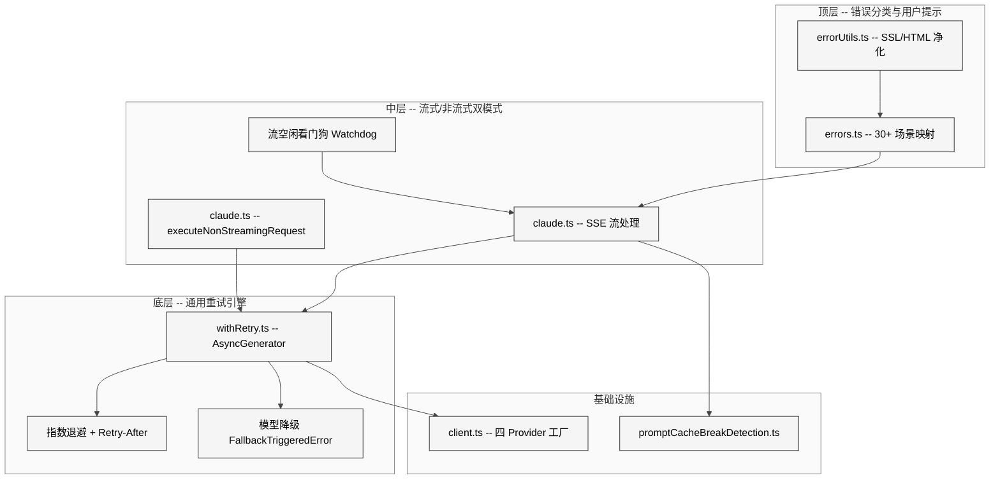
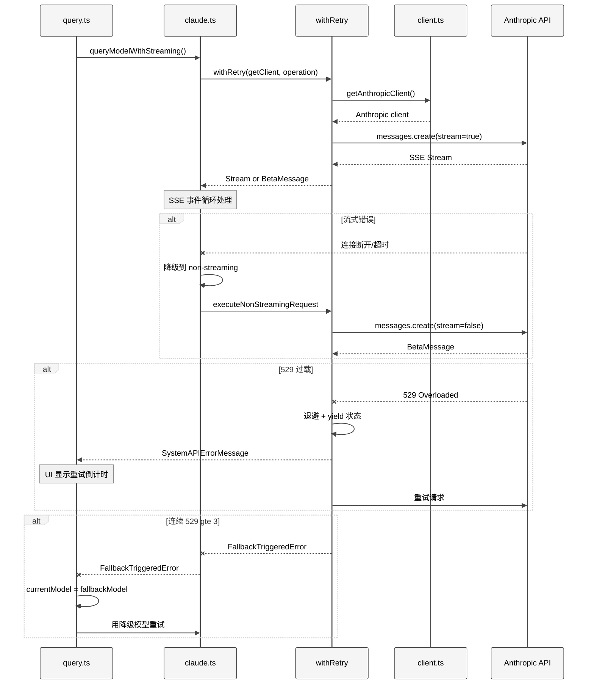
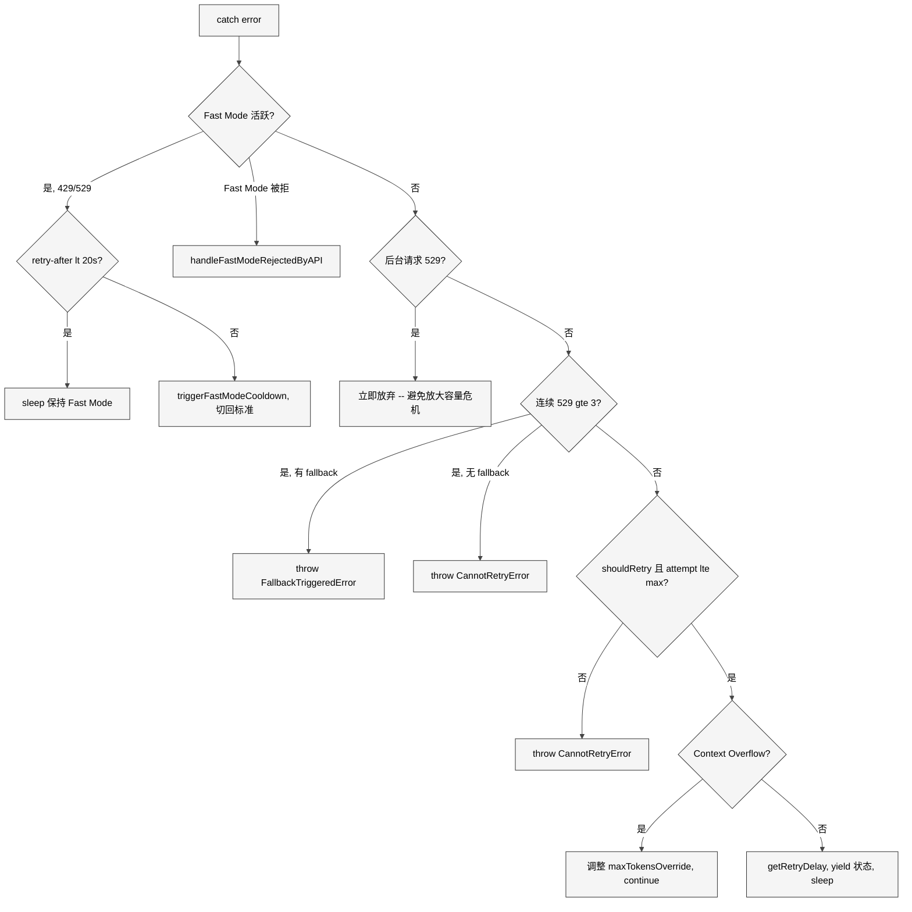
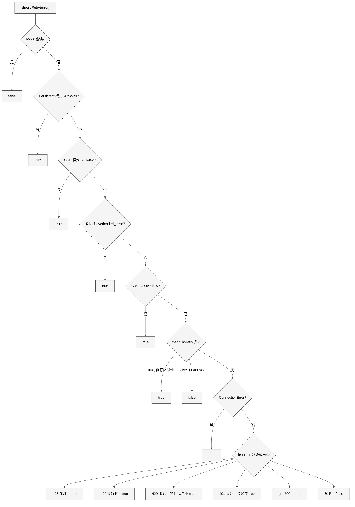
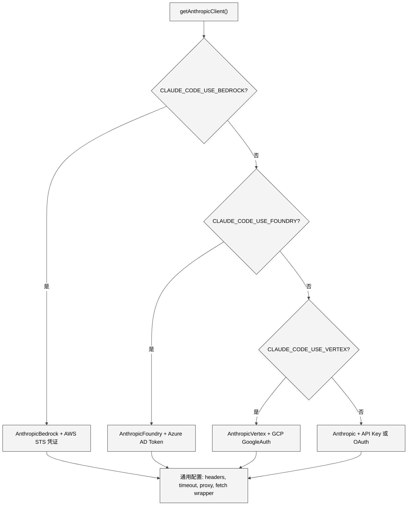
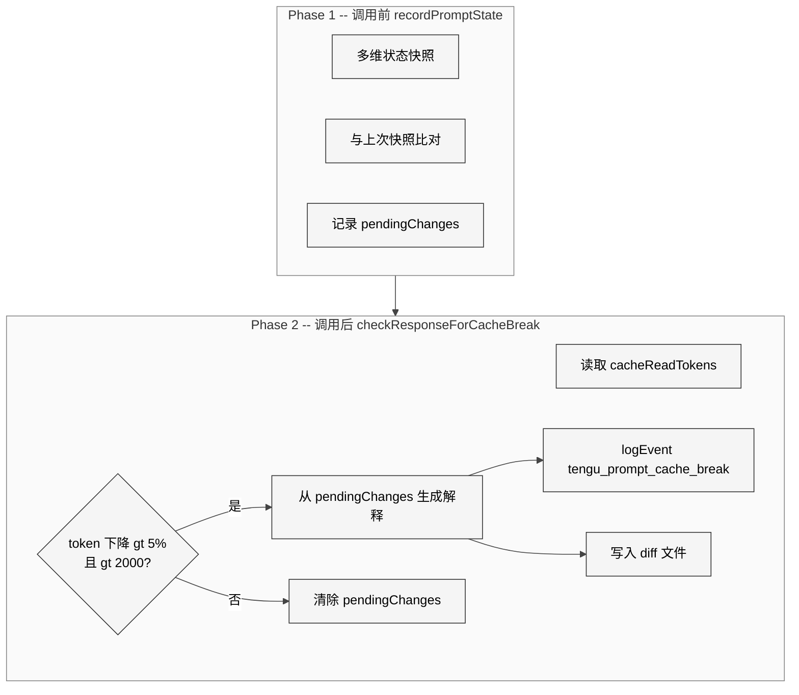
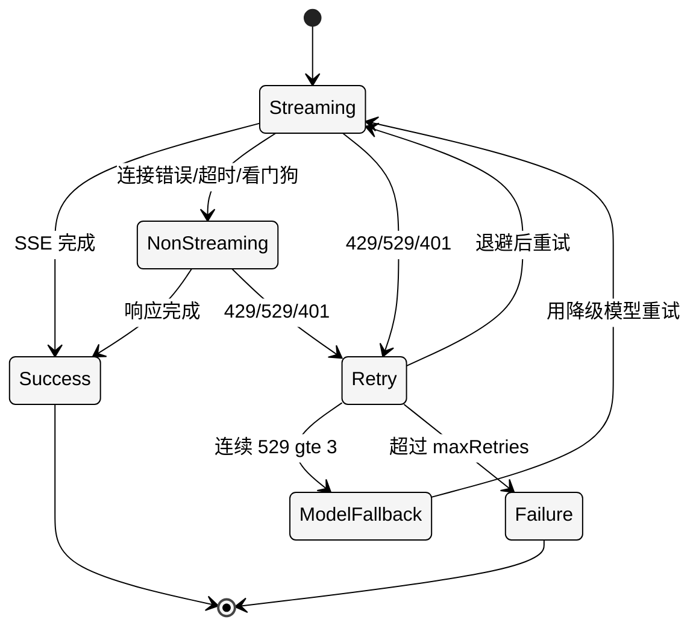

# 第 21 章 API 调用

> 核心提要：不可靠网络下的请求恢复

---

## 20.1 定位

在 Claude Code 的 513,216 行 TypeScript 代码中，API 调用层是连接"本地 Agent 循环"与"远端 LLM 推理"的关键桥梁。这座桥梁必须跨越一个充满不确定性的鸿沟：不可靠的网络、波动的 API 容量、过期的认证令牌、脆弱的流式连接，以及四种截然不同的云服务后端。

本章聚焦的源码位于 `src/services/api/` 目录下的 20 个文件，核心代码量约 6,824 行。其中最关键的五个文件分别是：

| 文件 | 行数 | 核心职责 |
|------|------|----------|
| `claude.ts` | 3,419 | 流式/非流式双模式、流空闲看门狗、SSE 事件处理 |
| `errors.ts` | 1,207 | 错误分类、用户友好消息生成、30+ 种错误场景映射 |
| `withRetry.ts` | 822 | AsyncGenerator 驱动的重试引擎、退避策略、模型降级 |
| `promptCacheBreakDetection.ts` | 727 | Prompt Cache 失效检测、多维度变更追踪 |
| `client.ts` | 389 | 四 Provider 客户端工厂、认证适配、自定义头注入 |
| `errorUtils.ts` | 260 | 连接错误因果链遍历、SSL 错误分类、HTML 净化 |

这些文件共同构成了一个**三层防御架构**：`withRetry` 通用重试层（底层） → 流式/非流式双模式切换层（中层） → 错误分类与用户友好提示层（顶层）。

<div style="background: #ffffff; padding: 16px; border-radius: 8px; margin: 16px 0;">



</div>

### 本章在整体架构中的位置

API 调用层位于 Claude Code 架构的"核心层"（Core Layer）中。从 `query.ts` 的 Agentic Loop 视角看，它在第 5 阶段 "Call Model" 中被调用，是每次循环迭代的关键路径：

```
query.ts while(true) → 阶段5 queryModelWithStreaming() → claude.ts → withRetry → client.ts → Anthropic API
```

由此可见 API 调用层的每一个错误恢复决策，都直接影响用户的编程体验：恢复成功 = 无缝继续；恢复失败 = 中断编程流。

---

## 20.2 架构

### 20.2.1 本质是什么

API 调用层的架构本质是一个**面向不确定性的弹性中间层**（Resilience Layer）。它解决的根本问题是：如何让一个长时运行的 Agentic 编程任务（可能持续 10-30 分钟）在网络抖动、API 限流、认证过期等暂态故障面前保持连续性。

传统的 REST API 调用通常采用"失败即报错"模型——调用者决定是否重试。但在 AI Agent 场景下，这种模型完全不可接受：

1. **Agentic 任务的"不可中断性"**：一个多步编程任务可能已经执行了 8 步工具调用、累积了大量上下文。如果第 9 步因为一次暂态 529 而中断，用户不得不从头开始——这在 UX 上是灾难性的。
2. **SSE 流的脆弱性**：LLM 的响应通过 Server-Sent Events 流式返回。SDK 的 `timeout` 只覆盖初始 HTTP 请求建立（`fetch()`），不覆盖后续的 SSE 数据流。一旦 TCP 连接在代理或负载均衡器侧被静默关闭，客户端会永久挂起。
3. **多 Provider 的认证异质性**：同一份代码要处理 Anthropic OAuth、AWS STS 临时凭证、GCP ADC 凭证刷新、Azure AD Token Provider 四种完全不同的认证机制和错误特征。

### 20.2.2 核心架构图

<div style="background: #ffffff; padding: 16px; border-radius: 8px; margin: 16px 0;">



</div>

### 20.2.3 为什么选择 AsyncGenerator

`withRetry` 最核心的设计决策是使用 `AsyncGenerator<SystemAPIErrorMessage, T>` 而非传统的 `async function`。这个选择来自一个关键需求：**重试过程的中间状态必须实时反馈给 UI 层**。

```typescript
// src/services/api/withRetry.ts L170-L178
export async function* withRetry<T>(
  getClient: () => Promise<Anthropic>,
  operation: (
    client: Anthropic,
    attempt: number,
    context: RetryContext,
  ) => Promise<T>,
  options: RetryOptions,
): AsyncGenerator<SystemAPIErrorMessage, T> {
```

`yield` 的语义是"暂停执行、向消费者发送中间结果"，天然适合表达"正在等待重试"这个状态。消费者（`query.ts` 的 Agentic Loop）通过 `for await...of` 消费这些中间消息，并在终端 UI 中渲染重试倒计时。当 `withRetry` 成功完成操作时，通过 `return` 返回最终结果。

对比两种方案：

| 方案 | 中间状态传递 | 调用者复杂度 | 取消支持 |
|------|------------|-------------|---------|
| `async function + callback` | 需要额外的 callback 参数 | 低 | 需要 AbortController |
| `AsyncGenerator` | `yield` 天然支持 | 略高（需消费 generator） | `signal.aborted` + `throw` |

AsyncGenerator 方案的优势在于**流式语义的一致性**：Claude Code 的整个 API 调用管线（从 `query.ts` 到 `claude.ts` 到 `withRetry`）都基于 AsyncGenerator，形成了统一的"数据流 + 控制流"管道。中间状态消息（`SystemAPIErrorMessage`）和最终结果（`BetaMessage`）可以通过同一个 generator 管道传递。

---

## 20.3 实现

### 20.3.1 withRetry：一个精密的隐式状态机

`withRetry` 的主循环表面上是一个简单的 `for` 循环，但内部的 6 个 `continue` 分支和 4 个 `throw` 分支构成了一个复杂的隐式状态机。让我们逐层拆解。

#### 核心常量与重试预算

```typescript
// src/services/api/withRetry.ts L52-L55
const DEFAULT_MAX_RETRIES = 10
const FLOOR_OUTPUT_TOKENS = 3000
const MAX_529_RETRIES = 3
export const BASE_DELAY_MS = 500
```

| 常量 | 值 | 设计考量 |
|------|------|---------|
| `DEFAULT_MAX_RETRIES` | 10 | 可通过 `CLAUDE_CODE_MAX_RETRIES` 环境变量覆盖 |
| `MAX_529_RETRIES` | 3 | 连续 529 超过此数触发模型降级——平衡可用性与放大效应 |
| `BASE_DELAY_MS` | 500ms | 指数退避基数；首次重试等待 500ms，第二次 1s，递增至 32s 封顶 |
| `FLOOR_OUTPUT_TOKENS` | 3000 | Context overflow 自动调整时的最小输出 token 数 |

#### 指数退避与抖动

```typescript
// src/services/api/withRetry.ts L530-L548
export function getRetryDelay(
  attempt: number,
  retryAfterHeader?: string | null,
  maxDelayMs = 32000,
): number {
  if (retryAfterHeader) {
    const seconds = parseInt(retryAfterHeader, 10)
    if (!isNaN(seconds)) {
      return seconds * 1000
    }
  }
  const baseDelay = Math.min(
    BASE_DELAY_MS * Math.pow(2, attempt - 1),
    maxDelayMs,
  )
  const jitter = Math.random() * 0.25 * baseDelay
  return baseDelay + jitter
}
```

退避序列为：500ms → 1s → 2s → 4s → 8s → 16s → 32s（封顶），加上 0-25% 的随机抖动。`Retry-After` 响应头具有最高优先级——这是正确遵循 HTTP 协议语义的做法。25% 的抖动看似微小，但在大规模场景下足以防止 **thundering herd** 效应。

**实践建议**：25% 抖动是经过实战验证的经验值。太小（如 5%）效果不明显，太大（如 100%）会让用户感到等待时间不可预测。Agent 开发者在设计重试策略时应该总是加入抖动。

#### 主循环的六个分支

`withRetry` 主循环的 catch 块按**优先级从高到低**处理六种场景。我们通过一个流程图来展示完整的决策树：

<div style="background: #ffffff; padding: 16px; border-radius: 8px; margin: 16px 0;">



</div>

以下逐一分析每个分支的设计意图。

**分支 1：Fast Mode 降级（L267-L314）**

Fast Mode 使用更快的推理路径。当遇到限流时，系统面临一个权衡：短等待后继续用 Fast Mode（可复用 Prompt Cache），还是切回标准速度让用户不必干等？

```typescript
// src/services/api/withRetry.ts L284-L304
const retryAfterMs = getRetryAfterMs(error)
if (retryAfterMs !== null && retryAfterMs < SHORT_RETRY_THRESHOLD_MS) {
  await sleep(retryAfterMs, options.signal, { abortError })
  continue
}
const cooldownMs = Math.max(
  retryAfterMs ?? DEFAULT_FAST_MODE_FALLBACK_HOLD_MS,
  MIN_COOLDOWN_MS,
)
triggerFastModeCooldown(Date.now() + cooldownMs, cooldownReason)
retryContext.fastMode = false
continue
```

20 秒阈值 (`SHORT_RETRY_THRESHOLD_MS`, L800) 的选择背后是 **Prompt Cache 经济学**：保持 Fast Mode 意味着模型名不变，服务端可以复用缓存的 Prompt 前缀。cache hit 与 miss 的成本差 200 倍（`$0.003 vs $0.60` per 200K tokens），短暂等待换取 cache 复用在经济上完全合算。冷却期最少 10 分钟 (`MIN_COOLDOWN_MS`, L801)，默认 30 分钟 (`DEFAULT_FAST_MODE_FALLBACK_HOLD_MS`, L799)，防止模式反复切换（flip-flopping）。

**分支 2：后台请求立即放弃（L316-L324）**

```typescript
// src/services/api/withRetry.ts L57-L61（注释）
// Foreground query sources where the user IS blocking on the result — these
// retry on 529. Everything else (summaries, titles, suggestions, classifiers)
// bails immediately: during a capacity cascade each retry is 3-10x gateway
// amplification, and the user never sees those fail anyway.
```

这是整个文件中最具**系统思维**的设计。源码注释直言不讳：每次重试都在 API 网关产生 3-10 倍的放大效应。后台任务（摘要、标题提取、安全分类器等）的失败用户不可见，重试它们只会加剧全局容量危机。这是 Claude Code 作为**负责任的 API 消费者**的体现。

前台查询的定义在 `FOREGROUND_529_RETRY_SOURCES` 集合中（L62-L82），包含 `repl_main_thread`、`sdk`、`agent:*`、`compact`、`hook_agent`、`verification_agent`、`auto_mode` 等 14 个来源。注意安全分类器 (`auto_mode`) 被视为前台任务——因为 Auto Mode 的正确性依赖于这些分类器的完成。

**分支 3：连续 529 触发模型降级（L326-L365）**

模型降级的触发条件**不是无条件的**，而是受双重门控保护：

```typescript
// src/services/api/withRetry.ts L327-L332
if (
  is529Error(error) &&
  (process.env.FALLBACK_FOR_ALL_PRIMARY_MODELS ||
    (!isClaudeAISubscriber() && isNonCustomOpusModel(options.model)))
) {
```

必须满足：环境变量 `FALLBACK_FOR_ALL_PRIMARY_MODELS` 为真，**或者**用户不是订阅用户且使用非自定义 Opus 模型。源码中有一个 TODO 标记（L330）质疑 `isNonCustomOpusModel` 检查是否仍然有意义——它可能是 Claude Code 早期硬编码 Opus 时代的遗留产物。

当条件满足且连续 529 达到 3 次时，`withRetry` 抛出 `FallbackTriggeredError`。这个自定义错误类型沿着调用链传播到 `query.ts`（L894），由 Agentic Loop 执行实际的模型切换：

```typescript
// src/query.ts L894-L897
if (innerError instanceof FallbackTriggeredError && fallbackModel) {
  currentModel = fallbackModel
  attemptWithFallback = true
```

**设计精髓**：`withRetry` 不直接切换模型（它缺乏必要的上下文），而是通过**类型化异常**通知上层做决策。这种"关注点分离通过异常类型"的模式在复杂系统中非常有效。

**分支 4：Context Overflow 自动调整（L384-L427）**

当 API 返回 "input length and `max_tokens` exceed context limit" 错误时，`withRetry` 从错误消息中正则提取 token 数字，计算可用空间，并自动调整 `maxTokensOverride`：

```typescript
// src/services/api/withRetry.ts L388-L416
const overflowData = parseMaxTokensContextOverflowError(error)
if (overflowData) {
  const { inputTokens, contextLimit } = overflowData
  const safetyBuffer = 1000
  const availableContext = Math.max(0, contextLimit - inputTokens - safetyBuffer)
  if (availableContext < FLOOR_OUTPUT_TOKENS) {
    throw error
  }
  const minRequired =
    (retryContext.thinkingConfig.type === 'enabled'
      ? retryContext.thinkingConfig.budgetTokens : 0) + 1
  retryContext.maxTokensOverride = Math.max(
    FLOOR_OUTPUT_TOKENS, availableContext, minRequired,
  )
  continue
}
```

注意源码注释（L385-L386）指出，在 `extended-context-window` beta 下，这种 400 错误不应再出现——API 改为返回 `model_context_window_exceeded` stop_reason。但为了**向后兼容**，这段代码被保留。这体现了生产系统中"不随意删除防御代码"的原则。

### 20.3.2 shouldRetry：精细的可重试性判断

`shouldRetry`（L696-L787）是一个 14 级决策链，每一级针对特定场景：

<div style="background: #ffffff; padding: 16px; border-radius: 8px; margin: 16px 0;">



</div>

其中有几个值得深入分析的设计决策：

**429 对订阅用户不重试**（L767-L769）：Max/Pro 用户的 429 意味着窗口期配额耗尽（5 小时或 7 天限额），可能要等数小时才重置。盲目重试只会浪费时间和增加 API 负载。但 Enterprise 用户使用 PAYG（按量计费），429 更可能是短暂的速率限制，值得重试。

```typescript
// src/services/api/withRetry.ts L767-L769
if (error.status === 429) {
  return !isClaudeAISubscriber() || isEnterpriseSubscriber()
}
```

**x-should-retry 头**（L732-L751）：这是一个非标准响应头，让服务器可以显式告诉客户端是否应该重试——比客户端猜测精确得多。但对于 Anthropic 内部员工（`USER_TYPE === 'ant'`），5xx 错误会忽略 `x-should-retry: false`，因为内部服务的 5xx 更可能是暂态的。

**529 的双重检测**（L610-L621）：SDK 在流式模式下有时无法正确传递 529 状态码，所以 `is529Error` 同时检查 `error.status === 529` 和 `error.message?.includes('"type":"overloaded_error"')`。这种"防御性双重检查"在与第三方 SDK 交互时是生产代码中的常见模式。

```typescript
// src/services/api/withRetry.ts L610-L621
export function is529Error(error: unknown): boolean {
  if (!(error instanceof APIError)) return false
  return (
    error.status === 529 ||
    (error.message?.includes('"type":"overloaded_error"') ?? false)
  )
}
```

### 20.3.3 认证错误恢复：多 Provider 透明重认证

`withRetry` 主循环的每次迭代开始时（L218-L251），会检查上一次错误是否是认证相关的，如果是，则刷新凭证并重新创建客户端：

```typescript
// src/services/api/withRetry.ts L232-L251
if (
  client === null ||
  (lastError instanceof APIError && lastError.status === 401) ||
  isOAuthTokenRevokedError(lastError) ||
  isBedrockAuthError(lastError) ||
  isVertexAuthError(lastError) ||
  isStaleConnection
) {
  if (
    (lastError instanceof APIError && lastError.status === 401) ||
    isOAuthTokenRevokedError(lastError)
  ) {
    const failedAccessToken = getClaudeAIOAuthTokens()?.accessToken
    if (failedAccessToken) {
      await handleOAuth401Error(failedAccessToken)
    }
  }
  client = await getClient()
}
```

客户端的创建策略是**惰性的**：只在首次请求、认证错误、或 stale connection 后才创建新客户端。正常的非认证类重试复用已有客户端实例。

每种 Provider 的认证错误特征截然不同：

| Provider | 错误来源 | 错误形态 | 检测函数 |
|----------|---------|---------|---------|
| Anthropic First Party | API 返回 401/403 | `APIError` | `error.status === 401` |
| Anthropic OAuth | Token 被撤销 | `APIError` 403 + 消息匹配 | `isOAuthTokenRevokedError` |
| AWS Bedrock | SDK 层凭证过期 | `CredentialsProviderError` (非 APIError) | `isBedrockAuthError` L631-L644 |
| GCP Vertex | google-auth-library | 普通 `Error` + 消息匹配 | `isVertexAuthError` L670-L682 |

GCP 的检测尤其值得注意：`google-auth-library` 不像 AWS SDK 那样有专门的错误类型，而是抛出普通 `Error`，需要通过消息文本匹配来识别（`'Could not load the default credentials'`、`'invalid_grant'` 等）。这种"基于消息文本的错误识别"在实践中是脆弱的，但在没有类型化错误的 SDK 面前是唯一选择。

### 20.3.4 流式双模式：Streaming + Non-Streaming Fallback

Claude Code 默认使用 SSE 流式模式，但当流式请求失败时自动降级到非流式模式。这个双模式设计是 `claude.ts` 的核心复杂度来源。

#### 流创建与 SDK 重试禁用

```typescript
// claude.ts 中的 withRetry 调用（概念简化）
const generator = withRetry(
  () => getAnthropicClient({
    maxRetries: 0,  // 禁用 SDK 自带重试
    model: options.model,
    source: options.querySource,
  }),
  async (anthropic, attempt, context) => {
    const result = await anthropic.beta.messages
      .create({ ...params, stream: true }, { signal })
      .withResponse()
    return result.data
  },
  { model: options.model, fallbackModel: options.fallbackModel, ... },
)
```

`maxRetries: 0` 是一个关键决策——Anthropic SDK 内置了重试机制，但 Claude Code 禁用它，由 `withRetry` 统一管理。原因：两套重试机制叠加会导致重试次数指数膨胀，且 SDK 的重试不支持 `yield` 中间状态给 UI。

#### 流空闲看门狗（Stream Idle Watchdog）

看门狗解决的是**流式连接静默断开**的问题。当 TCP 连接没有报错但服务端已停止发送数据时，客户端会永久挂起。

```typescript
// src/services/api/claude.ts L1874-L1928
const streamWatchdogEnabled = isEnvTruthy(
  process.env.CLAUDE_ENABLE_STREAM_WATCHDOG,
)
const STREAM_IDLE_TIMEOUT_MS =
  parseInt(process.env.CLAUDE_STREAM_IDLE_TIMEOUT_MS || '', 10) || 90_000

function resetStreamIdleTimer(): void {
  clearStreamIdleTimers()
  if (!streamWatchdogEnabled) return
  streamIdleWarningTimer = setTimeout(() => {
    logForDebugging(`Streaming idle warning: ...`)
  }, STREAM_IDLE_WARNING_MS)
  streamIdleTimer = setTimeout(() => {
    streamIdleAborted = true
    streamWatchdogFiredAt = performance.now()
    releaseStreamResources()
  }, STREAM_IDLE_TIMEOUT_MS)
}
```

**看门狗默认不启用**——必须通过 `CLAUDE_ENABLE_STREAM_WATCHDOG` 环境变量显式开启。原因：在高延迟网络（卫星链路、某些 VPN）下，模型的长时间思考（extended thinking）可能导致 90 秒内没有任何 SSE 事件，误触发超时。默认关闭是保守但安全的选择。

#### Stall 检测（非中断式）

除了完全断开，流还可能出现间歇性卡顿：

```typescript
// src/services/api/claude.ts L1936-L1950
const STALL_THRESHOLD_MS = 30_000
let totalStallTime = 0
let stallCount = 0

for await (const part of stream) {
  const now = Date.now()
  if (lastEventTime !== null) {
    const timeSinceLastEvent = now - lastEventTime
    if (timeSinceLastEvent > STALL_THRESHOLD_MS) {
      stallCount++
      totalStallTime += timeSinceLastEvent
    }
  }
  lastEventTime = now
  // ...
}
```

Stall 检测**不会中断流**——它只记录遥测数据 (`tengu_streaming_stall`)。团队利用这些数据判断哪些网络环境/区域的流式体验差，决定是否需要在特定条件下默认使用非流式模式。这是"观测优先、干预谨慎"的工程原则。

#### Non-Streaming Fallback

当流式请求失败时（连接错误、超时、看门狗中断），系统自动降级：

```typescript
// src/services/api/claude.ts L2504-L2569（关键逻辑）
didFallBackToNonStreaming = true
if (options.onStreamingFallback) {
  options.onStreamingFallback()
}
const result = yield* executeNonStreamingRequest(
  { model: options.model, source: options.querySource },
  {
    model: options.model,
    fallbackModel: options.fallbackModel,
    thinkingConfig,
    signal,
    initialConsecutive529Errors: is529Error(streamingError) ? 1 : 0,
    querySource: options.querySource,
  },
  paramsFromContext,
  ...
)
```

一个关键细节：`initialConsecutive529Errors: is529Error(streamingError) ? 1 : 0`。如果流式失败本身就是 529 导致的，这个 1 会被传递到非流式的 `withRetry` 中，作为连续 529 计数的初始值。这确保了**总 529 次数在模式切换间保持一致**——不会因为从流式切到非流式而"多给"3 次重试机会。源码注释引用了 GitHub issue #1513 作为这个修复的动机。

非流式 fallback 有独立的超时配置：

```typescript
// src/services/api/claude.ts L807-L810
function getNonstreamingFallbackTimeoutMs(): number {
  const override = parseInt(process.env.API_TIMEOUT_MS || '', 10)
  if (override) return override
  return isEnvTruthy(process.env.CLAUDE_CODE_REMOTE) ? 120_000 : 300_000
}
```

远程容器（CCR）的超时 120 秒，本地 300 秒。CCR 容器通常有 5 分钟空闲终止策略，120 秒的超时留出余量确保超时错误能正常返回而不是被 SIGKILL。

#### 404 流端点 Fallback

某些网关/代理不支持 SSE 端点，返回 404：

```typescript
// src/services/api/claude.ts L2607-L2616
// Check if this is a 404 error during stream creation that should trigger
// non-streaming fallback. This handles gateways that return 404 for streaming
// endpoints but work fine with non-streaming. Before v2.1.8, BetaMessageStream
// threw 404s during iteration (caught by inner catch with fallback), but now
// with raw streams, 404s are thrown during creation (caught here).
const is404StreamCreationError =
  !didFallBackToNonStreaming &&
  errorFromRetry instanceof CannotRetryError &&
  errorFromRetry.originalError instanceof APIError &&
  errorFromRetry.originalError.status === 404
```

这段代码是版本迭代的产物。注释清晰地记录了行为变更的历史：v2.1.8 之前 404 出现在流迭代阶段（被内层 catch 捕获），之后出现在流创建阶段（需要在外层 catch 处理）。

### 20.3.5 Persistent Retry：无人值守模式

对于 Anthropic 内部的无人值守场景（CI/CD、批量任务），`withRetry` 支持无限重试模式。这个能力受**双重门控**保护：

```typescript
// src/services/api/withRetry.ts L100-L104
function isPersistentRetryEnabled(): boolean {
  return feature('UNATTENDED_RETRY')
    ? isEnvTruthy(process.env.CLAUDE_CODE_UNATTENDED_RETRY)
    : false
}
```

编译期 `feature('UNATTENDED_RETRY')` 必须打开（内部构建），**且**运行时环境变量为真。在外部发布版本中，`feature()` 编译为 `false`，整个 persistent retry 分支被 Dead Code Elimination 物理移除。

Persistent 模式下的两个关键设计：

1. **心跳分块**（L477-L503）：将长等待（可能数小时）切分为 30 秒的小块，每块通过 `yield` 向 stdout 输出 `SystemAPIErrorMessage`。这防止宿主环境（如 CI runner）因无输出而判定会话空闲并终止进程。源码 TODO（L94）标注这是一个权宜之计，等待专用 keep-alive 通道。

2. **循环计数器钳制**（L506）：`if (attempt >= maxRetries) attempt = maxRetries` 让 for 循环永不因 `attempt > maxRetries + 1` 而退出。实际退避使用独立的 `persistentAttempt` 计数器，最大退避 5 分钟 (`PERSISTENT_MAX_BACKOFF_MS`)，总等待上限 6 小时 (`PERSISTENT_RESET_CAP_MS`)。

### 20.3.6 多 Provider 客户端工厂

`client.ts` 的 `getAnthropicClient`（L88-L316）是一个 Provider 感知的工厂函数，根据环境变量选择创建不同的 SDK 客户端：

<div style="background: #ffffff; padding: 16px; border-radius: 8px; margin: 16px 0;">



</div>

值得关注的实现细节：

1. **Provider SDK 的动态导入**：`AnthropicBedrock`、`AnthropicFoundry`、`AnthropicVertex` 都通过 `await import()` 动态加载（L154、L192、L228），避免在不使用该 Provider 时加载不必要的依赖。

2. **GCP Vertex 的 12 秒超时陷阱**（L240-L288）：`google-auth-library` 在发现 project ID 时会尝试查询 GCE metadata server——在非 GCP 环境下这个查询会超时 12 秒。源码通过检查环境变量和 credential 文件，仅在必要时才将 `ANTHROPIC_VERTEX_PROJECT_ID` 作为 fallback 传入，避免这个 12 秒卡顿。

3. **`x-client-request-id` 注入**（L356-L389）：每个请求携带一个客户端生成的 UUID，仅对 First Party API 注入（`client.ts` L366-L367）。这使得即使在请求超时（没有服务端 request ID 返回）时，也能通过客户端 ID 关联服务端日志。

---

## 20.4 细节

### 20.4.1 连接错误因果链遍历

Anthropic SDK 将底层连接错误嵌套在 `cause` 属性链中。`errorUtils.ts` 的 `extractConnectionErrorDetails` 通过有限深度遍历找到根因：

```typescript
// src/services/api/errorUtils.ts L42-L83
export function extractConnectionErrorDetails(
  error: unknown,
): ConnectionErrorDetails | null {
  let current: unknown = error
  const maxDepth = 5
  let depth = 0
  while (current && depth < maxDepth) {
    if (
      current instanceof Error &&
      'code' in current &&
      typeof current.code === 'string'
    ) {
      const code = current.code
      const isSSLError = SSL_ERROR_CODES.has(code)
      return { code, message: current.message, isSSLError }
    }
    if (current instanceof Error && 'cause' in current && current.cause !== current) {
      current = current.cause
      depth++
    } else { break }
  }
  return null
}
```

**maxDepth = 5** 防止循环引用导致的无限遍历。`SSL_ERROR_CODES` 集合（L5-L29）包含 18 种 OpenSSL 错误码，覆盖了证书验证失败、自签名证书、TLS 握手超时等企业代理环境的常见问题。

### 20.4.2 SSL 错误提示

对于企业用户（Zscaler 等 TLS 中间人代理场景），SSL 错误提示直接给出可操作的修复建议：

```typescript
// src/services/api/errorUtils.ts L94-L99
export function getSSLErrorHint(error: unknown): string | null {
  const details = extractConnectionErrorDetails(error)
  if (!details?.isSSLError) return null
  return `SSL certificate error (${details.code}). If you are behind a corporate proxy or TLS-intercepting firewall, set NODE_EXTRA_CA_CERTS to your CA bundle path, or ask IT to allowlist *.anthropic.com. Run /doctor for details.`
}
```

### 20.4.3 HTML 响应净化

CloudFlare 等 CDN 在错误时会返回 HTML 页面。如果直接将 HTML 作为错误消息展示给用户，终端 UI 会完全混乱：

```typescript
// src/services/api/errorUtils.ts L107-L116
function sanitizeMessageHTML(message: string): string {
  if (message.includes('<!DOCTYPE html') || message.includes('<html')) {
    const titleMatch = message.match(/<title>([^<]+)<\/title>/)
    if (titleMatch && titleMatch[1]) {
      return titleMatch[1].trim()
    }
    return ''
  }
  return message
}
```

### 20.4.4 反序列化后的 API 错误恢复

当从 JSONL 会话文件反序列化（`--resume` 场景）时，SDK 的 `APIError` 失去 `.message` 属性。`errorUtils.ts` 为此实现了嵌套错误消息提取（L144-L198），覆盖两种后端格式：

- **Standard Anthropic API**：`{ error: { error: { message: "..." } } }`
- **Bedrock/Proxy**：`{ error: { message: "..." } }`

### 20.4.5 Stale Connection 修复

TCP keep-alive 连接可能被代理或负载均衡器静默关闭，导致 `ECONNRESET` 或 `EPIPE`：

```typescript
// src/services/api/withRetry.ts L112-L118
function isStaleConnectionError(error: unknown): boolean {
  if (!(error instanceof APIConnectionError)) return false
  const details = extractConnectionErrorDetails(error)
  return details?.code === 'ECONNRESET' || details?.code === 'EPIPE'
}
```

检测到后，通过 `disableKeepAlive()`（`src/utils/proxy.ts` L29-L31）全局禁用连接池复用，强制后续请求使用新连接。这个操作是**不可逆的**（进程生命周期内的 sticky 设置），因为一旦连接池被确认不可靠，就没有理由再信任它。

### 20.4.6 Prompt Cache 失效的多维度追踪

`promptCacheBreakDetection.ts` 实现了一个值得注意的缓存失效检测系统。它在每次 API 调用前（Phase 1, `recordPromptState`）记录多维状态快照，在调用后（Phase 2, `checkResponseForCacheBreak`）比对 cache read tokens 的变化：

```typescript
// src/services/api/promptCacheBreakDetection.ts L28-L69（PreviousState 类型定义）
type PreviousState = {
  systemHash: number
  toolsHash: number
  cacheControlHash: number
  toolNames: string[]
  perToolHashes: Record<string, number>
  systemCharCount: number
  model: string
  fastMode: boolean
  globalCacheStrategy: string
  betas: string[]
  autoModeActive: boolean
  isUsingOverage: boolean
  cachedMCEnabled: boolean
  effortValue: string
  extraBodyHash: number
  // ...
}
```

源码注释引用了实际数据：

> "77% of tool breaks are schema-only (added=removed=0)."
> — `promptCacheBreakDetection.ts` L37，引用 BQ 2026-03-22 查询

由此可见绝大多数 cache 失效不是因为工具数量变化，而是工具描述的微小更新（如 AgentTool 的动态代理列表）。为此引入了 per-tool schema hash 精确定位哪个工具的描述变了。

<div style="background: #ffffff; padding: 16px; border-radius: 8px; margin: 16px 0;">



</div>

---

## 20.5 比较

### 20.5.1 重试机制对比

| 维度 | Claude Code | Cursor | Aider | Cline |
|------|-------------|--------|-------|-------|
| 重试引擎 | AsyncGenerator + yield 中间状态 | SDK 内置重试 | 简单 while loop + sleep | Promise + retry 库 |
| 退避策略 | 指数退避 + 25% 抖动 + Retry-After | SDK 默认 | 固定间隔 | 指数退避 |
| 模型降级 | FallbackTriggeredError 跨层传播 | 无自动降级 | 无自动降级 | 无自动降级 |
| 后台请求抑制 | 529 时后台请求立即放弃 | 无此设计 | 无此设计 | 无此设计 |
| 流式 fallback | SSE 失败自动降级到非流式 | 重试流式 | 不使用流式 | 重试流式 |
| 多 Provider 认证恢复 | 4 Provider 透明重认证 | 单 Provider | API Key only | API Key only |
| Persistent retry | 无限重试（内部门控） | 无 | 无 | 无 |
| Cache 失效检测 | 多维追踪 + 遥测 | 无 | 无 | 无 |

### 20.5.2 Claude Code 的优势

1. **AsyncGenerator 的中间状态传递**：竞品的重试要么无反馈（用户以为卡死），要么需要额外的 callback 机制。Claude Code 的 generator `yield` 在语义和实现上都更自然。

2. **负责任的 API 消费**：后台请求在 529 时立即放弃、避免放大容量危机的设计，在竞品中绝无仅有。这不仅保护了用户体验，也保护了 API 平台的整体健康。

3. **模型降级的跨层协作**：通过类型化异常（`FallbackTriggeredError`）实现 `withRetry` → `claude.ts` → `query.ts` 的三层协作，是一个优雅的关注点分离方案。

4. **Prompt Cache 经济学意识**：从 Fast Mode 的 20 秒阈值选择到 多维度的 cache break 检测，整个系统对 Prompt Cache 的成本影响有着深刻的理解。

### 20.5.3 Claude Code 的局限

1. **流式看门狗默认关闭**：虽然原因合理（避免长思考时误触发），但由此可见在某些网络环境下，静默断开的流可能无限挂起。对比 Cursor 等 IDE 内嵌工具，它们可以利用 UI 层的超时机制兜底。

2. **错误消息文本匹配的脆弱性**：`isFastModeNotEnabledError` 通过匹配 `'Fast mode is not enabled'` 来判断（L600-L608），源码自身的 TODO 也承认这是脆弱的。`is529Error` 通过匹配 `'"type":"overloaded_error"'` 同样如此。API 措辞的变更会导致静默失效。

3. **GCP GoogleAuth 实例未缓存**：`client.ts` L232-L239 的 TODO 明确指出每次 `getAnthropicClient()` 调用都创建新的 GoogleAuth 实例，可能导致重复认证流程。缓存需要谨慎处理凭证刷新和环境变量变更，但缺乏缓存确实是性能隐患。

---

## 20.6 辨误

### 误解：Claude Code 只能用 Anthropic 模型

这是一种常见误解。更准确地说，源码可以确认 Claude Code 具备四种 API Provider 的适配路径：

```typescript
// src/utils/model/providers.ts L4-L14
export type APIProvider = 'firstParty' | 'bedrock' | 'vertex' | 'foundry'

export function getAPIProvider(): APIProvider {
  return isEnvTruthy(process.env.CLAUDE_CODE_USE_BEDROCK)
    ? 'bedrock'
    : isEnvTruthy(process.env.CLAUDE_CODE_USE_VERTEX)
      ? 'vertex'
      : isEnvTruthy(process.env.CLAUDE_CODE_USE_FOUNDRY)
        ? 'foundry'
        : 'firstParty'
}
```

通过设置环境变量 `CLAUDE_CODE_USE_BEDROCK`、`CLAUDE_CODE_USE_VERTEX`、`CLAUDE_CODE_USE_FOUNDRY`，用户可以将 Claude Code 连接到 AWS Bedrock、GCP Vertex AI 或 Azure Foundry 后端。`client.ts` 为每种 Provider 实现了独立的客户端创建逻辑（L153-L298），包括特定的认证方式、区域配置和错误处理。

进一步地，`src/utils/model/configs.ts` 为每个模型维护了跨 Provider 的名称映射：

```typescript
// 概念示例（基于 configs.ts 的 ModelConfig 结构）
{
  firstParty: 'claude-opus-4-6',
  bedrock:    'us.anthropic.claude-opus-4-6-v1',
  vertex:     'claude-opus-4-6',
  foundry:    'claude-opus-4-6',
}
```

甚至 `errors.ts` 中的 `get3PModelFallbackSuggestion` 函数（L940-L958）专门为第三方 Provider 用户提供模型不可用时的降级建议链：如果 Opus 4.6 不可用，建议 Opus 4.1；如果 Sonnet 4.6 不可用，建议 Sonnet 4.5，依此类推。

**更准确地说**：Claude Code 不仅支持多 Provider，而且在错误处理（`withRetry` 的认证恢复）、模型路由（`configs.ts` 的跨 Provider 映射）、用户提示（`errors.ts` 的 3P 降级建议）三个层面都为多 Provider 做了深度适配。它是一个真正的**多云 AI Agent 客户端**。

### 争议：429 对订阅用户不重试是否太激进

部分用户反映在遇到 429 时 Claude Code "放弃太快"。源码的设计意图是：Max/Pro 用户的 429 对应窗口期配额耗尽，可能需要等待数小时。在此期间盲目重试只会消耗 CPU 和网络资源，且不断弹出"正在重试"的提示反而更影响体验。

但 Enterprise/PAYG 用户的 429 更可能是短暂的速率限制，所以对他们 `shouldRetry` 返回 `true`（L767-L769）。这个区分是合理的——它基于不同计费模型下 429 的语义差异做出了正确的判断。

### 争议：Persistent Retry 是否应该开放给外部用户

Persistent Retry 的 `feature('UNATTENDED_RETRY')` 门控意味着外部用户无法使用无限重试功能。对于长时间运行的 CI/CD 任务或无人值守的代码迁移，外部用户在遇到 429/529 时没有自动恢复机制，必须手动重启。

这个限制的合理性在于：无限重试如果不受控地开放，可能导致大量客户端在 API 过载时持续发送请求，进一步加剧问题。但对于付费的 Enterprise 用户，开放此功能（配合合理的退避上限）可能是一个值得考虑的方向。

---

## 20.7 展望

### 20.7.1 源码中的 TODO 和已知缺陷

1. **TODO(ANT-344)**（`withRetry.ts` L94）：通过 `SystemAPIErrorMessage` yield 作为 keep-alive 是权宜之计，等待专用 keep-alive 通道。由此可见 persistent retry 的心跳机制与业务消息共享了通道，不够干净。

2. **TODO: isNonCustomOpusModel 是否过时**（`withRetry.ts` L330）：529 降级的 `isNonCustomOpusModel` 检查可能是 Claude Code 早期硬编码 Opus 的遗留。随着模型多样化，这个检查的语义已经模糊。

3. **TODO: Fast Mode 错误检测脆弱**（`withRetry.ts` L597-L598）：`isFastModeNotEnabledError` 通过字符串匹配 `'Fast mode is not enabled'` 来判断。源码建议替换为响应头检查（如 `x-fast-mode-rejected`），但 API 端尚未提供。

4. **TODO: GoogleAuth 实例缓存**（`client.ts` L232-L239）：每次创建客户端都实例化新的 GoogleAuth，性能不佳。缓存需要处理凭证刷新、环境变量变更等复杂场景。

5. **TODO: citations 处理**（`claude.ts` L2085）：`citations_delta` 事件目前被忽略，尚未实现引用功能。

### 20.7.2 潜在瓶颈

1. **`shouldRetry` 的线性决策链**：14 级 if-else 链在可维护性上面临挑战。每新增一种错误类型都需要找到正确的插入位置。建议重构为基于优先级的"规则表"模式。

2. **错误分类的重复性**：`errors.ts` 的 `classifyAPIError`（L965-L1161）和 `getAssistantMessageFromError`（L425-L934）有大量重复的条件判断。两者应该共享一个统一的错误分类层。

3. **Prompt Cache 检测的内存开销**：`promptCacheBreakDetection.ts` 的 `PreviousState` 包含 `buildDiffableContent` 闭包，每个持有完整的 system prompt + tool schemas 字符串（注释估计 ~300KB+）。虽然有 `MAX_TRACKED_SOURCES = 10` 的上限，但在多 Agent 场景下仍可能达到 3MB 的跟踪开销。

### 20.7.3 改进方向

如果重新设计下一版，以下是值得考虑的改进：

1. **结构化错误响应**：推动 API 端返回结构化的错误类型字段（而非依赖消息文本匹配），消除 `is529Error`、`isFastModeNotEnabledError` 等脆弱检测。

2. **分层重试策略**：将 `withRetry` 的单一重试循环拆分为"连接重试"和"业务重试"两层。连接级问题（ECONNRESET、SSL）应该有更短的退避和更多的重试次数；业务级问题（529、429）使用当前的策略。

3. **自适应看门狗**：基于网络环境自动调整看门狗超时——通过前几次请求的 TTFB 和 chunk 间隔建立基线，动态设置超时阈值，而非依赖固定的 90 秒或手动配置。

4. **重试预算共享**：当前流式和非流式的重试预算是部分共享的（`initialConsecutive529Errors`），但其他错误类型的预算是独立的。统一的"请求级重试预算"可以在任何模式切换间保持一致的行为。

**对 Agent 开发者的实践建议**：
- 永远将重试逻辑从 SDK 层提到应用层——SDK 的重试机制通常不了解你的业务上下文
- 为后台请求实现独立的退避策略——不要让后台任务的重试放大前台用户面临的容量危机
- 在流式场景中，SDK 的 timeout 通常只覆盖初始 HTTP 请求，不覆盖数据流——你需要自己的看门狗
- 认证错误的恢复必须是 Provider 感知的——每种云平台的错误特征截然不同

---

## 20.8 小结

<div style="background: #ffffff; padding: 16px; border-radius: 8px; margin: 16px 0;">



</div>

**核心 Takeaway：**

1. **AsyncGenerator 是 Agent 重试的最佳范式**。`withRetry` 的 `yield` 机制让重试过程的中间状态（倒计时、当前尝试次数、错误类型）可以自然地流向 UI 层，同时保持调用链的类型安全。这种模式值得每一个 Agent 框架借鉴。

2. **"负责任的 API 消费"不是口号**。后台请求在 529 时立即放弃（避免 3-10 倍网关放大）、429 对不同计费模型差异化处理、流式与非流式间共享 529 计数——这些设计体现了一个成熟的 API 消费者对平台生态的尊重。

3. **流式连接的脆弱性被系统性地补偿**。SSE 流 → 空闲看门狗 → stall 检测遥测 → 非流式 fallback → 404 端点 fallback，形成了一个五级的流式可靠性保障链。

4. **多 Provider 的认证异质性是不可回避的工程现实**。Anthropic OAuth、AWS STS、GCP ADC、Azure AD 四种认证机制各有不同的错误特征和恢复策略。`withRetry` 的设计巧妙之处在于将认证恢复与重试逻辑自然融合——401/403 触发客户端重建，客户端重建触发凭证刷新。

5. **Prompt Cache 经济学驱动了大量架构决策**。Fast Mode 的 20 秒阈值、多维度的 cache break 检测、`sticky latches` 防止模式切换导致 cache 刷新——当 cache hit 与 miss 的成本差达 200 倍时，cache 管理从"优化"升级为"架构约束"。
