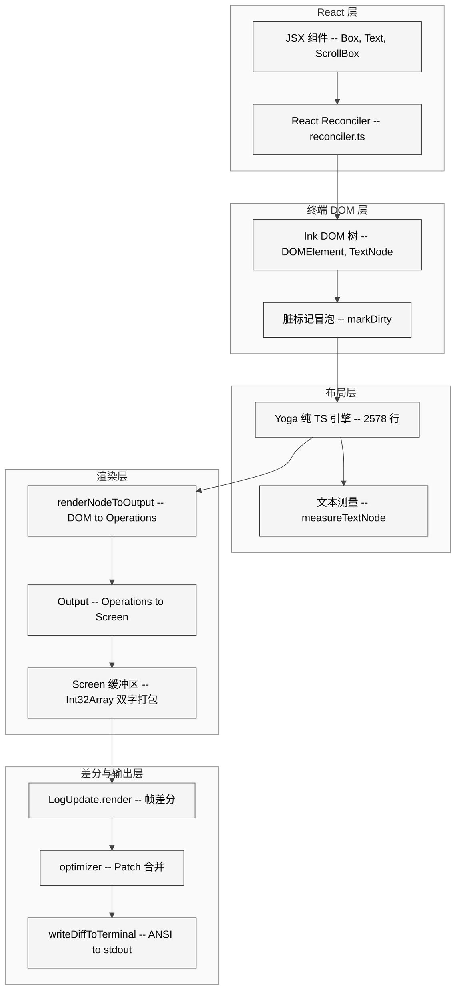
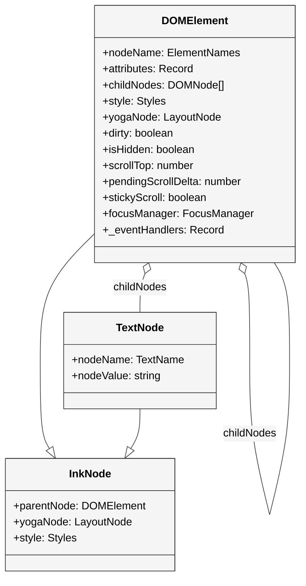
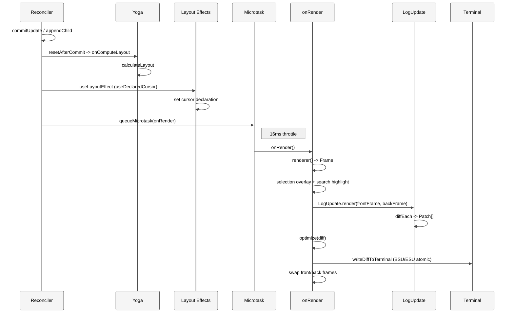
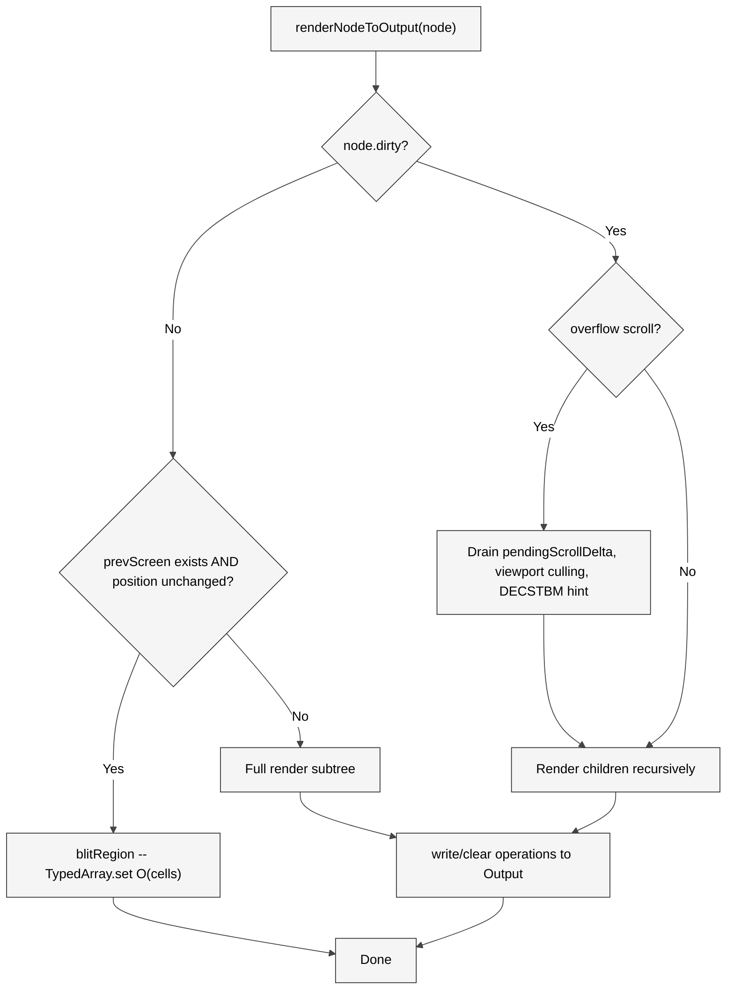
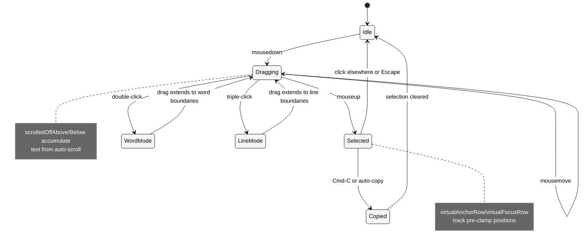

# 第 22 章 Ink 引擎

> 核心提要：终端渲染管线的自定义实现

Claude Code 的终端 UI 不是 `console.log` 的简单包装。它是一个完整的**终端渲染引擎**——从 React Reconciler、Flexbox 布局、双缓冲 Screen、逐 Cell 差分、到 ANSI 转义序列的最终输出，每一层都经过深度定制。这 96 个文件、近 2 万行代码（`src/ink/` 13,306 行 + 子目录 6,536 行）加上 2,578 行纯 TypeScript Yoga 布局引擎（`src/native-ts/yoga-layout/`），共同构成了一个在终端中运行的高动态渲染管线。

## 21.1 定位

### 在 Claude Code 整体架构中的位置

Claude Code 的架构可以分为三层：**Agent 内核**（`query.ts` 的 agentic loop）、**能力层**（40 个工具 + MCP + 权限系统）、**表现层**（终端 UI）。本章聚焦的 Ink 框架就是表现层的核心——它让 Claude Code 不仅仅是一个"命令行工具"，而是一个拥有全屏模式、虚拟滚动、鼠标交互、文本选择、搜索高亮的**终端原生应用**。

Anthropic 工程博客明确指出："Claude Code serves as the agentic harness around Claude"。这个 harness 的用户界面正是由 fork 后的 Ink 框架驱动。每一次流式输出的丝滑滚动、每一帧 spinner 的无闪烁旋转、每一次鼠标点击的精确响应，背后都是本章分析的渲染管线在工作。

### 本章结构预览

本章按七个维度展开：架构本质（21.2）→ 实现深度剖析（21.3）→ 性能工程（21.4）→ 深度定制扩展（21.5）→ 竞品对比（21.6）→ 社区争议与误解（21.7）→ 开放问题（21.8）。每个维度都以源码实证为基础，不做无据推测。

## 21.2 架构

### 为什么要 Fork Ink

社区版 Ink（Vadim Demedes 维护）是一个优秀的终端 React 框架，适合构建简单 CLI 工具。但 Claude Code 的需求远超其能力范围。以下四个核心矛盾迫使 Anthropic 走向 fork：

1. **全屏模式 vs 追加式输出**：Claude Code 需要在 Alt Screen 下运行完整 UI——硬件滚动（DECSTBM）、鼠标追踪、选区高亮。社区版 Ink 仅支持主屏幕追加。
2. **60fps 流式渲染 vs 无帧控制**：流式 AI 输出需要每 16ms 刷新一帧且不闪烁，需要双缓冲 + 帧差分 + 同步输出（DEC 2026）。
3. **WASM 冷启动 vs 同步加载**：社区版依赖 `yoga-wasm-web` 做布局，WASM 加载需要异步等待；Claude Code 用纯 TS 替代，同步 import，零额外开销。
4. **React 19 适配**：`commitUpdate` 签名变更、`maySuspendCommit` 等新增必需方法，需要 Reconciler 级别的适配。

<div style="background: #ffffff; padding: 16px; border-radius: 8px; margin: 16px 0;">



</div>

### 核心设计决策

**决策一：纯 TypeScript Yoga 替代 WASM**。`src/native-ts/yoga-layout/index.ts` 的文件头注释明确说明了原因：

```1:7:restored-src/src/native-ts/yoga-layout/index.ts
/**
 * Pure-TypeScript port of yoga-layout (Meta's flexbox engine).
 *
 * This matches the `yoga-layout/load` API surface used by src/ink/layout/yoga.ts.
 * The upstream C++ source is ~2500 lines in CalculateLayout.cpp alone; this port
 * is a simplified single-pass flexbox implementation that covers the subset of
 * features Ink actually uses:
```

这不是"去掉 WASM 就完事"——是将 Meta 的 C++ `CalculateLayout.cpp` 移植为 2,578 行纯 TypeScript，实现了 Flexbox 规范的完整子集，还为终端场景增加了多层布局缓存（双槽单条目 + 多条目 Float64Array + flexBasis 缓存）。

**决策二：Int32Array 打包存储 Cell**。Screen 不使用对象数组，而是用两个 Int32 存储每个 Cell：

```332:339:restored-src/src/ink/screen.ts
// --- Packed cell layout ---
// Each cell is 2 consecutive Int32 elements in the cells array:
//   word0 (cells[ci]):     charId (full 32 bits)
//   word1 (cells[ci + 1]): styleId[31:17] | hyperlinkId[16:2] | width[1:0]
const STYLE_SHIFT = 17
const HYPERLINK_SHIFT = 2
const HYPERLINK_MASK = 0x7fff // 15 bits
const WIDTH_MASK = 3 // 2 bits
```

200x120 的终端避免了 24,000 个对象的分配。`cells64`（BigInt64Array）视图共享同一 ArrayBuffer，用于 `resetScreen` / `clearRegion` 的 bulk fill——单次 `cells64.fill(0n)` 清空整帧。

**决策三：LayoutNode 抽象层**。`src/ink/layout/node.ts` 定义了 153 行的 `LayoutNode` 接口，`src/ink/layout/yoga.ts` 中的 `YogaLayoutNode` 是唯一实现。这层抽象将布局语义与底层引擎解耦——虽然目前只有纯 TS 实现，但接口设计让布局引擎可替换，也简化了类型系统（不直接暴露 Yoga 内部类型）。

## 21.3 实现

### 21.3.1 React Reconciler：终端 DOM 的桥梁

`src/ink/reconciler.ts`（513 行）使用 `react-reconciler` 库创建自定义 Reconciler。类型签名声明了完整的宿主类型映射：

```224:239:restored-src/src/ink/reconciler.ts
const reconciler = createReconciler<
  ElementNames,
  Props,
  DOMElement,
  DOMElement,
  TextNode,
  DOMElement,
  unknown,
  unknown,
  DOMElement,
  HostContext,
  null, // UpdatePayload - not used in React 19
  NodeJS.Timeout,
  -1,
  null
>({
```

`HostContext` 只有一个字段 `isInsideText: boolean`，用于阻止 `<Box>` 嵌套在 `<Text>` 内、以及自动将 `<Text>` 内的 `<Text>` 降级为 `ink-virtual-text`。

**React 19 适配**的关键在于 `commitUpdate` 的签名变更——React 19 直接传入 `oldProps` 和 `newProps`，不再使用 `updatePayload`：

```426:459:restored-src/src/ink/reconciler.ts
  // React 19 commitUpdate receives old and new props directly instead of an updatePayload
  commitUpdate(
    node: DOMElement,
    _type: ElementNames,
    oldProps: Props,
    newProps: Props,
  ): void {
    const props = diff(oldProps, newProps)
    const style = diff(oldProps['style'] as Styles, newProps['style'] as Styles)
    // ... 应用差异
  },
```

五个 React 19 必需方法（L472-506）全部是空实现——终端不需要 Suspense 也不需要 transition。

### 21.3.2 Ink DOM：7 种元素类型

Ink 定义了自己的 DOM 元素体系：

```19:26:restored-src/src/ink/dom.ts
export type ElementNames =
  | 'ink-root'
  | 'ink-box'
  | 'ink-text'
  | 'ink-virtual-text'
  | 'ink-link'
  | 'ink-progress'
  | 'ink-raw-ansi'
```

节点创建时，只有需要参与布局的节点才分配 yogaNode：

```110:114:restored-src/src/ink/dom.ts
  const needsYogaNode =
    nodeName !== 'ink-virtual-text' &&
    nodeName !== 'ink-link' &&
    nodeName !== 'ink-progress'
```

`ink-raw-ansi` 是一个值得关注的类型——它持有预渲染的 ANSI 字符串（如 ColorDiff 的输出），跳过 stringWidth/wrapping/tab expansion，直接用 `rawWidth`/`rawHeight` 属性做布局。

<div style="background: #ffffff; padding: 16px; border-radius: 8px; margin: 16px 0;">



</div>

`DOMElement` 的字段设计值得仔细研读。注意 `scrollTop`、`pendingScrollDelta`、`scrollClampMin`/`scrollClampMax`、`scrollAnchor` 这一组滚动状态字段——它们直接存储在 DOM 节点上而非 React state 中，这是 ScrollBox 零 Reconciler 开销滚动的关键。`_eventHandlers` 被刻意与 `attributes` 分离存储，注释明确说明原因：

```48:51:restored-src/src/ink/dom.ts
  // Event handlers set by the reconciler for the capture/bubble dispatcher.
  // Stored separately from attributes so handler identity changes don't
  // mark dirty and defeat the blit optimization.
  _eventHandlers?: Record<string, unknown>
```

### 21.3.3 脏标记与渲染调度

`markDirty()` 沿父链向上冒泡标记所有祖先为脏：

```393:413:restored-src/src/ink/dom.ts
export const markDirty = (node?: DOMNode): void => {
  let current: DOMNode | undefined = node
  let markedYoga = false

  while (current) {
    if (current.nodeName !== '#text') {
      ;(current as DOMElement).dirty = true
      if (
        !markedYoga &&
        (current.nodeName === 'ink-text' ||
          current.nodeName === 'ink-raw-ansi') &&
        current.yogaNode
      ) {
        current.yogaNode.markDirty()
        markedYoga = true
      }
    }
    current = current.parentNode
  }
}
```

**设计要点**：DOM 级 `dirty` 冒泡是 O(depth)；Yoga `markDirty()` 仅在叶子文本节点上调用一次（因为只有文本节点有 `measureFunc`，需要重新测量）。属性变更时做 shallow equal 检查避免无谓的 dirty——`setStyle`、`setTextStyles`、`setAttribute` 都有守卫（L259-289）。

`scheduleRenderFrom()` 则是直接在 DOM 层面触发渲染，不经过 React Reconciler：

```419:423:restored-src/src/ink/dom.ts
export const scheduleRenderFrom = (node?: DOMNode): void => {
  let cur: DOMNode | undefined = node
  while (cur?.parentNode) cur = cur.parentNode
  if (cur && cur.nodeName !== '#text') (cur as DOMElement).onRender?.()
}
```

这是 ScrollBox 高性能滚动的基础——wheel 事件直接修改 `scrollTop` + `markDirty` + `scheduleRenderFrom`，绕过了 `setState` → reconcile → commit 的完整 React 流程。

### 21.3.4 双缓冲帧渲染

`Ink` 类（`src/ink/ink.tsx`，1,722 行）是渲染管线的总控。它维护两个 Frame 对象实现双缓冲：

```99:100:restored-src/src/ink/ink.tsx
  private frontFrame: Frame;
  private backFrame: Frame;
```

帧调度使用 `queueMicrotask` + `lodash.throttle` 组合，`FRAME_INTERVAL_MS` = 16ms（约 60fps）：

```212:216:restored-src/src/ink/ink.tsx
    const deferredRender = (): void => queueMicrotask(this.onRender);
    this.scheduleRender = throttle(deferredRender, FRAME_INTERVAL_MS, {
      leading: true,
      trailing: true
    });
```

**为什么用 `queueMicrotask` 而非直接调用**？注释说得很清楚：Reconciler 的 `resetAfterCommit` 在 React layout phase 之前运行，`useDeclaredCursor` 等 layout effect 设置的状态会滞后一帧。延迟到微任务确保 layout effects 提交后再渲染——光标位置不会有一帧延迟，CJK 输入法的 preedit 文本能精确定位。

<div style="background: #ffffff; padding: 16px; border-radius: 8px; margin: 16px 0;">



</div>

### 21.3.5 Screen 缓冲区：二维字符网格的极致优化

Screen 是终端的虚拟帧缓冲区。每个 Cell 用两个 Int32 打包存储，CharPool/StylePool/HyperlinkPool 三个共享池实现内存高效的字符串 interning。

`CharPool` 的 ASCII 快速路径是一个精妙的优化：

```29:41:restored-src/src/ink/screen.ts
  intern(char: string): number {
    // ASCII fast-path: direct array lookup instead of Map.get
    if (char.length === 1) {
      const code = char.charCodeAt(0)
      if (code < 128) {
        const cached = this.ascii[code]!
        if (cached !== -1) return cached
        const index = this.strings.length
        this.strings.push(char)
        this.ascii[code] = index
        return index
      }
    }
```

对于占终端输出绝大多数的 ASCII 字符，用 `Int32Array[128]` 做直接索引——O(1) 且无 hash 计算。只有非 ASCII（CJK、emoji）才 fallback 到 `Map`。

`StylePool` 的 `intern` 方法有一个精巧的 bit 编码（L129-141）：ID 的最低位标记该样式是否对空格字符产生可见效果（背景色、反显、下划线等）。渲染器在遇到空格时，只需一个 bitmask 检查就知道是否需要实际输出——避免了为每个空格查询完整样式。

### 21.3.6 差分引擎：最小终端更新

`diffEach()`（`screen.ts` L1156-1206）是差分引擎的核心。它不是简单的逐 cell 比较——有三层优化：

1. **Damage Region 限定**：只在 `screen.damage` 矩形内比较，通过 `unionRect` 合并 prev 和 next 的 damage
2. **`findNextDiff` 快速跳过**：一个极小的纯函数，逐对比较两个 Int32Array 的 word0 和 word1，找到第一个不同的 cell——JIT 友好，无分支
3. **Same-width 快速路径**：当两帧宽度相同时（绝大多数帧），用共享 stride 和单指针追踪，避免每行重新计算偏移

```1213:1224:restored-src/src/ink/screen.ts
function findNextDiff(
  a: Int32Array,
  b: Int32Array,
  w0: number,
  count: number,
): number {
  for (let i = 0; i < count; i++, w0 += 2) {
    const w1 = w0 | 1
    if (a[w0] !== b[w0] || a[w1] !== b[w1]) return i
  }
  return count
}
```

`LogUpdate` 类将 Patch 序列转化为 ANSI 输出。在 Alt Screen 模式下，每帧开头 prepend `CSI H`（cursor home）锚定物理光标位置，结尾 append `CSI row;1 H` 将光标停在底行（提示行）——这解决了 iTerm2 光标引导线在帧间闪烁的问题。

### 21.3.7 Patch 优化器

`optimizer.ts` 实现了 8 条单遍优化规则（仅 93 行），覆盖了常见的冗余模式：

```16:93:restored-src/src/ink/optimizer.ts
export function optimize(diff: Diff): Diff {
  // ...
  // 1. 移除空 stdout 内容
  // 2. 合并连续 cursorMove
  // 3. 折叠连续 cursorTo（只保留最后一个）
  // 4. 移除 (0,0) 的 cursorMove
  // 5. 拼接相邻 style 转换（注意：不能丢弃第一个）
  // 6. 去重连续相同 URI 的 hyperlink
  // 7. 抵消 cursorHide/cursorShow 对
  // 8. 移除 count=0 的 clear
}
```

注释中特别指出了 style 合并的微妙之处：`styleStr` 是 transition diff（由 `diffAnsiCodes(from, to)` 计算），不是 setter——丢弃第一个的 undo-codes 不一定是第二个的子集，可能导致 BCE（Background Color Erase）泄漏。

## 21.4 工程细节与性能优化

### 21.4.1 Yoga 纯 TS 引擎的多层缓存

2,578 行的纯 TS Yoga 引擎（`src/native-ts/yoga-layout/index.ts`）是性能优化的重点。`Node` 类上的字段设计体现了对 CPU profile 数据的精确响应：

**快速路径标志**（L418-433）：

```418:433:restored-src/src/native-ts/yoga-layout/index.ts
  // Fast-path flags maintained by style setters. Per CPU profile, the
  // positioning loop calls isMarginAuto 6× and resolveEdgeRaw(position) 4×
  // per child per layout pass — ~11k calls for the 1000-node bench, nearly
  // all of which return false/undefined since most nodes have no auto
  // margins and no position insets. These flags let us skip straight to
  // the common case with a single branch.
  _hasAutoMargin = false
  _hasPosition = false
  // ...
  _hasPadding = false
  _hasBorder = false
  _hasMargin = false
```

注释中引用了具体的 profiling 数据：1000 节点基准测试中 ~11,000 次调用，绝大多数返回 false。一个 boolean 标志代替了 ~20 次属性读取 + ~15 次比较 + 4 次零写入。

**双槽单条目缓存 + 多条目 Float64Array 缓存**（L434-496）：

每个节点在一次 `calculateLayout` 中通常被调用两次：先是 measure（`performLayout=false`），再是 layout（`performLayout=true`）。单槽缓存在这种模式下反复失效（thrash），因此分成两个独立槽位（`_hasL` + `_hasM`）。

当脏链向上传播时，干净的兄弟节点会被同一个父容器反复查询不同的尺寸约束。多条目缓存用 `Float64Array` 平铺存储（每条目 8 个 float64 输入 + 2 个 float64 输出），避免逐条目对象分配：

```1107:1113:restored-src/src/native-ts/yoga-layout/index.ts
    // Covers the scroll case where a dirty ancestor's measure→layout cascade
    // produces N>1 distinct input combos per clean child — the single _hasL
    // slot thrashed, forcing full subtree recursion. With 500-message
    // scrollbox and one dirty leaf, this took dirty-leaf relayout from
    // 76k layoutNode calls (21.7×nodes) to 4k (1.2×nodes), 6.86ms → 550µs.
```

**76k → 4k layoutNode 调用，6.86ms → 550µs**——这是一个 12.5 倍的性能提升，直接来自缓存设计。

### 21.4.2 charCache：行级 tokenize 缓存

`Output` 类的 `charCache`（`output.ts` L178）缓存每行的 tokenize + grapheme clustering 结果。流式输出时，已完成的行是不可变的——缓存命中率极高。

```typescript
// output.ts L37-43
type ClusteredChar = {
  value: string
  width: number
  styleId: number
  hyperlink: string | undefined
}
```

注释说明 `styleId` 可以安全缓存（StylePool 是会话级的，永不重置），而 `hyperlink` 存储为字符串（非 interned ID），因为 HyperlinkPool 每 5 分钟重置一次。

### 21.4.3 Blit 优化：未变化子树的快速路径

`renderNodeToOutput`（`render-node-to-output.ts`）在遍历 DOM 树时，对未变化的子树执行 blit（块拷贝）而非重新渲染。如果节点的 `dirty` 标记为 false、布局位置没有偏移、且上一帧的 Screen 缓冲可信，就直接将上一帧对应区域的 Screen 数据块拷贝到新 Screen。

`blitRegion`（`screen.ts` L858-952）用 `TypedArray.set()` + `subarray()` 实现高效的行级拷贝，包括 cells、noSelect bitmap、softWrap 标志。当宽度匹配且全行拷贝时走 contiguous fast path——单次 `set()` 调用拷贝整个区域。

**Layout Shift 检测**：全局标记 `layoutShifted` 追踪是否有节点的布局位置/尺寸与缓存不同。稳态帧（spinner 旋转、时钟跳动、文本流入固定高度容器）不触发 layout shift，此时窄 damage 范围使 diff 只比较变化区域，而非全屏。

<div style="background: #ffffff; padding: 16px; border-radius: 8px; margin: 16px 0;">



</div>

### 21.4.4 Pool 重置与内存管理

长会话中，CharPool 和 HyperlinkPool 会无限增长。`Ink.onRender()` 每 5 分钟触发一次 pool 重置（L597-603）：

```597:603:restored-src/src/ink/ink.tsx
    if (renderStart - this.lastPoolResetTime > 5 * 60 * 1000) {
      this.resetPools();
      this.lastPoolResetTime = renderStart;
    }
```

`resetPools` 调用 `migrateScreenPools`（`screen.ts` L554-587），在 O(width * height) 的单遍中将前后帧的所有 charId 和 hyperlinkId 从旧池重新 intern 到新池，旧池即可被 GC。这比"逐渐增长直到 OOM"要稳健得多，而 5 分钟的间隔保证了迁移成本可忽略。

### 21.4.5 帧计时与调试工具

`FrameEvent`（`frame.ts` L38-71）提供了细粒度的帧性能数据，包括 renderer/diff/optimize/write 四个阶段的耗时，以及 Yoga 的 visited/measured/cacheHits/live 四个计数器。环境变量 `CLAUDE_CODE_COMMIT_LOG` 可以将每帧的 commit gap、reconcile 时间、create count 写入文件用于离线分析。`CLAUDE_CODE_DEBUG_REPAINTS` 则在每次全屏重绘时用 `findOwnerChainAtRow` 追溯到引起闪烁的 React 组件——这是一个生产级的性能诊断工具链。

## 21.5 深度定制扩展

### 21.5.1 虚拟滚动（ScrollBox）

`ScrollBox`（`src/ink/components/ScrollBox.tsx`，237 行）是最重要的自定义组件。它实现了类似浏览器 `overflow: scroll` 的终端滚动：

```89:117:restored-src/src/ink/components/ScrollBox.tsx
  // scrollTo/scrollBy bypass React: they mutate scrollTop on the DOM node,
  // mark it dirty, and call the root's throttled scheduleRender directly.
  // ...
  function scrollMutated(el: DOMElement): void {
    markScrollActivity();
    markDirty(el);
    markCommitStart();
    notify();
    if (renderQueuedRef.current) return;
    renderQueuedRef.current = true;
    queueMicrotask(() => {
      renderQueuedRef.current = false;
      scheduleRenderFrom(el);
    });
  }
```

**关键设计**：

1. **绕过 React State**：`scrollTo`/`scrollBy` 直接修改 DOM 节点的 `scrollTop` 属性，不走 `setState`。微任务合并多次 `scrollBy`，避免 throttle 的 leading edge 在首个事件就触发渲染。
2. **分帧 Drain**：快速滚轮不会一次跳到目标位置。xterm.js 终端使用自适应阶梯 drain（`drainAdaptive`，L124-157），原生终端使用比例 drain（`drainProportional`，L161-176）。两者都将单帧最大消耗限制在 `innerHeight - 1` 以内，确保 DECSTBM 硬件滚动快速路径生效。
3. **Sticky Scroll**：`stickyScroll` 属性自动吸底，新内容增长时自动跟随——流式 AI 输出场景的核心需求。
4. **Render-time Clamp**：`scrollClampMin`/`scrollClampMax` 防止快速 `scrollTo` 超出已挂载子节点的范围，注释详细解释了原因（L64-71）：当 `scrollTo` 的直接写入与 React 的异步 re-render 竞争时，如果不 clamp，会出现空白屏。

### 21.5.2 事件系统：两条派发路径

Ink 的事件系统有两条不同的派发路径：

**路径一：Dispatcher（键盘、焦点事件）**

`events/dispatcher.ts`（234 行）实现了 DOM Level 3 风格的 capture/bubble 两阶段派发模型：

```46:79:restored-src/src/ink/events/dispatcher.ts
function collectListeners(
  target: EventTarget,
  event: TerminalEvent,
): DispatchListener[] {
  const listeners: DispatchListener[] = []
  let node: EventTarget | undefined = target
  while (node) {
    const isTarget = node === target
    const captureHandler = getHandler(node, event.type, true)
    const bubbleHandler = getHandler(node, event.type, false)
    if (captureHandler) {
      listeners.unshift({
        node,
        handler: captureHandler,
        phase: isTarget ? 'at_target' : 'capturing',
      })
    }
    if (bubbleHandler && (event.bubbles || isTarget)) {
      listeners.push({
        node,
        handler: bubbleHandler,
        phase: isTarget ? 'at_target' : 'bubbling',
      })
    }
    node = node.parentNode
  }
  return listeners
}
```

Dispatcher 还负责将事件类型映射到 React Scheduler 优先级（L122-138）：keydown/click/focus/paste 是 `DiscreteEventPriority`（同步），resize/scroll/mousemove 是 `ContinuousEventPriority`（可合并）。

**路径二：dispatchClick / dispatchHover（鼠标事件）**

鼠标点击走的是 `hit-test.ts` 的 `dispatchClick()`，不经过 Dispatcher 的 capture/bubble 机制，直接沿 `parentNode` 链向上冒泡查找 `onClick` 处理器（L49-89）。鼠标 hover 事件走 `dispatchHover()`，基于 enter/leave 差分模型。

### 21.5.3 Hit Test 与焦点管理

`hitTest`（`hit-test.ts` L18-41）利用 `nodeCache`（每帧渲染时写入的布局缓存）做 AABB 碰撞检测：

```18:41:restored-src/src/ink/hit-test.ts
export function hitTest(
  node: DOMElement,
  col: number,
  row: number,
): DOMElement | null {
  const rect = nodeCache.get(node)
  if (!rect) return null
  if (
    col < rect.x ||
    col >= rect.x + rect.width ||
    row < rect.y ||
    row >= rect.y + rect.height
  ) {
    return null
  }
  for (let i = node.childNodes.length - 1; i >= 0; i--) {
    const child = node.childNodes[i]!
    if (child.nodeName === '#text') continue
    const hit = hitTest(child, col, row)
    if (hit) return hit
  }
  return node
}
```

子节点逆序遍历保证后绘制的节点（视觉上在前）优先命中。

`FocusManager`（`focus.ts`，182 行）实现了类浏览器的焦点系统——焦点栈 + 自动恢复。当持有焦点的节点被移除时，自动从栈中弹出最近一个仍在树中的节点作为新焦点：

```57:82:restored-src/src/ink/focus.ts
  handleNodeRemoved(node: DOMElement, root: DOMElement): void {
    this.focusStack = this.focusStack.filter(
      n => n !== node && isInTree(n, root),
    )
    if (!this.activeElement) return
    if (this.activeElement !== node && isInTree(this.activeElement, root)) {
      return
    }
    const removed = this.activeElement
    this.activeElement = null
    this.dispatchFocusEvent(removed, new FocusEvent('blur', null))
    while (this.focusStack.length > 0) {
      const candidate = this.focusStack.pop()!
      if (isInTree(candidate, root)) {
        this.activeElement = candidate
        this.dispatchFocusEvent(candidate, new FocusEvent('focus', removed))
        return
      }
    }
  }
```

焦点栈最大 32 层，Tab 循环时做去重防止无限增长。这在对话界面中（工具结果出现/消失、权限对话框关闭）至关重要。

### 21.5.4 Terminal Querier：无超时终端能力探测

`terminal-querier.ts`（213 行）实现了一个优雅的终端能力查询系统，完全不依赖超时：

```148:175:restored-src/src/ink/terminal-querier.ts
  send<T extends TerminalResponse>(
    query: TerminalQuery<T>,
  ): Promise<T | undefined> {
    return new Promise(resolve => {
      this.queue.push({
        kind: 'query',
        match: query.match,
        resolve: r => resolve(r as T | undefined),
      })
      this.stdout.write(query.request)
    })
  }

  flush(): Promise<void> {
    return new Promise(resolve => {
      this.queue.push({ kind: 'sentinel', resolve })
      this.stdout.write(SENTINEL)
    })
  }
```

**核心思想**：每批查询后发送一个 DA1（Primary Device Attributes）作为哨兵。DA1 是 VT100 以来所有终端都支持的查询，且终端按顺序响应。如果某个查询的响应在 DA1 之前到达，说明终端支持它；如果 DA1 先到达，说明终端忽略了该查询。

这比"等 200ms 超时"精确且无等待。并发安全性也有保证：`onResponse` 的匹配策略只 drain 到第一个 sentinel，独立调用者的批次互不干扰。

### 21.5.5 文本选择系统

`selection.ts`（约 918 行）实现了完整的终端文本选择系统。`SelectionState` 的设计值得关注：

```19:63:restored-src/src/ink/selection.ts
export type SelectionState = {
  anchor: Point | null
  focus: Point | null
  isDragging: boolean
  anchorSpan: { lo: Point; hi: Point; kind: 'word' | 'line' } | null
  scrolledOffAbove: string[]
  scrolledOffBelow: string[]
  scrolledOffAboveSW: boolean[]
  scrolledOffBelowSW: boolean[]
  virtualAnchorRow?: number
  virtualFocusRow?: number
  lastPressHadAlt: boolean
}
```

`scrolledOffAbove`/`scrolledOffBelow` 是两个文本累积器——当拖拽到滚动区域边缘触发自动滚动时，滚出视口的行被捕获到这里，`getSelectedText` 合并时使用。这让文本选择能跨越 Screen 缓冲区的物理边界。

`softWrap` 标志（`screen.ts` L393-414）是一个精妙的编码设计：`softWrap[r]=N>0` 意味着 row r 是 row r-1 的词折续行，N 是 row r-1 的内容结束列。这解决了一个根本问题——在 packed typed array 中，未写入的空 cell 和已写入的空格 cell 外观完全相同。

<div style="background: #ffffff; padding: 16px; border-radius: 8px; margin: 16px 0;">



</div>

## 21.6 比较

### 终端 UI 方案对比

| 维度 | Claude Code (Fork Ink) | Cursor (Electron) | Aider (Python curses) | Cline (VS Code WebView) |
|------|----------------------|-------------------|---------------------|----------------------|
| 渲染模型 | React Reconciler + 双缓冲 Screen + ANSI diff | Chromium 渲染引擎 | Python curses + raw ANSI | DOM + CSS |
| 布局引擎 | 纯 TS Yoga (2,578 行) | CSS Flexbox (原生) | 无（字符流） | CSS Flexbox (原生) |
| 帧控制 | 16ms throttle + damage region | 浏览器 rAF | 无帧概念 | 浏览器 rAF |
| 滚动模型 | 虚拟滚动 + DECSTBM 硬件加速 | 浏览器原生 | 终端原生 | 浏览器原生 |
| 输入协议 | Kitty + modifyOtherKeys + SGR 鼠标 | DOM events | 基础 curses | DOM events |
| 代码行数 | ~22,000 行 (ink + yoga) | N/A (Electron) | ~100 行 UI 代码 | ~500 行 WebView |

### Claude Code 方案的优势

1. **零依赖外部运行时**：不需要 Electron (300MB+) 或浏览器。终端就是运行环境。
2. **精确控制渲染管线**：从 React commit 到 ANSI byte，每一层都可插入优化。Electron 应用无法控制 Chromium 的合成器。
3. **同步布局**：纯 TS Yoga 是同步 import，零 WASM 开销。Electron 应用的 CSS 布局由浏览器线程异步处理。
4. **极低内存占用**：Int32Array 打包 + 池化 interning，200x120 屏幕的 Screen 占用约 384KB。Electron 应用的 DOM 树 + 渲染树 + 合成层远超此数。

### Claude Code 方案的局限

1. **终端能力差异巨大**：tmux 不支持 DEC 2026 同步输出，xterm.js 的滚轮事件粒度不同，SSH 穿透后部分查询失效。代码中大量的 `isXtermJs()`/`SYNC_OUTPUT_SUPPORTED` 分支就是在处理这些差异。
2. **Unicode 是噩梦**：宽字符（CJK、emoji）的 `SpacerTail`/`SpacerHead` 管理、grapheme clustering、BiDi 重排——每一个都是边界条件的深渊。`setCellAt` 中处理宽字符覆盖的逻辑就有 50+ 行（L693-809）。
3. **无法利用 GPU 加速**：浏览器渲染的文本抗锯齿、图片渲染、动画过渡都不可能在纯 ANSI 中实现。

## 21.7 辨误

### 争议：Fork Ink/Yoga 是否明智

**正方论据**：
- 社区版 Ink 不支持全屏模式、鼠标交互、虚拟滚动——这些都是 AI Agent 会话界面的硬需求
- Yoga WASM 在 CLI 冷启动路径上增加数十毫秒延迟
- 深度定制（双缓冲、damage tracking、DECSTBM 硬件滚动）需要对渲染管线有完全控制权

**反方论据**：
- 维护成本高：96 个文件、2 万行代码需要持续跟进 React 版本升级
- 与上游断裂：社区版 Ink 的 bug fix 和新特性无法自动合并
- 可替代性：Textual（Python）、Bubbletea（Go）等框架也能实现类似效果

**基于源码的裁决**：Fork 是**必要的**，但时机和范围值得商榷。

从源码看，Claude Code 的需求确实超出了社区版 Ink 的能力范围——`ScrollBox` 的虚拟滚动 + 分帧 drain + DECSTBM 优化、`selection.ts` 的完整文本选择、`terminal-querier.ts` 的无超时能力探测、Screen 的 Int32Array 打包——这些不是"改几行代码"能实现的。纯 TS Yoga 替代 WASM 的决策也经过实测验证（消除冷启动延迟 + 跨平台一致性）。

但这个 fork 的规模（22,000+ 行）意味着 Anthropic 实质上在维护一个**平行的终端 UI 框架**。`reconciler.ts` 的 React 19 适配代码（L471-506）暗示每次 React 大版本升级都需要手动适配。如果 Anthropic 选择了更轻量的方案（如直接操作 ANSI 而非抽象一层 React），可能不需要这么大的投入——但也不会有 389 个组件 + 104 个 hooks 带来的开发效率。

**实践建议**：如果你的 Agent 产品是终端原生的且需要复杂 UI（全屏、滚动、鼠标），fork Ink 是合理选择。如果只需要简单的状态展示，直接用社区版 Ink 或手写 ANSI 更经济。

### 误解纠正：Fork Ink 是简单修改

**社区误解**："Claude Code 只是把 Ink 拿来改了几个参数。"

**源码实证**：这个说法严重低估了定制深度。以下是社区版 Ink 完全不存在的模块：

- **纯 TS Yoga 引擎**（2,578 行）：用于替代 WASM，包含多层布局缓存
- **Int32Array 打包 Screen**（1,487 行）：用位运算而非对象存储 Cell
- **虚拟滚动 ScrollBox**（237 行 + render-node-to-output 中 500+ 行支持代码）：分帧 drain、DECSTBM 硬件滚动、sticky scroll、clamp bounds
- **文本选择系统**（918 行）：anchor/focus 双端点、拖拽选择、双击选词、三击选行、跨滚动选区保持
- **终端能力查询**（213 行）：无超时 DA1 哨兵协议
- **事件派发器**（234 行）：DOM Level 3 capture/bubble + React 优先级映射
- **焦点管理器**（182 行）：焦点栈 + 自动恢复
- **Patch 优化器**（93 行）：8 条单遍优化规则
- **搜索高亮**、**BiDi 重排**、**Tab 扩展**、**OSC 8 超链接**、**noSelect bitmap** 等

这不是"简单修改"——这是在 Ink 的骨架上构建了一个**终端渲染引擎**。用游戏开发的类比：社区版 Ink 是 "2D 精灵库"，Claude Code 的 fork 是在此基础上构建了"2D 游戏引擎"（帧缓冲、差分渲染、碰撞检测、事件系统、虚拟摄像机/滚动）。

<div style="background: #ffffff; padding: 16px; border-radius: 8px; margin: 16px 0;">


</div>

## 21.8 展望

### 已知缺陷与 TODO

源码中的 TODO 标记数量很少，说明大部分设计意图已经实现。值得注意的有：

- `screen.ts` L688：`TODO: When soft-wrapping is implemented, SpacerHead cells will be explicitly placed by the wrapping logic` —— SpacerHead（用于宽字符跨行续写）目前尚未完整实现
- `render-to-screen.ts` L162：`TODO once both are stable` —— 搜索高亮的两种模式（scan-based 和 position-based）的公共代码提取

`events/input-event.ts` 中有两个来自原版 Ink 的 TODO（L50, L95），标注为 "consider removing this in the next major version"——表明团队保留了部分向后兼容性包袱。

### 潜在瓶颈

1. **单线程瓶颈**：整个渲染管线（Yoga 布局 + DOM 遍历 + Screen 写入 + 差分 + ANSI 序列化）都在主线程上完成。当 DOM 树规模超过数千节点时，单帧的 yoga 计算可能超过 16ms 预算。代码中的 `SLOW_YOGA` 和 `SLOW_PAINT` 日志阈值（20ms 和 10ms）就是在监控这个瓶颈。
2. **CharPool 永不收缩**：虽然 HyperlinkPool 每 5 分钟重置，但 CharPool 在重置时只是 re-intern 到新池——如果会话中出现大量不同的 Unicode 字符（如多语言文档审查），strings 数组会持续增长。
3. **tmux 降级路径**：tmux 不支持 DEC 2026 同步输出和完整的 DECSTBM，导致在 tmux 下滚动性能显著下降。代码中有大量 `SYNC_OUTPUT_SUPPORTED` 和 `decstbmSafe` 守卫——这不是 bug，而是终端生态碎片化的现实。

### 如果重新设计

1. **WebGPU 终端渲染器**：参考 Ghostty 和 Wezterm 的方向，用 GPU 加速终端渲染。但这需要自定义终端模拟器，不在 Ink fork 的范畴。
2. **Worker 线程布局**：将 Yoga 布局计算移到 Worker，主线程只做 Screen 写入和差分。需要跨线程传递布局结果，增加复杂度但解锁了并行性。
3. **增量式 diff**：当前的 `diffEach` 是 O(damage cells) 的全量 diff。如果能利用脏标记树直接知道哪些行变了（类似 GPU 的 dirty region tracking），可以跳过 damage region 的显式扫描。
4. **统一事件路径**：当前键盘事件走 Dispatcher（capture/bubble），鼠标事件走 hit-test（直接冒泡）——两条不同的路径增加了维护成本和理解难度。统一为一条 capture/bubble 路径，hit-test 只负责确定 target 节点。

### 对 Agent 开发者的启示

1. **终端 UI 是 Agent 体验的基石**：Claude Code 的用户体验丝滑感，50% 来自模型能力，50% 来自终端渲染。如果你的 Agent 在终端运行，投入终端 UI 工程是值得的。
2. **Profile first, optimize second**：Yoga 缓存系统的每一层都来自 CPU profile 数据（注释中引用了具体的 benchmark 数字）。不要猜测性能瓶颈。
3. **绕过 React 做热路径**：ScrollBox 的 `scrollBy` 直接修改 DOM + `scheduleRenderFrom`，绕过了 React Reconciler。当帧预算只有 16ms 时，每一层抽象的成本都需要审视。
4. **抽象层是保险而非枷锁**：`LayoutNode` 接口目前只有一个实现（`YogaLayoutNode`），看似过度设计。但正是这层抽象让团队从 WASM Yoga 平滑迁移到纯 TS Yoga，未来也可能迁移到更快的原生实现。

## 21.9 小结

1. **不是 fork，是重写**：Claude Code 的 Ink 定制包含 96 个文件、~22,000 行代码，包括纯 TS Yoga 引擎、Int32Array 打包 Screen、虚拟滚动、文本选择、事件系统等——这是社区版 Ink 完全不具备的高动态终端渲染管线。

2. **性能来自数据结构**：Int32Array 双字打包消除 GC 压力，StylePool 的 bit-0 可见性标记减少空格渲染，CharPool 的 ASCII 快速路径避免 hash 计算，Yoga 的多层缓存将 layoutNode 调用从 76k 降到 4k——每一个优化都有 profiling 数据支撑。

3. **React 的抽象 + 命令式的快路径**：组件树用 React 声明式构建，但滚动、选择、光标定位等热路径都绕过 React 直接操作 DOM 和 Screen。这种"声明式架构 + 命令式逃生舱"的模式是终端渲染的最佳实践。

4. **终端生态碎片化是最大敌人**：tmux 的同步输出限制、xterm.js 的滚轮事件差异、Kitty keyboard protocol 的支持度差异——代码中大量的终端检测和降级逻辑不是过度工程，而是终端世界的现实。

5. **Fork Ink 的决策是合理的**：对于需要全屏模式 + 虚拟滚动 + 鼠标交互的终端应用，社区版 Ink 的能力不足以支撑。但这个决策带来了 22,000+ 行的维护负担和与上游的永久断裂——这是一个需要长期投入的技术选择。
