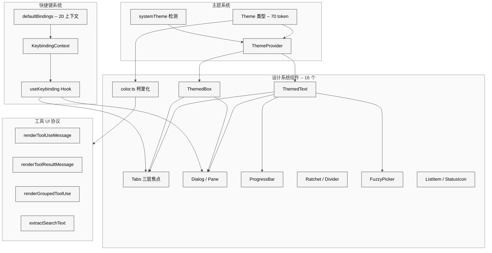
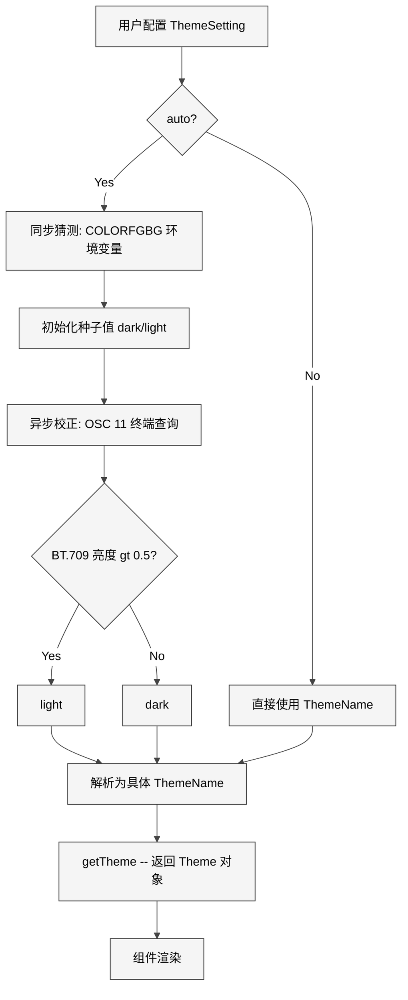
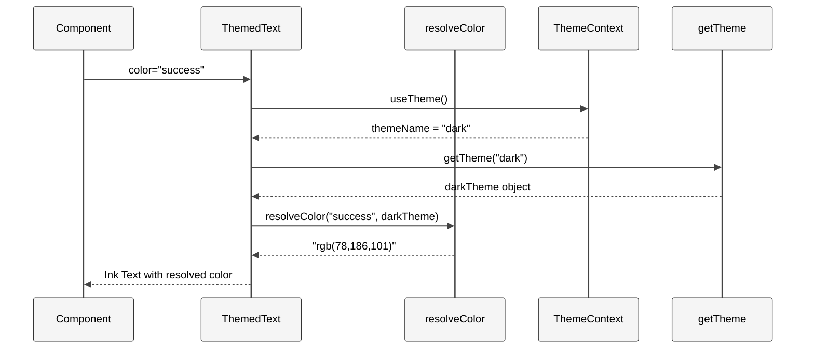
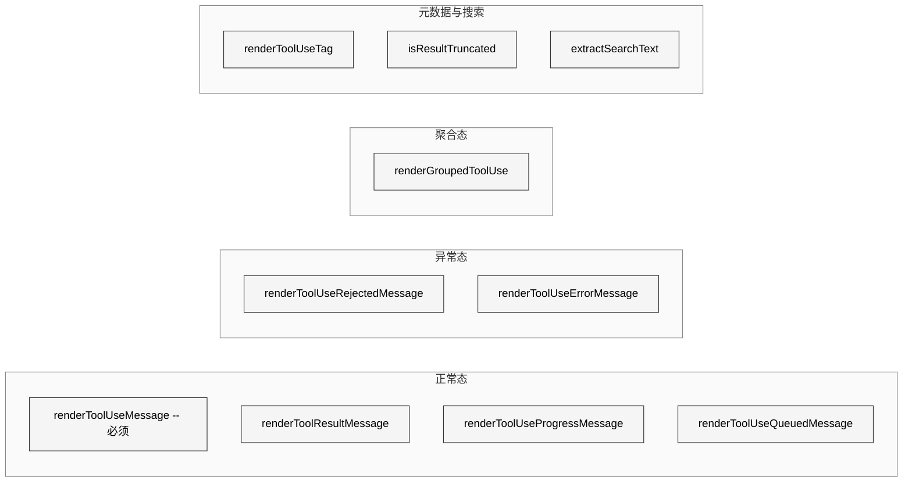
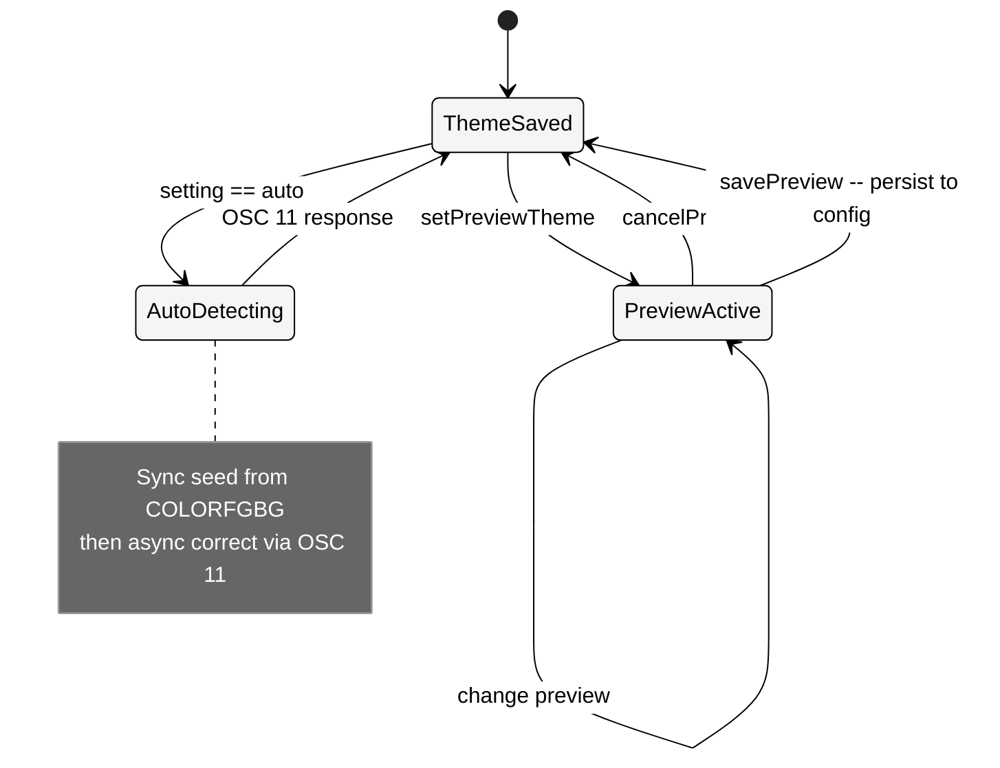

# 第 23 章 设计系统

> 核心提要：终端界面的组件化组织

## 22.1 定位

当你在终端中用 `console.log` 打印几行调试信息时，不需要任何设计系统。但当你的终端应用具备**流式输出、多工具并行进度条、权限确认对话框、Tab 切换面板、模糊搜索选择器、六套主题实时切换**时，情况就完全不同了。

Claude Code（restored-src v2.1.88，1,884 文件，513,216 行 TypeScript）的前端不是一个静态的信息打印终端，而是一个在自研 Ink fork + Yoga 布局引擎之上运行的**高度动态 React 应用**。在第 21 章中，我们剖析了 forked Ink 框架如何将 React reconciler 接入终端渲染管线。本章则聚焦在这个框架之上的另一层抽象：一套完整的**终端 UI 设计系统**。

这套设计系统由三个相互协作的子系统构成：

1. **主题系统**：6 套主题 × 70 个语义化颜色 token，解决"颜色从哪来"的问题
2. **组件库**：16 个设计系统原语 + 1 个颜色工具函数，解决"组件怎么组合"的问题
3. **工具 UI 协议**：Tool 接口中 10 个 render/查询方法，解决"工具 UI 怎么统一"的问题

与这三者平行的，还有一个支撑快捷键交互的**可配置快捷键系统**（14 个文件，20+ 上下文）和一个精简但完整的 **Vim 模态编辑状态机**（5 个文件，约 1,500 行），它们共同构成了 Claude Code 的交互层基石。

<div style="background: #ffffff; padding: 16px; border-radius: 8px; margin: 16px 0;">



</div>

**在 Claude Code 整体架构中的位置**：设计系统处于 Harness 层的最上游——它是用户看到的一切视觉输出的源头。Agent 核心循环（`query.ts`）产出的工具调用和结果，最终都要通过这套设计系统转化为终端像素。Anthropic 官方在 [Harness Design for Long-Running Apps](https://www.anthropic.com/engineering/harness-design-long-running-apps) 中将 Harness 分解为七个组件，其中"UI/UX 层"正是设计系统所在。

---

## 22.2 架构

### 22.2.1 主题系统：70 个语义化颜色 Token

终端应用的颜色管理比 Web 更棘手。Web 有 CSS 变量和成熟的 design token 体系；终端只有 ANSI 转义序列，而且不同终端对颜色的支持差异极大——Apple Terminal 不支持 24-bit 真彩色，用户可能把"红色"重新定义为粉色，色盲用户无法区分红绿。

Claude Code 的解法是定义一个 `Theme` 类型作为**颜色的语义化契约**。

```typescript
// src/utils/theme.ts L4-L89
export type Theme = {
  autoAccept: string
  bashBorder: string
  claude: string           // Claude 品牌橙
  claudeShimmer: string    // 微光效果浅色变体
  permission: string       // 权限确认色
  planMode: string         // Plan 模式色
  text: string             // 主文本
  inverseText: string      // 反色文本
  inactive: string         // 非活跃/禁用
  success: string          // 语义：成功
  error: string            // 语义：错误
  warning: string          // 语义：警告
  diffAdded: string        // Diff 新增（4 级梯度）
  diffRemoved: string
  diffAddedWord: string    // 词级高亮
  diffRemovedWord: string
  red_FOR_SUBAGENTS_ONLY: string   // Agent 色板 x8
  // ... rainbow 色板 x14 (7 色 + 7 shimmer)
  // ... TUI V2 色板 (userMessageBackground, selectionBg 等)
  rate_limit_fill: string
  rate_limit_empty: string
  // 共 70 个 string 属性
}
```

**源码实证纠正**：参考文档（Source Study 第 22 篇）声称 Theme 类型有"80+ 颜色字段"。实际逐行计数 `src/utils/theme.ts` L5-L88，`Theme` 类型共有 **70 个 `string` 属性**——不是 80+。差异来自 v2.1.88 的实际版本可能与文档作者分析的版本不完全相同，或者计数方式将注释行也算入。

几个值得注意的设计决策：

**命名即约束**：`red_FOR_SUBAGENTS_ONLY` 这种"尖叫式"命名不是偶然。它在**类型层面**告诉消费者——这个颜色只该用于子 Agent 的视觉区分。在代码审查中，你立刻会注意到 `theme.red_FOR_SUBAGENTS_ONLY` 出现在非 Agent 上下文中。这比注释更有效，因为注释不会出现在调用点。

**Shimmer 配对**：几乎每个主色都有一个对应的 `*Shimmer` 变体。`claude` / `claudeShimmer`、`permission` / `permissionShimmer`、`inactive` / `inactiveShimmer` 等，用于微光动画——在两个颜色之间交替切换产生闪烁效果。这是一个**面向动效的 token 设计**，在 Web 设计系统中罕见，但在终端场景中是必要的视觉反馈。

**TUI V2 色板**：`userMessageBackground`、`selectionBg`、`messageActionsBackground` 等字段暗示了一个正在进行的 TUI 重构——从传统的前景色渲染向支持背景色块的更丰富视觉层次演进。

### 22.2.2 六套主题的组合策略

```typescript
// src/utils/theme.ts L91-L98
export const THEME_NAMES = [
  'dark', 'light',
  'light-daltonized', 'dark-daltonized',
  'light-ansi', 'dark-ansi',
] as const
```

六套主题按**两个正交维度**组合：

| 维度 | 选项 | 技术差异 |
|------|------|---------|
| 明暗 | dark / light | 文本色白/黑、背景色对调、diff 高亮明度反转 |
| 色彩能力 | 标准 / daltonized / ansi | 24-bit RGB / 色盲重映射 / 仅 16 色 ANSI 命名色 |

**标准主题**使用显式 RGB 值。源码注释（L112-L114）明确说明原因：

```typescript
// src/utils/theme.ts L112-L114
/**
 * Light theme using explicit RGB values to avoid inconsistencies
 * from users' custom terminal ANSI color definitions
 */
```

用户可能把终端的"红色"设成了粉色或任意颜色，所以不能依赖 ANSI 命名色。这是**终端应用开发的第一课**：永远不要假设终端的配色方案。

**ANSI 主题**使用 `'ansi:red'`、`'ansi:blueBright'` 等命名色，适配不支持 True Color 的终端（如某些 SSH 会话、tmux 配置、旧版 PuTTY）。

**Daltonized 主题**最值得一提。它不是简单地调整饱和度，而是**重新选择语义映射**：

```typescript
// src/utils/theme.ts L380
success: 'rgb(0,102,153)',   // Blue instead of green for deuteranopia
```

对红绿色盲（deuteranopia）用户，"成功=绿色" 和 "错误=红色" 无法区分。色盲主题将 `success` 映射到蓝色，`error` 保持纯红——蓝与红对 deuteranopia 用户有足够对比度。同时 `diffAdded` 也从绿色变为蓝色系（`'rgb(153,204,255)'`），确保 diff 视图可用。

<div style="background: #ffffff; padding: 16px; border-radius: 8px; margin: 16px 0;">



</div>

### 22.2.3 Auto 主题与终端暗色检测

`auto` 模式的检测逻辑分两步实现（`src/utils/systemTheme.ts`）：

**第一步：同步猜测**。启动时读取 `$COLORFGBG` 环境变量（rxvt 约定的 `fg;bg` 格式）。这是一个纯同步操作，不阻塞启动：

```typescript
// src/utils/systemTheme.ts L109-L119
function detectFromColorFgBg(): SystemTheme | undefined {
  const colorfgbg = process.env['COLORFGBG']
  if (!colorfgbg) return undefined
  const parts = colorfgbg.split(';')
  const bg = parts[parts.length - 1]
  // 0-6 and 8 are dark ANSI colors; 7 (white) and 9-15 (bright) are light.
  return bgNum <= 6 || bgNum === 8 ? 'dark' : 'light'
}
```

**第二步：异步校正**。`ThemeProvider` 中通过 `watchSystemTheme` 发送 OSC 11 终端查询获取真实背景色 RGB 值，用 ITU-R BT.709 相对亮度公式判断：

```typescript
// src/utils/systemTheme.ts L63-L65
const luminance = 0.2126 * rgb.r + 0.7152 * rgb.g + 0.0722 * rgb.b
return luminance > 0.5 ? 'light' : 'dark'
```

注意 `ThemeProvider` 中的 feature gate：

```typescript
// src/components/design-system/ThemeProvider.tsx L65
if (feature('AUTO_THEME')) {
```

`AUTO_THEME` 特性标志意味着自动主题检测在外部发布版中可以被编译时物理移除（DCE），不增加包体积。

**Apple Terminal 兼容**：在 `src/utils/theme.ts` L617-L619，针对 Apple Terminal 创建了降级的 chalk 实例：

```typescript
// src/utils/theme.ts L617-L619
const chalkForChart =
  env.terminal === 'Apple_Terminal'
    ? new Chalk({ level: 2 }) // 256 colors
    : chalk
```

Apple Terminal 不能正确处理 24-bit 颜色转义序列，必须降级到 256 色模式。这种按终端逐个适配的做法体现了终端应用开发的现实：没有统一标准，只有逐个终端的兼容矩阵。

---

## 22.3 实现

### 22.3.1 ThemeProvider：React Context 与三态预览

主题的 React 层由 `ThemeProvider` + 三个消费 Hook 组成。核心设计不是经典的 `value + setter` 二元结构，而是一个**三态模型**：saved setting / preview / resolved。

```typescript
// src/components/design-system/ThemeProvider.tsx L43-L116
export function ThemeProvider({ children, initialState, onThemeSave }) {
  const [themeSetting, setThemeSetting] = useState(...)
  const [previewTheme, setPreviewTheme] = useState<ThemeSetting | null>(null)
  const [systemTheme, setSystemTheme] = useState<SystemTheme>(...)

  // Preview 优先于 saved setting
  const activeSetting = previewTheme ?? themeSetting
  // 'auto' 解析为具体 ThemeName
  const currentTheme: ThemeName =
    activeSetting === 'auto' ? systemTheme : activeSetting
```

**预览机制**：`previewTheme` 状态允许主题选择器在用户上下翻选时**实时预览**主题效果，而不修改持久化配置。按 Enter 确认（`savePreview`）才通过 `saveGlobalConfig` 写入配置文件，按 Esc 取消（`cancelPreview`）恢复原主题。这避免了用户在浏览选项时意外修改配置。

三个 Hook 暴露了不同粒度的接口：

| Hook | 返回值 | 使用场景 |
|------|--------|---------|
| `useTheme()` | `[ThemeName, setter]` | 普通组件获取已解析主题；setter 接受包含 `'auto'` 的 `ThemeSetting` |
| `useThemeSetting()` | `ThemeSetting` | ThemePicker 需要展示 `'auto'` 作为独立选项 |
| `usePreviewTheme()` | `{ set, save, cancel }` | 控制预览生命周期的完整流程 |

注意 `useTheme()` 返回的第一个值**永远不是 `'auto'`**——它已经被解析为具体的 `ThemeName`。这个设计确保了消费组件不需要关心 auto 的存在。

**React Compiler 痕迹**：源码中大量出现 `const $ = _c(N)` + `$[0] !== xxx` 的模式。这是 **React Compiler**（原 React Forget）的编译产出——自动 memoization。`_c(N)` 创建一个 N 槽的缓存数组，后续通过逐个比较 slot 来决定是否重用上一次的计算结果。这不是手写代码，而是编译时自动注入的优化。由此可见 Claude Code 的 React 代码经过了**两层编译**：TypeScript -> JavaScript（Bun bundler），JavaScript -> 自动 memoized JavaScript（React Compiler）。

### 22.3.2 ThemedText 与 ThemedBox：颜色解析的统一入口

`ThemedText` 和 `ThemedBox` 是整个设计系统的**两个基石组件**。它们的核心职责只有一个：将 Theme key 解析为实际颜色值。

```typescript
// src/components/design-system/ThemedText.tsx L66-L74
function resolveColor(
  color: keyof Theme | Color | undefined,
  theme: Theme
): Color | undefined {
  if (!color) return undefined
  if (color.startsWith('rgb(') || color.startsWith('#') ||
      color.startsWith('ansi256(') || color.startsWith('ansi:')) {
    return color as Color
  }
  return theme[color as keyof Theme] as Color
}
```

`resolveColor` 支持**双通道输入**：既接受 Theme key（如 `'success'`），也接受原始颜色值（如 `'rgb(0,255,0)'`）。这让组件既能享受主题化，又能在必要时绕过主题直接指定颜色。

<div style="background: #ffffff; padding: 16px; border-radius: 8px; margin: 16px 0;">



</div>

**ThemedText 的三层颜色优先级**：

```typescript
// src/components/design-system/ThemedText.tsx L104
const resolvedColor = !color && hoverColor
  ? resolveColor(hoverColor, theme)     // 层 2: TextHoverColorContext
  : dimColor
    ? (theme.inactive as Color)          // 层 3: dimColor fallback
    : resolveColor(color, theme)         // 层 1: explicit color prop
```

1. **explicit `color` prop** — 最高优先级，直接指定
2. **TextHoverColorContext** — 跨 Box 边界的颜色级联。Ink 的样式不会跨 Box 组件继承，但这个 Context 解决了这个问题
3. **`dimColor`** — 使用 `theme.inactive` 颜色。源码注释（L25-L27）明确指出它与 ANSI dim 不同：`dimColor` 使用的是 `theme.inactive` 而非 ANSI dim 属性，因为 ANSI dim 和 bold 不能同时生效

**ThemedBox** 做同样的事情，但面向 Box 组件的六个颜色 prop（`borderColor`、`borderTopColor`、`borderBottomColor`、`borderLeftColor`、`borderRightColor`、`backgroundColor`），每个都经过 `resolveColor` 转换。

### 22.3.3 非 React 场景的颜色工具

不是所有颜色使用都在 React 组件中。日志输出、asciichart 图表、工具 UI 的 renderToolResultMessage（可能在 React 树之外被调用）等场景需要独立的颜色函数：

```typescript
// src/components/design-system/color.ts L9-L30
export function color(
  c: keyof Theme | Color | undefined,
  theme: ThemeName,
  type: ColorType = 'foreground',
): (text: string) => string {
  return text => {
    if (!c) return text
    if (c.startsWith('rgb(') || ...) {
      return colorize(text, c, type)
    }
    return colorize(text, getTheme(theme)[c as keyof Theme], type)
  }
}
```

这是一个**柯里化函数**：先传入颜色和主题，返回 `string -> string` 的着色函数。这样可以预创建着色器在循环中复用，避免每次调用都查表。它接收的是 `ThemeName` 而非 Context——因为它不在 React 树内，必须独立于 React 生命周期运行。

### 22.3.4 Tabs：三层焦点协作模型

Tabs 是设计系统中最复杂的组件（编译后 340 行），实现了一个精密的**三层焦点协作模型**。

```
  +-- Header (focused by default) ------------------+
  |  Model  [Config]  Permissions  Stats            |  Tab/Left/Right 切换标签
  +--------------------------------------------------+
  |  Content area                                     |  Down 进入内容
  |  (Select list, form, etc.)                        |  Up 返回 Header
  +--------------------------------------------------+
```

**第一层：默认 Header 导航**。`initialHeaderFocused` 默认 `true`，Tab/Left/Right 在 Header 区切换标签。对于只使用 Up/Down 的 Select/list 内容，不存在按键冲突：

```typescript
// src/components/design-system/Tabs.tsx L83
const initialHeaderFocused = t1 === undefined ? true : t1;
```

**第二层：opt-in blur/focus 协作**。内容组件调用 `useTabHeaderFocus()` Hook 注册 opt-in。关键实现是引用计数（`optInCount`）：

```typescript
// src/components/design-system/Tabs.tsx L112-L123
const [optInCount, setOptInCount] = useState(0)
const registerOptIn = () => {
  setOptInCount(n => n + 1)
  return () => setOptInCount(n => n - 1)
}
const optedIn = optInCount > 0
```

只有 `optInCount > 0` 时 Down 键才生效。如果旧版 Tab 内容不知道双层焦点的存在，强制启用 Down 键退出 Header 会导致用户按了 Down 之后无法回到 Header。源码注释（`Tabs.tsx` 原始源码注释）明确阐述了这个向后兼容考量。

**第三层：navFromContent 额外放权**。`navFromContent` prop 允许内容区在聚焦时也能用 Tab/Left/Right 切换标签：

```typescript
// src/components/design-system/Tabs.tsx L84
const navFromContent = t2 === undefined ? false : t2;
```

有些内容（如枚举值循环）自己占用了 Left/Right 键，此时不能开启这个选项。但对于纯文本展示的 Tab，开启后用户无需先 Up 回 Header 就能直接切标签。

**对 Agent 开发者的启示**：这种三层 opt-in 模式是终端交互设计的典范。在没有鼠标点击的终端中，快捷键冲突管理是一个系统性问题。Claude Code 的解法是**默认保守，逐层放权**——比 opt-out（默认开启、需主动关闭）安全得多。

### 22.3.5 ProgressBar：亚字符精度

```typescript
// src/components/design-system/ProgressBar.tsx L26
const BLOCKS = [' ', '▏', '▎', '▍', '▌', '▋', '▊', '▉', '█']
```

进度条使用 9 个 Unicode block 字符实现 **1/8 字符精度**：

```typescript
// ProgressBar.tsx 核心逻辑
const whole = Math.floor(ratio * width)     // 完整填充字符数
const remainder = ratio * width - whole      // 尾部小数
const middle = Math.floor(remainder * BLOCKS.length)  // 映射到 0-8
```

这比简单的 `[====    ]` 风格进度条精确 8 倍，在窄终端窗口中尤其重要——宽度仅 20 字符时，传统进度条只有 20 级精度，而 block 字符方案有 160 级。

### 22.3.6 Ratchet：单调递增高度锁

`Ratchet`（棘轮）组件的名字来自机械棘轮只能单方向转动的特性。在终端中，如果组件高度频繁变化（如流式输出时行数增减），会导致下方内容不断跳动：

```typescript
// src/components/design-system/Ratchet.tsx L48-L51
const { height } = measureElement(innerRef.current)
if (height > maxHeight.current) {
  maxHeight.current = Math.min(height, rows)
  setMinHeight(maxHeight.current)
}
```

`Ratchet` 记录历史最大高度并锁定 `minHeight`，保证高度**只增不减**。它还支持 `lock: 'offscreen'` 模式——只在组件滚出可视区域时才锁定，可视时允许自然收缩。

### 22.3.7 Pane 与 Dialog：上下文感知的容器

**Pane** 是所有斜杠命令屏幕（`/config`、`/help`、`/plugins` 等）的标准容器。它的核心设计是**上下文感知**——在 Modal 内渲染时自动省略 Divider：

```typescript
// src/components/design-system/Pane.tsx L39-L49
if (useIsInsideModal()) {
  return (
    <Box flexDirection="column" paddingX={1} flexShrink={0}>
      {children}
    </Box>
  )
}
```

`flexShrink={0}` 的注释引用了 Issue #23592，解释了一个具体的布局 bug：Modal 的绝对定位 Box 没有显式高度，Yoga 布局引擎在 re-render 时会将 `flexGrow=1` 的子元素高度解析为 0，导致内容闪烁消失。

**Dialog** 在 Pane 之上增加了确认/取消交互。关键设计是 `isCancelActive` 开关：

```typescript
// src/components/design-system/Dialog.tsx L22-L28
/**
 * Controls whether Dialog's built-in confirm:no (Esc/n) and app:exit/interrupt
 * (Ctrl-C/D) keybindings are active. Set to `false` while an embedded text
 * field is being edited so those keys reach the field instead of being
 * consumed by Dialog.
 */
isCancelActive?: boolean;
```

当 Dialog 内嵌了 TextInput 时，用户输入 'n' 会被 Dialog 捕获为取消。`isCancelActive=false` 临时禁用 Dialog 的快捷键，让按键透传到文本输入框。

---

## 22.4 工具 UI 协议

### 22.4.1 完整协议：10 个方法覆盖四个维度

在 `src/Tool.ts` L566-L694 中定义了每个工具必须或可选实现的渲染与查询方法。这不是"概念上 6 个方法"的简化理解——实际协议覆盖了**正常态、异常态、聚合态、搜索索引**四个维度：

<div style="background: #ffffff; padding: 16px; border-radius: 8px; margin: 16px 0;">



</div>

| 方法 | 位置 | 必须 | 职责 |
|------|------|------|------|
| `renderToolUseMessage` | L605-L608 | 是 | 渲染工具调用。输入是 `Partial<Input>`——流式传输时参数可能不完整 |
| `renderToolResultMessage` | L566-L580 | 否 | 渲染执行结果。options 含 `tools`, `isTranscriptMode`, `isBriefOnly`, `input` |
| `renderToolUseProgressMessage` | L625-L634 | 否 | 执行中的实时进度 |
| `renderToolUseQueuedMessage` | L635 | 否 | 排队等待执行的提示 |
| `renderToolUseRejectedMessage` | L641-L653 | 否 | 用户拒绝时的自定义 UI |
| `renderToolUseErrorMessage` | L659-L667 | 否 | 执行出错时的自定义 UI |
| `renderGroupedToolUse` | L678-L694 | 否 | 多个并行同类工具调用合并渲染 |
| `renderToolUseTag` | L621 | 否 | 工具调用旁的标签（超时、模型等） |
| `isResultTruncated` | L615 | 否 | non-verbose 模式下是否截断 |
| `extractSearchText` | L599 | 否 | Transcript 搜索索引用的纯文本提取 |

几个关键设计原则：

**Partial Input**：`renderToolUseMessage` 的参数是 `Partial<Input>` 而非 `Input`。在流式传输中，模型可能先返回 `command` 字段，`timeout` 字段还在路上。组件必须能优雅处理不完整输入。

**theme 直传**：所有渲染方法直接接收 `ThemeName` 参数，而非从 React Context 获取。这让工具 UI 可以在 React 树之外渲染（如 transcript 导出场景、headless 模式的 JSON 输出）。

**Fallback 降级**：`renderToolUseRejectedMessage` 和 `renderToolUseErrorMessage` 都是可选的。省略时使用通用的 `FallbackToolUseRejectedMessage` / `FallbackToolUseErrorMessage` 组件。只有需要自定义异常态 UI 的工具（如文件编辑工具展示被拒绝的 diff）才需要实现。

**搜索索引协同**：`extractSearchText` 为 transcript 搜索提供纯文本提取——返回内容必须与 `renderToolResultMessage` 实际渲染内容一致。

---

## 22.5 快捷键系统与 Vim 模式

### 22.5.1 可配置快捷键：20 个上下文

`src/keybindings/` 目录包含 14 个文件，实现了一个完整的可配置快捷键系统。核心是 `defaultBindings.ts`（L32-L340），定义了 20+ 个上下文的默认绑定：

```
Global, Chat, Autocomplete, Settings, Confirmation, Tabs,
Transcript, HistorySearch, Task, ThemePicker, Scroll, Help,
Attachments, Footer, MessageSelector, MessageActions,
DiffDialog, ModelPicker, Select, Plugin
```

每个上下文是一个 `{ context, bindings }` 块，用户可以通过 `keybindings.json` 覆盖。`KeybindingProvider`（L59-L182）维护一个 ref-backed handler registry，通过 `activeContexts` 集合决定哪些快捷键在当前时刻生效。

`useRegisterKeybindingContext` Hook 使用 `useLayoutEffect` 在组件挂载时注册上下文，卸载时注销——这确保了模态组件（如 ThemePicker）能正确覆盖 Global 绑定。

**迁移中的 TODO**：`src/keybindings/useShortcutDisplay.ts` L9 和 `shortcutFormat.ts` L9 都有 `TODO(keybindings-migration)` 标记，说明快捷键系统正在从旧的硬编码模式向新的可配置架构迁移，过程尚未完成。

### 22.5.2 Vim 状态机：类型即文档

`src/vim/` 目录用 5 个文件约 1,500 行实现了一个精简但完整的 Vim 模态编辑器。类型系统是其架构的核心（`types.ts`）：

```typescript
// src/vim/types.ts 核心类型
export type VimState =
  | { mode: 'INSERT'; insertedText: string }
  | { mode: 'NORMAL'; command: CommandState }

export type CommandState =
  | { type: 'idle' }
  | { type: 'count'; digits: string }
  | { type: 'operator'; op: Operator; count: number }
  | { type: 'operatorCount'; op: Operator; count: number; digits: string }
  | { type: 'find'; find: FindType; count: number }
  | { type: 'replace'; count: number }
  // ... 11 种子状态
```

TypeScript 的可辨识联合（Discriminated Union）确保 `switch` 语句对所有状态穷举匹配。状态转换引擎（`transitions.ts`）是一个纯函数，接收当前状态和输入，返回下一状态或执行动作——**没有副作用，完全可测试**。

---

## 22.6 细节

### 22.6.1 React Compiler 的自动 Memoization

设计系统组件中最引人注目的代码模式是 React Compiler 的编译产物。以 `ThemedText` 为例：

```typescript
// src/components/design-system/ThemedText.tsx L81-L122
const $ = _c(10);  // 创建 10 槽缓存数组
// ...
if ($[0] !== bold || $[1] !== children || ...) {
  t8 = <Text ...>{children}</Text>;
  $[0] = bold; $[1] = children; // ...
} else {
  t8 = $[9];  // 命中缓存，复用上次结果
}
```

这比手写 `useMemo` 更细粒度——每个 JSX 元素都可以独立缓存。在终端场景中，token streaming 期间每秒可能触发 30-60 次 re-render，自动 memoization 对渲染性能至关重要。

### 22.6.2 stringWidth 而非 String.length

`Divider` 组件计算标题宽度时使用 `stringWidth(title)` 而非 `title.length`：

```typescript
// src/components/design-system/Divider.tsx L82
const titleWidth = stringWidth(title) + 2
```

这是因为 ANSI 转义序列不占显示宽度，CJK 字符占两个字符宽度，某些 Unicode 组合字符（如 emoji）宽度不规则。终端 UI 中**永远不能用 `.length` 计算显示宽度**。

### 22.6.3 OSC 颜色解析的健壮性

`systemTheme.ts` 中的 `parseOscRgb` 函数处理了多种终端返回的颜色格式：

```typescript
// src/utils/systemTheme.ts L70-L94
function parseOscRgb(data: string): Rgb | undefined {
  // rgb:RRRR/GGGG/BBBB — 1-4 hex digits per component
  // Some terminals append alpha: rgba:.../.../.../ — ignore it
  const rgbMatch =
    /^rgba?:([0-9a-f]{1,4})\/([0-9a-f]{1,4})\/([0-9a-f]{1,4})/i.exec(data)
  // #RRGGBB or #RRRRGGGGBBBB — split into three equal hex runs
  const hashMatch = /^#([0-9a-f]+)$/i.exec(data)
```

不同终端（xterm, iTerm2, Ghostty, kitty, Alacritty, Terminal.app）返回不同格式，有些还附带 alpha 通道。这个函数通过 regex 模式匹配和归一化（`hexComponent` 将任意 1-4 位 hex 映射到 [0,1]）实现了广泛兼容。

### 22.6.4 设计系统组件的零 TODO/HACK

在 `src/components/design-system/` 的 16 个文件中，**没有发现任何 TODO 或 HACK 标记**。同样在 `src/vim/` 的 5 个文件中也没有。这暗示这两个子系统已经相当成熟和稳定。唯一的 TODO 出现在快捷键系统中（`keybindings-migration`），说明快捷键是目前最活跃的重构区域。

---

## 22.7 比较

### 22.7.1 终端 UI 方案对比

| 维度 | Claude Code | Cursor | Aider | Cline | Copilot CLI |
|------|-------------|--------|-------|-------|-------------|
| UI 框架 | 自研 Ink fork + Yoga | Electron (VS Code) | 纯文本 console | VS Code Extension | 纯文本 console |
| 主题系统 | 6 套 x 70 token | VS Code 主题 API | 无 | VS Code 主题 API | 无 |
| 色盲支持 | Daltonized 主题 | VS Code 色盲过滤 | 无 | 无 | 无 |
| 组件化 | 16 原语 + Tool UI 协议 | Web Components | 无 | VS Code WebView | 无 |
| Vim 模式 | 内置状态机 | VS Code Vim 扩展 | 无 | 无 | 无 |
| 快捷键 | 20 上下文可配置 | VS Code keybindings | 硬编码 | 硬编码 | 硬编码 |
| 进度显示 | Unicode block 亚字符精度 | Web 进度条 | Spinner | VS Code 进度 API | Spinner |

**Claude Code 的独特之处**：在纯终端环境中实现了**接近 IDE 的组件化和主题化**。这不是因为 Anthropic 喜欢过度工程，而是因为 Claude Code 的交互复杂度（权限对话框、diff 预览、多 Agent 并行、实时 token 流）确实需要这个级别的抽象。

**优势**：
1. **终端原生**：不依赖任何 IDE 宿主，在任何终端都能运行，CI/CD 环境也适用
2. **极致可控**：自研框架意味着可以精确控制每个像素的渲染行为
3. **Accessibility 内置**：色盲主题、ANSI 降级不是事后补丁，而是架构设计的一部分

**局限**：
1. **维护成本高**：自研框架意味着每个 bug 都需要自己修复，无法依赖社区
2. **学习曲线**：新加入团队的工程师需要理解 Ink fork + Yoga + 自研渲染优化器的完整栈
3. **终端能力天花板**：无论怎么优化，终端 UI 的表达力仍然远低于 Web/native

### 22.7.2 与 Web 设计系统的类比

| Web 概念 | Claude Code 对应 | 差异 |
|----------|-----------------|------|
| CSS Custom Properties | `Theme` 类型 + `getTheme()` | 编译时类型安全 vs 运行时字符串 |
| Design Tokens | 70 个 `Theme` 字段 | 缺少 spacing/typography token（终端字体固定） |
| Headless UI | `useTabHeaderFocus()` | 同样的关注点分离：逻辑 vs 渲染 |
| CSS `color: inherit` | `TextHoverColorContext` | Context 手动实现 Ink 缺失的样式继承 |
| prefers-color-scheme | OSC 11 + COLORFGBG | 终端没有媒体查询，需要手动探测 |
| CSS `@media prefers-reduced-motion` | Ratchet `lock: 'offscreen'` | 终端没有动画 API，但有布局抖动问题 |

---

## 22.8 辨误

### 误解 1："终端应用不需要设计系统"

**事实**：当终端应用的 UI 复杂度超过"打印几行文字"时，设计系统就是必要的。Claude Code 有 16 个设计系统组件 + 70 个颜色 token + 6 套主题——这不是过度工程，而是 complexity taming。没有设计系统，散落在数百个工具文件中的颜色硬编码将导致视觉不一致、主题切换不可能、色盲支持不可行。

### 误解 2："Theme 有 80+ 字段"

**纠正**：Source Study 参考文档声称"80+ 语义化颜色 token"。实际在 v2.1.88 中，`Theme` 类型有 **70 个 `string` 属性**。这仍然是一个庞大的颜色系统，但准确计数很重要。

### 误解 3："dimColor 是 ANSI dim"

**纠正**：`ThemedText` 的 `dimColor` prop 不使用 ANSI dim 属性，而是将颜色替换为 `theme.inactive`。源码注释明确写道："Dim the color using the theme's inactive color. This is compatible with bold (unlike ANSI dim)."。ANSI dim 在某些终端上与 bold 冲突（两者互斥），而 `inactive` 颜色 + bold 可以正常共存。

### 误解 4："工具 UI 协议只有 6 个方法"

**纠正**：实际协议有 **10 个方法**，覆盖正常态、异常态、聚合态、搜索索引四个维度。将其简化为 6 个会遗漏 `renderToolUseTag`、`renderToolUseQueuedMessage`、`isResultTruncated`、`extractSearchText` 四个方法，而这些在实际实现中同样重要。

---

## 22.9 展望

### 22.9.1 正在进行的迁移

快捷键系统中的 `TODO(keybindings-migration)` 标记（出现在 `useShortcutDisplay.ts` L9 和 `shortcutFormat.ts` L9）说明从旧的硬编码快捷键向新的可配置架构的迁移尚未完成。迁移完成后，`fallback` 参数将被移除。

### 22.9.2 TUI V2 演进

Theme 中的 `userMessageBackground`、`selectionBg`、`messageActionsBackground`、`bashMessageBackgroundColor` 等字段暗示了一个正在进行的 TUI 重构。传统终端 UI 主要使用前景色，但新一代终端（Ghostty、kitty、WezTerm）支持更丰富的背景色块和半透明效果。这些新字段预示了 Claude Code 向更视觉丰富的终端 UI 演进。

### 22.9.3 设计系统可改进的方向

如果重新设计，以下是可以改进的方向：

1. **Spacing Token 缺失**：当前的 padding/margin 值（如 `paddingX={1}`, `paddingX={2}`）是硬编码数字，没有语义化的 spacing scale。Web 设计系统通常有 4/8/12/16/24/32 的 spacing token。终端中虽然空间单位固定（字符），但语义化命名（`spacing.sm`/`spacing.md`）仍然有助于一致性。

2. **组件文档化**：16 个设计系统组件缺少集中的 Storybook 式文档。`Pane` 的 JSDoc 注释质量很高（包含 `@example`），但其他组件的文档参差不齐。

3. **Tool UI 协议的类型安全**：`extractSearchText` 返回的文本必须与 `renderToolResultMessage` 一致，但这种一致性只能通过测试保证，没有类型级别的约束。

4. **主题热切换的闪烁**：auto 模式的两步检测（同步猜测 -> 异步校正）在极端情况下会导致主题闪烁——先显示猜测结果，毫秒后切换到正确主题。源码中通过"seed from cache"缓解了这个问题，但并非完全消除。

<div style="background: #ffffff; padding: 16px; border-radius: 8px; margin: 16px 0;">



</div>

---

## 22.10 可迁移的设计模式

### 模式 1：语义化颜色 Token + 命名约束

将颜色定义为语义化 token（`success`、`error`），对受限用途的颜色使用"尖叫式"命名（`_FOR_SUBAGENTS_ONLY`）在类型层面防止误用。

**适用场景**：任何需要主题化的应用。在 Web 中对应 CSS custom properties / design tokens。在 CLI 工具中，即使只有 dark/light 两套主题，语义化 token 也比硬编码 `'\x1b[32m'` 好得多。

### 模式 2：Preview-Save-Cancel 三态

用户选择器（主题、模型等）使用 preview/save/cancel 三态模式：预览时实时应用但不持久化，确认才写入，取消则恢复。

**适用场景**：任何设置面板中的选择器。特别适合终端环境——用户不能通过"看到效果再点保存"来确认，必须通过快捷键明确提交。

### 模式 3：Opt-in 交互注册

当新的交互行为可能与旧组件冲突时，使用 opt-in 注册机制：只有主动调用 Hook 的组件才激活新行为，旧组件保持原有行为。

**适用场景**：向后兼容的交互升级、渐进式功能迁移。Claude Code 的 Tabs 三层焦点模型是这个模式的教科书实现。

### 模式 4：柯里化颜色函数

将颜色解析抽取为独立于 React 的柯里化函数（`color(c, theme) => text => coloredText`），让非 React 代码也能享受主题化。

**适用场景**：任何需要在 React 树之外使用主题颜色的场景——日志输出、CLI 表格渲染、测试快照。

### 模式 5：Tool UI 协议的渐进式可选

核心方法必须实现（`renderToolUseMessage`），其余全部可选并有 fallback。新工具只需实现一个方法就能正常渲染，逐步增加自定义 UI 以提升体验。

**适用场景**：任何插件化的 UI 系统。强制所有插件实现完整的 UI 接口会导致高准入门槛；全部可选又会导致不一致。"一个必须 + 九个可选"的平衡值得借鉴。

---

## 22.11 小结

1. **终端也需要设计系统**：Claude Code 用 70 个语义化颜色 token、6 套主题（含色盲友好）、16 个基础组件证明了终端 UI 可以达到接近 IDE 的组件化水平。关键不在于终端能不能做到，而在于交互复杂度是否要求这么做。

2. **三态预览是终端设置 UI 的最佳模式**：Preview-Save-Cancel 比即时应用更安全，比先保存后恢复更友好。`ThemeProvider` 的实现是这个模式的标准参考。

3. **Tool UI 协议实现了"一个必须 + 九个可选"的渐进式设计**：10 个方法覆盖正常态、异常态、聚合态、搜索索引四个维度，新工具零摩擦接入，同时为复杂工具提供完整的自定义能力。

4. **React Compiler 的自动 memoization 在终端场景中价值巨大**：每秒 30-60 次 re-render 的 token streaming 场景下，手动优化不现实，编译时自动注入的细粒度缓存是务实选择。

5. **终端兼容性是一个没有尽头的适配矩阵**：Apple Terminal 256 色降级、OSC 11 颜色格式解析、COLORFGBG 环境变量猜测——这些"脏活"占据了大量工程时间，但没有捷径。任何试图在终端中构建丰富 UI 的项目都必须面对这个现实。
